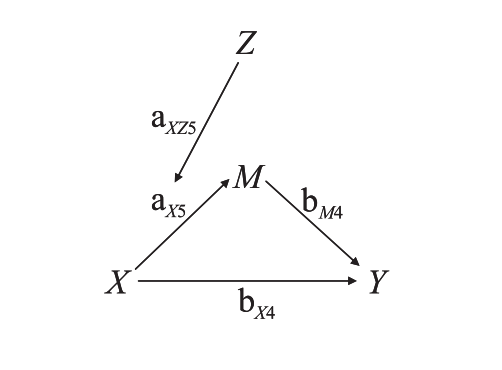

## Einführung

Generative künstliche Intelligenzen haben innerhalb kürzester Zeit ein enormes Wachstum verzeichnen können. Hoch individualisierter Content wie Bilder, Videos, Texte und Code kann in Sekunden nach den Bedürfnissen von NutzerInnen erstellt werden (Du et al., 2023). Allein in den letzten zehn Jahren wurden verschiedenste Netzwerktypen für diverse Anwendungen vorgestellt, wobei vor allem die Transformer-Architektur (Vaswani et al., 2023) und die damit verbundenen Generative Pre-Trained Transformer (GPT; Radford & Narismhan, 2018) für den rezenten Boom des Natural Language Processing (NLP) verantwortlich gemacht werden können.

Wie transformativ diese Entwicklungen sind, wird durch den gut dokumentierten Aufstieg von Diensten wie ChatGPT, Google Gemini oder Anthropic Claude deutlich (Hill-Yardin et al., 2023; Wu et al., 2023). Diese Modelle ermöglichen es NutzerInnen, mittels Text, Audio, Code oder Bildern mit der künstlichen Intelligenz (KI) zu interagieren und eine kontextadäquate Antwort zu erhalten.

Mit diesen Möglichkeiten zeigen intelligente Chatbots wie ChatGPT auch in der Bildung eine immer häufigere Verwendung. Diese Entwicklung bietet durch den universellen Technologiezugang die Möglichkeit, sozioökonomische Ungleichheiten im Bildungszugang zu verringern (Firaina & Sulisworo, 2023). Gleichzeitig aber besteht die Gefahr eines übermäßigen Verlassens auf die Technologien. Gerade wenn faktische Korrektheit in Bildung oder Wissenschaft wichtig ist, sollten auch die Schwächen von Chatbots berücksichtigt werden. Insbesondere, weil es für NutzerInnen äußerst schwierig bis unmöglich ist, zu verstehen, warum und wie ein Modell zu einer bestimmten Antwort kommt.

Seit der Veröffentlichung von ChatGPT 4 kann die KI neben reinem Text auch Bilder generieren, Daten lesen und Analysen selbstständig durchführen. Hier möchten wir analysieren, ob es Strategien gibt, um die Anweisungen an die KI (die sogenannten Prompts) so anzupassen, dass sie eine statistische Analyse selbstständig korrekt durchführen kann.

Insbesondere zu Beginn des Aufkommens von ChatGPT gab es einen regelrechten Hype um Prompting als Fähigkeit. Seitdem kursieren Tipps und Richtlinien zu Prompting-Strategien, aber führen diese zu einem tatsächlichen Unterschied in der Qualität der Antworten in realen Settings? In diesem Artikel gehen wir dieser Frage nach, indem wir versuchen, eine statistische Analyse eines echten Papers zu replizieren. Beginnen werden wir allerdings zunächst mit einer kurzen Einführung zu ChatGPT.

Bevor wir zu den Empfehlungen kommen, sollten wir kurz umreißen, wie ChatGPT überhaupt funktioniert, um zu verstehen, warum Fehler bei der Antwortgenerierung entstehen können.

## Wie funktioniert ChatGPT? GPTs und Large Language Models

Die Idee, die Semantik und Syntax von Sprache mit Language Models vorherzusagen, ist nicht neu. Sprache ist ein vergleichsweise vorhersagbares System, sodass Satzstrukturen bestimmten Regeln folgen. Auch welche Wörter auf einen Teilsatz folgen, lässt sich für uns Menschen relativ gut vorhersagen.

Nehmen wir beispielsweise diesen Teilsatz:

"Ganz schön dunkle Wolken am Himmel, laut dem Wetterbericht fängt es in 30 Minuten an zu \_\_\_\_\_."

Aller Voraussicht nach folgt das Wort "regnen". Es könnte aber auch (wenn auch weniger wahrscheinlich) "hageln" folgen. "lesen" dagegen erscheint uns als relativ unwahrscheinlich.

Scheinbar haben wir ein probabilistisches Modell von Sprache internalisiert, und frühe Language Models wie das "n-gram Model" (Bengio et al., 2003) nutzten genau dieses Prinzip, indem sie ein Modell darauf trainierten, welche Wörter am wahrscheinlichsten auf eine Wortreihe folgen und für einen neuen Text eben jenes Modell verwendeten, um den Text weiter zu generieren. Wenn Wortfolgen allerdings unbekannt sind und das Modell diese während des Trainings nicht gesehen hat, hat ein klassisches n-Gram-Modell Probleme, ein Folgewort vorherzusagen.

Transformer umgehen dieses Problem, indem sie statt ganzer Wortfolgen Wortbestandteile als "Token" in Vektoren umwandeln. Inhaltlich ähnliche Wortteile sind dabei näher im Vektorraum repräsentiert. Um das nächste Wort einer solchen Folge zu generieren, kann also einfach aus der erwarteten Umgebung eine Zufallsziehung betrieben werden, um Texte zu generieren, die das Modell zuvor noch nicht gesehen hatte. Hier wird allerdings auch deutlich, warum zwei generierte Antworten von Large Language Models (LLMs) selbst bei gleichem Prompting nicht identisch sind, da die Generierung immer eine probabilistische Komponente beinhaltet.

Tatsächlich nutzen Transformer noch einen weiteren "Trick", um effizienter große Mengen an Daten (Tokens) zu verarbeiten, die Attention. Diese ist ebenfalls als Matrix repräsentiert und beschreibt das Verhältnis zwischen Tokens, beispielsweise den Bezug eines Adjektiv-Tokens auf das jeweilige Subjekt-Token. Durch diesen Trick können selbst weit entfernte Zusammenhänge für die Antwortgenerierung einbezogen werden.

GPTs, also Generative Pre-Trained Transformer, nutzen diese Architektur, die auf einem großen Datensatz an Sprache trainiert ist (siehe Pre-Trained), und finetunen das Modell für verbesserte Ergebnisse. Selbst wenn der genaue Trainingsprozess und die Architektur von ChatGPT nicht bekannt sind, hat dieses Finetuning grundsätzlich dazu geführt, dass das Antwortverhalten dem eines Chats entspricht und nicht einfach der Prompt fortgeführt wird.

LLMs wie ChatGPT sind also grundsätzlich Modelle mit Billionen von gelernten Parametern, die darauf trainiert sind, Sprache in Form von Tokens vorherzusagen. Faktische Informationen sind dabei größtenteils als Sprache repräsentiert, neue Entwicklungen erlauben aber auch die Faktenrepräsentation und können womöglich die Korrektheit der Modelle weiter erhöhen.

## Eine Sammlung von Prompt Techniken

Die Nutzung von ChatGPT ist mittlerweile im wissenschaftlichen Kontext über verschiedene Fachbereiche weit verbreitet. Datenanalyse, Erstellung von Lehrmaterial, Texterstellung oder auch das Rechnen von Matheaufgaben zählen zu gängigen Anwendungszwecken. Für eine effiziente Verwendung von ChatGPT wird in der Literatur ein "Prompt engineering skill" beschrieben. Diese Kompetenz beschreibt die Fähigkeit für die Erstellung von spezifischen Inputs für LLMs, welche durch ihre gezielte Ausdrucksweise Outputs von höherer Qualität erzeugen (Knoth et al., 2024).

Forschung rund um objektiv bessere Prompt Techniken befasst sich genau damit, welche Prompt Inhalte den Output verbessern. Hier findet ihr eine Reihe von Prompt Techniken und wie diese den Output verbessern sollen (vgl. Petruzzellis et al., 2024):

**Tabelle 1**

*Übersicht von Prompting Strategien*

| **Prompt Technik**         | **Idee**                                                                                                                   | **Prompt Beispiel**                                                                                                                                                                                                                                                                                         |
|----------------------------|----------------------------------------------------------------------------------------------------------------------------|-------------------------------------------------------------------------------------------------------------------------------------------------------------------------------------------------------------------------------------------------------------------------------------------------------------|
| Zero-shot                  | Direkt nach der Lösung fragen                                                                                              | "Provide R code to perform a simple linear regression analysis where we predict 'y' using 'x'."                                                                                                                                                                                                             |
| Role assignment            | Der KI eine Rolle (Perspektive) geben                                                                                      | "You are an experienced R programmer. Provide R code to perform a simple linear regression analysis where we predict 'y' using 'x'."                                                                                                                                                                        |
| Few-shot                   | Beispiellösungen angeben (ohne Lösungsschritte)                                                                            | "Here are some examples of how to perform different types of data analysis in R. Use these examples to provide R code to perform a simple linear regression analysis where we predict 'y' using 'x'." + examples from a r code"                                                                             |
| Chain-of-Thought           | Beispiellösungen mit expliziten Lösungsschritten angeben                                                                   | "Let's perform a simple linear regression analysis in R step by step. We want to predict 'y' using 'x'. We will follow these steps from our example: 1. Load the necessary library 2. Create a data frame with the variables 'x' and 'y' 3. Fit a linear model to the data 4. Summarize the model results." |
| Zero-shot Chain-of-Thought | Die KI dazu auffordern, eigenständig Schritte abzulaufen                                                                   | "Provide R code to perform a simple linear regression analysis where we predict 'y' using 'x'. Let's think step-by-step."                                                                                                                                                                                   |
| Self-consistency           | Mehrmals denselben Prompt eingeben oder nach mehreren Outputs fragen. Die häufigste Lösung als wahrscheinlicher angenommen | "Provide R code to perform a simple linear regression analysis where we predict 'y' using 'x'. Generate multiple versions of the R code to ensure self-consistency.“                                                                                                                                        |

*Note.* Nach Petruzzellis et al., 2024

Die Studie verglich diese Prompt Techniken mithilfe von "Reasoning Tasks", welche ähnlich aufgebaut sind wie mathematische Problemstellungen (Petruzzellis et al., 2024). Eine solche Art von Aufgaben erfordert das Erzeugen von mehreren Gedankenschritten, weswegen sie hierfür genutzt wurde. Zusammenfassend zeigte sich, dass self-consistency prompting in allen Aufgaben häufiger korrekte Outputs erzeugte. Zudem zeigte sich, dass explizites Fragen nach Gedankenschritten (z.B. Chain-of-Thought) ebenfalls im Vergleich zu den verbleibenden Techniken häufiger korrekte Outputs erzeugte.

Generell handelt es sich hierbei um ein relativ neues Forschungsfeld. Es stellt sich daher die Frage, wie dies in komplexeren statistischen Aufgaben umgesetzt werden kann. Mithilfe von Ergebnissen einer explorativen Studie möchten wir weitere Prompt Empfehlungen für die Datenanalyse aussprechen.

Eine kurze Übersicht über die Anwendung von ChatGPT für Datenanalyse findet ihr auch bei OpenAI, hier: <https://help.openai.com/en/articles/8437071-data-analysis-with-chatgpt#>

### Vergleich von Prompt Techniken

Wir haben verschiedene Prompt Techniken auf ChatGPT's Data Analyst angewendet, um euch Empfehlungen machen zu können. Ziel war eine statistische Analyse einer vorliegenden Studie eigenständig von der KI replizieren zu lassen.

### Ein moderiertes Mediationsmodell als Vergleichsstandard

Gui et al. (2024) haben gezeigt, dass besonders Nicht-Experten Schwierigkeiten haben, generierte Outputs zu evaluieren. Für die Evaluierung der Effizienz unserer getesteten Prompts musste also eine Vergleichsbasis festgelegt werden, anhand derer die Qualität des Outputs beurteilt werden konnte. Hierzu diente das Paper von Frischling et al. (2021) als Basis für die Beurteilung der Effizienz der Prompts, bei der untersucht wurde, wie Anfälligkeiten bezüglich irreführender Nachrichten (deceptive news) durch deren Glaubwürdigkeitsbeurteilungen (perceived credibility) unter verschiedenen Niveaus von rechtsorientiertem Autoritarismus (right-wing authoritarianism) und verschwörungstheoretischer Denkweise (conspiracy mentality) variieren. Für die Analyse diente ein First Stage Moderated Mediation-Modell, in welchem der Effekt von irreführenden Nachrichten als exogene Variable indirekt über den Mediator Glaubwürdigkeitsbeurteilungen auf Einstellungsformationen gegenüber eines unbekannten Politikkandidaten getestet wurde sowie der moderierende Effekt von rechtsorientiertem Autoritarismus bzw. verschwörungstheoretischer Denkweise zwischen irreführenden Nachrichten und Glaubwürdigkeitsbeurteilungen.

Als Grundlage für die Erstellung dieses Modells diente die Arbeit von Edwards und Lambert (2007), die den Ansatz eines allgemeinen Pfad-Analyse-Rahmens zur Kombination von Moderation und Mediation beschreiben. Die Bezeichnungen der Effekte und Indizes wurden aus Abbildung 1 (Anhang) übernommen, wie sie in ihrem Artikel dargestellt sind. Die Nummern der Indizes können im jetzigen Kontext ignoriert werden.

**Abbildung 1**

*First Stage Moderation Model*

Pfadmodell für die Kombination von Mediation und Moderation. Pfade sind bezeichnet also Koeffizienten der Regressionsgleichungen, die für die Modellbeschreibung benutzt wurden. Übernommen von *Methods for Integrating Moderation and Mediation: A General Analytical Framework Using Moderated Path Analysis* (p. 4) by Edwards & Lambert (2007).

Die Gleichung der endogenen Variable, auch Ergebnis-Modell genannt, kann definiert werden als $Y = b_{04} + b_{X4} X + b_{M4} M + e_{Y4}$, wobei in unserem Fall $Y$ die Einstellungen, $X$ irreführende Nachrichten und $M$ der Mediator Glaubwürdigkeitsbeurteilungen ist. Der Koeffizient $b_{04}$ ist das Interzept, $b_{X4}$ definiert den Effekt von irreführenden Nachrichten auf die Einstellungen ($c'$-Pfad; direkter Effekt), $b_{M4}$ den Effekt von Glaubwürdigkeitsbeurteilungen auf die Einstellungen ($b$-Pfad) und $e_{Y4}$ den Errorterm für $Y$.

Das Moderationsmodell kann definiert werden als:$M = a_{05} + a_{X5} X + a_{Z5} Z + a_{XZ5} XZ + e_{M5}$

wobei $Z$ die Moderatorvariable ist, die in diesem Fall zweimal für die beiden Moderatoren rechtsorientiertem Autoritarismus und verschwörungstheoretischer Denkweise existiert, $a_{05}$ ist das Interzept, $a_{X5}$ der Haupteffekt von irreführenden Nachrichten auf Glaubwürdigkeitsbeurteilungen ($a$-Pfad), $a_{Z5}$ der Haupteffekt der Moderatorvariable(n) rechtsorientierter Autoritarismus und verschwörungstheoretischer Denkweise auf Glaubwürdigkeitsbeurteilungen, $a_{XZ5}$ der Interaktionseffekt der Moderator(en) auf Glaubwürdigkeitsbeurteilungen, was die Moderation impliziert, und $e_{M5}$ der Errorterm für $M$.

Um das First-Stage-Moderationsmodell zu erstellen, wurde $M$ in Gleichung 1 durch Gleichung 2 ersetzt:

$$ 
Y = b_{04} + b_{X4}X + b_{M4}(a_{05} + a_{X5}X + a_{Z5}Z + a_{XZ5}XZ + e_{M5}) + e_{Y4} 
$$

$$
= b_{04} + b_{X4}X + a_{05}b_{M4} + a_{X5}b_{M4}X + a_{Z5}b_{M4}Z + a_{XZ5}b_{M4}XZ + b_{M4}e_{M5} + e_{Y4} 
$$

$$
= b_{04} + a_{05}b_{M4} + (b_{X4} + a_{X5}b_{M4})X + a_{Z5}b_{M4}Z + a_{XZ5}b_{M4}XZ + e_{Y4} + b_{M4}e_{M5}
$$

Durch Umformen ergibt sich :

$$
Y = b_{04} + a_{05}b_{M4} + a_{Z5}b_{M4}Z + (b_{X4} + a_{X5}b_{M4} + a_{XZ5}b_{M4}Z)X + e_{Y4} + b_{M4}e_{M5}
$$

$$
= [b_{04} + (a_{05} + a_{Z5}Z)b_{M4}] + [b_{X4} + (a_{X5} + a_{XZ5}Z)b_{M4}]X + e_{Y4} + b_{M4}e_{M5}
$$

Hierdurch wird ersichtlich, dass sich manche Aufstellungen der Modelle in einer bestimmten Art manchmal besser für einen gegebenen Sachverhalt eignen als andere. Gerade in der letzten Gleichung ist der indirekte Effekt direkt ablesbar durch.

In der Modellaufstellung stecken alle Annahmen, die man entweder explizit oder implizit gemacht hat. Falls ein Output also nach unserer Definition hoch qualitativ ist, so sollte er alle Hauptparameter, die die implizierte Mediation und Moderation beschreiben, enthalten. Diese Hauptparameter sind die Koeffizienten der oben genannten Hauptvariablen sowie die (multiplizierten) Koeffizienten zur Beschreibung der Mediation ($aX5a_{X5}aX5$​ und $bM4b_{M4}bM4$​ bzw. $aX5⋅bM4a_{X5} \cdot b_{M4}aX5​⋅bM4​)$ sowie die zur Beschreibung der Moderation ($aXZ5a_{XZ5}aX5$

pro Moderatorvariable) sein. Idealerweise sollten diese vollständig und an der richtigen Stelle im Modell platziert sein. In den Bedingungen, in denen zusätzliche Parameter explizit angefragt wurden, wie die Interaktionsterme der Prädiktoren, müssten diese Koeffizienten auch explizit in dem Modell auftauchen, sodass wir einen Prompt als „effizient“ einstufen.

**Tabelle 2**

*Ergebnisse der Strategien*

| Niedrig | Zero-shot no CoT                                   | Zero-shot CoT                                                               | One-shot CoT                                                                               |
|---------|----------------------------------------------------|-----------------------------------------------------------------------------|--------------------------------------------------------------------------------------------|
|         | \- Kein Unterschied zu zero-shot                   | \- Zusätzliche oder weggelassene Hauptparameter                             | \- Detaillierte konzeptuelle Implementation                                                |
|         |                                                    | \- Verwirrung mit Verwendung der Spalten (Crossreference zu anderer Gruppe) | \- Hauptparameter vollständig, aber manchmal zusätzliche Effekte, die nicht erwähnt wurden |
|         |                                                    |                                                                             | \- Korrektes Bootstrapping von indirekte und direkte Effekte                               |
| Mittel  |                                                    |                                                                             |                                                                                            |
|         | \- Hauptparameter unvollständig                    | \- Hauptparameter meist vollständig                                         | \- Hauptparameter vollständig                                                              |
|         | \- Zusätzliche Effekte oder an falscher Stelle     |                                                                             | \- keine indirekten und direkten Effekte berechnet                                         |
|         | \- Keine indirekten und direkten Effekte berechnet |                                                                             |                                                                                            |
| Hoch    |                                                    |                                                                             |                                                                                            |
|         | \- Hauptparameter unvollständig                    | \- Hauptparameter vollständig                                               | \- Kein Unterschied zu zero-shot CoT                                                       |
|         | \- Keine Prädiktorinteraktionsterme                | \- Teilweise Prädiktorinteraktionsterme unvollständig                       | \- Versucht auf Python Bibliothek semopy zuzugreifen                                       |
|         | \- Zusätzliche unerwähnte Effekte                  | \- versucht auf Python Bibliothek semopy zuzugreifen                        |                                                                                            |

## Empfehlungen {#Prompt-Empfehlungen-für-die-Datenanalyse}

### 1. Gib ChatGPT möglichst viele Details für die Analyse, die du durchführen möchtest:

Die Ergebnisse unserer Untersuchung zeigen, dass ein höherer Detailgrad von Prompts die Antworten und Analysen von ChatGPT präziser macht und sich damit verbunden auch die Varianz der Ergebnisse bei der wiederholten Antwortgenerierung durch einen Prompt reduziert. Beides hängt vermutlich damit zusammen, dass der höhere Detailgrad zu geringeren Freiheitsgraden führt.

### 2. Wenn möglich, gib ChatGPT ein Beispiel, wie die Analyse durchgeführt werden soll:

Das Geben eines Beispiels für die Analyse in Form von One-Shot bzw. Few-Shot ist insbesondere dann sinnvoll, wenn ansonsten wenig Informationen über die Analyse gegeben werden. Solltest du sowieso ein Beispiel als Vorgabe haben, wie die Analyse ablaufen sollte, hat die Methode natürlich insbesondere dann Vorteile, wenn du wenig Erfahrungen mit der Analyse hast.

### 3. Lass ChatGPT Chain-of-Thought verwenden:

Sollte ChatGPT seine Gedanken nicht sowieso schon „natürlich“ schrittweise erklären, instruiere ChatGPT entweder in Form eines One-Shot-Prompts oder durch das Hinzufügen von "Chain your thoughts". Bei unseren Analysen nutzte ChatGPT sowohl beim Versuch, CoT zu unterbinden, als auch ohne Hinzufügen eines besonderen Statements CoT, um die Analyseschritte zu planen. Dennoch waren die Ergebnisse beim aktiven Unterdrücken von ChatGPT etwas schlechter im Vergleich, und auch die Literatur empfiehlt die Nutzung. Ein weiterer Vorteil davon, dass ChatGPT die Begründung für seine Analyseschritte darstellt, ist, dass die Schritte idealerweise auch die Nachvollziehbarkeit der Analyse erhöhen.

### 4. Statistisches Verständnis der Analyse bleibt unerlässlich:

Egal welche Strategie angewandt wird, ein grobes Verstehen der Analyse und des Analysegegenstands ist nötig, um evaluieren zu können, ob ChatGPT tatsächlich auch die gewünschte Analyse durchführt. In unseren Beispielen wurden insbesondere bei einem niedrigen Prompt-Detaillevel teils falsche Modelle aufgestellt und unvollständige Analysen durchgeführt. Egal welche Analyse ChatGPT durchführt, die Darstellung der Ergebnisse erfolgt im Regelfall immer so, als wäre ChatGPT sich komplett sicher bei der Methodik und Interpretation. Es bleibt daher leider nicht aus, den Code selbst auf Korrektheit zu überprüfen. ChatGPT zeigt übrigens als Standard nicht den Code an, den es für die Analyse verwendet, klicke daher auf jeden Fall den Schalter bei „Details immer anzeigen“. Zwar waren die Ergebnisse bei uns auch bei hohem Detailgrad nicht perfekt, aber wie vorher beschrieben allgemein besser mit steigendem Detailgrad. Doch um Freiheitsgrade mittels Prompts hinreichend zu reduzieren, ist eine detaillierte Beschreibung der Analyseschritte nötig, was wiederum Fachwissen voraussetzt. Kurzum: ChatGPT kann dir leider nicht das Lernen abnehmen. Solltest du dich jetzt motiviert fühlen, dein statistisches Wissen zu vertiefen, schau dich doch einfach mal auf dieser Website um.

### 5. Wiederhole Analysen mehrfach, um zu überprüfen, ob die Antworten von ChatGPT stabil sind:

ChatGPTs Antworten und Analysen können selbst bei der Verwendung des gleichen Prompts teils deutlich variieren, weswegen es sich lohnen kann, Analysen mehrfach durchzuführen. Berücksichtige dabei, dass ChatGPT auch falsche Antworten geben kann. Gerade für die Nutzung von ChatGPT in der Wissenschaft oder im Studium ist es wichtig, die inhärente Variabilität und die potenziellen Fehler in den Antworten des Modells zu verstehen und zu berücksichtigen. Gerade bei komplexeren Analysen, wie der von uns durchgeführten moderierten Mediationsanalyse, gibt es häufig viele Freiheitsgrade und eine Vielzahl verschiedener Modellparameter, die mögliche Fehlerquellen darstellen können. Bereits wenige Wiederholungen können dabei helfen, ein grobes Bild über die Varianz von Analysen und Ergebnissen zu erhalten.

Abschließend sei noch zu erwähnen: Ein wichtiger Aspekt beim Thema Prompting ist das Ausprobieren. Nehmt unsere Empfehlungen und probiert einfach mal selbst statistische Analysen mit ChatGPT auszuführen. Vielleicht lohnt es sich, eigene Arbeiten von ChatGPT replizieren zu lassen und zu schauen, was die KI so alles anders macht als man selbst. Vielleicht stößt das Modell auf Fehler oder kommt gar nicht erst zu Lösungen. Das würde doch die eigene Kompetenz in Statistik bestätigen. Wer sich direkt weiter vertiefen möchte in Datenanalyse mit KI, kann in den folgenden Abschnitten etwas zur Konsistenz von Outputs lesen (Replizierbarkeit) oder eine Einführung in weitere KI-basierte Tools neben ChatGPT erhalten (Andere KI Tools).

## Quellen

Bengio, Y., Ducharme, R., Vincent, P., & Janvin, C. (2003). A neural probabilistic language model. J. Mach. Learn. Res., 3(null), 1137–1155.

Du, H., Li, Z., Niyato, D., Kang, J., Xiong, Z., Xuemin, Shen, & Kim, D. I. (2023). Enabling AI-Generated Content (AIGC) Services in Wireless Edge Networks (arXiv:2301.03220). arXiv. <http://arxiv.org/abs/2301.03220>

Edwards, J. R., & Lambert, L. S. (2007). Methods for integrating moderation and mediation: A general analytical framework using moderated path analysis. Psychological Methods, 12(1), 1–22. <https://doi.org/10.1037/1082-989X.12.1.1>

Firaina, R., & Sulisworo, D. (2023). Exploring the Usage of ChatGPT in Higher Education: Frequency and Impact on Productivity. Buletin Edukasi Indonesia, 2(01), 39–46. <https://doi.org/10.56741/bei.v2i01.310>

Frischlich, L., Hellmann, J. H., Brinkschulte, F., Becker, M., & Back, M. D. (2021). Right-wing authoritarianism, conspiracy mentality, and susceptibility to distorted alternative news. Social Influence, 16(1), 24–64. <https://doi.org/10.1080/15534510.2021.1966499>

Hill-Yardin, E. L., Hutchinson, M. R., Laycock, R., & Spencer, S. J. (2023). A Chat(GPT) about the future of scientific publishing. Brain, Behavior, and Immunity, 110, 152–154. <https://doi.org/10.1016/j.bbi.2023.02.022>

Knoth, N., Tolzin, A., Janson, A., & Leimeister, J. M. (2024). AI literacy and its implications for prompt engineering strategies. Computers and Education: Artificial Intelligence, 6, 100225. <https://doi.org/10.1016/j.caeai.2024.100225>

Petruzzellis, F., Testolin, A., & Sperduti, A. (2024). Benchmarking GPT-4 on Algorithmic Problems: A Systematic Evaluation of Prompting Strategies (arXiv:2402.17396). arXiv. <http://arxiv.org/abs/2402.17396>

Radford, A., & Narasimhan, K. (2018). Improving Language Understanding by Generative Pre-Training. <https://www.semanticscholar.org/paper/Improving-Language-Understanding-by-Generative-Radford-Narasimhan/cd18800a0fe0b668a1cc19f2ec95b5003d0a5035>