# Weiterführende Funktionen 

Die Arbeit mit <span style="color: darkred;">**Git**</span> bietet noch viel mehr Möglichkeiten als in den einführenden Tutorials beschrieben. In dieser Session beschreiben wir euch ein paar der nützlichsten Funktionen (unter anderem auch wie man den letzten `Commit` rückgängig machen kann, wenn man einen Fehler gemacht hat). Darüber hinaus sind auch in <span style="color: darkred;">**SmartGit**</span> noch weitere Features integriert, die wir hier vorstellen wollen.


##### `Discard`

Über `discard`, können wir Änderungen, die wir an den Dateien vorgenommen haben, verwerfen. Wir würden dadurch wieder zu der Version der Datei zurückkehren, die im letzten `commit` enthalten ist. Wichtig ist, dass es somit hier um Änderungen an der Datei geht, die noch nicht in einem `commit` verarbeitet wurden. 

Um das Ganze zu testen, müssen wir zunächst eine Änderung an einer lokalen Datei vornehmen. Beispielsweise fügen wir in unsere Auswertungsdatei eine neue Zeile Code ein.

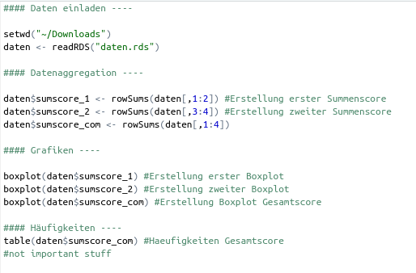

Die Änderung wird nun in <span style="color: darkred;">**SmartGit**</span> angezeigt, indem die Datei als "Modified" bezeichnet wird. 

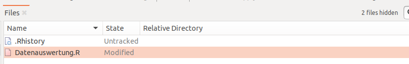
Wir betrachten im Tutorial die Nutzung von `Discard` nur mit Hilfe von <span style="color: darkred;">**SmartGit**</span>. Wer lieber mit dem Terminal arbeitet, klickt [hier](#appendix-a). 

Die durchgeführte Änderung an der Datei könnten wir in einen `commit` packen und dann auch einen `push` durchführen. Hier gehen wir nun aber davon aus, dass wir bemerken, dass unsere Änderung nicht gut ist und wieder rückgängig gemacht werden sollte. Natürlich könnte man die Datei öffnen und die Zeile einfach wieder raus löschen. Das ist in diesem Fall recht simpel, kann aber bei komplexeren Änderungen sehr langwierig sein. Hier kann man über `discard` nun also sehr schnell zum Stand des letzten `commit` zurückkehren. Der Button für den `discard` ist auch in der Werkzeugsleiste enthalten. Am besten wählt ihr vor dem Klicken die betreffende/n Datei/en bereits aus.


Bei der Auswahl gibt es im Dialogfenster dann zwei Unteroptionen:

1. **Discard**: Wenn die Veränderungen nicht mehr benötigt werden, reicht diese Option aus. Hier werden alle Änderungen rückgängig gemacht und die Datei ist wieder auf dem alten Stand des letzten `commits`. 
2. **Discard to Stash**: Hierbei wird die veränderte Datei nicht unwiderruflich gelöscht, sondern dem `Stash` - quasi einem Papierkorb - hinzugefügt. Von hier aus können die veränderten Dateien wieder abgerufen werden, falls man sie doch noch benötigt.

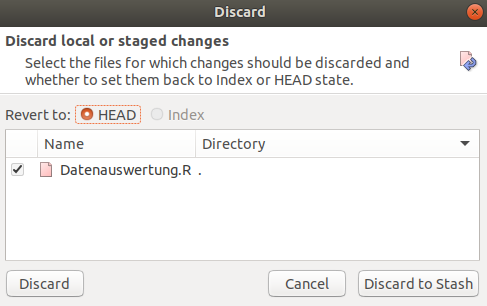

Die bessere Option müsst ihr also von Fall zu Fall selbst wählen. Da es bei der Auswahl vom reinen `discard` keine weiteren Schritte geht, wählen im Tutorial aus Demonstrationszwecken jetzt *Discard to Stash*. Es folgt eine kleine Änderung in der <span style="color: darkred;">**SmartGit**</span>-Ansicht und zwar im Fenster zu den **Branches**. Hier erscheint der neue Punkt **Stashes**. Wenn wir auf diesen draufklicken, werden Datum und Uhrzeit angezeigt.

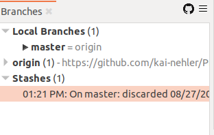

Mit einem Rechtsklick werden die Optionen zum Umgang mit dem `stash` angezeigt. Man kann sich den Inhalt nochmal mit *Show Content in Log* anschauen oder den Stash mittels *Rename Stash...* umbenennen, um sich für spätere Verwendung eine bessere Gedankenstütze zu bauen. Anhand von *Apply Stash...* kann die verworfenen Änderung wieder vorgenommen werden - darauf drücken wir zu Demonstrationszwecken.

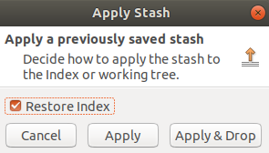 

Hier wird nochmal darin unterschieden, ob der `stash` nach dem Wiedereinfügen bestehen bleibt (**Apply**) (also wir uns auch später nochmal anschauen können, was wir in der Vergangenheit in den Stash gepackt haben) oder ob der Eintrag dann verworfen wird (**Apply & Drop**). Da der Stash ja nur zur Demonstration erstellt wurde, klicken wir auf *Apply & Drop*.

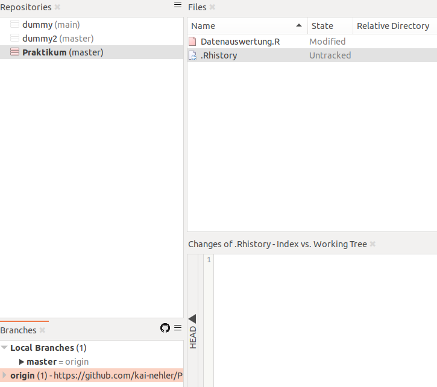 

Wir sehen nun, dass die Datei zur Datenauswertung wieder als "Modified" angezeigt wird - die ursprünglich geschriebene neue Zeile wird jetzt wieder als Teil der Datei angesehen. Weiterhin ist der `stash` aus der Anzeige der `Branches` verschwunden (dies wäre bei nur **Apply** nicht passiert). Da die Änderung an unserer Auswertungsdatei aber nicht wichtig ist, wollen wir sie jetzt endgültig rückgäng machen. Wir wählen also wieder *Discard* und als Option diesmal das reine `discard`. Damit ist die Datei wieder auf dem Stand des letzten `commit`. 

##### `git revert`

Dieser Befehl ist eine sichere Methode, um einen `Commit` rückgängig zu machen. Was genau passiert, werden wir uns in einem Beispiel ansehen. Nehmen wir an, dass wir in unsere Datenauswertung etwas Falsches reingeschrieben haben:

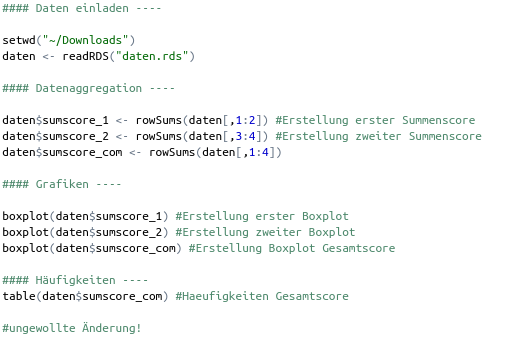
Das ist uns aber erst aufgefallen, als wir die Änderung schon in einen `Commit` gepackt haben.

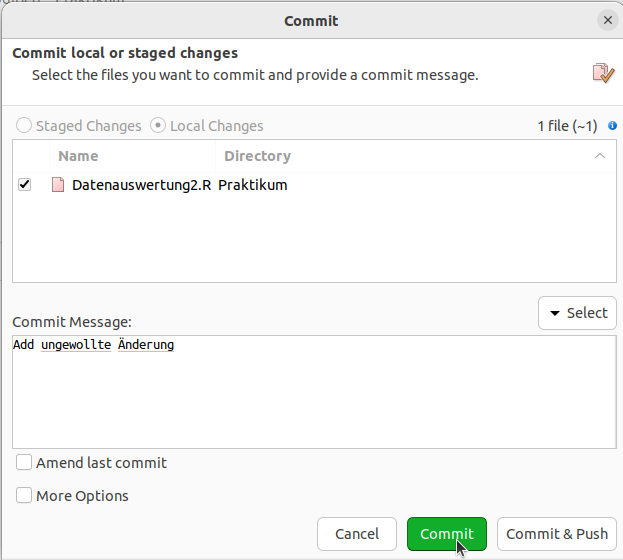

Jetzt wollen wir diesen `Commit` rückgängig machen. Mit <span style="color: darkred;">**SmartGit**</span> geht es wie folgt, falls ihr lieber mit dem Terminal arbeitet, klickt [hier](#appendix-a). 

In <span style="color: darkred;">**SmartGit**</span> müsst ihr oben in der Toolleiste auf *Branch* und dann *Revert* gehen. Hier seht ihr nun ganz oben euren letzten `Commit`, den wir rückgängig machen wollen. Dafür müsst ihr dann nur noch auf "Revert & Commit" gehen. 
Schaut ihr euch nun den `Commit`-Verlauf an, werdet ihr ganz oben den `Commit`sehen, der euren Alten rückgängig gemacht hat.

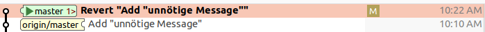

 Das Projekt wurde also nicht auf seinen Status vor dem `Commit` zurückgesetzt, sondern nur der letzte `Commit`. Der "Revert"-`Commit` repräsentiert denselben Status unseres Projekts wie der `Commit` vor unserem ungewollten `Commit`. 

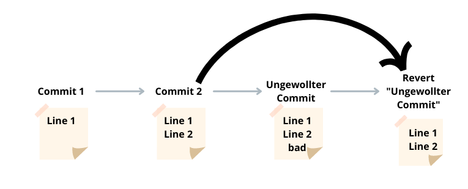
Das gibt uns nun die Möglichkeit, doch noch mit dem ungewollten `Commit` arbeiten zu können, falls wir unsere Meinung ändern sollten. Dieser wird nämlich nicht komplett aus dem Log entfernt. Um das ganze auch auf <span style="color: darkred;">**GitHub**</span> sichtbar zu machen, müssen wir das Ganze noch pushen. 

##### `git reset`

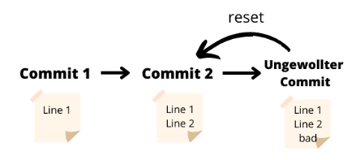

Mit `git reset` kann man `Commits` auch rückgängig machen. Aber was ist der Unterschied zwischen den beiden? Schauen wir uns dafür nochmal an, was `git revert` eigentlich macht und vergleichen es mit unserem neuen Befehl. Der Befehl `git revert` erstellt für euren gelöschten `Commit` einen Neuen, der den alten umkehrt (schaut euch dazu auch nochmal das Flowchart für `git revert` an). Der *HEAD*-Zeiger bewegt sich also vorwärts auf den neuen `Commit`, der den Zustand vor eurem ungewollten `Commit` wiederspiegelt. 
Bei `git reset` bewegt sich der *HEAD*-Zeiger rückwärts. Der ungewollte `Commit` wird vollständig gelöscht, auch aus dem Log. Ihr kehrt tatsächlich zu eurem alten `Commit` zurück und nicht nur auf eine "Kopie" davon.

Wer wissen will, wie man das im Terminal macht, klickt [hier](#appendix-a). 

In <span style="color: darkred;">**SmartGit**</span> funktioniert es recht einfach. Ihr klickt mit einem Rechtsklick auf den `Commit` zu dem ihr resetten wollt. 

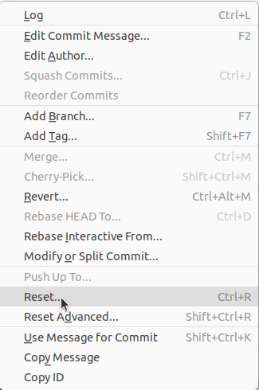 

So könnt ihr auch ganz einfach mehrere `Commits` rückgängig machen, indem ihr einfach auf den `Commit` klickt, den ihr "ganz oben" haben wollt. Anschließend müsst ihr das noch bestätigen und euer Repository ist auf dem Stand des gewollten `Commits`. 


Diese Option ist aber ungeeignet, wenn ihr euren falschen `Commit` schon auf <span style="color: darkred;">**GitHub**</span> gepushed habt. Versucht ihr nämlich nach dem Reset zu pushen, wird euch <span style="color: darkred;">**SmartGit**</span> Folgendes anzeigen: 

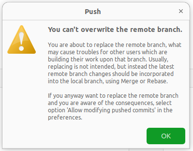

<span style="color: darkred;">**SmartGit**</span>  lässt auch nicht pushen, weil eventuell schon andere Leute auf dem Repository mit euren `Commits` arbeiten könnten. Wenn ihr aber alleine Zugriff auf euer Repository habt oder euch sicher seid, dass noch keiner mit diesen `Commits` gearbeitet hat, könnt ihr die Option: "Allow modifying pushed commits" anstellen. 

##### `Fetch`

`Fetch` ist euch vielleicht schon beim Befehl `pull` als Option aufgefallen. Dort konntet ihr euch zwischen **Pull** und **Fetch Only** entscheiden. 

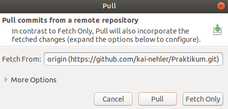

Der Unterschied zwischen den beiden Optionen besteht darin, dass beim **Fetch** lediglich die Informationen darüber abgerufen werden, ob seit unserem letzten `push` Veränderungen an dem Projekt vorgenommen wurden und welche genau das sind. Bei `pull` hingegen werden, wie wir es gesehen haben, sowohl diese Information abgerufen als auch alle Veränderungen auf unseren lokalen Ordner übertragen. Somit arbeiten wir direkt mit den veränderten Dateien weiter, während wir bei `Fetch` noch auf unserem eigenen letzten Stand bleiben. 

<!-- Kann man diese Erklärung noch spezifizieren? __ Finde die Erklärung eigentlich soweit gut, in welche Richtung spezifizieren?-->
<!-- Vor allem sollten wir mal zeigen, wie das aussieht, also eine Veränderung auf GitHub machen und diese dann mal nur mit fetch nutzen. Als das noch ein gemeinsames Skript war, wäre das wohl zuviel gewesen, aber jetzt können wir etwas mehr beschreiben -->
<!-- Und kann man Fetch eigentlich auch in der Konsole machen und was passiert dann? -->

Mit `fetch` können wir also einen Überblick über die Veränderungen erhalten, die seit unserem letzten `pull` von den anderen Kollaborator:innen vorgenommen wurden und auf <span style="color: darkred;">**GitHub**</span> gepushed wurden. Wir können dann nach der Betrachtung überlegen, ob wir die Änderungen auch übernehmen möchten. Beachtet jedoch, dass es zu Konflikten kommen kann, wenn ihr eine Datei nicht aktualisiert, sie dann auf andere Weise selbst verändert und versucht, einen `push` durchzuführen. Dann muss in mühsamer Kleinarbeit der Konflikt gelöst werden. Daher ist der Einsatz von `fetch` eher beschränkt.

##### `gitignore`

Eine weitere nützliche Funktionalität ist die Verwendung von `gitignore`, die wir euch anhand der stets präsenten **.Rhistory** erläutern. Wie wir bereits beschrieben haben, ist die Datei **.Rhistory** eine eigene Historien-Dokumentation über durchgeführte Befehle in <span style="color: darkred;">**R**</span>, aber für unsere Arbeit unnötig. Trotzdem ist sie stets in der Anzeige `Files` in <span style="color: darkred;">**SmartGit**</span> enthalten, wo sie als "Untracked" angezeigt wird. Bisher haben wir sie stets manuell ignoriert, was aber keine zufriedenstellende Lösung ist. Weiterhin kann man Dateien mit Rechtsklick und `Delete` einfach löschen, aber bei der nächsten Arbeit mit <span style="color: darkred;">**R**</span> würde sie wieder auftauchen. Wir müssen <span style="color: darkred;">**Git**</span> also berichten, dass dies eine unwichtige Datei ist, die in alle Aktionen nicht einbezogen werden soll, wofür `gitignore` gemacht ist.

In einer Datei mit dem Namen `.gitignore` können Benennungen von Dateien festgelegt werden, die von <span style="color: darkred;">**Git**</span> - wie es der Name sagt - ignoriert werden. Es ist im Endeffekt eine Liste mit vielen Einträgen. Man kann die `.gitignore`-Datei mit einem normalen Texteditor erstellen, wobei dabei manchmal Probleme auftauchen, da keine Zeichen vor dem `.` im Dateinamen sind oder die Datei als **.gitignore.txt** abgespeichert wird, wodurch sie nicht funktioniert. Auch <span style="color: darkred;">**GitHub**</span> bietet eine Option zum Erstellen dieser Datei. Wir wollen aber betrachten, wie <span style="color: darkred;">**SmartGit**</span> uns dabei behilflich sein kann. 

1. Wir machen einen Rechtsklick auf die Datei und wählen jetzt die Option *Ignore*.
2. In dem Fenster, was sich jetzt öffnet, haben wir zwei Optionen. Wir können entweder die Datei spezifisch zum Ignorieren auswählen (*Ignore explicitly (e.g. 'Makefile')*) oder alle Dateien mit ähnlichem Muster. Um die Muster kümmern wir uns später nochmal und wählen jetzt erstmal spezifisch die Datei. Wir lassen auch den Rest auf den Standardeinstellungen und bestätigen. 

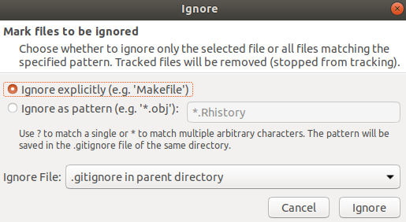
3. Im **Files**-Feld verschwindet nun die Datei **.Rhistory**. Die neue Datei wird uns aber nicht direkt angezeigt. Um sie zu betrachten, wählen wir erst *View* und dann *Show ignored Files*. In der `File` Übersicht werden nun sowohl **.gitignore** als auch **.Rhistory** angezeigt. Wenn wir die Datei **.gitignore** mit Linksklick anwählen, sehen wir in den **Changes** auch ihren Inhalt. Dort werden sowohl **.gitignore** als auch **.Rhistory** angezeigt. 

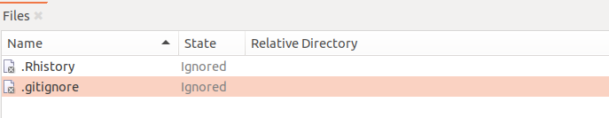
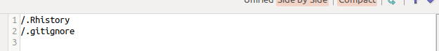

4. Standardmäßig ignoriert sich die `.gitignore`-Datei also auch selbst. Das heißt, dass Änderungen nicht getracked werden und sie auch nicht in einem `push` auf <span style="color: darkred;">**GitHub**</span> enthalten sein kann. Jede:r Teilnehmende am Projekt hätte demnach entweder eine eigene Version der Datei oder auch gar keine, wenn er:sie keine erstellt hat. Wir möchten die Datei jedoch ins Tracking mit aufnehmen. Daher machen wir einen Rechtsklick auf die Datei und klicken *Open*, wodurch sie in einem Texteditor geöffnet wird. Dort entfernen wir dann die Zeile, in der `.gitignore` genannt ist und speichern. Der Status der Datei ist nun nicht mehr "Ignored", sondern "Untracked".

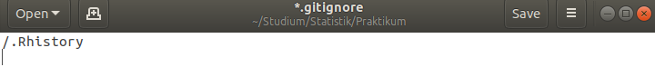
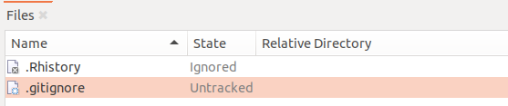

5. Im letzten Schritt können wir nun zunächst die ignorierten Dateien über die Auswahl in *View* wieder verstecken. Zusätzlich müssen wir die `.gitignore`-Datei in einen `commit` packen und diesen auch direkt über *Commit & Push* mit <span style="color: darkred;">**GitHub**</span> synchronisieren. Damit ist die Erstellung der Datei abgeschlossen.


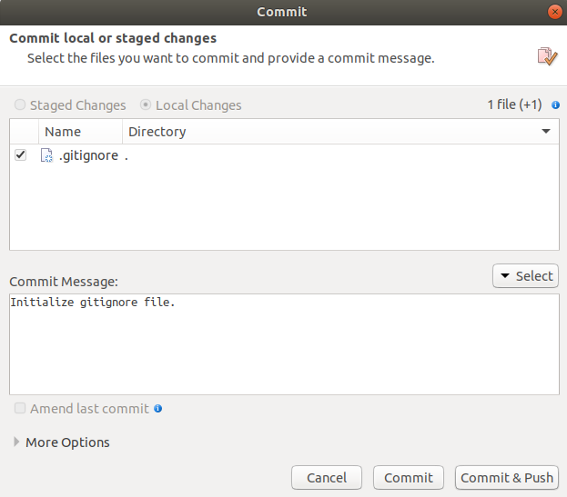

Die Liste von ignorierten Dateien kann stets geändert werden. Dabei beginnt jeder Name einer Datei in einer neuen Zeile. Wir haben schon angemerkt, dass man neben präzisen Dateinamen auch Muster ausschließen kann. Beispielsweise sind Datensätze teilweise sehr große Objekte oder enthalten Daten, die nicht online gestellt werden sollten. Trotzdem wollen wir sie meist am selben Ort wie die Auswertungsskripts haben. Eine Aufnahme in die Liste der ignorierten Dateien ist hierbei optimal. Nehmen wir an, die Daten heißen "a.RData" und "b.RData". Nun könnte man natürlich einfach beide Namen in die `.gitignore`-Datei eintragen. Man kann aber auch den Stern `*` als Platzhalter nutzen. 

```
*.RData
```

Somit werden alle Dateien mit dieser Endung ignoriert. Nehmen wir an, dass wir eine weitere Datei "c.RData" haben, die keine persönlichen Informationen enthält und auch nicht zu groß ist. Diese würde nun auch ignoriert werden, obwohl sie es nicht soll. Ausnahmen in `.gitignore` können über ein Ausrufezeichen gesteuert werden `!`.

```
!c.RData
```

Nun wird nur die eine Daten-Datei getracked. Manchmal gibt es in einem Repository auch Unterordner, die alle Dateien erhalten, die für das Tracking nicht wichtig sind. Diese können dann gemeinsam über den zugehörigen Ordnernamen ausgeschlossen werden.

```
Ordnername/*
```

`.gitignore` ist also hilfreich zum Ordnung halten und kann gleichzeitig persönliche Daten vor einem Upload schützen.

##### `Conflict Solver`

Der Conflict Solver kommt - wie der Name schon verrät - bei der Entstehung eines Konfliktes zum Einsatz. Diese können bspw. entstehen, wenn zwei Personen diesselbe(n) Zeile(n) derselben Datei(en) ändern oder eine Person die Datei löscht, während ein andere diese ändert. 

Für <span style="color: darkred;">**Git**</span> ist natürlich nicht direkt klar, welche der beiden Änderungen nun richtig ist. Dies wird durch das Anzeigen eines Konfliktes gelöst. Im Kontext der Arbeit mit <span style="color: darkred;">**GitHub**</span> muss die Person, die als zweites Änderungen an einer Datei pushen will, den Konflikt lösen. Dies ist generell erstmal logisch, da bei den ersten Änderungen natürlich kein Konflikt auftritt und <span style="color: darkred;">**Git**</span> nicht in die Zukunft schauen kann. Mit <span style="color: darkred;">**SmartGit**</span> wird das Lösen eines Konfliktes zum Glück erleichtert - wir wollen dies an einem Beispiel betrachten. 

**Konflikt erstellen**

Um einen Konflikt lösen zu können, muss man natürlich erstmal einen erstellen. Dafür braucht ihr ein lokales <span style="color: darkred;">**Git**</span>-Repository, das mit einem Remote-Repository auf <span style="color: darkred;">**GitHub**</span> verbunden ist. Wir werden jetzt einen Konflikt in der Datei "Datenauswertung" erzeugen. Das funktioniert wie folgt: 

1. Unsere Datei "Datenauswertung" existiert lokal und auf <span style="color: darkred;">**GitHub**</span>. Natürlich könntet ihr auch eine neue Datei erstellen, aber in diesem Fall bleiben wir bei unserem Beispiel. Wichtig ist nur, dass die Datei lokal und auf <span style="color: darkred;">**GitHub**</span> auf demselben Stand vorliegt.

2. Geht auf <span style="color: darkred;">**GitHub**</span> und ändert etwas an der Datei (hier in Zeile 20) und speichert diese Änderungen. Wir gehen jetzt gedanklich davon aus, dass eine andere Person im Team, einen `shapiro.test()` machen möchte und diesen auch schon remote hinterlegt hat. 


3. Jetzt ändert ihr lokal etwas in der Datei (auch in Zeile 20). Ihr selbst wollt einen `t.test()` mit den Daten durchführen. 

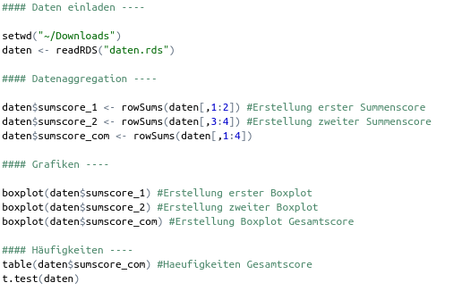
4. Öffnet <span style="color: darkred;">**SmartGit**</span> und führt nur einen `Commit` durch, aber noch keinen `Push`. 


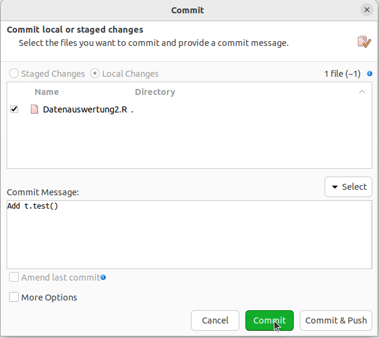
5. Versucht jetzt einen *Push* durchzuführen. Es müsste euch folgende Warnung angezeigt werden: 

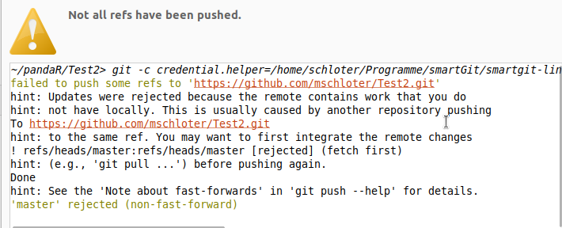  
<span style="color: darkred;">**SmartGit**</span> sagt uns, dass wir zuerst einen *Pull* durchführen sollen (*hint: to the same ref. You may want to first integrate the remote changes*). 
Wenn ihr das jetzt macht, ist ein Konflikt entstanden. 

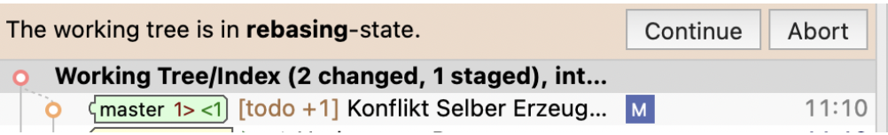

**Konflikt Lösen**

Nachdem <span style="color: darkred;">**SmartGit**</span> den Konflikt in der Datei erkannt hat, wird es euch rechts unten automatisch eine Leiste zur möglichen Konfliktlösung anzeigen. 

Die einfachsten zwei Optionen zwischen denen man wählen kann, um den Konflikt zu lösen sind: *Take Ours* oder *Take Theirs*. 
Dabei entscheidet man sich entweder komplett für seine eigene Version oder die der andere Person.

Das ist natürlich problematisch, wenn man sowohl die Eigenen als auch die des Anderen behalten will. Hier kommt jetzt der `Conflict Solver` ins Spiel. Den Button dazu findet ihr in dem Bereich unten rechts, dort wo ihr auch schon die Optionen *Take Ours* und *Take Theirs* aufgefunden habt.  


Nachdem ihr den `Conflict Solver` gestartet habt, öffnet sich ein weiteres Fenster. Links sieht man unsere eigenen Veränderungen, rechts die der anderen Person und in der Mitte eine mögliche Lösung des Konflikts. 

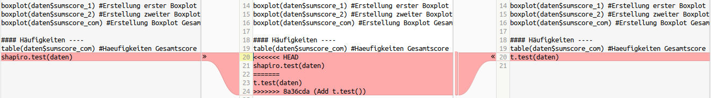
Hier werden beide Veränderungen zusammen in der Datei angezeigt. Falls noch nicht genau ersichtlich ist, wer welche Veränderungen getätigt hat, geht man links oben auf *Base Changes*. Damit erhält man bei großen Veränderungen einen besseren Überblick. Bei unserem Beispiel ist das nicht nötig. 

Wir wollen jetzt die Version mit dem `shapiro.test()` nehmen. Dafür klicken wir auf den Pfeil neben der Zeile und "ziehen" sie in die Mitte. 

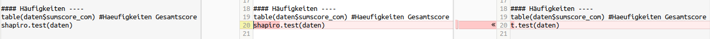
Die Datei in der Mitte sieht jetzt so aus, wie wir sie haben wollten. Also gehen wir auf *Save* und schließen dann den `Conflict Solver`. Dabei taucht folgende Meldung auf: 

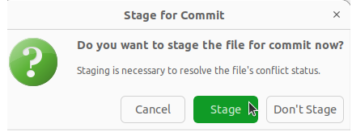

Hier klickt man auf *Stage*, um den Konflikt zu lösen. *Stage* bereitet die Datei für einen `Commit` vor, lädt sie also ins *Staging Environment* wie wir aus dem **Git-Intro** wissen. Würden wir auf *Don´t Stage* klicken, hätten wir zwar unsere Veränderungen in der Datei, diese würden aber bei einem neuen `Commit` nicht mitberücksichtigt werden. Würden wir das machen und anschließend in `git status` schauen, bekämen wir die Nachricht: *changes not staged for commit*.
Das ist kein Fehler, sondern soll uns einfach nur daran erinnern, dass wir unsere geänderte Datei vor dem `Commit` ins *Staging Environment* packen sollen.
Wichtig: Nachdem ihr *Stage* gedrückt habt, muss noch ein `Commit` und ein `Push` durchgeführt werden, um die neue Datei auch auf <span style="color: darkred;">**GitHub**</span> zu haben. Ansonsten droht euch ein größerer Konflikt, wenn jemand anderes noch weiter an derselben Datei arbeitet. Nach dem Push wurde der Konflikt erfolgreich gelöst.

# Fazit und Ausblick

Wie ihr sicherlich gesehen habt, sind <span style="color: darkred;">**Git**</span> und <span style="color: darkred;">**SmartGit**</span> umfangreicher als es auf den ersten Blick scheint. Denn auch dieses Kapitel hat das ganze Ausmaß nur angerissen. Falls ihr euch mal einen Überblick über alle Funktionen von <span style="color: darkred;">**Git**</span> schaffen wollt, schaut in die offizielle <span style="color: darkred;">**Git**</span>-Dokumentation rein. Wir werden in weiteren Tutorials aber weitere Funktionen aufzeigen.

***

## Appendix A 

<details><summary> **Discard - Terminal** </summary>

Ihr wechselt im Terminal auf euer <span style="color: darkred;">**Git**</span>-Repository. 
Mit `git status` könnt ihr euch die Änderungen in eurem Repository anschauen. Wir gehen hier wieder davon aus, dass wir in der Datenauswertung einfach eine Zeile hinzugefügt haben.

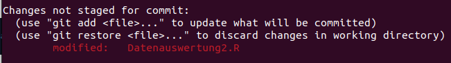
Wie ihr auf dem Bild sehen könnt, zeigt uns das Terminal auch mit "modified" an, dass etwas an unserer Datei geändert wurde. 

Hier gibt es jetzt dieselben zwei Optionen, wie bei <span style="color: darkred;">**SmartGit**</span>. 

1. 

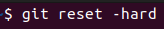 

<!-- Schreiben, dass auch mehr als ein Commit rückgängig gemacht wird.-->
<!-- "The “–hard” option is used in order to reset the files of the index (or the staging area) and of the working directory" und das mit zwei ist dazu da um, "to move the current HEAD to the commit specified" -->  

und dann 

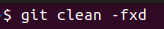 ist genau dasselbe wie **Discard** in <span style="color: darkred;">**SmartGit**</span>. Eure Änderungen werden permanent gelöscht und ihr kehrt wieder auf den Stand des letzten `commit` zurück. Der erste Befehl löscht eure <span style="color: darkred;">**Git**</span>-Historie und der zweite "säubert" euren Working Tree, indem er Dateien löscht, die sich momentan nicht unter Versionskontrolle befinden.  

2. `git stash`: entspricht **Discard to Stash**. Eure Veränderungen werden also erstmal einem "Papierkorb" hinzugefügt und nicht direkt gelöscht.

<!-- Und wie kann man das dann mit Aplly und drop und so regeln? -->

</details>

***

<details><summary> **Revert - Terminal** </summary>

Hierzu öffnen wir über das Terminal unser <span style="color: darkred;">**Git**</span>-Repository und führen den Befehl `git revert HEAD` mit "Strg" + Entertaste aus. Danach gibt euch <span style="color: darkred;">**Git**</span> folgendes aus: 

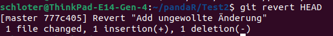
<span style="color: darkred;">**Git**</span> hat also einen neuen `Commit` erstellt, der den Alten rückgängig gemacht hat.

Im Log wird das Ganze vielleicht noch etwas deutlicher: 

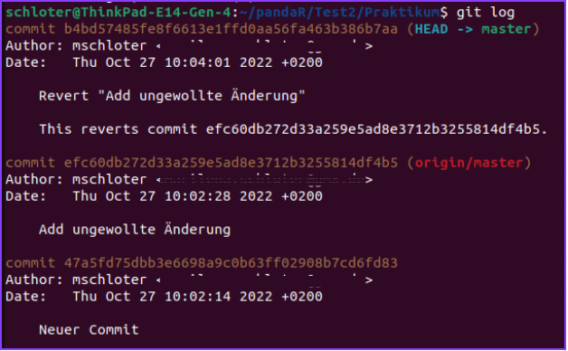
Deswegen heißt der neuste `Commit` auch: Revert "Add ungewollte Änderung". 

</details>

***

<details><summary> **Reset - Terminal** </summary>

Wenn ihr den Befehl `$git reset --hard [Commit]` in eurem <span style="color: darkred;">**Git**</span>-Repository ausführt, wird der Verlauf auf diesen ausgewählten `Commit` zurückgesetzt. Im Gegensatz zu oben bei `git discard` stehen hier vor dem `hard` zwei "- -". Das liegt daran, dass die "-" - Option nur den Index im Working Directory ersetzt und die "- -"- Option direkt zum ausgewählten `Commit` springt.  Die ungewollten `Commits` kann man im Log nicht mehr sehen (wie es oben der Fall ist). Das Log könnt ihr euch mit `git log` anzeigen lassen, mit "q" (quit) könnt ihr es wieder verlassen. es sieht so aus: 


Hier könnt ihr euch einen Überblick über eure getätigten `Commits` verschaffen.
Wie ihr seht, sind die zwei obersten Einträge unsere "Ungewollte Änderung" und der `revert` davon. Das kann irgendwann unübersichtlich werden und euer Log sehr lang machen. 
Deswegen wollen wir jetzt hier einen `reset` durchführen. 

Ihr nehmt den Befehl von oben und setzt in die Klammer die "Nummer" des `Commits` ein auf den ihr zurückkehren wollt, hier "Add Header Tutorial". Diese "Nummer" erfahrt ihr über das Log unter *This reverts commit* und sieht so aus: a6e1f5ecf72a9ff3c13060567875331f1da0822e.
Wenn ihr nach dem Ausführen des Befehls nun wieder in euer Log schaut, sind die letzten zwei `Commits` verschwunden und der oberste `Commit` ist "Add Header Tutorial". 

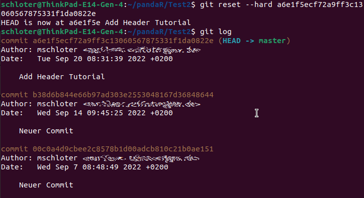


</details>
