# Warum <span style="color: darkred;">**GitHub**</span>?

Im ersten Teil haben wir mit <span style="color: darkred;">**Git**</span> eine Möglichkeit der lokalen Versionskontrolle kennengelernt. Welche Vorteile bietet es nun, noch mehr Tools zu erlernen? Oft arbeitet man an einem Projekt nicht alleine, sondern kollaboriert mit Anderen. Oder man möchte die Dateien nicht nur lokal auf dem eigenen PC haben sondern auch eine virtuelle Version als Backup. <span style="color: darkred;">**GitHub**</span> ist die Lösung für beide Anforderungen!

## Einführung

Ganz grundlegend ist <span style="color: darkred;">**GitHub**</span> eine Seite, die als Host für <span style="color: darkred;">**Git**</span>-Repositories dienen kann. Es gibt natürlich auch andere Anbieter wie <span style="color: darkred;">**GitLab**</span> oder <span style="color: darkred;">**Bitbucket**</span>, aber die Logik hinter diesen ist recht ähnlich. Wir fokussieren uns in dem Tutorial vollständig auf <span style="color: darkred;">**GitHub**</span>. Durch das Verbinden einer lokalen Version des Repositorys ist dieses virtuell hinterlegt - ähnlich einer Dropbox. Dabei kann man ein Repository öffentlich für jeden einsehbar oder auch privat (nur für sich oder Projektpartner:innen einsehbar) zur Verfügung stellen. Während private Repositories hauptsächlich der gemeinsamen Arbeit an einem Projekt dienen, kann man in öffentlichen auch Ansätze der Programmierung explorieren, dadurch für die eigene Arbeit lernen oder auf Probleme und Bugs in gehosteten Projekten hinweisen. <span style="color: darkred;">**GitHub**</span> bietet gute Möglichkeiten, um schnell zu interagieren, auch ohne die Überwindung eine E-Mail schreiben zu müssen. Es gibt auch einige weitere Features wie bspw. ein Tab zum **Projekt Management**. Für Studierende und Mitarbeitende in der Wissenschaft ist die Verwendung kostenlos.

Gegenüber häufig genutzten Dropboxen gibt es verschiedene Vorteile. In diesen ist die Versionskontrolle meist nicht über eine lange Zeit und kostenlos nutzbar. Weiterhin ist die Versionskontrolle in einer Dropbox meist auf jeweils nur eine Datei im Ordner konzentriert und nicht auf den gesamten Stand des Projekts. Nach eigener Erfahrung führt die Kombination von Dropbox und <span style="color: darkred;">**Git**</span> häufiger zu Fehlern und wird daher nicht empfohlen.

Die Arbeit an Dateien wird auch mit einer Verbindung zu <span style="color: darkred;">**GitHub**</span> weiterhin lokal durchgeführt. Dafür werden die im letzten Tutorial erlernten Befehle verwendet. Diese müssen jedoch erweitert werden, damit das Repository auch remote (also online) zur Verfügung gestellt und aktuell gehalten wird.


# GitHub Setup

<span style="color: darkred;">**GitHub**</span> kann direkt über den Webbrowser genutzt werden. Über [https://github.com/](https://github.com/) kann man auf die Seite zugreifen. Im Vergleich zur Eingabeaufforderung ist <span style="color: darkred;">**GitHub**</span> deutlich benutzerfreundlicher aufbereitet. Im Folgenden wird schrittweise erklärt, wie ihr <span style="color: darkred;">**GitHub**</span> einrichten und mit dem lokalen Ordner auf eurem Rechner verbinden könnt.


### Schritt 1: <span style="color: darkred;">**GitHub**</span>-Account erstellen

Um <span style="color: darkred;">**GitHub**</span> nutzen zu können, müsst ihr zunächst einen **GitHub-Account** erstellen. Das kann man [hier](https://github.com/join) machen. Nehmt dafür am besten die studentische E-Mail-Adresse, die ihr auch bereits im letzten Tutorial mit <span style="color: darkred;">**Git**</span> verbunden habt.


### Schritt 2: Neues `repository` erstellen

Nun wollen wir unseren neuen Account natürlich auch nutzen und online ein Repository anlegen. Das richtige Vorgehen hierbei hängt vor der Ausgangssituation ab. Soll ein komplett neues Repository erstellt werden, das noch nirgends existiert? Oder gibt es bereits eine lokale Version, die jetzt aber auch online gehostet werden soll? Mit diesen beiden Fällen beschäftigen wir uns im Folgenden.

#### Fall 1: Lokales `repository` mit <span style="color: darkred;">**GitHub**</span> verknüpfen

Zunächst wollen wir die Situation durchgehen, in der wir uns gerade auch nach dem ersten Tutorial befinden. Wir haben bereits ein lokales Repository mit dem Namen "Praktikum". Dieses soll aber nun auf <span style="color: darkred;">**GitHub**</span> gehostet werden, da wir den Bericht im Praktikum nicht alleine schreiben und daher auch die Auswertung zusammen gemacht werden soll. Um ein neues Repository auf <span style="color: darkred;">**GitHub**</span> zu erstellen, kann man oben rechts in der Menüleiste unter dem Punkt *+* auf *New repository* klicken. In der Abbildung ist die Auswahl zu sehen - natürlich sind bei euch momentan noch keine existierenden Repositories verfügbar.

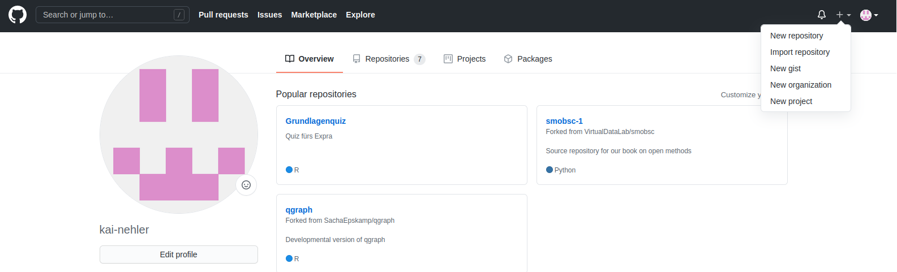

Unter *Repository name* kann ein Name festgelegt werden. Hier nehmen wir am besten den Namen, den das Projekt auch lokal trägt. Unter *Description* kann man eine kurze Beschreibung hinzufügen.
Anschließend steht die Entscheidung an, ob das Repository öffentlich einsehbar oder privat sein soll. Zum Übungszweck stellen wir hier auf *Private*. Bei wichtigen Projekten sollte hier *Public* gewählt werden, damit auch andere User zugreifen können. In einer kleinen Gruppe mit Bekannten kann man auch im privaten Setting gemeinsam an einem Repository arbeiten. 
Weitere Optionen sind das Erstellen einer **README**- und einer **.gitignore**-Datei, sowie die Auswahl einer Lizenz. Mit diesen Möglichkeiten beschäftigen wir uns später (und im nächsten Tutorial) - wählen hier also noch nichts aus. Beachtet, dass es bei einem bereits lokal existierenden Repository auch generell einfacher ist, wenn man das Online-Repository ohne zusätzliche Inhalte wie eine **.gitignore**-Datei kreiert. Beachtet, dass sich das Design von GitHub etwas geändert hat und es leicht anders aussehen könnte, als es auf dem Screenshot abgebildet ist. Die Funktionalität der einzelnen Bestandteile ist jedoch immer noch gleich. Mit einem Klick auf *Create repository* wird dieses dann erstellt.

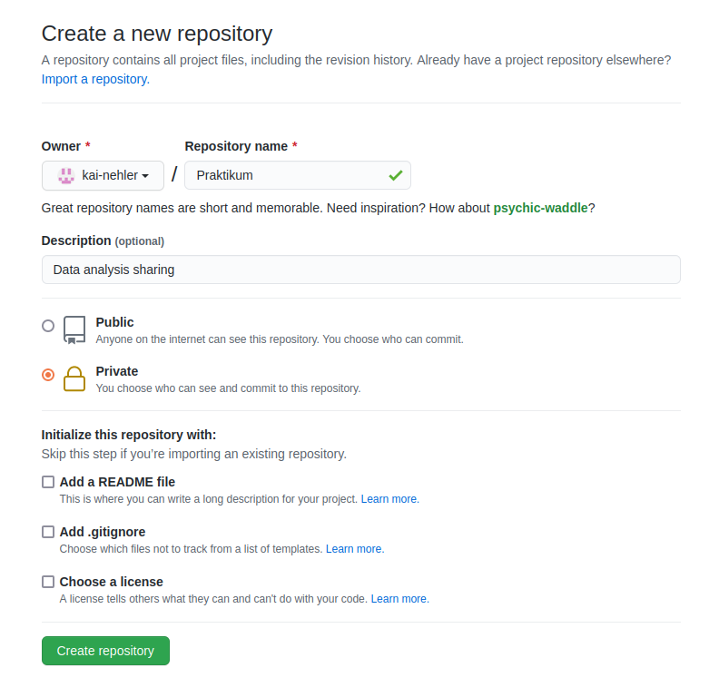

Nachdem wir auf den grünen Button geklickt haben, wird uns sofort das Repository angezeigt. Hier stehen einige gute Hinweise, wie man nun weiter verfahren könnte. Ihr habt als Anleitung natürlich aber dieses Tutorial zur Verfügung. Für uns ist zunächst nur die angezeigte URL wichtig. Diese könnt ihr über das kleine Clipboard am rechten Rand (oder auf anderen Wegen) kopieren. 

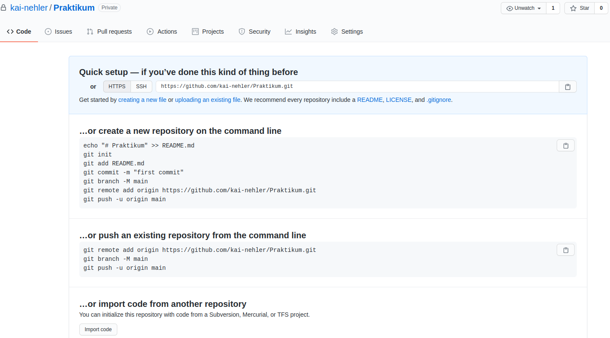

Da wir ein lokales Projekt, unsere Datenauswertung für das Statistik-Praktikum, mit dem Repository auf <span style="color: darkred;">**GitHub**</span> verknüpfen wollen, müssen wir nun zurück in das Terminals unseres Rechners. Zur Erinnerung: Ansteuern eines bestimmten Ordners funktioniert über den Befehl *cd*. Wenn wir dann im Ordner "Praktikum" angekommen sind, können wir diesem die URL unseres <span style="color: darkred;">**GitHub**</span>-Repositorys mitteilen.

```
git remote add origin DieURL
```

Dadurch weiß <span style="color: darkred;">**Git**</span> jetzt, an welchem Ort das Repository online gelagert wird. Um jetzt die Inhalte, die wir lokal schon haben, auch online angezeigt zu bekommen, muss noch ein `push` durchgeführt werden. Diesen Begriff werden wir später nochmal genauer erläutern - wir führen ihn hier aber schonmal aus. `master` ist hierbei der Name eines Branches. Das Prinzip von Branches lernen wir erst in einem späteren [Tutorial](/extras/git/branches) kennen. Wir erwähnen es an dieser Stelle aber, da  <span style="color: darkred;">**Git**</span> und assoziierte Programme an einer sensitiveren Sprache arbeiten (`master` soll daraus aufgrund des Bezugs zur Sklaverei verbannt werden). Es kann also sein, dass dieser Befehl bei euch nicht direkt funktioniert, weshalb wir eine zweite Option darstellen.

```
git push -u origin master
```

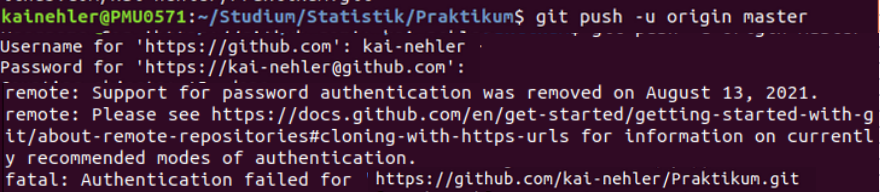

Im Terminal wird man nach dem User-Name und Passwort von <span style="color: darkred;">**GitHub**</span> gefragt, wodurch sicher gestellt wird, dass niemand Fremdes einfach ein Repository mit seinen Dateien überschreibt. Ein einfaches eingeben des Passworts sollte jedoch nicht funktionieren, was ihr auch an der Fehlermeldung oben sehen könnt. <span style="color: darkred;">**Git**</span> hat hier zur zusätzlichen Sicherheit die Personal Access Tokens eingeführt, die dann die Eingabe des Passworts ersetzen. Wir erläutern nun also zunächst, wie das Token erstellt werden kann.

### Personal Access Token {#personalaccesstoken}

 Das besondere an diesem Token ist, dass es an einen Nutzer gebunden ist. Das heißt, es wird diesselben Zugriffsrechte wie der User haben (bei Zugriff auf Content oder Spaces). Er kann auf verschiedenen Geräten genutzt werden, um mit <span style="color: darkred;">**GitHub**</span> zu kommunizieren. Um einen PAT zu erstellen, müsst ihr euch erstmal auf <span style="color: darkred;">**GitHub**</span> einloggen. Dann navigiert ihr zu **Settings** und klickt in der linken Spalte ganz unten **Developer Settings** an. Hier geht ihr dann auf **Personal Access Token** und generiert ein neues Token. 

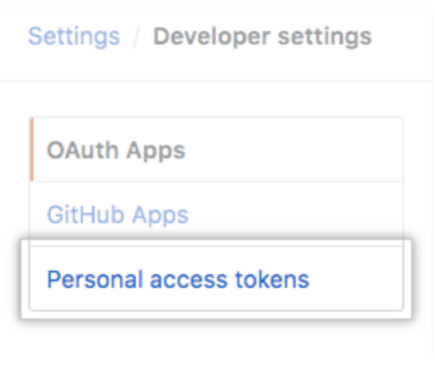

Diesem müsst ihr nun einen Namen geben, der am besten erklärt, wofür ihr dieses Token braucht. Außerdem kann man entscheiden, wie lange das Token gültig sein soll. 

Nun kommt ein wichtiger Part: Ihr wählt Scopes aus und bestimmt so für was euer Token alles benutzt werden kann. 

Für unsere Zwecke reicht es, wenn ihr *repo* auswählt.
Jetzt klickt ihr auf **Generate new Token**. Nun seht ihr euer Token und speichert es in einem nur für euch einsichtbaren Dokument ab. Dieser Schritt ist wichtig, da ihr das Token nicht mehr auf <span style="color: darkred;">**GitHub**</span> ansehen könnt, wenn ihr einmal die Seite geschlossen habt. 

Den erstellten Token können wir jetzt im Terminal als Passwort nutzen. Dann sollte bei dem Befehl auch kein Fehler mehr auftreten.

```
git push -u origin master 
```

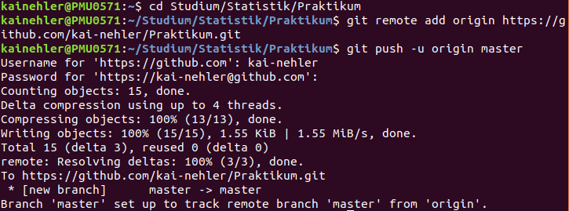

Wenn immer noch eine Fehlermeldung angezeigt wird, sollte der folgende Befehl stattdessen helfen:

```
git push -u origin main
```

Anschließend wird viel Code angezeigt, der die angestrebten Aufgaben ausführt. Wenn ihr nun zurück auf das Browser-Fenster wechselt und hier einen `refresh` durchführt, sollten die Dateien, die ihr lokal erstellt hattet, angezeigt werden. 

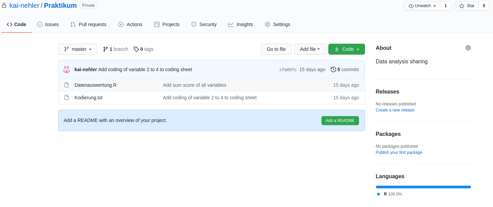


Jetzt sind die lokale Version des Projekts auf dem Rechner und die "Cloud"-Version auf <span style="color: darkred;">**GitHub**</span> miteinander verbunden. Dies ermöglicht, dass mehrere Personen auf das gleiche Projekt zugreifen und jeweils eine lokale Kopie auf ihren Rechnern haben können. Beispielsweise könnt ihr mit euren Kommiliton:innen am gleichen <span style="color: darkred;">**R**</span>-Skript für die Datenauswertung arbeiten und seid somit immer auf dem aktuellsten Stand. Ihr müsst auch nicht mehr mühsam Dateien hin- und herschicken und Änderungen versuchen kenntlich zu machen, das erledigt <span style="color: darkred;">**GitHub**</span> für euch! 


#### Fall 2: Remote existierendes `repository` von <span style="color: darkred;">**GitHub**</span> laden

Bevor wir uns mit weiteren Funktionen im Terminal beschäftigen, gehen wir den anderen bereits beschriebenen Fall durch. Das Repository existiert bereits online und wir wollen eine lokale Version davon erstellen. Um das alleine üben zu können, erstellen wir uns einfach ein neues Repository auf <span style="color: darkred;">**GitHub**</span>. Wir geben ihm den Namen "dummy" und machen es natürlich wieder *Private*. Diesmal wollen wir es auch nicht leer erstellen, sondern bereits eine Datei drin haben. Dafür wählen wir das **README** aus.

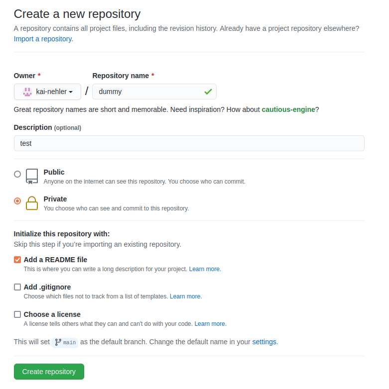

Nach dem Klick auf den grünen Button werden uns nicht wie beim letzten Mal Hinweise zum weiteren Vorgehen angezeigt, sondern wir sehen direkt die Inhalte unseres Repositorys. Das liegt daran, dass diesmal mit der **README**-Datei auch wirklich etwas zum Anzeigen vorhanden ist. Standardmäßig wird für diese Datei als Überschrift der Name des Repositorys gewählt und als Inhalt die kleine Beschreibung, die wir eingegeben haben. Der eigentliche Zweck besteht aber darin, dass man hier Hinweise für die Verwendung geben kann. Beispielsweise könnte das Repository ein Tool erhalten und im **README** eine Beschreibung stehen, wie dieses installiert und dann verwendet werden kann. Der Inhalt kann natürlich auch jederzeit verändert werden (beispielsweise durch einen Klick auf das Stift-Symbol). Wir sind aber nun erstmal mit dem Inhalt zufrieden, da wir ja sowieso nur einen Test durchführen.  

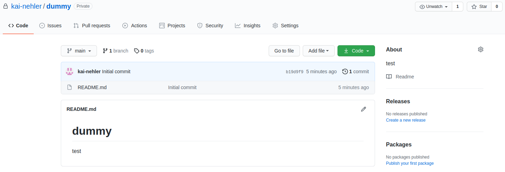

Nun wollen wir die Inhalte, die remote auf <span style="color: darkred;">**GitHub**</span> existieren, auf unseren lokalen Rechner laden. Dafür wechseln wir wieder in das Terminal des Computers. Wir wechseln in den Ordner, der als übergeordneter Ordner für unseren Repository-Ordner dienen soll. Daher gehen wir in den Ordner "Statistik".


Um das Projekt jetzt von <span style="color: darkred;">**GitHub**</span> auf euren Rechner zu laden, benötigt ihr wieder die URL des Projekts. Diese kann man kopieren, indem man auf den grünen Button *code* in der Übersicht des Respositorys klickt und anschließend auf das kleine Clipboard neben dem angezeigten Link. 

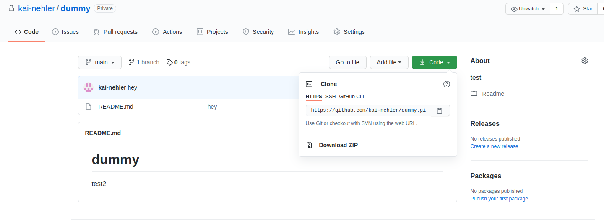

Im Terminal verwenden wir nun den neuen Befehl `git clone` und verweisen auf das online existierende Repository. Wie der Name des Befehls schon sagt, wird ein lokaler Klon vom Ordner, wie er auf <span style="color: darkred;">**GitHub**</span> vorliegt, erstellt. In diesem können wir lokale Arbeiten an den Dateien durchführen. Auch hier werden wir nach Nutzernamen von <span style="color: darkred;">**GitHub**</span> und zugehörigem Passwort gefragt. Ob der Befehl geklappt hat, können wir mit dem Befehl *ls* im Terminal überprüfen, der alle Inhalte eines Ordners anzeigt. Hier sollte der Name "dummy" angezeigt werden. Auch im Dateiexplorer muss der Ordner "dummy" jetzt sichtbar sein.

```
git clone DieURL
ls
```

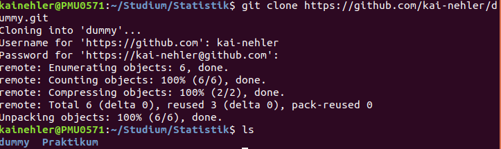

Den eben erstellten Ordner "dummy" werden wir jetzt nicht weiter verwenden - er diente nur zu Demonstrationszwecken. Das weitere Vorgehen orientiert sich am Ordner "praktikum". Damit das gemeinsame Arbeiten am selben Projekt ermöglicht wird, folgen jetzt ein paar Basics zu <span style="color: darkred;">**Git**</span>-Funktionen, die in der Interaktion mit <span style="color: darkred;">**GitHub**</span> nützlich sind.

# Basics

Jetzt wo <span style="color: darkred;">**GitHub**</span> eingerichtet und mit unserem lokalen Ordner "praktikum" verbunden ist, können wir Änderungen an den Dateien vornehmen.  Wenn ihr etwas an dem R-Skript zur Datenauswertung ändert und einen `commit` erstellt (wie wir es im letzten Tutorial gelernt haben), ist diese Änderung zunächst nur in eurer lokalen Datei umgesetzt. Zunächst ergänzen wir also in unserem <span style="color: darkred;">**R**</span>-Skript in Zeile 17 einen Boxplot für den Gesamtscore.

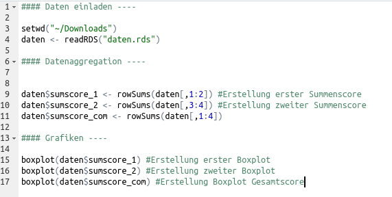

Anschließend wechseln wir im Terminal in den Ordner Praktikum und können den aktuellen `status` unseres Respositorys abfragen. Hier wird wieder angezeigt, dass eine Datei modifiziert ist. Wir nutzen also wieder *add* und anschließend *commit*. 

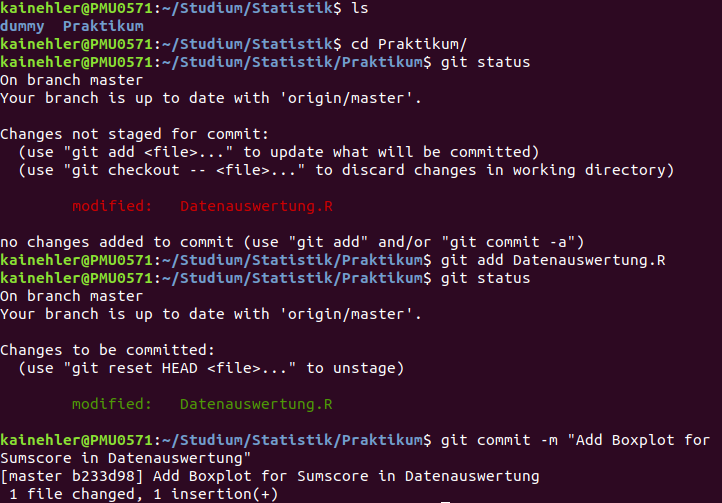

Die Änderungen sind, wie bereits gesagt, nun erstmal lokal. Für eine Änderung online wird der folgende Befehl benötigt:

### `Push`

Sobald ihr alle eure Änderungen vorgenommen und anhand von `commit` in <span style="color: darkred;">**Git**</span> geladen habt, können diese über den Befehl `push` auf <span style="color: darkred;">**GitHub**</span> hochgeladen werden. Wir werden hierbei wieder nach <span style="color: darkred;">**GitHub**</span> Nutzername und Passwort gefragt.

```
git push
``` 

Das Terminal zeigt uns nun noch einigen Code an, in dem der `push` ausgeführt wird. Wir können nun auch einmal testen was passiert, wenn wir keine Änderung an unseren Dateien vornehmen, aber trotzdem einen `push` anweisen. Hier weist uns das Terminal darauf hin, dass bereits alles auf <span style="color: darkred;">**GitHub**</span> im aktuellen Zustand ist.

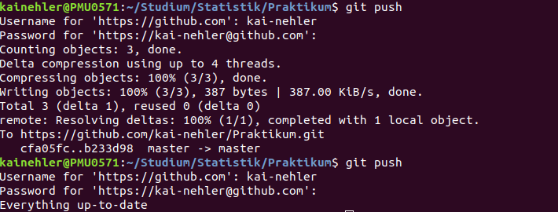

Eure Änderungen sind nun auf <span style="color: darkred;">**GitHub**</span> für andere einsehbar. Das hat den Vorteil, das nun auch eure Projektpartner:innen ihre lokalen Kopien des Projekts hinsichtlich eurer Veränderungen aktualisieren können. Wie das funktioniert, lernen wir mit dem nächsten Befehl.

### `Pull`

Anhand eines `pull`s wird immer die jeweils aktuellste Version des Projekts von <span style="color: darkred;">**GitHub**</span> heruntergeladen, damit der lokale Ordner auf dem neusten Stand ist. Dabei werden alle `commits` und Änderungen, die von anderen Personen vorgenommen wurden, mit der lokalen Version abgeglichen und übernommen. Um einen `pull` durchzuführen, muss man diesen im Terminal ausführen.

```
git pull
```

So wird der lokale Ordner aktualisiert und es können Änderungen an den Dateien vorgenommen werden. Da niemand anderes Änderungen durchgeführt hat, wird hier angezeigt, dass unser Repository bereits auf dem neuen Stand ist. 


Um eine Änderung zu simulieren, ohne eine andere Person zu benötigen, rufen wir unser Repository über <span style="color: darkred;">**GitHub**</span> auf. Bisher ist im Praktikumsordner noch keine **README**-Datei angelegt. Ein grüner Button bietet uns aber direkt das Hinzufügen dieser Datei an. Nach einem Klick auf *Add README* werden wir auf eine Seite gesendet, bei der die Datei erstellt werden kann. Als Titel ist standardmäßig der Name des Repositorys eingebaut und die erste Zeile enthält unsere angelegte Beschreibung. Wir führen hier nun erstmal keine Änderung durch. Am unteren Ende der Seite wird nach das `commit` durchgeführt. Dafür brauchen wir, wie auch im Terminal eine Message, die hier auch standardmäßig vorgeschlagen wird, und eine Auswahl des **Branches**. Mit diesen beschäftigen wir uns erst später und bleiben also bei dem default. Nun klicken wir auf den grünen Button *commit new file*. Wir gelangen zurück in die Übersicht und sehen, dass eine **README**-Datei angelegt wurde. 

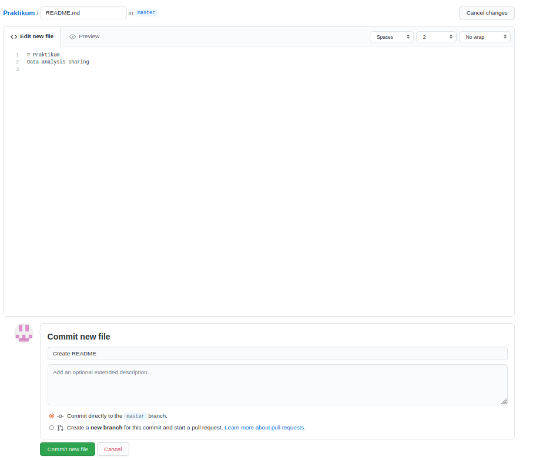

Um dieses File auch lokal zu erhalten, muss nun ein `pull` durchgeführt werden. Wir gehen zurück ins Terminal und führen den Befehl nochmal aus. Diesmal erhalten wir einigen Code, der beschreibt, dass eine Datei in unser lokales Repository hinzugefügt wurde. 

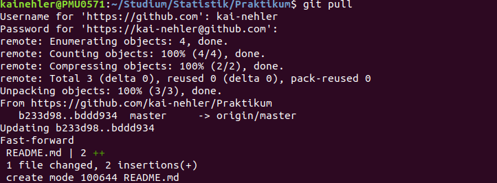


Eine kleine Empfehlung für die normale Arbeit an einem Repository: Bevor ihr etwas an einer Datei ändern möchtet, ist es wichtig, dass ihr immer mit der aktuellsten Version des Projekts arbeitet. Dadurch werden alle Änderungen berücksichtigt, die andere Personen, die ebenfalls am Projekt arbeiten, erstellt haben. Daher sollte jeder Arbeitstag mit einem `pull` starten.


# Weitere Funktionen von <span style="color: darkred;">**GitHub**</span>

Wenn wir uns einmal die Aufbereitung von <span style="color: darkred;">**GitHub**</span> auf der Webseite anschauen, so finden wir einige Menüpunkte. Im Folgenden sind die Wichtigsten kurz aufgeführt.


### Settings

Der wohl wichtigste Tab neben dem Code sind die Einstellungen. Hier werden Zugangsrechte und Inhalte des Repositories verwaltet. Mit den Zugangsrechten wollen wir uns nun auch zuerst beschäftigen.

#### Invite a collaborator

Bisher greifen wir, auch wenn das Projekt online auf <span style="color: darkred;">**GitHub**</span> bereitsteht, nur alleine auf unser Repository zu. Da wir im Praktikum aber mit anderen Personen daran arbeiten möchten, muss dieses natürlich für diese freigegeben werden kann. Wenn ihr euer "praktikum"-Projekt mit euren Kommiliton:innen teilen wollt, müsst ihr sie als **collaborators** zum Projekt hinzufügen.

Über den Menüpunkt *Settings* könnt ihr links *Manage Access* auswählen. Unten im Bild erscheint dann der grüne Button *Invite a collaborator*. Personen, die mit euch am Projekt arbeiten sollen, könnt ihr nun via *username*, *full name* oder *e-mail* hinzufügen. 

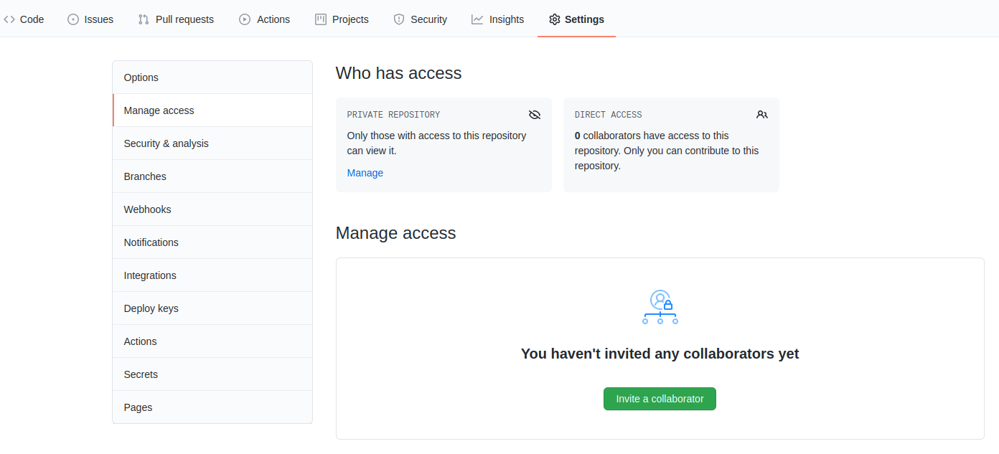


#### Als **collaborator** einem Projekt beitreten

Wenn ihr von der Person, die das <span style="color: darkred;">**GitHub**</span>-Projekt erstellt hat, als **collaborator** hinzugefügt worden seid, erhaltet ihr eine E-Mail mit einem **Einladungs-Link**. Wenn ihr diesen aufruft, könnt ihr über euer <span style="color: darkred;">**GitHub**</span>-Profil dem Projekt beitreten. Natürlich benötigt ihr dafür zunächst einen Account.

Als nächstes müsstet ihr euch eine lokale Version des bereits bestehenden Projekts auf euren Rechner herunterladen. Dies könnt ihr wie oben unter **Schritt 2** mit *git clone* im zweiten Fall beschrieben machen. Anschließend könnt ihr die üblichen Befehle `commit`, `pull` und `push` nutzen. Wie bereits erwähnt, solltet ihr vor jedem Start einer Bearbeitung einen `pull` durchführen, um auf dem aktuellsten Stand zu sein. 


### Issues

**Issues** kann man verwenden, um `todos`, `bugs`, `feature requests` und andere Funktionen von <span style="color: darkred;">**GitHub**</span> zu tracken, also nachzuverfolgen. Sie funktionieren wie Nachrichten, die zwischen den **collaborators** eines Projekts oder zwischen anderen Anwender:innen ausgetauscht werden können. 

Ein **Issue** besteht meist aus einem **Titel** und einer **Beschreibung** des Problems. Diese können mit verschiedenen Farben versehen und somit thematisch eingeordnet werden. Andere **collaborators** können diese **Issues** kommentieren und somit Hilfestellungen oder Feedback geben.

Für die Arbeit an einer gemeinsamen Auswertung könnte das zum Beispiel bedeuten, dass eine Person festhalten kann, dass ein Auswertungsschritt bei ihr nicht funktioniert. Die Person, die den Auswertungsschritt geschrieben hat, kann dann nochmal prüfen, eventuell den Code ändern oder Hilfestellung geben.

### Project boards

Mithilfe von **Project boards** können **Issues** organisiert und priorisiert werden. Für bestimmte Arbeiten oder Checklisten können **Project boards** und mit diesen maßgeschneiderte **Workflows** erstellt werden. **Project boards** können individuell aufbereitet und angerichtet werden, so dass es zu den persönlichen Präferenzen passt. Sie helfen also vor allem bei größeren Projekten beim Management.

# Fazit und Ausblick

In diesem Tutorial haben wir gelernt, dass wir unsere lokalen Repositories mit einer online vorliegenden Version synchronisieren können. Damit ist die Kollaboration mit anderen einfach möglich. Im nächsten Abschnitt werden wir uns eine schönere Nutzeroberfläche (im Vergleich zum Terminal) für unser lokales Repository anschauen.
