# Warum <span style="color: darkred;">**Git**</span>?

Stellt euch die typische Ordnerstruktur Studierender bei der Abgabe einer Haus- oder Abschlussarbeit vor. Die einzelnen Dateien heißen wohl in den meisten Fällen "finale_version", "finale_version2" und "wirklich_finale_version". Neben der Verwendung einer großen Menge an Speicherplatz kann dies auch dazu führen, dass man sich fragt, welche Version wirklich die letzte war.  

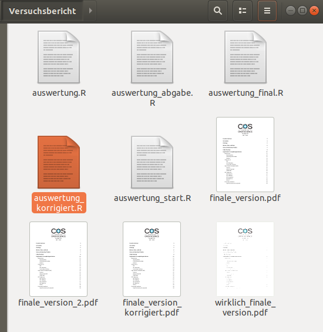

Bei Auswertungs-Skripten von Daten sieht das meist nicht anders aus. Mit <span style="color: darkred;">**Git**</span> wollen wir euch eine Möglichkeit zeigen, wie diese Menge an verschiedenen Daten nicht entstehen muss und sogar wie die Änderungen durch Ergänzungen oder Korrekturen stets dokumentiert und benannt werden können. Es muss also für jedes verwendete Dokument nur ein einzelnes File geben, zu dem man die Historie jederzeit nachvollziehen kann.


## Einführung

Ganz grundlegend ist <span style="color: darkred;">**Git**</span> also eine Software, die der Versionsverwaltung dient. Zurzeit ist es das weltweit am meisten eingesetzte Verwaltungssystem und gilt auch in der Softwareentwicklung als state-of-the-art. Es wurde von Linux-Kernel-Entwickler Linus Torvalds entwickelt und wird auch für das Management des Linux-Codes verwendet. Ein Vorteil besteht dabei trotzdem darin, dass es plattformunabhängig ist, also auf allen Betriebssystemen eingesetzt werden kann. Außerdem wurde es unter der freien GNU-GPLv2-Lizenz veröffentlicht und kann dadurch - wie auch <span style="color: darkred;">**R**</span>- von uns kostenlos verwendet werden. Dabei braucht man zunächst auch keine Unterstützung eines Servers - die Software läuft auf dem eigenen PC als lokale Versionskontrolle. Natürlich kann man zur Kollaboration auch eine Online-Variante verwenden, doch dies wird in späteren Teilen des Tutorials gezeigt. <span style="color: darkred;">**Git**</span> ist ein schnelles und leistungsfähiges Programm. Zunächst ist ein Invest in das Erlernen der Befehle und Strukturen unvermeidlich, doch danach kann es den Alltag in der Erstellung von Skripten stark vereinfachen.

Die Anwendung von <span style="color: darkred;">**Git**</span> wollen wir natürlich an einem anwendungsnahen Beispiel erläutern. Abschlussarbeiten schreiben die meisten Psychologiestudierenden typischerweise in **Microsoft Word**, für das <span style="color: darkred;">**Git**</span> jedoch nicht optimiert ist. Ein **Word**-Dokument kann zwar problemlos in einem <span style="color: darkred;">**Git**</span>-Ordner existieren, aber die Änderungen nicht gut ins Tracking einbezogen werden. Für eine optimale Verwendung im Rahmen einer Abschlussarbeit müsste diese zunächst in einem **.txt**-Dokument geschrieben und erst zum Abschluss in ein **Word**-Dokument kopiert werden, was ein zusätzlicher Aufwand wäre. Im Gegensatz zu **Word** ist die Verwendung von **LaTeX** in <span style="color: darkred;">**Git**</span> optimiert, falls jemand es verwendet - **LaTeX** ist allerdings kein Teil dieses Tutorials (eventuell wird es später hierfür ein eigenes geben). Der sofortige Einsatz im Rahmen unseres Studiums ist für alle bei <span style="color: darkred;">**R**</span>-Skripten zur Auswertung von Studien möglich, weshalb wir uns in diesem Beispiel an einer (oberflächlichen) Erstellung orientieren.


# Setup

Damit ihr <span style="color: darkred;">**Git**</span> mit eurem  Computer verwenden könnt, muss zunächst natürlich das Programm installiert und aufbereitet werden. Wir starten also mit einer schrittweisen Einleitung zum **Setup**:


### Schritt 1: <span style="color: darkred;">**Git**</span> installieren

Zunächst einmal muss <span style="color: darkred;">**Git**</span> auf dem lokalen Rechner installiert werden. Das Programm könnt ihr [hier](https://git-scm.com/book/en/v2/Getting-Started-Installing-Git) herunterladen. Auf dieser Seite gibt es verschiedene Anleitungen für die Installation mit den Softwareprogrammen Windows, macOS und Linux - je nachdem was für ein Betriebssystem ihr verwendet.

Sobald <span style="color: darkred;">**Git**</span> installiert ist, könnt ihr über das Terminal eures PCs darauf zugreifen. Bei Windows-Rechnern kann man über das Start-Menü nach **cmd** suchen und kann so die **Eingabeaufforderung** aufrufen. Bei macOS & Linux kann einfach nach **Terminal** gesucht werden. Im Folgenden reden wir von **Terminal**, wenn wir uns auf die Eingabeaufforderung beziehen. Das Terminal sieht ungefähr folgendermaßen aus (die Screenshots sind unter Linux erstellt):

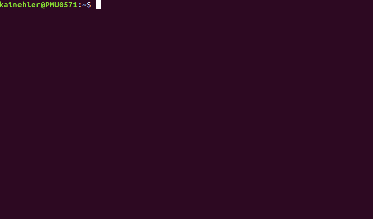

Dabei wird über alle Betriebssysteme hinweg angezeigt, in welchem Punkt der Ordnerstruktur wir uns gerade befinden. Dies ist beim Öffnen fast immer der Benutzerordner. Dafür steht in der Abbildung das `~` Zeichen. In Windows wird beispielsweise stattdessen der Pfad des Benutzerordners abgebildet. Die zusätzlichen Infos unter Linux sind noch der Name der:des Nutzer:in und des Computers, die hier in grün abgebildet sind.

Es wurden für <span style="color: darkred;">**Git**</span> im Laufe der Jahre auch einige benutzerfreundlichere Oberflächen erstellt. Wir wollen zunächst die Basics trotzdem mit dem Terminal bearbeiten, da es wichtig ist, nachvollziehen zu können wie <span style="color: darkred;">**Git**</span> funktioniert und was im Hintergrund passiert. In <span style="color: darkred;">**SmartGit**</span> wird ein Programm mit  benutzerfreundlichere Oberfläche in einem späteren Tutorial beschrieben.

Wenn ihr <span style="color: darkred;">**Git**</span> installiert habt, könnt ihr zunächst mit folgendem Befehl im Terminal testen, ob die Installation funktioniert hat. Dabei wird auch noch gleichzeitig angezeigt, welche Version ihr verwendet. Falls es hier zu einer Fehlermeldung kommt, hat die Installation nicht funktioniert.

```
git --version
```

Damit andere erkennen können, wer welche Änderung an Dateien vorgenommen hat, ist es zunächst einmal wichtig, dass ihr euch einen **Usernamen** gebt. <span style="color: darkred;">**Git**</span> speichert diesen für jede Änderungen an den Dateien. Global könnt ihr für Aktionen auf eurem Benutzerkonto den Namen hinter eine Konfiguration des eingestellten User Namens in das Terminal eintippen:

```
git config --global user.name DeinName
```

Weiterhin sollte den Operationen eine **E-Mail-Adresse** zugeordnet werden. Nehmt hierfür am besten eine, die ihr auch später mit einem Online-Konto verbinden wollt (also am besten die eures Uni-Accounts).

```
git config --global user.email DeineEMail
```

Die Konfigurationen können dann mit dem folgenden Befehl betrachtet werden. Der Name sollte nun unter "user.name" und die Mail unter "user.email" erscheinen.

```
git config --list
```

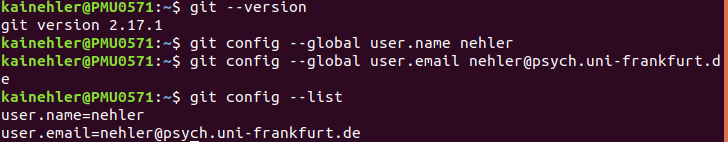


### Schritt 2: Lokales <span style="color: darkred;">**Git repository**</span> erstellen

Damit ein neues lokales <span style="color: darkred;">**Git**</span>-Projekt auf dem Rechner angelegt werden kann, muss zuerst ein sogenanntes <span style="color: darkred;">**repository**</span> erstellt werden. Das können wir direkt im Terminal tun.

Über den Befehl *cd* können wir vom aktuellen Ordner aus, in dem wir uns in der Dateistruktur im Terminal befinden, in einen Unterordner wechseln, wo unser Projekt angelegt werden soll. Das Terminal startet üblicherweise im Nutzer-Verzeichnis, von dem man dann in den untergeordneten Dokumente-Ordner wechseln kann. 

```
cd Dateipfad
```

Für unsere Zwecke möchten wir ein Projekt anlegen, das wir für das Statistik-Praktikum im Bachelor benötigen. Wir haben beispielsweise eine Umfrage durchgeführt und wollen anhand von <span style="color: darkred;">**R**</span> unsere Daten auswerten. Damit wir später mit unseren Kommiliton:innen zusammen an den Daten arbeiten und alle Änderungen nachvollziehen können, wollen wir einen <span style="color: darkred;">**Git**</span>-Ordner erstellen. Wir könnten hierin mehrere Dateien speichern - beispielsweise unsere <span style="color: darkred;">**R**</span>-Skripte oder ein Kodierungssheet für eine Variablenübersicht unserer Daten. Dafür müssen wir von unserem Benutzerodner in den Ordner "Studium" wechseln, der in diesem Ordner angelegt ist. Natürlich müsst ihr diese Befehle auf eure Ordnerstruktur anpassen. In unserem Fall liegt der Ordner "Studium" direkt im Nutzer-Verzeichnis. Anschließend wechseln wir innerhalb des Studiumsordners in den Unterordner "Statistik". Sollte man einmal falsch abgebogen sein - bspw. in den Ordner "Klinische" - kann man über *cd .. * wieder einen Schritt in der Ordnerstruktur aufwärts in den Studiumsordner.

Mit dem Befehl *mkdir* können wir den Ordner "Praktikum" nun im Ordner "Statistik" erstellen.

```
mkdir Praktikum
```

Nach der Erstellung kann man mittels des bereits verwendeten *cd* in den Ordner navigieren, den wir gerade für unser Projekt angelegt haben.

```
cd Praktikum
``` 

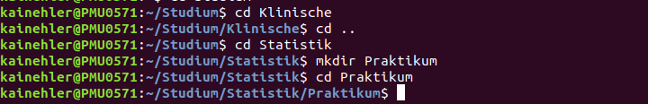

Natürlich könnte der Ordner auch im normalen Dateiexplorer erstellt werden. Für den Start mit <span style="color: darkred;">**Git**</span> im Terminal ist es jedoch natürlich wichtig, in diesem über *cd* in den Praktikumsordner zu gelangen.

Um den Ordner als <span style="color: darkred;">**Git**</span>-Ordner zu initialisieren, muss ein neuer Befehl in das Terminal eingegeben werden. Diese Initialisierung ist notwendig, da eine Installation von <span style="color: darkred;">**Git**</span> nicht gleich bedeutet, dass jeder Ordner automatisch von dem Programm ins Tracking einbezogen wird. Die Projekte, auf die <span style="color: darkred;">**Git**</span> angewendet werden soll, werden von der:dem Benutzer:in durch die Initialisierung gekennzeichnet.

```
git init
``` 

Es sollte direkt eine Bestätigung im Terminal auftauchen (auch sichtbar in nächster Abbildung des Terminals). Jetzt habt ihr den Ordner für die Auswertung auf euren Rechnern erstellt. Dieser ist mit <span style="color: darkred;">**Git**</span> verknüpft und somit können alle <span style="color: darkred;">**Git**</span>-Befehle im Terminal auf ihm ausgeführt werden.


### Schritt 3: Eine neue Datei dem <span style="color: darkred;">**repository**</span> hinzufügen

Anhand von R-Studio können wir jetzt Skripte für unsere Datenaus- und aufbereitung erstellen. Das R-Skript für die Datenauswertung nennen wir "Datenauswertung.R". Diese Datei können wir in unseren Ordner "Praktikum" ablegen, indem wir es anhand von <span style="color: darkred;">**RStudio**</span> einfach darin speichern. Für unser Beispiel haben wir bisher das Einladen der Daten und die ersten Schritt der Datenaggregation in das Skript geschrieben. 

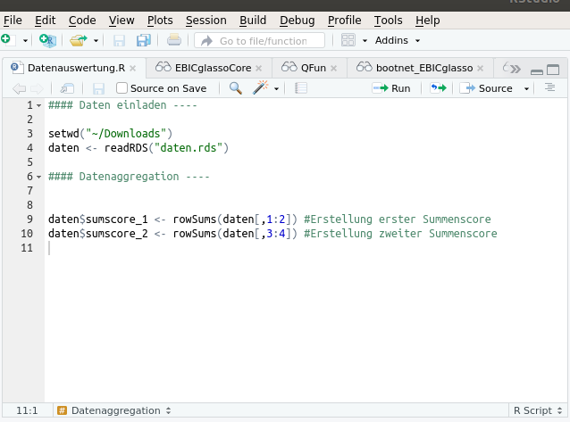

Über eine Statusabfrage können wir abrufen, welche Dateien in unserem Ordner liegen und an welchen Dateien welche Veränderungen vorgenommen wurden.

```
git status
```

Hier erscheint eine Warnmeldung. <span style="color: darkred;">**Git**</span> teilt uns mit, dass in unserem Ordner "untracked files" vorliegen. Wie wir das beheben können, schauen wir uns gleich im Abschnitt zum **staging environment** an.

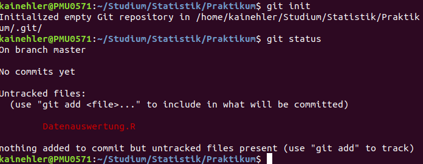

Jetzt haben wir <span style="color: darkred;">**Git**</span> installiert, können über die Eingabeaufforderung darauf zugreifen, haben unser Projekt "Praktikum" lokal auf unserem Rechner erstellt und ihm <span style="color: darkred;">**R**</span>-Dateien hinzugefügt. Jetzt wäre noch wichtig zu lernen, wie man grundlegende Funktionen von <span style="color: darkred;">**Git**</span> nutzen kann.


# Basics

Im Folgenden werden die wichtigsten Befehle und Konzepte von <span style="color: darkred;">**Git**</span> erläutert, damit das Programm effektiv genutzt werden kann.


### Commit

Ein `commit` ist mehr oder weniger wie die Aufzeichnung von Veränderungen, die seit dem letzten Mal am Repository vorgenommen wurden. Im Prinzip wird dieses verändert (indem eine Datei hinzugefügt oder verändert wird) und dann wird <span style="color: darkred;">**Git**</span> dazu aufgefordert, diese Veränderungen in einen `commit` zu verwandeln.

Mithilfe von `commits` könnte man bei Dateien beispielsweise zu dem Stand von jedem vorherigen `commit` zurückkehren. Wenn ihr beispielsweise eurem R-Skript "Datenauswertung.R" einen Befehl hinzufügt und diesen speichern wollt, müsst ihr die Änderungen commiten, damit diese auf das Repository übertragen werden. Falls ihr die Änderungen am Skript rückgängig machen wollt, könnt ihr zum Zustand vor dem letzten `commit` zurückkehren. Es handelt sich hier also um eine Art Zwischenspeicherung von Änderungen an den lokalen Dateien.


### Staging environment

Um <span style="color: darkred;">**Git**</span> mitzuteilen, welche Veränderungen von welchen Dateien in ein `commit` umgesetzt werden sollen, wird das **staging environment** benötigt. Die Staging Area hält alle Änderungen, die im nächsten `commit` enthalten sein werden.
Um unsere Datei später zu einem `commit` hinzufügen zu können, muss diese also ins **staging environment** geladen werden. Dies geht über `git add`.

```
git add Datenauswertung.R
```
Nun können wir nochmal den Status unseres Projektes abfragen. Dabei wird aufgeführt, dass es Änderungen gibt, die noch nicht in einem `commit` vorhanden sind. Dabei wird auch dargestellt, dass es sich um einen neuen File handelt. Dies heißt nicht, dass das File nicht schon länger in unserem Ordner liegt. Es wurde von <span style="color: darkred;">**Git**</span> aber bisher noch nicht getracked. Das <span style="color: darkred;">**R**</span>-Skript liegt nun also im **staging environment** und es sollte ein `commit` folgen.

```
git status
```

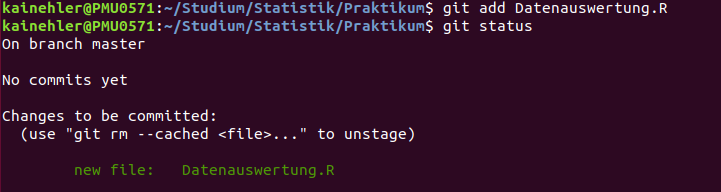


#### Ein `commit` erstellen

Nun wollen wir einen `commit` erstellen. Der zugehörige Befehl im Terminal heißt praktischerweise auch *commit*. Zusätzlich brauchen wir eine `commit`-Nachricht. Diese sollte sich darauf beziehen, was der `commit` beinhaltet, also welche Änderungen vorgenommen wurden. Hierbei bietet es sich an, eine präzise Beschreibung der Änderungen zu hinterlassen, damit man zu einem späteren Zeitpunkt nachvollziehen kann, was gemacht wurde. Dies kann auf zwei Weisen wichtig sein. Auf der einen Seite könnte man zu einem bestimmten Stand zurück, als der Code noch ohne Probleme funktioniert hat und sich an der Nachricht orientieren. Oder man will sich nochmal anschauen, wie man genau etwas geändert hat (welche Lines Code dafür hinzugefügt werden mussten). 

```
git commit -m "commit-Nachricht"
```

Da wir hier eine Datei zum ersten Mal aufzeichnen wollen, erwähnen wir das Hinzufügen der `commit`-Nachricht und können den aktuellen Stand der Datei beschreiben. Es muss jedoch keine sehr genaue Beschreibung der Datei sein, da man sich den Stand stets anschauen kann. Wichtiger ist ein Kommentar zur Orientierung und eventuell warum diese Änderung gemacht wurde.

```
git commit -m "Add Datenauswertung file including data loading and aggregation"
```

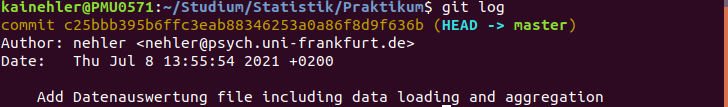


#### Beispiel: Datei verändern

Anhand unserer Datei "Datenauswertung.R" schauen wir uns jetzt an, wie wir vorgenommene Änderungen in unserem <span style="color: darkred;">**Git**</span>-Projekt commiten können.

Zunächst können wir in die <span style="color: darkred;">**R**</span>-Datei gehen und etwas am Skript verändern. Beispielsweise können wir einen Boxplot für unseren **sumscore1** erstellen. Dafür müssen drei Schritte durchlaufen werden:

Zunächst muss natürlich eine Änderung an der <span style="color: darkred;">**R**</span>-Datei vorgenommen und gespeichert werden. Unsere Änderung könnt ihr im Screenshot betrachten.

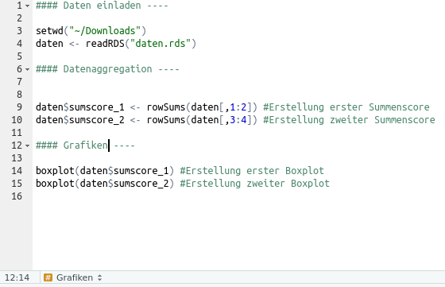

Optional können wir mit *git status* betrachten, ob <span style="color: darkred;">**Git**</span> die Änderung wahrgenommen hat. Hier wird angezeigt, dass die Datei modifiziert wurde - also genau das, was wir gemacht haben. Anschließend müssen wir unsere Änderung wieder in das **staging environment** laden. Dies können wir mit - wie bereits gelernt - *git add Datenauswertung.R*. Hier können wir wieder mit *git status* den Stand abfragen. Abschließend muss das **staging environment** wieder in einem `commit` eingereicht werden. Dafür muss auch wieder eine passende Nachricht verfasst werden: *git commit -m "Add boxplots for sum scores"*. Damit sind die Veränderungen an der Datei "Datenauswertung.R" auf diesem Stand getracked.

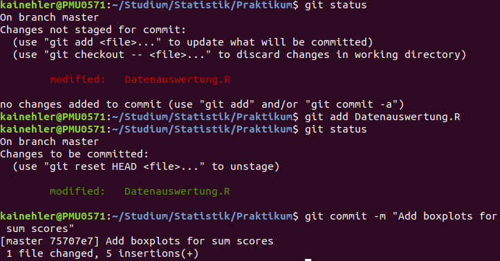


### `commit`-Historie

Um die `commit`-Historie zu betrachten, kann man sich den `log` ausgeben lassen. Hier werden alle `commit`-Nachrichten aufgeführt. Anhand dieser sollte man nun nachvollziehen können, zu welchem Zeitpunkt was verändert der hinzugefügt wurde. Neben den Nachrichten sind hier auch der Zeitpunkt und die Person, die den `commit` vorgenommen hat, enthalten.

```
git log
```

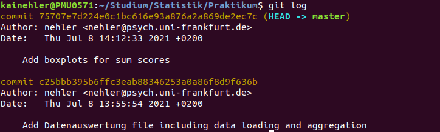 

Mit 'q' könnt ihr das `log` wieder verlassen.

Jetzt könnten wir noch weitere Dateien für unser Statistik-Praktikum erstellen, diese in unseren Ordner "Praktikum" laden und Veränderungen mithilfe von <span style="color: darkred;">**Git**</span> nachverfolgen. Zusätzlich zur Datenauswertung, könnten wir Kodierungssheets, Abbildungen oder Textdateien in unser Projekt laden. Zu Demonstrationszwecken wollen wir nun eine **.txt**-Datei mit unseren Kodierungen erstellen (auch wenn die Hinterlegung in <span style="color: darkred;">**R**</span> natürlich möglich wäre). **.txt**-Dateien kann man sehr simpel im TextEditor auf allen möglichen Betriebssystemen erstellen. Wir schreiben hier die Kodierung der **Variable 1**, die im ersten **sumscore** enthalten ist rein und speichern die Datei unter dem Namen "Kodierung.txt" in unserem getrackten Ordner "Praktikum". 

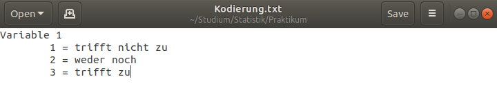

Mit *git status* sehen wir nach dem Abspeichern, dass ein neuer File in unserem Ordner ist, der noch nicht getracked wurde. Also müssen wir diesen mit *git add* wieder dem **staging environment** hinzufügen. Anschließend kann er in einem `commit` verarbeitet werden. 

```
git commit -m "Add coding sheet" 
```

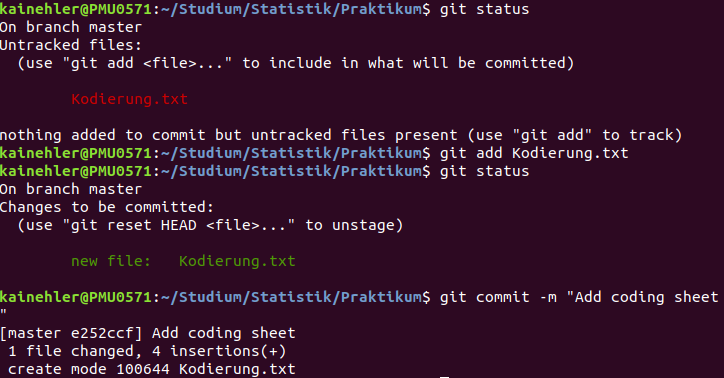

Nun wollen wir nochmal betrachten was passiert, wenn man an beiden Dateien Veränderungen macht. Dafür fügen wir in der Kodierungsübersicht die restlichen Variablen hinzu und berechnen im <span style="color: darkred;">**R**</span>-Skript die Summe aus allen Variablen.

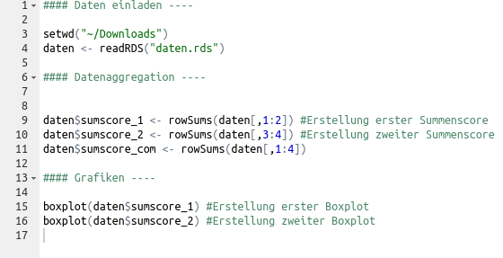
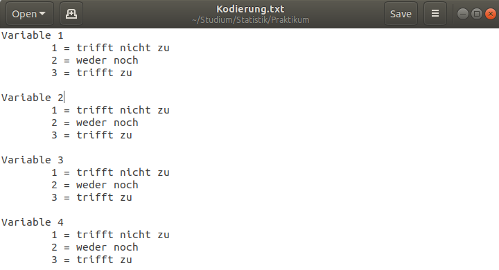

Anhand von *git status* können wir sehen, dass beide Dateien verändert wurden. An diesem Punkt muss man sich entscheiden, ob sie im selben `commit` verarbeitet werden sollten. Da es hier schwer wäre, eine gemeinsame Nachricht zu finden, wollen wir sie getrennt voneinander hinzufügen. Dafür nehmen wir zunächst nur eine Datei in das **staging environment** auf und erstellen dann einen `commit`.

```
git add Kodierung.txt
git commit -m "Add sum score for all variables"
```

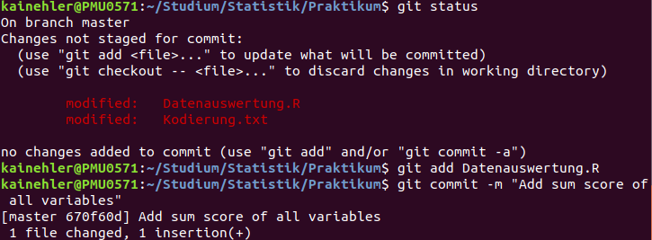

Im Status sehen wir nun, dass nur noch eine Veränderung nicht getracked wurde. Dies können wir jetzt nochmal über die eben genutzten Befehle machen und versehen es mit einer anderen Nachricht.

```
git add Datenauswertung.R
git commit -m "Add coding of variable 2 to 4 to coding sheet"
```

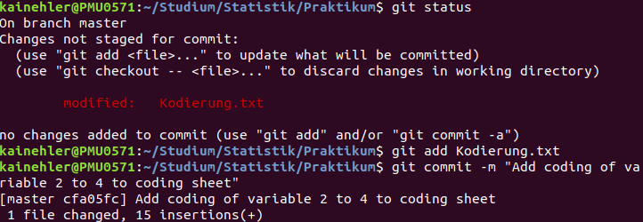

Zum Abschluss betrachten wir nochmal den **status** und den **log**. Dabei wird angezeigt, dass momentan keine Änderungen gemacht wurden, die nicht im letzten `commit` enthalten sind. Weiterhin sehen wir so nochmal alle `commit`-Nachrichten, die wir im Laufe dieses Tutorials verfasst haben. 


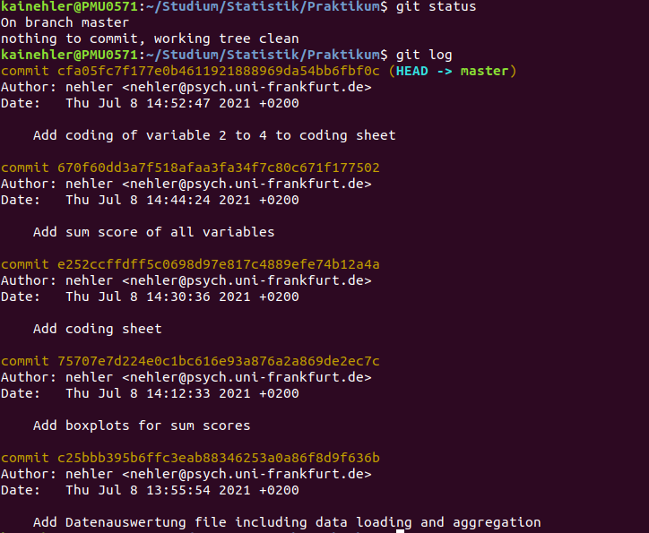


# Fazit und Ausblick

Mit diesen Basic-Funktionen von <span style="color: darkred;">**Git**</span> kann man einfach lokale Projekte erstellen, diesen Dateien hinzufügen und Änderungen mithilfe von der `commit`-Historie nachverfolgen. Um lokale Projekte mit anderen Personen teilen zu können oder gemeinsam an diesen arbeiten zu können, kann <span style="color: darkred;">**GitHub**</span> genutzt werden. Dazu kommen wir im nächsten Teil des Tutorials. Im weiteren Verlauf werden wir auch betrachten, wie man zu einem bestimmten Zeitpunkt in der Historie zurückkehren kann.

