# Warum **SmartGit**?

Da das Terminal nicht die beste optische Repräsentation aller Möglichkeiten von **Git** bietet, wollen wir uns in diesem Tutorial mit **SmartGit** beschäftigen. Dieses bietet uns eine benutzerfreundlichere, anschaulichere  Oberfläche, mit der wir problemlos **Git**-Befehle ausführen können. Wir wollen uns hierbei zunächst anschauen, wie unsere bereits gelernten Befehle in **SmartGit** funktionieren. Anschließend werden wir noch weitere Möglichkeiten und Befehle kennen lernen.

## Einführung

**SmartGit** ist wie bereits geschildert eine grafische Oberfläche für die Verwendung von **Git** auf dem lokalen Rechner - aber auch in Verbindung mit **remote repositories** (also bspw. gehostet auf **Github**) . Das Programm existiert bereits seit 2009 und wurde stets weiterentwickelt, wodurch eine reibungslose Funktionsweise sichergestellt ist. Durch Ausführen von **Git**-Befehlen via Klick wird die Arbeit beschleunigt. Andere Befehle werden sogar automatisiert durchgeführt. Ein großer Vorteil von **SmartGit** ist dabei, dass es auch mit anderen Providern für **remote repositories** wie **Bitbucket** oder **GitLab** integrativ arbeiten kann, wobei wir uns im Tutorial weiterhin nur mit **GitHub** beschäftigen werden.

# Setup

Damit ihr **SmartGit** auf euren Rechnern verwenden könnt, müsst ihr zunächst das Programm herunterladen. Dies könnt ihr [hier](https://www.syntevo.com/smartgit/) für verschiedene Betriebssysteme machen. Auf der Website gibt es auch **Installation Instructions** für die verschiedenen Betriebssysteme. 

Bei den Einstellungen für **SmartGit** müsst ihr den Nutzungsbedingungen zustimmen und unter *License type* außerdem auswählen, dass ihr das Programm für "Non-commercial use only", also wissenschaftliche Zwecke verwendet, sodass ihr nicht für die Nutzung zahlen müsst. 

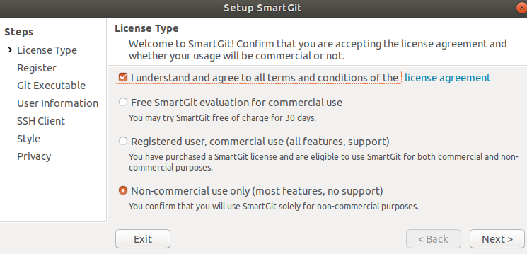

Dies muss in einem zweiten Fenster noch einmal bestätigt werden. Als nächstes müsst ihr euch unter *User Information* einen Nutzernamen geben sowie eine E-Mail-Adresse angeben, über die ihr euer **SmartGit** konfiguriert. **SmartGit** sollte die Informationen aus eurer eigenen Konfiguration auf dem lokalen PC ziehen können und daher bereits anzeigen, welche E-Mail und welcher Name hinterlegt sind. Ansonsten gebt ihr am besten selbst Nutzernamen und die E-Mail-Adresse an, mit denen ihr **Git** auf dem Rechner konfiguriert habt! 

Jetzt müsst ihr noch die Option *Use SmartGit as SSH client* auswählen. Dies ist für den Start der Arbeit mit **SmartGit** empfohlen. 

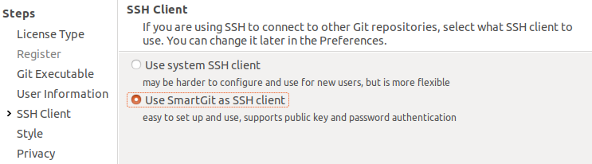

Anschließend werden wir nach dem bevorzugten Style der Oberfläche von **SmartGit** gefragt. Hier gibt es natürlich kein Richtig oder Falsch und es gibt auch nicht direkt eine Empfehlung für Anfänger:innen. Die Ansicht des **Working Tree** wird von uns allerdings als intuitiver eingeschätzt und deshalb verwendet. Wie im Fenster beschrieben, kann diese Einstellung später auch unter *Präferenz* geändert werden (und wir zeigen auch den Weg zur Änderung). 

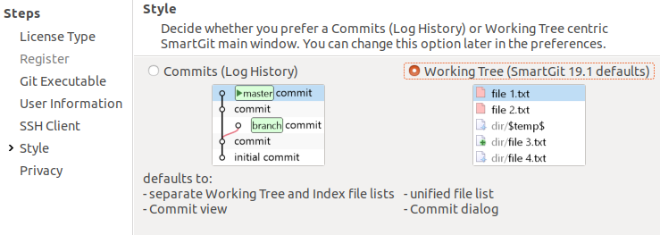

Unter **Privacy** kann man bestimmen, in welchen Fällen Daten an die Ersteller:innen gesendet werden, die diese zur Verbesserung des Programmes nutzen wollen. Hier möchten wir keine Empfehlung aussprechen - man kann nach persönlicher Präferenz auswählen. Außerdem sucht **SmartGit** auf dem Rechner nach initialisierten Repositories und gibt in diesem Fenster die Anzahl an.

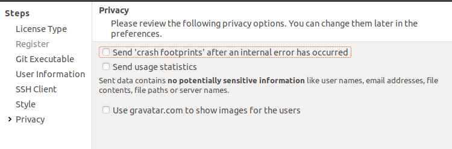

Sobald ihr **SmartGit** installiert habt und das Programm öffnet, werdet ihr gefragt, ob ihr ein lokales Repository öffnen oder neu erstellen wollt, oder aber ob ihr ein bereits bestehendes `clonen` möchtet. Wenn bereits Repositories auf dem Rechner bestehen, werden diese hier unter *Reopen previously used repository* angezeigt. Diesen Punkt wählen wir daher auch aus. Dabei wollen wir natürlich an unserem Ordner Praktikum arbeiten.

Jetzt ist die Installation abgeschlossen.

# Basics

Nach der erfolgreichen Installation von **SmartGit** und dem Erkennen unseres Praktikums-Ordner als Repository, stellt sich die Frage, wie wir auf **SmartGit** verschiedene Funktionalitäten nutzen können. Hierzu betrachten wir zunächst, wo wir unsere bereits erlernten **Git**-Befehle umsetzen können.

### Benutzeroberfläche

Zur Orientierung schauen wir uns natürlich die Oberfläche von **SmartGit** genauer an. Diese haben wir durch die Auswahl eines bestimmten Styles hergestellt.

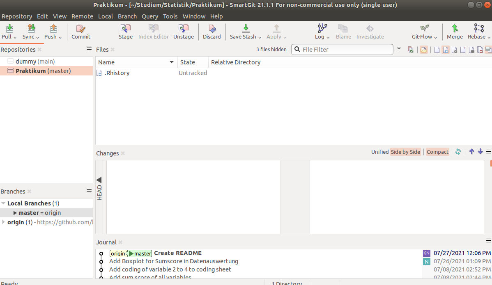

In der oberen Zeile befinden sich zunächst Symbole mit bekannten Begriffen wie `pull` und `commit`. Diese Werkzeuge werden wir gleich brauchen. Auf der linken Seite sehen wir unsere Repositories - theoretisch können wir hier alle reinladen, an denen wir uns beteiligen. Wenn ihr dem Tutorial Stück für Stück bis hierhin gefolgt seid, sollte einmal das "dummy"- und das "praktikum"-Repository hier erscheinen. Darunter sehen wir die verschiedenen **Branches** eines Projekts - mit diesen beschäftigen wir uns erst im nächsten Teil des Tutorials. 

In der Mitte des Bildschirms sehen wir die Kachel **Files**. Hierin werden alle Dateien angezeigt, die entweder noch nicht getracked werden, verändert, gelöscht oder umbenannt wurden. Für Praktikum ist hier die **R**-History zu sehen, die **R** automatisch erstellt, aber für uns keinen Wert hat. Diese ist im normalen Explorer und Terminal versteckt, wird aber hier angezeigt.

In der Kachel **Changes** werden die Veränderungen an einer Datei angezeigt, wenn Sie unter **Files** ausgewählt ist. Das demonstrieren wir gleich noch einmal mit einem Screenshot. In der Kachel **Journal** sind alle `commits` der Historie aufgeführt. 

Um die Arbeit mit **SmartGit** zu simulieren, müssen wir natürlich wieder Änderungen an den Dateien vornehmen. Dafür öffnen wir das Datenauswertungsskript aus unserem Ordner und ergänzen darin beispielsweise eine Häufigkeitstabelle für den Gesamtscore. Wichtig ist, dass die Änderung auch gespeichert werden muss.

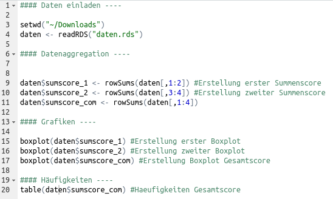

Durch die Änderung der Datei erscheint diese nun in **SmartGit** in der Kachel **Files**. Dabei wird sie in rot angezeigt und es steht daneben, dass sie modifiziert wurde. Wenn wir nun einmal auf sie mit Linksklick draufgehen, sehen wir auch nochmal besser, wofür die **Changes**-Kachel da ist. Durch die grüne Markierung der Zeilen 19 und 20 im Code sehen wir, dass diese neu hinzugefügt wurden.

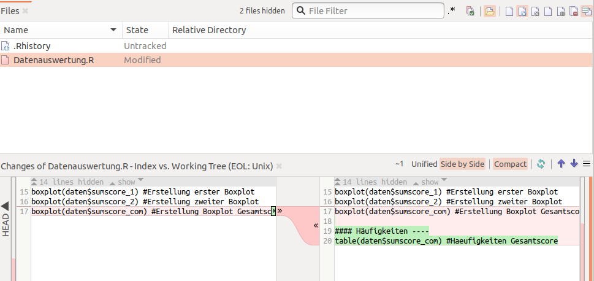

### `Commit`

Nun, da wir eine Datei verändert haben, wollen wir diese Änderung natürlich auch committen. Im Terminal mussten wir dafür erst mit *git add* etwas zum **staging environment** hinzufügen. Das ist über **SmartGit** nicht mehr notwendig, bzw. wird durch Klick auf die interessierenden Dateien ersetzt. In der **Files**-Kachel wählen wir mit einem Linksklick alle Dateien aus, die im nächsten `commit` enthalten sein sollen (bei der Auswahl mehrere Dateien wie üblich *strg* gedrückt halten). Anschließend wählen wir in der Werkzeuge-Leiste `commit` aus. Es öffnet sich das `commit`-Fenster, in dem nochmal angezeigt wird, welche Dateien wir ausgewählt haben. Wir möchten nur die Änderung in der Datenauswertung in unserem `commit` haben. Weiterhin müssen wir, wie auch bei der Ausführung im Terminal, eine passende Message zu unserem `commit` hinzufügen.

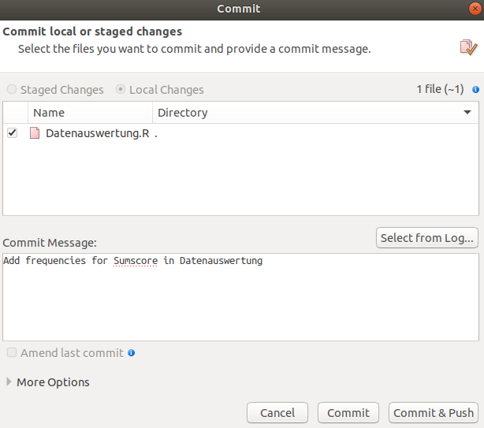

Wenn die Nachricht verfasst ist, reicht ein Klick auf *Commit* und die Änderungen wurden angenommen. Lokal sind sie also getracked. Alternativ könnte man hier auch auf *Commit & Push* klicken, dann wird unser lokaler Ordner direkt auf **GitHub** gepushed. Dies kann man machen, wenn man sich seiner Änderungen sicher ist. Nur `commit` ist dabei empfehlenswert, wenn man sich unsicher ist und nochmal weiter an den Änderungen arbeiten will - oder für den Fall, dass wir noch weitere Änderungen an anderen Dateien unseres Projekts vornehmen wollen. Aus Demonstrationszwecken drücken wir auf *Commit*. Wenn ihr auf **SmartGit** die Kachel **Journal** betrachtet, ist dieser `commit` zwar im **master** enthalten, aber nicht im **origin**. Dies spricht dafür, dass die Änderung im **remote repository** noch angestoßen werden muss. Dies können wir mit einem `push` machen. 

### `Push` & `Pull`

Anstatt eine ganze Zeile in das Terminal eingeben zu müssen, um den Ordner auf **GitHub** auf den Stand des lokalen Ordners zu aktualisieren, reicht bei **SmartGit** ein einfacher Klick auf *Push*. Zunächst öffnet sich ein Fenster, in dem wir diese Aktion nochmals bestätigen. 

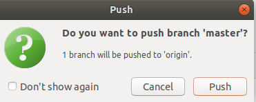

Da wir **SmartGit** nun zum ersten Mal mit einem Server interagieren lassen, werden wir nach einem **Master Password** gefragt. Man kann dieses zwar auch überspringen, aber es ist wichtig für den Schutz von Passwörtern in der Interaktion mit Servern, weshalb wir eine Festlegung dringend empfehlen. Am besten verwendet ihr hier auch nicht das gleiche Passwort, welches ihr bei **GitHub** verwendet habt. 

Einmal muss die Rechtmäßigkeit des Zugriffs auf den Server nun aber mit euren **GitHub**-Informationen bestätigt werden. Hier gibt es nun zwei Möglichkeiten.
Entweder ihr generiert einen Personal Access Token (PAT), wie man das machen kann, haben wir euch schon im Tutorial zu [GitHub](/extras/git/github/#personalaccesstoken) gezeigt. Das ist vor allem praktisch, wenn ihr die Verbindung zu **GitHub** an unterschiedlichen Geräten benutzt. Oder ihr generiert einen Application Programming Interface (API) Token, der mehr Sinn macht, wenn ihr mehrere Provider habt wie **GitHub**, von denen ihr aus **SmartGit** aus zugreifen wollt.  

Application Programming Interface

Damit wir nicht jedes Mal unseren PAT eingeben müssen, aktivieren wir den Zugang über das **Master Password**. Dafür wählen wir in der obersten Zeile *Edit* aus und wählen darin *Preferences* aus.

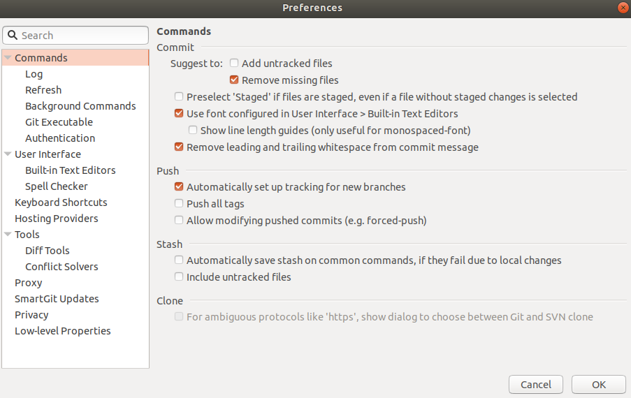

Hier gehen wir in der Auswahl auf *Hosting Providers* und drücken dann rechts auf *Add*.

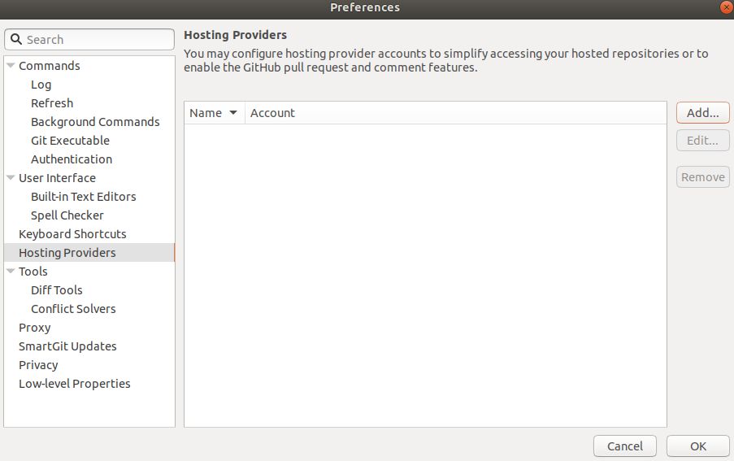 

**GitHub** ist hier bereits auswählt. Wir wollen nun einen **Token** erstellen. Dafür müssen wir den Button *Generate* drücken. Der Browser sollte sich automatisch öffnen und einen Login zu **GitHub** erfordern. Sobald wir diese Informationen eingegeben haben, wird ein Token generiert. Diesen kopieren wir dann in das entsprechende Fenster in **SmartGit** und klicken auf *Authenticate*.

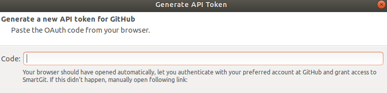

Wir gelangen zurück in das Fenster, wo wir den Token erstellt haben, und klicken auf *Add*. Damit erscheint nun im Fenster der Hosting Providers unser **GitHub**-Account und wir können auf *OK* klicken. 

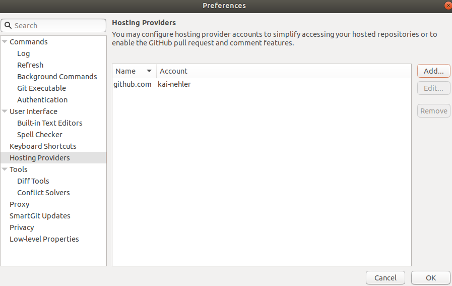

Wir gehen hier davon aus, dass ihr direkt mit dem PAT als Passwort weitermacht. Danach fragt euch **SmartGit** nochmal nach eurem **Master Password**, das ihr etwas weiter oben festgelegt habt. 

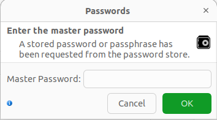

Nach dessen Eingabe wird der `push` durchgeführt. Um einen optischen Indikator dafür zu haben, könnt ihr euer Repository auf der **GitHub**-Website öffnen. Weiterhin sind man auch in der Kachel **Journal**, dass **_origin_** und **_main_** nun wieder auf derselben Höhe des neuen `commits` sind.

Beachtet, dass der Vorgang von `push` wirklich simpel über den Klick funktioniert hat. Die Umstellungen für das "Passwort" mussten wir jetzt nur einmal vornehmen. Ähnlich einfach ist der Vorgang, um unsere lokale Kopie des Repositories auf die Version auf **GitHub** zu aktualisieren. Auch hier können wir den Button in der Werkzeug-Leiste nutzen. Nach dem Klick auf *Pull* geht ein Fenster auf, indem man zwischen `Rebase` und `Merge` wählen kann - diese Begriffe sind beide noch unbekannt und wir bleiben bei der Standardeinstellung. Anschließend erscheint das Fenster *Pull*. Hierin wird die URL vom **GitHub**- Repository angezeigt - diese müsste stimmen, könnt ihr aber gerne kontrollieren. Anschließend klicken wir auf den uns bekannten Befehl `pull`.

Es erscheint für eine kurze Zeit ein grüner Kasten, in dem steht, dass der `pull` erfolgreich war. Natürlich wurden gerade aber keine Änderungen an Dateien oder Ähnliches vorgenommen, da der Stand lokal und remote identisch war. Wir simulieren die Änderung einer anderen Person an einer Datei - wie im letzten Tutorial auch - durch eine Veränderung in der **GitHub** Version. Dafür öffnen wir das Repository auf **GitHub** und klicken auf den Stift, der rechts in der Zeile von **README.md** angezeigt wird. 

Wir wollen eine schnelle Änderung an diesem vornehmen und fügen daher noch eine Zeile ein, in der wir präzisieren, um welche Gruppe es sich bei uns imaginär handelt. In der `commit`-Nachricht beschreiben wir kurz die durchgeführte Änderung und lassen die anderen Optionen auf ihren Standardeinstellungen. Anschließend klicken wir *Commit Changes* und wechseln zurück auf unsere **SmartGit**- Anwendung. 

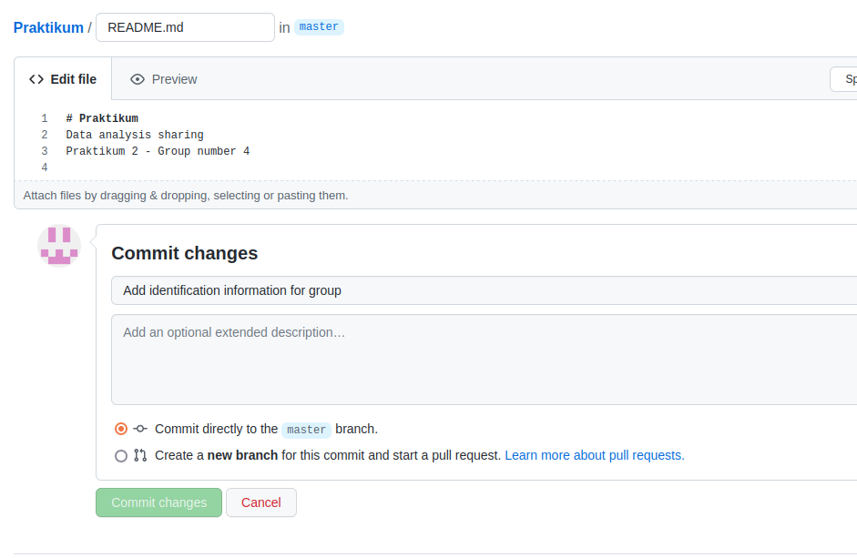

In dieser wählen wir jetzt wieder *Pull* in unserem Repository "Praktikum" aus. Zunächst scheint nicht viel anderes zu passieren als bei dem vorherigen `pull`. Wenn man allerdings genau hinschaut, sieht man, dass der letzte `commit` nun am unteren Bildschirmrand im **Journal** angezeigt wird. Wenn man die Datei **README.md** lokal auf dem eigenen Rechner anschaut, werden die neuen Inhalte nun auch angezeigt. 

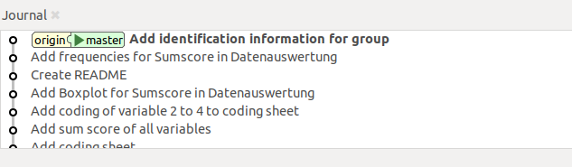

Bisher haben wir nur mit dem Repository gearbeitet, das automatisch von **SmartGit** gefunden wurde. Nun wollen wir noch Fälle betrachten, in dem das Repository nur online besteht oder in dem es noch komplett neu erstellt werden muss.

#### Bereits bestehendes **GitHub**-repository mit **SmartGit** `clonen`

Wie in den **Git**-Funktionen gelernt, kann man ein Repository, das online existiert, auch mit **SmartGit** lokal intialisieren. Um euren auf **GitHub** geladenen Praktikums-Ordner mit **SmartGit** zu verknüpfen, müsst ihr zunächst in der Menüleiste auf *Repository* klicken und dann auf *Clone*. In dem Fenster, was sich daraufhin öffnet, könnt ihr einfach die URL eures Repositories (die ihr über **GitHub** anfordern könnt) in das entsprechende Feld kopieren. Die hier angegebene URL und das Repository "test12" sind nur ein Platzhalter, um euch die nächsten Felder zeigen zu können. Wir haben momentan kein Repository, das nur online und nicht lokal angelegt ist. Die Eingabe muss natürlich noch bestätigt werden. 

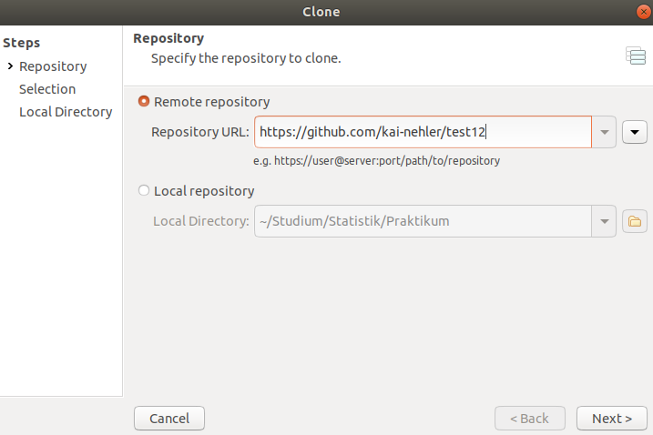

Beachtet an dieser Stelle, dass es auch möglich ist, ein lokales Repository nochmal lokal zu `clonen`. Ihr hättet dieses dann zwei Mal. Hierfür müsste man *local repository* auswählen und den Pfad dahin angeben. Dieses Vorgehen hat jedoch nicht viele Anwendungen und wird daher nicht genauer betrachtet. 

Zurück zur Verbindung mit einem Repository auf **GitHub**: Nach der Eingabe der URL erscheint ein Dialogfenster, in dem Details über den `clone` abgefragt werden. Diese sind vor allem interessant, wenn mehrere `Branches` in einem Repository existieren, womit wir uns noch nicht beschäftigt haben. Außerdem können größere Daten ausgeschlossen werden, um Speicherplatz zu sparen. Dies trifft uns auch eher selten.

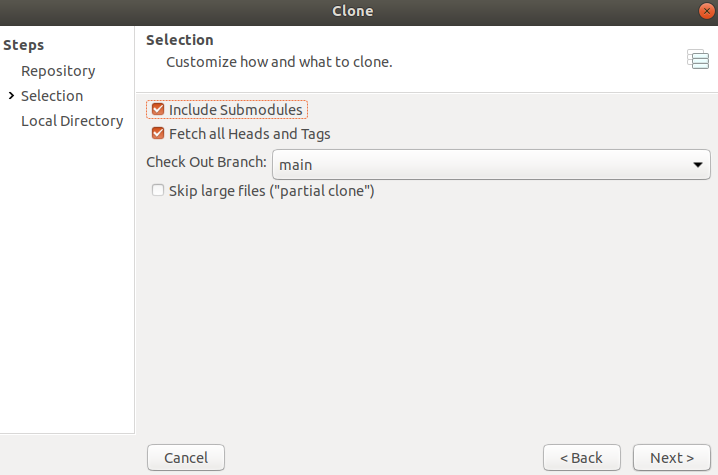

Nach der Bestätigung der Details könnt ihr einen Ordner auswählen, in den eure Daten von **GitHub** geladen werden sollen. Ihr könnt die Standardeinstellung verwenden oder über die Ordneransicht einen Ordner auf eurem Rechner erstellen. 

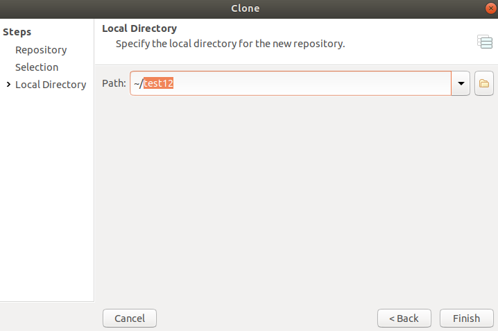

Nachdem das Cloning abgeschlossen ist, solltet ihr auf der linken Seite eurer **SmartGit**-Ansicht den Ordner unter **Repositories** sehen können. Jetzt könntet ihr über **SmartGit** mit **GitHub** kommunizieren und  Änderungen an den Dateien tracken. Da wir diese Funktionen jetzt nur mal betrachtet und nicht ausgeführt haben, ändert sich in unserer Ansicht natürlich nichts. 

#### Neues `repository` erstellen

Ein neues Repository mit **SmartGit** zu erstellen, ist sehr einfach! Dazu müsst ihr in der Menüleiste zunächst auf *Repository* klicken und dann auf *Add or create...*. In dem Fenster, was sich jetzt öffnet, könnt ihr entweder einen Ordner auswählen, den ihr bereits erstellt habt - beispielsweise unseren bekannten Praktikums-Ordner - oder über *Neuer Ordner* einen neuen erstellen. Das Einladen eines bereits existierenden Repositorys kann nötig sein, falls die automatische Erkennung fehlgeschlagen ist oder ihr das Hinzufügen zunächst abgelehnt habt. Dafür würdet ihr einfach den Pfad des Repositorys hier einstellen, was wir jetzt aber nicht betrachten werden. 

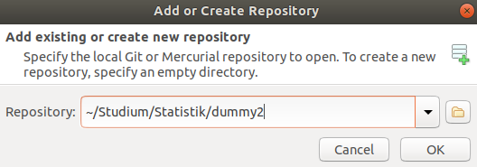

In diesem Beispiel erstellen wir in unserem Statistik-Ordner den neuen Ordner "dummy2" und initialisieren diesen als neues Repository. Hierfür wird nochmal eine Bestätigung in einem seperaten Dialogfenster benötigt.

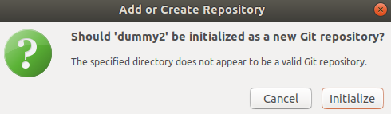

Kleine Anmerkung: Diese Initialiserung würde natürlich nicht erscheinen, wenn ihr der Ordner bereits ein **Git**-Ordner wäre und nur zur Anzeige in **SmartGit** eingeladen werden sollte. 

Nach einem Klick auf *OK* ist euer Repository erstellt und ihr könnt mit nun Dateien erstellen, hinzufügen und mit euren Veränderungen loslegen! Es wird nun auf der linken Seite in der Liste angezeigt. Das Tracking der Dateien wäre momentan natürlich nur lokal. Um eine Verbindung mit **GitHub** zu erstellen, muss zunächst äquivalent zu der Beschreibung im Tutorial zu **GitHub** ein Repository erstellt werden. Dort wurde bereits empfohlen, dass das neu erstellte Repository zunächst leer ist und denselben Namen wie die lokale Version trägt. Es wird dabei eine URL kreiert, unter der das `repository` zu finden ist. In diesem Fall würde diese so aussehen:

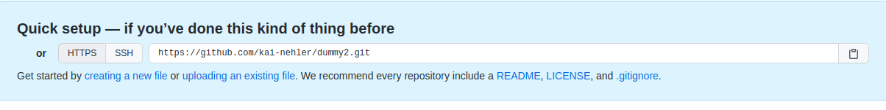

Diese solltet ihr nun kopieren und wieder zurück auf **SmartGit** wechseln. Dort wählt ihr in der Übersichtsleiste zunächst *Remote* und dann *Add...*. Es erscheint eine Eingabe für die URL, die ihr eben kopiert habt.  

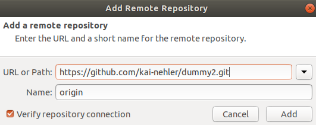

Um die Einrichtung abzuschließen, müsst ihr nun noch einen `push` durchführen. Nachdem dieser abgeschlossen ist, sollte das Repository auch auf **GitHub** den **initial commit** anzeigen. Ab diesem Moment werden alle euren lokalen Änderungen durch einen `Push` auf **GitHub** abgelegt. 

#### Änderung des Styles der Oberfläche

Bei der Einrichtung von **SmartGit** haben wir uns für einen Style in der Anzeige unserer Repositories entschieden. Zum Abschluss der Basics des Tutorials wollen wir nun noch kurz betrachten, wie wir diese anfängliche Entscheidung ändern können. Dafür wählt ihr in der obersten Zeile zunächst *Edit* und dann *Preferences*. Es öffnet sich ein Fenster, indem wir zunächst *User Interface* in der Übersicht links anklicken. Im rechten Fenster gibt es die Auswahl *Prefer*, bei der momentan **Working Tree** angewählt sein sollte. Stattdessen klicken wir nun auf *Log Graph* und bestätigen die Auswahl (es können natürlich noch weitere Änderungen an der Oberfläche hier durchgeführt werden, aber diese werden wir nicht näher betrachten).

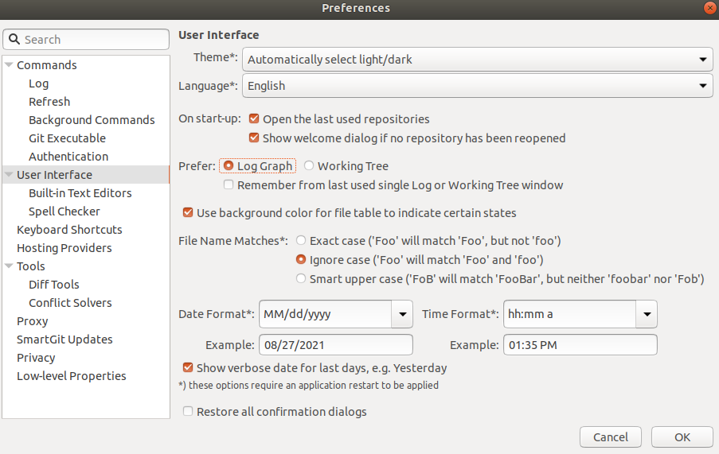

Beim Erstellen des Tutorials musste **SmartGit** nun einmal geschlossen und wieder geöffnet werden, damit die Änderungen sichtbar werden. Es ist eine neue Aufteilung in der Oberfläche zu sehen, wobei die Anzeige der *Repositories* und *Branches* auf der linken Seite bestehen bleibt. 

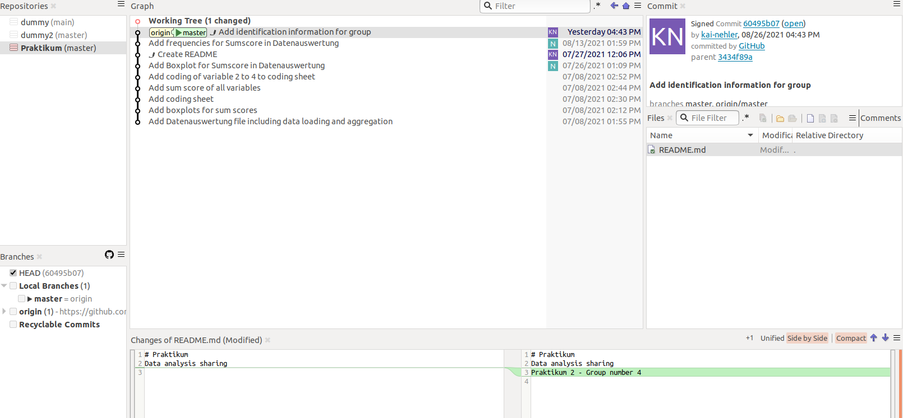

Im zentralen Fenster **Graph** wird der Workflow - also alle `commits`, die jemals an unserem Projekt durchgeführt wurden - angezeigt. Dabei stehen jeweils die Initialien der Person, die den `commit` durchgeführt hat sowie das Änderungsdatum. So können wir auf einen Blick nachvollziehen, wer wann was an unserem Projekt verändert hat. Beachtet auch, dass nun ganz oben der aktuelle Stand eures Repositorys als **Working Tree** angezeigt wird. In diesem wird eine Änderung angezeigt, da die Datei ".Rhistory" weiterhin im Repository existiert, aber noch nicht in einen `commit` einbezogen wurde.

Auf der rechten Seite des Bildschirms sehen wir mittig eine Übersicht über alle unsere Dateien, die wir seit dem letzten `commit` lokal verändert haben - in diesem Falle die `.Rhistory`. Oben rechts werden Informationen über den Account angegeben, der einen `commit` durchgeführt hat. Am unteren Bildschirmrand ist wieder die Übersicht über Änderungen in Dateien von einem `commit` zu einem anderen. Wem diese Übersicht nun besser gefällt, kann die Einstellung so lassen. Für das weitere Tutorial ändern wir die Einstellung wieder in den **Preferences** und starten **SmartGit** wieder neu. 

# Fazit und Ausblick

**SmartGit** erleichtert die Arbeit mit **Git** enorm und bietet eine gut ausgearbeitete Benutzeroberfläche. Wir haben einige weitere Befehle kennengelernt, mit denen wir einen guten Arbeitsablauf an gemeinsamen Projekten ermöglichen können. Jedoch bietet **Git** noch viele weitere Optionen, die in weiteren Tutorials besprochen werden.

