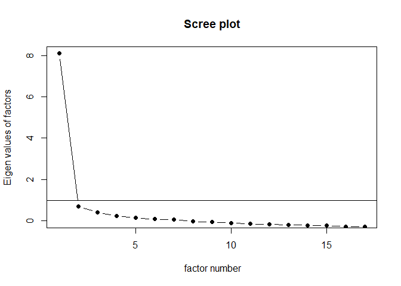
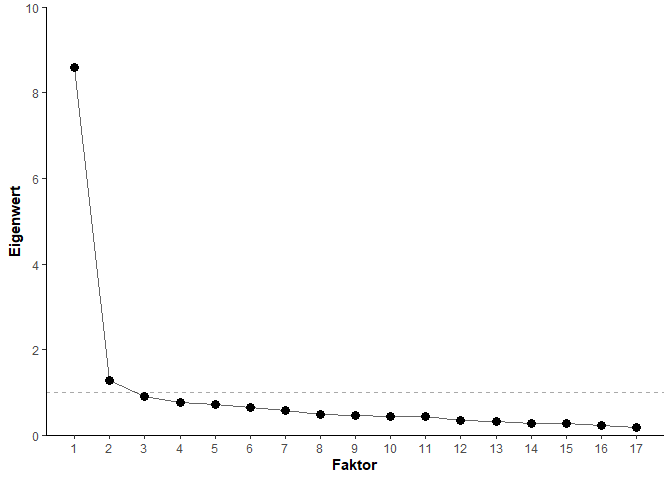
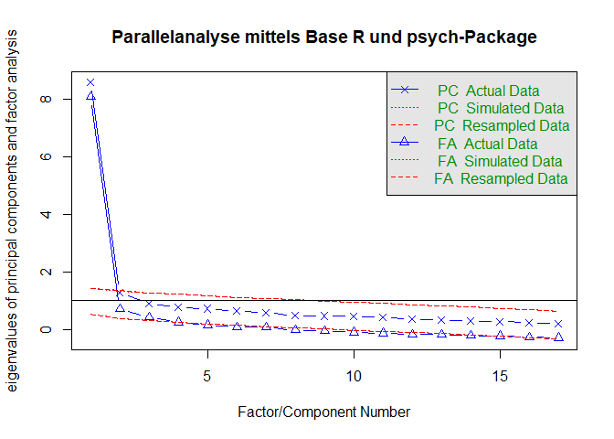
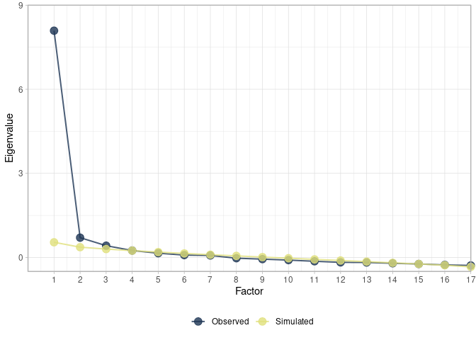
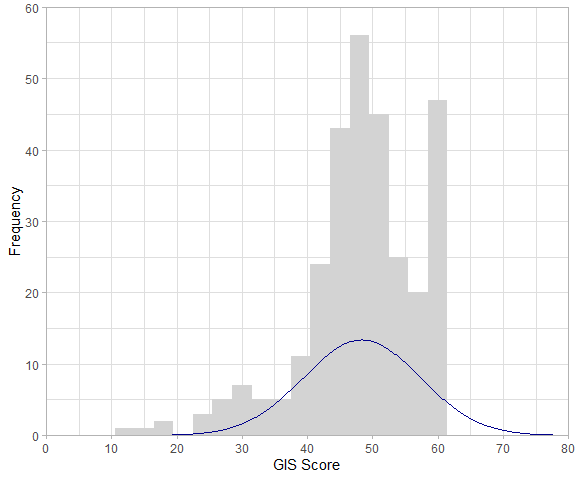
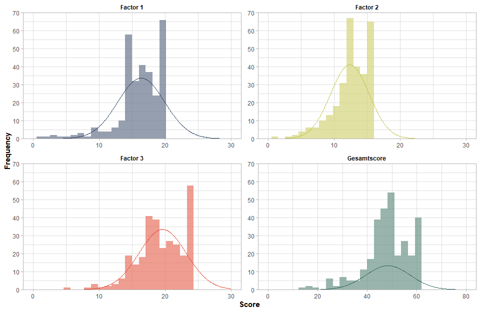

## Laden der Daten & Übersicht  

Wir beginnen mit dem Datensatz, mit dem wir letztes Skript aufgehört haben. Wie immer müsst ihr dafür den Pfad wählen, in dem sich die Daten befinden. Mit `glimpse()` können wir uns nochmal einen kurzen Überblick verschaffen, wie die Datenstruktur aussieht und welche Variablen wir nach der Itemanalyse beibehalten/ausgeschlossen haben.        
 

```r
library(tidyverse)
library(here)
data_gis_final <- read.csv(url("https://raw.githubusercontent.com/jlschnatz/PsyBSc8_Diagnostik/main/src/data/data-gis-final.csv"))
glimpse(data_gis_final)
```

```
## Rows: 300
## Columns: 17
## $ GIS1  <int> 4, 4, 4, 4, 3, 4, 4, 3, 4, 4, 3, 3, 4, 3, 4, 3, 4, 3, 4, 4, 3, 3, 3, 3, 4, 3, 4, 4, 4,…
## $ GIS2  <int> 3, 3, 3, 3, 4, 3, 4, 3, 3, 3, 3, 3, 4, 3, 3, 3, 3, 3, 3, 3, 3, 3, 3, 2, 4, 3, 4, 3, 4,…
## $ GIS3  <int> 3, 3, 4, 0, 4, 3, 3, 4, 3, 3, 3, 3, 4, 3, 4, 3, 1, 4, 3, 3, 4, 3, 1, 3, 3, 4, 4, 4, 4,…
## $ GIS4  <int> 3, 4, 4, 3, 3, 4, 3, 4, 3, 3, 3, 3, 3, 4, 4, 3, 3, 4, 3, 3, 4, 3, 3, 2, 4, 3, 4, 4, 4,…
## $ GIS5  <int> 3, 4, 3, 3, 3, 4, 3, 3, 3, 1, 3, 3, 3, 3, 3, 3, 3, 3, 3, 3, 3, 3, 3, 3, 4, 3, 4, 4, 3,…
## $ GIS6  <int> 3, 4, 3, 4, 4, 4, 4, 3, 3, 3, 3, 3, 3, 3, 4, 3, 3, 3, 3, 4, 3, 4, 3, 3, 3, 4, 4, 4, 4,…
## $ GIS7  <int> 4, 4, 3, 4, 4, 3, 4, 3, 3, 3, 4, 4, 4, 4, 3, 3, 4, 4, 4, 4, 3, 3, 3, 1, 4, 3, 4, 4, 2,…
## $ GIS8  <int> 4, 4, 4, 4, 4, 3, 3, 4, 4, 3, 3, 3, 4, 4, 4, 4, 4, 4, 4, 4, 4, 3, 3, 3, 4, 1, 4, 4, 4,…
## $ GIS10 <int> 4, 4, 4, 3, 3, 3, 3, 1, 3, 3, 3, 3, 4, 3, 1, 3, 3, 3, 3, 3, 3, 3, 1, 2, 4, 3, 4, 4, 4,…
## $ GIS11 <int> 3, 3, 3, 3, 4, 3, 3, 3, 3, 3, 3, 3, 4, 3, 3, 3, 3, 3, 3, 3, 3, 3, 4, 3, 4, 3, 4, 4, 4,…
## $ GIS12 <int> 4, 4, 4, 3, 3, 3, 3, 3, 3, 4, 3, 4, 4, 3, 4, 3, 3, 4, 3, 3, 4, 3, 4, 3, 4, 2, 4, 4, 3,…
## $ GIS13 <int> 4, 4, 4, 3, 4, 3, 3, 3, 4, 3, 3, 4, 3, 3, 4, 4, 3, 4, 4, 4, 3, 3, 4, 3, 4, 1, 4, 4, 3,…
## $ GIS14 <int> 3, 4, 3, 3, 4, 3, 4, 3, 3, 4, 3, 3, 3, 3, 3, 3, 3, 3, 1, 3, 3, 3, 4, 2, 4, 2, 4, 4, 3,…
## $ GIS15 <int> 3, 4, 3, 3, 4, 3, 3, 3, 3, 4, 3, 3, 3, 4, 4, 3, 3, 3, 3, 3, 3, 3, 4, 1, 4, 3, 4, 4, 4,…
## $ GIS19 <int> 4, 4, 4, 3, 4, 3, 4, 4, 4, 4, 4, 3, 4, 4, 4, 3, 3, 4, 4, 4, 4, 3, 3, 2, 4, 3, 4, 4, 3,…
## $ GIS20 <int> 3, 4, 4, 3, 4, 3, 3, 3, 3, 3, 4, 3, 4, 4, 3, 3, 3, 3, 3, 4, 3, 3, 1, 2, 4, 3, 4, 4, 3,…
## $ GIS21 <int> 3, 4, 4, 3, 4, 3, 3, 3, 3, 3, 4, 3, 3, 4, 3, 3, 4, 3, 3, 4, 3, 3, 3, 1, 4, 3, 4, 4, 3,…
```

Als Erinnerung können wir uns nochmal die psychometrische Eigenschaften der beibehaltenen Items anschauen. Wir benutzen dafür wieder die Funktion aus dem `sjPlot` Package, die wir letztes Skript kennengelernt haben.


```r
library(sjPlot)
sjt.itemanalysis(
  df = data_gis_final, 
  factor.groups.titles = NULL # kein Titel
  ) 
```

<table style="border-collapse:collapse; border:none;">
<tr>
<th style="border-top: double; text-align:center; font-style:italic; font-weight:normal; padding:0.2cm; border-bottom:1px solid black; text-align:left;text-align:left; ">Row</th>
<th style="border-top: double; text-align:center; font-style:italic; font-weight:normal; padding:0.2cm; border-bottom:1px solid black; ">Missings</th>
<th style="border-top: double; text-align:center; font-style:italic; font-weight:normal; padding:0.2cm; border-bottom:1px solid black; ">Mean</th>
<th style="border-top: double; text-align:center; font-style:italic; font-weight:normal; padding:0.2cm; border-bottom:1px solid black; ">SD</th>
<th style="border-top: double; text-align:center; font-style:italic; font-weight:normal; padding:0.2cm; border-bottom:1px solid black; ">Skew</th>
<th style="border-top: double; text-align:center; font-style:italic; font-weight:normal; padding:0.2cm; border-bottom:1px solid black; ">Item Difficulty</th>
<th style="border-top: double; text-align:center; font-style:italic; font-weight:normal; padding:0.2cm; border-bottom:1px solid black; col7">Item Discrimination</th>
<th style="border-top: double; text-align:center; font-style:italic; font-weight:normal; padding:0.2cm; border-bottom:1px solid black; col8">&alpha; if deleted</th>
</tr>
<tr>
<td style=" padding:0.2cm; text-align:left; vertical-align:top; text-align:left;text-align:left; ">GIS1</td>
<td style=" padding:0.2cm; text-align:left; vertical-align:top; text-align:center; ">0.00 %</td>
<td style=" padding:0.2cm; text-align:left; vertical-align:top; text-align:center; ">3.44</td>
<td style=" padding:0.2cm; text-align:left; vertical-align:top; text-align:center; ">0.74</td>
<td style=" padding:0.2cm; text-align:left; vertical-align:top; text-align:center; ">-1.8</td>
<td style=" padding:0.2cm; text-align:left; vertical-align:top; text-align:center; ">0.86</td>
<td style=" padding:0.2cm; text-align:left; vertical-align:top; text-align:center; col7">0.62</td>
<td style=" padding:0.2cm; text-align:left; vertical-align:top; text-align:center; col8">0.93</td>
</tr>
<tr>
<td style=" padding:0.2cm; text-align:left; vertical-align:top; text-align:left;text-align:left; background-color:#f2f2f2; ">GIS2</td>
<td style=" padding:0.2cm; text-align:left; vertical-align:top; text-align:center; background-color:#f2f2f2; ">0.00 %</td>
<td style=" padding:0.2cm; text-align:left; vertical-align:top; text-align:center; background-color:#f2f2f2; ">3.29</td>
<td style=" padding:0.2cm; text-align:left; vertical-align:top; text-align:center; background-color:#f2f2f2; ">0.79</td>
<td style=" padding:0.2cm; text-align:left; vertical-align:top; text-align:center; background-color:#f2f2f2; ">-1.5</td>
<td style=" padding:0.2cm; text-align:left; vertical-align:top; text-align:center; background-color:#f2f2f2; ">0.82</td>
<td style=" padding:0.2cm; text-align:left; vertical-align:top; text-align:center; background-color:#f2f2f2; col7">0.49</td>
<td style=" padding:0.2cm; text-align:left; vertical-align:top; text-align:center; background-color:#f2f2f2; col8">0.94</td>
</tr>
<tr>
<td style=" padding:0.2cm; text-align:left; vertical-align:top; text-align:left;text-align:left; ">GIS3</td>
<td style=" padding:0.2cm; text-align:left; vertical-align:top; text-align:center; ">0.00 %</td>
<td style=" padding:0.2cm; text-align:left; vertical-align:top; text-align:center; ">3.25</td>
<td style=" padding:0.2cm; text-align:left; vertical-align:top; text-align:center; ">0.89</td>
<td style=" padding:0.2cm; text-align:left; vertical-align:top; text-align:center; ">-1.25</td>
<td style=" padding:0.2cm; text-align:left; vertical-align:top; text-align:center; ">0.81</td>
<td style=" padding:0.2cm; text-align:left; vertical-align:top; text-align:center; col7">0.64</td>
<td style=" padding:0.2cm; text-align:left; vertical-align:top; text-align:center; col8">0.93</td>
</tr>
<tr>
<td style=" padding:0.2cm; text-align:left; vertical-align:top; text-align:left;text-align:left; background-color:#f2f2f2; ">GIS4</td>
<td style=" padding:0.2cm; text-align:left; vertical-align:top; text-align:center; background-color:#f2f2f2; ">0.00 %</td>
<td style=" padding:0.2cm; text-align:left; vertical-align:top; text-align:center; background-color:#f2f2f2; ">3.39</td>
<td style=" padding:0.2cm; text-align:left; vertical-align:top; text-align:center; background-color:#f2f2f2; ">0.73</td>
<td style=" padding:0.2cm; text-align:left; vertical-align:top; text-align:center; background-color:#f2f2f2; ">-1.22</td>
<td style=" padding:0.2cm; text-align:left; vertical-align:top; text-align:center; background-color:#f2f2f2; ">0.85</td>
<td style=" padding:0.2cm; text-align:left; vertical-align:top; text-align:center; background-color:#f2f2f2; col7">0.67</td>
<td style=" padding:0.2cm; text-align:left; vertical-align:top; text-align:center; background-color:#f2f2f2; col8">0.93</td>
</tr>
<tr>
<td style=" padding:0.2cm; text-align:left; vertical-align:top; text-align:left;text-align:left; ">GIS5</td>
<td style=" padding:0.2cm; text-align:left; vertical-align:top; text-align:center; ">0.00 %</td>
<td style=" padding:0.2cm; text-align:left; vertical-align:top; text-align:center; ">3.23</td>
<td style=" padding:0.2cm; text-align:left; vertical-align:top; text-align:center; ">0.68</td>
<td style=" padding:0.2cm; text-align:left; vertical-align:top; text-align:center; ">-0.77</td>
<td style=" padding:0.2cm; text-align:left; vertical-align:top; text-align:center; ">0.81</td>
<td style=" padding:0.2cm; text-align:left; vertical-align:top; text-align:center; col7">0.67</td>
<td style=" padding:0.2cm; text-align:left; vertical-align:top; text-align:center; col8">0.93</td>
</tr>
<tr>
<td style=" padding:0.2cm; text-align:left; vertical-align:top; text-align:left;text-align:left; background-color:#f2f2f2; ">GIS6</td>
<td style=" padding:0.2cm; text-align:left; vertical-align:top; text-align:center; background-color:#f2f2f2; ">0.00 %</td>
<td style=" padding:0.2cm; text-align:left; vertical-align:top; text-align:center; background-color:#f2f2f2; ">3.11</td>
<td style=" padding:0.2cm; text-align:left; vertical-align:top; text-align:center; background-color:#f2f2f2; ">0.82</td>
<td style=" padding:0.2cm; text-align:left; vertical-align:top; text-align:center; background-color:#f2f2f2; ">-0.8</td>
<td style=" padding:0.2cm; text-align:left; vertical-align:top; text-align:center; background-color:#f2f2f2; ">0.78</td>
<td style=" padding:0.2cm; text-align:left; vertical-align:top; text-align:center; background-color:#f2f2f2; col7">0.64</td>
<td style=" padding:0.2cm; text-align:left; vertical-align:top; text-align:center; background-color:#f2f2f2; col8">0.93</td>
</tr>
<tr>
<td style=" padding:0.2cm; text-align:left; vertical-align:top; text-align:left;text-align:left; ">GIS7</td>
<td style=" padding:0.2cm; text-align:left; vertical-align:top; text-align:center; ">0.00 %</td>
<td style=" padding:0.2cm; text-align:left; vertical-align:top; text-align:center; ">3.27</td>
<td style=" padding:0.2cm; text-align:left; vertical-align:top; text-align:center; ">0.9</td>
<td style=" padding:0.2cm; text-align:left; vertical-align:top; text-align:center; ">-1.53</td>
<td style=" padding:0.2cm; text-align:left; vertical-align:top; text-align:center; ">0.82</td>
<td style=" padding:0.2cm; text-align:left; vertical-align:top; text-align:center; col7">0.60</td>
<td style=" padding:0.2cm; text-align:left; vertical-align:top; text-align:center; col8">0.94</td>
</tr>
<tr>
<td style=" padding:0.2cm; text-align:left; vertical-align:top; text-align:left;text-align:left; background-color:#f2f2f2; ">GIS8</td>
<td style=" padding:0.2cm; text-align:left; vertical-align:top; text-align:center; background-color:#f2f2f2; ">0.00 %</td>
<td style=" padding:0.2cm; text-align:left; vertical-align:top; text-align:center; background-color:#f2f2f2; ">3.26</td>
<td style=" padding:0.2cm; text-align:left; vertical-align:top; text-align:center; background-color:#f2f2f2; ">0.97</td>
<td style=" padding:0.2cm; text-align:left; vertical-align:top; text-align:center; background-color:#f2f2f2; ">-1.57</td>
<td style=" padding:0.2cm; text-align:left; vertical-align:top; text-align:center; background-color:#f2f2f2; ">0.81</td>
<td style=" padding:0.2cm; text-align:left; vertical-align:top; text-align:center; background-color:#f2f2f2; col7">0.68</td>
<td style=" padding:0.2cm; text-align:left; vertical-align:top; text-align:center; background-color:#f2f2f2; col8">0.93</td>
</tr>
<tr>
<td style=" padding:0.2cm; text-align:left; vertical-align:top; text-align:left;text-align:left; ">GIS10</td>
<td style=" padding:0.2cm; text-align:left; vertical-align:top; text-align:center; ">0.00 %</td>
<td style=" padding:0.2cm; text-align:left; vertical-align:top; text-align:center; ">2.98</td>
<td style=" padding:0.2cm; text-align:left; vertical-align:top; text-align:center; ">0.88</td>
<td style=" padding:0.2cm; text-align:left; vertical-align:top; text-align:center; ">-0.89</td>
<td style=" padding:0.2cm; text-align:left; vertical-align:top; text-align:center; ">0.75</td>
<td style=" padding:0.2cm; text-align:left; vertical-align:top; text-align:center; col7">0.63</td>
<td style=" padding:0.2cm; text-align:left; vertical-align:top; text-align:center; col8">0.93</td>
</tr>
<tr>
<td style=" padding:0.2cm; text-align:left; vertical-align:top; text-align:left;text-align:left; background-color:#f2f2f2; ">GIS11</td>
<td style=" padding:0.2cm; text-align:left; vertical-align:top; text-align:center; background-color:#f2f2f2; ">0.00 %</td>
<td style=" padding:0.2cm; text-align:left; vertical-align:top; text-align:center; background-color:#f2f2f2; ">3.27</td>
<td style=" padding:0.2cm; text-align:left; vertical-align:top; text-align:center; background-color:#f2f2f2; ">0.73</td>
<td style=" padding:0.2cm; text-align:left; vertical-align:top; text-align:center; background-color:#f2f2f2; ">-1.16</td>
<td style=" padding:0.2cm; text-align:left; vertical-align:top; text-align:center; background-color:#f2f2f2; ">0.82</td>
<td style=" padding:0.2cm; text-align:left; vertical-align:top; text-align:center; background-color:#f2f2f2; col7">0.70</td>
<td style=" padding:0.2cm; text-align:left; vertical-align:top; text-align:center; background-color:#f2f2f2; col8">0.93</td>
</tr>
<tr>
<td style=" padding:0.2cm; text-align:left; vertical-align:top; text-align:left;text-align:left; ">GIS12</td>
<td style=" padding:0.2cm; text-align:left; vertical-align:top; text-align:center; ">0.00 %</td>
<td style=" padding:0.2cm; text-align:left; vertical-align:top; text-align:center; ">3.41</td>
<td style=" padding:0.2cm; text-align:left; vertical-align:top; text-align:center; ">0.81</td>
<td style=" padding:0.2cm; text-align:left; vertical-align:top; text-align:center; ">-1.64</td>
<td style=" padding:0.2cm; text-align:left; vertical-align:top; text-align:center; ">0.85</td>
<td style=" padding:0.2cm; text-align:left; vertical-align:top; text-align:center; col7">0.73</td>
<td style=" padding:0.2cm; text-align:left; vertical-align:top; text-align:center; col8">0.93</td>
</tr>
<tr>
<td style=" padding:0.2cm; text-align:left; vertical-align:top; text-align:left;text-align:left; background-color:#f2f2f2; ">GIS13</td>
<td style=" padding:0.2cm; text-align:left; vertical-align:top; text-align:center; background-color:#f2f2f2; ">0.00 %</td>
<td style=" padding:0.2cm; text-align:left; vertical-align:top; text-align:center; background-color:#f2f2f2; ">3.29</td>
<td style=" padding:0.2cm; text-align:left; vertical-align:top; text-align:center; background-color:#f2f2f2; ">0.82</td>
<td style=" padding:0.2cm; text-align:left; vertical-align:top; text-align:center; background-color:#f2f2f2; ">-1.66</td>
<td style=" padding:0.2cm; text-align:left; vertical-align:top; text-align:center; background-color:#f2f2f2; ">0.82</td>
<td style=" padding:0.2cm; text-align:left; vertical-align:top; text-align:center; background-color:#f2f2f2; col7">0.75</td>
<td style=" padding:0.2cm; text-align:left; vertical-align:top; text-align:center; background-color:#f2f2f2; col8">0.93</td>
</tr>
<tr>
<td style=" padding:0.2cm; text-align:left; vertical-align:top; text-align:left;text-align:left; ">GIS14</td>
<td style=" padding:0.2cm; text-align:left; vertical-align:top; text-align:center; ">0.00 %</td>
<td style=" padding:0.2cm; text-align:left; vertical-align:top; text-align:center; ">3.13</td>
<td style=" padding:0.2cm; text-align:left; vertical-align:top; text-align:center; ">0.92</td>
<td style=" padding:0.2cm; text-align:left; vertical-align:top; text-align:center; ">-1.21</td>
<td style=" padding:0.2cm; text-align:left; vertical-align:top; text-align:center; ">0.78</td>
<td style=" padding:0.2cm; text-align:left; vertical-align:top; text-align:center; col7">0.67</td>
<td style=" padding:0.2cm; text-align:left; vertical-align:top; text-align:center; col8">0.93</td>
</tr>
<tr>
<td style=" padding:0.2cm; text-align:left; vertical-align:top; text-align:left;text-align:left; background-color:#f2f2f2; ">GIS15</td>
<td style=" padding:0.2cm; text-align:left; vertical-align:top; text-align:center; background-color:#f2f2f2; ">0.00 %</td>
<td style=" padding:0.2cm; text-align:left; vertical-align:top; text-align:center; background-color:#f2f2f2; ">3.16</td>
<td style=" padding:0.2cm; text-align:left; vertical-align:top; text-align:center; background-color:#f2f2f2; ">0.75</td>
<td style=" padding:0.2cm; text-align:left; vertical-align:top; text-align:center; background-color:#f2f2f2; ">-0.9</td>
<td style=" padding:0.2cm; text-align:left; vertical-align:top; text-align:center; background-color:#f2f2f2; ">0.79</td>
<td style=" padding:0.2cm; text-align:left; vertical-align:top; text-align:center; background-color:#f2f2f2; col7">0.66</td>
<td style=" padding:0.2cm; text-align:left; vertical-align:top; text-align:center; background-color:#f2f2f2; col8">0.93</td>
</tr>
<tr>
<td style=" padding:0.2cm; text-align:left; vertical-align:top; text-align:left;text-align:left; ">GIS19</td>
<td style=" padding:0.2cm; text-align:left; vertical-align:top; text-align:center; ">0.00 %</td>
<td style=" padding:0.2cm; text-align:left; vertical-align:top; text-align:center; ">3.22</td>
<td style=" padding:0.2cm; text-align:left; vertical-align:top; text-align:center; ">0.87</td>
<td style=" padding:0.2cm; text-align:left; vertical-align:top; text-align:center; ">-1.28</td>
<td style=" padding:0.2cm; text-align:left; vertical-align:top; text-align:center; ">0.80</td>
<td style=" padding:0.2cm; text-align:left; vertical-align:top; text-align:center; col7">0.70</td>
<td style=" padding:0.2cm; text-align:left; vertical-align:top; text-align:center; col8">0.93</td>
</tr>
<tr>
<td style=" padding:0.2cm; text-align:left; vertical-align:top; text-align:left;text-align:left; background-color:#f2f2f2; ">GIS20</td>
<td style=" padding:0.2cm; text-align:left; vertical-align:top; text-align:center; background-color:#f2f2f2; ">0.00 %</td>
<td style=" padding:0.2cm; text-align:left; vertical-align:top; text-align:center; background-color:#f2f2f2; ">2.96</td>
<td style=" padding:0.2cm; text-align:left; vertical-align:top; text-align:center; background-color:#f2f2f2; ">0.91</td>
<td style=" padding:0.2cm; text-align:left; vertical-align:top; text-align:center; background-color:#f2f2f2; ">-0.82</td>
<td style=" padding:0.2cm; text-align:left; vertical-align:top; text-align:center; background-color:#f2f2f2; ">0.74</td>
<td style=" padding:0.2cm; text-align:left; vertical-align:top; text-align:center; background-color:#f2f2f2; col7">0.76</td>
<td style=" padding:0.2cm; text-align:left; vertical-align:top; text-align:center; background-color:#f2f2f2; col8">0.93</td>
</tr>
<tr>
<td style=" padding:0.2cm; text-align:left; vertical-align:top; text-align:left;text-align:left; border-bottom: double; ">GIS21</td>
<td style=" padding:0.2cm; text-align:left; vertical-align:top; text-align:center; border-bottom: double; ">0.00 %</td>
<td style=" padding:0.2cm; text-align:left; vertical-align:top; text-align:center; border-bottom: double; ">3.03</td>
<td style=" padding:0.2cm; text-align:left; vertical-align:top; text-align:center; border-bottom: double; ">0.92</td>
<td style=" padding:0.2cm; text-align:left; vertical-align:top; text-align:center; border-bottom: double; ">-1.01</td>
<td style=" padding:0.2cm; text-align:left; vertical-align:top; text-align:center; border-bottom: double; ">0.76</td>
<td style=" padding:0.2cm; text-align:left; vertical-align:top; text-align:center; border-bottom: double; col7">0.69</td>
<td style=" padding:0.2cm; text-align:left; vertical-align:top; text-align:center; border-bottom: double; col8">0.93</td>
</tr>
<tr>
<td colspan="9" style="font-style:italic; border-top:double black; text-align:right;">Mean inter-item-correlation=0.472 &middot; Cronbach's &alpha;=0.937</td>
</tr>
</table>

## Identifikation der Anzahl der Faktoren    

Zur Bestimmung der Anzahl der Faktoren in der exploratorischen Faktorenanalyse gibt es mehrere Herangehensweisen, die bereits in dem Lernbar-Video vorgestellt wurden: das Eigenwertkriterium/Kaiser-Guttman-Kriterium (Kaiser, 1960), der Scree-Plot (Cattell, 1966) und die Parallelanalyse (Horn, 1965). Jedes dieser Verfahren hat seine eigenen Vorbehalte hinsichtlich Konservativität und Objektivität. Deswegen ist es in der Praxis empfehlenswert, die Ergebnisse mehrerer Kriterien gleichzeitig zu berücksichtigen, um die höchste Genauigkeit zu erzielen. Für eine Übersicht hinsichtlich verschiedener Extraktionsmethoden und deren Vergleich siehe: Auerswald, 2019.

### 1. Möglichkeit: Eigenwertkriterium

Das Eigenwertkriterium bzw. Kaiser-Kriterium ist das liberalste Maß der Entscheidung, weswegen tendeziell dadurch viele Faktoren entstehen. Zur Bestimmung werden die Eigenwerte errechnet und alle Faktoren beibehalten, deren Eigenwert >= 1 ist. Es gibt zwei Möglichkeiten, den Eigenwerteverlauf mittels R zu bestimmen. 


#### 1. Weg: Base-R Funktion `eigen()`


```r
# Base
eigen(cor(data_gis_final))$values 
```

```
##  [1] 8.5991430 1.2760151 0.8990121 0.7701418 0.7212324 0.6443391 0.5840884 0.4867182 0.4715973
## [10] 0.4470492 0.4315886 0.3538997 0.3248867 0.2850224 0.2738591 0.2365159 0.1948910
```

```r
# Alternative Schreibweise (mit pipes):
cor(data_gis_final) %>% 
  eigen() %>% 
  chuck("values") 
```

```
##  [1] 8.5991430 1.2760151 0.8990121 0.7701418 0.7212324 0.6443391 0.5840884 0.4867182 0.4715973
## [10] 0.4470492 0.4315886 0.3538997 0.3248867 0.2850224 0.2738591 0.2365159 0.1948910
```

```r
# in Tabellenform:
cor(data_gis_final) %>% 
  eigen() %>% 
  chuck("values") %>% 
  as_tibble() %>% 
  rename(Eigenvalue = value) %>% 
  tab_df(
    title = "Eigenwertverlauf",
    col.header = "Eigenwert",
    show.rownames = TRUE
    )
```

<table style="border-collapse:collapse; border:none;">
<caption style="font-weight: bold; text-align:left;">Eigenwertverlauf</caption>
<tr>
<th style="border-top: double; text-align:center; font-style:italic; font-weight:normal; padding:0.2cm; border-bottom:1px solid black; text-align:left; ">Row</th>
<th style="border-top: double; text-align:center; font-style:italic; font-weight:normal; padding:0.2cm; border-bottom:1px solid black; ">Eigenwert</th>
</tr>
<tr>
<td style=" padding:0.2cm; text-align:left; vertical-align:top; text-align:left; ">1</td>
<td style=" padding:0.2cm; text-align:left; vertical-align:top; text-align:center; ">8.60</td>
</tr>
<tr>
<td style=" padding:0.2cm; text-align:left; vertical-align:top; text-align:left; ">2</td>
<td style=" padding:0.2cm; text-align:left; vertical-align:top; text-align:center; ">1.28</td>
</tr>
<tr>
<td style=" padding:0.2cm; text-align:left; vertical-align:top; text-align:left; ">3</td>
<td style=" padding:0.2cm; text-align:left; vertical-align:top; text-align:center; ">0.90</td>
</tr>
<tr>
<td style=" padding:0.2cm; text-align:left; vertical-align:top; text-align:left; ">4</td>
<td style=" padding:0.2cm; text-align:left; vertical-align:top; text-align:center; ">0.77</td>
</tr>
<tr>
<td style=" padding:0.2cm; text-align:left; vertical-align:top; text-align:left; ">5</td>
<td style=" padding:0.2cm; text-align:left; vertical-align:top; text-align:center; ">0.72</td>
</tr>
<tr>
<td style=" padding:0.2cm; text-align:left; vertical-align:top; text-align:left; ">6</td>
<td style=" padding:0.2cm; text-align:left; vertical-align:top; text-align:center; ">0.64</td>
</tr>
<tr>
<td style=" padding:0.2cm; text-align:left; vertical-align:top; text-align:left; ">7</td>
<td style=" padding:0.2cm; text-align:left; vertical-align:top; text-align:center; ">0.58</td>
</tr>
<tr>
<td style=" padding:0.2cm; text-align:left; vertical-align:top; text-align:left; ">8</td>
<td style=" padding:0.2cm; text-align:left; vertical-align:top; text-align:center; ">0.49</td>
</tr>
<tr>
<td style=" padding:0.2cm; text-align:left; vertical-align:top; text-align:left; ">9</td>
<td style=" padding:0.2cm; text-align:left; vertical-align:top; text-align:center; ">0.47</td>
</tr>
<tr>
<td style=" padding:0.2cm; text-align:left; vertical-align:top; text-align:left; ">10</td>
<td style=" padding:0.2cm; text-align:left; vertical-align:top; text-align:center; ">0.45</td>
</tr>
<tr>
<td style=" padding:0.2cm; text-align:left; vertical-align:top; text-align:left; ">11</td>
<td style=" padding:0.2cm; text-align:left; vertical-align:top; text-align:center; ">0.43</td>
</tr>
<tr>
<td style=" padding:0.2cm; text-align:left; vertical-align:top; text-align:left; ">12</td>
<td style=" padding:0.2cm; text-align:left; vertical-align:top; text-align:center; ">0.35</td>
</tr>
<tr>
<td style=" padding:0.2cm; text-align:left; vertical-align:top; text-align:left; ">13</td>
<td style=" padding:0.2cm; text-align:left; vertical-align:top; text-align:center; ">0.32</td>
</tr>
<tr>
<td style=" padding:0.2cm; text-align:left; vertical-align:top; text-align:left; ">14</td>
<td style=" padding:0.2cm; text-align:left; vertical-align:top; text-align:center; ">0.29</td>
</tr>
<tr>
<td style=" padding:0.2cm; text-align:left; vertical-align:top; text-align:left; ">15</td>
<td style=" padding:0.2cm; text-align:left; vertical-align:top; text-align:center; ">0.27</td>
</tr>
<tr>
<td style=" padding:0.2cm; text-align:left; vertical-align:top; text-align:left; ">16</td>
<td style=" padding:0.2cm; text-align:left; vertical-align:top; text-align:center; ">0.24</td>
</tr>
<tr>
<td style=" padding:0.2cm; text-align:left; vertical-align:top; text-align:left; border-bottom: double; ">17</td>
<td style=" padding:0.2cm; text-align:left; vertical-align:top; text-align:center; border-bottom: double; ">0.19</td>
</tr>
</table>

#### 2. Weg: `FactorMineR` Package

Mit dem alternativen Weg könnnen wir noch etwas mehr Informationen als nur die Eigenwerte extrahieren. Dazu müssen wir das `FactoMineR` Package laden bzw. wenn noch nicht geschehen auch installieren. Wir verwenden die `PCA()` Funktion und extrahieren im Anschluss die Eigenwerte und Varianzaufklärung der möglichen Faktoren aus der abgespeichertern Liste.


```r
library(FactoMineR)
pca <- PCA(data_gis_final, graph = FALSE) 
eigen <- as_tibble(pca$eig) # als dataframe abspeichern
eigen <- as_tibble(pca[["eig"]]) # Alternative
# in Tabellenform:
tab_df(
  x = eigen,
  show.rownames = TRUE,
  title = "Eigenwertverlauf mit zusätzlicher Information hinsichtlich erklärte Varianz",
  col.header  = c("Eigenwert", "Erklärte Varianz", "Kum. erklärte Varianz")
  ) 
```

<table style="border-collapse:collapse; border:none;">
<caption style="font-weight: bold; text-align:left;">Eigenwertverlauf mit zus&auml;tzlicher Information hinsichtlich erkl&auml;rte Varianz</caption>
<tr>
<th style="border-top: double; text-align:center; font-style:italic; font-weight:normal; padding:0.2cm; border-bottom:1px solid black; text-align:left; ">Row</th>
<th style="border-top: double; text-align:center; font-style:italic; font-weight:normal; padding:0.2cm; border-bottom:1px solid black; ">Eigenwert</th>
<th style="border-top: double; text-align:center; font-style:italic; font-weight:normal; padding:0.2cm; border-bottom:1px solid black; ">Erkl&auml;rte Varianz</th>
<th style="border-top: double; text-align:center; font-style:italic; font-weight:normal; padding:0.2cm; border-bottom:1px solid black; ">Kum. erkl&auml;rte Varianz</th>
</tr>
<tr>
<td style=" padding:0.2cm; text-align:left; vertical-align:top; text-align:left; ">1</td>
<td style=" padding:0.2cm; text-align:left; vertical-align:top; text-align:center; ">8.60</td>
<td style=" padding:0.2cm; text-align:left; vertical-align:top; text-align:center; ">50.58</td>
<td style=" padding:0.2cm; text-align:left; vertical-align:top; text-align:center; ">50.58</td>
</tr>
<tr>
<td style=" padding:0.2cm; text-align:left; vertical-align:top; text-align:left; ">2</td>
<td style=" padding:0.2cm; text-align:left; vertical-align:top; text-align:center; ">1.28</td>
<td style=" padding:0.2cm; text-align:left; vertical-align:top; text-align:center; ">7.51</td>
<td style=" padding:0.2cm; text-align:left; vertical-align:top; text-align:center; ">58.09</td>
</tr>
<tr>
<td style=" padding:0.2cm; text-align:left; vertical-align:top; text-align:left; ">3</td>
<td style=" padding:0.2cm; text-align:left; vertical-align:top; text-align:center; ">0.90</td>
<td style=" padding:0.2cm; text-align:left; vertical-align:top; text-align:center; ">5.29</td>
<td style=" padding:0.2cm; text-align:left; vertical-align:top; text-align:center; ">63.38</td>
</tr>
<tr>
<td style=" padding:0.2cm; text-align:left; vertical-align:top; text-align:left; ">4</td>
<td style=" padding:0.2cm; text-align:left; vertical-align:top; text-align:center; ">0.77</td>
<td style=" padding:0.2cm; text-align:left; vertical-align:top; text-align:center; ">4.53</td>
<td style=" padding:0.2cm; text-align:left; vertical-align:top; text-align:center; ">67.91</td>
</tr>
<tr>
<td style=" padding:0.2cm; text-align:left; vertical-align:top; text-align:left; ">5</td>
<td style=" padding:0.2cm; text-align:left; vertical-align:top; text-align:center; ">0.72</td>
<td style=" padding:0.2cm; text-align:left; vertical-align:top; text-align:center; ">4.24</td>
<td style=" padding:0.2cm; text-align:left; vertical-align:top; text-align:center; ">72.15</td>
</tr>
<tr>
<td style=" padding:0.2cm; text-align:left; vertical-align:top; text-align:left; ">6</td>
<td style=" padding:0.2cm; text-align:left; vertical-align:top; text-align:center; ">0.64</td>
<td style=" padding:0.2cm; text-align:left; vertical-align:top; text-align:center; ">3.79</td>
<td style=" padding:0.2cm; text-align:left; vertical-align:top; text-align:center; ">75.94</td>
</tr>
<tr>
<td style=" padding:0.2cm; text-align:left; vertical-align:top; text-align:left; ">7</td>
<td style=" padding:0.2cm; text-align:left; vertical-align:top; text-align:center; ">0.58</td>
<td style=" padding:0.2cm; text-align:left; vertical-align:top; text-align:center; ">3.44</td>
<td style=" padding:0.2cm; text-align:left; vertical-align:top; text-align:center; ">79.38</td>
</tr>
<tr>
<td style=" padding:0.2cm; text-align:left; vertical-align:top; text-align:left; ">8</td>
<td style=" padding:0.2cm; text-align:left; vertical-align:top; text-align:center; ">0.49</td>
<td style=" padding:0.2cm; text-align:left; vertical-align:top; text-align:center; ">2.86</td>
<td style=" padding:0.2cm; text-align:left; vertical-align:top; text-align:center; ">82.24</td>
</tr>
<tr>
<td style=" padding:0.2cm; text-align:left; vertical-align:top; text-align:left; ">9</td>
<td style=" padding:0.2cm; text-align:left; vertical-align:top; text-align:center; ">0.47</td>
<td style=" padding:0.2cm; text-align:left; vertical-align:top; text-align:center; ">2.77</td>
<td style=" padding:0.2cm; text-align:left; vertical-align:top; text-align:center; ">85.01</td>
</tr>
<tr>
<td style=" padding:0.2cm; text-align:left; vertical-align:top; text-align:left; ">10</td>
<td style=" padding:0.2cm; text-align:left; vertical-align:top; text-align:center; ">0.45</td>
<td style=" padding:0.2cm; text-align:left; vertical-align:top; text-align:center; ">2.63</td>
<td style=" padding:0.2cm; text-align:left; vertical-align:top; text-align:center; ">87.64</td>
</tr>
<tr>
<td style=" padding:0.2cm; text-align:left; vertical-align:top; text-align:left; ">11</td>
<td style=" padding:0.2cm; text-align:left; vertical-align:top; text-align:center; ">0.43</td>
<td style=" padding:0.2cm; text-align:left; vertical-align:top; text-align:center; ">2.54</td>
<td style=" padding:0.2cm; text-align:left; vertical-align:top; text-align:center; ">90.18</td>
</tr>
<tr>
<td style=" padding:0.2cm; text-align:left; vertical-align:top; text-align:left; ">12</td>
<td style=" padding:0.2cm; text-align:left; vertical-align:top; text-align:center; ">0.35</td>
<td style=" padding:0.2cm; text-align:left; vertical-align:top; text-align:center; ">2.08</td>
<td style=" padding:0.2cm; text-align:left; vertical-align:top; text-align:center; ">92.26</td>
</tr>
<tr>
<td style=" padding:0.2cm; text-align:left; vertical-align:top; text-align:left; ">13</td>
<td style=" padding:0.2cm; text-align:left; vertical-align:top; text-align:center; ">0.32</td>
<td style=" padding:0.2cm; text-align:left; vertical-align:top; text-align:center; ">1.91</td>
<td style=" padding:0.2cm; text-align:left; vertical-align:top; text-align:center; ">94.17</td>
</tr>
<tr>
<td style=" padding:0.2cm; text-align:left; vertical-align:top; text-align:left; ">14</td>
<td style=" padding:0.2cm; text-align:left; vertical-align:top; text-align:center; ">0.29</td>
<td style=" padding:0.2cm; text-align:left; vertical-align:top; text-align:center; ">1.68</td>
<td style=" padding:0.2cm; text-align:left; vertical-align:top; text-align:center; ">95.85</td>
</tr>
<tr>
<td style=" padding:0.2cm; text-align:left; vertical-align:top; text-align:left; ">15</td>
<td style=" padding:0.2cm; text-align:left; vertical-align:top; text-align:center; ">0.27</td>
<td style=" padding:0.2cm; text-align:left; vertical-align:top; text-align:center; ">1.61</td>
<td style=" padding:0.2cm; text-align:left; vertical-align:top; text-align:center; ">97.46</td>
</tr>
<tr>
<td style=" padding:0.2cm; text-align:left; vertical-align:top; text-align:left; ">16</td>
<td style=" padding:0.2cm; text-align:left; vertical-align:top; text-align:center; ">0.24</td>
<td style=" padding:0.2cm; text-align:left; vertical-align:top; text-align:center; ">1.39</td>
<td style=" padding:0.2cm; text-align:left; vertical-align:top; text-align:center; ">98.85</td>
</tr>
<tr>
<td style=" padding:0.2cm; text-align:left; vertical-align:top; text-align:left; border-bottom: double; ">17</td>
<td style=" padding:0.2cm; text-align:left; vertical-align:top; text-align:center; border-bottom: double; ">0.19</td>
<td style=" padding:0.2cm; text-align:left; vertical-align:top; text-align:center; border-bottom: double; ">1.15</td>
<td style=" padding:0.2cm; text-align:left; vertical-align:top; text-align:center; border-bottom: double; ">100.00</td>
</tr>
</table>


Wie anhand der Ergebnisse erkennbar ist, wird durch das Eigenwertkriterium ein Modell mit 2 Faktoren vorgeschlagen.

### 2. Möglichkeit: Scree-Plot

Der Scree-Plot ist ein visuell deskriptives Kriterium zur Entscheidung der Faktoren. Dabei ist das Kriterium konservativer als das Eigenwertkriterium.Wie in dem Lernbar-Video beschrieben wird der optische Knick herangezogen, um die Entscheidung über die Faktorenanzahl zu treffen. Alle Faktoren, die sich "über" dem Knick befinden, werden beibehalten.  

Um in R einen Scree-Plot zu generieren, könnnen wir entweder die Base-R Plotting Funktionen verwenden oder das sehr erfolgreiche `ggplot2` Package der tidyverse Familie benutzen. Dabei können zwar mit Base R Plotting Funktionen zwar in nur wenigen Zeilen ein Plot erstellt werden, bieten dafür aber nicht so viele Anpassungsmöglichkeiten und folgen keiner klaren Struktur im Vergleich zu ggplot2. Wem es also wichtig sein sollte, schöne Plots zu generieren, sollte eher das ggplot2 Package nutzen. Wer nochmal eine ggplot2 Auffrischung brauchen sollte, findet hier einen nützlichen Link: [R for Data Science](https://r4ds.had.co.nz/data-visualisation.html).


#### 1. Weg: Base-R

Wir benutzen das `psych` Package, um den Scree-Plot zu erstellen. Dabei verwendet dieses Package im Hintergrund Base R für das Plotting.


```r
library(psych)
scree(
  rx = data_gis_final, 
  factors = TRUE,
  pc = FALSE, # sollen Hauptkomponenten auch dargestellt werden?
  hline = 1 # Plot mit Knicklinie, hline = -1 -> ohne Linie
  ) 
```

<!-- -->

#### 2. Weg: `ggplot2` Package

Wir erstellen zunächst einen Dataframe, indem die Eigenwerte und Nummerierung der Faktoren als zwei Variablen gespeichert sind. Danach werden diese Daten in Layern mittels ggplot2 geplottet.


```r
data_eigen <- tibble(
  Eigenwert = eigen(cor(data_gis_final))$values,
  Faktor = 1:length(Eigenwert)
)
# Basis-ggplot Layer
ggplot(data = data_eigen, aes(x = Faktor, y = Eigenwert)) + 
  # Horizontale Linie bei y = 1
   geom_hline(
    color = "darkgrey", 
    yintercept = 1,
    linetype = "dashed" 
    ) +
  # Hinzufügen der Linien
  geom_line(alpha = 0.6) + 
  # Hinzufügen der Punkte
  geom_point(size = 3) +
  # Achsenveränderung der y-Achse
  scale_y_continuous(
    breaks = seq(0, 10, 2),
    limits = c(0, 10),
    expand = c(0, 0)
  ) +
  # Achsenveränderung der x-Achse
  scale_x_continuous(
    breaks = seq(1, 17),
    limits = c(1, 17)
  ) +
  # Theme
  theme_classic() + 
  theme(axis.title = element_text(face = "bold"))
```

<!-- -->


Die Ergebnisse der Scree-Plots suggerieren ein Modell mit nur einem Faktor. Dementsprechend wäre die Entscheidung im Vergleich zum Kaiser-Kriterium deutlich konservativer.

### 3. Möglichkeit: Parallelanalyse

Die letzte vorgestellte Möglichkeit ist die Parallelanalyse. Hierbei werden die empirischen Eigenwerte einer Faktorenanalyse mit den Eigenwerten eines simulierten Datensatzen mit normalverteilten Daten verglichen (Klopp, 2010). Es werden dabei Faktoren beibehalten, bei denen der empirische Eigenwerte größer als der simulierte Eigenwert ist. Anders formuliert werden Faktoren beibehalten, die mehr Varianz aufklären als rein zufällig simulierte Daten. Von den drei vorgestellten Kriterien ist diese das konservativste Kriterium


#### Möglichkeit 1


```r
fa.parallel(
  x = data_gis_final, 
  fm = "pa", # Principal Axis Factoring Extraktion
  fa = "both", # FA + PCA
  n.iter = 500, # Anzahl der Simulationen
  quant = .95, # Vergleichsintervall
  main = "Parallelanalyse mittels Base R und psych-Package"
  )
```

<!-- -->

```
## Parallel analysis suggests that the number of factors =  3  and the number of components =  1
```

#### Möglichkeit 2

Wir speichern zunächst die ausgegeben Daten der Funktion `fa.parallel()` in einem Objekt ab. Danach erstellen wir einen Dateframe mit den relevanten Informationen (empirische und simulierte Eigenwerte).


```r
data_pa <- fa.parallel(
  x = data_gis_final, 
  fm= "pa", 
  fa = "fa", 
  plot = FALSE,
  n.iter = 500,
  quant = .95
  )
```

```
## Parallel analysis suggests that the number of factors =  3  and the number of components =  NA
```

```r
# Dataframe
tibble(
  Observed = data_pa$fa.values, # empirisch
  Simulated = data_pa$fa.sim    # simuliert
) %>% 
  # Zeilennummer als eigene Variable
  rownames_to_column(var = "Factor") %>% 
  mutate(Factor = as.integer(Factor)) %>% 
  # Wide-Format in Long-Format
  pivot_longer(
    cols = -Factor,
    names_to = "obs_sim",
    values_to = "Eigenvalue"
    ) %>% 
  ggplot(aes(x = Factor, y = Eigenvalue, color = obs_sim)) + 
  geom_line(
    size = 0.7,
    alpha = .8
    ) + 
  geom_point(
    size = 3.5,
    alpha = .8
    ) + 
  scale_y_continuous(
    breaks = seq(0, 9, 3),
    limits = c(-.5, 9),
    expand = c(0, 0)
  ) + 
  scale_x_continuous(
    breaks = seq(1, 17),
    limits = c(0, 17),
    expand = c(0, 0)
  ) +
  scale_color_manual(
    name = NULL,
    values = c("#1D3554", "#DFE07C")
    ) +
  coord_cartesian(clip = "off") + 
  theme_light() + 
  theme(legend.position = "bottom")
```

<!-- -->


Die Ergebnisse der Parallelanalyse suggerieren ein Modell mit drei Faktoren. Da dies das konservativste Vorgehen ist, entscheiden wir uns für ein dreifaktorielles Modell für die weitere Analyse.

## Extraktion der Faktoren & Rotation

Als nächsten Schritt können wir nun die eigentliche exploratorische Faktoranalyse durchführen. Wir benutzen dafür wieder ein Befehl aus dem `sjPlot` Package, mit dem wir direkt die Faktorstruktur als Tabelle darstellen können. Es gibt aber auch viele  alternative Packages, mit denen eine EFA durchgeführt werden kann (z.B. psych `fa()` oder base R `factanal()`). 

Wir spezifizieren ein Modell mit 3 Faktoren, die mittels Principal Axis Facoring extrahiert werden (`method = "pa"`) und führen anschließend eine oblimine Rotation durch (`rotation = "oblimin"`). Wie in der Lernbar bereits vorgestellt, gibt es unterschiedliche Rotationsverfahren nach der Extraktion der Faktoren. Bei orthogonalen Rotation bleiben die latenten Faktoren unkorreliert, wohingegen bei obliquer Rotation die Faktoren miteinander korrelieren dürfen. Alle Rotationsverfahren haben das Ziel, möglichst eine Einfachstruktur zu erhalten, d.h. dass jedes Item möglichst nur auf einen Faktor lädt. Für einen Vergleich verschiedener Rotationsverfahren und wann welches angewendet werden sollte: Costello, 2005.


```r
tab_fa(
  data = data_gis_final,
  nmbr.fctr = 3, 
  rotation = "oblimin", 
  fctr.load.tlrn = 0, 
  method = "pa",
  title = "Faktorenanalyse",
  )
```

<table style="border-collapse:collapse; border:none;">
<caption style="font-weight: bold; text-align:left;">Faktorenanalyse</caption>
<tr>
<th style="border-top:double black; padding:0.2cm;">&nbsp;</th>
<th style="border-top:double black; padding:0.2cm;">Factor 1</th>
<th style="border-top:double black; padding:0.2cm;">Factor 2</th>
<th style="border-top:double black; padding:0.2cm;">Factor 3</th>
</tr>
<tr>
<td style=" border-top:1px solid black;">GIS1</td>
<td style="padding:0.2cm; text-align:center; color:#cccccc; border-top:1px solid black;">0.23</td>
<td style="padding:0.2cm; text-align:center; color:#cccccc; border-top:1px solid black;">0.04</td>
<td style="padding:0.2cm; text-align:center; border-top:1px solid black;">0.50</td>
</tr>
<tr>
<td style="">GIS2</td>
<td style="padding:0.2cm; text-align:center; color:#cccccc;">0.03</td>
<td style="padding:0.2cm; text-align:center; color:#cccccc;">-0.07</td>
<td style="padding:0.2cm; text-align:center;">0.66</td>
</tr>
<tr>
<td style="">GIS3</td>
<td style="padding:0.2cm; text-align:center; color:#cccccc;">0.15</td>
<td style="padding:0.2cm; text-align:center; color:#cccccc;">-0.11</td>
<td style="padding:0.2cm; text-align:center;">0.77</td>
</tr>
<tr>
<td style="">GIS4</td>
<td style="padding:0.2cm; text-align:center; color:#cccccc;">0.22</td>
<td style="padding:0.2cm; text-align:center; color:#cccccc;">0.09</td>
<td style="padding:0.2cm; text-align:center;">0.51</td>
</tr>
<tr>
<td style="">GIS5</td>
<td style="padding:0.2cm; text-align:center; color:#cccccc;">-0.15</td>
<td style="padding:0.2cm; text-align:center; color:#cccccc;">0.38</td>
<td style="padding:0.2cm; text-align:center;">0.61</td>
</tr>
<tr>
<td style="">GIS6</td>
<td style="padding:0.2cm; text-align:center; color:#cccccc;">0.07</td>
<td style="padding:0.2cm; text-align:center;">0.39</td>
<td style="padding:0.2cm; text-align:center; color:#cccccc;">0.31</td>
</tr>
<tr>
<td style="">GIS7</td>
<td style="padding:0.2cm; text-align:center;">0.44</td>
<td style="padding:0.2cm; text-align:center; color:#cccccc;">0.26</td>
<td style="padding:0.2cm; text-align:center; color:#cccccc;">0.01</td>
</tr>
<tr>
<td style="">GIS8</td>
<td style="padding:0.2cm; text-align:center;">0.65</td>
<td style="padding:0.2cm; text-align:center; color:#cccccc;">0.10</td>
<td style="padding:0.2cm; text-align:center; color:#cccccc;">0.06</td>
</tr>
<tr>
<td style="">GIS10</td>
<td style="padding:0.2cm; text-align:center; color:#cccccc;">0.00</td>
<td style="padding:0.2cm; text-align:center; color:#cccccc;">0.30</td>
<td style="padding:0.2cm; text-align:center;">0.47</td>
</tr>
<tr>
<td style="">GIS11</td>
<td style="padding:0.2cm; text-align:center; color:#cccccc;">0.23</td>
<td style="padding:0.2cm; text-align:center; color:#cccccc;">0.26</td>
<td style="padding:0.2cm; text-align:center;">0.35</td>
</tr>
<tr>
<td style="">GIS12</td>
<td style="padding:0.2cm; text-align:center;">0.83</td>
<td style="padding:0.2cm; text-align:center; color:#cccccc;">-0.05</td>
<td style="padding:0.2cm; text-align:center; color:#cccccc;">0.09</td>
</tr>
<tr>
<td style="">GIS13</td>
<td style="padding:0.2cm; text-align:center;">0.71</td>
<td style="padding:0.2cm; text-align:center; color:#cccccc;">0.13</td>
<td style="padding:0.2cm; text-align:center; color:#cccccc;">0.05</td>
</tr>
<tr>
<td style="">GIS14</td>
<td style="padding:0.2cm; text-align:center;">0.41</td>
<td style="padding:0.2cm; text-align:center; color:#cccccc;">0.33</td>
<td style="padding:0.2cm; text-align:center; color:#cccccc;">0.05</td>
</tr>
<tr>
<td style="">GIS15</td>
<td style="padding:0.2cm; text-align:center; color:#cccccc;">0.25</td>
<td style="padding:0.2cm; text-align:center;">0.50</td>
<td style="padding:0.2cm; text-align:center; color:#cccccc;">0.03</td>
</tr>
<tr>
<td style="">GIS19</td>
<td style="padding:0.2cm; text-align:center; color:#cccccc;">0.36</td>
<td style="padding:0.2cm; text-align:center;">0.50</td>
<td style="padding:0.2cm; text-align:center; color:#cccccc;">-0.03</td>
</tr>
<tr>
<td style="">GIS20</td>
<td style="padding:0.2cm; text-align:center; color:#cccccc;">0.03</td>
<td style="padding:0.2cm; text-align:center;">0.76</td>
<td style="padding:0.2cm; text-align:center; color:#cccccc;">0.13</td>
</tr>
<tr>
<td style="">GIS21</td>
<td style="padding:0.2cm; text-align:center; color:#cccccc;">0.12</td>
<td style="padding:0.2cm; text-align:center;">0.75</td>
<td style="padding:0.2cm; text-align:center; color:#cccccc;">-0.04</td>
</tr>
<tr>
<td style="padding:0.2cm; font-style:italic; border-bottom:double; border-bottom:double;">Cronbach's &alpha;</td>
<td style="padding:0.2cm; text-align:center; font-style:italic; border-bottom:double; border-bottom:double;">0.86</td>
<td style="padding:0.2cm; text-align:center; font-style:italic; border-bottom:double; border-bottom:double;">0.86</td>
<td style="padding:0.2cm; text-align:center; font-style:italic; border-bottom:double; border-bottom:double;">0.87</td>
</tr>
 
</table>

## Finale Modellspezifizierung

Die Faktorladungen von Item 6 und Item 11 liegen unter dem üblichen Cut-off Wert von $\lambda = 0.4$  (bzw. teils auch $\lambda = 0.3$) und sollten deswegen ausgeschlossen werden. Alle anderen Items laden weitestgehend gut auf einen Faktor und besitzen hohe Faktorladungen. Für eine abschließende Modellspezifizierung erstellen wir einen neuen Datensatz ohne die zwei genannten Variablen und führen erneut eine Faktorenanalyse durch.


```r
drop_facload1 <- c("GIS6","GIS11")
data_gis_fa1<- select(data_gis_final, -all_of(drop_facload1))
tab_fa(
  data = data_gis_fa1, 
  nmbr.fctr = 3,
  rotation = "oblimin", 
  fctr.load.tlrn = 0, 
  method = "pa",
  title = "Finale Faktorenanalyse"
  )
```

<table style="border-collapse:collapse; border:none;">
<caption style="font-weight: bold; text-align:left;">Finale Faktorenanalyse</caption>
<tr>
<th style="border-top:double black; padding:0.2cm;">&nbsp;</th>
<th style="border-top:double black; padding:0.2cm;">Factor 1</th>
<th style="border-top:double black; padding:0.2cm;">Factor 2</th>
<th style="border-top:double black; padding:0.2cm;">Factor 3</th>
</tr>
<tr>
<td style=" border-top:1px solid black;">GIS1</td>
<td style="padding:0.2cm; text-align:center; color:#cccccc; border-top:1px solid black;">0.20</td>
<td style="padding:0.2cm; text-align:center; color:#cccccc; border-top:1px solid black;">0.07</td>
<td style="padding:0.2cm; text-align:center; border-top:1px solid black;">0.49</td>
</tr>
<tr>
<td style="">GIS2</td>
<td style="padding:0.2cm; text-align:center; color:#cccccc;">-0.03</td>
<td style="padding:0.2cm; text-align:center; color:#cccccc;">-0.01</td>
<td style="padding:0.2cm; text-align:center;">0.67</td>
</tr>
<tr>
<td style="">GIS3</td>
<td style="padding:0.2cm; text-align:center; color:#cccccc;">0.12</td>
<td style="padding:0.2cm; text-align:center; color:#cccccc;">-0.09</td>
<td style="padding:0.2cm; text-align:center;">0.80</td>
</tr>
<tr>
<td style="">GIS4</td>
<td style="padding:0.2cm; text-align:center; color:#cccccc;">0.22</td>
<td style="padding:0.2cm; text-align:center; color:#cccccc;">0.09</td>
<td style="padding:0.2cm; text-align:center;">0.50</td>
</tr>
<tr>
<td style="">GIS5</td>
<td style="padding:0.2cm; text-align:center; color:#cccccc;">-0.10</td>
<td style="padding:0.2cm; text-align:center; color:#cccccc;">0.36</td>
<td style="padding:0.2cm; text-align:center;">0.55</td>
</tr>
<tr>
<td style="">GIS7</td>
<td style="padding:0.2cm; text-align:center;">0.48</td>
<td style="padding:0.2cm; text-align:center; color:#cccccc;">0.21</td>
<td style="padding:0.2cm; text-align:center; color:#cccccc;">-0.00</td>
</tr>
<tr>
<td style="">GIS8</td>
<td style="padding:0.2cm; text-align:center;">0.72</td>
<td style="padding:0.2cm; text-align:center; color:#cccccc;">0.02</td>
<td style="padding:0.2cm; text-align:center; color:#cccccc;">0.04</td>
</tr>
<tr>
<td style="">GIS10</td>
<td style="padding:0.2cm; text-align:center; color:#cccccc;">-0.03</td>
<td style="padding:0.2cm; text-align:center; color:#cccccc;">0.34</td>
<td style="padding:0.2cm; text-align:center;">0.45</td>
</tr>
<tr>
<td style="">GIS12</td>
<td style="padding:0.2cm; text-align:center;">0.81</td>
<td style="padding:0.2cm; text-align:center; color:#cccccc;">-0.04</td>
<td style="padding:0.2cm; text-align:center; color:#cccccc;">0.09</td>
</tr>
<tr>
<td style="">GIS13</td>
<td style="padding:0.2cm; text-align:center;">0.76</td>
<td style="padding:0.2cm; text-align:center; color:#cccccc;">0.09</td>
<td style="padding:0.2cm; text-align:center; color:#cccccc;">0.03</td>
</tr>
<tr>
<td style="">GIS14</td>
<td style="padding:0.2cm; text-align:center;">0.43</td>
<td style="padding:0.2cm; text-align:center; color:#cccccc;">0.32</td>
<td style="padding:0.2cm; text-align:center; color:#cccccc;">0.05</td>
</tr>
<tr>
<td style="">GIS15</td>
<td style="padding:0.2cm; text-align:center; color:#cccccc;">0.25</td>
<td style="padding:0.2cm; text-align:center;">0.50</td>
<td style="padding:0.2cm; text-align:center; color:#cccccc;">0.02</td>
</tr>
<tr>
<td style="">GIS19</td>
<td style="padding:0.2cm; text-align:center; color:#cccccc;">0.36</td>
<td style="padding:0.2cm; text-align:center;">0.50</td>
<td style="padding:0.2cm; text-align:center; color:#cccccc;">-0.03</td>
</tr>
<tr>
<td style="">GIS20</td>
<td style="padding:0.2cm; text-align:center; color:#cccccc;">-0.01</td>
<td style="padding:0.2cm; text-align:center;">0.80</td>
<td style="padding:0.2cm; text-align:center; color:#cccccc;">0.12</td>
</tr>
<tr>
<td style="">GIS21</td>
<td style="padding:0.2cm; text-align:center; color:#cccccc;">0.09</td>
<td style="padding:0.2cm; text-align:center;">0.78</td>
<td style="padding:0.2cm; text-align:center; color:#cccccc;">-0.04</td>
</tr>
<tr>
<td style="padding:0.2cm; font-style:italic; border-bottom:double; border-bottom:double;">Cronbach's &alpha;</td>
<td style="padding:0.2cm; text-align:center; font-style:italic; border-bottom:double; border-bottom:double;">0.86</td>
<td style="padding:0.2cm; text-align:center; font-style:italic; border-bottom:double; border-bottom:double;">0.86</td>
<td style="padding:0.2cm; text-align:center; font-style:italic; border-bottom:double; border-bottom:double;">0.85</td>
</tr>
 
</table>

## Deskriptive Analyse der Faktorstruktur

Anschließend können wir für jeden Faktor getrennt eine finale Itemanalyse durchführen. Das sjPlot Package kann dabei alle drei Tabellen für die Faktoren gleichzeitig in einer Funktion berechnen. Dafür muss zunächst jedoch ein Index erstellt werden, der spezifiziert, welche Items zu welchem Faktor gehören. Danach kann durch das Argument `factor.groups` die Faktorstruktur spezifiziert werden.


```r
fa_index <- tab_fa(
  data = data_gis_fa1, 
  nmbr.fctr = 3, 
  rotation = "oblimin", 
  fctr.load.tlrn = 0, 
  method = "pa"
  ) %>% 
  pluck("factor.index")
sjt.itemanalysis(
  df = data_gis_fa1, 
  factor.groups = fa_index, 
  factor.groups.titles = c("Faktor 1","Faktor 2","Faktor 3")
  )
```

<table style="border-collapse:collapse; border:none;">
<caption style="font-weight: bold; text-align:left;">Faktor 1</caption>
<tr>
<th style="border-top: double; text-align:center; font-style:italic; font-weight:normal; padding:0.2cm; border-bottom:1px solid black; text-align:left;text-align:left; ">Row</th>
<th style="border-top: double; text-align:center; font-style:italic; font-weight:normal; padding:0.2cm; border-bottom:1px solid black; ">Missings</th>
<th style="border-top: double; text-align:center; font-style:italic; font-weight:normal; padding:0.2cm; border-bottom:1px solid black; ">Mean</th>
<th style="border-top: double; text-align:center; font-style:italic; font-weight:normal; padding:0.2cm; border-bottom:1px solid black; ">SD</th>
<th style="border-top: double; text-align:center; font-style:italic; font-weight:normal; padding:0.2cm; border-bottom:1px solid black; ">Skew</th>
<th style="border-top: double; text-align:center; font-style:italic; font-weight:normal; padding:0.2cm; border-bottom:1px solid black; ">Item Difficulty</th>
<th style="border-top: double; text-align:center; font-style:italic; font-weight:normal; padding:0.2cm; border-bottom:1px solid black; col7">Item Discrimination</th>
<th style="border-top: double; text-align:center; font-style:italic; font-weight:normal; padding:0.2cm; border-bottom:1px solid black; col8">&alpha; if deleted</th>
</tr>
<tr>
<td style=" padding:0.2cm; text-align:left; vertical-align:top; text-align:left;text-align:left; ">GIS7</td>
<td style=" padding:0.2cm; text-align:left; vertical-align:top; text-align:center; ">0.00 %</td>
<td style=" padding:0.2cm; text-align:left; vertical-align:top; text-align:center; ">3.27</td>
<td style=" padding:0.2cm; text-align:left; vertical-align:top; text-align:center; ">0.9</td>
<td style=" padding:0.2cm; text-align:left; vertical-align:top; text-align:center; ">-1.53</td>
<td style=" padding:0.2cm; text-align:left; vertical-align:top; text-align:center; ">0.82</td>
<td style=" padding:0.2cm; text-align:left; vertical-align:top; text-align:center; col7">0.61</td>
<td style=" padding:0.2cm; text-align:left; vertical-align:top; text-align:center; col8">0.85</td>
</tr>
<tr>
<td style=" padding:0.2cm; text-align:left; vertical-align:top; text-align:left;text-align:left; background-color:#f2f2f2; ">GIS8</td>
<td style=" padding:0.2cm; text-align:left; vertical-align:top; text-align:center; background-color:#f2f2f2; ">0.00 %</td>
<td style=" padding:0.2cm; text-align:left; vertical-align:top; text-align:center; background-color:#f2f2f2; ">3.26</td>
<td style=" padding:0.2cm; text-align:left; vertical-align:top; text-align:center; background-color:#f2f2f2; ">0.97</td>
<td style=" padding:0.2cm; text-align:left; vertical-align:top; text-align:center; background-color:#f2f2f2; ">-1.57</td>
<td style=" padding:0.2cm; text-align:left; vertical-align:top; text-align:center; background-color:#f2f2f2; ">0.81</td>
<td style=" padding:0.2cm; text-align:left; vertical-align:top; text-align:center; background-color:#f2f2f2; col7">0.68</td>
<td style=" padding:0.2cm; text-align:left; vertical-align:top; text-align:center; background-color:#f2f2f2; col8">0.83</td>
</tr>
<tr>
<td style=" padding:0.2cm; text-align:left; vertical-align:top; text-align:left;text-align:left; ">GIS12</td>
<td style=" padding:0.2cm; text-align:left; vertical-align:top; text-align:center; ">0.00 %</td>
<td style=" padding:0.2cm; text-align:left; vertical-align:top; text-align:center; ">3.41</td>
<td style=" padding:0.2cm; text-align:left; vertical-align:top; text-align:center; ">0.81</td>
<td style=" padding:0.2cm; text-align:left; vertical-align:top; text-align:center; ">-1.64</td>
<td style=" padding:0.2cm; text-align:left; vertical-align:top; text-align:center; ">0.85</td>
<td style=" padding:0.2cm; text-align:left; vertical-align:top; text-align:center; col7">0.75</td>
<td style=" padding:0.2cm; text-align:left; vertical-align:top; text-align:center; col8">0.82</td>
</tr>
<tr>
<td style=" padding:0.2cm; text-align:left; vertical-align:top; text-align:left;text-align:left; background-color:#f2f2f2; ">GIS13</td>
<td style=" padding:0.2cm; text-align:left; vertical-align:top; text-align:center; background-color:#f2f2f2; ">0.00 %</td>
<td style=" padding:0.2cm; text-align:left; vertical-align:top; text-align:center; background-color:#f2f2f2; ">3.29</td>
<td style=" padding:0.2cm; text-align:left; vertical-align:top; text-align:center; background-color:#f2f2f2; ">0.82</td>
<td style=" padding:0.2cm; text-align:left; vertical-align:top; text-align:center; background-color:#f2f2f2; ">-1.66</td>
<td style=" padding:0.2cm; text-align:left; vertical-align:top; text-align:center; background-color:#f2f2f2; ">0.82</td>
<td style=" padding:0.2cm; text-align:left; vertical-align:top; text-align:center; background-color:#f2f2f2; col7">0.76</td>
<td style=" padding:0.2cm; text-align:left; vertical-align:top; text-align:center; background-color:#f2f2f2; col8">0.82</td>
</tr>
<tr>
<td style=" padding:0.2cm; text-align:left; vertical-align:top; text-align:left;text-align:left; border-bottom: double; ">GIS14</td>
<td style=" padding:0.2cm; text-align:left; vertical-align:top; text-align:center; border-bottom: double; ">0.00 %</td>
<td style=" padding:0.2cm; text-align:left; vertical-align:top; text-align:center; border-bottom: double; ">3.13</td>
<td style=" padding:0.2cm; text-align:left; vertical-align:top; text-align:center; border-bottom: double; ">0.92</td>
<td style=" padding:0.2cm; text-align:left; vertical-align:top; text-align:center; border-bottom: double; ">-1.21</td>
<td style=" padding:0.2cm; text-align:left; vertical-align:top; text-align:center; border-bottom: double; ">0.78</td>
<td style=" padding:0.2cm; text-align:left; vertical-align:top; text-align:center; border-bottom: double; col7">0.64</td>
<td style=" padding:0.2cm; text-align:left; vertical-align:top; text-align:center; border-bottom: double; col8">0.84</td>
</tr>
<tr>
<td colspan="9" style="font-style:italic; border-top:double black; text-align:right;">Mean inter-item-correlation=0.563 &middot; Cronbach's &alpha;=0.862</td>
</tr>
</table>
<p>&nbsp;</p><table style="border-collapse:collapse; border:none;">
<caption style="font-weight: bold; text-align:left;">Faktor 2</caption>
<tr>
<th style="border-top: double; text-align:center; font-style:italic; font-weight:normal; padding:0.2cm; border-bottom:1px solid black; text-align:left;text-align:left; ">Row</th>
<th style="border-top: double; text-align:center; font-style:italic; font-weight:normal; padding:0.2cm; border-bottom:1px solid black; ">Missings</th>
<th style="border-top: double; text-align:center; font-style:italic; font-weight:normal; padding:0.2cm; border-bottom:1px solid black; ">Mean</th>
<th style="border-top: double; text-align:center; font-style:italic; font-weight:normal; padding:0.2cm; border-bottom:1px solid black; ">SD</th>
<th style="border-top: double; text-align:center; font-style:italic; font-weight:normal; padding:0.2cm; border-bottom:1px solid black; ">Skew</th>
<th style="border-top: double; text-align:center; font-style:italic; font-weight:normal; padding:0.2cm; border-bottom:1px solid black; ">Item Difficulty</th>
<th style="border-top: double; text-align:center; font-style:italic; font-weight:normal; padding:0.2cm; border-bottom:1px solid black; col7">Item Discrimination</th>
<th style="border-top: double; text-align:center; font-style:italic; font-weight:normal; padding:0.2cm; border-bottom:1px solid black; col8">&alpha; if deleted</th>
</tr>
<tr>
<td style=" padding:0.2cm; text-align:left; vertical-align:top; text-align:left;text-align:left; ">GIS15</td>
<td style=" padding:0.2cm; text-align:left; vertical-align:top; text-align:center; ">0.00 %</td>
<td style=" padding:0.2cm; text-align:left; vertical-align:top; text-align:center; ">3.16</td>
<td style=" padding:0.2cm; text-align:left; vertical-align:top; text-align:center; ">0.75</td>
<td style=" padding:0.2cm; text-align:left; vertical-align:top; text-align:center; ">-0.9</td>
<td style=" padding:0.2cm; text-align:left; vertical-align:top; text-align:center; ">0.79</td>
<td style=" padding:0.2cm; text-align:left; vertical-align:top; text-align:center; col7">0.64</td>
<td style=" padding:0.2cm; text-align:left; vertical-align:top; text-align:center; col8">0.86</td>
</tr>
<tr>
<td style=" padding:0.2cm; text-align:left; vertical-align:top; text-align:left;text-align:left; background-color:#f2f2f2; ">GIS19</td>
<td style=" padding:0.2cm; text-align:left; vertical-align:top; text-align:center; background-color:#f2f2f2; ">0.00 %</td>
<td style=" padding:0.2cm; text-align:left; vertical-align:top; text-align:center; background-color:#f2f2f2; ">3.22</td>
<td style=" padding:0.2cm; text-align:left; vertical-align:top; text-align:center; background-color:#f2f2f2; ">0.87</td>
<td style=" padding:0.2cm; text-align:left; vertical-align:top; text-align:center; background-color:#f2f2f2; ">-1.28</td>
<td style=" padding:0.2cm; text-align:left; vertical-align:top; text-align:center; background-color:#f2f2f2; ">0.80</td>
<td style=" padding:0.2cm; text-align:left; vertical-align:top; text-align:center; background-color:#f2f2f2; col7">0.71</td>
<td style=" padding:0.2cm; text-align:left; vertical-align:top; text-align:center; background-color:#f2f2f2; col8">0.83</td>
</tr>
<tr>
<td style=" padding:0.2cm; text-align:left; vertical-align:top; text-align:left;text-align:left; ">GIS20</td>
<td style=" padding:0.2cm; text-align:left; vertical-align:top; text-align:center; ">0.00 %</td>
<td style=" padding:0.2cm; text-align:left; vertical-align:top; text-align:center; ">2.96</td>
<td style=" padding:0.2cm; text-align:left; vertical-align:top; text-align:center; ">0.91</td>
<td style=" padding:0.2cm; text-align:left; vertical-align:top; text-align:center; ">-0.82</td>
<td style=" padding:0.2cm; text-align:left; vertical-align:top; text-align:center; ">0.74</td>
<td style=" padding:0.2cm; text-align:left; vertical-align:top; text-align:center; col7">0.76</td>
<td style=" padding:0.2cm; text-align:left; vertical-align:top; text-align:center; col8">0.80</td>
</tr>
<tr>
<td style=" padding:0.2cm; text-align:left; vertical-align:top; text-align:left;text-align:left; border-bottom: double; background-color:#f2f2f2; ">GIS21</td>
<td style=" padding:0.2cm; text-align:left; vertical-align:top; text-align:center; border-bottom: double; background-color:#f2f2f2; ">0.00 %</td>
<td style=" padding:0.2cm; text-align:left; vertical-align:top; text-align:center; border-bottom: double; background-color:#f2f2f2; ">3.03</td>
<td style=" padding:0.2cm; text-align:left; vertical-align:top; text-align:center; border-bottom: double; background-color:#f2f2f2; ">0.92</td>
<td style=" padding:0.2cm; text-align:left; vertical-align:top; text-align:center; border-bottom: double; background-color:#f2f2f2; ">-1.01</td>
<td style=" padding:0.2cm; text-align:left; vertical-align:top; text-align:center; border-bottom: double; background-color:#f2f2f2; ">0.76</td>
<td style=" padding:0.2cm; text-align:left; vertical-align:top; text-align:center; border-bottom: double; background-color:#f2f2f2; col7">0.75</td>
<td style=" padding:0.2cm; text-align:left; vertical-align:top; text-align:center; border-bottom: double; background-color:#f2f2f2; col8">0.81</td>
</tr>
<tr>
<td colspan="9" style="font-style:italic; border-top:double black; text-align:right;">Mean inter-item-correlation=0.613 &middot; Cronbach's &alpha;=0.864</td>
</tr>
</table>
<p>&nbsp;</p><table style="border-collapse:collapse; border:none;">
<caption style="font-weight: bold; text-align:left;">Faktor 3</caption>
<tr>
<th style="border-top: double; text-align:center; font-style:italic; font-weight:normal; padding:0.2cm; border-bottom:1px solid black; text-align:left;text-align:left; ">Row</th>
<th style="border-top: double; text-align:center; font-style:italic; font-weight:normal; padding:0.2cm; border-bottom:1px solid black; ">Missings</th>
<th style="border-top: double; text-align:center; font-style:italic; font-weight:normal; padding:0.2cm; border-bottom:1px solid black; ">Mean</th>
<th style="border-top: double; text-align:center; font-style:italic; font-weight:normal; padding:0.2cm; border-bottom:1px solid black; ">SD</th>
<th style="border-top: double; text-align:center; font-style:italic; font-weight:normal; padding:0.2cm; border-bottom:1px solid black; ">Skew</th>
<th style="border-top: double; text-align:center; font-style:italic; font-weight:normal; padding:0.2cm; border-bottom:1px solid black; ">Item Difficulty</th>
<th style="border-top: double; text-align:center; font-style:italic; font-weight:normal; padding:0.2cm; border-bottom:1px solid black; col7">Item Discrimination</th>
<th style="border-top: double; text-align:center; font-style:italic; font-weight:normal; padding:0.2cm; border-bottom:1px solid black; col8">&alpha; if deleted</th>
</tr>
<tr>
<td style=" padding:0.2cm; text-align:left; vertical-align:top; text-align:left;text-align:left; ">GIS1</td>
<td style=" padding:0.2cm; text-align:left; vertical-align:top; text-align:center; ">0.00 %</td>
<td style=" padding:0.2cm; text-align:left; vertical-align:top; text-align:center; ">3.44</td>
<td style=" padding:0.2cm; text-align:left; vertical-align:top; text-align:center; ">0.74</td>
<td style=" padding:0.2cm; text-align:left; vertical-align:top; text-align:center; ">-1.8</td>
<td style=" padding:0.2cm; text-align:left; vertical-align:top; text-align:center; ">0.86</td>
<td style=" padding:0.2cm; text-align:left; vertical-align:top; text-align:center; col7">0.62</td>
<td style=" padding:0.2cm; text-align:left; vertical-align:top; text-align:center; col8">0.82</td>
</tr>
<tr>
<td style=" padding:0.2cm; text-align:left; vertical-align:top; text-align:left;text-align:left; background-color:#f2f2f2; ">GIS2</td>
<td style=" padding:0.2cm; text-align:left; vertical-align:top; text-align:center; background-color:#f2f2f2; ">0.00 %</td>
<td style=" padding:0.2cm; text-align:left; vertical-align:top; text-align:center; background-color:#f2f2f2; ">3.29</td>
<td style=" padding:0.2cm; text-align:left; vertical-align:top; text-align:center; background-color:#f2f2f2; ">0.79</td>
<td style=" padding:0.2cm; text-align:left; vertical-align:top; text-align:center; background-color:#f2f2f2; ">-1.5</td>
<td style=" padding:0.2cm; text-align:left; vertical-align:top; text-align:center; background-color:#f2f2f2; ">0.82</td>
<td style=" padding:0.2cm; text-align:left; vertical-align:top; text-align:center; background-color:#f2f2f2; col7">0.58</td>
<td style=" padding:0.2cm; text-align:left; vertical-align:top; text-align:center; background-color:#f2f2f2; col8">0.83</td>
</tr>
<tr>
<td style=" padding:0.2cm; text-align:left; vertical-align:top; text-align:left;text-align:left; ">GIS3</td>
<td style=" padding:0.2cm; text-align:left; vertical-align:top; text-align:center; ">0.00 %</td>
<td style=" padding:0.2cm; text-align:left; vertical-align:top; text-align:center; ">3.25</td>
<td style=" padding:0.2cm; text-align:left; vertical-align:top; text-align:center; ">0.89</td>
<td style=" padding:0.2cm; text-align:left; vertical-align:top; text-align:center; ">-1.25</td>
<td style=" padding:0.2cm; text-align:left; vertical-align:top; text-align:center; ">0.81</td>
<td style=" padding:0.2cm; text-align:left; vertical-align:top; text-align:center; col7">0.72</td>
<td style=" padding:0.2cm; text-align:left; vertical-align:top; text-align:center; col8">0.80</td>
</tr>
<tr>
<td style=" padding:0.2cm; text-align:left; vertical-align:top; text-align:left;text-align:left; background-color:#f2f2f2; ">GIS4</td>
<td style=" padding:0.2cm; text-align:left; vertical-align:top; text-align:center; background-color:#f2f2f2; ">0.00 %</td>
<td style=" padding:0.2cm; text-align:left; vertical-align:top; text-align:center; background-color:#f2f2f2; ">3.39</td>
<td style=" padding:0.2cm; text-align:left; vertical-align:top; text-align:center; background-color:#f2f2f2; ">0.73</td>
<td style=" padding:0.2cm; text-align:left; vertical-align:top; text-align:center; background-color:#f2f2f2; ">-1.22</td>
<td style=" padding:0.2cm; text-align:left; vertical-align:top; text-align:center; background-color:#f2f2f2; ">0.85</td>
<td style=" padding:0.2cm; text-align:left; vertical-align:top; text-align:center; background-color:#f2f2f2; col7">0.64</td>
<td style=" padding:0.2cm; text-align:left; vertical-align:top; text-align:center; background-color:#f2f2f2; col8">0.82</td>
</tr>
<tr>
<td style=" padding:0.2cm; text-align:left; vertical-align:top; text-align:left;text-align:left; ">GIS5</td>
<td style=" padding:0.2cm; text-align:left; vertical-align:top; text-align:center; ">0.00 %</td>
<td style=" padding:0.2cm; text-align:left; vertical-align:top; text-align:center; ">3.23</td>
<td style=" padding:0.2cm; text-align:left; vertical-align:top; text-align:center; ">0.68</td>
<td style=" padding:0.2cm; text-align:left; vertical-align:top; text-align:center; ">-0.77</td>
<td style=" padding:0.2cm; text-align:left; vertical-align:top; text-align:center; ">0.81</td>
<td style=" padding:0.2cm; text-align:left; vertical-align:top; text-align:center; col7">0.65</td>
<td style=" padding:0.2cm; text-align:left; vertical-align:top; text-align:center; col8">0.82</td>
</tr>
<tr>
<td style=" padding:0.2cm; text-align:left; vertical-align:top; text-align:left;text-align:left; border-bottom: double; background-color:#f2f2f2; ">GIS10</td>
<td style=" padding:0.2cm; text-align:left; vertical-align:top; text-align:center; border-bottom: double; background-color:#f2f2f2; ">0.00 %</td>
<td style=" padding:0.2cm; text-align:left; vertical-align:top; text-align:center; border-bottom: double; background-color:#f2f2f2; ">2.98</td>
<td style=" padding:0.2cm; text-align:left; vertical-align:top; text-align:center; border-bottom: double; background-color:#f2f2f2; ">0.88</td>
<td style=" padding:0.2cm; text-align:left; vertical-align:top; text-align:center; border-bottom: double; background-color:#f2f2f2; ">-0.89</td>
<td style=" padding:0.2cm; text-align:left; vertical-align:top; text-align:center; border-bottom: double; background-color:#f2f2f2; ">0.75</td>
<td style=" padding:0.2cm; text-align:left; vertical-align:top; text-align:center; border-bottom: double; background-color:#f2f2f2; col7">0.59</td>
<td style=" padding:0.2cm; text-align:left; vertical-align:top; text-align:center; border-bottom: double; background-color:#f2f2f2; col8">0.83</td>
</tr>
<tr>
<td colspan="9" style="font-style:italic; border-top:double black; text-align:right;">Mean inter-item-correlation=0.486 &middot; Cronbach's &alpha;=0.848</td>
</tr>
</table>
<p>&nbsp;</p><table style="border-collapse:collapse; border:none;">
<tr>
<th style="font-style:italic; font-weight:normal; border-top:double black; border-bottom:1px solid black; padding:0.2cm;">&nbsp;</th>
<th style="font-style:italic; font-weight:normal; border-top:double black; border-bottom:1px solid black; padding:0.2cm;">Component 1</th>
<th style="font-style:italic; font-weight:normal; border-top:double black; border-bottom:1px solid black; padding:0.2cm;">Component 2</th>
<th style="font-style:italic; font-weight:normal; border-top:double black; border-bottom:1px solid black; padding:0.2cm;">Component 3</th>
</tr>
<tr>
<td style="font-style:italic;">Component 1</td>
<td style="padding:0.2cm; text-align:center;">&alpha;=0.862</td>
<td style="padding:0.2cm; text-align:center;">&nbsp;</td>
<td style="padding:0.2cm; text-align:center;">&nbsp;</td>
</tr>
<tr>
<td style="font-style:italic;">Component 2</td>
<td style="padding:0.2cm; text-align:center;">0.756<br><span style="font-style:italic;">(&lt;.001)</span></td>
<td style="padding:0.2cm; text-align:center;">&alpha;=0.864</td>
<td style="padding:0.2cm; text-align:center;">&nbsp;</td>
</tr>
<tr>
<td style="font-style:italic;">Component 3</td>
<td style="padding:0.2cm; text-align:center;">0.676<br><span style="font-style:italic;">(&lt;.001)</span></td>
<td style="padding:0.2cm; text-align:center;">0.652<br><span style="font-style:italic;">(&lt;.001)</span></td>
<td style="padding:0.2cm; text-align:center;">&alpha;=0.848</td>
</tr>
<tr>
<td colspan="4" style="border-bottom:double black; border-top:1px solid black; font-style:italic; font-size:0.9em; text-align:right;">Computed correlation used pearson-method with listwise-deletion.</td>
</tr>
 
</table>

Ebenfalls sollte zusätzlich zur internen Konsistenz Cronbach´s $\alpha$ auch McDonald´s $\omega$ für jede Skala berechnet werden. Dafür speichern wir den Index als Dataframe und danach alle Itemnamen des jeweiligen Faktors als eigenes Objekt ab. Nun können wir eine kleine Funktion erstellen, mit der wir immer wieder für einen Datensatz $\alpha$ und $\omega$ berechnen können. Wir sparen uns somit die Arbeit, jedes Mal wieder den Code zu wiederholen, welcher im Body (hinter der eckigen Klammern) der Funktion steht. Wichtig ist, dass wir mit der `return()` angeben, was letztendlich dem User ausgegeben werden soll (sonst wird nichts angezeigt).


```r
index <- as.data.frame(fa_index) %>% 
  rownames_to_column(var = "item") 
f1_names <- pull(filter(index, fa_index == 1), item)
f2_names <- pull(filter(index, fa_index == 2), item)
f3_names <- pull(filter(index, fa_index == 3), item)
# Funktionsinput: Dataframe & Vektor der Variablennamen des jeweiligen Faktors
get_reliability <- function(.data, .var_names) {
  om <- omega(select(.data, all_of(.var_names)), plot = FALSE)
  out <- list(
    omega = om$omega.tot, 
    alpha = om$alpha
  )
  # Angabe, welche Objekte ausgegeben werden sollen
  return(out)
}
 
get_reliability(data_gis_fa1, f1_names)
```

```
## $omega
## [1] 0.8937074
## 
## $alpha
## [1] 0.8657088
```

```r
get_reliability(data_gis_fa1, f2_names)
```

```
## $omega
## [1] 0.87744
## 
## $alpha
## [1] 0.8638386
```

```r
get_reliability(data_gis_fa1, f3_names)
```

```
## $omega
## [1] 0.8748985
## 
## $alpha
## [1] 0.850356
```

# Testwertanalyse

Als letztes werden wir die deskriptiven Kennwerte der Testwerte der drei Skalen genauer betrachten. Diese müssen wir zunächst erstmal berechnen. Über die Funktion `rowwise()` wird angegeben, dass nachfolgend eine Variable erstellt wird, bei der über die Zeilen hinweg aufsummiert werden soll. Die Variablen/Items die aufsummiert werden, können über die Funktion `c_across(variablen/items)` angegeben werden.


```r
data_gis_fa1 <- data_gis_fa1 %>% 
  rowwise() %>% 
  mutate(gis_score = sum(c_across(everything()))) %>% 
  mutate(
    f1 = sum(c_across(all_of(f1_names))),
    f2 = sum(c_across(all_of(f2_names))),
    f3 = sum(c_across(all_of(f3_names))),
    ) 
```

Wir können uns mittles der `describe()`, welche bereits im letzten Skript vorgestellt wurde die wichtigsten deskriptiven Kennwerte ausgeben lassen.

```r
tab_df(describe(data_gis_fa1$f1))
```

<table style="border-collapse:collapse; border:none;">
<tr>
<th style="border-top: double; text-align:center; font-style:italic; font-weight:normal; padding:0.2cm; border-bottom:1px solid black; text-align:left; ">vars</th>
<th style="border-top: double; text-align:center; font-style:italic; font-weight:normal; padding:0.2cm; border-bottom:1px solid black; ">n</th>
<th style="border-top: double; text-align:center; font-style:italic; font-weight:normal; padding:0.2cm; border-bottom:1px solid black; ">mean</th>
<th style="border-top: double; text-align:center; font-style:italic; font-weight:normal; padding:0.2cm; border-bottom:1px solid black; ">sd</th>
<th style="border-top: double; text-align:center; font-style:italic; font-weight:normal; padding:0.2cm; border-bottom:1px solid black; ">median</th>
<th style="border-top: double; text-align:center; font-style:italic; font-weight:normal; padding:0.2cm; border-bottom:1px solid black; ">trimmed</th>
<th style="border-top: double; text-align:center; font-style:italic; font-weight:normal; padding:0.2cm; border-bottom:1px solid black; col7">mad</th>
<th style="border-top: double; text-align:center; font-style:italic; font-weight:normal; padding:0.2cm; border-bottom:1px solid black; col8">min</th>
<th style="border-top: double; text-align:center; font-style:italic; font-weight:normal; padding:0.2cm; border-bottom:1px solid black; col9">max</th>
<th style="border-top: double; text-align:center; font-style:italic; font-weight:normal; padding:0.2cm; border-bottom:1px solid black; 0">range</th>
<th style="border-top: double; text-align:center; font-style:italic; font-weight:normal; padding:0.2cm; border-bottom:1px solid black; 1">skew</th>
<th style="border-top: double; text-align:center; font-style:italic; font-weight:normal; padding:0.2cm; border-bottom:1px solid black; 2">kurtosis</th>
<th style="border-top: double; text-align:center; font-style:italic; font-weight:normal; padding:0.2cm; border-bottom:1px solid black; 3">se</th>
</tr>
<tr>
<td style=" padding:0.2cm; text-align:left; vertical-align:top; text-align:left; border-bottom: double; ">1</td>
<td style=" padding:0.2cm; text-align:left; vertical-align:top; text-align:center; border-bottom: double; ">300</td>
<td style=" padding:0.2cm; text-align:left; vertical-align:top; text-align:center; border-bottom: double; ">16.36</td>
<td style=" padding:0.2cm; text-align:left; vertical-align:top; text-align:center; border-bottom: double; ">3.55</td>
<td style=" padding:0.2cm; text-align:left; vertical-align:top; text-align:center; border-bottom: double; ">17</td>
<td style=" padding:0.2cm; text-align:left; vertical-align:top; text-align:center; border-bottom: double; ">16.93</td>
<td style=" padding:0.2cm; text-align:left; vertical-align:top; text-align:center; border-bottom: double; col7">2.97</td>
<td style=" padding:0.2cm; text-align:left; vertical-align:top; text-align:center; border-bottom: double; col8">1</td>
<td style=" padding:0.2cm; text-align:left; vertical-align:top; text-align:center; border-bottom: double; col9">20</td>
<td style=" padding:0.2cm; text-align:left; vertical-align:top; text-align:center; border-bottom: double; 0">19</td>
<td style=" padding:0.2cm; text-align:left; vertical-align:top; text-align:center; border-bottom: double; 1">-1.59</td>
<td style=" padding:0.2cm; text-align:left; vertical-align:top; text-align:center; border-bottom: double; 2">3.21</td>
<td style=" padding:0.2cm; text-align:left; vertical-align:top; text-align:center; border-bottom: double; 3">0.21</td>
</tr>
</table>

```r
tab_df(describe(data_gis_fa1$f2))
```

<table style="border-collapse:collapse; border:none;">
<tr>
<th style="border-top: double; text-align:center; font-style:italic; font-weight:normal; padding:0.2cm; border-bottom:1px solid black; text-align:left; ">vars</th>
<th style="border-top: double; text-align:center; font-style:italic; font-weight:normal; padding:0.2cm; border-bottom:1px solid black; ">n</th>
<th style="border-top: double; text-align:center; font-style:italic; font-weight:normal; padding:0.2cm; border-bottom:1px solid black; ">mean</th>
<th style="border-top: double; text-align:center; font-style:italic; font-weight:normal; padding:0.2cm; border-bottom:1px solid black; ">sd</th>
<th style="border-top: double; text-align:center; font-style:italic; font-weight:normal; padding:0.2cm; border-bottom:1px solid black; ">median</th>
<th style="border-top: double; text-align:center; font-style:italic; font-weight:normal; padding:0.2cm; border-bottom:1px solid black; ">trimmed</th>
<th style="border-top: double; text-align:center; font-style:italic; font-weight:normal; padding:0.2cm; border-bottom:1px solid black; col7">mad</th>
<th style="border-top: double; text-align:center; font-style:italic; font-weight:normal; padding:0.2cm; border-bottom:1px solid black; col8">min</th>
<th style="border-top: double; text-align:center; font-style:italic; font-weight:normal; padding:0.2cm; border-bottom:1px solid black; col9">max</th>
<th style="border-top: double; text-align:center; font-style:italic; font-weight:normal; padding:0.2cm; border-bottom:1px solid black; 0">range</th>
<th style="border-top: double; text-align:center; font-style:italic; font-weight:normal; padding:0.2cm; border-bottom:1px solid black; 1">skew</th>
<th style="border-top: double; text-align:center; font-style:italic; font-weight:normal; padding:0.2cm; border-bottom:1px solid black; 2">kurtosis</th>
<th style="border-top: double; text-align:center; font-style:italic; font-weight:normal; padding:0.2cm; border-bottom:1px solid black; 3">se</th>
</tr>
<tr>
<td style=" padding:0.2cm; text-align:left; vertical-align:top; text-align:left; border-bottom: double; ">1</td>
<td style=" padding:0.2cm; text-align:left; vertical-align:top; text-align:center; border-bottom: double; ">300</td>
<td style=" padding:0.2cm; text-align:left; vertical-align:top; text-align:center; border-bottom: double; ">12.38</td>
<td style=" padding:0.2cm; text-align:left; vertical-align:top; text-align:center; border-bottom: double; ">2.91</td>
<td style=" padding:0.2cm; text-align:left; vertical-align:top; text-align:center; border-bottom: double; ">12</td>
<td style=" padding:0.2cm; text-align:left; vertical-align:top; text-align:center; border-bottom: double; ">12.68</td>
<td style=" padding:0.2cm; text-align:left; vertical-align:top; text-align:center; border-bottom: double; col7">2.97</td>
<td style=" padding:0.2cm; text-align:left; vertical-align:top; text-align:center; border-bottom: double; col8">1</td>
<td style=" padding:0.2cm; text-align:left; vertical-align:top; text-align:center; border-bottom: double; col9">16</td>
<td style=" padding:0.2cm; text-align:left; vertical-align:top; text-align:center; border-bottom: double; 0">15</td>
<td style=" padding:0.2cm; text-align:left; vertical-align:top; text-align:center; border-bottom: double; 1">-0.77</td>
<td style=" padding:0.2cm; text-align:left; vertical-align:top; text-align:center; border-bottom: double; 2">0.67</td>
<td style=" padding:0.2cm; text-align:left; vertical-align:top; text-align:center; border-bottom: double; 3">0.17</td>
</tr>
</table>

```r
tab_df(describe(data_gis_fa1$f3))
```

<table style="border-collapse:collapse; border:none;">
<tr>
<th style="border-top: double; text-align:center; font-style:italic; font-weight:normal; padding:0.2cm; border-bottom:1px solid black; text-align:left; ">vars</th>
<th style="border-top: double; text-align:center; font-style:italic; font-weight:normal; padding:0.2cm; border-bottom:1px solid black; ">n</th>
<th style="border-top: double; text-align:center; font-style:italic; font-weight:normal; padding:0.2cm; border-bottom:1px solid black; ">mean</th>
<th style="border-top: double; text-align:center; font-style:italic; font-weight:normal; padding:0.2cm; border-bottom:1px solid black; ">sd</th>
<th style="border-top: double; text-align:center; font-style:italic; font-weight:normal; padding:0.2cm; border-bottom:1px solid black; ">median</th>
<th style="border-top: double; text-align:center; font-style:italic; font-weight:normal; padding:0.2cm; border-bottom:1px solid black; ">trimmed</th>
<th style="border-top: double; text-align:center; font-style:italic; font-weight:normal; padding:0.2cm; border-bottom:1px solid black; col7">mad</th>
<th style="border-top: double; text-align:center; font-style:italic; font-weight:normal; padding:0.2cm; border-bottom:1px solid black; col8">min</th>
<th style="border-top: double; text-align:center; font-style:italic; font-weight:normal; padding:0.2cm; border-bottom:1px solid black; col9">max</th>
<th style="border-top: double; text-align:center; font-style:italic; font-weight:normal; padding:0.2cm; border-bottom:1px solid black; 0">range</th>
<th style="border-top: double; text-align:center; font-style:italic; font-weight:normal; padding:0.2cm; border-bottom:1px solid black; 1">skew</th>
<th style="border-top: double; text-align:center; font-style:italic; font-weight:normal; padding:0.2cm; border-bottom:1px solid black; 2">kurtosis</th>
<th style="border-top: double; text-align:center; font-style:italic; font-weight:normal; padding:0.2cm; border-bottom:1px solid black; 3">se</th>
</tr>
<tr>
<td style=" padding:0.2cm; text-align:left; vertical-align:top; text-align:left; border-bottom: double; ">1</td>
<td style=" padding:0.2cm; text-align:left; vertical-align:top; text-align:center; border-bottom: double; ">300</td>
<td style=" padding:0.2cm; text-align:left; vertical-align:top; text-align:center; border-bottom: double; ">19.59</td>
<td style=" padding:0.2cm; text-align:left; vertical-align:top; text-align:center; border-bottom: double; ">3.57</td>
<td style=" padding:0.2cm; text-align:left; vertical-align:top; text-align:center; border-bottom: double; ">20</td>
<td style=" padding:0.2cm; text-align:left; vertical-align:top; text-align:center; border-bottom: double; ">19.94</td>
<td style=" padding:0.2cm; text-align:left; vertical-align:top; text-align:center; border-bottom: double; col7">2.97</td>
<td style=" padding:0.2cm; text-align:left; vertical-align:top; text-align:center; border-bottom: double; col8">5</td>
<td style=" padding:0.2cm; text-align:left; vertical-align:top; text-align:center; border-bottom: double; col9">24</td>
<td style=" padding:0.2cm; text-align:left; vertical-align:top; text-align:center; border-bottom: double; 0">19</td>
<td style=" padding:0.2cm; text-align:left; vertical-align:top; text-align:center; border-bottom: double; 1">-0.80</td>
<td style=" padding:0.2cm; text-align:left; vertical-align:top; text-align:center; border-bottom: double; 2">0.76</td>
<td style=" padding:0.2cm; text-align:left; vertical-align:top; text-align:center; border-bottom: double; 3">0.21</td>
</tr>
</table>

Diese deskriptiven Kennwerte können wir zudem abschließend in einem Histogramm mit unterlegter Normalverteilung visualisieren. Wir benutzen für das Plotten der Normalverteilung das Package `ggh4x` mit der Funktion `stat_theodensity()`. Das praktische hierbei ist, dass wir nicht aktiv die Parameter der Normalverteilung (*M* und *SD*) angeben müssen, sondern die Funktion das für uns im Hintergrund auf Basis der Daten berechnet. Im nachfolgenden Beispiel wird der Plot für den Gesamttestwert (alle Items) berechnet. Wenn eine der 3 Skalen geplottet werden soll, muss dies nur in der `ggplot()` Funktion angegeben werden (s.h. Code).


```r
library(ggh4x)
ggplot(data_gis_fa1, aes(x = gis_score)) +  # oder x = f1/f2/f3
  geom_histogram(
    binwidth = 3,
    fill = "lightgrey",
    ) +
  stat_theodensity(
    mapping = aes(y = after_stat(count)), 
    distri = "norm", 
    color = "darkblue",
    size = 0.5
    ) +
  scale_x_continuous(
    name = "GIS Score",
    limits = c(0, 80), # Achsenlimit
    breaks = seq(0, 80, 10), # Achsenabschnitte
    expand = c(0, 0)
    ) +
  scale_y_continuous(
    name = "Frequency",
    limits = c(0, 60),
    breaks = seq(0, 60, 10),
    expand = c(0, 0)
  ) +
  theme_light()
```



Für diejenigen unter euch, die sich in etwas anspruchvolleres R bzw. ggplot2-Territorium wagen wollen: Es gibt auch die Möglichkeit, alle Skalen gleichzeitig in einem Bild zu plotten. Um jeden einzelnen Schritt der großen Pipe zu verstehen, geht am besten jeden einzelnen Layer durch und schaut, wie sich der Plot verändert. Auch hilfreich kann es sein, wenn man die einzelnen Parameter in den Layern verändert, um zu schauen, was diese bewirken. Es reicht allerdings natürlich auch völlig aus, wenn ihr euch an dem letzten Plot orientiert!


```r
library(ggh4x)
strip_labels <- as_labeller(c(f1 = "Factor 1", f2 = "Factor 2",
                              f3 = "Factor 3", gis_score = "Gesamtscore"))
data_gis_fa1 %>% 
  select(f1, f2, f3, gis_score) %>% 
  pivot_longer(
    cols = everything(),
    names_to = "factor",
    values_to = "score"
    ) %>% 
  ggplot(aes(x = score, fill = factor)) + 
  facet_wrap(
    facets  = vars(factor), 
    labeller = strip_labels,
    scales = "free" 
    )  +
  geom_histogram(
    bins = 30,
    alpha = 0.7,
    show.legend = FALSE
  ) +
  stat_theodensity(aes(y = after_stat(count), color = factor)) +
  facetted_pos_scales(
    x = list(
      factor == "f1" ~ scale_x_continuous(limits = c(0, 30)),
      factor == "f2" ~ scale_x_continuous(limits = c(0, 30)),
      factor == "f3" ~ scale_x_continuous(limits = c(0, 30)),
      factor == "gis_score" ~ scale_x_continuous(limits = c(0, 80))
      )
    ) +
  scale_y_continuous(
    expand = c(0, 0),
    limits = c(0, 70),
    breaks = seq(0, 70, 10)
    ) +
  scale_x_continuous(expand = c(0, 0)) +
  coord_cartesian(clip = "off") +
  xlab("Score") + 
  ylab("Frequency") +
  scale_fill_manual(values=c("#68768cFF","#d4d47bFF","#e87261FF","#6d9388FF")) +
  scale_colour_manual(values=c("#293d5cFF","#c1c243FF","#e73e26FF","#2e6657FF")) +
  guides(color = "none", fill = "none") +
  theme_light() + 
  theme(
    panel.spacing = unit(.35, "cm"),
    axis.title = element_text(face = "bold"),
    strip.text = element_text(
      face = "bold", 
      color = "black",
      margin = margin(b = 5)),
    strip.background = element_rect(fill = "white")
    )
```



***

## Literatur

Auerswald, M., & Moshagen, M. (2019). How to determine the number of factors to retain in exploratory factor analysis: A comparison of extraction methods under realistic conditions. Psychological Methods, 24(4), 468.

Cattell, R. B. (1966). The scree test for the number of factors. Multivariate Behavioral Research, 1(2), 245–276.

Costello, A. B., & Osborne, J. (2005). Best practices in exploratory factor analysis: Four recommendations for getting the most from your analysis. Practical Assessment, Research, and Evaluation, 10(1), 7.

Horn, J. L. (1965). A rationale and test for the number of factors in factor analysis. Psychometrika, 30(2), 179–185.

Kaiser, H. F. (1960). The application of electronic computers to factor analysis. Educational and Psychological Measurement, 20(1), 141–151.

Klopp, E. (2010). Explorative Faktorenanalyse. [https://doi.org/10.23668/psycharchives.9238](https://doi.org/10.23668/psycharchives.9238) 


