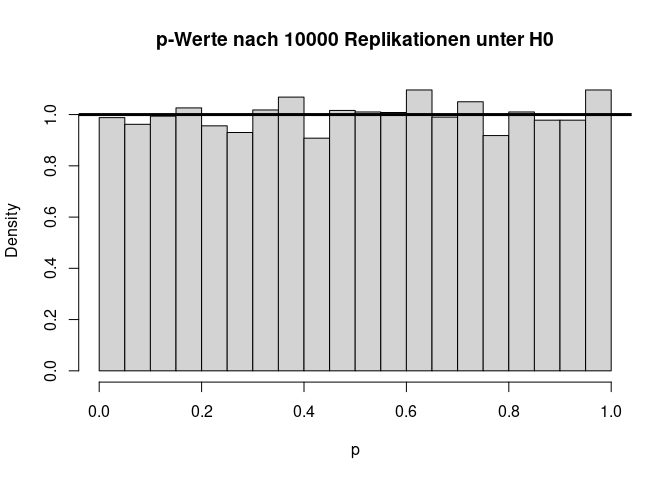
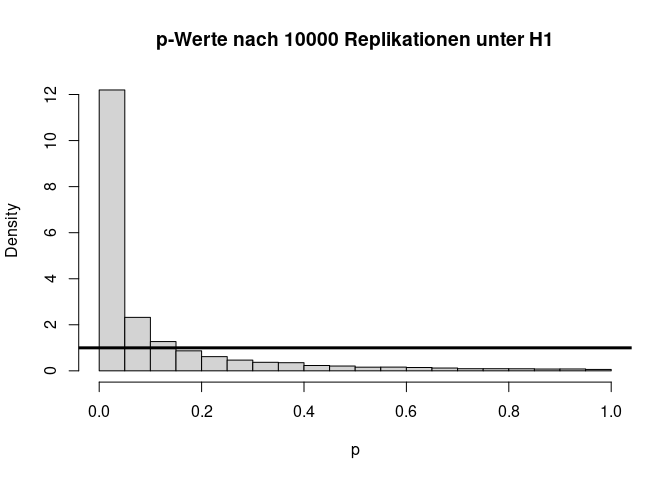
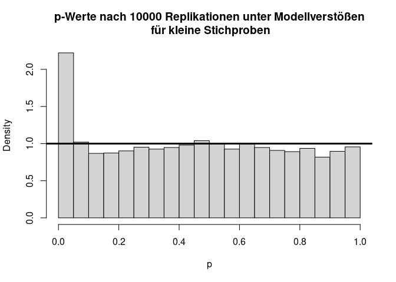

## Einleitung
Im Verlauf des Seminars _Vertiefung der Forschungsmethodik für Psychotherapeut:innen_ soll neben der Einführung in die Theorie und Hintergründe multivariater Verfahren auch eine Einführung in deren Umsetzung gegeben werden, sodass Sie in der Lage sind, diese Verfahren in Ihrem zukünftigen akademischen und beruflichen Werdegang zu benutzen. Für die Verwendung der Verfahren benötigen Sie natürlich Kenntnisse in einem Analysetool. `R` ist eine freie Software, die vor allem für (statistische) Datenanalysen verwendet wird. 
Bevor Sie mit `R` arbeiten können, sollten Sie dafür natürlich die nötige Software (`R` als Programmiersprache und `RStudio` als schöneres Interface) installiert haben. Hierzu eignet sich hervorragend der ebenfalls auf pandaR zu findende [`R`-Crash Kurs](/lehre/statistik-i/crash-kurs), der im Bachelor unterrichtet wird. Dort gibt es die Intro und Installationsanweisung sowohl in deutscher als auch in englischer Sprache. _Wir werden zu Beginn noch einige Basics von `R` wiederholen, aber die Zeit für eine detaillierte Aufarbeitung liegt leider nicht vor. Falls Sie Probleme mit dem Verständnis haben, arbeiten Sie bitte das angegebene Intro durch._


***

## RStudio

Das traditionelle `R` ist im Rahmen seiner Nutzeroberfläche einer Konsole ähnlich und damit nicht sehr benutzerfreundlich. Durch die Erweiterung mit `RStudio` wird die Verwendung deutlich erleichtert, weshalb wir dieses auch herunterladen. 


`RStudio` besteht aus vier Panels. Wenn wir `RStudio` zum ersten Mal öffnen sind jedoch nur drei sichtbar. Das vierte wird durch das Öffnen eines neuen Files sichtbar (oder auch durch **Strg+Shift+n** bzw. in OS X: **Cmd+Shift+n**). 

Zunächst betrachten wir das Fenster unten links - die Konsole. In dieser kann Code ausgeführt werden. Beispielsweise können wir dort eine Addition eingeben und erhalten nach dem Drücken von **Enter** dann das Ergebnis der Operation.


```r
2 + 1
```

```
## [1] 3
```

Auf diese Weise kann man zwar Aktionen ausführen, nach dem Schließen von `RStudio` hat man aber keine Dokumentation darüber, was man getan hat. Dafür ist das Script, also das eben neu geöffnete File, im linken oberen Fenster gedacht. Dort kann Code geschrieben und später auch gespeichert werden. Wenn wir unsere Addition nun dort notieren und anschließend **Enter** drücken passiert erstmal nichts. Damit etwas passiert, muss die Syntax mit dem Run Button  oder mit  **Strg+Return** (OS X: **cmd+Return**) ausgeführt werden. Das Ergebnis wird aber nicht im Script selbst, sondern in der Konsole angezeigt.

Oben rechts wird per Voreinstellung das *Environment* angezeigt, das wir gleich noch füllen werden. Unten rechts gibt es verschiedene Tabs wie beispielsweise die Hilfe und die Anzeige von Plots.

***

## Erste Schritte

Wir haben bereits eine Addition in unser Script geschrieben. Auch wenn wir dieses in zwei Jahren nochmal öffnen, werden wir uns wohl daran erinnern, was dieser Befehl macht. Das ist aber nicht immer so klar. Damit wir auch später noch wissen, weshalb wir eine Operation durchführen, brauchen wir also *Kommentare*. In `R` werden sie durch (beliebig viele) `#` begonnen und enden bei einem Zeilenumbruch. Mit Kommentaren kann Syntax auch in verschiedene Abschnitte gegliedert werden. Wir empfehlen, Abschnittüberschriften mit `####` zu beginnen und mit `----` zu beenden. RStudio erkennt solche Kommentare automatisch als Überschriften und stellt über den  Button eine darauf basierende Gliederung zur Verfügung.

Beispielsweise könnten wir unser Skript nun folgendermaßen besser lesbar machen.


```r
#### Wiederholung in R ----

1 + 2   # Addition
```

```
## [1] 3
```

In der Gliederung sollte in `RStudio` jetzt die Überschrift "Wiederholung in R" auftauchen.

Neben einfachen Taschenrechner-Funktionen mit *numerischen Ergebnissen* kann R auch logische Abfragen und Vergleiche durchführen. Hier folgt ein Beispiel für das Prüfen auf Gleichheit:


```r
3 == 4   # Logische Abfrage auf Gleichheit
```

```
## [1] FALSE
```

Die Ergebnisse dieser Abfragen sind *boolesch* - also immer entweder wahr (`TRUE`) oder falsch (`FALSE`). 

***

## Funktionen und Argumente

Die Umsetzung der Addition anhand normaler Zeichen ist recht simpel. Das ist jedoch eher eine Ausnahme, weshalb es in `R` vorprogrammierte Funktionen gibt. Für unsere bisherige Operation könnte man beispielsweise folgende Funktion nutzen:


```r
sum(1, 2) # Addition durch Funktion
```

```
## [1] 3
```

Hier wird die Funktion `sum` genutzt, um eine Summe der Argumente (`1` und `2`) zu bilden. An diesem Beispiel lässt sich bereits die generelle Struktur von Funktionen in `R` erkennen:

```
funktion(argument1, argument2, argument3, ...)
```

Wenn Argumente verschiedene Funktionen haben, sollten sie auch benannt werden. Ein einfaches Beispiel ist das Ziehen des Logarithmus. Hier gibt es zusätzlich zu der Zahl eine Basis. In `R` würde das dann so aussehen:


```r
log(x = 23, base = 10) # Benennung von Argumenten
```

```
## [1] 1.361728
```

Wenn die Benennung von Argumenten nicht gegeben ist, werden diese in ihrer Reihenfolge den Argumenten zugeordnet.

***

## Hilfe

Wenn man die Argumente einer Funktion (oder deren Reihenfolge) mal nicht kennt, bietet `R` ein sehr detailliertes und gut integriertes Hilfesystem.  Wenn man mehr Informationen bezüglich einer spezifischen Funktion benötigt, kann man `help` auf jede beliebige Funktion anwenden (bzw. `?` vor den Namen einer Funktion schreiben). Sie sollten - besonders zum Einstieg in `R` - häufig und gezielt diese Hilfe in Anspruch nehmen.


```r
?log
```

Die Hilfe zur Funktion wird im Panel unten rechts geöffnet und ist ein Dokument, in dem viele Informationen zu finden sind. Es besteht unter anderem aus einer Beschreibung der Funktion sowie einer Aufschlüsselung der Argumente und der Ergebnisse.

***

## Objekte und das Environment

Objekte dienen dazu, Ergebnisse abzulegen und diese in einer anderen Funktion zu verwenden. Die Zuweisung eines Ergebnisses zu einem Objekt erfolgt über den sog. Zuweisungspfeil `<-`.


```r
#### Objekte ----
my_num <- sum(3, 4, 1, 2) # Objekt zuweisen
```

Anders als zuvor wird in diesem Fall in der Konsole kein Ergebnis ausgedruckt, sondern lediglich der Befehl gespiegelt. Das Ergebnis der Summen-Funktion ist im Objekt `my_num` abgelegt. Dieses Objekt sollte nun auch im Panel oben rechts - spezifischer im Tab *Environment* - aufgetaucht sein.

Um den Inhalt eines Objektes abzurufen, müssen Sie lediglich den Namen des Objektes ausführen:


```r
my_num # Objekt anzeigen
```

```
## [1] 10
```

Das eigentliche Ziel von Objektzuweisungen ist aber (wie bereits gesagt), den Inhalt von Objekten an weitere Funktionen weiterreichen zu können. In diesem Beispiel nutzen wir `sqrt` - die Berechnung einer Wurzel.


```r
sqrt(my_num) # Objekt in Funktion einbinden
```

```
## [1] 3.162278
```

Der Inhalt des Objektes wird so als Argument in die Funktion `sqrt` übergeben. Das ist letztlich das Gleiche wie


```r
sqrt(sum(3, 4, 1, 2)) # Verschachtelte Funktionen
```

```
## [1] 3.162278
```

wo das Ergebnis nicht explizit in einem Objekt gespeichert wird, sondern direkt als Argument an eine Funktion weitergegeben wird. Dabei werden geschachtelte Funktionen von innen nach außen evaluiert. Die Aneinanderkettung von Objektzuweisungen und Schachtelungen ist unbegrenzt, sodass sehr komplexe Systeme entstehen können. Weil das aber sehr schnell anstrengend werden kann und man dabei leicht den Überblick verliert, was eigentlich wann ausgeführt wird, gibt es noch eine weitere Variante, Funktionen aneinander zu reihen: die *Pipe*.

Bei der Pipe `|>` wird ein links stehendes Objekt oder Ergebnis genommen und als *erstes Argument* der rechts stehenden Funktion eingesetzt. Für unser Wurzelbeispiel also:


```r
sum(3, 4, 1, 2) |> sqrt() # Nutzung Pipe
```

```
## [1] 3.162278
```

Das hat den immensen Vorteil, dass wir dadurch unseren Code wieder in der, im westlichen Kulturkreis üblichen Variante wie Text von links nach rechts lesen können. Dabei ist das was als erstes passiert links, das Ergebnis wird nach rechts weitergereicht und irgendetwas passiert damit. Ergebnisse, die man später noch braucht, sollten aber immer in einem Objekt abgelegt werden.

Ein Objekt kann nicht nur eine Zahl, sondern beispielsweise auch ein Vektor oder eine Matrix sein. Vektoren werden dabei mit `c()` und Matrizen mit `matrix()` erstellt.


```r
my_vec <- c(1, 2, 3, 4) # Erstellung Vektor
```

***

## Daten einlesen und verarbeiten

Alle Objekte, die bisher erstellt wurden, liegen im Workspace. Sobald wir `R` schließen, wird dieser Workspace geleert und die Objekte gehen verloren. In den meisten Fällen ist das explizit gewünschtes Verhalten - durch die Syntax können wir die Objekte ja wiederherstellen - aber in manchen Fällen ist es sinnvoll, Objekte wie Datensätze abzuspeichern und in späteren Schritten die bereits bearbeiteten Daten zu laden.

Im Rahmen der Einführung und der Wiederholung einiger Themen nutzen wir zunächst einen fiktiven Datensatz. Im weiteren Verlauf des Seminars werden wir dann echte Datensätze auswerten. Hier soll es um Depression in Beziehung zu einigen anderen Variablen gehen. Sie können den [ Datensatz "Depression.rda" hier herunterladen](/daten/Depression.rda).

### Daten laden
Der Datensatz ist im `R`-internen ".rda" Format abgespeichert - einem datensatzspezifischen Dateiformat. Wir können diesen Datensatz einfach mit der `load` Funktion laden. Wir müssen `R` nur mitteilen, wo der Datensatz liegt et voilà, er wird uns zur Verfügung gestellt. Liegt der Datensatz bspw. auf dem Desktop, so müssen wir den Dateipfad dorthin legen und können dann den Datensatz laden (wir gehen hier davon aus, dass Ihr PC "Musterfrau" heißt):


```r
load("C:/Users/Musterfrau/Desktop/Depression.rda")
```

Nun sollte in `RStudio` oben rechts in dem Fenster unter der Rubrik "Data" unser Datensatz mit dem Namen "_Depression_" erscheinen. 

Bei Dateipfaden ist darauf zu achten, dass bei  Linux  oder Mac OS Rechnern  immer Front-Slashes ("/") zum Anzeigen von Hierarchien zwischen Ordnern verwendet werden, während auf Windows Rechnern  bei Dateipfaden mit Back-Slashes gearbeitet wird ("\\"). `R` nutzt auf Windows Rechnern  ebenfalls Front-Slashes ("/").  Das bedeutet, dass, wenn wir auf Windows Rechnern  den Dateipfad aus dem Explorer kopieren, wir die Slashes "umdrehen" müssen.

Genauso sind Sie in der Lage, den Datensatz direkt aus dem Internet zu laden. Hierzu brauchen Sie nur die URL und müssen `R` sagen, dass es sich bei dieser um eine URL handelt, indem Sie die Funktion `url` auf den Link anwenden. Der funktionierende Befehl sieht so aus. (Es ist zu beachten, dass die URL in Anführungszeichen geschrieben werden muss):


```r
load(url("https://pandar.netlify.app/post/Depression.rda"))
```

An diesem Link erkennen wir, dass Websiten im Grunde auch nur schön dargestellte Ordnerstrukturen sind. So liegt auf der pandaR-Seite, die auf *netlify.app* gehostet wird, ein Ordner namens *daten*, in welchem wiederum das `Depression.rda` liegt.

Natürlich kann `R` auch andere Dateiformate einladen. Dafür gibt es jeweils spezifische Befehle, die sich meist sehr leicht per Internetrecherche finden lassen.


### Daten Screening 
Wir können uns die ersten (6) Zeilen des Datensatzes mit der Funktion `head` ansehen. Dazu müssen wir diese Funktion auf den Datensatz (das Objekt) `Depression` anwenden:


```r
head(Depression) # ersten 6 Zeilen
```

```
##   Lebenszufriedenheit Episodenanzahl Depressivitaet Neurotizismus   Intervention Geschlecht
## 1                   7              4              7             5 Kontrollgruppe          0
## 2                   5              5              8             3 Kontrollgruppe          1
## 3                   8              7              6             6 Kontrollgruppe          0
## 4                   6              4              5             5 Kontrollgruppe          1
## 5                   6              9              8             5 Kontrollgruppe          1
## 6                   8              7              8             6 Kontrollgruppe          1
```

Wir erkennen die 6 Spalten mit den Variablen Lebenszufriedenheit, Depressivitaet usw. Da es sich bei unserem Datensatz um ein Objekt vom Typ `data.frame` handelt, können wir die Variablennamen des Datensatzes außerdem mit der `names` Funktion abfragen. Eine weitere interessante Funktion ist `dim`, die die Anzahl der Zeilen und Spalten ausgibt. Mit `str` kann die Struktur des Datensatzes angezeigt werden. 


```r
names(Depression) # Namen der Variablen
```

```
## [1] "Lebenszufriedenheit" "Episodenanzahl"      "Depressivitaet"      "Neurotizismus"       "Intervention"       
## [6] "Geschlecht"
```

```r
dim(Depression) # Anzahl der Zeilen und Spalten 
```

```
## [1] 90  6
```

```r
str(Depression) # Informationen zu Variablentypen
```

```
## 'data.frame':	90 obs. of  6 variables:
##  $ Lebenszufriedenheit: num  7 5 8 6 6 8 7 5 8 6 ...
##  $ Episodenanzahl     : num  4 5 7 4 9 7 6 6 8 7 ...
##  $ Depressivitaet     : num  7 8 6 5 8 8 7 6 8 6 ...
##  $ Neurotizismus      : num  5 3 6 5 5 6 6 5 6 7 ...
##  $ Intervention       : Factor w/ 3 levels "Kontrollgruppe",..: 1 1 1 1 1 1 1 1 1 1 ...
##  $ Geschlecht         : Factor w/ 2 levels "0","1": 1 2 1 2 2 2 2 1 2 1 ...
```


Mit der Struktur bekommen wir für jede Variable den Typ und einige Werte angezeigt. Wir sehen, dass wir vier numerische Variablen und zwei Faktoren haben.

Im Kern werden in R drei Typen von Vektoren unterschieden:

Typ | Kurzform | Inhalt
--- | -------- | ------
`logical` | `logi` | wahr (`TRUE`) oder falsch (`FALSE`)
`numeric` | `num` | Beliebige Zahlen
`character` | `char` | Kombinationen aus Zahlen und Buchstaben


Um zu prüfen, ob ein Objekt oder eine Variable einen erwarteten Typ hat, können wir mit Funktionen vor den Typ-Namen `is.` schreiben und das als Funktion anwenden:


```r
is.factor(Depression$Geschlecht)
```

```
## [1] TRUE
```

Das Präfix `as.` wandelt dann Vektoren von einem Typ in einen anderen um (bspw. `as.numeric`). Das führen wir nun aber nicht aus, da die Typen insgesamt schon dem Wunsch entsprechen.

_**Tipp:** In `RStudio` können Sie sich Ihren Umgang mit der Software in vielen Dingen vereinfachen, indem Sie die automatische Vervollständigung der Software nutzen. Dies tun Sie, indem Sie bspw. `Depression$` tippen und dann den Tabulator [oder "Strg" + "Leertaste" auf Windows  oder Linux Rechner  oder "Control" + "Leertaste" auf Mac OS Rechnern ] auf Ihrer Tastatur drücken. Ihnen werden dann Vorschläge für mögliche Variablennamen aufgezeigt. Das Gleiche funktioniert auch in Funktionen. Hier müssen Sie zunächst den Funktionsnamen schreiben und die Klammern öffnen. Mit dem Tabulator erhalten Sie anschließend Vorschläge für mögliche Argumente, die Sie der Funktion übergeben können. Schauen Sie sich dies doch einmal an! Das Ganze funktioniert übrigens auch für das Vervollständigen von Dateipfaden. Hierbei muss allerdings darauf geachtet werden, dass diese in Anführungsstrichen geschrieben werden und Sie müssen beachten, wo ihr aktuelles Working-Directory liegt. Sie können allerdings auch den vollständigen Pfad eingeben, indem Sie auf Windows PCs  mit "C:/Users/" und auf Mac OS-Rechnern  mit "/Users/" beginnen und dann den Tabulator drücken und den jeweilig richtigen Ordner auswählen, bis Sie an Ihrer Zieldatei angekommen sind!_

Bei Faktoren können wir uns die verschiedenen Stufen mittels `levels` anzeigen lassen.


```r
levels(Depression$Geschlecht)
```

```
## [1] "0" "1"
```

Wir sehen also, dass die Variable Geschlecht zwei mögliche Ausprägungen hat. Diese sind jedoch auch numerisch kodiert, was für die Anschaulichkeit nicht sinnvoll ist. Wir wollen den Faktorstufen ihre Bedeutung zuordnen. In unserem Kodierschema finden wir die Information, dass die 0 für männlich steht, während die 1 für weiblich steht.


```r
levels(Depression$Geschlecht) <- c("maennlich", "weiblich")
```


### Datenextraktion

Bei der Datenauswertung und -inspektion kann es aber genauso wichtig sein, Einzelteile von Datensätzen zu extrahieren. Die einfache Extraktion funktioniert in `R` über eckige Klammern. Beispielsweise können wir uns den fünften Eintrag in der Depressivitaet anzeigen lassen:


```r
Depression$Depressivitaet[5] # Extrahieren
```

```
## [1] 8
```

Dabei kann man natürlich auch mehr als einen Wert auswählen, indem man Vektoren verwendet. Der Doppelpunkt bedeutet in dem Falle alle ganzen Zahlen zwischen den angegebenen Grenzen.


```r
Depression$Depressivitaet[c(1, 3:5)] # Mehrfach Extrahieren
```

```
## [1] 7 6 5 8
```

Weil wir die Variable einzeln auswählen und diese dadurch eindimensional ist, benötigen wir zur Auswahl von Elementen nur eine Information. Wenn wir aus dem vollen `data.frame` auswählen, sieht das natürlich anders aus. Um beispielsweise die Lebenszufriedenheit und Arbeitsbeanspruchung der ersten beiden Personen zu betrachten, müssen wir die ersten zwei Zeilen und ersten zwei Spalten ansprechen. Bei mehrdimensionalen Objekten werden in R die Dimensionen in eckigen Klammern einfach durch Kommata getrennt:


```r
Depression[c(1:2), c(1:2)] # Extrahieren aus Matrix
```

```
##   Lebenszufriedenheit Episodenanzahl
## 1                   7              4
## 2                   5              5
```

In R-Termini nimmt die Auswahlfunktion (die eckigen Klammern) in diesem Fall zwei Argumente entgegen: Zeile und Spalte. Wenn ein Argument ausgelassen wird, ist die Voreinstellung, dass alle Elemente dieser Dimension ausgegeben werden:


```r
Depression[1, ]   # 1. Zeile, alle Spalten
```

```
##   Lebenszufriedenheit Episodenanzahl Depressivitaet Neurotizismus   Intervention Geschlecht
## 1                   7              4              7             5 Kontrollgruppe  maennlich
```

### Daten verändern

Der Zuweisungspfeil funktioniert auch für Elemente größerer Objekte. Nehmen wir an, wir hätten uns bei der Eingabe der 5. Person im Geschlecht vertippt. Um die vorhandenen Daten zu überschreiben, können wir neue Werte direkt zuweisen. Beim Überschreiben eines Werts gibt es keinerlei Warnung. Sobald die Zuweisung ausgeführt ist, sind die Daten überschrieben und die vorherigen Daten verloren. Daher ist dies stets mit Vorsicht durchzuführen.


```r
Depression[5, 6]           # Aktuellen Inhalt abfragen
```

```
## [1] weiblich
## Levels: maennlich weiblich
```

```r
Depression[5, 6] <- "maennlich"    # Aktuellen Inhalt überschreiben
Depression[, 6]                    # Alle Geschlechter abfragen
```

```
##  [1] maennlich weiblich  maennlich weiblich  maennlich weiblich  weiblich  maennlich weiblich  maennlich weiblich 
## [12] weiblich  weiblich  weiblich  weiblich  weiblich  weiblich  maennlich weiblich  maennlich weiblich  weiblich 
## [23] weiblich  weiblich  weiblich  weiblich  weiblich  maennlich weiblich  weiblich  weiblich  maennlich weiblich 
## [34] weiblich  weiblich  maennlich maennlich maennlich weiblich  maennlich maennlich maennlich maennlich maennlich
## [45] maennlich maennlich weiblich  maennlich maennlich weiblich  maennlich weiblich  weiblich  maennlich maennlich
## [56] maennlich weiblich  maennlich maennlich maennlich maennlich maennlich maennlich maennlich maennlich maennlich
## [67] maennlich maennlich maennlich maennlich maennlich maennlich maennlich maennlich maennlich maennlich maennlich
## [78] maennlich maennlich maennlich maennlich maennlich maennlich weiblich  maennlich maennlich weiblich  maennlich
## [89] weiblich  weiblich 
## Levels: maennlich weiblich
```

***

## Einfache Analysen

Natürlich wollen wir nicht nur mit den Daten spielen, sondern Auswertungen durchführen, die unsere empirischen Fragestellungen beantworten können. Für viele wichtige Analysearten der Psychologie gibt es dabei schon vorgeschriebene Funktionen, deren Argumente nur mit den korrekten Analysen gefüllt werden müssen.

### Einfache Deskriptivstatistiken
Bevor wir mit den in der Vorlesung besprochenen Analysen anfangen, wollen wir uns noch schnell mit dem Bestimmen einfacher deskriptivstatistischer Größen vertraut machen. Mit der Funktion `mean` können wir den Mittelwert einer Variable bestimmen. Eine Schätzung für die Populationsvarianz erhalten wir mit `var`.  _Bei der `var`-Funktion wird der Vorfaktor $\frac{1}{n-1}$ verwendet, um einen unvrezerrten Schätzer für die Variation in der Population zu erhalten. Demnach handelt es sich um eine Populations- und nicht um eine Stichprobenschätzung. (Für mehr Informationen siehe bspw. [Eid, Gollwitzer und Schmitt, 2017](https://ubffm.hds.hebis.de/Record/HEB366849158), S. 162-163 in Kapitel 6.4.4 und S. 246-247 in Kapitel 8.5.1 oder [Agresti, & Finlay, 2013](https://ubffm.hds.hebis.de/Record/HEB369761391), Kapitel 3.2 und folgend)._


```r
mean(Depression$Depressivitaet) # Mittwelert
```

```
## [1] 5.655556
```

```r
var(Depression$Depressivitaet) # Varianz
```

```
## [1] 3.127216
```

Mit `summary` können wir uns die Zusammenfassung einer Variable ansehen. 


```r
summary(Depression$Depressivitaet) # Zusammenfassung numerisch
```

```
##    Min. 1st Qu.  Median    Mean 3rd Qu.    Max. 
##   1.000   5.000   6.000   5.656   7.000  10.000
```

```r
summary(Depression$Geschlecht) # Zusammenfassung factor
```

```
## maennlich  weiblich 
##        54        36
```

Im numerischen Fall erhalten wir in der Ausgabe einige beschreibende Kennwerte wie das Minimum, Maximum oder auch den Mittelwert. Beim Faktor hingegen wird eine Übersicht über die Verteilung erstellt. Wir erkennen, dass `summary` je nach Typ, auf den es angewendet wird, verschiedene Outputs erzeugt. Dies kann häufig auch einfach die Zusammenfassung einer Analyse sein, was wir später nochmal sehen werden. 

Als letztes schauen wir uns noch den Befehl `colMeans` an, welcher Mittelwerte eines Datensatzes über die Spalten (also pro Variable über alle Personen) bestimmt. Somit lassen sich ganz einfach für alle Variablen eines Datensatzes auf einmal die Mittelwerte bestimmen (`rowMeans` bestimmt, wie Sie sich wahrscheinlich denken, die Mittelwerte pro Zeile, also die Mittelwerte über alle Variablen pro Person):


```r
colMeans(Depression[1:4]) # Spaltenmittelwerte
```

Wir wählen hier nur die ersten vier Spalten, weil der Mittelwert für Faktoren nicht sinnvoll ist und in `R` eine Fehlermeldung erzeugt.

### Zusammenhang und lineare Regression

Die lineare Regression ist eine sehr einfache Analye, um den Zusammenhang zwischen zwei Variablen zu untersuchen. 

Natürlich ist die Analyse nicht ohne Voraussetzungen. Diese sind im folgenden der Vollständigkeit halber aufgeführt, werden aber nicht nochmal näher betrachtet.

1. Linearität: der Zusammenhang muss linear sein $\rightarrow$ Grafische Überprüfung (Scatterplot)  
2. Varianzhomogenität (Homoskedastizität) der Fehler: der Fehler jedes Wertes der UV hat annähernd die gleiche Varianz  
3. Normalverteilung der Fehlervariablen  
4. Unabhängigkeit der Fehler 

Eine simple Darstellung des Zusammenhangs kann man über die `plot`-Funktion abbilden. Schönere Grafiken erhält man mittels des Befehls `ggplot`, zu dem Sie sich [hier](/lehre/statistik-ii/grafiken-mit-ggplot2) nochmal genauer informieren können. 


```r
plot(Depression$Lebenszufriedenheit, Depression$Depressivitaet, xlab = "Lebenszufriedenheit", ylab = "Depressivitaet")
```

<!-- -->

Die Umsetzung der Parameterschätzung anhand der kleinsten Quadrate ist mit der Funktion `lm` möglich. Beachten Sie hierbei, dass angegeben wird, welche Variable durch welche Variable vorhergesagt wird. Das bedeutet, dass wir hier zuerst Depressivitaet und dann Lebenszufriedenheit nennen müssen, wenn wir Depressivitaet durch Lebenszufriedenheit vorhersagen wollen.


```r
lm(Depressivitaet ~ Lebenszufriedenheit, Depression) # lineare Regression
```

```
## 
## Call:
## lm(formula = Depressivitaet ~ Lebenszufriedenheit, data = Depression)
## 
## Coefficients:
##         (Intercept)  Lebenszufriedenheit  
##              9.1217              -0.5416
```

Der hier gegebene Output enthält zwar die wichtigsten Informationen, doch wird eigentlich noch viel mehr innerhalb der Funktion berechnet. Dies ist ein gutes Beispiel dafür, dass es manchmal Sinn macht, auch die Ergebnisse der Analyse in ein Objekt abzulegen.


```r
model <- lm(Depressivitaet ~ Lebenszufriedenheit, Depression) # Objektzuweisung
```

Beispielsweise können wir wie bereits angedeutet die Funktion `summary` verwenden, um eine Zusammenfassung der Ergebnisse zu erhalten.


```r
summary(model)
```

```
## 
## Call:
## lm(formula = Depressivitaet ~ Lebenszufriedenheit, data = Depression)
## 
## Residuals:
##     Min      1Q  Median      3Q     Max 
## -4.4138 -0.9346  0.1278  1.0446  3.5862 
## 
## Coefficients:
##                     Estimate Std. Error t value Pr(>|t|)    
## (Intercept)           9.1217     0.7092  12.862  < 2e-16 ***
## Lebenszufriedenheit  -0.5416     0.1078  -5.026 2.61e-06 ***
## ---
## Signif. codes:  0 '***' 0.001 '**' 0.01 '*' 0.05 '.' 0.1 ' ' 1
## 
## Residual standard error: 1.568 on 88 degrees of freedom
## Multiple R-squared:  0.223,	Adjusted R-squared:  0.2142 
## F-statistic: 25.26 on 1 and 88 DF,  p-value: 2.614e-06
```

Hier werden uns neben dem Steigungskoeffizienten und dem Achsenabschnitt beispielsweise auch noch deren Signifikanz und $R^2$ angezeigt. 

Doch es gibt noch einige weitere Informationen, die von der Funktion `lm` abgelegt werden. Die Bezeichnungen aller Einträge in der Liste `model` können über `names` abgefragt werden.


```r
names(model) #andere Inhalte der Liste
```

```
##  [1] "coefficients"  "residuals"     "effects"       "rank"          "fitted.values" "assign"        "qr"           
##  [8] "df.residual"   "xlevels"       "call"          "terms"         "model"
```

Die weiteren Inhalte umfassen unter anderem die `residuals`, die für das Prüfen der Voraussetzungen wichtig wären, aber auch die vorhergesagten Werte.
Auf eine interessierende Information können wir wieder mithilfe des `$` zugreifen (also bspw. `model$residuals`).


Nachdem wir nun eine kurze Wiederholung zur Analyse des Zusammenhangs zwischen zwei Variablen betrachtet haben, geht es im folgenden Teil um den Unterschied zwischen Gruppen.

### Der $t$-Test
Ein sehr einfacher statistischer Test auf Unterschied ist der $t$-Test (für eine Wiederholung siehe bspw. [Eid, et al., 2017](https://ubffm.hds.hebis.de/Record/HEB366849158), Kapitel 11.1 oder [Agresti, & Finlay, 2013,](https://ubffm.hds.hebis.de/Record/HEB369761391) Kapitel 6.2 und folgend). Mit Hilfe dieses Tests soll untersucht werden, ob die Mittelwerte in zwei Gruppen gleich sind. Dazu brauchen wir drei wichtige Annahmen: 

  1) Die Beobachtungen stammen aus einer _independent and identically distributed_ (i.i.d., deutsch: unabhängig und identisch verteilt) Population (dies bedeutet, dass alle Beobachtungen unabhängig sind und den gleichen Verteilungs- und Modellannahmen unterliegen), 
  2) die Daten in beiden Gruppen sind normalverteilt mit 
  3) gleicher Varianz (Varianzhomogenität). 

Die 1. Annahme ist sehr kritisch und lässt sich leider nicht prüfen. Sie lässt sich aber durch das Studiendesign zumindest plausibilisieren. Für die anderen beiden Annahmen gibt es verschiedene Tests und deskriptive Verfahren, um ein Gefühl für ihr Vorliegen zu erhalten. Das Prüfen der Voraussetzungen werden wir nun aber nicht genauer betrachten und gehen davon aus, dass diese gegeben sind.

In diesem Beispiel wollen wir uns damit beschäftigen, ob die Depressivitaetswerte in den Gruppen der Männer und Frauen gleich verteilt sind. Wir beschäftigen uns mit unabhängigen Stichproben. Für die Testung stellen wir die folgenden Null-Hypothese auf - die Gleichheit der Mittelwerte in den beiden Gruppen:
$$H_0: \mu_1=\mu_2$$
Diese Hypothese gilt nicht, wenn $\mu_1\neq\mu_2$. In diesem Fall gilt irgendeine Alternativhypothese ($H_1$) mit einer Mittelwertsdifferenz $d=\mu_1-\mu_2$, die nicht Null ist $(d\neq0)$. Das würde bedeuten, dass sich die Depressivitaets-Werte für Männer und Frauen unterscheiden. Wir sprechen hier von einer Alternativhypothese, da in der (frequentistischen) Statistik immer feste Werte für die Parameter in der Population angenommen werden müssen. Wenn die $H_0$ nicht gilt, so muss entsprechend auch ein fester Wert für die Differenz der Mittelwerte $d$ angenommen werden. 


```r
t.test(Depressivitaet ~ Geschlecht,  # abhängige Variable ~ unabhängige Variable
       data = Depression, # Datensatz
       paired = FALSE, # Stichproben sind unabhängig 
      alternative = "two.sided",        # zweiseitige Testung (Default)
      var.equal = TRUE,                 # Homoskedastizität liegt vor (-> Levene-Test)
      conf.level = .95)                 # alpha = .05 (Default)
```

```
## 
## 	Two Sample t-test
## 
## data:  Depressivitaet by Geschlecht
## t = -7.4955, df = 88, p-value = 4.908e-11
## alternative hypothesis: true difference in means between group maennlich and group weiblich is not equal to 0
## 95 percent confidence interval:
##  -2.834830 -1.646651
## sample estimates:
## mean in group maennlich  mean in group weiblich 
##                4.759259                7.000000
```

Schauen wir uns die Informationen, die der Output enthält, genauer an:


```
## 
## 	Two Sample t-test
```
zeigt an, dass es sich um einen Zwei-Stichproben $t$-Test handelt.


```
## data:  Depressivitaet by Geschlecht
## t = -7.4955, df = 88, p-value = 4.908e-11
```
zeigt uns die Datengrundlage (`X` und `Y`), den $t$-Wert, die $df$ und den $p$-Wert. 

$t$-Wert $t$(88) $=$ -7.4955 und $p$-Wert $p < .001$, somit ist dieser Mittelwertsvergleich auf dem 5%-Niveau signifikant. 


```
## alternative hypothesis: true difference in means between group maennlich and group weiblich is not equal to 0
## 95 percent confidence interval:
##  -2.834830 -1.646651
## sample estimates:
## mean in group maennlich  mean in group weiblich 
##                4.759259                7.000000
```
zeigt uns die Alternativhypothese ($H_1:d \neq 0$), das Konfidenzintervall der Mittelwertsdifferenz sowie die Mittelwerte in den beiden Gruppen ($\bar{X}_m=$ 4.7592593, $\bar{X}_w=$ 7). Dadurch können wir auch erkennen, dass die empirische Mittelwertsdifferenz bei $d =$ -2.2407 liegt.

Wie bei der Regression können wir auch den Test als Objekt ablegen. Wenn wir `names` darauf anwenden, sehen wir wieder alle Namen, die wir hinter `$` schreiben können.


```r
ttest <- t.test(Depressivitaet ~ Geschlecht,  # abhängige Variable ~ unabhängige Variable
       data = Depression, # Datensatz
       paired = FALSE, # Stichproben sind unabhängig 
      alternative = "two.sided",        # zweiseitige Testung (Default)
      var.equal = TRUE,                 # Homoskedastizität liegt vor (-> Levene-Test)
      conf.level = .95)                 # alpha = .05 (Default)
names(ttest)    # alle möglichen Argumente, die wir diesem Objekt entlocken können
```

```
##  [1] "statistic"   "parameter"   "p.value"     "conf.int"    "estimate"    "null.value"  "stderr"      "alternative"
##  [9] "method"      "data.name"
```

```r
ttest$statistic # (empirischer) t-Wert
```

```
##         t 
## -7.495507
```

```r
ttest$p.value   # zugehöriger p-Wert
```

```
## [1] 4.908264e-11
```

Da die Null-Hypothese verworfen wird, nehmen wir an, dass es in der Population einen Mittelwertsunterschied zwischen der Depressivitaet von Männern und Frauen gibt.

Nun sind wir am Schluss des behandelten Codes in der Seminar-Sitzung angekommen. Die Grundlagen von `R` und einigen statistischen Verfahren sind nun aufgefrischt. Der nächste Teil beschäftigt sich nochmal inhaltlich mit den grundlegenden Begriffen der Inferenzstatistik.

***

# Grundlagen der Inferenzstatistik

`R` kann bei der Veranschaulichung der grundlegenden Begriffe der Inferenzstatistik sehr hilfreich sein, weil wir verschiedene Populationsannahmen selbst treffen können. Anschließend können wir Stichproben simulieren und die üblichen Kennwerte betrachten.

### Simulieren der Stichproben
Wir können in `R` relativ simpel normalverteilte Variablen simulieren. Für weitere Informationen zur Simulation von Verteilungen siehe bspw. [`R`-Verteilungen auf Wiki](https://en.wikibooks.org/wiki/R_Programming/Probability_Distributions) oder [hier auf pandaR](/lehre/statistik-i/verteilungen/). Den Code der hier durchgeführten Simulationen können Sie [Appendix A](#AppendixA) entnehmen (geht über den Inhalt des Seminars hinaus). Nehmen wir an, dass wir als Grundlage unserer Stichprobe die Standardnormalverteilung $\mathcal{N}(0,1)$ haben. Wir ziehen 1000 Personen aus dieser Population und lassen uns ein Histogramm sowie den Mittelwert und die geschätzte Populationsstandardabweichung ausgeben. 

<!-- -->

```
## [1] -0.002997332
```

```
## [1] 0.9956916
```

Natürlich liegen der geschätzte Mittelwert und die Standardabweichung nicht genau auf den wahren Werten, was am **Sampling-Error** liegt. Der Sampling-Error beschreibt die zufällige Schwankung, die durch das Ziehen der Stichprobe aus einer Population (Grundgesamtheit) entsteht. 

Simulieren wir noch eine zweite Stichprobe standardnormalverteilter Zufallsvariablen, so können wir diese beiden Stichproben mit Hilfe des $t$-Tests vergleichen. 


```
## 
## 	Two Sample t-test
## 
## data:  group1 and group2
## t = -1.4456, df = 1998, p-value = 0.1484
## alternative hypothesis: true difference in means is not equal to 0
## 95 percent confidence interval:
##  -0.15317201  0.02317988
## sample estimates:
##    mean of x    mean of y 
## -0.002997332  0.061998736
```

Der Output ist uns bereits bekannt. Da die Null-Hypothese nicht verworfen wird, bedeutet dies, dass wir weiterhin annehmen, dass die Mittelwertsdifferenz in der Population tatsächlich 0 ist (was wir auch so vorgegeben haben). Die Mittelwertsdifferenz in der Stichprobe ist offensichtlich nicht 0, aber sie liegt so nah an der 0, dass diese Abweichung wahrscheinlich durch Zufall passiert ist und sich nicht auf die Population verallgemeinern lässt (siehe als Wiederholung [Eid, et al., 2017](https://ubffm.hds.hebis.de/Record/HEB366849158), Kapitel 11.1 für den $t$-Test und Kapitel 8 für Inferenzstatistikgrundlagen und Hypothesentests, bzw. [Agresti, & Finlay, 2013](https://ubffm.hds.hebis.de/Record/HEB369761391), Kapitel 6).

### Verteilung unter $H_0$
Wenn wir dieses Experiment nun ganz häufig wiederholen, sollte die Teststatistik $t=\frac{\bar{X}-\bar{Y}}{\sigma_p}$ (wobei $\bar{X}$ und $\bar{Y}$ die Mittelwerte der Stichproben $X$ und $Y$ sind und $\sigma_p$ die gepoolte Standardabweichung beschreibt) der $t$-Verteilung folgen, welcher wir dann den $p$-Wert ablesen können. 

<!-- --><!-- -->

Die beiden Histogramme zeigen die empirische Verteilung der $t$- und $p$-Werte unter der $H_0$-Hypothese nach 10000 (unabhängigen) Wiederholungen sowie die angenommene Verteilung (fette durchgezogene schwarze Linie).  Von den $p$-Werten wird erwartet, dass sie sich gleich (uniform) auf das Intervall zwischen 0 und 1 verteilen. Somit landen dann nur 5% der $p$-Werte mit zugehörig großen Teststatistiken (zufällig) im Bereich $p<0.05$.


### Verteilung unter $H_1$
Angenommen die $H_0$-Hypothese gilt nicht und es liegt tatsächlich eine Mittelwertsdifferenz von bspw. $d=0.1$ ($H_1: \mu_1 - \mu_2 = 0.1$) vor, dann hat dies folgende Auswirkungen auf die Verteilung der Teststatistik und die zugehörigen $p$-Werte:

<!-- --><!-- -->

Wir sehen sehr deutlich, dass die Teststatistik $t$ deutlich nach rechts verschoben ist und nicht mehr zur theoretischen Verteilung unter der $H_0$-Hypothese passt. Auch die $p$-Werte sind alles andere als gleichverteilt. Folglich sprechen extreme $t$-Werte gegen die Null-Hypothese, weswegen wir diese verwerfen, wenn wir einen extremen Wert beobachten. Hier liegen 60.99% der $p$-Werte unterhalb von $0.05$. Dies wird auch als **Power** (siehe im Kapitel 8 in [Eid, et al., 2017](https://ubffm.hds.hebis.de/Record/HEB366849158) Wiederholungen der Begriffe Power und $\alpha$-Fehler) bezeichnet. Somit hat der $t$-Test für eine Mittelwertsdifferenz von $d$=.1 und eine Stichprobengröße von insgesamt n = 2000 eine Power von rund 60.99%. Dies bedeutet, dass in diesem Fall die $H_0$ in 60.99% der Fälle richtigerweise verworfen wird. Schauen wir uns die Power der $t$-Tests einmal für verschiedene Stichprobengröße ($n$) und Mittelwertsdifferenzen ($d$) an:


Die horizontal gepunktete Linie zeigt eine Power von 5% an (also das vorgegebene $\alpha$-Niveau) und die horizontal gestrichelte Linie zeigt eine Power von 80% an. 

Wir sehen sehr deutlich, dass für alle Stichprobengrößen (farblich kodiert) von $n=2$ bis $n=1000$ (pro Gruppe) die Power bei einer Mittelwertsdifferenz von 0 gerade bei ca. 5% liegt. Die Mittelwertsdifferenz von 0 beschreibt gerade die Null-Hypothese, dass es keinen Mittelwertsunterschied gibt. In diesem Fall beobachten wir den $\alpha$-Fehler dieses Tests, nämlich die Wahrscheinlichkeit, zufällig die Null-Hypothese zu verwerfen, obwohl diese gilt. Die Power von 5% war somit zu erwarten, da dies gerade das $\alpha$-Niveau dieses Tests ist (welches wir uns auch vorher so vorgegeben haben). In der Regel wird $\alpha = .05$ gewählt. 

Was wir auch erkennen ist, dass für sehr große Stichproben die Power dieses Tests schon für sehr kleine Mittelwertsdifferenzen groß ist (idealerweise sprechen Methodiker von einem Test mit hinreichender Power, wenn diese größer als 80% ist). Dieses Beispiel veranschaulicht, dass eine hohe Power (also eine hohe Wahrscheinlichkeit einen Effekt zu finden, wenn dieser da ist) voraussetzt, dass ein Effekt vorhanden ist (was sehr trivial klingt und es eigentlich auch ist) und zudem die Stichprobengröße hinreichend groß sein muss. Mit hinreichend groß hält sich der/die Statistiker/in die Hintertür offen zu sagen, dass a) im Falle eines kleinen Effekts die Stichprobengröße eben sehr groß sein muss, um diesen zu erkennen und b) bei Vorliegen eines sehr großen Effekts schon eine kleine Stichprobengröße ausreicht, um den Effekt mit hinreichender Wahrscheinlichkeit auch als solchen zu identifizieren. Aus diesem Grund werden **Poweranalysen** durchgeführt, um festzustellen, welche Stichprobengröße erforderlich ist, um bei einem vorgegebenem erwarteten Effekt hinreichende Power zu haben, diesen auch zu entdecken.

### Verstöße gegen die Modellannahmen
Liegen andere Verstöße gegen die Modellannahmen vor, dann kann es fälschlicherweise zu signifikanten Ergebnissen kommen, obwohl es in der Population gar keinen Effekt gibt. Dies ist oft bei kleinen Stichproben ein Problem. Nehmen wir beispielsweise an, dass die beiden Gruppen sehr gegenläufig schief verteilt sind.

<!-- -->

Hier gilt zwar die Null-Hypothese, da beide Verteilungen einen theoretischen Mittelwert von 0 haben, aber die Varianzen unterscheiden sich (was im Histogramm  durch die extremeren Werte entlang der x-Achse zu erkennen ist) und die Variablen sind offensichtlich nicht normalverteilt. Schauen wir uns nun die Power des $t$-Tests für eine sehr kleine Stichprobe von 5 pro Gruppe an:

<!-- --><!-- -->

Insgesamt sieht die Verteilung der $t$-Werte einigermaßen in Ordnung, wenn auch etwas schief, aus. Doch bei den $p$-Werten fällt auf, dass die Null-Hypothese zu häufig verworfen wird, nämlich insgesamt in 11.11% der Fälle (durch Zufall, da die Null-Hypothese eigentlich gilt!); also doppelt so häufig wie von uns vorgegeben! Glücklicherweise ist der $t$-Test relativ robust, was daran zu erkennen ist, dass, wenn die Stichprobengröße für dieses Beispiel bei 50 oder gar höher liegt (pro Gruppe), das $\alpha$-Niveau schon wieder einigermaßen eingehalten wird. Außerdem gibt es geeignetere Tests zum Untersuchen von Mittelwertsunterschieden zweier Stichproben als den $t$-Test - nämlich den Welch-Test. Dies ist eine Erweiterung des $t$-Tests für ungleiche Varianzen. Dieser ist auch der Default in `R`. Wir rechnen ihn, indem wir nicht länger `var.equal = T` in `t.test` spezifizieren. Der Output ändert sich bis auf die Namensänderung kaum - die Freiheitsgrade des Tests werden korrigiert, um auf die ungleichen Varianzen zu reagieren (dies bedeutet, immer wenn die Freiheitsgrade nicht einfach $n-2$ sind, dann wurde der Welch-Test gerechnet; insbesondere sind Kommazahlen als $df$ möglich). Jedoch bringt diese Erweiterung ebenfalls nur für größere Stichproben etwas. Die analoge Simulationsstudie können Sie [Appendix A](#AppendixA) entnehmen. Dort finden Sie wie bereits erwähnt auch den Code für viele der hier gezeigten Grafiken und Informationen zur Simulation von Stichproben an sich.

Diese Sitzung sollte als Einführung in `R`, Vorbereitung für die Regressionssitzung und kleine Wiederholung einiger wichtiger inferenzstatistischer Begriffe (wie etwa $\alpha$-Fehler, Power, Hypothese etc.) fungieren. 


***

## Appendix

### Appendix A {#AppendixA}

Hier ist der Code für einige Grafiken und Simulationen dargestellt. Dies geht natürlich über den Stoff des Seminars hinaus und ist nur für Interessierte bestimmt.


#### Simulation von Stichproben

Wir müssen  diesem Befehl lediglich übergeben, wie viele Replikationen wir wünschen und welchen Mittelwert und welche Standardabweichung die Zufallsvariablen haben sollen. Wir simulieren die Standardnormalverteilung $\mathcal{N}(0,1)$ und legen die generierte (realisierte) Zufallsvariable in einem Objekt mit dem Namen `group1` ab, um später gezeigte Informationen wie den Mittelwert oder die Standardabweichung abrufen zu können - dies machen wir mit dem "Zuordnungspfeil". Um zufällige Prozesse über verschiedene Zeitpunkte hinweg konstant zu halten (damit es replizierbar ist und Sie dasselbe Ergebnis bekommen), wird zunächst ein Startpunkt für den Zufallsprozess mittels `set.seed` gesetzt.


```r
set.seed(1234567) # für Replizierbarkeit (bei gleicher R Version, kommen Sie mit diesem Seed zum selben Ergebnis!)
group1 <- rnorm(n = 1000, mean = 0, sd = 1) # Standardnormalverteilung mit n = 1000
hist(group1)
```

<!-- -->

```r
mean(group1)
```

```
## [1] -0.002997332
```

```r
sd(group1)
```

```
## [1] 0.9956916
```


```r
# Simulation der zweiten Stichprobe
set.seed(2)
group2 <- rnorm(n = 1000, mean = 0, sd = 1)
ttest <- t.test(group1, group2, var.equal = T)
ttest # Vergleich zwischen den beiden Stichproben
```

```
## 
## 	Two Sample t-test
## 
## data:  group1 and group2
## t = -1.4456, df = 1998, p-value = 0.1484
## alternative hypothesis: true difference in means is not equal to 0
## 95 percent confidence interval:
##  -0.15317201  0.02317988
## sample estimates:
##    mean of x    mean of y 
## -0.002997332  0.061998736
```

#### Verteilung unter $H_0$

```r
ts <- c(); ps <- c() # wir brauchen zunächst Vektoren, in die wir die t-Werte und die p-Werte hineinschreiben können
for(i in 1:10000)
{
    group1 <- rnorm(n = 1000, mean = 0, sd = 1)
    group2 <- rnorm(n = 1000, mean = 0, sd = 1)
    ttest <- t.test(group1, group2, var.equal = T)
    ts <- c(ts, ttest$statistic) # nehme den Vektor ts und verlängere ihn um den neuen t-Wert
    ps <- c(ps, ttest$p.value)   # nehme den Vektor ps und verlängere ihn um den neuen p-Wert
}

hist(ts, main = "(empirische) t-Werte nach 10000 Replikationen unter H0", xlab = expression("t"[emp]), freq = F)
lines(x = seq(-4,4,0.01), dt(x = seq(-4,4,0.01), df = ttest$parameter), lwd = 3)
```

<!-- -->

```r
hist(ps, main = "p-Werte nach 10000 Replikationen unter H0", xlab = "p", freq = F)
abline(a = 1, b = 0, lwd = 3)
```

<!-- -->

#### Verteilung unter $H_1$

```r
ts <- c(); ps <- c() # wir brauchen zunächst Vektoren, in die wir die t-Werte und die p-Werte hineinschreiben können
for(i in 1:10000)
{
    group1 <- rnorm(n = 1000, mean = 0, sd = 1)
    group2 <- -0.1 + rnorm(n = 1000, mean = 0, sd = 1) # Mittelwertsdifferenz ist 0.1
    ttest <- t.test(group1, group2, var.equal = T)
    ts <- c(ts, ttest$statistic) # nehme den Vektor ts und verlängere ihn um den neuen t-Wert
    ps <- c(ps, ttest$p.value)   # nehme den Vektor ps und verlängere ihn um den neuen p-Wert
}

hist(ts, main = "(empirische) t-Werte nach 10000 Replikationen unter H1", xlab = expression("t"[emp]), freq = F)
lines(x = seq(-4,4,0.01), dt(x = seq(-4,4,0.01), df = ttest$parameter), lwd = 3)
```

<!-- -->

```r
hist(ps, main = "p-Werte nach 10000 Replikationen unter H1", xlab = "p", freq = F)
abline(a = 1, b = 0, lwd = 3)
```

<!-- -->

#### Stichprobenziehung mit Modellverstößen


```r
set.seed(1)
par(mfrow = c(1,2))

group1 <- -rexp(1000, 1)
group1 <- group1 + 1
group2 <- rexp(1000, 2)
group2 <- group2 - 1/2
hist(group1); hist(group2)
```

<!-- -->

#### Verteilung unter $H_0$ mit Modellverstößen


```r
set.seed(1)
ts <- c(); ps <- c() # wir brauchen zunächst Vektoren, in die wir die t-Werte und die p-Werte hineinschreiben können
for(i in 1:10000)
{
       group1 <- -rexp(n = 5, rate = 1) # simuliere Exponentialverteilung zur Rate 1 mit n = 5
        group1 <- group1 + 1 # zentriere, sodass der Populationsmittelwert wieder 0 ist
        group2 <- rexp(n = 5, rate = 2) # simuliere Exponentialverteilung zur Rate 2 mit n = 5
        group2 <- group2 - 1/2 # zentriere, sodass der Populationsmittelwert wieder 0 ist
        ttest <- t.test(group1, group2, var.equal = T)
        ts <- c(ts, ttest$statistic) # nehme den Vektor ts und verlängere ihn um den neuen t-Wert
        ps <- c(ps, ttest$p.value)   # nehme den Vektor ps und verlängere ihn um den neuen p-Wert
}

hist(ts, main = "t-Werte nach 10000 Replikationen unter Modellverstöße\n für kleine Stichproben", xlab = expression("t"[emp]), freq = F, breaks = 50)
lines(x = seq(-4,4,0.01), dt(x = seq(-4,4,0.01), df = ttest$parameter), lwd = 3)
```

<!-- -->

```r
hist(ps, main = "p-Werte nach 10000 Replikationen unter Modellverstößen\n für kleine Stichproben", xlab = "p", freq = F)
abline(a = 1, b = 0, lwd = 3)
```

<!-- -->

#### Verteilung unter $H_0$ mit Modellverstößen: Welch-Test

```r
set.seed(1)
ts <- c(); ps <- c() # wir brauchen zunächst Vektoren, in die wir die t-Werte und die p-Werte hineinschreiben können
for(i in 1:10000)
{
        group1 <- -rexp(n = 5, rate = 1) # simuliere Exponentialverteilung zur Rate 1 mit n = 5
        group1 <- group1 + 1 # zentriere, sodass der Populationsmittelwert wieder 0 ist
        group2 <- rexp(n = 5, rate = 2) # simuliere Exponentialverteilung zur Rate 2 mit n = 5
        group2 <- group2 - 1/2 # zentriere, sodass der Populationsmittelwert wieder 0 ist
        ttest <- t.test(group1, group2) # Welch Test
        ts <- c(ts, ttest$statistic) # nehme den Vektor ts und verlängere ihn um den neuen t-Wert
        ps <- c(ps, ttest$p.value)   # nehme den Vektor ps und verlängere ihn um den neuen p-Wert
}

hist(ts, main = "t-Werte (des Welch t-Tests) nach 10000 Replikationen\n unter Modellverstöße für kleine Stichproben", xlab = expression("t"[emp]), freq = F)
lines(x = seq(-4,4,0.01), dt(x = seq(-4,4,0.01), df = ttest$parameter), lwd = 3)
```

<!-- -->

```r
hist(ps, main = "p-Werte (des Welch t-Tests) nach 10000 Replikationen\n unter Modellverstößen für kleine Stichproben", xlab = "p", freq = F)
abline(a = 1, b = 0, lwd = 3)
```

<!-- -->
Insgesamt sieht die Verteilung der Teststatistik (also quasi der empirischen $t$-Werte) einigermaßen in Ordnung aus, wenn auch etwas schief, doch bei den $p$-Werten fällt auf, dass die Null-Hypothese zu häufig verworfen wird, nämlich insgesamt in 10% der Fälle (durch Zufall, da die Null-Hypothese eigentlich gilt!); also doppelt so häufig wie von uns vorgegeben! Hier gibt es kaum Unterschiede zum ursprünglichen $t$-Test mit gleichen Varianzen. Allerdings ist die Stichprobengröße hier mit 5 pro Gruppe recht klein!


#### Verteilung unter $H_0$ mit Modellverstößen mit größerer Stichprobe: Welch-Test

```r
set.seed(1234)
ts <- c(); ps <- c() # wir brauchen zunächst Vektoren, in die wir die t-Werte und die p-Werte hineinschreiben können
for(i in 1:10000)
{
        group1 <- -rexp(n = 100, rate = 1) # simuliere Exponentialverteilung zur Rate 1 mit n = 100
        group1 <- group1 + 1 # zentriere, sodass der Populationsmittelwert wieder 0 ist
        group2 <- rexp(n = 100, rate = 2) # simuliere Exponentialverteilung zur Rate 2 mit n = 100
        group2 <- group2 - 1/2 # zentriere, sodass der Populationsmittelwert wieder 0 ist
        ttest <- t.test(group1, group2) # Welch Test
        ts <- c(ts, ttest$statistic) # nehme den Vektor ts und verlängere ihn um den neuen t-Wert
        ps <- c(ps, ttest$p.value)   # nehme den Vektor ps und verlängere ihn um den neuen p-Wert
}

hist(ts, main = "t-Werte (des Welch t-Tests) nach 10000 Replikationen\n unter Modellverstöße für größere Stichproben", xlab = expression("t"[emp]), freq = F)
lines(x = seq(-4,4,0.01), dt(x = seq(-4,4,0.01), df = ttest$parameter), lwd = 3)
```

<!-- -->

```r
hist(ps, main = "p-Werte (des Welch t-Tests) nach 10000 Replikationen\n unter Modellverstößen für größere Stichproben", xlab = "p", freq = F)
abline(a = 1, b = 0, lwd = 3)
```

<!-- -->

Für jeweils 100 Erhebungen pro Gruppe ist der Verstoß gegen die Normalverteilungsannahme bei ungleichen Varianzen für den Welch-Test fast zu vernachlässigen.




## Literatur

[Agresti, A, & Finlay, B. (2013).](https://ubffm.hds.hebis.de/Record/HEB369761391) *Statistical methods for the social sciences.* (Pearson new international edition, 4th edition). Harlow, Essex : Pearson Education Limited.

[Eid, M., Gollwitzer, M., & Schmitt, M. (2017).](https://ubffm.hds.hebis.de/Record/HEB366849158) *Statistik und Forschungsmethoden* (5. Auflage, 1. Auflage: 2010). Weinheim: Beltz.


*<small> *Blau hinterlegte Autor:innenangaben führen Sie direkt zur universitätsinternen Ressource.* </small>
