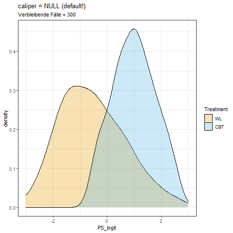

#### Pakete laden
```{r message=FALSE}
# Benötigte Pakete --> Installieren, falls nicht schon vorhanden
library(psych)        # Für logistische Transformationen
library(ggplot2)      # Grafiken
library(gridExtra)
library(MatchIt)      # Für das Propensity Score Matching
```

### Inhalte 

* [Konstruktion des PS mittels logistischer Regression](#Konstruktion)
* [Propensity Score als Kontrollvariable](#ANCOVA)
* [Propensity Score Matching](#Matching)
* [Stratifizierung nach dem Propensity Score](#Stratifizierung)
* [Gewichtung mit dem Propensity Score](#Gewichtung)

## Datenbeispiel{#Einleitung}

Wir verwenden wieder unserer fiktives Datenbeispiel, in dem Patient\*innen, die an einer Depression oder einer Angststörung leiden, entweder mit einer kognitiven Verhaltenstherapie (CBT) behandelt oder in einer Wartekontrollgruppe belassen wurden. Die Zuordnung konnte nicht randomisiert erfolgen, weshalb der Effekt der Behandlung nicht ohne weiteres berechenbar ist.

```{r, results="hide"}
load(url("https://pandar.netlify.app/post/CBTdata.rda"))
head(CBTdata)
```

<div class = "big-maths">
```{r,echo=FALSE}
knitr::kable(head(CBTdata))
```
</div>

```{r include=FALSE}
BDI.PFE <- lm(BDI_post ~ Treatment, data = CBTdata)
BDI.adj <- lm(BDI_post ~ Treatment + Disorder + BDI_pre + SWL_pre, data = CBTdata)
```

Wir wissen auch bereits, dass der Prima-Facie-Effekt (PFE) von `r round(coef(BDI.PFE)[2],2)` Punkten nicht signifikant ist. Im Folgenden werden wir auf Basis von Kovariaten einen Propensity Score schätzen und auf verschiedene Weisen verwenden, um eine adjustierte Schätzung des Treatment-Effekts vorzunehmen.

## Konstruktion des Propensity Scores{#Konstruktion}

Zur Bildung des Propensity Scores verwenden wir eine logistische Regression mit den Variablen, von denen wir bereits wissen, dass sich die Gruppen darin unterscheiden: Art der Störung, Prätest im BDI und Prätest im SWL:

```{r}
# Vorhersage des Treatments durch Kovariaten
mod_ps1 <- glm(Treatment ~ Disorder + BDI_pre + SWL_pre,
              family = "binomial", data = CBTdata)
summary(mod_ps1)
```

Wir sehen, dass alle Kovariaten auch bei gemeinsamer Berücksichtigung einen signifikanten Effekt auf die Treatment-Zugehörigkeit haben. Sicherheitshalber untersuchen wir auch die Wechselwirkungen:

```{r}
# Einschluss von Wechselwirkungen, hierzu zunächst Zentrierung der Prädiktoren
CBTdata$BDI_pre_c <- scale(CBTdata$BDI_pre, scale = F)
CBTdata$SWL_pre_c <- scale(CBTdata$SWL_pre, scale = F)

mod_ps2 <- glm(Treatment ~ Disorder + BDI_pre_c + SWL_pre_c +
                Disorder:BDI_pre_c + Disorder:SWL_pre_c + BDI_pre_c:SWL_pre_c +
                Disorder:BDI_pre_c:SWL_pre_c,
              family = "binomial", data = CBTdata)
summary(mod_ps2)
```

Da keiner der Wechselwirkungs-Terme signifikant ist, verwenden wir im nächsten Schritt das einfachere Modell `mod_ps1`. Mit der `predict`-Funktion erhalten wir vorhergesagte Werte in Logit-Einheiten, mit der `logistic`-Funktion des `psych`-Pakets können wir diese in Wahrscheinlichkeiten transformieren:

```{r}
CBTdata$PS_logit <- predict(mod_ps1)
CBTdata$PS_P <- logistic(CBTdata$PS_logit)
plot(CBTdata$PS_logit, CBTdata$PS_P)
```

### Prüfung des Overlap

Die Unterschiede im resultierenden Propensity Score in Logit-Einheiten können wir uns durch eine grafische Darstellung der Verteilungen in den Gruppen veranschaulichen. Die Treatment-Wahrscheinlichkeit ist in der Treatment-Gruppe deutlich höher, was z.B. durch eine Selektion nach Dringlichkeit der Fälle zustande gekommen sein kann. Durch ein Abtragen der Treatment-Wahrscheinlichkeiten können wir zusätzlich veranschaulichen, wie groß die Überschneidungen der Gruppen (*common support*) sind. In dieser Grafik sind auch das Minimum der Wahrscheinlichkeit in der Treatment-Gruppe und das Maximum in der Kontrollgruppe eingetragen - diese definieren die Grenzen der Überschneidung zwischen den Gruppen.

```{r class.source = "fold-hide", message=FALSE, warning=FALSE}
## Overlap & Common Support ----
p1 <- ggplot(CBTdata, aes(x=PS_logit, fill = Treatment)) + 
  theme_bw() + theme(legend.position="top") +
  scale_fill_manual(values=c("#E69F00", "#56B4E9")) +
  geom_density(alpha=0.5)

p2 <- ggplot(CBTdata, aes(x=PS_P, fill = Treatment)) + 
  theme_bw() +
  labs(x="P(X=1)", y="") + xlim(c(0,1)) +
  scale_y_continuous(breaks=c(-1.5,1.5),     # "manuelle" Achsenbeschriftungen, um die Gruppen einzutragen
                     labels=c("CBT", "WL")) +
  geom_histogram(data = CBTdata[CBTdata$Treatment=="WL",], aes(y=..density..),   # Histogramm WL
                 alpha=0.5, fill="#E69F00") +
  geom_histogram(data = CBTdata[CBTdata$Treatment=="CBT",], aes(y=-..density..), # Histogramm CBT
                 alpha=0.5, fill="#56B4E9") +
  # Minimum in CBT und maximum in WL einzeichnen
  geom_vline(xintercept = c(min(CBTdata$PS_P[CBTdata$Treatment=="CBT"]),
                            max(CBTdata$PS_P[CBTdata$Treatment=="WL"])),
             linetype=2) +
  coord_flip()
grid.arrange(p1, p2, nrow=1) # Beide Plots nebeneinander
```

Für Fälle außerhalb der *common support region* können keine kausalen Effekte geschätzt werden. Wir schließen daher `r sum((CBTdata$Treatment=="WL" & CBTdata$PS_P < min(subset(CBTdata, Treatment=="CBT")$PS_P)) |
(CBTdata$Treatment=="CBT" & CBTdata$PS_P > max(subset(CBTdata, Treatment=="WL")$PS_P)) )` Fälle aus, die außerhalb des Überschneidungsbereichs liegen:

```{r}
### Fälle außerhalb der Überschneidung ausschließen ----
# Fälle der Kontrollgruppe entfernen, deren Wahrscheinlichkeit kleiner ist als
# die kleinste Wahrscheinlichkeit in der Treatment-Gruppe
CBTdata <- CBTdata[!(CBTdata$Treatment=="WL" & 
                               CBTdata$PS_P < min(subset(CBTdata, Treatment=="CBT")$PS_P)),]
# Fälle der Treatment-Gruppe entfernen, deren Wahrscheinlichkeit größer ist als
# die größte Wahrscheinlichkeit in der Kontrollgruppe
CBTdata <- CBTdata[!(CBTdata$Treatment=="CBT" & 
                               CBTdata$PS_P > max(subset(CBTdata, Treatment=="WL")$PS_P)),]
```

Nach dieser Korrektur überlappen sich die Propensity Scores beider Gruppen vollständig:

```{r class.source = "fold-hide", message=FALSE, warning=FALSE}
## Overlap & Common Support nach Fallausschluss ----
p1 <- ggplot(CBTdata, aes(x=PS_logit, fill = Treatment)) + 
  theme_bw() + theme(legend.position="top") +
  scale_fill_manual(values=c("#E69F00", "#56B4E9")) +
  geom_density(alpha=0.5)

p2 <- ggplot(CBTdata, aes(x=PS_P, fill = Treatment)) + 
  theme_bw() +
  labs(x="P(X=1)", y="") + xlim(c(0,1)) +
  scale_y_continuous(breaks=c(-1.5,1.5),     # "manuelle" Achsenbeschriftungen, um die Gruppen einzutragen
                     labels=c("CBT", "WL")) +
  geom_histogram(data = CBTdata[CBTdata$Treatment=="WL",], aes(y=..density..),   # Histogramm WL
                 alpha=0.5, fill="#E69F00") +
  geom_histogram(data = CBTdata[CBTdata$Treatment=="CBT",], aes(y=-..density..), # Histogramm CBT
                 alpha=0.5, fill="#56B4E9") +
  coord_flip()
grid.arrange(p1, p2, nrow=1) # Beide Plots nebeneinander
```

## Verwendung des Propensity Score in der ANCOVA{#ANCOVA}

Wir können den Treatment-Effekt schätzen, indem wir den Propensity Score anstelle der ursprünglichen Kovariaten als Kontrollvariable verwenden. Wir vergleichen hier die klassische ANCOVA mit allen Kovariaten mit einem Modell, in dem nur der Propensity Score kontrolliert wird (Achtung: Aufgrund der Reduktion des Datensatzes entsprechen die Ergebnisse des 1. Modells nicht exakt [denen im ersten Teil dieses Blocks](/lehre/klipps/kausaleffekte1/#ANCOVA)!) Wir sehen, dass die auf beiden Wegen geschätzen Effekte praktisch identisch sind.

```{r}
BDI.adj <- lm(BDI_post ~ Treatment + Disorder + BDI_pre + SWL_pre, data = CBTdata)
round(coef(BDI.adj)[2],2)
BDI.PS <- lm(BDI_post ~ Treatment + PS_logit, data = CBTdata)
round(coef(BDI.PS)[2],2)
```

## Propensity Score Matching{#Matching}

### Auswirkung der zulässigen Distanz

Matching können wir komfortabel mit der Funktion `matchit` aus dem Paket `MatchIt` durchführen. Mit Standard-Einstellungen wird als Methode zur Paarbildung ein "greedy nearest neighbor matching" verwendet, bei dem jedem Fall aus der Treatment-Gruppe nacheinander der ähnlichste Fall der Kontrollgruppe zugeordnet wird. Hier ist es wichtig, die Option `caliper` zu nutzen, um den zulässigen Höchstabstand zwischen den "Zwillingen" zu definieren (ausgedrückt in SD-Einheiten). Die folgende Grafik demonstriert den Effekt des caliper auf die Balance des Propensity Scores und auf die Anzahl der Fälle, die in der Analyse verbleiben. 

 

### Kontrolle der Balance

Mit einem caliper von 0.1 wird in der obigen Grafik augenscheinlich schon eine recht gute Balance erreicht, so dass wir diesen Wert für die weiteren Analysen verwenden.

```{r}
PS.match <- matchit(Treatment ~ Disorder + BDI_pre + SWL_pre, method = "nearest",
                    data = CBTdata, link = "logit", caliper = 0.1)
```

Die Balance hinsichtlich des Propensity Scores $\pi$ und die Lage der nicht-gepaarten Fälle lässt sich auch gut mit einem Plot der `matchit`-Funktion veranschaulichen. Wir sehen, dass vor allem Fälle der Kontrollgruppe mit niedriger und Fälle der Treatment-Gruppe mit hoher Treatment-Wahrscheinlichkeit vom Matching ausgeschlossen werden:

```{r}
plot(PS.match, type = "jitter", interactive = F)
```

Die `summary` des `matchit`-Objekts liefert detailierte Informationen zur Balance der einbezogenen Kovariaten. Wir sehen, dass die Differenzen in den Kovariaten sehr gut reduziert werden konnten. In der gematchten Stichprobe sind allerdings auch nur noch `r nrow(match.data(PS.match))` (2 * `r nrow(match.data(PS.match))/2`) Fälle verblieben. `r nrow(CBTdata) - nrow(match.data(PS.match))` wurden ausgeschlossen, da sie nicht mit einem hinreichend ähnlichen Fall "gepaart" werden konnten.

```{r}
summary(PS.match)
```

Eine grafische Zusammenfassung der Kovariaten-Balance lässt sich durch einen `plot` der `summary` des `matchit`-Objekts erzeugen. Auch hier sehen wir, dass die Balance zufriedenstellend ist:

```{r}
plot(summary(PS.match),
     var.order = "unmatched", abs = FALSE)
```


### Effektschätzung

Um den ATT zu schätzen, wird mit der Funktion `match.data` der gematchte Datensatz aus dem `matchit`-Objekt gebildet. Mit diesem können wir ein einfaches lineares Modell zur Schätzung des Treatment-Effekts nutzen. Die Effektschätzung von `r round(coef(lm(BDI_post ~ Treatment, data = match.data(PS.match)))[2],2)` entspricht wieder recht gut den Ergebnissen, die wir mit anderen Methoden erhalten hatten.

```{r}
CBTdata.PSM <- match.data(PS.match)
BDI.match <- lm(BDI_post ~ Treatment, data = CBTdata.PSM)
summary(BDI.match)
```

## Stratifizierung{#Stratifizierung}

Stratifizierung ist als Methode `subclass` in der `matchit`-Funktion enthalten. Wir bilden fünf Strata und extrahieren den Datensatz, der die Zugehörigkeit zu den Strata enthält (Variable `subclass`). Die Kreuztabelle zeigt, dass die Strata so gebildet wurden, dass die Treatment-Gruppe gleichmäßig aufgeteilt wurde. Die Anzahl der jeweils "passenden" Kontrollgruppen-Fälle in den Strata unterscheidet sich stark.

```{r}
PS.strat <- matchit(Treatment ~ Disorder + BDI_pre + SWL_pre, data = CBTdata,
                 distance = 'logit', method = 'subclass', subclass = 5)
CBTdata.strat <- match.data(PS.strat)
# Zugehörigkeit der Fälle zu Treatment und Stratum
table(CBTdata.strat$Treatment, CBTdata.strat$subclass)
```

Die folgende Grafik veranschaulicht die gebildeten Strata, als Grenzen sind jeweils die Untergrenzen (Minima in den Gruppen) eingezeichnet:

```{r class.source = "fold-hide", message=FALSE, warning=FALSE}
ggplot(CBTdata.strat, aes(x=distance, fill = Treatment)) + 
  theme_bw() + theme(text = element_text(size = 20)) +
  labs(x="P(X=1)", y="") +
  scale_y_continuous(breaks=c(-1.5,1.5),     # "manuelle" Achsenbeschriftungen, um die Gruppen einzutragen
                     labels=c("CBT", "WL")) +
  geom_histogram(data = CBTdata.strat[CBTdata.strat$Treatment=="WL",], aes(y=..density..),   # Histogramm WL
                 alpha=0.5, fill="#E69F00") +
  geom_histogram(data = CBTdata.strat[CBTdata.strat$Treatment=="CBT",], aes(y=-..density..), # Histogramm CBT
                 alpha=0.5, fill="#56B4E9") +
  coord_flip() +
  geom_vline(xintercept = aggregate(CBTdata.strat$distance, by=list(CBTdata.strat$subclass), FUN=min)$x[2:5],
             linetype=2) +
  coord_flip()
```


```{r include=FALSE}
MWs <- tapply(CBTdata.strat$BDI_post, list(CBTdata.strat$subclass, CBTdata.strat$Treatment), mean)
MWW <- data.frame(Y0 = MWs[, 1], Y1 = MWs[, 2], ATEq = MWs[, 2]-MWs[, 1])
MWW$Wq <- tabulate(CBTdata.strat$subclass)/nrow(CBTdata.strat)
ATT.strat <- sum(MWW$Wq*MWW$ATEq)
```


Den Treatment-Effekt berechnen wir hier jetzt "per Hand". Die Funktion `tapply` wird hierbei benutzt, um die Mittelwerte von Treatment- und Kontrollgruppe in den Strata zu berechnen, diese werden dann als Schätzer für $Y^0$ und $Y^1$ verwendet, aus ihrer Differenz ergibt sich der ATT innerhalb jedes Stratum. 
Für jedes Stratum wird anhand des Anteils der Fälle an der Gesamtstichprobe ein Gewichtungsfaktor berechtet. Der ATT ergibt sich dann als gewichtete Summe der Effekte innerhalb der Strata. Wir erhalten hier mit `r round(ATT.strat,2)` einen geringfügig geringeren Effekt als bei anderen Methoden.

```{r}
##ATEs in den Strata berechnen und als neuen Datensatz
MWs <- tapply(CBTdata.strat$BDI_post, list(CBTdata.strat$subclass, CBTdata.strat$Treatment), mean)
MWW <- data.frame(Y0 = MWs[, 1], Y1 = MWs[, 2], ATEq = MWs[, 2]-MWs[, 1])
MWW
##Gesamt-ATE als gewichtetes Mittel über die Strata berechnen 
MWW$Wq <- tabulate(CBTdata.strat$subclass)/nrow(CBTdata.strat) # Anteil des Stratum an der Stichprobe
# Gesamteffekt als gewichtete Summe:
sum(MWW$Wq*MWW$ATEq)
```


## Gewichtung mit dem Propensity Score{#Gewichtung}

Gewichte konstruieren wir auf Basis der Propensity Scores $\pi$ und der Treatmentgruppen-Zugehörigkeit $X \in \{0,1\}$ nach der Formel

$$\frac{X_i}{\pi_i}+\frac{1-X_i}{1-\pi_i}$$

```{r}
# mit (CBTdata$Treatment=="CBT")*1 wird Treatment numerisch mit 1, Kontrollgruppe mit 0 kodiert
CBTdata$ps_w <- (CBTdata$Treatment=="CBT")*1/CBTdata$PS_P + (1 - (CBTdata$Treatment=="CBT")*1)/(1 - CBTdata$PS_P)
```

Diese Gewichte können in der `lm`-Funktion verwendet werden, um eine Schätzung mittels *weighted least squares* (WLS) vorzunehmen. Hierbei erhalten wir mit einem geschätzten Treatment-Effekt von `r round(coef(lm(BDI_post ~ Treatment, data = CBTdata, weights = ps_w))[2],2)` eine etwas "optimistischere" Schätzung als mit den anderen Methoden.

```{r}
BDI.weighted <- lm(BDI_post ~ Treatment, data = CBTdata, weights = ps_w)
summary(BDI.weighted)
```

***


