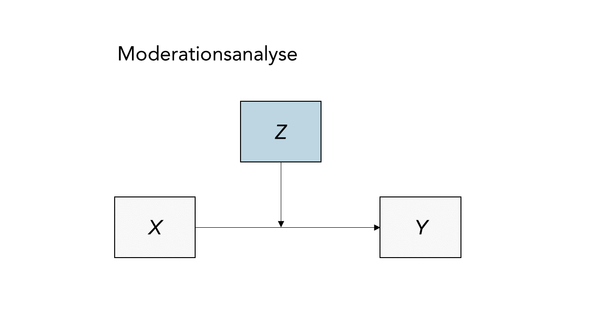



## Einleitung

Im ersten Beitrag zur Methodenlehre im Master "Klinische Psychologie und Psychotherapie" (ab sofort einfach immer auf KliPPs abgekürzt) geht es darum, an einem konkreten Beispiel aus der aktuellen klinischen Forschung noch einmal die Grundideen der multiplen Regression zu wiederholen und für den Fall einer moderierten Regression zu nutzen. Beides in einem Beitrag kann etwas kurz geraten, deswegen möchte ich an dieser Stelle noch auf die etwas umfangreicheren Einzelbeiträge aus dem Bachelorstudiengang zur [multiplen Regression](/lehre/statistik-i/multiple-reg), der [Prüfung der Voraussetzungen in der multiplen Regression](/lehre/statistik-ii/regressionsdiagnostik), zur [Inferenz und Modellauswahl](/lehre/statistik-ii/multreg-inf-mod) und zur [moderierten Regression](/lehre/statistik-ii/moderierte-reg) verweisen. Wie Sie sehen: das sind einige Beiträge, also können wir hier wirklich nur einen Versuch der Auffrischung unternehmen und uns angucken, wie eine Anwendung dieser Methoden in der Praxis aussieht.

### Neigung zur sexuellen Nötigung

Eine solche Praxis finden wir im Artikel von [Thatcher, Wallace & Fido (2023)](https://doi.org/10.1177/10790632231205799). In dieser Studie geht es darum, die Neigung zur sexuellen Nötigung (sexual coercion proclivity, SCP) mit psychopathischen Persönlichkeitseigenschaften in Verbindung zu bringen und dabei insbesondere zu untersuchen, inwiefern diese den Einfluss atypischer Sexualpräferenzen (z.B. Sadismus und Masochismus) moderiert. Alle Daten stammen dabei aus einer Online-Erhebung aus der Britischen Allgemeinbevölkerung. Betrachten wir diese Daten ein wenig genauer.

Die Autor*innen der Studie haben sowohl die Rohdaten, als auch einige SPSS-Outputs und die genutzten Fragebögen in einem Repository im [OSF zur Verfügung](https://osf.io/xkcah/) gestellt. Darüber hinaus: falls Sie keinen Zugriff auf den veröffentlichten Artikel haben sollten, finden Sie auf [PsyArXiv den Preprint der Studie](https://psyarxiv.com/a83pg/). Weil der Originaldatensatz nur SPSS-Format vorliegt und insgesamt 212 Variablen umfasst, habe ich die Datenaufbereitung schon einmal erledigt und Sie können die reduzierte Fassung in R einlesen, indem Sie folgendes Skript ausführen:


``` r
source('https://pandar.netlify.app/daten/Data_Processing_coercion.R')
```

```
## Loading required package: haven
```

```
## Warning in eval(ei, envir): NAs introduced by coercion
```


Die abhängige Variable, die in der Studie im Zentrum steht ist `coerce`, ein Skalenwert aus der "Tactics to Obtain Sex Scale" (Camilleri et al., 2009), welcher abfragt, wie wahrscheinlich es ist, dass man bestimmte Verhaltensweisen an den Tag legen würde, wenn die Person von Interesse deutlich gemacht hat, dass sie heute keinen Sex möchte. Dazu gehören Aussagen wie z.B. "Try to make them feel bad about not having sex" oder "Provide them with alcohol". Mehr Details zu den restlichen Variablen finden Sie in der...

<details><summary><b>Variablenübersicht</b></summary>

Variable | Beschreibung | Ausprägungen
--- | ------ | ----- 
`age` | Alter | in Jahren
`sex` | Geschlecht | `Male`, `Female`
`f1` | Faktor 1 der Psychopathie | _Skalenwert_, 14-70
`f2` | Faktor 2 der Psychopathie | _Skalenwert_, 15-75
`maso` | Masochismus | _Skalenwert_, 0-64
`sadi` | Sadismus | _Skalenwert_, 0-64
`drive` | Sexueller Antrieb | _Skalenwert_, 4-24
`coerce` | Neigung zur sexuellen Nötigung | _Skalenwert_, 19-95
`coax` | Neigung zur sexuellen Überredung | _Skalenwert_, 12-60

</details>

### Deskriptivstatistik

Bevor wir uns mit der moderierten Regression befassen, sollten wir zunächst sicherstellen, dass die Daten, die uns vorliegen, die gleichen sind, die auch tatsächlich im Artikel von [Thatcher et al. (2023)](https://doi.org/10.1177/10790632231205799) genutzt wurden. Zum Glück, werden im Artikel auf S. 10, Tabelle 1, einige Deskriptivstatistiken berichtet, die wir mit unseren Daten vergleichen können. Auch wenn uns in diesem Fall eigentlich nur Mittelwerte und Standardabweichungen interessieren, empfehle ich eine etwas vollständigere Deskriptivstatistik aus dem `psych`-Paket anzufordern. Zunächst können wir die Daten aber auf die relevanten Variablen einschränken, damit der Abgleich etwas leichter fällt:


``` r
# Paket für Deskriptivstatistik laden
library(psych)
```

```
## 
## Attaching package: 'psych'
```

```
## The following objects are masked from 'package:ggplot2':
## 
##     %+%, alpha
```

``` r
# Deskriptives aus der Gesamtstichprobe
subset(coercion, select = c('drive', 'sadi', 'maso', 'f1', 'coerce')) |>
  describe()
```

```
##        vars   n  mean   sd median trimmed  mad min max range  skew kurtosis   se
## drive     1 405 15.51 4.04     16   15.64 2.97   4  26    22 -0.33    -0.10 0.20
## sadi      2 405  5.35 7.86      3    3.62 4.45   0  56    56  2.73     9.28 0.39
## maso      3 405  7.41 9.31      4    5.54 4.45   0  61    61  2.12     5.35 0.46
## f1        4 405 26.49 8.26     26   25.97 8.90  14  53    39  0.48    -0.35 0.41
## coerce    5 405 23.87 6.53     22   22.58 4.45  19  68    49  2.84    11.55 0.32
```
Mittelwerte und Standardabweichungen stimmen beruhigenderweise schon einmal mit dem überein, was in Tabelle 1 für die Gesamtstichprobe berichtet wird. Das Vorgehen mit `psych` hat den Vorteil, dass wir auch extrem leicht Deskriptivstatistik für einzelne Gruppen erstellen können:


``` r
# Deskriptives getrennt nach Geschlecht
subset(coercion, select = c('drive', 'sadi', 'maso', 'f1', 'coerce')) |>
  describeBy(coercion$sex)
```

```
## 
##  Descriptive statistics by group 
## group: Male
##        vars   n  mean   sd median trimmed  mad min max range  skew kurtosis   se
## drive     1 173 17.45 3.34     18   17.53 2.97   5  26    21 -0.32     0.44 0.25
## sadi      2 173  7.16 9.60      4    5.06 5.93   0  56    56  2.31     6.03 0.73
## maso      3 173  5.62 8.32      3    3.75 4.45   0  51    51  2.71     8.59 0.63
## f1        4 173 29.72 8.25     29   29.49 8.90  14  53    39  0.25    -0.47 0.63
## coerce    5 173 24.41 6.92     23   23.08 4.45  19  63    44  2.79    10.22 0.53
## ----------------------------------------------------------------- 
## group: Female
##        vars   n  mean   sd median trimmed  mad min max range  skew kurtosis   se
## drive     1 232 14.06 3.92     14   14.16 4.45   4  24    20 -0.22    -0.32 0.26
## sadi      2 232  4.00 5.93      2    2.68 2.97   0  41    41  2.67     9.01 0.39
## maso      3 232  8.75 9.80      5    7.04 5.93   0  61    61  1.83     4.10 0.64
## f1        4 232 24.08 7.42     23   23.47 8.90  14  48    34  0.64    -0.12 0.49
## coerce    5 232 23.46 6.21     21   22.22 2.97  19  68    49  2.84    12.54 0.41
```
Um mit der statistischen Auswertung wieder etwas in die Gänge zu kommen, können wir auch den $t$-Test für die einzelnen Skalenwerte nachbauen. Hier mal exemplarisch für das Outcome `coerce`:


``` r
# t-Test für coerce
t.test(coercion$coerce ~ coercion$sex, var.equal = TRUE)
```

```
## 
## 	Two Sample t-test
## 
## data:  coercion$coerce by coercion$sex
## t = 1.4483, df = 403, p-value = 0.1483
## alternative hypothesis: true difference in means between group Male and group Female is not equal to 0
## 95 percent confidence interval:
##  -0.3392421  2.2376375
## sample estimates:
##   mean in group Male mean in group Female 
##             24.41040             23.46121
```

``` r
# Cohen's d
cohen.d(coercion$coerce, coercion$sex)$cohen.d
```

```
##          lower     effect      upper
## [1,] -0.342892 -0.1458419 0.05138898
```

Auch hier soweit alles das, was im Artikel steht. Die weiteren Analysen aus dem Artikel sind nach Geschlechtern getrennt durchgeführt und berichtet, weswegen wir zur Vorbereitung noch zwei Teildatensätze erstellen sollten:


``` r
# Teildatensätze
males <- subset(coercion, sex == 'Male')
females <- subset(coercion, sex == 'Female') 
```


## Wiederholung: Regression

Das Ziel einer Regression besteht darin, die Unterschiede zwischen Personen in einer Variable durch ihre Unterschiede in einer oder mehreren andere Variablen vorherzusagen (Prognose und Erklärung). Die vorhergesagte Variable wird als Kriterium, Regressand oder auch abhängige Variable (AV) bezeichnet und üblicherweise mit $y$ symbolisiert. Die Variablen zur Vorhersage der abhängigen Variablen werden als Prädiktoren, Regressoren oder unabhängige Variablen (UV) bezeichnet und üblicherweise mit $x$ symbolisiert.
Die häufigste Form der Regressionsanalyse ist die lineare Regression, bei der der Zusammenhang über eine Gerade bzw. eine (Hyper-)Ebene beschrieben wird. Demzufolge kann die lineare Beziehung zwischen den vorhergesagten Werten und den Werten der unabhängigen Variablen mathematisch folgendermaßen beschrieben werden:

$$y_i = b_0 +b_{1}x_{i1} + ... +b_{m}x_{im} + e_i$$

* Ordinatenabschnitt/ $y$-Achsenabschnitt/ Konstante/ Interzept $b_0$:
    + Schnittpunkt der Regressionsgeraden mit der $y$-Achse
    + Erwartung von y, wenn alle UVs den Wert 0 annehmen
* Regressionsgewichte $b_{1},\dots, b_m$:
    + beziffern die Steigung der Regressionsgeraden
    + Interpretation: die Steigung der Geraden lässt erkennen, um wie viele Einheiten $y$ zunimmt, wenn (das jeweilige) x um eine Einheit zunimmt  (unter Kontrolle aller weiteren Variablen im Modell)
* Regressionsresiduum (kurz: Residuum), Residualwert oder Fehlerwert $e_i$:
    + die Differenz zwischen einem beobachteten und einem vorhergesagten y-Wert ($e_i=y_i-\hat{y}_i$)
    + je größer die Fehlerwerte (betraglich), umso größer ist die Abweichung (betraglich) eines beobachteten vom vorhergesagten Wert

### Umsetzung und Interpretation

Gucken wir uns das Ganze mal an den Daten aus der Studie an. Dort werden als erstes die Ergebnisse des Modells berichtet, in dem sexueller Antrieb (`drive`) und Faktor 1 der Psychopathie (`f1`) - welcher vor allem Defizite in der Empathie und manipulatives Verhalten abbildet - als Prädiktoren für die Neigung zur sexuellen Nötigung betrachtet werden. In der R können wir diese multiple Regression mit der Funktion `lm()` durchführen:


``` r
# Multiple Regression
mod0m <- lm(coerce ~ drive + f1, data = males)
mod0f <- lm(coerce ~ drive + f1, data = females)

# Ergebnisse für Probanden
summary(mod0m)
```

```
## 
## Call:
## lm(formula = coerce ~ drive + f1, data = males)
## 
## Residuals:
##    Min     1Q Median     3Q    Max 
## -9.945 -3.629 -1.633  1.663 35.857 
## 
## Coefficients:
##             Estimate Std. Error t value Pr(>|t|)    
## (Intercept) 12.39577    3.05709   4.055 7.63e-05 ***
## drive        0.25818    0.15054   1.715   0.0882 .  
## f1           0.25264    0.06095   4.145 5.35e-05 ***
## ---
## Signif. codes:  0 '***' 0.001 '**' 0.01 '*' 0.05 '.' 0.1 ' ' 1
## 
## Residual standard error: 6.551 on 170 degrees of freedom
## Multiple R-squared:  0.1147,	Adjusted R-squared:  0.1043 
## F-statistic: 11.02 on 2 and 170 DF,  p-value: 3.175e-05
```
An diesen Ergebnissen können wir zwar noch nichts über die eigentlichen Hypothesen von [Thatcher et al. (2023)](https://doi.org/10.1177/10790632231205799) sagen, aber wir können zumindest noch einmal kurz checken, welche Erkenntnisse wir aus der multiplen Regression so ziehen können.


+ Im Intercept $b_0 = 12.4$ sehen wir den vorhergesagten Wert von Männern mit 0 sexuellem Antrieb und 0 psychopathischen Eigenschaften. Weil beide Skalen solche Werte gar nicht erlauben (sondern bei 4 bzw. 14 beginnen), ist dieser Wert nicht wirklich von Bedeutung.
+ Im Regressionsgewicht $b_1 = 0.26$ sehen wir den vorhergesagten Unterschied zwischen zwei Männern, die sich in ihrem sexuellen Antrieb um eine Einheit unterscheiden, aber das gleiche Ausmaß an Faktor 1 Psychopathie zeigen. Der dazugehörige Test (`Estimate` geteilt durch `Std. Error` = `t value`) zeigt, dass der bedingte Zusammenhang zwischen sexuellem Antrieb und Neigung zur sexuellen Nötigung nicht statistisch bedeutsam ist.
+ Im Regressionsgewicht $b_2 = 0.25$ sehen wir den vorhergesagten Unterschied zwischen zwei Männern, die sich in ihrem Faktor 1 der Psychopathie um eine Einheit unterscheiden, aber das gleiche Ausmaß an sexuellem Antrieb zeigen. In diesem Fall zeigt die inferenzstatistische Prüfung dieses Regressionsgewichts, dass es hier einen bedeutsamen Zusammenhang gibt.

Über die einzelnen Tests hinaus liefert uns die `summary` auch noch eine Aussage über die Güte des gesamten Modells. In der klassischen, multiplen Regression wird diese Güte anhand der augeklärten Varianz beurteilt. In diesem Fall werden 11% Varianz in der AV durch die linearen Einflüssen der beiden UVs aufgeklärt. Diese Varianzaufklärung wird - wie bei Varianzen üblich - mit dem $F$-Test geprüft (mehr Details zur Interpretation und Testsung von $R^2$ finden Sie im [Beitrag zur multiplen Regression aus dem Bachelor](lehre/statistik-i/multiple-reg/#determinationskoeffizient)). Dass dieser Test hier bedeutsam ausfällt heißt für uns, dass die beiden UVs mehr als _garkeine_ Varianzaufklärung leisten können.

Häufig werden in Artikeln über die unstandardisierten Regressionsgewichte hinaus auch deren standardisierten Versionen berichtet. In R können wir uns diese entweder händisch erstellen (z.B. indem wir die Variablen $z$-standardisieren und dann die Regression erneut durchführen) oder mithilfe des `lm.beta`-Pakets:


``` r
# Paket laden
library(lm.beta)

# Standardisierte Regressionsgewichte
lm.beta(mod0m) |> summary()
```

```
## 
## Call:
## lm(formula = coerce ~ drive + f1, data = males)
## 
## Residuals:
##    Min     1Q Median     3Q    Max 
## -9.945 -3.629 -1.633  1.663 35.857 
## 
## Coefficients:
##             Estimate Standardized Std. Error t value Pr(>|t|)    
## (Intercept) 12.39577           NA    3.05709   4.055 7.63e-05 ***
## drive        0.25818      0.12457    0.15054   1.715   0.0882 .  
## f1           0.25264      0.30108    0.06095   4.145 5.35e-05 ***
## ---
## Signif. codes:  0 '***' 0.001 '**' 0.01 '*' 0.05 '.' 0.1 ' ' 1
## 
## Residual standard error: 6.551 on 170 degrees of freedom
## Multiple R-squared:  0.1147,	Adjusted R-squared:  0.1043 
## F-statistic: 11.02 on 2 and 170 DF,  p-value: 3.175e-05
```
Auch wenn in einigen psychologischen Studien ausschließlich die standardisierten Ergebnisse berichtet werden, sei an dieser Stelle noch einmal ausdrücklich darauf hingewiesen, dass diese nicht uneingeschränkt besser. Generell hängen unstandardisierte Variablen von der Skalierung der Variablen ab (sind also nur dann direkt vergleichbar, wenn wir in einer anderen Studie mit exakt den gleichen Instrumenten arbeiten) und standardisierte Variablen von der Streuung der Variable in der Populaiton (sind also nur dann direkt vergleichbar, wenn wir Personengruppen aus der gleichen Population vergleichen). Standardisierte Regressionsgewichte sind daher vor allem dann mit Vorsicht zu interpretieren, wenn man versucht, Ergebnisse zwischen klinischen und nicht-klinischen Stichproben zu vergleichen.

### Voraussetzungen

Insbesondere bei der multiplen Regression ist es angebracht, dass wir uns noch mal all ihre Voraussetzungen vor Augen. Das gilt insbesondere deswegen, weil extrem viele komplexere Auswertungsverfahren in der wissenschaftlichen Psychologie eigentlich hauptsächlich dafür da sind, eine Verletzung dieser Voraussetzungen auszubügeln. Wenn Sie nochmal auffrischen wollen, was die Voraussetzungen der multiplen Regression genau ausmacht und wie wir sie aufdecken können, gucken Sie gerne noch einmal im [Beitrag zur Regressionsdiagnostik](/lehre/statistik-ii/regressionsdiagnostik) vorbei.

In Anlehnung an die Aufstellung von Eid, Gollwitzer und Schmitt (2017) unterscheiden wir fünf wesentliche Voraussetzungen:

- Messfehlerfreiheit der unabhängigen Variablen
- Unabhängigkeit der Residuen
- Korrekte Spezifikation des Modells
- Homoskedastizität der Residuen
- Normalverteilung der Residuen

Zusätzlich sollten im Rahmen von Regressionsanalysen noch zwei weitere potentielle Probleme beachtet werden:

- Multikollinearität
- Identifikation von Ausreißern und Einflussreichen Datenpunkten

Im Artikel von [Thatcher et al. (2023, S. 10)](https://doi.org/10.1177/10790632231205799) wird Folgendes bezüglich der Ausreißer gesagt:

> Outliers were observed for each variable, but these were not of concern as the constructs we measured have variability within the general population.

Hinsichtlich der Voraussetzungen äußern die Autor*innen folgendes (S. 9):

> Data were screened to check for assumptions of normality and homogeneity [...]

und Folgendes über die Normalverteilung berichtet (S. 10):

> Histograms indicated no concerns with kurtosis but indicated that data for psychopathic personality traits, sadism, masochism, and sexual coercion proclivity scores were positively skewed; reflecting expected distributions in the general population. Sex drive scores were normally distributed.

Bezüglich der Normalverteilung und der Homoskedastizität hilft uns die Information über die Rohdaten allerdings nur bedingt, weil sich diese Voraussetzungen auf die _Residuen_ beziehen. Also müssen wir zuerst das Modell aufstellen, das uns interessiert.

## Moderierte Regression

Die moderierte Regression wird immer dann genutzt, wenn - wie im Artikel von [Thatcher et al. (2023)](https://doi.org/10.1177/10790632231205799) - der Zusammenhang zwischen Variablen von der Ausprägung einer dritten Variable abhängen kann. Insbesondere in sozialpsychologischen Artikel wird für solche Fälle z.B. eine solche Abbildung benutzt:



Etwas formaler kann man diesen konkreten Fall (eine AV, zwei UVs inklusive Moderation) so aufschreiben:

$$
  Y_i = \beta_0 + \beta_1X_{i} + \beta_2Z_{i} + \beta_3X_{i}Z_{i} + \epsilon_i
$$
Aus der Gleichung geht hervor, dass die Abbildung in ihren Implikationen ein wenig irreführend sein kann. Die Abbildung lässt es so erscheinen, als würde $Z$ (nur) den Zusammenhang zwischen $X$ und $Y$ beeinflussen. In der moderierten Regression haben aber beide Variablen einen direkten Einfluss auf $Y$, welcher jeweils von der Ausprägung der anderen Variable abhängt. Das liegt ganz einfach daran, dass die Moderation in der Regression als einfacher Interaktionsterm aufgefasst wird. Gucken wir uns mal die Hypothesen von [Thatcher et al. (2023, S. 6)](https://doi.org/10.1177/10790632231205799) an:

> Pearson correlations will be used to test for a significant positive relationship between sexual coercion proclivity and sex drive, sadism, and masochism, with moderation analyses testing the hypotheses that *psychopathic personality will strengthen these relationships* in both males and females.

Sollten wir hier eine Moderation finden, kann es genauso gut sein, dass z.B. der sexuelle Antrieb die Beziehung zwischen F1 Psychopathie und der Neigung zur sexuellen Nötigung moderiert. Eine Richtung wird hier nicht spezifisch getestet.

### Zentrierung

Einige Absätze weiter oben habe ich noch gesagt, dass es in der Regression neben dem Check der Annahmen noch relevant ist, die Präditkoren auf Multikollinearität zu prüfen. Multikollinearität bedeutet dabei, dass zwei Prädiktoren hoch korreliert sind, was es immens erschweren kann genaue Effekte zu identifizieren, was wiederum Standardfehler drastisch vergrößern und somit inferenzstatistische Entscheidungen erheblich erschweren kann (mehr Details zum Konzept der Mulitkollinearität und dem Umgang damit in der multiplen Regression, finden Sie [im Beitrag zur Regressionsdiagnostik](lehre/statistik-ii/regressionsdiagnostik/#Multikollinearität). Dieses Problem besteht insbesondere in der moderierten Regression, in welcher wir einen Produktterm bilden, weil dieser wahrscheinlich mit seinen Bestandteilen korrelieren wird. 

Gucken wir uns mal mithilfe des Varianzinflationsfaktors ($VIF$) die Multikollinearität in der Regression von vorhin an:


``` r
# Paket laden
library(car)
```

```
## Loading required package: carData
```

```
## 
## Attaching package: 'car'
```

```
## The following object is masked from 'package:psych':
## 
##     logit
```

``` r
# Varianzinflation
vif(mod0m)
```

```
##    drive       f1 
## 1.013186 1.013186
```
Beide liegen deutlich unter dem Daumenregelgrenzwert von 10 und deuten erstmal nicht darauf hin, dass wir ein Multikollinearitätsproblem haben. Erweitern wir unsere Regression mal um den Interaktionsterm (und machen somit daraus eine moderierte Regression):


``` r
# Moderierte Regression
mod1m <- lm(coerce ~ drive + f1 + drive:f1, males)

# Varianzinflation
vif(mod1m)
```

```
## there are higher-order terms (interactions) in this model
## consider setting type = 'predictor'; see ?vif
```

```
##    drive       f1 drive:f1 
## 13.84521 27.99012 45.05403
```
Schon sieht das Ganze dramatisch anders aus. Gerade bei Interaktionstermen entsteht schnell sogenannte _nicht-essentielle Multikollinearität_ aufgrund der Skalierung der Variablen. Das sieht man am besten an einem einfachen Beispiel:


``` r
# Korrelation bei positiver Skala
x <- 1:5
z <- x * x
cor(x, z)
```

```
## [1] 0.9811049
```

``` r
# Korrelation nach Zentrierung
x <- -2:2
z <- x * x
cor(x, z)
```

```
## [1] 0
```
In beiden Fällen ist `z` einfach das Quadrat von `x`, aber die Zentrierung der Daten bewirkt, dass der _lineare_ Zusammenhang verschwindet. Dieses Prinzip können wir auch für unsere Variablen nutzen, indem wir sie zentrieren:


``` r
# Zentrierung
males$drive_c <- scale(males$drive, scale = FALSE)
males$f1_c <- scale(males$f1, scale = FALSE)

# Moderierte Regression
mod1m_c <- lm(coerce ~ drive_c + f1_c + drive_c:f1_c, males)

# Varianzinflation
vif(mod1m_c)
```

```
## there are higher-order terms (interactions) in this model
## consider setting type = 'predictor'; see ?vif
```

```
##      drive_c         f1_c drive_c:f1_c 
##     1.018409     1.024060     1.017817
```

Was ich Ihnen damit zeigen wollte: _zentrieren Sie immer die Prädiktoren in moderierter Regression_.

### Ergebnisse der moderierten Regression

Kommen wir endlich zur Untersuchung der Hypothesen. Im Artikel von [Thatcher et al. (2023)](https://doi.org/10.1177/10790632231205799) sind in Tabelle 3 die Ergebnisse bezüglich der Moderation von F1 Psychopathie auf den Einfluss des sexuellen Antriebs dargestellt. Unser letztes Modell sollte diesen Ergebnissen eigentlich entsprechen:


``` r
# Ergebnisse für Probanden
summary(mod1m_c)
```

```
## 
## Call:
## lm(formula = coerce ~ drive_c + f1_c + drive_c:f1_c, data = males)
## 
## Residuals:
##     Min      1Q  Median      3Q     Max 
## -13.296  -3.737  -1.404   1.620  36.558 
## 
## Coefficients:
##              Estimate Std. Error t value Pr(>|t|)    
## (Intercept)  24.22739    0.48609  49.841  < 2e-16 ***
## drive_c       0.22234    0.14640   1.519 0.130701    
## f1_c          0.23171    0.05944   3.898 0.000140 ***
## drive_c:f1_c  0.05856    0.01713   3.419 0.000789 ***
## ---
## Signif. codes:  0 '***' 0.001 '**' 0.01 '*' 0.05 '.' 0.1 ' ' 1
## 
## Residual standard error: 6.355 on 169 degrees of freedom
## Multiple R-squared:  0.172,	Adjusted R-squared:  0.1573 
## F-statistic:  11.7 on 3 and 169 DF,  p-value: 5.269e-07
```


Fokussieren wir erstmal auf das Positive: die Regressionsgewichte sind die selben, wie im Paper. Für den durschnittlichen Mann wird also ein `coerce`-Wert von 24.23 vorhergesagt. Die Regressionsgewichte sind etwas eigenwilliger in ihrer Interpretation, daher kurz ein paar Formeln, falls sie es genauer nachvollziehen möchten:

<details><summary><b>Ein paar Formeln, falls sie es genauer nachvollziehen möchten</b></summary>
Zunächst, als allgemeine Notation, schreiben wir unsere Regressionsgleichung:


<bigmath>
  \begin{align*}
    \hat{Y}_i &= \beta_0 + \beta_1X_{i} + \beta_2Z_{i} + \beta_3X_{i}Z_{i}
  \end{align*}
</bigmath>

Betrachten wir zwei Männer mit $X_1 = 0$, $Z_1 = 0$ und $X_2 = 0$ und $Z_2 = 1$. Die beiden sind also in `f1`-Psychopathie durchschnittlich, der zweiten Mann hat lediglich einen um eine Einheit stärker ausgeprägten `coerce`-Wert. Für den Ersten:

<bigmath>
\begin{align*}
  \hat{Y}_1 &= 24.23 + 0.22 \times 0 + 0.23 \times 0 + 0.06 \times 0 \times 0 = 24.23 \\
  \hat{Y}_2 &= 24.23 + 0.22 \times 1 + 0.23 \times 0 + 0.06 \times 1 \times 0 = 24.45 \\
\end{align*}
</bigmath>

Die beiden unterscheiden sich also um $\beta_1$ Einheiten in ihrer Coercion-Neigung. Dieses Regressionsgewicht entspricht also der Steigung der Regressionsgerade für Männer mit _durchschnittlicher F1 Psychopathie_. Wenn beide Männer einen leicht erhöhten F1-Wert hätten ($Z_1 = Z_2 = 1$) würde das Ganze so aussehen:

<bigmath>
\begin{align*}
  \hat{Y}_1 &= 24.23 + 0.22 \times 0 + 0.23 \times 1 + 0.06 \times 0 \times 1 = 24.46 \\
  \hat{Y}_2 &= 24.23 + 0.22 \times 1 + 0.23 \times 1 + 0.06 \times 1 \times 1 = 24.74 \\
\end{align*}
</bigmath>

Der Unterschied zwischen den beiden ist dann also $\beta_2 + \beta_3$. Die Steigung der Regressionsgerade von `coerce` auf `drive` wird sich also für jeden Wert in $Z$ um $\beta_3$ verändern und diese Veränderung ist es, die genau die zu untersuchende Moderation darstellt.

</details>

Für Männer mit durchschnittlicher F1 Psychopathie hat der sexuelle Antrieb also keinen bedeutsamen Einfluss auf die Neigung zur sexuellen Nötigung (Test des Regressionsgewichts $\beta_1$). Anders ist es bei der F1 Psychopathie, welche auch bei Männern mit durchschnittlichem sexuellen Antrieb mit einer erhöhten Neigung zur Nötigung einhergeht (Test des Regressionsgewichts $\beta_2$). Wie in der Hypothese von [Thatcher et al. (2023)](https://doi.org/10.1177/10790632231205799) behauptet, verstärkt die F1 Psychopathie darüber hinaus den Zusammenhang zwischen dem Antrieb und der Neigung zur Nötigung (Test des Regressionsgewichts $\beta_3$).

### Umgang mit Voraussetzungsverletzungen

Wie Ihnen hoffentlich nicht entgangen ist, sind die Ergebnisse, die wir gerade produziert haben, mit den Ergebnissen von [Thatcher et al. (2023)](https://doi.org/10.1177/10790632231205799) zwar konsistent, aber die Inferenzstatistik ist nicht identisch. Das liegt daran, dass im Artikel das statistische Vorgehen leider nicht mit 100%-iger Präzision beschrieben wird. Aber keine Sorge, ich habe keine Zeit, Mühen oder Frustrationen gescheut, um Ihnen genau darstellen zu können, wie diese Ergebnisse zustande kommen.

Wie ich vorhin beschrieben hatte, beziehen sich die Voraussetzungen der Normalverteiung und der Homoskedastizität auf die Residuen. Beides können wir mit Hilfe des `car` Pakets etwas genauer untersuchen. Fangen wir mit der Normalverteilung an:


``` r
# car-Paket laden
library(car)

# Normalverteilung der Residuen
qqPlot(mod1m_c)
```

<!-- -->

```
## 103 392 
##  37 169
```
Dem QQ-Plot ist relativ deutlich zu entnehmen, dass die Residuen nicht normalverteilt sind. Insbesondere bei klinischen Stichproben (oder wie hier, bei klinischen Konzepten, die an der Allgemeinbevölkerung untersucht werden) ist das überhaupt nicht unüblich. Es gibt verschiedene Wege, damit umzugehen, die ein bisschen davon abhängen, was wir glauben, woher diese Verletzung kommt. Generell ist zu sagen, dass die Regressionsgewichte erwartungstreue Schätzer bleiben, selbst wenn die Normalverteilungsannahme nicht hält. Allerdings hilft das nur bedingt weiter, weil eine solche Abweichung von der Annahme auf eine Fehlspezifikation des Modells hindeuten kann. So könnte es z.B. notwendig sein, nicht-lineare Effekte in die Regression aufzunehmen (mehr dazu im [entsprechenden Beitrag aus dem Bachelorstudium](/lehre/statistik-ii/nichtlineare-reg/)). Wenn nicht davon auszugehen ist, dass die Zusammenhangsstrukturen fehlspezifiziert sind, sondern die Variablen einfach "natürlich" nicht der Normalverteilung folgen, kann mit robusten Schätzern (z.B. mithilfe des `rlm`-Befehls aus dem Paket `MASS`) oder dem Bootstrap gearbeitet werden. Darüber hinaus werden insbesondere Variablen wie Reaktionszeiten gerne mittels Transformationen (z.B. Logarithmierung) normalisiert. Ein weiteres, verbreitetes Vorgehen ist es, auf die Robustheit des Verfahrens bei großen Stichproben zu vertrauen (und das Problem nicht aktiv zu adressieren). Die letzte Aussage mag etwas schnippisch klingen, ist aber tatsächlich ein legitimes, häufig in Lehrbüchern empfohlenes Vorgehen (z.B. [Eid et al., 2017, S. 718](https://ubffm.hds.hebis.de/Record/HEB366849158)). Dieser Ansatz wird auch im Artikel von [Thatcher et al. (2023)](https://doi.org/10.1177/10790632231205799) verfolgt.

Anders verhält es sich mit der Annahme der Homoskedastizität. Diese verzerrt auch dann die Standardfehler, wenn die Stichprobe groß ist. Auch hierfür können wir uns zunächst ein Bild erzeugen, um optisch über das Halten der Annahme zu entscheiden:


``` r
# Homoskedastizität der Residuen
plot(mod1m_c, which = 3)
```

<!-- -->

Abgebildet ist hier die Quadratwurzel der Residuenbeträge in Abhängigkeit von den vorhergesagten Werten. Im Fall homoskedastischer Fehler sollte diese unabhängig voneinander sein - es sollten also keine Trends erkennbar sein. Hier sehen wir einen relativ deutlichen, linearen Trend, der darauf hindeutet, dass die Varianz der Residuen mit größeren vorhergesagten Werten zunimmt. Wenn Sie lieber eine empirische Kennzahl möchten, um über die Annahme zu entscheiden, können Sie den Breusch-Pagan-Test nutzen:


``` r
# Breusch-Pagan-Test
ncvTest(mod1m_c)
```

```
## Non-constant Variance Score Test 
## Variance formula: ~ fitted.values 
## Chisquare = 58.51641, Df = 1, p = 2.016e-14
```
Hier, wie immer bei Voraussetzungstests, gilt: wenn das Ergebnis statistisch bedeutsam ist, muss die Annahme (in diesem Fall homoskedastizität) verworfen werden. Ein nicht-signifikantes Ergebnis bedeutet allerdings _nicht_, dass die Annahme hält. Wie immer im NHST kann die Nullhypothese nicht bestätigt werden.

Für den Umgang mit heteroskedastischen Fehlern gibt es im Wesentlichen zwei verbreitete Ansätze. Wie schon bei der Normalverteilungsvoraussetzung gilt auch bei Heteroskedastizität, dass die Regressionsgewichte korrekt geschätzt werden (daher haben wir auch die gleichen Gewichte erhalten wie [Thatcher et al. (2023)](https://doi.org/10.1177/10790632231205799)) und lediglich die Standardfehler verzerrt sind. Korrekte Standardfehler lassen sich entweder (1) via Bootstrap oder (2) mit robusten Schätzern erzeugen. Robuste Schätzer für solche Zwecke werden _sandwich_-Schätzer genannt. Unter der beinahe unendlichen Menge möglicher robuster Schätzer, hat sich für Fälle der heteroskedastischen Residuen in der Regression der HC3 Schätzer durchgesetzt. Diesen können wir mit den beiden Paketen `sandwich` und `lmtest` umsetzen:


``` r
# Paket laden
library(sandwich)
library(lmtest)
```

```
## Loading required package: zoo
```

```
## 
## Attaching package: 'zoo'
```

```
## The following objects are masked from 'package:base':
## 
##     as.Date, as.Date.numeric
```

``` r
# Ergebnisse mit robusten Standardfehlern
coeftest(mod1m_c, vcov = vcovHC)
```

```
## 
## t test of coefficients:
## 
##               Estimate Std. Error t value  Pr(>|t|)    
## (Intercept)  24.227391   0.472127 51.3154 < 2.2e-16 ***
## drive_c       0.222337   0.174925  1.2710 0.2054604    
## f1_c          0.231706   0.061467  3.7696 0.0002257 ***
## drive_c:f1_c  0.058563   0.023081  2.5372 0.0120784 *  
## ---
## Signif. codes:  0 '***' 0.001 '**' 0.01 '*' 0.05 '.' 0.1 ' ' 1
```

Zusammen mit den Konfidenzintervallen:


``` r
# Konfidenzintervalle
coefci(mod1m_c, vcov = vcovHC)
```

```
##                    2.5 %     97.5 %
## (Intercept)  23.29536492 25.1594172
## drive_c      -0.12298222  0.5676553
## f1_c          0.11036371  0.3530477
## drive_c:f1_c  0.01299766  0.1041274
```

erhalten wir so exakt die Ergebnisse, die von [Thatcher et al. (2023)](https://doi.org/10.1177/10790632231205799) berichtet werden. Mit diesem Ansatz können auch Modellvergleiche durchgeführt werden, um $\Delta R^2$ zu testen. Der Spezialfall, dass wir unser Modell gegen ein komplett leeres Modell testen, ergibt den Test des gesamten $R^2$:


``` r
# Modellvergleich
waldtest(mod1m_c, vcov = vcovHC)
```

```
## Wald test
## 
## Model 1: coerce ~ drive_c + f1_c + drive_c:f1_c
## Model 2: coerce ~ 1
##   Res.Df Df     F    Pr(>F)    
## 1    169                       
## 2    172 -3 5.799 0.0008511 ***
## ---
## Signif. codes:  0 '***' 0.001 '**' 0.01 '*' 0.05 '.' 0.1 ' ' 1
```
Auch hier erhalten wir die gleichen Ergebnisse, die von [Thatcher et al. (2023, S. 11)](https://doi.org/10.1177/10790632231205799) berichtet werden (auch wenn unsere Freiheitsgrade aus irgendeinem Grund das falsche Vorzeichen haben). 

### Inhaltlicher Zwischenstand

Die Hypothese, dass die F1 Psychopathie den Zusammenhang zwischen sexuellem Antrieb und Neigung zur sexuellen Nötigung bei Männern moderiert konnten wir bekräftigen. Bei Frauen (für die Sie die Analyse gerne selbst einmal nachvollziehen können) lässt sich diese Moderation nicht zeigen - dort ist ausschließlich die F1 Psychopathie ein relevanter Prädiktor. In den Tabellen 4 und 5 werden außerdem noch die Ergebnisse für Sadismus und Masochismus berichtet, welche sich ebenfalls mit dem oben dargestellten Schema reproduzieren lassen.

## Simple Slopes

In vielen Fällen wird die Interpretation von empirischen Ergebnissen durch ein Bild etwas einfacher. Dies gilt meiner Ansicht nach insbesondere für moderierte Regression, weil wir so besser einschätzen können, ob z.B. eine negative Moderation bedeutet, dass ein Effekt abgeschwächt wird, sich in gänze umkehrt oder erst ab einem gewissen Level des Moderators tatsächlich auftritt. In Abbildung 1 stellen [Thatcher et al. (2023, S. 11)](https://doi.org/10.1177/10790632231205799) in, für moderierte Regression typischer Weise, die Regressionsgeraden für ausgewählte Werte des Moderators dar. Für die unabhängige Variable `drive` wird dabei die Regression für drei Gruppen erstellt: Männer mit unterdurschnittlicher F1-Psychopathie ($M - 1 SD$), Männer mit durchschnittlicher F1-Psychopathie und Männer mit überdurchschnittlicher F1-Psychopathie ($M + 1 SD$). 

Wie schon oben mit den Werten 0 und 1 demonstriert, werden für simple Slopes Werte für $Z$ in die Gleichung eingesetzt und so eine einfache Regressionsgeraden (simple Slopes) bestimmt. Für die Regression von `coerce` auf `drive` und `f1` ist die allgemeine Gleichung:

<bigmath>
  \begin{align*}
    \hat{Y}_i &= \beta_0 + \beta_1X_{i} + \beta_2Z_{i} + \beta_3X_{i}Z_{i}
  \end{align*}
</bigmath>

Für Männer mit durchschnittlicher F1 Psychopathie ($Z = 0$) ist die Bestimmung der Gerade denkbar einfach:

<bigmath>
  \begin{align*}
    \hat{Y}_i &= \beta_0 + \beta_1X_{i} + \beta_2 \times 0 + \beta_3 X_{i} \times 0 \\
    \hat{Y}_i &= 24.23 + 0.22 \times X_{i}
  \end{align*}
</bigmath>

Für Männer mit unterdurchschnittlicher F1 Psychopathie brauchen wir erst noch die Standardabweichung von `f1`:


``` r
# Standardabweichung von f1
sd(males$f1)
```

```
## [1] 8.249271
```

die wir dann in die Gleichung einsetzen müssen:

<bigmath>
  \begin{align*}
    \hat{Y}_i &= \beta_0 + \beta_1X_{i} + \beta_2 \times (-8.25) + \beta_3 X_{i} \times (-8.25) \\
    \hat{Y}_i &= \beta_0 - \beta_2 \times 8.25 + (\beta_1 - \beta_3 \times 8.25) X_i \\
    \hat{Y}_i &= 22.33 - 0.28 \times X_i
  \end{align*}
</bigmath>

Das gleiche dann nochmal für Männer mit überdurchschnittlicher F1 Psychopathie:

<bigmath>
  \begin{align*}
    \hat{Y}_i &= \beta_0 + \beta_1X_{i} + \beta_2 \times 8.25 + \beta_3 X_{i} \times 8.25 \\
    \hat{Y}_i &= \beta_0 + \beta_2 \times 8.25 + (\beta_1 + \beta_3 \times 8.25) X_i \\
    \hat{Y}_i &= 26.13 + 0.72 \times X_i
  \end{align*}
</bigmath>

Wir sehen also, dass der Zusammenhang für Männer mit durchschnittlicher F1-Psychopathie zwar positiv ist, für Männer mit unterdurchschnittlicher F1-Psychopathie aber negativ. Leider haben wir hier nur die Regressionsgewichte bestimmt, aber keine Signifikanztestung vorgenommen. Das kann uns allerdings das Paket `interactions` abnehmen:


``` r
# Paket laden
library(interactions)

# Simple Slopes
sim_slopes(mod1m_c, pred = drive_c, modx = f1_c, robust = 'HC3')
```

```
## JOHNSON-NEYMAN INTERVAL 
## 
## When f1_c is OUTSIDE the interval [-12.34, 4.18], the slope of drive_c is p <
## .05.
## 
## Note: The range of observed values of f1_c is [-15.72, 23.28]
## 
## SIMPLE SLOPES ANALYSIS 
## 
## Slope of drive_c when f1_c = -8.249271e+00 (- 1 SD): 
## 
##    Est.   S.E.   t val.      p
## ------- ------ -------- ------
##   -0.26   0.19    -1.39   0.17
## 
## Slope of drive_c when f1_c = -1.026796e-15 (Mean): 
## 
##   Est.   S.E.   t val.      p
## ------ ------ -------- ------
##   0.22   0.17     1.27   0.21
## 
## Slope of drive_c when f1_c =  8.249271e+00 (+ 1 SD): 
## 
##   Est.   S.E.   t val.      p
## ------ ------ -------- ------
##   0.71   0.31     2.25   0.03
```
Auch hier erhalten wir die exakt gleichen Ergebnisse wie [Thatcher et al. (2023, Tabelle 6)](https://doi.org/10.1177/10790632231205799) dann, wenn wir die Standardfehler mittels HC3-Sandwich-Schätzer ermitteln. Wir erhalten also die Aussage, dass für Männer mit unterdurchschnittlicher oder durchschnittlicher F1-Psychopathie der Zusammenhang zwischen sexuellem Antrieb und Neigung zur sexuellen Nötigung nicht bedeutsam ist. Für Männer mit überdurchschnittlicher F1-Psychopathie hingegen, besteht ein bedeutsamer positiver Zusammenhang - also neigen insbesondere Männer mit hoher F1-Psychopathie (geringe Empathie, manipulatives Verhalten) und hohem sexuellen Antrieb zur sexuellen Nötigung. Das gleiche Paket kann uns auch dabei helfen, das ein wenig zu veranschaulichen:


``` r
# Grafische Darstellung
interact_plot(mod1m_c, pred = drive_c, modx = f1_c, robust = 'HC3')
```

<!-- -->

## Abschluss

Mit den hier vorgestellten Schritten können Sie auch die restlichen fünf Moderationsmodelle aus [Thatcher et al. (2023)](https://doi.org/10.1177/10790632231205799) reproduzieren. Dass dabei die Ergebnisse für Männer und Frauen separat dargestellt werden dient hauptsächlich der Übersichtlichkeit - wir könnten anhand der generalisierten ANCOVA, die wir im [Bachelor schon besprochen hatten](/lehre/statistik-ii/ancova-regression). In der nächsten Sitzung gucken wir uns dann noch an, wie genau die Regression funktioniert, wenn die abhängige Variable nicht - wie in diesem Fall - kontinuierlich ist.

***

## Literatur

Camilleri, J. A., Quinsey, V. L., & Tapscott, J. L. (2009). Assessing the propensity for sexual coaxing and coercion in relationships: Factor structure, reliability, and validity of the Tactics to Obtain Sex Scale. _Archives of Sexual Behavior, 38_(6), 959–973. https://doi.org/10.1007/s10508-008-9377-2

[Eid, M., Gollwitzer, M., & Schmitt, M. (2017)](https://ubffm.hds.hebis.de/Record/HEB366849158). Statistik und Forschungsmethoden (5. Auflage, 1. Auflage: 2010). Weinheim: Beltz.

[Thatcher, A. S., Wallace, L., & Fido, D. (2023)](https://doi.org/10.1177/10790632231205799). Psychopathic Personality as a Moderator of the Relationship Between Atypical Sexuality and Sexual Coercion Proclivity in the General Population. _Sexual Abuse, 0_(0). https://doi.org/10.1177/10790632231205799

