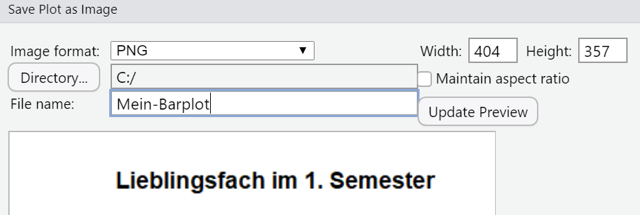

```{r setup, cache = FALSE, include = FALSE, purl = FALSE}
# Aktuell sollen die global options für die Kompilierung auf den default Einstellungen gelassen werden
```


<details><summary><b>Kernfragen dieser Lehreinheit</b></summary>

* Wie werden **Häufigkeitstabellen** erstellt?  
* Wie können aus absoluten Häufigkeitstabellen **relative Häufigkeitstabellen** gemacht werden?  
* Wie können **Modus und Median** bestimmt werden?  
* Auf welche Weise lässt sich der **relative Informationsgehalt** bestimmen, obwohl es dafür in R keine Funktion gibt?  
* Welche Befehle können genutzt werden, um **Balken-, Kuchendiagramme und Histogramme** zu erzeugen?  
* Welche Möglichkeiten gibt es, um **Grafiken anzupassen**?  
* Wie können **Grafiken gespeichert** werden?

</details>

***

## Wiederholung aus der Vorlesung: Skalenniveaus

Skala | Aussage | Transformation | Zentrale Lage | Dispersion |
--- | ------------ | -------- | ---------- | ----------------- |
Nominal | Äquivalenz | eineindeutig | Modus | Relativer Informationsgehalt |
Ordinal | Ordnung | monoton | Median | Interquartilsbereich |
Intervall | Verhältnis von Differenzen | positiv linear | Mittelwert | Standardabweichung, Varianz |
Verhältnis | Verhältnisse | Ähnlichkeit | ... | ... |
Absolut | absoluter Wert | Identität | ... | ... |


***

## Vorbereitende Schritte

Nachdem wir in der letzten Sitzung die Arbeit mit dem CSV Format kennen gelernt haben, nutzen wir jetzt die Datei im RDA Format für das Einlesen des Datensatzes. Den Datensatz `fb24` können Sie im RDA Format [hier <i class="fas fa-download"></i> herunterladen](/daten/fb24.rda). Außerdem ist es prinzipiell ratsam, zu Beginn wieder das Arbeitsverzeichnis mit Hilfe von `setwd()` zu bestimmen. Dies stellt sicher, dass wenn Sie später Daten speichern (z.B. Datensätze oder Grafiken), diese auch am gewünschten Ort auf Ihrem Computer abgelegt werden. 

Eine alternative Variante ist, den Datensatz direkt mit dem folgenden Befehl aus dem Internet einzuladen. Dies ist immer dann möglich, wenn der Datensatz auch über eine URL aufrufbar ist. 

```{r}
load(url('https://pandar.netlify.app/daten/fb24.rda'))   # Daten laden
names(fb24)        # Namen der Variablen
dim(fb24)          # Anzahl Zeile und Spalten
```

In der letzten Sitzung haben wir schon einige Befehle für das Screening eines Datensatzes kennen gelernt. Dabei zeigt `names()` alle Variablennamen an, während `dim()` uns Zeilen und Spalten ausgibt. Der Datensatz hat also `r nrow(fb24)` Beobachtungen auf `r ncol(fb24)` Variablen.


***

## Nominalskalierte Variablen

Typische Beispiele für nominalskalierte Variablen in der Psychologie sind das bspw. natürlich vorkommende Gruppierungen (z.B. das Geschlecht) oder die Experimentalbedingungen (z.B. "Experimentalgruppe" und "Kontrollgruppe"). Nominalskalierte Variablen sollten in `R` als **Faktoren** hinterlegt werden. Faktoren in `R` sind Vektoren mit einer vorab definierten Menge an vorgegebenen möglichen Ausprägungsmöglichkeiten. Sowohl numerische als auch character-Variablen können als Faktor kodiert werden, was mit jeweiligen Vorteilen einhergeht:

* für numerische Variablen: es können (aussagekräftige) Labels zugewiesen ("hinterlegt") werden. Diese werden dann für Tabellen und Grafiken übernommen    
* Für character-Variablen: Faktoren können für Analysen verwendet werden (z.B. als Prädiktoren in einer Regression), was für character-Variablen nicht möglich gewesen wäre  

Jeder numerischen Faktorstufe (level) kann ein Label zugewiesen werden. Faktorstufe und –label bestehen auch dann, wenn die entsprechende Ausprägung empirisch nicht auftritt.

**Beispiel 1: Die (numerische) Variable `hand` als Faktor aufbereiten**

```{r}
str(fb24$hand)
fb24$hand
```

Die Variable `hand` liegt numerisch vor, es treten die Werte 1 und 2 empirisch auf. Die Bedeutung von `NA` wird [später](#Fehlend) betrachtet. Anhand des Kodierschemas ([<i class="fas fa-download"></i> Variablenübersicht](/lehre/statistik-i/variablen.pdf)) kann den Zahlen eine inhaltliche Bedeutung zugewiesen werden. Beispielsweise bedeutet der Wert 1 "links". Diese *Label* werden nun im Faktor hinterlegt.

Vorgehensweise:   

* Erstellung einer neuen Variable im Datensatz per Objektzuweisung: `datensatz$neueVariable <- factor(...)`  
* Faktor erstellen mit der Funktion `factor(Ausgangsvariable, levels = Stufen, labels = Label)` 
* Spezifikation der Faktorstufen im Argument `levels`, also der numerischen Ausprägungen auf der Ursprungsvariable (hier: 1 und 2)  
* Spezifikation des Arguments `labels`, also die Label für die in `levels` hinterlegten numerischen Stufen (hier: "links", "rechts"; unbedingt auf gleiche Reihenfolge achten!)

```{r}
fb24$hand_factor <- factor(fb24$hand,                                   # Ausgangsvariable
                             levels = 1:2,                                  # Faktorstufen
                             labels = c("links", "rechts")) # Label für Faktorstufen
str(fb24$hand_factor)
head(fb24$hand_factor)
```


**Beispiel 2: Lieblingsfach (numerisch) als Faktor aufbereiten**

Analog dazu wird nachfolgend die ebenfalls numerische Variable `fach` in einen Faktor umgewandelt. Sie wurde wie folgt erhoben:


```{r}
fb24$fach
```

Es treten die Ausprägungen 1 bis 5 empirisch auf. Auch hier werden die Label aus dem Kodierschema zugewiesen.

```{r}
fb24$fach <- factor(fb24$fach,
                    levels = 1:5,
                    labels = c('Allgemeine', 'Biologische', 'Entwicklung', 'Klinische', 'Diag./Meth.'))
str(fb24$fach)
```

Hinweis: In Beispiel 2 wurde die Ursprungsvariable mit dem Faktor überschrieben. Sie ist nun verschwunden, der Datensatz enthält nur noch den Faktor, nicht mehr die numerische Variable.


**Beispiel 3: Einen character-Vektor als Faktor aufbereiten**

Um einen character-Vektor in einen Faktor umzukodieren, kann die Funktion `as.factor()` verwendet werden (siehe Skript zur Lehreinheit 1). Die Ausprägungen werden dann automatisch als Labels übernommen. Die numerischen Stufen (`levels`) werden anhand der alphabetischen Reihenfolge der `labels` vergeben. 

Nachfolgend wird zur Illustration die offene Freitextantwort zum Grund für das Psychologiestudium (Variable `grund`) in einen Faktor umgewandelt. 

```{r}
str(fb24$grund)                            # Ursprungsvariable: Character
fb24$grund_faktor <- as.factor(fb24$grund) # Umwandlung in Faktor
str(fb24$grund_faktor)                     # neue Variable: Faktor
```


Die neue Variable ist nun ein Faktor mit `r length(levels(fb24$grund_faktor))` Stufen. Das Vorgehen ist nur zur Anschauung gedacht und in diesem speziellen Fall nicht sinnvoll, da jede einzelne Freitextantwort vermutlich nur genau einmal vorkommt und später sowieso nicht (ohne zusätzliche Kodierung) in statistischen Analysen weiterverwendet werden kann.

Wir haben nun also gelernt, dass Faktoren auf verschiedene Weisen erstellt werden können. Wir benutzen nun die Funktion `factor()`, wenn unsere Variable zunächst nur `numerisch` vorlag (Beispiele 1 und 2) und wir eine Bedeutung zuordnen wollen. Wenn die Variable als `character` (Beispiel 3 und Intro-Sitzung), nutzen wir die Funktion `as.factor()`.

**Hinweise zu den Levels und Labels**

Die Reihenfolge von Levels und Labels ergibt sich während der Faktorerstellung:

* bei numerischen Variablen: entspricht den Ausprägungen der numerischen Ursprungsvariable  
* bei character-Variablen: entspricht der alphabetischen Reihenfolge der Ausprägungen auf der Ursprungsvariable  

Die Labels eines Faktors können mit der Funktion `levels()` abgerufen werden. Die Reihenfolge kann mithilfe der `relevel()`-Funktion geändert werden. Dafür muss dasjenige Label angesprochen werden, das die erste Position einnehmen soll (hier: 'Diag./Meth.').

```{r}
levels(fb24$fach)         # Abruf

fb24$fach <- relevel(
  fb24$fach,              # Bezugskategorie wechseln
  'Diag./Meth.')          # Neue Bezugskategorie
```

***

## Häufigkeitstabellen {#Häufigkeitstabellen}

Eine deskriptivstatistische Möglichkeit zur Darstellung diskreter (zählbarer) nominalskalierter Variablen sind Häufigkeitstabellen. Diese können in `R` mit der Funktion `table()` angefordert werden.


**Absolute Häufigkeiten**

```{r}
table(fb24$fach)
```

Häufig sind relative Häufigkeiten informativer. Nachfolgend werden zwei Möglichkeiten zur Erstellung von relativen Häufigkeitstabellen in `R` gezeigt.


**Relative Häufigkeiten (manuell)** 

Relative Häufigkeiten können aus absoluten Häufigkeiten abgeleitet werden: $h_j = \frac{n_j}{n}$.

Diese einfache Rechenvorschrift (Kategorienhäufigkeit geteilt durch Gesamthäufigkeit) kann auf das gesamte Tabellenobjekt angewendet werden. So wird jede einzelne absolute Kategorienhäufigkeit am Gesamtwert relativiert, es resultiert eine Tabelle der relativen Häufigkeiten.

```{r}
tab <- table(fb24$fach) # Absolute Haeufigkeiten
sum(tab)                # Gesamtzahl
tab / sum(tab)          # Relative Haeufigkeiten
```

**Relative Häufigkeiten (per Funktion)**

Alternativ kann die Funktion `prop.table()` auf das Tabellenobjekt mit den absoluten Häufigkeiten angewendet werden.

```{r}
tab <- table(fb24$fach) # Absolute
prop.table(tab)         # Relative
```

Ungefähr `r round(prop.table(tab)[1]*100,2)`% Ihres Jahrgangs geben als Lieblingsfach "Diagnostik/Methoden" an! Vielleicht können wir ja noch mehr von Ihnen mit dem nächsten Thema begeistern. :-)

***

## Grafiken in `R` {#Grafiken}

```{r comic-barplot, echo = FALSE,warning = FALSE, fig.align = 'center',cache = FALSE, purl = FALSE}
library("RXKCD")
invisible(getXKCD(373))
```

Die Darstellung als Tabelle wirkt häufig langweilig. Zu viele Tabellen in einem Bericht / einer Arbeit schrecken Leser:innen meist ab. Nachfolgend werden mögliche grafische Darstellungsformen für diskrete nominalskalierte Variablen gezeigt. Hierfür haben Sie in der Vorlesung die Optionen eines Balken- bzw. Säulendiagramms und eines Tortendiagramms kennengelernt.


**Säulen- oder Balkendiagramm**

Die Erstellung ist mit der Funktion `barplot()` möglich. Diese braucht zunächst nur ein Tabellenobjekt als Input, dass die absoluten Häufigkeiten für die verschiedenen Kategorien einer Variable enthält.

```{r,  eval=FALSE, purl = F}
barplot(tab)
```

Die Grafik erscheint in der RStudio-Standardansicht "unten rechts" im Reiter "Plots":


```{r, basic-barplot, echo = FALSE, fig=TRUE, fig.align='center'}
barplot(tab)
```

**Tortendiagramm**

Die Erstellug eines Tortendiagramms ist ebenfalls leicht zu erreichen. Die Funktion heißt `pie()` und braucht denselben Input wie `barplot`. 

```{r, basic-pie, out.width="60%", fig.align="center"}
pie(tab)
```

In der Vorlesung haben Sie bereits gelernt, dass diese Form der Darstellung aber nicht für detaillierte Analysen zu empfehlen ist, weil Erkenntnisse daraus viel schwerer zu ziehen sind. Bei den Zusatzargumenten werden wir uns also nur mit der Funktion `barplot()` beschäftigen.

**Zusatzargumente für Plots** 

Die Funktionen zur Erstellung sehr simpler Grafiken sind also denkbar einfach - die Grafiken selbst aber zunächst nicht unbedingt hübsch. `R` bietet diverse Zusatzargumente zur Anpassung der Optik von Grafiken.

Argument | Bedeutung
--: | :--------
main | Überschrift
las | Schriftausrichtung (0, 1, 2, 3)
col | Farbenvektor
legend.text | Beschriftung in der Legende
xlim, ylim | Beschränkung der Achsen
xlab, ylab | Beschriftung der Achsen


**Farben in `R`**

`R` kennt eine ganze Reihe vordefinierter Farben ($N = $ `r length(colors())`) mit teilweise sehr poetischen Namen. Diese können mit der Funktion `colors()` (ohne Argument) abgerufen werden. Hier sind die ersten 20 Treffer:

```{r}
colors()[1:20]
```

Die Farben aus der Liste können als Zahl (Index) oder per Name angesprochen werden. Eine vollständige Liste der Farben findet sich zum Beispiel unter [https://r-charts.com/colors/]( https://r-charts.com/colors/). Farben können aber auch per RGB-Vektor (Funktion `rgb()`) oder HEX-Wert angesprochen werden.

Zusätzlich können Farbpaletten verwendet werden. Sie bestehen aus einem Farbverlauf, aus dem einzelne Farben "herausgezogen" werden, wodurch ein zusammengehöriges Farbthema in einer Abbildung entsteht. `R` liefert einige dieser Paletten: `rainbow(...)`, `heat.colors(...)`, `topo.colors(...)`, ... Die Farbpalette wird ebenfalls per `col`-Argugment spezifiziert. Technisch handelt es sich um eine Funktion, für die als Argument die Anzahl der Farben spezifiziert werden muss, die aus der Palette "gezogen" werden sollen. Es wäre also so, als würden wir diese 5 Farben per Hand eingeben, nur dass wir die Person entscheiden lassen, die eine Palette programmiert hat Beispielsweise werden mit `col = rainbow(5)` fünf Farben aus der rainbow-Palette gezogen. Der Output würde so aussehen.

```{r}
rainbow(5)
```

Die Farben werden hier nicht direkt mit ihrem Namen, sondern mit dem Hex-Code ausgegeben. `#FF0000` steht dabei beispielsweise für ein rot.

**Beispiel für angepasste Abbildung**

```{r, colored-barplot}
barplot(tab,
        col = rainbow(5),                        # Farbe
        ylab = 'Anzahl Studierende',             # y-Achse Bezeichnung
        main = 'Lieblingsfach im 1. Semester',   # Überschrift der Grafik
        las = 2,                                 # Ausrichtung der Labels
        cex.names = 0.8)                         # Schriftgröße der Labels
```

Alle verwendeten Argumente (bis auf eines) sind bereits in der Tabelle oben beschrieben. Wir fügen einen Titel zur y-Achse mittels `ylab` hinzu. `main` ist verantwortlich für den Titel der Grafik, während `las` die Beschriftung der Säulen dreht. Das bisher nicht genannte Argument `cex.names` verändert die Schriftgröße für die Beschriftung der Balken. Wenn wir diese nicht anpassen würden, würde die Schrift den Rahmen der Standardeinstellungen für Grafen in `R` sprengen und damit teilweise außerhalb des Bildes stehen. 

Hinweis: Es gibt natürlich noch viele weitere Argumente, mit denen Sie Bestandteile des Diagramms anpassen können. Falls Sie sich beispielsweise fragen, wie sie aus dem Säulendiagramm ein Balkendiagramm machen können, könnten Sie das mit dem Argument `horiz` erreichen. Wenn Sie also die horizontale Ausrichtung der Grafik auf `TRUE` setzen, erhalten Sie horizontale Balken anstatt vertikale Säulen.

**Grafiken speichern** 

Es gibt zwei Möglichkeiten, um in `R` erzeugte Grafiken als Bilddatei zu speichern: manuell und per Funktion.  

*Möglichkeit 1: Manuelles Speichern*

Klicken Sie auf die Schaltfläche "Export" und dann auf "Save as Image"...


...und spezifizieren Sie dann Dateiname (ggf. Pfad) und Größe/Größenverhältnis.



Wenn kein Pfad spezifiziert wird, erscheint die Datei in Ihrem aktuellen Arbeitsverzeichnis.


*Möglichkeit 2: Speichern mit der Funktion `jpeg("Dateiname.jpg")`*

Auch ohne die grafische Oberfläche von RStudio ist die Erstellung und das Speichern einer Grafik mittels `R` möglich. Zunächst wird das für Euch keinen großen Einfluss haben, da wir nicht nur in der Konsole arbeiten. Wenn jemand sich doch in die Richtung vertieft, ist die Interaktion mit Servern auf Grundlage einer Konsole selten zu vermeiden. Dann könnte auch die folgende Erstellung eine Rolle spielen. 

Wir starten die Erstellung einer Grafik mittels Code mit der `jpeg()`-Funktion. Hierin machen wir sozusagen eine grafische Umgebung auf. In dieser legen wir bereits einige Paramter der Bilddatei fest (wie Höhe, Breite und auch Auflösung). Als nächstes kommt der Code für die Grafik. Diesen haben wir bereits gesehen. Der entstehende Plot wird jetzt in die zuvor erzeugte grafische Umgebung "abgelegt". Mit der Funktion `dev.off()` wird die Erstellung beendet. Die grafische Umgebung (und damit die Entwicklung unserer Bild-Datei) wird damit "geschlossen".  

```{r, eval = FALSE}
jpeg("Mein-Barplot.jpg", width=15, height=10, units="cm", res=150) # Eröffnung Bilderstellung
barplot(tab,
 col = rainbow(5),
 ylab = 'Anzahl Studierende',
 main = 'Lieblingsfach im 1. Semester',
 las = 2,
 cex.names = 0.8)
dev.off()                                                         # Abschluss Bilderstellung
```

Auch hier gilt: Wenn kein Pfad spezifiziert wurde, liegt die Datei in Ihrem Arbeitsverzeichnis. In der Funktion `jpeg()` kann mit den Argumenten `units` angegeben werden, in welcher Einheit die anderen Argumente zu verstehen sind.


***

## Deskriptivstatistische Kennwerte auf Nominalskalenniveau

**Modus** 

Der Modus (*Mo*) ist ein Maß der zentralen Tendenz, das die häufigste Ausprägung einer Variable anzeigt. Die Häufigkeiten sind ja schon in der Häufigkeitstabelle enthalten. Man könnte den Modus also einfach ablesen. Das gleiche lässt sich allerdings auch anhand von Funktionen tun:  

```{r}
tab            # Tabelle ausgeben
max(tab)       # Größte Häufigkeit
which.max(tab) # Modus
```

Der Modus der Variable `fach` lautet also `r names(which.max(tab))`, die Ausprägung trat `r max(tab)` mal auf.


**Relativer Informationsgehalt** 

Der relative Informationsgehalt ist ein Dispersionsmaß, das schon auf Nominalskalenniveau funktioniert. Dafür gibt es in `R` allerdings keine Funktion! Aus Lehreinheit 1 wissen Sie jedoch, dass `R` als Taschenrechner genutzt werden kann, folglich können beliebig komplexe Gleichungen in `R` umgesetzt werden. Die Formel zur Berechnung des relativen Informationsgehalts $H$ lautet:

$$H = -\frac{1}{\ln(k)} \sum_{j=1}^k{h_j * \ln h_j} $$

Wir benötigen also $h_j$, was die relativen Häufigkeiten der einzelnen Kategorien bezeichnet. Hier haben wir schon gelernt, dass wir diese durch anwenden der Funktion `prop.table` auf unser Objekt `tab` erhalten können. Anschließend muss noch mit der Funktion `log` gearbeitet werden, die den natürlichen Logarithmus als Standardeinstellung berechnet. $k$ ist in diesem Fall die maximale Nummer einer unserer Kategorien - also die Kategorienanzahl `r dim(tab)`. Falls wir diese nicht selbst zählen möchten, kann `dim` uns die Anzahl an Spalten in `tab` verraten. Der Rest ist dann nur einfache Multiplikation, Addition und Division.

```{r}
hj <- prop.table(tab)       # hj erstellen
ln_hj <- log(hj)            # Logarithmus bestimmen
ln_hj                       # Ergebnisse für jede Kategorie
summand <- ln_hj * hj       # Berechnung für jede Kategorie
summe <- sum(summand)       # Gesamtsumme
k <- dim(tab)               # Anzahl Kategorien
relinf <- -1/log(k) * summe # Relativer Informationsgehalt
relinf
```

Eine kleine Abkürzung durch Einsparen der Schritte am Ende könnte hier folgendermaßen mittels Pipe erreicht werden:

```{r}
relinf <- (ln_hj * hj) |> sum() * (-1/log(k))  # Relativer Informationsgehalt
relinf
```


Eine alternative Schreibweise, die ohne Zwischenschritte auskommt, dafür aber in Form von vielen Klammern stark verschachtelt ist, lautet:

```{r}
- 1/log(dim(table(fb24$fach))) * sum(prop.table(table(fb24$fach)) * log(prop.table(table(fb24$fach))))
```

Wie man hier sieht, stößt die Schachtelung ohne das Speichern von Zwischenergebnissen oder das nutzen der Pipe schnell an die Grenzen der Übersichtlichkeit. 

In allen drei Varianten kommen wir aber zum gleichen Schluss: der relative Informationsgehalt der Variable `fach` beträgt `r round(relinf, 3)`. Da der mögliche Wertebereich zwischen 0 (für alle Personen selbe Kategorie) und 1 (für alle Kategorien gleich viele Personen) variiert, kann hier von einer starken Verteilung der Personen ausgegangen werden.


***

## Ordinalskalierte Variablen

In diesem Abschnitt lernen Sie deskriptivstatistische Kennwerte für ordinalskalierte Variablen kennen. Aus der Vorlesung wissen Sie schon, dass Median und Interquartilsabstand (IQA) nur für die Klasse der geordneten Kategorien (auch "Rangklassen") sinnvoll sind, nicht für singuläre Daten ("Rangwerte").

Zunächst aber eine Wiederholung: Wie Sie aus der Vorlesung wissen, können die in der Tabelle am Anfang dieses Dokuments aufgeführten statistischen Kennwerte (Zentrale Lage, Dispersion) auch für Skalenniveaus genutzt werden, die "weiter unten" in der Tabelle stehen. Für ordinalskalierte Variablen (Rangklassen) kann also auch der Modus berechnet werden.

Nachfolgend soll mit dem Item zum interesse an wissenschaftlichen Grundlagen gearbeitet werden. Auf dem Screenshot ist das Item (obere) nochmal abgebildet.


Es treten die Werte `r min(fb24$wissen,na.rm=TRUE)` bis  `r max(fb24$wissen,na.rm=TRUE)` empirisch auf, außerdem gibt es  `r sum(is.na(fb24$wissen))` fehlende Werte (dargestellt als `NA`):

```{r}
fb24$wissen
```

Wiederholung:

```{r}
table(fb24$wissen)               # Absolute Haeufigkeiten
prop.table(table(fb24$wissen))   # Relative Haeufigkeiten
which.max(table(fb24$wissen))    # Modus
```


## Fehlende Werte {#Fehlend}

Fehlende Werte (dargestellt als `NA`) in empirischen Untersuchungen können aus vielen Gründen auftreten:  

  * Fragen überlesen / nicht gesehen  
  * Antwort verweigert  
  * Unzulässige Angaben gemacht (im Papierformat)  
  * Unleserliche Schrift (im Papierformat)
  * ...  

Für statistische Analysen sind fehlende Werte ein Problem, weil sie außerhalb der zulässigen Antworten liegen.  


**Fehlende Werte in `R`**

Fehlende Werte werden im Datensatz als `NA` dargestellt. In `R` kann man solche Fälle auf zwei unterschiedlichen Ebenen berücksichtigen:

* Global: `na.omit(datensatz)`  
    * Entfernt *alle* Beobachtungen, die auf *irgendeiner* Variable einen fehlenden Wert haben  
    * Häufig auch "listenweiser Fallausschluss" genannt  
* Lokal: `na.rm = TRUE`  
    * Das Argument `na.rm` ist in vielen Funktionen für univariate Statistiken enthalten  
    * Per Voreinstellung wird `NA` als Ergebnis produziert, wenn fehlende Werte vorliegen  
    * Fehlende Werte werden nur für diese eine Analyse ausgeschlossen, wenn sie auf der darin untersuchten Variable keinen Wert haben - Datensatz bleibt erhalten  

Fehlende Werte sind ein ganz eigenes Forschungsgebiet der Methodik und man könnte eine ganze Veranstaltung nur zu diesem Thema halten. Hierfür haben wir leider keine Zeit, weshalb wir uns der sehr einfachen Methode bedienen, dass wir fehlende Werte von der Analyse ausschließen. Dies ist kein empfohlenes Vorgehen für empirische Arbeiten im fortgeschrittenen Verlauf des Studium!

***

## Deskriptivstatistische Kennwerte ab Ordinalskalenniveau

**Median** 

Wir können uns den Einfluss fehlender Werte auf die Arbeit mit `R` mit der Betrachtung der Funktion für den Median, die praktischerweise `median()` heißt, veranschaulichen, indem wir einmal ein extra Argument benennen.

```{r}
median(fb24$wissen)                 # Ohne Argument für NA: funktioniert nicht
median(fb24$wissen, na.rm = TRUE)   # Expliziter Ausschluss: funktioniert
```

Ohne Argument für die Behandlung der fehlenden Werte wird `NA` auch als Ergebnis ausgegeben. Mit passendem Argument erhalten wir ein numerisches Ergebnis: Der Median für die Variable `wissen` beträgt also `r median(fb24$wissen, na.rm = TRUE)`.

**Quantile, IQB und IQA**

Für eine Beschreibung der Dispersion wird häufig der Interquartilsbereich (IQB) genutzt. IQB ist der Bereich zwischen dem 1. und dem 3. Quartil. 

Um die Quartile oder jedes beliebige andere Quantil einer Verteilung zu erhalten, kann die Funktion `quantile()` verwendet werden. Beispielsweise können wir die Grenzen des IQB und den Median mit folgender Eingabe gleichzeitig abfragen.

```{r}
quantile(fb24$wissen,
         c(.25, .5, .75),                   # Quartile anfordern
         na.rm = TRUE)
```

Der Interquartilsbereich liegt also zwischen `r quantile(fb24$wissen, .25, na.rm=TRUE)` und `r quantile(fb24$wissen, .75, na.rm=TRUE)`.

Den Interquartilsabstand (IQA) können wir nun bestimmen, indem wir das Ergebnis für das dritte und das erste Quartil subtrahieren. 

$$IQA = Q_3 - Q_1$$

Mit `quantile()` ist die Umsetzung in `R` etwas umständlich, da wir die Funktion zwei Mal aufrufen und die Differenz daraus bilden müssen.

```{r}
quantile(fb24$wissen, .75, na.rm=TRUE) - quantile(fb24$wissen, .25, na.rm=TRUE)
```

Dabei ist in der Ausgabe besonders die Überschrift verwirrend (75%), die hier nichts mit der Bedeutung des Wertes zu tun hat. Der IQA der Variable `wissen` beträgt `r quantile(fb24$wissen, .75, na.rm=TRUE) - quantile(fb24$wissen, .25, na.rm=TRUE)`. Für die Berechnung des IQA gibt es auch die direkte Funktion `IQR()`, die uns das ganze einfacher macht.

```{r}
IQR(fb24$wissen, na.rm = TRUE)
```

***

## Boxplots

Eine geeignete grafische Darstellungsform für (mindestens) ordinalskalierte Daten ist der Boxplot. In der Theorie wird dieser Plot meist in der Idealform vorgestellt.

```{r, echo = F, purl = F, basic-boxplot-two}
variable <- c(1, 3, rep(4,3), rep(5, 8), rep(6, 9), rep(7,8), 8, 8, 9 , 10)
boxplot(variable, ylim = c(0,10))
```

Die Box liegt zwischen dem ersten (`r quantile(variable, .25)`) und dritten Quartil (`r quantile(variable, .75)`). Der dicke schwarze Balken stellt den Median (`r median(variable)`) dar.  Die Whisker entsprechen dem jeweils extremstem empirischem Wert im Bereich `Q3 + 1.5*IQA` für das Maximum bzw. `Q1 - 1.5*IQA` für das Minimum. Der IQA beträgt in unserem Beispiel `r IQR(variable)`. Das bedeutet, dass die maximalen Whisker-Grenzen `r quantile(variable, .25) - 1.5*IQR(variable)` und `r quantile(variable, .75) + 1.5*IQR(variable)` sind. Wir sehen in der Abbildung, dass der obere Whisker seine maximale Grenze von 10 erreicht, während der untere nur bis zum Wert 3 geht. Das zeigt uns, dass es empirisch keine Werte gab, die kleiner als 3 aber größer gleich 2 waren. 3 ist also der kleinste empirische Wert innerhalb der Grenzen für den Whisker. Noch extremere Werte werden als Punkte dargestellt wie wir auf der Grafik sehen können.   


In der Praxis wird diese Idealform aber nicht immer erreicht. Wir wollen für unsere Variable `wissen` diesen Plot erstellen. Er kann über die Funktion `boxplot()` angefordert werden:

```{r, basic-boxplot-one}
boxplot(fb24$wissen)
```


In diesem Beispiel betragen Median und Q3 jeweils 4, sodass sich die entsprechenden Linien überlagern. 

Auch ein Boxplot kann grafisch angepasst werden. Nachfolgend sehen Sie ein Beispiel, in dem möglichst viel verändert wurde, um die verschiedenen Möglichkeiten aufzuzeigen. Nicht alle Veränderungen sind unbedingt sinnvoll in diesem Fall.

```{r, colored-boxplot}
boxplot(fb24$wissen,
        horizontal = TRUE,                # Ausrichtung des Boxplots
        main = "WS 2024/2025: Interesse an der Wissenschaft",  # Überschrift der Grafik
        xlab = "Ausprägung",              # x-Achse Bezeichnung 
        las = 1,                          # Ausrichtung der Labels
        border = "red",                   # Farbe der Linien im Boxplot
        col = "pink1")                    # Farbe der Fläche innerhalb der Box
```


```{r comic-boxplot, echo = F, purl = F, warning=F, fig.align='center',cache=FALSE}
invisible(getXKCD(539))
```


***
