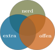
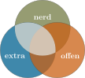
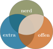
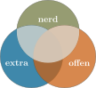
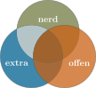

```{r setup, cache = FALSE, include = FALSE, purl = FALSE}
if (exists("figure_path")) {
  knitr::opts_chunk$set(fig.path = figure_path)
}
# Aktuell sollen die global options für die Kompilierung auf den default Einstellungen gelassen werden
```


```{r, echo = FALSE, purl = FALSE}
abbrev <- function(X, begin = NULL, end = NULL, ellipses = 'both',...) {
  
  tmp <- capture.output(summary(X,...))
  
  if (is.null(begin)) begin <- 1
  else begin <- grep(begin, tmp, fixed = TRUE)[1]
  if (is.null(end)) end <- length(tmp)
  else end <- grep(end, tmp, fixed = TRUE)[grep(end, tmp, fixed = TRUE) > begin][1]
  
  if (ellipses == 'both') {
    cat('[...]\n', paste(tmp[begin:end], collapse = '\n'), '\n[...]\n')
  }
  if (ellipses == 'top') {
    cat('[...]\n', paste(tmp[begin:end], collapse = '\n'))
  }
  if (ellipses == 'bottom') {
    cat(paste(tmp[begin:end], collapse = '\n'), '\n[...]\n')
  }
  if (ellipses == 'none') {
    cat(paste(tmp[begin:end], collapse = '\n'))
  }
}
```


<details><summary><b>Kernfragen dieser Lehreinheit</b></summary>

- Wie wird [multiple Regression in `R`](#multiple-regression) umgesetzt?
- Was bedeuten die [Regressionsgewichte](#interpretation-der-gewichte) und der [Determinationskoeffizient](#determinationskoeffizient) inhaltlich?
- Wie kann der Mehrwert von [zusätzlichen Prädiktoren](#modellvergleiche) untersucht werden?
- Welche [Annahmen](#voraussetzungen-der-multiplen-regression) werden in der Regression gemacht?
- Wie können z.B. die [Homoskedastizität](#homoskedastizitaet) und die [Normalverteilung](#normalverteilung) der Residuen geprüft werden?

</details>

***

## Vorbereitende Schritte {#prep}

Den Datensatz `fb24` haben wir bereits über diesen [ Link heruntergeladen](/daten/fb24.rda) und können ihn über den lokalen Speicherort einladen oder Sie können Ihn direkt mittels des folgenden Befehls aus dem Internet in das Environment bekommen. Im letzten Tutorial und den dazugehörigen Aufgaben haben wir bereits Änderungen am Datensatz durchgeführt, die hier nochmal aufgeführt sind, um den Datensatz auf dem aktuellen Stand zu haben: 

```{r}
#### Was bisher geschah: ----

# Daten laden
load(url('https://pandar.netlify.app/daten/fb24.rda'))

# Nominalskalierte Variablen in Faktoren verwandeln
fb24$hand_factor <- factor(fb24$hand,
                             levels = 1:2,
                             labels = c("links", "rechts"))
fb24$fach <- factor(fb24$fach,
                    levels = 1:5,
                    labels = c('Allgemeine', 'Biologische', 'Entwicklung', 'Klinische', 'Diag./Meth.'))
fb24$ziel <- factor(fb24$ziel,
                        levels = 1:4,
                        labels = c("Wirtschaft", "Therapie", "Forschung", "Andere"))
fb24$wohnen <- factor(fb24$wohnen, 
                      levels = 1:4, 
                      labels = c("WG", "bei Eltern", "alleine", "sonstiges"))
fb24$fach_klin <- factor(as.numeric(fb24$fach == "Klinische"),
                         levels = 0:1,
                         labels = c("nicht klinisch", "klinisch"))
fb24$ort <- factor(fb24$ort, levels=c(1,2), labels=c("FFM", "anderer"))
fb24$job <- factor(fb24$job, levels=c(1,2), labels=c("nein", "ja"))
fb24$unipartys <- factor(fb24$uni3,
                             levels = 0:1,
                             labels = c("nein", "ja"))

# Rekodierung invertierter Items
fb24$mdbf4_r <- -1 * (fb24$mdbf4 - 4 - 1)
fb24$mdbf11_r <- -1 * (fb24$mdbf11 - 4 - 1)
fb24$mdbf3_r <-  -1 * (fb24$mdbf3 - 4 - 1)
fb24$mdbf9_r <-  -1 * (fb24$mdbf9 - 4 - 1)
fb24$mdbf5_r <- -1 * (fb24$mdbf5 - 4 - 1)
fb24$mdbf7_r <- -1 * (fb24$mdbf7 - 4 - 1)

# Berechnung von Skalenwerten
fb24$wm_pre  <- fb24[, c('mdbf1', 'mdbf5_r', 
                        'mdbf7_r', 'mdbf10')] |> rowMeans()
fb24$gs_pre  <- fb24[, c('mdbf1', 'mdbf4_r', 
                        'mdbf8', 'mdbf11_r')] |> rowMeans()
fb24$ru_pre <-  fb24[, c("mdbf3_r", "mdbf6", 
                         "mdbf9_r", "mdbf12")] |> rowMeans()

# z-Standardisierung
fb24$ru_pre_zstd <- scale(fb24$ru_pre, center = TRUE, scale = TRUE)

```


## Einfache lineare Regression

Im [letzten Beitrag](/lehre/statistik-i/einfache-reg) haben wir uns die einfache lineare Regression angesehen. Konkret ging es dabei darum, dass wir eine abhängige Variable (AV) durch genau eine unabhängige Variable vorhergesagt haben. Oder als Gleichung ausgedrückt:

$$
y_m = b_0 + b_1 x_m + e_m
$$

Im Datensatz `fb24` haben wir so die Nerdiness (`nerd`) durch die Extraversion (`extra`) vorhergesagt - die Annahme war dabei, dass Personen, die introvertierter sind (also geringere Werte auf der Extraversionsskala aufweisen) sich auch Hobbies gesucht haben, die typischerweise als "nerdig" gelten. In `R` haben wir den `lm`-Befehl genutzt, um diese Hypothese auch einer Prüfung zu unterziehen.

```{r}
# Einfache Regression
mod1 <- lm(nerd ~ 1 + extra, data = fb24)

# Ergebnisse
summary(mod1)
```

```{r, echo = FALSE, purl = F}
r2 <- summary(mod1)$r.squared
b0 <- coef(mod1)[1]
b1 <- coef(mod1)[2]
```

Bei dieser Regression haben wir gesehen, dass die Extraversion ein bedeutsamer Prädiktor für die Nerdiness ist. Dabei geht mit einem Unterschied von einer Einheit in der Extraversion ein Unterschied von `r round(b1, 2)` Einheiten in der Nerdiness einher. Der Determinationskoeffizient beträgt `r round(r2, 2)`, was bedeutet, dass `r round(r2 * 100, 2)`% der Varianz in der Nerdiness durch die Extraversion erklärt werden. Wie wir auch schon gesehen hatten, entspricht dies der quadrierten Korrelation zwischen Extraversion und Nerdiness und die Tests beider gegen 0 sind äquivalent:

```{r}
cor.test(fb24$nerd, fb24$extra)
```

## Multiple Regression

In diesem Beitrag geht es uns jetzt darum, diese Idee auf mehrere unabhängige Variablen zu erweitern. Das bedeutet, dass wir eine abhängige Variable durch mehrere unabhängige Variablen vorhersagen. Oder als Gleichung ausgedrückt:

$$
y_m = b_0 + b_1 x_{1m} + b_2 x_{2m} + \ldots + b_k x_{km} + e_m
$$

$K$ entspricht dabei der Anzahl der Prädiktoren, die wir in das Modell aufgenommen haben. Neben der Extraversion gehören noch die Veträglichkeit (`vertr`), die Gewissenhaftigkeit (`gewis`), der Neurotizismus (`neuro`) und die Offenheit für neue Erfahrungen (`offen`) zu den Big Five Persönlichkeitsmerkmalen, die wir in der Umfage zu Beginn des Semesters mit dem [BFI-10](https://doi.org/10.6102/zis76) erhoben hatten. Wir können also ein Modell aufstellen, in dem wir die Nerdiness durch all diese Persönlichkeitsmerkmale vorhersagen. 

```{r}
# Multiple Regression
mod2 <- lm(nerd ~ 1 + extra + vertr + gewis + neuro + offen, 
  data = fb24)

# Ergebnisse
summary(mod2)
```
### Interpretation der Gewichte

```{r, echo = FALSE, purl = F}
mod_tmp <- lm(neuro ~ extra, fb24)
b1_tmp <- coef(mod_tmp)[2]
```


In der einfachen linearen Regression hatten wir gesagt, dass $b_1$ dem vorhergesagten Unterschied zwischen zwei Personen entspricht, die sich um eine Einheit in der unabhängigen Variable unterscheiden. Diese Interpretation lässt allerdings außer Acht, dass sich diese beiden Personen auch in anderen Eigenschaften unterscheiden können. Zum Beispiel unterscheiden sich diese beiden (fiktiven) Leute auch um ca. `r abs(round(b1_tmp, 2))` Einheiten im Neurotizismus (extravertiertere Personen sind dabei weniger neurotisch). In der einfachen linearen Regression bleibt also unklar, ob der vorhergesagte Unterschied zwischen den Personen auch wirklich auf Unterschiede in unserem Prädiktor zurückzuführen ist, oder ob es auch an anderen, nicht berücksichtigten Eigenschaften liegen könnte.

In der multiplen Regression versuchen wir die Variablen aufzunehmen, die relevant sein könnten. Dadurch verändert sich auch die Interpretation des Regressionsgewichts: $b_1$ gibt jetzt den vorhergesagten Unterschied zwischen zwei Personen an, die sich um eine Einheit in der Extraversion unterscheiden, aber in allen anderen Prädiktoren gleich sind. Wir haben - so die häufig genutzte Ausdrucksweise - auf die anderen Big Five Merkmale "kontrolliert".

Im Scatterplot wird dieser Unterschied deutlich:

```{r, fig = TRUE}
# Gewichte aus der multiple Regression
b0 <- coef(mod2)[1]
b1 <- coef(mod2)[2]

# Scatterplot
plot(fb24$nerd ~ fb24$extra, 
     xlab = "Extraversion", 
     ylab = "Nerdiness")

# Ergebnis der einfachen Regression
abline(mod1, col = "blue")

# Ergebnis der multiplen Regression
abline(a = b0, b = b1, col = "orange")

# Legende
legend("topright", legend = c("Einfache Reg.", "Multiple Reg."), col = c("blue", "orange"), lty = 1)
```
Der erste Unterschied, der zwischen den beiden Regressiongeraden auffällt ist, dass sie versetzt sind - also nicht beim gleichen Wert die y-Achse schneiden. Das liegt daran, dass nicht nur die Regressionsgewichte ihre Bedeutung verändern, sondern auch der Achsenabschnitt. Dieser ist jetzt der vorhergesagte Wert für die Nerdiness, wenn _alle_ Prädiktoren 0 sind:

$$
\widehat{y} = b_0 + b_1 \cdot 0 + b_2 \cdot 0 + b_3 \cdot 0 + b_4 \cdot 0 + b_5 \cdot 0 = b_0
$$

Wenn wir z.B. sehen wollen, wie sich die Extraversion auf die Nerdiness bei Personen auswirkt, die in ihren sonstigen Eigenschaften eher durchschnittlich sind, können wir einfach statt 0 die entsprechenden Mittelwerte in die Gleichung einsetzen. Mit unseren [Kenntnissen über Matrixalgebra](/lehre/statistik-i/matrixalgebra) können wir das Ganze sogar relativ kurz halten:

```{r, fig = TRUE}
# Achsenabschnitt bestimmen
X <- matrix(c(1, 0, 
  mean(fb24$vertr, na.rm = TRUE), 
  mean(fb24$gewis, na.rm = TRUE), 
  mean(fb24$neuro, na.rm = TRUE), 
  mean(fb24$offen, na.rm = TRUE)))

a <- coef(mod2) %*% X
```

```{r, eval = FALSE}
abline(a = a, b = b1, col = "darkgreen")
```

```{r, echo = FALSE, fig = TRUE, purl = F}
# Scatterplot
plot(fb24$nerd ~ fb24$extra, 
     xlab = "Extraversion", 
     ylab = "Nerdiness")

abline(mod1, col = "blue")
abline(a = b0, b = b1, col = "orange")
abline(a = a, b = b1, col = "darkgreen")

legend("topright", legend = c("Einfache Reg.", "Multiple Reg.", "Multiple Reg. (MW)"), col = c("blue", "orange", "darkgreen"), lty = 1)
```


Der zweite Unterschied zwischen dieser neuen Linie (in Grün) und der Linie aus der einfachen linearen Regression (in Blau) zeigt, dass sie sich leicht im Steigungskoeffizienten unterscheiden. Das liegt eben genau daran, dass das Gewicht jetzt Unterschiede zwischen zwei Personen sind, die sich _nur_ in der Extraversion unterscheiden, aber sonst in allen (berücksichtigten) Belangen gleich sind.

Die anderen Gewichte können wir analog interpretieren:

```{r}
summary(mod2)$coefficients
```

Dabei sehen wir, dass die Extraversion, die Verträglichkeit, die Gewissenhaftigkeit und die Offenheit für neue Erfahrungen bedeutsame Prädiktoren für die Nerdiness sind. Das bedeutet, dass diese vier Persönlichkeitsdimensionen einen bedeutsamen _einzigartigen_ Beitrag zur Vorhersage der Nerdiness leisten können. Im Umkehrschluss unterscheiden sich zwei Personen, die sich in Neurotizismus um eine Einheit unterscheiden, aber hinsichtlich der anderen vier Dimensionen gleich sind, fast überhaupt nicht hinsichtlich der vorhergesagten Nerdiness.

### Determinationskoeffizient

Um das Konzept des "einzigartigen Beitrags" noch einmal genauer zu beleuchten, kramen wir ein paar gute alte Venn-Diagramme aus der Schublade. 



Hier sind erst einmal drei Variablen (unsere AV `nerd` und die beiden UVs `extra` und`offen`) dargestellt. Die Schnittmenge zwischen `extra` und `nerd` ist dabei z.B. das Ausmaß an Überlappung zwischen den beiden. Konzeptuell stellt diese Schnittmenge die Varianz dar, die zwischen den beiden geteilt wird. Diese Varianz hatten wir in der einfachen linearen Regression schon bestimmt:

```{r}
summary(mod1)$r.squared
```

Das Problem ist, dass wir dabei die _gesamte_ Schnittmenge zwischen den beiden Variablen betrachen:



Ein Teil dieser Schnittmenge wird aber auch mit Offenheit für neue Erfahrungen geteilt. Für diesen Abschnitt wissen wir nicht, ob es Extraversion oder Offenheit ist, die Unterschiede in Nerdiness bedingen. Schlimmer noch: wenn wir eine zweite einfache lineare Regression machen, wird dieser Abschnitt erneut "gezählt" - wir finden also den gleichen Effekt (zumindest in Teilen) doppelt:


Um das zu umgehen nutzen wir die multiple Regression um einfach die gesamte Fläche von `nerd` zu bestimmen, die durch mindestens einen unserer Prädiktoren abgedeckt (also "aufgeklärt") wird:



In der `summary` von `mod2` hatten wir gesehen, wie groß dieser Anteil ist:

```{r}
summary(mod2)$r.squared
```

Im Fall dieses Modells sind es nicht nur zwei, sondern insgesamt fünf Prädiktoren, was das Venn-Diagramm allerdings _ein wenig_ unübersichtlich machen würde. Die Gesamtheit der aufgeklärten Varianz (also der Anteil der Varianz in der AV, den unsere UVs insgesamt aufklären können) wird in der `summary` mittels $F$-Test geprüft:

```{r, echo=FALSE, purl = FALSE}
abbrev(mod2, "Multiple R-squared", ellipse = "top")
```


Wie wir anhand der Formel dieses Tests erkennen können, wird hier das Verhältnis von aufgeklärter zu nicht aufgeklärter Varianz geprüft:

$$
F = \frac{n - k - 1}{k} \cdot \frac{R^2}{1 - R^2}
$$

Die Zählerfreiheitsgrade `numdf` sind dabei ungünstigerweise $k$ und die Nennerfreiheitsgrade `dendf` sind $n - k - 1$ - also genau das Gegenteil von dem, was aufrgund _dieser_ Formel für $F$ zu erwarten gewesen wäre. 

## Modellvergleiche

Neben den Tests der einzelnen Regressionsgewichte und dem Test des _gesamten_ $R^2$ können wir auch spezifische Modell mit einander vergleichen. Dabei muss ein Modell immer eine _eingeschränkte_ Fassung ($e$) eines anderen Modells ($u$) sein. Die beiden Modelle, die wir schon gesehen haben stehen in genau so einer Relation: die einfache lineare Regression mit Extraversion als Prädiktor (`mod1`) ist eine eingeschränkte Version der multiplen Regression, in der wir alle Big Five Merkmale als Prädiktoren aufgenommen hatten (`mod2`), weil es eine Teilmenge der Prädiktoren enthält.

In solchen Fällen können wir über den Vergleich von $R^2_e$ und $R^2_u$ untersuchen, welchen Zugewinn in der Vorhersagekraft die zusätzlichen Prädiktoren so mitbringen. Rein numerisch:

```{r}
# R2 durch Extraversion
R2e <- summary(mod1)$r.squared

# R2 durch alle Big Five
R2u <- summary(mod2)$r.squared

R2e
R2u

# Inkrementelles R2 der vier anderen
R2u - R2e
```

In diesem Inkrement wird der Teil der Varianz dargestellt, den die anderen vier Big Five Merkmale _zusätzlich_ zur Extraversion aufklären können. Dabei ist es wichtig zu bedenken, dass der Anteil der durch Gemeinsamkeiten zwischen Extraversion und den anderen vier Merkmalen aufgeklärt wird, im ersten Schritt nur der Extraversion zugute geschrieben wurde (das zweite Venn-Diagramm). Dieses Inkrement können wir natürlich aus testen:

```{r, eval = F}
# Test des inkrementellen R2
anova(mod1, mod2)
```

```{r, error = TRUE, echo = F, purl = F}
# Test des inkrementellen R2
anova(mod1, mod2)
```
In unserem Fall läuft die `anova`-Funktion fehlerfrei durch. Da es hier jedoch häufig zu Fehlermeldungen aufgrund von einem Modellvergleich mit unterschiedlichen zugrundeliegenden Beobachtungen bzw. Daten kommt, wollen wir uns für diese Fall ebenfalls kurz wappnen.

### Intermezzo: Datenaufbereitung

Der von der `anova`-Funktion potentiell ausgegebene Fehler `## Error in anova.lmlist(object, ...): models were not all fitted to the same size of dataset` zeigt, dass wir Modelle nur dann vergleichen können, wenn diese auf den gleichen Daten basieren. Das kann nicht gegeben, wenn es Personen gab, die z.B. zwar für Extraversion und Nerdiness Beobachtungen hatten, für mindestens eine der anderen vier Dimensionen aber nicht. Im Beitrag zu [Zusammenhangsmaßen](/lehre/statistik-i/korrelation/#fehlende-werte) hatten wir den Unterschied zwischen paarweisem und listenweisem Fallausschluss schon detaillierter besprochen. Im Fall mehrerer Regressionsmodelle müssen wir also vorab sicherstellen, dass wir adäquaten listenweisen Fallausschlus betreiben, wenn wir die Modelle direkt vergleichen wollen:

```{r}
mr_dat <- na.omit(fb24[, c("nerd", "extra", "vertr", "gewis", "neuro", "offen")])
```

Wenn wir in `R` Modelle aktualisieren wollen, können wir mit `update` arbeiten, statt die gesamte Syntax erneut eingeben zu müssen:

```{r}
# Modell 1, updated
mod1_new <- update(mod1, data = mr_dat)

# Modell 2, updated
mod2_new <- update(mod2, data = mr_dat)
```

### Modellvergleiche, Teil 2

Mit den Modellen, die auf die neuen Modelle angewendet wurden können wir jetzt den Vergleich erneut probieren:

```{r}
# Test des inkrementellen R2
anova(mod1_new, mod2_new)
```

Da in unserem Fall von Beginn an das Problem der unterschiedlichen Daten nicht vorlag, erhalten wir eine identische Ergebnistabelle. Die Ergebnistabelle gibt uns verschiedene Informationen. Zunächst wird uns noch einmal gesagt, welche Modelle wir hier eigentlich vergleichen. Die Ergebnistabelle besteht dann aus folgenden Informationen:

- `Res.Df`: Die Residualfreiheitsgrade ($n-k-1$)
- `RSS`: Die Quadratsumme der Residuen ( _Residual Sum of Squares_ )
- `Df`: Der Unterschied in den Freiheitsgraden zwischen den beiden Modellen ($k_u - k_e$), hier 4, weil wir vier zusätzliche Prädiktor aufgenommen haben
- `Sum of Sq`: Die Quadratsumme der Residuen, die durch die zusätzlichen Prädiktoren aufgeklärt wird
- `F`: Der $F$-Wert
- `Pr(>F)`: Der p-Wert des $F$-Tests

In diesem Fall ist der Modellvergleich statistisch bedeutsam, was bedeutet, dass die zusätzlichen Prädiktoren in der multiplen Regression einen statistisch relevanten Anteil der Varianz der Nerdiness aufklären können.

Wenn wir für spezifische (Gruppen von) Prädiktoren wissen wollen, wie viel einzigartigen Beitrag sie in der Vorhersage unserer AV haben, können wir dieses Vorgehen nutzen, um die Anteile zu isolieren. Zum Beispiel, wenn wir den Anteil identifizieren wollen, den Extraversion aufklärt, der nicht auch durch andere Big Five Persönlichkeitsmerkmale aufgeklärt wird, können wir ein Modell aufstellen, in dem wir alle anderen Prädiktoren als eingeschränkte Version des Modells aufnehmen:

```{r}
# Modell 3
mod3 <- lm(nerd ~ 1 + vertr + gewis + neuro + offen, data = mr_dat)

# Test des inkrementellen R2
anova(mod3, mod2_new)

# Inkrementelles R2
summary(mod2_new)$r.squared - summary(mod3)$r.squared
```

Als Venn-Diagramm ausgedrückt, prüfen wir so den hier hell markierten Abschnitt gegen 0 (nur, dass Sie sich die anderen drei Prädiktoren dazu denken müssen):



Das Ergebnis zeigt, dass Extraversion einen statistisch relevanten Anteil der Varianz in der Nerdiness aufklären kann, der nicht auch durch die anderen Big Five Persönlichkeitsmerkmale aufgeklärt wird. 

## Voraussetzungen der multiplen Regression

Im Lehrbuch von Eid, Gollwitzer und Schmitt (2015) finden Sie auf S.720 eine Übersicht über die fünf zentralen Voraussetzungen der multiplen Regression (diese gelten in etwas simplerer Form auch für die einfache lineare Regression). Diese sind:

  1. Korrekte Spezifikation des Modells
  2. Messfehlerfreiheit der unabhängigen Variablen
  3. Unabhängigkeit der Residuen
  4. Homoskedastizität der Residuen
  5. Normalverteilung der Residuen
  
In diesem Beitrag gucken wir uns im Folgenden noch grob an, wie man diese Voraussetzungen prüfen kann. In den meisten Fällen ist das "was mache ich, wenn die Voraussetzungen nicht erfüllt sind?" aber eine Frage mit relativ komplexen Antworten, die wir im Verlauf der (hoffentlich vielen!) weiteren Statistik Module Schritt für Schritt beantworten werden. An manchen Stellen werden wir also auf den einen oder anderen Beitrag verweisen, aber Details sprengen den Rahmen dieses, sowieso schon viel zu langen Beitrags.

### Korrekte Spezifikation des Modells

Die korrekte Spezifikation ist eine sehr vielseitige Voraussetzung, die eher konzeptueller und weniger statischer Natur ist. Generell wird davon ausgegangen, dass in unserem Regressionmodell alle relevanten Prädiktoren aufgenommen wurden und dass die funktionale Form des Zusammenhangs korrekt abgebildet ist. Im Normalfall gehen wir zunächst von Linearität aus (auch wenn wir in [Statistik II](/lehre/main/#statistik-ii) noch andere Formen untersuchen und testen werden). Im Beitrag zur [einfachen linearen Regression](/lehre/statistik-i/einfache-reg) hatten wir schon mit Scatterplots und LOESS-Linien geschaut, inwiefern diese Annahme realistisch ist:

```{r, fig = TRUE}
plot(mr_dat$nerd ~ mr_dat$extra, 
     xlab = "Extraversion", 
     ylab = "Nerdiness")
lines(lowess(mr_dat$extra, mr_dat$nerd), col = "red")
abline(mod1_new, col = "blue")
```
Das können wir natürlich auch für die anderen vier Prädiktoren untersuchen:

```{r, fig = TRUE, echo=FALSE, purl = F}
par(mfrow = c(2, 2))
for (i in 3:6) {
  plot(mr_dat$nerd ~ mr_dat[, i], 
       xlab = names(mr_dat)[i], 
       ylab = "Nerdiness")
  lines(lowess(mr_dat[, i], mr_dat$nerd), col = "red")
  abline(lm(nerd ~ 1 + mr_dat[, i], data = mr_dat), col = "blue")
}
```

Über diese Annahme der Linearität hinaus, nehmen wir z.B. auch an, dass der Zusammenhang zwischen Extraversion und Nerdiness über alle Ausprägungen des Neurotizismus hinweg gleich ist. Sollte dem nicht so sein, würden wir von moderierter Regression sprechen.

Am schwierigsten ist es, festzustellen, ob alle relevanten Prädiktoren aufgenommen wurden. In der Praxis ist das oft ein iterativer Prozess, bei dem sowohl theoriegeleitet als auch automatisiert vorgegangen werden kann. Auch das sehen wir in [Statistik II](/lehre/main/#statistik-ii) noch genauer.

### Messfehlerfreiheit der unabhängigen Variablen

Generell wird bei der Regression davon ausgegangen, dass die unabhängigen Variablen ohne Fehler gemessen wurden. Gerade in der Psychologie ist das aber meistens eine außerordentlich unrealistische Annahme. Durch die Verletzung dieser Annahme wird der Zusammenhang zwischen zwei Variablen systematisch _unterschätzt_, sodass die Regressionsgewichte und Korrelationen, die wir finden, kleiner erscheinen, als sie sind. In der abhängigen Variable ist das meist weniger dramatisch, weil Messfehler im Residuum landen, aber weil die unabhängigen Variablem im Rahmen der Regression nicht in verschiedene Varianzkomponenten unterteilt werden, wird davon ausgegangen, dass die Varianz, die wir zur Verfügung haben, potentiell auch in der Lage ist die abhängige Variable aufzuklären. 

In der Praxis wird eine Einschätzung bezüglich des Ausmaß des Messfehlers durch _Reliabilitätsmaße_ wie McDonalds Omega oder Cronbachs Alpha vorgenommen. Mehr dazu erfahren Sie z.B. in der Lehre zu Diagnostik - ein paar Schritte in R finden Sie aber auch direkt in [diesem Beitrag](/lehre/diagnostik/diagnostik-itemanalyse/) beschrieben.

### Unabhängigkeit der Residuen

Wie auch bei vielen anderen inferenzstatistischen Verfahren, die wir schon besprochen hatten, ist bei der Regression eine Voraussetzung, dass die Beobachtungen voneinander unabhängig sind. Spezifischer gesagt, sollen die Beobachtungen über die Variablen, die wir berücksichtigen hinaus unabhängig voneinander sein (also die Residuen). Wie schon [bei den t-Tests](/lehre/statistik-i/gruppenvergleiche-unabhaengig) gesehen, ist auch das häufig eine Annahme, die sich nicht ausschließlich statistisch prüfen lässt, sondern durch das Studiendesign und die Art der Datenerhebung beeinflusst wird. Generell wird bei der Bestimmung von Standardfehlern davon ausgegangen, dass alle Werte die Ausprägungen von Zufallsvariablen sind. Wenn dieser Zufallsprozess aber systematische Verzerrungen enthält (z.B. dadurch, dass wir die gleichen Personen mehrmals erhoben haben), wird das Ausmaß der Unterschiede zwischen Personen unterschätzt. Die Standardabweichung des Merkmals in der Population war z.B. beim $t$-Test direkt in die Berechnung des Standardfehlers eingegangen, was verdeutlichen sollte, warum eine Verschätzung dieser Unterschiede sich in Verzerrung der Standardfehler und somit auch der $p$-Werte niederschlägt.

Häufig kommt es in der Psychologie zur Verletzung dieser Annahme, wenn wir Gruppen von Personen erheben (z.B. Schüler:innen in Schulklassen, Patient:innen in Kliniken, usw.). Wenn wir die Quelle der Abhängigkeit aufgrund unseres Studiendesigns identifizieren können, können wir sog. Mehrebenenmodelle nutzen. Eine Einführung in die Grundideen und Umsetzungen, finden Sie z.B. in den Beiträgen aus dem [KliPPs](/lehre/klipps/hierarchische-regression-klinisch) und dem [Psychologie Master](/lehre/fue-i/hierarchische-regression-schule).

### Homoskedastizität der Residuen {#homoskedastizitaet}

Beim $t$-Test hatten wir angenommen, dass die Varianz in allen Gruppen gleich ist, um die Standardfehler zu berechnen. In der multiple Regression ist die Definition von "Gruppe" etwas schwammig, weil theoretisch jede mögliche Kombination von Ausprägungen der unabhängigen Variablen eine "Gruppe" darstellt. Weil die Kombinationen von unabhängigen Variablen in der Regression durch die Regressionsgleichung in vorhergesagte Werte übersetzt werden, nehmen wir also an, dass die Varianz der Werte um die vorhergesagten Werte herum konstant ist. Oder anders ausgedrückt: wir nehmen an, dass die Varianz der Residuen für alle Werte von $\widehat{y}$ die gleiche ist.

Theoretisch könnten wir das mit einem Streupunktdiagramm der Residuen gegen die vorhergesagten Werte sehen:

```{r, fig = TRUE}
pred <- predict(mod2_new)
res <- resid(mod2_new)

plot(pred, res, 
     xlab = "Vorhergesagte Werte", 
     ylab = "Residuen")
```

Dabei müssten die Residuen für alle Werte der x-Achse gleichmäßig entlang der y-Achse streuen. Leider ist das etwas schwer einzuschätzen, weil nicht alle Wertekombinationen gleich häufig vorkommen und somit bestimmte Regionen des Plots weniger dicht besiedelt sind, wodurch es so wirken kann, als sei dort die Varianz niedriger. Um uns das Vorgehen etwas zu vereinfachen gibt es zwei Möglichkeiten: die Darstellung der Wurzel der standardisierten Residuen in Abhängigkeit von den vorhergesagten Werten und den _Breusch-Pagan_ Test. Ersteres wird direkt ohne Zusatzpaket in `R` zur Verfügung gestellt:

```{r}
plot(mod2_new, which = 3)
```

`R` liefert für jedes Regressionmodell vier diagnostische Plots, um die Qualität des Modells zu beurteilen. Der dritte dieser Plots ist es, der für uns hier von Interesse ist. Wenn die Varianz der Residuen konstant ist, sollten die Wurzel der standardisierten Residuen in Abhängigkeit von den vorhergesagten Werten keine systematischen Muster aufweisen und die eingezeichnete Linie sollte relativ horizontal verlaufen.

<!-- Kann wieder reingenommen werden, wenn es schöne Beispiele gibt! '25 gab es diese nicht -->

<!-- Weil es immer schwer ist, solche Plots ohne Gegenbeispiele zu interpretieren, hier ein Beispiel, in dem man nicht von Homoskedastizität sprechen würde: -->

<!-- ```{r, fig = TRUE} -->
<!-- mod4 <- lm(time_pre ~ 1 + vertr, fb24) -->
<!-- plot(mod4, which = 3) -->
<!-- ``` -->
<!-- Hier gibt es einen relativ deutlichen Trend zur Zunahme der Varianz mit steigenden vorhergesagten Werten.  -->

Über die visuelle Inspektion hinaus haben wir auch noch die Möglichkeit, die Homoskedastizität der Residuen mit dem _Breusch-Pagan_ Test zu prüfen. Dieser ist im `car`-Paket implementiert:

```{r}
car::ncvTest(mod2_new)
```

<!-- Den Part hier dann auch mit auskommentieren -->
<!-- Und hier direkt noch das eben aufgeführte Gegenbeispiel: -->

<!-- ```{r} -->
<!-- car::ncvTest(mod4) -->
<!-- ``` -->

Wie bei allen Voraussetzungstests, wird hier die Nullhypothese geprüft, dass die Annahme hält. Bedeutsame Ergebnisse zeigen also eine deutliche Verletzung der Annahme an. An dieser Stelle sei noch einmal deutlich darauf hingewiesen, dass nicht-bedeutsame Ergebnisse nicht bedeuten, dass die Annahme erfüllt ist. Insbesondere durch das klassische Nullhypothesentesten, was in diesem Fall betrieben wird, ist die Prüfung der Annahmen als eher wenig streng anzusehen.

### Normalverteilung der Residuen {#normalverteilung}

Die letzte Voraussetzung haben wir bei anderen Tests schon des Öfteren geprüft. Wie auch bei $t$-Tests und der Korrelation können wir für die Prüfung der Normalveteilung der Residuen den QQ-Plot nutzen. Damit wir direkt eine Idee davon haben, wie stark die Abweichung von der Diagonale ausfällt, können wir den `qqPlot` aus dem `car`-Paket nutzen:

```{r, fig = TRUE}
car::qqPlot(mod2_new)
```

Auch den Shapiro-Wilk-Test haben wir schon in anderen Beiträgen genutzt:

```{r}
shapiro.test(resid(mod2_new))
```
Während der QQ-Plot leichte Verletzungen der Normalverteilungsannahme anzeigt, deutet das signifikante Ergebnis des Shapiro-Wilk-Tests auf eine relevante Verletzung der Annahme hin. 

In Fällen, in denen wir leichte Verletzungen von der Normalverteilungsannahme feststellen, können wir verschiedene Wege nutzen, um unsere Schätzer ein wenig robuster zu machen. In Fällen, in denen wir von vornherein davon ausgehen müssen, dass die Residuen gar nicht normalverteilt sein können (z.B. weil die abhängige Variable nur zwei Ausprägungen hat), können wir andere Verteilungen annehmen. Ein klassisches Beispiel dafür ist die [logistische Regression](/lehre/klipps/logistische-regression-klinische/), welche in den beiden Masterstudiengängen noch einmal aufgegriffen werden wird.

## Abschluss

Wie in den letzten Abschnitten zu den Voraussetzungen deutlich geworden ist, gibt es für die multiple Regression diverse Erweiterungsmöglichkeiten. Es ist von Vorteil sich ein mal intensiv mit den Grundideen der multiple Regression auseinanderzusetzen, weil viele moderne Auswertungsverfahren letztlich genau solche Erweiterungen sind. Dabei ist egal ob logistische Regression, Mehrebenenmodelle, Strukturgleichungsmodell oder moderne Machine Learning Verfahren - die Grundideen und die Interpretation der Parameter ähneln sich doch sehr.

***

### Literatur

Eid, M., Gollwitzer, M., & Schmitt, M. (2015). Statistik und Forschungsmethoden (4., überarbeitete Auflage). Springer
