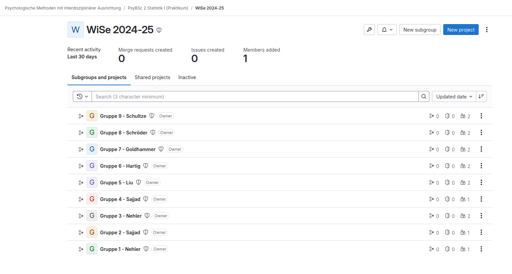

```{r setup, cache = FALSE, include = FALSE, purl = FALSE}
# Aktuell sollen die global options für die Kompilierung auf den default Einstellungen gelassen werden
```


Wie wir bereits besprochen haben, sollen Sie im Rahmen des Praktikums eine erste eigene Studie konzipieren. Hierfür wird Ihnen von Ihren Dozent:innen ein Datensatz zur Verfügung gestellt, an dem Sie Ihre Hypothesen inferenzstatistisch testen können. Dabei sollen Sie direkt die Praktiken guter, transparenter Wissenschaft mit Hilfe unserer Plattform [LIFOS](https://lifos.uni-frankfurt.de) kennen lernen und anwenden. Wir haben alle wichtigen Informationen hier in diesem Beitrag nochmals für Sie zusammengefasst. Sollten in der Zusammenarbeit in Ihrer Kleingruppe noch Fragen auftreten, wenden Sie sich bitte an Ihre/n Dozent:in.


<details><summary><b>Kernfragen dieser Lehreinheit</b></summary>

- Was müssen Sie auf [**LIFOS**](#firststeps) tun, um loslegen zu können?
- Wie legt man auf LIFOS ein [**Projekt**](#projektstart) an?
- Wie [**bearbeitet**](#bearbeitung) man ein Projekt auf LIFOS?
- Was ist eine [**Präregistrierung**](#praeregistrierung) und wie können Sie Ihr Projekt präregistrieren?
- Worauf müssen Sie achten, wenn Sie Ihre [**Analysen**](#analysen) teilen? 
- Wie schließen Sie ein Projekt auf LIFOS ab?
- Wie kann man einen Commit [**korrigieren**](#Hilfe), den man auf dem falschen Branch ausgeführt hat?

</details>

***

# Erste Schritte auf LIFOS {#firststeps}

[LIFOS](https://lifos.uni-frankfurt.de) steht für **L**okale **I**nfrastruktur **f**ür **O**pen **S**cience und ist unsere universitätsinterne Übungsplattform für Studierende der Psychologie-Studiengänge der Goethe-Universität Frankfurt. Die Plattform basiert auf GitLab und ist der Struktur des [Open Science Frameworks](https://osf.io) nachempfunden. Die Idee ist, Open Science Praktiken im Rahmen des Studiums in einem geschützten Rahmen üben und durchführen zu können. Um mit Ihrem Projekt auf LIFOS loszulegen, müssen Sie zuerst folgende Schritte absolvieren:

<ol><li><p><b>Loggen Sie sich auf LIFOS ein</b></p> 
Hierfür benötigen Sie lediglich die Zugangsdaten Ihres HRZ-Kontos.</li> 

<li><p><b>Gruppenübersicht anzeigen</b></p>
Projekte auf LIFOS müssen in den jeweiligen Abteilungen/Kursen angelegt werden, um auch diesen zugeordnet werden zu können. Das heißt, Sie müssen erst Mitglied Ihrer PsyBSc2 Praktikumsgruppe auf LIFOS werden, um dann in ebenjener Gruppe ein Projekt anzulegen. Um die Gruppe auf LIFOS zu finden, klicken Sie im Steuerungsmenü auf der linken Seite auf <b>Groups</b>, dann im Hauptfenster auf <b>Explore groups</b> (direkt neben <b>New Group</b>). </li>


<li><p><b> Zur Gruppe navigieren </b></p> 
Nun können Sie alle öffentlichen Gruppen auf LIFOS sehen. Zunächst müssen Sie auf die Gruppe <b>Psychologische Methoden mit interdisziplinärer Ausrichtung</b>, dann wiederum auf <b>PsyBSc 2 Statistik I (Praktikum)</b>, dann auf <b>WiSe 2024-25</b> klicken. Jetzt sollten Ihnen alle neun Praktikumsgruppen angezeigt werden. </li>



<li><p><b> Zugang beantragen </b></p>
Klicken Sie auf Ihre Gruppe. Oben steht nun blau hinterlegt <b>Request access</b>. Klicken Sie drauf und bestätigen Sie. Gratulation! Sie haben so eben einen wichtigen Schritt gemeistert und Zugriff zu Ihrer Praktikumsgruppe beantragt. Sobald Ihr Dozent/Ihre Dozentin Ihre Anfrage bestätigt hat, können Sie und Ihre Gruppe loslegen.</li></ol>


# Auf LIFOS ein Projekt anlegen {#projektstart}

Nachdem Sie und Ihre Gruppenkolleg:innen Mitglied in Ihrer Praktikumsgruppe wurden, können Sie Ihr Projekt in der Gruppe anlegen. Hierfür ist es wichtig, dass Sie bereits Ihre Fragestellung kennen, um einen inhaltlichen Titel für Ihr Projekt angeben zu können. Begeben Sie sich auf LIFOS zu Ihrer Praktikumsgruppe. **Wichtig**: Es reicht aus, wenn *eine* Person aus Ihrer Gruppe das Projekt anlegt. Sie können im Anschluss alle darauf zugreifen. Klicken Sie auf den blauen Knopf *New Project*, dann auf *Create from template*, dann auf *Instance*, und dann bei **PsyBSc2 Statistik I Praktikum Template** auf *Use template*. Hier können Sie nun Ihren Projekttitel eingeben und in der *Project description* geben Sie alle Namen Ihrer Projektgruppe, den Kurs, und das aktuelle Semester an und zwar im Stil: *Eure Namen – Kurs – Semester*. Zum Beispiel: Ameise Alex, Bär Berti, Chamäleon Chiara - Statistik I Praktikum - WiSe 2023/24.
Dadurch können andere später leichter nachvollziehen, wer an dem Projekt mitgearbeitet hat. Obwohl die folgenden Dinge bereits richtig eingestellt sein sollten, achten Sie vor der Erstellung noch darauf, 
- dass bei Template das PsyBSc2 Template steht,
- dass bei Project URL Ihre Gruppe steht und
- dass das Visibility Level auf Internal gesetzt ist.


Alright, klicken Sie den *Create project* Knopf und schon steht Ihr Projekt!
Dadurch, dass Sie das Projekt basierend auf dem PsyBSc2 Template initialisiert haben, werden Ihnen bereits wichtige Strukturen vorgegeben (die sich aber auch bei Bedarf ändern und anpassen lassen). Alle weiteren Schritte werden von nun auch im README eures Projekts angezeigt, der Vollständigkeit halber aber auch nochmal hier. Für tiefergehende Informationen über LIFOS können wir euch unsere [generellen Tutorials auf pandaR](/lifos/main/) ans Herz legen.


# Bearbeitung von Projekten auf LIFOS {#bearbeitung}

Auf LIFOS kann man Projekte bearbeiten, indem man Dateien und Ordner hinzufügt, umbenennt oder wieder entfernt. Außerdem kann man die README-Datei, auf die hier [gleich](#projektabschluss) noch eingegangen wird, bearbeiten. Um das Projekt zu bearbeiten, ist es am einfachsten, ins Web IDE zu gehen. Hier öffnet sich ein User Interface, in dem man ganz einfach agieren kann. Zum Beispiel lassen sich mehrere Dateien gleichzeitig hochladen, löschen, etc. Wenn Sie mit Ihren Änderungen fertig sind, klicken Sie links unten auf *Create commit*. Das ist ein Git-Befehl, auf den wir hier nicht näher eingehen werden. Jetzt können Sie *commit* erstmal als so etwas wie *Speichern* verstehen. Nach dem Klicken öffnet sich ein kleines Textfeld. Hier können Sie vermerken, welche Änderungen Sie vorgenommen haben. Achten Sie nun **unbedingt** darauf, dass Sie *commit to main branch* auswählen. Wenn Sie das alles befolgen, sind im Anschluss Ihre Änderungen im Projekt sichtbar. Sollten Sie die Änderungen doch nicht speichern wollen, können Sie oben rechts auch auf den rot umrandeten Knopf *Discard changes* klicken. 


# Präregistrierung auf LIFOS {#praeregistrierung}

Eine Präregistrierung ist ein Dokument mit einem Zeitstempel, dass Informationen über die Studie beinhaltet, die bereits vor der Datenerhebung festliegen und so transparent festgehalten werden. Dazu zählen insbesondere Informationen über die Hypothesen und die statistische Auswertung, wie zum Beispiel welche Konstrukte erhoben werden, welche Fragebögen dafür verwendet werden, und welche Methoden man verwendet, um die Hypothese zu testen. Außerdem hilft eine Präregistrierung dabei, das Projekt schon vor Durchführung ausführlich zu durchdenken und so Fehler oder Probleme noch vor dem Auftreten entdecken und beheben zu können. 

In Ihrem Projekt auf LIFOS finden Sie im Ordner *1_Präregistrierung* eine Datei namens *PsyBsc2_preregistration.md*. Die Datei im Markdown-Format geschrieben. Der Vorteil an dem Format ist, dass diese Datei in jedem beliebigen Texteditor geöffnet und bearbeitet werden kann. Neben der lokalen Bearbeiter auf Ihrem Computer nach einem Download kann die Datei auch direkt auf LIFOS im Editor bearbeitet werden. Wie man Markdown verwendet, können Sie [hier](/lifos/grundlagen/eigenesprojekt/), [hier](/lifos/extras/basic-markdown-uebung/) und [hier](https://www.markdownguide.org/basic-syntax/) erfahren.

Pro Gruppe muss nur eine Präregistrierung erstellt werden. Laden Sie das ausgefüllte Dokument hoch (falls Sie die Bearbeitung nicht direkt auf LIFOS gemacht haben) und sagen Sie Ihrer Praktikumsleitung Bescheid, um Feedback zu erhalten. Nachdem Sie das Feedback eingearbeitet haben und Ihre Präregistrierung abgesegnet wurde, können Sie diese erneut hochladen. Die Zeit, zu der das Dokument hochgeladen wird, wird als Zeitstempel für die Präregistrierung verwendet. 


# Analysecode {#analysen}

Wenn Sie die Datenanalyse abgeschlossen haben, können Sie Ihr R-Skript im Ordner *3_Skripte* hochladen. Achten Sie darauf, dass die Ergebnisse auch auf anderen Rechnern reproduzierbar sind, sprich, dass Ihr Skript durchläuft und dieselben Ergebnisse ausgibt, egal von welchem Computer es ausgeführt wird. Darüber hinaus sollte Ihr Skript auch für unbeteiligte Personen verständlich sein. Achten Sie dafür auf eine sinnvolle Struktur, nutzen Sie sinnvolle Variablennamen und kommentieren Sie Ihr Skript ausführlich. All diese Dinge werden Sie auch im Statistik I Praktikum lernen.

# Weitere Schritte

Da es gute wissenschaftliche Praxis ist, auch die Materialien zu teilen, die zur Studie verwendet werden, gibt es diesen Ordner auch auf LIFOS. In *2_Materialien* können Sie alle Materialien hochladen, die in Ihrer Studie verwendet wurden. In diesem Fall ist dies der Fragebogen, den Ihre Dozent:innen mit Ihnen teilen.

Dies gilt ebenso für das Datenset, welches in *4_Daten* hochgeladen werden soll.

# Projektabschluss {#projektabschluss}

Wenn Sie mit Ihrem Gruppenbericht fertig sind, laden Sie die finale PDF-Version Ihres Berichts im Ordner *5_Bericht* hoch.
Zu guter Letzt, gibt es dann noch das *README.md*-Dokument. Das README ist - wie auch die Präregistrierung - eine Markdown-Textdatei. Sie soll Informationen über Ihr Projekt enthalten soll, einschließlich Zweck, Inhalt und weitere Details. Sie befindet sich normalerweise im Stammverzeichnis. Die README-Datei dient als Schnellreferenz für jeden, der versucht, euer Projekt zu verstehen oder zu verwenden, und ist eine wichtige Ressource für jeden, der auf sie stößt. Wenn Sie die README-Datei angepasst haben und alle Dateien wie beschrieben hochgeladen haben, sind Sie mit Ihrem Projekt auf LIFOS fertig :)

## Hilfestellung{#Hilfe}

<details>
<summary>Was kann ich tun, wenn ich aus Versehen auf einen anderen Branch als <b>main</b> commited habe?</summary>

In diesem Fall könnt ihr eure Änderungen von dem falschen Branch auf Main pushen und den falschen Branch, sofern er aus Versehen erstellt wurde, auch löschen.

Zuerst solltet ihr auf euer Projekt gehen und auf der linken Seite das `Merge requests` Symbol anklicken

Hier solltet ihr eure Änderungen auf dem anderen Branch als *Merge Request* sehen.


Klickt ihr dabei nun auf *create merge request* öffnet sich ein neues Fenster.


Hier könnt ihr nun einen Titel und eine Beschreibung für euren Merge hinzufügen, der den Grund und Inhalt eures ursprünglichen Commits erklärt, und vielleicht auch auf den falschen Commit hinweist.


Wählt danach, sofern ihr den anderen Branch löschen wollt da ihr ihn unabsichtlich erstellt habt, `Delete source branch when merge request is accepted` aus. Danach könnt ihr `Create merge request` anklicken.

Ihr solltet nun auf einer neuen Seite landen


Hier müsst ihr euren Merge und das löschen des source branch von welchem aus der Fehler ausging erneut bestätigen und den `Merge`-button betätigen

Nach einem kurzen Moment solltet ihr nun sehen, dass der Merge erfolgreich war!


*Sollte dies nicht der Fall sein, oder solltet ihr irgendwo vorher bereits Probleme haben, könnt ihr auch LIFOS@uni-frankfurt.de kontaktieren.*
</details>
