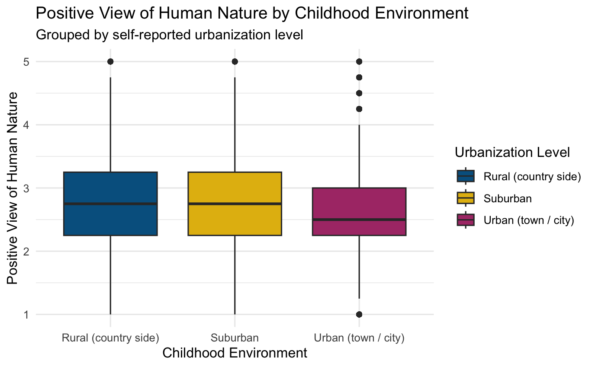

```{r setup, cache = FALSE, include = FALSE, purl = FALSE}
if (exists("figure_path")) {
  knitr::opts_chunk$set(fig.path = figure_path)
}
```

## Vorbereitung

Installieren und laden Sie das Paket *ggplot2*, sofern noch nicht geschehen.

```{r eval = FALSE}
install.packages("ggplot2")
library(ggplot2)
```

Kopieren Sie nun bitte folgenden R-Code um den Übungsdatensatz *mach* zu laden und weitere vorbereitende Schritte auszuführen:

```{r eval = FALSE}
load(url("https://pandar.netlify.app/daten/mach.rda"))

# Variable hand (Schreibhand) als Faktor definieren
mach$hand <- factor(mach$hand,                # Ausgangsvariable
                      levels = 1:3,               # Faktorstufen
                      labels = c("rechts", "links", "beide"))   # Bedeutung

# Variable gender (Geschlecht) als Faktor definieren
mach$gender <- factor(mach$gender,
                      levels = 1:3,
                      labels = c("weiblich", "männlich", "divers"))

# Variable urban (Ort des Aufwachsens) als Faktor definieren
mach$urban <- factor(mach$urban,
                      levels = 1:3,
                      labels = c("Rural (country side)", "Suburban", "Urban (town / city)"))

# Definition von drei Farben als Hex-Codes zur Verwendung in Aufgabe 4
mach_colors <- c("#00618f", "#e3ba0f", "#ad3b76")
```

## Aufgabe 1

Erstellen Sie ein einfaches Balkendiagramm für die Variable *hand* aus dem *mach*-Datensatz.
- Formatieren Sie die Farbe der Balken in Abhängigkeit der Variable *hand*
- Wenden Sie das Theme `theme_minimal()` an.

## Aufgabe 2

Visualiseren Sie für jedes der drei Geschlechter (Variable *gender*) die Häufigkeit der Schreibhand (Variable *hand*). Es sollen drei Balken pro Schreibhand dargestellt werden.
- Formatieren Sie die Farbe der Balken in Abhängigkeit der Variable *gender*
- Fügen Sie einen schwarzen Rand zu den Balken hinzu
- Stellen Sie die Balken nebeneinander dar. (Die Voreinstellung gibt die Balken in einer gestaplten Ansicht aus.)

## Aufgabe 3

Erweitern Sie das gruppierte Balkendiagramm aus Aufgabe 2 um geeignete Beschriftungen.
- Vergeben Sie jeweils Titel und Untertitel, sowie Achsen- und Legendentitel

## Aufgabe 4

Verwenden Sie nun die in der Variable *mach_colors* (Siehe Vorbereitung oben) manuell definierte Farbpalette, um die Balken mit den von uns gewählten Farben anzupassen.

## Aufgabe 5

Versuchen Sie unter der Verwendung der Variablen *urban* und *pvhn* die folgende Abbildung nachzubauen! 

