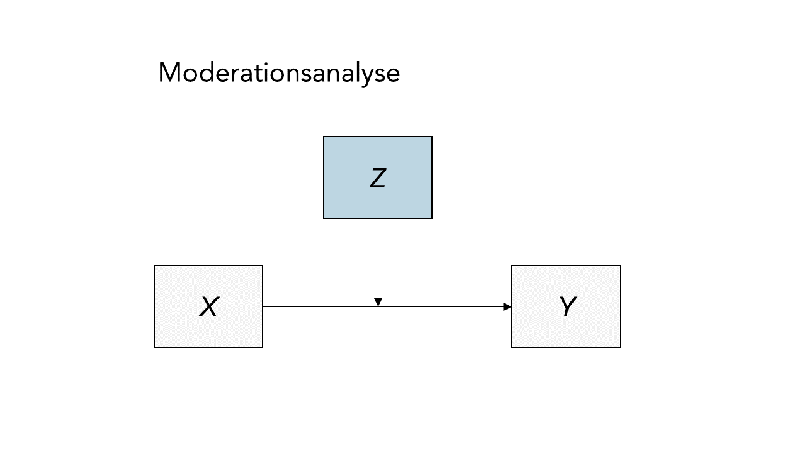
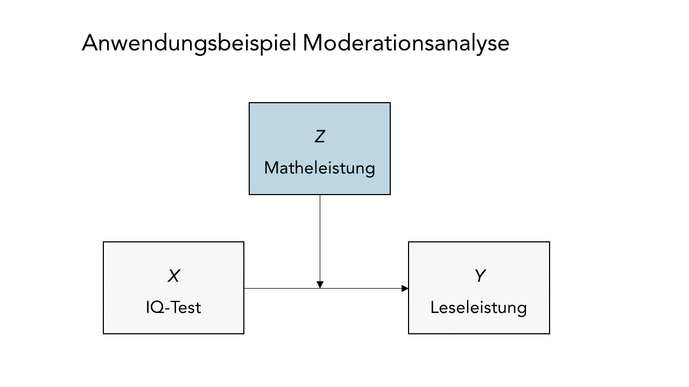
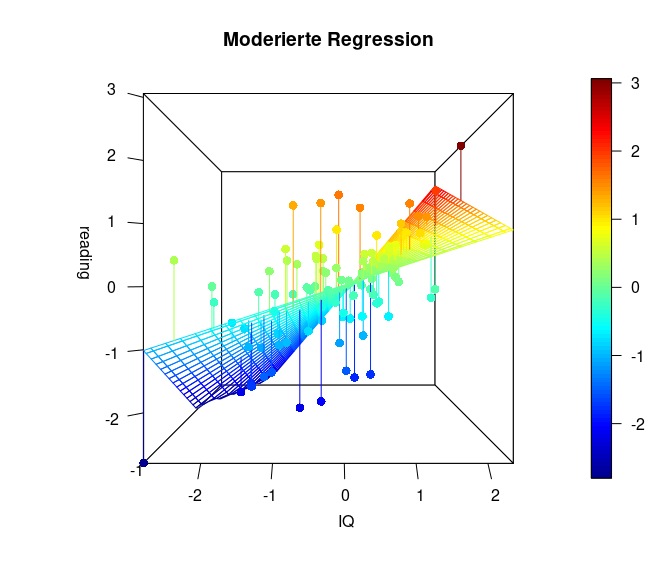

```{r setup, cache = FALSE, include = FALSE, purl = FALSE}
if (exists("figure_path")) {
  knitr::opts_chunk$set(fig.path = figure_path)
}
# Aktuell sollen die global options für die Kompilierung auf den default Einstellungen gelassen werden
```

## Einleitung

In der letzten Sitzung haben wir die Analyse von Kovariaten (bzw. **AN**alysis **o**f **C**ovariance, ANCOVA) als Regression mit nominalskalierten Prädiktoren kennengelernt.

Wir haben gesehen, dass wir Gebrauch von Interaktionstermen in der Regressionsgleichung gemacht haben, um die Wechselwirkungen zwischen kategorialen UVs, oder zwischen einer kategorialen und einer intervallskalierten UV zu berücksichtigen. In der Moderationsanalyse werden wir diese Konzepte zurückgreifen und uns dabei vor allem auf Eid & Gollwitzer 2017, Kapitel 19.9 beziehen.

*Im Anschluss an diesen Beitrag können Sie sich mit dem [nächsten Quiz](/lehre/statistik-ii/quizdaten-bsc7#Quiz6) auseinandersetzen.*

## Was ist moderierte Regression?

Bei der moderierten Regression bzw. Moderationsanalyse handelt es sich um eine weitere Methode, die es uns gestattet, auch komplexere Zusammenhänge mehrerer Variablen mithilfe der Regression zu untersuchen. Konkreter soll es hier um Szenarien gehen, in denen der Regressionszusammenhang von einer dritten Variable abhängig ist.

Bei einer gewöhnlichen, multiplen Regression gehen wir davon aus, dass das Regressionsgewicht $\beta$ unabhängig von der Ausprägung der anderen Variablen ist. Der Einfluss einer UV auf die Kriteriumsvariable weist hier für jede Ausprägung der UVs die gleiche Form auf, interagiert also nicht mit anderen UVs.

Es kann jedoch auch Fälle geben, wo eine (Dritt-)Variable $Z$ die Stärke des Zusammenhangs zwischen $Y$ und $X$ beeinflusst, und damit die Ausprägung von $\beta$. Schematisch lässt sich eine solcher, durch $Z$ moderierte Regressionszusammenhang so abbilden:



Das lässt sich auch mittels der folgenden Regressionsgleichung darstellen (für eine Person $i$ ):

$$Y_i = \beta_0 + \beta_1X_i + \beta_2Z_i + \beta_3X_iZ_i + \varepsilon_i.$$

In diesem Modell ist ein Interaktionsterm $X_iZ_i$ enthalten, der den Koeffizienten $\beta_3$ trägt. Damit wird also die Annahme in das Modell eingeschlossen, dass die UV $Y$ vom Zusammenspiel der beiden Variablen $X$ und $Z$ abhängen könnte. Sofern die Interaktion über diese beiden Variablen hinaus einen bedeutsamen Beitrag zur Erklärung der Variation in der Kriteriumsvariablen leistet, spricht man von einem Moderationseffekt.

Wichtig dabei ist, dass sowohl $X$ als auch $Z$ als Haupteffekte neben der Interaktion $X*Z$ enthalten sein sollten, um eine mögliche Korrelation zwischen den beiden zu berücksichtigen und Multikollinearität zu vermeiden.

### Erinnerung: Was hat das ANCOVA zu tun?

In der letzten [Lektion über die ANCOVA]() haben wir Anwendungsfälle kennengelernt, in denen z.B. eine kategoriale Variable (z.B. Geschlecht) den Zusammenhang zwischen einer AV und einer UV beeinflusst. Bei einer Kovariate Geschlecht könnte sich z.B. für die Gruppe der Frauen ein anderer $\beta$-Koeffizient bzw. Slope ergeben, als für die Gruppe der Männer.

Wenn wir uns nun vorstellen, dass wir unendlich viele Gruppenausprägungen hätten, dann wäre es theoretisch möglich, für jede Gruppe eine Ausprägung des Slope oder des Interzepts zu finden. So ähnlich funktioniert nun die moderierte Regression.

Das ist auch der Grund, wieso die obige Regressionsgleichung der Gleichung der generalisierten ANCOVA zum Verwechseln ähnlich sieht - denn sie sind identisch! Der Unterschied ist lediglich, dass wir nicht unendlich viele Gruppenkategorien haben, sondern einfach einen kontinuierlichen Prädiktor - den Moderator.

Wenn wir nun die Gleichung so umstellen, dass wir X (unseren Prädiktor) ausklammern...


$$
\begin{align} Y_i &= \beta_0 + \beta_2Z_i + \beta_1X_i + \beta_3ZX_i+e_i,\\[1.5ex] &= \underbrace{\beta_0 + \beta_2Z_i}_{g_{Intercept}(Z_i)} + \underbrace{(\beta_1 + \beta_3Z_i)}_{g_{Slope}(Z_i)}X_i+e_i. \end{align}
$$

...erkennen wir, dass in dieser Gleichung der Form nach ein Interzept und ein Slope enthalten sind, welche jeweils abhängig von der Ausprägung des Moderators Z sind.

Jedoch ist hier zu beachten, dass wir allerdings auch $Z$ stattdessen ausklammern könnten: $Y_i = (\beta_0 + \beta_1X_i) + (\beta_2 + \beta_3X_i)Z_i+e_i$. Somit wird ersichtlich, dass $X$ und $Z$ in dieser Gleichung austauschbar sind und es damit keine mathematische Begründung gibt, welche der beiden Variablen der Prädiktor und welche der Moderator ist! Manche sagen auch, dass dieses Modell “symmetrisch” in den beiden Variablen ist, man sie also leicht hinsichtlich der inhaltlichen Interpretation austauschen kann. Den theoretischen Annahmen, die durch Forschende bei der Auswahl der Variablen und Moderatoren getroffen werden, kommt hier also eine entscheidende Bedeutung zu (vgl. Appendix A für ein Beispiel).

Wie genau die Interpretation einer moderierten Regression in der Praxis funktioniert, veranschaulichen wir nun an unserem Anwendungsbeispiel.

## Datensatz

Wir wollen dies am Datensatz `Schulleistungen.rda` ([Link zur Beschreibung]() durchführen, den wir bereits aus vorherigen Sitzungen kennen. Erneut werden wir die Zusammenhänge in den Daten zu mathematischen und Lesefähigkeiten, sowie des IQ-Testwerts von $N$ = 100 Schüler/-innen betrachten. Zunächst laden wir den Datensatz über die Website:

```{r}
# Datensatz einlesen
load(url("https://pandar.netlify.app/daten/Schulleistungen.rda"))
head(Schulleistungen)
```

### Zentrierung der Variablen

Wenn wir mit Interaktionen zu tun haben, ist eine Zentrierung aller kontinuierlichen Prädiktoren wichtig (der Mittelwert aller Variablen wird auf 0 gesetzt), um mögliche Multikollinearität zwischen linearen und nichtlinearmen Termen (der Interaktion) zu vermeiden.

Wieso erleichtert uns das die Interpretation? Wenn sowohl Prädiktor als auch Moderator zentriert sind, lässt sich der Wert $Z = 0$ als Mittelwert von $Z$ gut interpretieren. Dann sind nämlich $g_{Intercept}(0) = \beta_0$ und $g_{Slope}(0) = \beta_1$ (der Koeffizient von $X$). Wir erkennen also, dass $\beta_0$ und $\beta_1$ jeweils das Interzept und den Slope für ein durchschnittliches $Z$ beschreiben. Die Koeffizienten $\beta_2$ und $\beta_3$ symbolisieren dann die Abweichungen vom mittleren Interzept oder Slope in Abhängigkeit von $Z$.

Obwohl eine Standardisierung nicht unbedingt notwendig ist, führen wir sie mit unseren Variablen zusätzlich durch (und setzen ihre Standardabweichung auf 1), um uns die spätere Interpretation zu erleichern:

```{r}
# Standardisierung der Variablen
Schulleistungen_std <- data.frame(scale(Schulleistungen)) 
# standardisierten Datensatz abspeichern als data.frame
colMeans(Schulleistungen_std)     # Mittelwert pro Spalte ausgeben
apply(Schulleistungen_std, 2, sd) # SD pro Spalte ausgeben
```

Inhaltlich treffen wir zunächst einmal die Annahme - von der wir uns in den vergangenen Lektionen bereits überzeugen konnten - dass der IQ die Leseleistung der Schüler/-innen signifikanz vorhersagt. Das erkennen wir auch anhand einer einfachen Regression mit `IQ` als Prädiktor und `reading` als Outcome-Variable:

```{r}
# Regression ohne Interaktion
mod <- lm(reading ~ IQ, Schulleistungen_std)
summary(mod)
```

Wenn der IQ um 1 SD steigt, erhöht sich laut diesem Output auch die Lesefähigkeit um `r coef(mod)[2] |> round(2)` SD.

Treffen wir nun die inhaltliche Annahme an, dass die Mathematikleistungen der Schüler/-innen den Zusammenhang zwischen IQ und Lesefähigkeit moderieren könnten. Oder in anderen Worten: Dass der Zusammenhang zwischen `IQ` und `reading` sich in Abhängigkeit von `math` verändert. Schematisch könnte man das so darstellen:



Hierzu führen wir eine moderierte Regression durch, in welcher wir `reading` durch den `IQ` sowie die Matheleistung `math` vorhersagen, sowie zusätzlich ihre Interaktion `IQ:math`einschließen. Falls wir alternativ die Interaktion als `IQ*math` formulieren, werden automatisch die Haupteffekte, also die Variablen selbst, mit aufgenommen. Es gilt also: `math + IQ + math:IQ` = `math*IQ`, wobei die Interaktion `math:IQ` ist. Um auch wirklich die Interaktion zu testen, ist es unbedingt notwendig, die Haupteffekte der Variablen ebenfalls in das Modell mit aufzunehmen, da die Variablen trotzdem mit der Interaktion korreliert sein können, auch wenn die Variablen zentriert sind.

```{r}
# Regression mit Moderator Matheleistungen
mod_reg <- lm(reading ~ IQ + math + IQ:math, data = Schulleistungen_std)
summary(mod_reg)

```

Dem Output entnehmen wir, dass sowohl der Haupteffekt des IQs ($p = 0 < .05$) als auch die Interaktion mit der Matheleistung signifikant sind ($p = 0.0497 < .05$). Die Matheleistung an sich bringt aber keine signifikante Vorhersagekraft der Leseleistung ($p = 0.4859 > .05$).

Trotz Abwesenheit eines Haupteffekts von Matheleistung können wir interpretieren, dass die Matheleistung die Beziehung zwischen dem IQ und der Leseleistung moderiert. Somit wäre $X = \text{IQ}$ (Prädiktor) und $Z = \text{math}$ (Moderator).

Wenn die Matheleistung um 1 SD steigt, erhöht sich der Zusammenhang zwischen IQ und Leseleistung, $\beta_3$, um `r coef(mod_reg)[4] |> round(2)` SD. Je besser die Matheleistung, desto stärker wächst in diesem Fall also der Einfluss des IQ auf die Leseleistung.

## Grafische Darstellung

Es gibt ein R-Paket, dass eine solche Interaktion grafisch darstellt: `interactions`. Nachdem Sie dieses installiert haben, können Sie es laden und die Funktion `interact_plot` verwenden, um diese Interaktion zu veranschaulichen. Dem Argument model übergeben wir `mod_reg`, also unser moderiertes Regressionsmodell. Als Prädiktor wählen wir den IQ, also müssen wir dem Argument `pred` den IQ übergeben. Der Moderator ist hier die Matheleistung, folglich übergeben wir `math` dem Argument `modx`.

```{r}
library(interactions)
interact_plot(model = mod_reg, 
              pred = IQ, 
              modx = math)
```

Uns wird nun ein Plot mit drei Linien ausgegeben. Dargestellt sind drei Beziehungen zwischen dem `IQ` und `reading` für unterschiedliche Ausprägungen von `math`. Diese werden häufig auch “simple slopes” Plot genannt, da sie zur Vereinfachung der komplexen Beziehung drei "einfache" Slopes herausgreifen und darstellen:Erstens für einen durchschnittlichen `math`-Wert, und zweitens und drittens für Werte, die eine Standardabweichung (SD) oberhalb oder eine Standardabweichung (SD) unterhalb des Mittelwerts liegen. Damit bekommen wir ein Gefühl dafür, wie sehr sich die Beziehung (und damit Interzept und Slope) zwischen der Leseleistung und der Intelligenz verändert für unterschiedliche Ausprägungen der Matheleistung: Für eine durchschnittliche (Mean) Ausprägung, eine unter- (- 1 SD) und eine überdurchschnittliche (+ 1 SD) Ausprägung.

Wie im Beitrag zur [ANCOVA]() gezeigt, können wir hier mithilfe des Pakets `reghelper` die Simple Slopes auch numerisch ausgeben lassen:

```{r echo = T}
library(reghelper)
simple_slopes(mod_reg)
```

Natürlich gibt es nicht nur diese drei Linien, sondern der Moderator kann jede beliebige Ausprägung annehmen - deswegen gibt es unendlich viele.

Die folgende Grafik stellt den Sachverhalt noch einmal als 3D Grafik (mit dem Paket `plot3D`) dar (ziemlich cool, oder?). In dieser Grafik erkennen wir sehr deutlich, dass die Simple Slopes tatsächlich eine stark vereinfachte Darstellung sind und es tatsächlich unendlich viele bzw. so viele unterschiedliche Beziehungen zwischen Prädiktor (`IQ`) und Kriterium (`reading`) in Abhängigkeit des Moderators (`math`) gibt, wie dieser (`math`) Ausprägungen hat. Der Code zu den Grafiken und eine nähere Beschreibung finden Sie in Appendix B.



## Fazit

Wir haben mit der generalisierten ANCOVA und der moderierten Regressionsanalyse zwei Modelle kennengelernt, mit denen sich lineare Beziehungen in Abhängigkeit weiterer Variablen mithilfe von Interaktionstermen ausdrücken lassen: Entweder in Abhängigkeit von Gruppierungsvariablen (dann landen wir im generalisierten ANCOVA-Setting) oder in Abhängigkeit von kontinuierlichen Prädiktoren (das ist dann die moderierte Regression).

***

### Appendix A

<details><summary><b>Beispiel: Symmetrie der moderierten Regression</b></summary>


Bei der Moderationsanalyse gilt es, darauf zu achten, dass es rechnerisch keinen Unterschied macht, welche der beiden Variablen im Modell als Moderator und welche als Prädiktor interpretiert wird. Das Modell ist "symmetrisch", hinsichtlich der inhaltlichen Interpretation also austauschbar.

Dies zeigt sich einerseits an der analog zum Beitrag dargestellten Formelgleichung, aus der wir sowohl $X$, als auch $Z$ ausklammern können:


$$
\begin{align} Y_i &= \beta_0 + \beta_1X_i + \beta_2Z_i + \beta_3XZ_i+e_i,\\[1.5ex] &= \underbrace{\beta_0 + \beta_1X_i}_{Intercept(X_i)} + \underbrace{(\beta_2 + \beta_3X_i)}_{Slope(X_i)}Z_i+e_i. \end{align}
$$


Andererseits wird auch durch die R-Syntax des Modell-Calls `lm(formula = reading ~ IQ + math + IQ:math, data = Schulleistungen_std)` für unser Regressionsmodell deutlich, dass die Reihenfolge der Variablennamen `math` und `IQ` ebenfalls keinen Unterschied macht. Dies wird auch daran deutlich, dass wir unter Zugrundelegung des gleichen Modellobjekts ebenso einen Zusammenhang zwischen `math` als Prädiktor, und `IQ` als Moderator visualisieren könnten:

```{r}
interact_plot(model = mod_reg, pred = math, 
              modx = IQ)
```

Indem wir eine andere Wirkungsrichtung impliziert haben, verschiebt sich auch die Interpretation unserer Ergebnisse. So könnte aus dieser Darstellung abgeleitet werden, mit einem überdurchschnittlichen IQ der Zusammenhang zwischen der Matheleistung und der Lesefähigkeit positiv ausgeprägt ist, während bei Personen mit unterdurchschnittlichem IQ eine bessere Matheleistung mit einer schlechteren Lesefähigkeit einhergeht.

Wir stehen vor dem gleichen Problem, mit dem wir auch bei anderen anderen korrelativen Verfahren stets in Berührung kommen: Wann immer wir mit querschnittlichen (d.h. zeitgleich erhobenen) Daten arbeiten, können wir keine kausalen Schlüsse ziehen!

Es liegt daher in der Verantwortung der Forschenden, die Auswahl der Moderatorvariablen auf der Grundlage theoretischer Überlegungen zu treffen und die Hypothesen vor der Analyse klar zu definieren, um Fehlschlüssen vorzubeugen.

</details>

### Appendix B

<details><summary><b>Code zu 3D-Grafiken</b></summary>


```{r}
library(plot3D)
# Übersichtlicher: Vorbereitung
x <- Schulleistungen_std$IQ
y <- Schulleistungen_std$reading
z <- Schulleistungen_std$math
fit <- lm(y ~ x*z)
grid.lines = 26
x.pred <- seq(min(x), max(x), length.out = grid.lines)
z.pred <- seq(min(z), max(z), length.out = grid.lines)
xz <- expand.grid( x = x.pred, z = z.pred)
y.pred <- matrix(predict(fit, newdata = xz), 
                 nrow = grid.lines, ncol = grid.lines)
fitpoints <- predict(fit)

# Plot:
scatter3D(x = x, y = z, z = y, pch = 16, cex = 1.2, 
          theta = 0, phi = 0, ticktype = "detailed",
          xlab = "IQ", ylab = "math", zlab = "reading",  
          surf = list(x = x.pred, y = z.pred, z = y.pred,  
                      facets = NA, fit = fitpoints), 
          main = "Moderierte Regression")

```

Hier ist auf der x-Achse ($- links \longleftrightarrow rechts +$) der IQ dargestellt, und in die Tiefe die Matheleistung (oft z-Achse: ($-vorne\longleftrightarrow hinten+$)). Die y-Achse (im Plot heißt diese blöderweise z-Achse) stellt die Leseleistung dar. ($-unten\longleftrightarrow oben+$). Wir erkennen in dieser Ansicht ein wenig die Simple-Slopes von zuvor, denn die Achse der Matheleistung läuft ins Negative “aus dem Bildschirm hinaus”, während sie ins Positive “in den Bildschirm hinein” verläuft. Der nähere Teil der “Hyperebene” weißt eine geringere Beziehung zwischen dem IQ und der Leseleistung auf, während der Teil, der weiter entfernt liegt, eine stärkere Beziehung aufweist. Genau das haben wir auch in den Simple Slopes zuvor gesehen. Dort war für eine hohe Matheleistung die Beziehung zwischen dem IQ und der Leseleistung auch stärker. Wichtig ist, dass in diesem Plot die Beziehung zwischen dem IQ und der Leseleistung für eine fest gewählte Ausprägung der Matheleistung tatsächlich linear verläuft. Es ist also so, dass wir quasi ganz viele Linien aneinander kleben, um diese gewölbte Ebene zu erhalten. Die Ausprägung der Matheleistung ist im nächsten Plot noch besser zu erkennen, in der der Plot etwas gedreht dargestellt wird. Farblich ist außerdem die Ausprägung der Leseleistung dargestellt, damit die Werte leichter zu vergleichen sind.

```{r}
scatter3D(x = x, y = z, z = y, pch = 16, cex = 1.2, 
          theta = 20, phi = 20, ticktype = "detailed",
          xlab = "IQ", ylab = "math", zlab = "reading",  
          surf = list(x = x.pred, y = z.pred, z = y.pred,  
                      facets = NA, fit = fitpoints), 
          main = "Moderierte Regression")
```

Diese Plots geben einen noch besseren Eindruck davon, was genau bei einer Interaktion passiert und wie “austauschbar” eigentlich der Moderator oder der Prädiktor sind. Außerdem kann man mit den Überlegungen aus diesem Abschnitt leicht einsehen, dass das quadratische Modell von oben tatsächlich ein Spezialfall dieses moderierten Modells ist, in welchem der Prädiktor mit sich selbst interagiert (sich selbst moderiert). Darüber, wie genau man moderierte Regressionen durchführt, gibt es viel Literatur. Einige Forschende sagen, dass man neben der Interaktion auch immer die quadratischen Effekte mit aufnehmen sollte, um auszuschließen, dass die Interaktion ein Artefakt ist, der nur auf quadratische Effekte zurückzuführen ist.

Für weitere Informationen zum Umgang mit diesem Plot siehe bspw. hier: [3D Grafiken mit plot3D](http://www.sthda.com/english/wiki/impressive-package-for-3d-and-4d-graph-r-software-and-data-visualization).

</details>

*** 

## Literatur

[Eid, M., Gollwitzer, M., & Schmitt, M. (2017).](https://ubffm.hds.hebis.de/Record/HEB366849158) *Statistik und Forschungsmethoden* (5. Auflage, 1. Auflage: 2010). Weinheim: Beltz.
