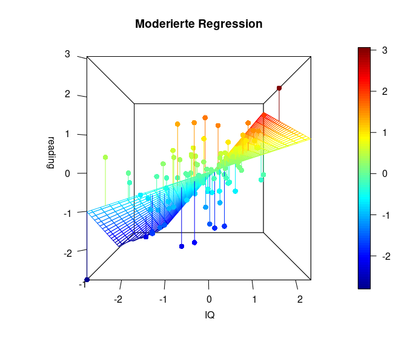

<!--Ersetzt den alten Setup Chunk, wenn nichts damit gemacht wurde -->


## Einleitung

In der letzten Sitzung haben wir die Analyse von Kovariaten (bzw. **AN**alysis **o**f **C**ovariance, ANCOVA) als Regression mit nominalskalierten Prädiktoren kennengelernt.

Wir haben gesehen, dass wir Gebrauch von Interaktionstermen in der Regressionsgleichung gemacht haben, um die Wechselwirkungen zwischen kategorialen Prädiktoren (bzw. unabhängigen Variablen, UVs), oder zwischen einem kategorialen und einem intervallskalierten Prädiktor zu berücksichtigen. In der Moderationsanalyse werden wir auf diese Konzepte zurückgreifen und uns dabei vor allem auf [Eid & Gollwitzer 2017, Kapitel 19.9](#literatur) beziehen.

Vorsicht: Nicht zu verwechseln ist die moderierte Regression mit der Mediationsanalyse, die Sie als eine Variante der Pfadanalyse erst in der [entsprechenden Lektion](https://pandar.netlify.app/lehre/fue-ii/sem/#Pfadanalyse) im Master kennenlernen werden.


## Was ist moderierte Regression?

Bei der moderierten Regression bzw. Moderationsanalyse handelt es sich um eine weitere Methode, die es uns gestattet, auch komplexere Zusammenhänge mehrerer Variablen mithilfe der Regression zu untersuchen. Konkreter soll es hier um Szenarien gehen, in denen der Regressionszusammenhang von einer dritten Variable abhängig ist.

Bei einer gewöhnlichen, multiplen Regression gehen wir davon aus, dass das Regressionsgewicht $\beta$ unabhängig von der Ausprägung der anderen Variablen ist. Der Einfluss einer UV auf die Kriteriumsvariable weist hier für jede Ausprägung der UVs die gleiche Form auf, interagiert also nicht mit anderen UVs.

Es kann jedoch auch Fälle geben, wo eine (Dritt-)Variable $Z$ die Stärke des Zusammenhangs zwischen $Y$ und $X$ beeinflusst, und damit die Ausprägung von $\beta$. Schematisch lässt sich ein solcher durch $Z$ moderierte Regressionszusammenhang so abbilden:


Das lässt sich auch mittels der folgenden Regressionsgleichung darstellen:

$$Y = \beta_0 + \beta_1X + \beta_2Z + \beta_3X*Z + \varepsilon.$$

In diesem Modell ist ein Interaktionsterm $X*Z$ enthalten, der den Koeffizienten $\beta_3$ trägt. Damit wird also die Annahme in das Modell eingeschlossen, dass die AV $Y$ vom Zusammenspiel der beiden Variablen $X$ und $Z$ abhängen könnte. 

Die Nullhypothese bei einer Moderationsanalyse lautet demnach:

$$H_0: \beta_3 = 0$$

Sofern die Interaktion über die additiven Effekte der beiden Variablen hinaus einen bedeutsamen Beitrag zur Erklärung der Variation in der Kriteriumsvariablen leistet, spricht man von einem Moderationseffekt.

Wichtig dabei ist, dass sowohl $X$ als auch $Z$ als Haupteffekte neben der Interaktion $X*Z$ enthalten sein sollten, um eine mögliche Korrelation zwischen den beiden zu berücksichtigen und Multikollinearität zu vermeiden.

### Erinnerung: Was hat das ANCOVA zu tun?

In der letzten [Lektion über die Kovarianzanalyse (ANCOVA)](https://pandar.netlify.app/lehre/statistik-ii/ancova-regression/) haben wir Anwendungsfälle kennengelernt, in denen z.B. eine kategoriale Variable (z.B. Geschlecht) den Zusammenhang zwischen einer AV und einer UV beeinflusst. Bei einer Kovariate Geschlecht könnte sich z.B. für die Gruppe der Frauen ein anderer $\beta$-Koeffizient bzw. Slope ergeben, als für die Gruppe der Männer.

Wenn wir uns nun vorstellen, dass wir unendlich viele Gruppenausprägungen hätten, dann wäre es theoretisch möglich, für jede Gruppe eine Ausprägung des Slope oder des Interzepts zu finden. So ähnlich funktioniert nun die moderierte Regression.

Das ist auch der Grund, wieso die obige Regressionsgleichung der Gleichung der generalisierten ANCOVA zum Verwechseln ähnlich sieht - denn sie sind identisch! Der Unterschied ist lediglich, dass wir keine festgelegte Anzahl von Gruppenkategorien haben, sondern einfach einen kontinuierlichen Prädiktor - den Moderator.

Wenn ihr euch die Regressionsgleichung nochmal genauer anschauen wollt und euch für eine mathematischere Erläuterung der Moderation interessiert, dann findet ihr diese im [Appendix A](#appendix-a). 

Wie genau die Interpretation einer moderierten Regression in der Praxis funktioniert, veranschaulichen wir nun an unserem Anwendungsbeispiel.

## Datensatz

Wir wollen dies am Datensatz `Schulleistungen.rda` ([Link zur Beschreibung](https://pandar.netlify.app/daten/datensaetze/#schulleistungen-schulleistungen)) durchführen, den wir bereits aus vorherigen Sitzungen kennen. Erneut werden wir die Zusammenhänge in den Daten zu mathematischen und Lesefähigkeiten, sowie des IQ-Testwerts von $N$ = 100 Schüler/-innen betrachten. Zunächst laden wir den Datensatz über die Website:


```r
# Datensatz einlesen
load(url("https://pandar.netlify.app/daten/Schulleistungen.rda"))
head(Schulleistungen)
```

```
##   female        IQ  reading
## 1      1  81.77950 449.5884
## 2      1 106.75898 544.8495
## 3      0  99.14033 331.3466
## 4      1 111.91499 531.5384
## 5      1 116.12682 604.3759
## 6      0 106.14127 308.7457
##       math
## 1 451.9832
## 2 589.6540
## 3 509.3267
## 4 560.4300
## 5 659.4524
## 6 602.8577
```

### Zentrierung der Variablen

Wenn wir mit Interaktionen zu tun haben, ist eine Zentrierung aller kontinuierlichen Prädiktoren wichtig (der Mittelwert aller Variablen wird auf 0 gesetzt), um mögliche Multikollinearität zwischen linearen und nichtlinearmen Termen (der Interaktion) zu vermeiden.

Obwohl eine Standardisierung nicht unbedingt notwendig ist, führen wir sie mit unseren Variablen zusätzlich durch und setzen ihre Standardabweichung auf 1, um uns die spätere Interpretation zu erleichern:


```r
# Standardisierung der Variablen
Schulleistungen_std <- data.frame(scale(Schulleistungen)) 
# standardisierten Datensatz abspeichern als data.frame
colMeans(Schulleistungen_std)     # Mittelwert pro Spalte ausgeben
```

```
##        female            IQ 
## -8.215650e-17 -1.576343e-16 
##       reading          math 
##  1.358549e-16 -6.760217e-17
```

```r
apply(Schulleistungen_std, 2, sd) # SD pro Spalte ausgeben
```

```
##  female      IQ reading 
##       1       1       1 
##    math 
##       1
```

Inhaltlich treffen wir zunächst einmal die Annahme, dass die allgemeine Intelligenz (IQ) die Lesefähigkeit der Schüler/-innen signifikant vorhersagt.

Das erkennen wir auch anhand einer einfachen Regression mit `IQ` als Prädiktor und `reading` als Outcome-Variable:


```r
# Einfache Regression ohne Interaktion
mod1 <- lm(reading ~ IQ, Schulleistungen_std)
summary(mod1)
```

```
## 
## Call:
## lm(formula = reading ~ IQ, data = Schulleistungen_std)
## 
## Residuals:
##      Min       1Q   Median 
## -2.04847 -0.47746  0.03989 
##       3Q      Max 
##  0.45887  1.78096 
## 
## Coefficients:
##              Estimate
## (Intercept) 2.594e-16
## IQ          5.683e-01
##             Std. Error
## (Intercept)  8.270e-02
## IQ           8.312e-02
##             t value Pr(>|t|)
## (Intercept)   0.000        1
## IQ            6.837 6.95e-10
##                
## (Intercept)    
## IQ          ***
## ---
## Signif. codes:  
##   0 '***' 0.001 '**' 0.01
##   '*' 0.05 '.' 0.1 ' ' 1
## 
## Residual standard error: 0.827 on 98 degrees of freedom
## Multiple R-squared:  0.323,	Adjusted R-squared:  0.316 
## F-statistic: 46.75 on 1 and 98 DF,  p-value: 6.954e-10
```

In der Tat sagt der IQ statistisch signifikant die Leseleistung vorher ($\beta$ = 0.57, $p < .001$).
Wenn der IQ um 1 Standardabweichung (SD) steigt, erhöht sich laut diesem Output auch die Lesefähigkeit um 0.57 SD.

Nachdem wir diesen Zusammenhang getestet haben, stellen wir eine weitere (zugegebenermaßen abenteuerliche) Hypothese auf: Wir nehmen an, dass auch die Matheleistung ein zusätzlicher Prädiktor der Leseleistung sein könnte - beispielsweise, weil die hierfür notwendigen numerisch-kognitiven Fertigkeiten auch mit den für das Lesen notwendigen Fertigkeiten zusammenhängen.

Testen wir diese Hypothese, indem wir das Modell um die Matheleistung erweitern:


```r
# Multiple Regression ohne Interaktion
mod2 <- lm(reading ~ IQ + math, Schulleistungen_std)
summary(mod2)
```

```
## 
## Call:
## lm(formula = reading ~ IQ + math, data = Schulleistungen_std)
## 
## Residuals:
##     Min      1Q  Median 
## -2.0485 -0.5015  0.0536 
##      3Q     Max 
##  0.5054  1.7662 
## 
## Coefficients:
##               Estimate
## (Intercept)  2.627e-16
## IQ           5.984e-01
## math        -4.309e-02
##             Std. Error
## (Intercept)  8.307e-02
## IQ           1.165e-01
## math         1.165e-01
##             t value Pr(>|t|)
## (Intercept)   0.000    1.000
## IQ            5.135 1.45e-06
## math         -0.370    0.712
##                
## (Intercept)    
## IQ          ***
## math           
## ---
## Signif. codes:  
##   0 '***' 0.001 '**' 0.01
##   '*' 0.05 '.' 0.1 ' ' 1
## 
## Residual standard error: 0.8307 on 97 degrees of freedom
## Multiple R-squared:  0.3239,	Adjusted R-squared:   0.31 
## F-statistic: 23.24 on 2 and 97 DF,  p-value: 5.692e-09
```

Jedoch haben wir noch eine dritte Hypothese: Wir nehmen an, dass die Matheleistung ungeachtet möglicher additiver Effekte auf die Leseleistung (unser $Y$) den Zusammenhang zwischen dem IQ (unserem $X$) und der Leseleistung beeinflusst. Die Prädiktoren IQ und Matheleistung interagieren in diesem Szenario also miteinander.

Oder in anderen Worten: Die Stärke des Zusammenhangs zwischen `IQ` und `reading` verändert sich in Abhängigkeit von `math`. Schematisch könnte man das so darstellen:


Somit wäre $X = \text{IQ}$ (Prädiktor) und $Z = \text{math}$ (Moderator).

Um dies zu testen, führen wir eine moderierte Regression durch, in welcher wir `reading` durch den `IQ` sowie die Matheleistung `math` vorhersagen, sowie zusätzlich ihre Interaktion `IQ:math` einschließen. Falls wir alternativ die Interaktion als `IQ*math` formulieren, werden automatisch die Haupteffekte, also die Variablen selbst, mit aufgenommen. Es gilt also: `math + IQ + math:IQ` = `math*IQ`, wobei die Interaktion als `math:IQ` ausgedrückt wird. Um auch wirklich die Interaktion zu testen, ist es unbedingt notwendig, die Haupteffekte der Variablen ebenfalls in das Modell mit aufzunehmen, da die Variablen trotzdem mit der Interaktion korreliert sein können, auch wenn die Variablen zentriert sind.

Auch an dieser Stelle wird deutlich, dass wir die gleiche Funktion (`lm`) und Syntax wie in der [Sitzung zur Kovarianzanalyse](https://pandar.netlify.app/lehre/statistik-ii/ancova-regression/) nutzen, um den Interaktionseffekt der Moderatorvariable zu untersuchen. Der Unterschied ist bloß, dass beide Variablen im Interaktionsterm inkl. des Moderators jetzt intervallskaliert sind:


```r
# Regression mit Moderator Matheleistungen
mod_reg <- lm(reading ~ IQ + math + IQ:math, data = Schulleistungen_std)
summary(mod_reg)
```

```
## 
## Call:
## lm(formula = reading ~ IQ + math + IQ:math, data = Schulleistungen_std)
## 
## Residuals:
##     Min      1Q  Median 
## -1.9727 -0.5044  0.1034 
##      3Q     Max 
##  0.4412  1.7998 
## 
## Coefficients:
##             Estimate
## (Intercept) -0.10922
## IQ           0.63477
## math        -0.08142
## IQ:math      0.15815
##             Std. Error
## (Intercept)    0.09857
## IQ             0.11624
## math           0.11639
## IQ:math        0.07956
##             t value Pr(>|t|)
## (Intercept)  -1.108   0.2706
## IQ            5.461 3.71e-07
## math         -0.699   0.4859
## IQ:math       1.988   0.0497
##                
## (Intercept)    
## IQ          ***
## math           
## IQ:math     *  
## ---
## Signif. codes:  
##   0 '***' 0.001 '**' 0.01
##   '*' 0.05 '.' 0.1 ' ' 1
## 
## Residual standard error: 0.8183 on 96 degrees of freedom
## Multiple R-squared:  0.3506,	Adjusted R-squared:  0.3303 
## F-statistic: 17.28 on 3 and 96 DF,  p-value: 4.745e-09
```

Dem Output entnehmen wir, dass sowohl der Haupteffekt des IQs ($\beta_1 = 0.63, p < .001$) als auch die Interaktion mit der Matheleistung signifikant sind ($\beta_3 = 0.16, p < .05$). Die Matheleistung an sich bringt aber keine signifikante Vorhersagekraft der Leseleistung ($\beta_2 = -0.08, p = 0.486$).

Trotz Abwesenheit eines Haupteffekts von Matheleistung können wir interpretieren, dass die Matheleistung die Beziehung zwischen dem IQ und der Leseleistung moderiert. 
Wenn die Matheleistung um 1 SD steigt, erhöht sich der Zusammenhang zwischen IQ und Leseleistung, $\beta_3$, um 0.16 SD. Je besser die Matheleistung, desto stärker wächst in diesem Fall also der Einfluss des IQ auf die Leseleistung.

## Grafische Darstellung

Auch hier gibt es ein praktisches R-Paket, das uns das Leben erleichtert und eine solche Interaktion grafisch darstellt: `interactions`. Nachdem Sie dieses installiert haben, können Sie es laden und die Funktion `interact_plot` verwenden, um diese Interaktion zu veranschaulichen. Dem Argument `model` übergeben wir `mod_reg`, also unser moderiertes Regressionsmodell. Als Prädiktor wählen wir den IQ, also müssen wir dem Argument `pred` den IQ übergeben. Der Moderator ist hier die Matheleistung, folglich übergeben wir `math` dem Argument `modx`.


```r
library(interactions)
interact_plot(model = mod_reg, 
              pred = IQ, 
              modx = math,
              main = "Matheleistung als Moderator")
```

<!-- -->

Uns wird nun ein Plot mit drei Linien ausgegeben. Dargestellt sind drei Beziehungen zwischen dem `IQ` und `reading` für unterschiedliche Ausprägungen von `math`. Diese werden häufig auch "simple slopes" genannt, da sie zur Vereinfachung der komplexen Beziehung drei "einfache" Slopes herausgreifen und darstellen: Erstens für einen durchschnittlichen `math`-Wert, und zweitens und drittens für Werte, die eine Standardabweichung (SD) oberhalb oder eine Standardabweichung (SD) unterhalb des Mittelwerts liegen. Damit bekommen wir ein Gefühl dafür, wie sehr sich die Beziehung (und damit Interzept und Slope) zwischen der Leseleistung und der Intelligenz für unterschiedliche Ausprägungen der Matheleistung verändert: Für eine durchschnittliche Ausprägung (Mean), eine unterdurchschnittliche (- 1 SD) sowie eine überdurchschnittliche (+ 1 SD) Ausprägung.

Erneut können wir uns hier mithilfe des Pakets `reghelper` die Simple Slopes auch numerisch ausgeben lassen:


```r
library(reghelper)
simple_slopes(mod_reg)
```

```
##       IQ   math Test Estimate
## 1     -1 sstest       -0.2396
## 2      0 sstest       -0.0814
## 3      1 sstest        0.0767
## 4 sstest     -1        0.4766
## 5 sstest      0        0.6348
## 6 sstest      1        0.7929
##   Std. Error t value df
## 1     0.1515 -1.5816 96
## 2     0.1164 -0.6995 96
## 3     0.1297  0.5918 96
## 4     0.1301  3.6636 96
## 5     0.1162  5.4609 96
## 6     0.1508  5.2564 96
##    Pr(>|t|) Sig.
## 1 0.1170384     
## 2 0.4859404     
## 3 0.5553459     
## 4 0.0004073  ***
## 5 3.713e-07  ***
## 6 8.871e-07  ***
```

Natürlich gibt es nicht nur diese drei Linien, sondern der Moderator kann jede beliebige Ausprägung annehmen - deswegen gibt es unendlich viele.

Die folgende Grafik stellt den Sachverhalt noch einmal als 3D Grafik (mit dem Paket `plot3D`) dar (ziemlich cool, oder?). In dieser Grafik erkennen wir sehr deutlich, dass die Simple Slopes tatsächlich eine stark vereinfachte Darstellung sind und es tatsächlich unendlich viele bzw. so viele unterschiedliche Beziehungen zwischen Prädiktor (`IQ`) und Kriterium (`reading`) in Abhängigkeit des Moderators (`math`) gibt, wie dieser (`math`) Ausprägungen hat. Falls Sie interessiert, wie man eine solche Grafik selbst bastelt, finden Sie den Code zu den Grafiken und eine nähere Beschreibung in [Appendix B](#appendix-b).



## Interpretation und Symmetrie der moderierten Regression

Wichtig ist zu beachten, dass es rechnerisch keinen Unterschied macht, welche der beiden Variablen im Modell als Moderator und welche als Prädiktor interpretiert wird. Das Modell ist "symmetrisch", hinsichtlich der inhaltlichen Interpretation also austauschbar.

Aus der R-Syntax des Modell-Calls `lm(formula = reading ~ IQ + math + IQ:math, data = Schulleistungen_std)` für unser Regressionsmodell können wir bereits erkennen, dass die Reihenfolge der Variablennamen `math` und `IQ` keinen Unterschied macht. 
Wie genau dies anhand der Regressionsformel der Moderationsanalyse sichtbar wird, haben wir für Sie im [Appendix A](#appendix-a) veranschaulicht, wo Sie gerne bei Interesse nachschlagen können.

Dieses "Problem" wird auch daran deutlich, dass wir unter Zugrundelegung des gleichen Modellobjekts ebenso einen Zusammenhang zwischen `math` als Prädiktor, und `IQ` als Moderator visualisieren könnten:


```r
interact_plot(model = mod_reg, 
              pred = math,                
              modx = IQ,
              main = "IQ als Moderator")
```

<!-- -->


Indem wir eine andere Wirkungsrichtung impliziert haben, verschiebt sich auch die Interpretation unserer Ergebnisse. So könnte aus dieser Darstellung abgeleitet werden, mit einem überdurchschnittlichen IQ der Zusammenhang zwischen der Matheleistung und der Lesefähigkeit positiv ausgeprägt ist, während bei Personen mit unterdurchschnittlichem IQ eine bessere Matheleistung mit einer schlechteren Lesefähigkeit einhergeht.

Wir stehen vor dem gleichen Problem, mit dem wir auch bei anderen korrelativen Verfahren stets in Berührung kommen: Wann immer wir mit querschnittlichen (d.h. zeitgleich erhobenen) Daten arbeiten, können wir keine kausalen Schlüsse ziehen!

Ein weiterer wichtiger Punkt ist, dass bei der Anwendung einer moderierten Regression theoretisch begründet sein sollte, warum man einen Interaktionseffekt $X*Z$ über die additiven Effekte von $X$ und $Z$ hinaus annimmt. 

Beispielsweise sollte dann hergeleitet werden, warum die gemeinsame Wirkung von IQ und Mathematikleistung auf die Leseleistung eine andere Qualität haben sollte, als die reine Addition der Einzeleffekte von $X$ und $Z$ (unter Berücksichtigung ihrer Korrelation).

Es liegt also in unserer Verantwortung als Forschende, die Auswahl der Moderatorvariablen auf der Grundlage theoretischer Überlegungen zu treffen und die Hypothesen vor der Analyse klar zu definieren, um Fehlschlüssen vorzubeugen.


## Fazit

Wir haben mit der generalisierten ANCOVA und der moderierten Regressionsanalyse zwei Modelle kennengelernt, mit denen sich lineare Beziehungen in Abhängigkeit weiterer Variablen mithilfe von Interaktionstermen ausdrücken lassen: Entweder in Abhängigkeit von Gruppierungsvariablen (dann landen wir im generalisierten ANCOVA-Setting) oder in Abhängigkeit von kontinuierlichen Prädiktoren (das ist dann die moderierte Regression).

------------------------------------------------------------------------

### Appendix A

<details>

<summary>

**Formelbasierte Vertiefung zur moderierten Regression**

</summary>


Um zu zeigen, dass die Ausprägung von Y von einer der beiden Variablen (z.B. $X$) bei Konstanthaltung der anderen UV (z.B. $Z$) abhängt, lässt sich die uns bekannte Formelgleichung auch so umstellen, dass wir unseren Prädiktor $X$ ausklammern:


\begin{align} Y &= \beta_0 + \beta_1X + \beta_2Z + \beta_3X*Z + e,\\[1.5ex] &= \underbrace{\beta_0 + \beta_2Z}_{Intercept(X)} + \underbrace{(\beta_1 + \beta_3Z)}_{Slope(X)}X + e. \end{align}


In dieser Darstellungsform wird besser sichtbar, dass in dieser Gleichung der Form nach ein Interzept und ein Slope enthalten sind, deren Größe jeweils abhängig von der Ausprägung des Moderators $Z$ ist.

Wenn sowohl Prädiktor als auch Moderator zentriert sind, kann die Gleichsetzung von $Z = 0$ als Mittelwert von $Z$ für die Interpretation nützlich sein. Dann nämlich wird $\beta_0$ zum Interzept (also dem durchschnittlichen Wert eines zentrierten $X$), und $\beta_1$ zum Slope (dem Koeffizienten von $X$) für ein durchschnittliches $Z$. Die Koeffizienten $\beta_2$ und $\beta_3$ symbolisieren dann die Abweichungen vom mittleren Interzept oder Slope in Abhängigkeit von $Z$.

Jedoch ist zu beachten, dass wir genauso gut auch $Z$ stattdessen ausklammern könnten:


\begin{align} Y &= \beta_0 + \beta_1X + \beta_2Z + \beta_3X*Z + e,\\[1.5ex] &= \underbrace{\beta_0 + \beta_1X}_{Intercept(Z)} + \underbrace{(\beta_2 + \beta_3X)}_{Slope(Z)}Z + e. \end{align}


Offensichtlich sind $X$ und $Z$ in dieser Gleichung komplett austauschbar: Es gibt also keine mathematische Begründung dafür, welche der beiden Variablen der Prädiktor und welche der Moderator ist. Manche sagen auch, dass dieses Modell “symmetrisch” in den beiden Variablen ist, man sie also leicht hinsichtlich der inhaltlichen Interpretation austauschen kann. Den theoretischen Annahmen, die durch Forschende bei der Auswahl der Variablen und Moderatoren getroffen werden, kommt hier also eine entscheidende Bedeutung zu.

</details>

### Appendix B

<details>

<summary>

**Code zu 3D-Grafiken**

</summary>


```r
library(plot3D)
# Übersichtlicher: Vorbereitung
x <- Schulleistungen_std$IQ
y <- Schulleistungen_std$reading
z <- Schulleistungen_std$math
fit <- lm(y ~ x*z)
grid.lines = 26
x.pred <- seq(min(x), max(x), length.out = grid.lines)
z.pred <- seq(min(z), max(z), length.out = grid.lines)
xz <- expand.grid( x = x.pred, z = z.pred)
y.pred <- matrix(predict(fit, newdata = xz), 
                 nrow = grid.lines, ncol = grid.lines)
fitpoints <- predict(fit)

# Plot:
scatter3D(x = x, y = z, z = y, pch = 16, cex = 1.2, 
          theta = 0, phi = 0, ticktype = "detailed",
          xlab = "IQ", ylab = "math", zlab = "reading",  
          surf = list(x = x.pred, y = z.pred, z = y.pred,  
                      facets = NA, fit = fitpoints), 
          main = "Moderierte Regression")
```

<!-- -->

Hier ist auf der x-Achse ($- links \longleftrightarrow rechts +$) der IQ dargestellt, und in die Tiefe die Matheleistung (oft z-Achse: ($-vorne\longleftrightarrow hinten+$)). Die y-Achse (im Plot heißt diese blöderweise z-Achse) stellt die Leseleistung dar. ($-unten\longleftrightarrow oben+$). Wir erkennen in dieser Ansicht ein wenig die Simple-Slopes von zuvor, denn die Achse der Matheleistung läuft nach ins Negative “aus dem Bildschirm hinaus”, während sie ins Positive “in den Bildschirm hinein” verläuft. Der nähere Teil der “Hyperebene” weist eine geringere Beziehung zwischen dem IQ und der Leseleistung auf, während der Teil, der weiter entfernt liegt, eine stärkere Beziehung aufweist. Genau das haben wir auch in den Simple Slopes zuvor gesehen. Dort war für eine hohe Matheleistung die Beziehung zwischen dem IQ und der Leseleistung auch stärker. Wichtig ist, dass in diesem Plot die Beziehung zwischen dem IQ und der Leseleistung für eine fest gewählte Ausprägung der Matheleistung tatsächlich linear verläuft. Es ist also so, dass wir quasi ganz viele Linien aneinander kleben, um diese gewölbte Ebene zu erhalten. Die Ausprägung der Matheleistung ist im nächsten Plot noch besser zu erkennen, in der der Plot etwas gedreht dargestellt wird. Farblich ist außerdem die Ausprägung der Leseleistung dargestellt, damit die Werte leichter zu vergleichen sind.


```r
scatter3D(x = x, y = z, z = y, pch = 16, cex = 1.2, 
          theta = 20, phi = 20, ticktype = "detailed",
          xlab = "IQ", ylab = "math", zlab = "reading",  
          surf = list(x = x.pred, y = z.pred, z = y.pred,  
                      facets = NA, fit = fitpoints), 
          main = "Moderierte Regression")
```

<!-- -->

Diese Plots geben einen noch besseren Eindruck davon, was genau bei einer Interaktion passiert und wie “austauschbar” eigentlich der Moderator oder der Prädiktor sind.

Für weitere Informationen zum Umgang mit diesem Plot siehe bspw. hier: [3D Grafiken mit plot3D](http://www.sthda.com/english/wiki/impressive-package-for-3d-and-4d-graph-r-software-and-data-visualization).

</details>

------------------------------------------------------------------------

## Literatur

[Eid, M., Gollwitzer, M., & Schmitt, M. (2017).](https://ubffm.hds.hebis.de/Record/HEB366849158) *Statistik und Forschungsmethoden* (5. Auflage, 1. Auflage: 2010). Weinheim: Beltz.


