# Was ist **SmartGit**? 
 
**SmartGit** ist eine grafische Oberfläche für die Verwendung von **Git**-Diensten auf eurem lokalen Rechner. Das Programm existiert bereits seit 2009 und wurde stets weiterentwickelt, wodurch eine reibungslose Funktionsweise sichergestellt ist. Aber was nützt **SmartGit** euch in Verbindung mit LIFOS?

# Warum solltet Ihr **SmartGit** verwenden? 

**SmartGit** erlaubt es euch, lokal auf eurem Rechner ein sogenanntes "Repository" zu besitzen und die Änderungen darin nachzuvollziehen. Dieses Repository kann mit eurem Projekt auf LIFOS verbunden werden. Das heißt, wenn eine Änderung online auf LIFOS getätigt wird, könnt Ihr sie auch in euren lokalen Ordner übernehmen. Gleichzeitig könnt Ihr lokal auf eurem Rechner arbeiten und die Änderungen schnell und transparent in LIFOS laden. Das macht alles sehr viel nachvollziehbarer, vor allem wenn Ihr zusammen an einem Gruppenprojekt arbeitet. Wie Ihr **SmartGit** auf eurem Rechner installieren und verwenden könnt, erfahrt Ihr in den nächsten Abschnitten. 

# Setup

Damit Ihr **SmartGit** auf euren Rechnern verwenden könnt, müsst Ihr zunächst das Programm herunterladen. Dies könnt Ihr [hier](https://www.syntevo.com/smartgit/) für verschiedene Betriebssysteme machen. Auf der Website gibt es auch **Installation Instructions** für die verschiedenen Betriebssysteme. 

Nach dem ersten Start von **SmartGit** wird man im Setup Menu zu einigen Einstellungen befragt. Dabei kann bei älteren Versionen ein *License type* ausgewählt werden, wo man angeben kann, dass man **SmartGit** für nicht-komerzielle Gründe verwendet. Bei den neueren Versionen von **SmartGit** ist das leider nicht mehr möglich und das Fenster sieht folgendermaßen aus:

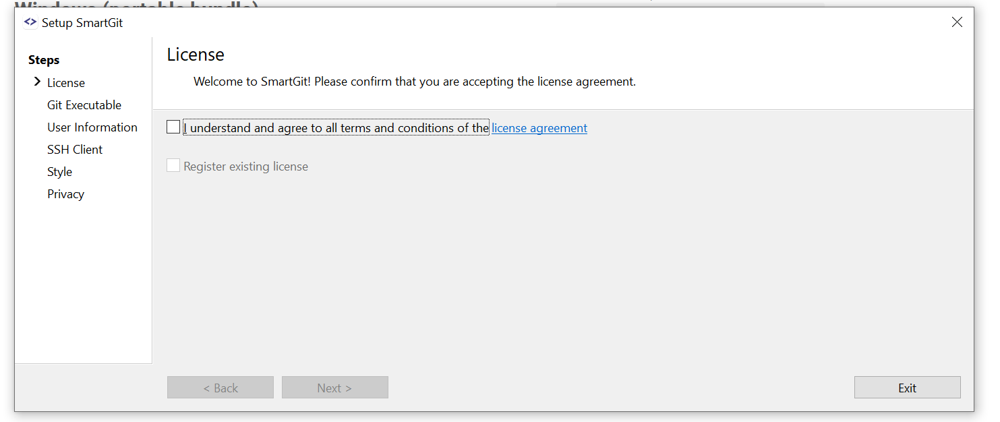

Der erste Monat nach der Installation bietet eine kostenlose Nutzung ohne irgendeinen Nachweis. [Hier](https://www.syntevo.com/register-non-commercial/#academic) könnt Ihr eine *educational license* beantragen. Dafür müsst Ihr nur euren Namen und die studentische Mail-Adresse angeben. Nachdem Ihr eure Mail-Adresse nochmal bestätigt, werdet Ihr ein paar Tage warten müssen. Da wir aber einen Monat kostenlosen Trial haben, können wir trotzdem direkt in die weitere Installation und Arbeit mit **SmartGit** einsteigen. Später werdet Ihr eine Mail mit eurer *educational license* erhalten, in der die Schritte zur Aktivierung genannt sind.

Als nächstes müsst Ihr euch unter *User Information* einen Nutzernamen geben sowie eine E-Mail-Adresse angeben, über die Ihr euer **SmartGit** konfiguriert. Hier könnt Ihr der einfachheitshalber den Nutzernamen und die E-Mail verwenden, die auch bei LIFOS verwendet wird.  

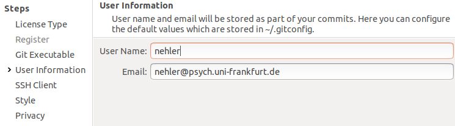

Jetzt müsst Ihr noch die Option *Use SmartGit as SSH client* auswählen. Dies ist für den Start der Arbeit mit **SmartGit** empfohlen. 

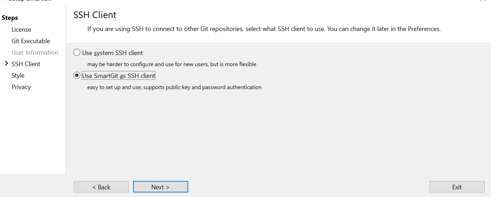

Anschließend werden wir nach dem bevorzugten Style der Oberfläche von **SmartGit** gefragt. Hier gibt es natürlich kein Richtig oder Falsch und es gibt auch nicht direkt eine Empfehlung für Anfänger:innen. Die Ansicht des **Working Tree** wird von uns allerdings als intuitiver eingeschätzt und deshalb verwendet. Wie im Fenster beschrieben, kann diese Einstellung später auch unter *Präferenz* geändert werden. 

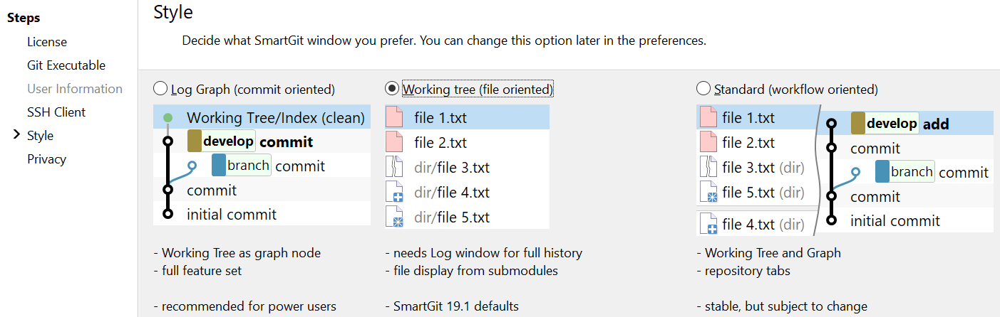

Unter **Privacy** kann man bestimmen, in welchen Fällen Daten an die Ersteller:innen gesendet werden, die diese zur Verbesserung des Programmes nutzen wollen. Hier möchten wir keine Empfehlung aussprechen - man kann nach persönlicher Präferenz auswählen. Außerdem sucht **SmartGit** auf dem Rechner nach initialisierten Repositories und gibt in diesem Fenster die Anzahl an.

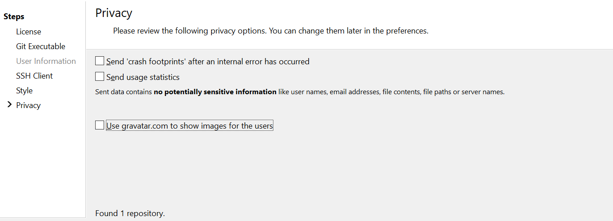

Jetzt ist die Installation abgeschlossen.

# LIFOS und **SmartGit** verbinden

Wir gehen hier davon aus, dass Ihr euer Projekt auf LIFOS schon erstellt habt. Wir werden jetzt eine Verbindung zwischen dem Projekt online und eurem lokalen Rechner schaffen. 

Zuerst solltet Ihr euch auf der Seite des Projekts befinden, wobei nun oben zwei Warnungen angezeigt werden sollten:

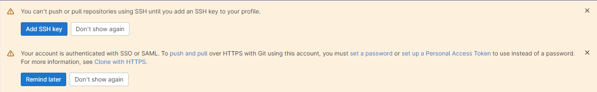

Uns interessiert hierbei die untere Warnung. Klickt dabei auf *set a password*. Im Anschluss muss auf der Seite, zu der Ihr geleitet werdet ein neues Passwort gesetzt werden. Dieses Passwort wird nachher für die Verbindung über SmartGit genutzt, es ist nicht relevant für die Anmeldung auf Gitlab selbst, dort werden weiterhin die HRZ-Logindaten entegegengenommen. Solltest du aus Versehen die Warnung permanent abgeschaltet hast, kannst du stattdessen [diesen Link](https://lifos.uni-frankfurt.de/-/profile/password/edit) nutzen.

Nun benötigen wir euren Benutzernamen, Passwort und den HTTPS-Link zu eurem Projekt. Das Passwort habt Ihr gerade erstellt. Den Link findet Ihr, wenn Ihr auf der Projektseite auf *Clone* geht und dann unter *Clone with HTTPS* den Link kopiert. 

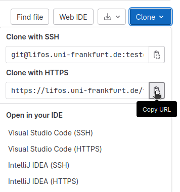

Den Benutzernamen, den Ihr benötigt, findet Ihr mit einem Klick auf euren Avatar oben rechts. Der Benutzername ist der, der mit "@" beginnt. Das "@" selbst ist jedoch nicht Teil des Benutzernamens!

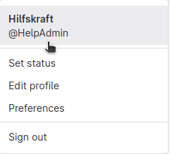

Jetzt wechseln wir wieder zu **SmartGit**. Hier gehen wir unter *Repository* auf *Clone*. 

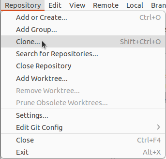

Nun geben wir unter "Repository URL" den Link ein, den wir oben kopiert haben und klicken *Next*. 

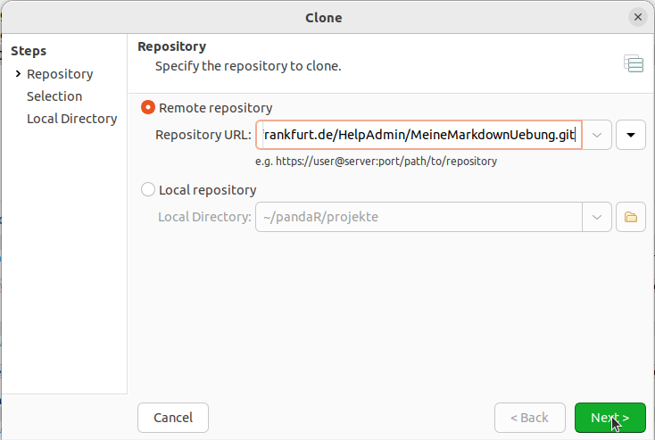

Auf der folgenden Seite übernehmen wir die Voreinstellungen und klicken wieder auf *Next*. 

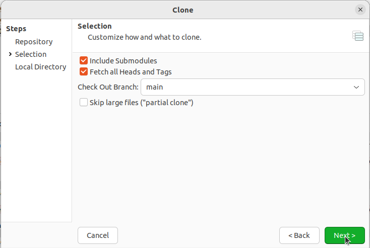

Auf der letzten Seite müssen wir noch einen lokalen Ordner initiieren, der als lokale Repräsentation des Online-Repositorys dient. 

Zuletzt müssen wir noch den LIFOS Benutzernamen und Passwort eingeben. 

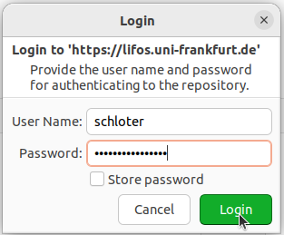

Nun haben wir erfolgreich ein Remote-Repository mit eurem lokalen **SmartGit** verbunden! 

Ob das Verbinden bei euch auch erfolgreich war, merkt Ihr erstens daran, dass keine Fehlermeldung ausgegeben wurde und bei **SmartGit** ein neues Repository aufgetaucht ist. 

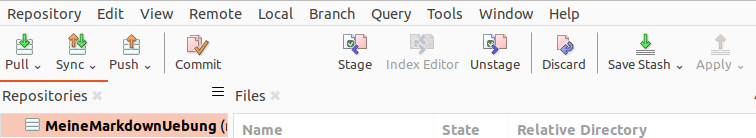

# Basics

Nach der erfolgreichen Installation von **SmartGit** und dem Verbinden mit LIFOS, geht es jetzt ans Benutzen. Dafür müsst Ihr allerdings, die wichtigsten Begriffe kennen: 

- "Commit": Einen Commit könnt Ihr immer dann tätigen, wenn Ihr etwas an einer Datei geändert habt und diese Änderung beibehalten wollt, euch also sicher seid, dass Ihr diese Änderung so überall übernehmen wollt. Anhand der Commits kann man Änderungen an der Datei nachverfolgen. `

- "pull" und "push": Wenn Ihr einen Commit getätigt habt, muss dieser noch in euer nicht-lokales Repository übernommen werden. Das geschieht mit "push" - Ihr "schiebt" die Änderungen von eurem lokalen Verzechnis auf das dazugehörige Online-Verzeichnis. Bei einem "Pull" dagegen, zieht Ihr euch alle Änderungen, die evtl. getätigt wurden (auch von Personen, die an eurem Projekt mitarbeiten) auf euren lokalen Ordner. **Es ist wichtig, dass Ihr immer einen _Pull_ durchführt, bevor Ihr anfangt zu arbeiten, da es sonst zu Komplikationen kommen kann.** 

Um genaueres über **Git** und alle zugehörigen Befehle und Aktionen zu erfahren, schaut euch [dieses](https://pandar.netlify.app/post/gitintro#basics) Tutorial an. 
<!-- Link muss erneuert werden-->
### Benutzeroberfläche

Zur Orientierung schauen wir uns natürlich die Oberfläche von **SmartGit** genauer an. Diese haben wir durch die Auswahl eines bestimmten Styles hergestellt.

In der oberen Zeile befinden sich zunächst Symbole mit den Begriffen *pull* und *commit*. Diese werden wir gleich brauchen. Auf der linken Seite sehen wir unser Repository - theoretisch können das so viele sein, wie Ihr an Projekten beteiligt seid. Wenn Ihr dem Tutorial Stück für Stück bis hierhin gefolgt seid, sollte euer LIFOS-Projekt-Repository hier erscheinen. Darunter sehen wir die verschiedenen **Branches** eines Projekts - was das ist, könnt Ihr [hier](https://pandar.netlify.app/post/branches/) nachlesen. 
<!-- Link muss erneuert werden -->
In der Mitte des Bildschirms sehen wir die Kachel **Files**. Hierin werden alle Dateien angezeigt, die entweder noch nicht getracked werden, verändert, gelöscht oder umbenannt wurden. 

In der Kachel **Changes** werden die Veränderungen an einer Datei angezeigt, wenn Sie unter **Files** ausgewählt ist. In der Kachel **Journal** sind alle `commits` der Historie aufgeführt. 

Um die Arbeit mit **SmartGit** zu simulieren, müssen wir Änderungen an den Dateien in unserem Ordner vornehmen oder neue erstellen. Dafür öffnen wir zunächst unseren getrackten Ordner. Je nach Template werden hier schon unterschiedliche Dateien auftauchen, die lokal auf euren Rechner gekloned wurden. 

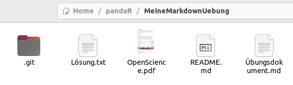

Wir werden hier jetzt eine Änderung an der Datei "README.md" vornehmen, da diese bei jedem Template enthalten ist. Ihr könnt in der Datei zu Veranschauungszwecken einfach einen Satz hinzufügen und dann speichern.

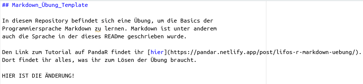

Durch die Änderung der Datei erscheint diese nun in **SmartGit** in der Kachel **Files**.  Danaben steht, dass diese Datei "Modified" ist, d.h. für diese Datei muss noch ein *Commit* und ein *Push* durchgeführt werden, um die Änderungen auch online sichtbar zu machen. 

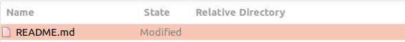

### `Commit`

Nun, da wir eine Datei verändert (oder hinzugefügt) haben, wollen wir diese Änderung natürlich auch committen. Dazu wählen wir in der **Files**-Kachel mit einem Linksklick alle Dateien aus, die im nächsten `commit` enthalten sein sollen (bei der Auswahl mehrere Dateien wie üblich *strg* gedrückt halten). Anschließend wählen wir in der Werkzeuge-Leiste `commit` aus. 

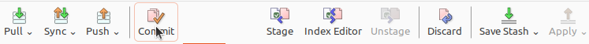

Es öffnet sich das `commit`-Fenster, in dem nochmal angezeigt wird, welche Dateien wir ausgewählt haben. Weiterhin müssen wir eine passende Message zu unserem `commit` hinzufügen, wie "Update README".

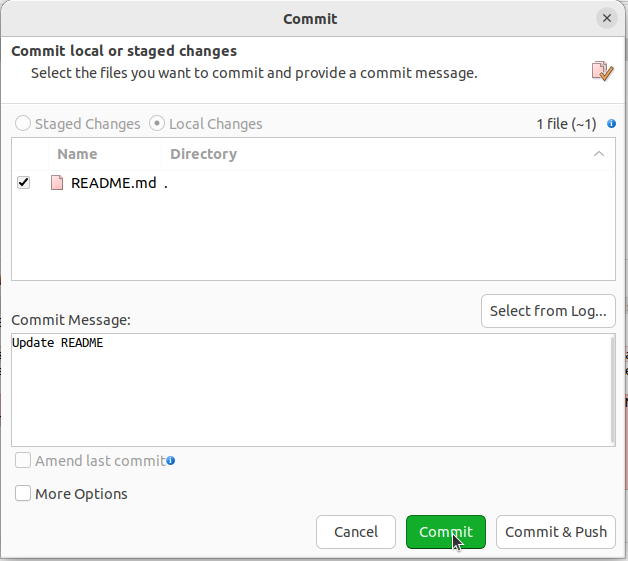

Wenn die Nachricht verfasst ist, reicht ein Klick auf *Commit* und die Änderungen wurden angenommen. Lokal sind sie also getracked. Alternativ könnte man hier auch auf *Commit & Push* klicken, dann wird unser lokaler Ordner direkt auf **LIFOS** gepushed. Dies kann man machen, wenn man sich seiner Änderungen sicher ist. Nur `commit` ist dabei empfehlenswert, wenn man sich unsicher ist und nochmal weiter an den Änderungen arbeiten will - oder für den Fall, dass wir noch weitere Änderungen an anderen Dateien unseres Projekts vornehmen wollen. Aus Demonstrationszwecken drücken wir auf *Commit*. Wenn Ihr auf **SmartGit** die Kachel **Journal** betrachtet, ist dieser `commit` zwar im **mainr** enthalten, aber nicht im **origin**. Dies spricht dafür, dass die Änderung im **remote repository** noch angestoßen werden muss. Dies können wir mit einem `push` machen. 

### `Push` & `Pull`

Ein einfacher Klick auf *Push* reicht bei **SmartGit**, um das Projekt auch online zu tracken. Zunächst öffnet sich ein Fenster, in dem wir diese Aktion nochmals bestätigen. 

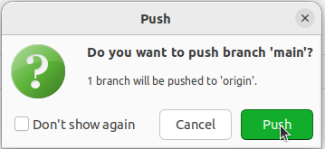

Je nach Version von **SmartGit** und Betriebssystem kann es jetzt sein, dass wir nach einem **Master Password** gefragt werden. Man kann dieses zwar auch überspringen, aber es ist wichtig für den Schutz von Dateien in der Interaktion mit Servern und auch praktisch (besonders wenn wir neben **GitLab** auch noch **GitHub** oder ähnliches verwenden). Daher empfehlen wir dringend eine Festlegung. In der Interaktion mit LIFOS wird für euch das nur bedeuten, dass Ihr in **SmartGit** auch nach dem Master Password gefragt werden. Am besten verwendet Ihr hier auch nicht das gleiche Passwort, welches Ihr für den LIFOS-Server benutzt. 

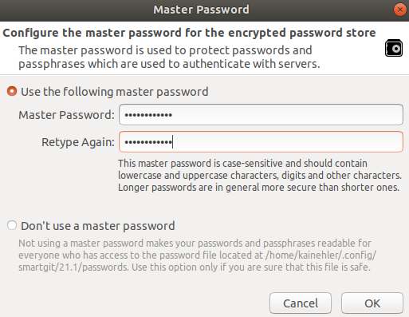

Einmal muss die Rechtmäßigkeit des Zugriffs auf den Server nun aber mit eurem LIFOS-Login bestätigt werden. <!--Hier gibt es nun zwei Möglichkeiten.
Entweder Ihr generiert einen Personal Access Token (PAT), wie man das machen kann, könnt Ihr im Tutorial zu [GitHub](/post/github/#personalaccesstoken) nachlesen. Das ist vor allem praktisch, wenn Ihr die Verbindung zum LIFOS-Server an unterschiedlichen Geräten benutzt.  Oder Ihr generiert einen Application Programming Interface (API) Token, der mehr Sinn macht, wenn Ihr mehrere Provider habt, von denen Ihr aus **SmartGit** aus zugreifen wollt.  

Application Programming Interface

Damit wir nicht jedes Mal unseren PAT eingeben müssen, aktivieren wir den Zugang über das **Master Password**. Dafür wählen wir in der obersten Zeile *Edit* aus und wählen darin *Preferences* aus.

Hier gehen wir in der Auswahl auf *Hosting Providers* und drücken dann rechts auf *Add*.

 

Hier muss **GitLab** ausgewählt werden, da LIFOS darauf basiert. Wir wollen nun einen **Token** erstellen. Dafür müssen wir den Button *Generate* drücken. Der Browser sollte sich automatisch öffnen und einen Login zu **GitHub** erfordern. Sobald wir diese Informationen eingegeben haben, wird ein Token generiert. Diesen kopieren wir dann in das entsprechende Fenster in **SmartGit** und klicken auf *Authenticate*.

Wir gelangen zurück in das Fenster, wo wir den Token erstellt haben, und klicken auf *Add*. Damit erscheint nun im Fenster der Hosting Providers unser **GitHub**-Account und wir können auf *OK* klicken. 

 -->

Danach fragt euch **SmartGit** nochmal nach eurem **Master Password**, das Ihr etwas weiter oben festgelegt habt. 

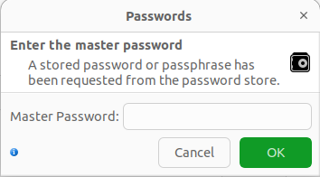

Nach dessen Eingabe wird der `push` durchgeführt. Um einen optischen Indikator dafür zu haben, könnt Ihr euer Repository auf der LIFOS öffnen. Weiterhin sind man auch in der Kachel **Journal**, dass **_origin_** und **_main_** nun wieder auf derselben Höhe des neuen `commits` sind.

Beachtet, dass der Vorgang von `push` wirklich simpel über den Klick funktioniert hat. Die Umstellungen für das "Passwort" mussten wir jetzt nur einmal vornehmen. Ähnlich einfach ist der Vorgang, um unsere lokale Kopie des Repositories auf die Version auf LIFOS zu aktualisieren. Auch hier können wir den Button in der Werkzeug-Leiste nutzen. Nach dem Klick auf *Pull* geht ein Fenster auf, indem man zwischen `Rebase` und `Merge` wählen kann - diese Begriffe sind beide noch unbekannt und wir bleiben bei der Standardeinstellung. Anschließend erscheint das Fenster *Pull*. Hierin wird die URL vom LIFOS-Repository angezeigt - diese müsste stimmen, könnt Ihr aber gerne kontrollieren. Anschließend klicken wir auf den uns bekannten Befehl `pull`.

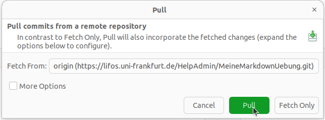

Es erscheint für eine kurze Zeit ein grüner Kasten, in dem steht, dass der `pull` erfolgreich war. Natürlich wurden gerade aber keine Änderungen an Dateien oder Ähnliches vorgenommen, da der Stand lokal und remote identisch war. Wir simulieren die Änderung einer anderen Person an einer Datei durch eine Veränderung in der Online Version, also auf LIFOS. Dafür öffnen wir das Repository auf LIFOS und ändern auch hier etwas an dem "README". Wir löschen zum Beispiel einfach den Satz, den wir gerade hinzugefügt haben. 

Dafür öffnen wir die Datei in der "WebIDE" und löschen den Satz. 

Dann klicken wir unten auf `Commit`. 

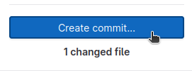

In der `commit`-Nachricht beschreiben wir kurz die durchgeführte Änderung und wählen "Commit to **main** branch" aus. Anschließend klicken wir *Commit* und wechseln zurück auf unsere **SmartGit**- Anwendung. 

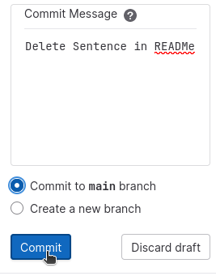

In dieser wählen wir jetzt wieder *Pull* in unserem Projekt-Repository aus. Zunächst scheint nicht viel anderes zu passieren als bei dem vorherigen `pull`. Wenn man allerdings genau hinschaut, sieht man, dass der letzte `commit` nun am unteren Bildschirmrand im **Journal** angezeigt wird.  

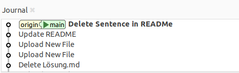

Wenn man die Datei **README.md** lokal auf dem eigenen Rechner anschaut, werden die neuen Inhalte nun auch angezeigt.

#### Änderung des Styles der Oberfläche

Bei der Einrichtung von **SmartGit** haben wir uns für einen Style in der Anzeige unserer Repositories entschieden. Zum Abschluss der Basics des Tutorials wollen wir nun noch kurz betrachten, wie wir diese anfängliche Entscheidung ändern können. Dafür wählt Ihr in der obersten Zeile zunächst *Edit* und dann *Preferences*. Es öffnet sich ein Fenster, indem wir zunächst *User Interface* in der Übersicht links anklicken. Im rechten Fenster gibt es die Auswahl *Prefer*, bei der momentan **Working Tree** angewählt sein sollte. Stattdessen klicken wir nun auf *Log Graph* und bestätigen die Auswahl (es können natürlich noch weitere Änderungen an der Oberfläche hier durchgeführt werden, aber diese werden wir nicht näher betrachten).

Beim Erstellen des Tutorials musste **SmartGit** nun einmal geschlossen und wieder geöffnet werden, damit die Änderungen sichtbar werden. Es ist eine neue Aufteilung in der Oberfläche zu sehen, wobei die Anzeige der *Repositories* und *Branches* auf der linken Seite bestehen bleibt. 

Im zentralen Fenster **Graph** wird der Workflow - also alle `commits`, die jemals an unserem Projekt durchgeführt wurden - angezeigt. Dabei stehen jeweils die Initialien der Person, die den `commit` durchgeführt hat sowie das Änderungsdatum. So können wir auf einen Blick nachvollziehen, wer wann was an unserem Projekt verändert hat. Beachtet auch, dass nun ganz oben der aktuelle Stand eures Repositorys als **Working Tree** angezeigt wird. In diesem wird eine Änderung angezeigt, da die Datei ".Rhistory" weiterhin im Repository existiert, aber noch nicht in einen `commit` einbezogen wurde.

Auf der rechten Seite des Bildschirms sehen wir mittig eine Übersicht über alle unsere Dateien, die wir seit dem letzten `commit` lokal verändert haben - in diesem Falle die `.Rhistory`. Oben rechts werden Informationen über den Account angegeben, der einen `commit` durchgeführt hat. Am unteren Bildschirmrand ist wieder die Übersicht über Änderungen in Dateien von einem `commit` zu einem anderen. Wem diese Übersicht nun besser gefällt, kann die Einstellung so lassen. Für das weitere Tutorial ändern wir die Einstellung wieder in den **Preferences** und starten **SmartGit** wieder neu. 

# Fazit und Ausblick

**SmartGit** erleichtert die Zusammenarbeit in einem Projekt enorm und bietet eine gut ausgearbeitete Benutzeroberfläche. Wir haben einige weitere Befehle kennengelernt, mit denen wir einen guten Arbeitsablauf an gemeinsamen Projekten ermöglichen können. Falls Ihr euch weiter für **SmartGit** und **Git** interessieren solltet, könnt Ihr auf [pandaR](/extras/#git) die anderen Tutorials zu diesen Themen anschauen. 
 