# Einführung  

Nachdem ihr sowohl schon die Basics über LIFOS und <span style="color: darkred;">**GitLab**</span> erfahren habt und auch euer richtiges Template ausgewählt habt, ist es jetzt an der Zeit, dass ihr euer erstes eigenes Projekt erstellt. **Es ist hierbei äußerst wichtig, dass, sofern Ihr eine Abschlussarbeit durchführen wollt, Ihr bereits in der entsprechenden [Gruppe](/lifos/grundlagen/orientierung-lifos/#gruppen) der Abteilung seid bevor ihr euer Projekt erstellt!** 

#### Projekt erstellen

Nochmal zur Erinnerung - die Seite (bevor ihr ein Projekt erstellt), sieht folgendermaßen aus: 

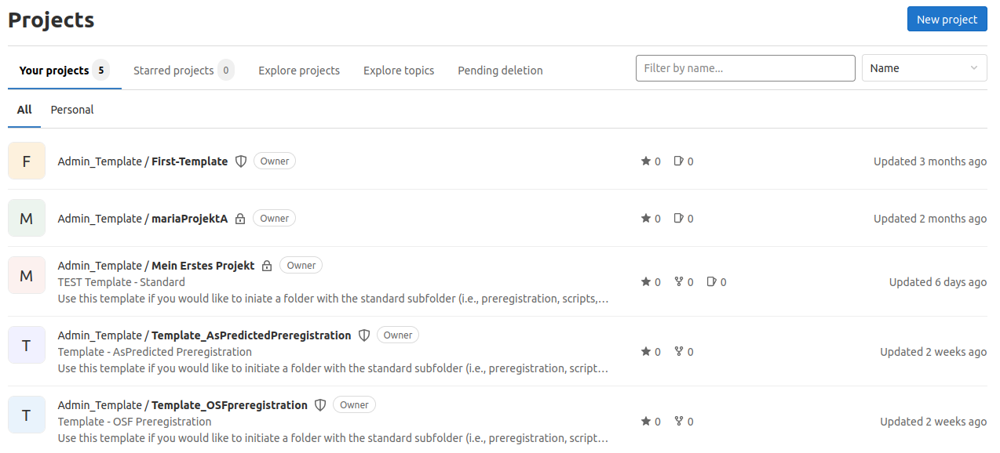

Hier könnt ihr alle möglichen Projekte, zu denen ihr Zugang habt einsehen. Wie ihr schon gelernt habt, stehen unter *Your Projects* alle Projekte in denen ihr involviert seid. Solltet ihr nicht schonmal ein Projekt auf dem Server erstellt haben, wird hier nichts stehen. Unter *Personal* findet ihr eure eigenen Projekte, unter *All* die innerhalb eurer Gruppe und über *Explore* könnt ihr allgemein stöbern.


Um ein Projekt in eurer Gruppe zu erstellen, klickt ihr erstmal oben rechts auf **New Project**. 


##### Auswahloptionen

Danach wird euch eine Seite mit vier Optionen angezeigt: Create blank project, Create from template, import project und Run CI/CD for external repository. Wie in den anderen Tutorials beschrieben, haben wir für euch extra Templates vorbereitet, damit ihr nicht ganz ohne Vorlage in den Prozess starten müsst.

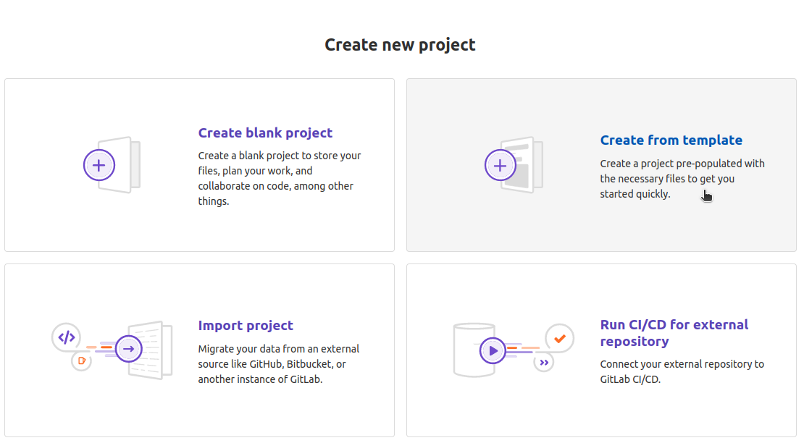 

Daher wählt ihr die Option *Create from template* aus. Um auf die für euch relevanten Templates zu kommen, müsst ihr in folgender Spalte auf **Instance**. Die *Built-in* Templates sind globale Templates, die jedem:r <span style="color: darkred;">**GitLab**</span>-User:in auf jeder Instanz auf der ganzen Welt zur Verfügung stehen. Diese könnt ihr euch ein anderes Mal gerne anschauen oder mit einem Testprojekt erkunden. Aber für euch am wichtigsten sind die Templates, die ihr unter **Instance** findet. 

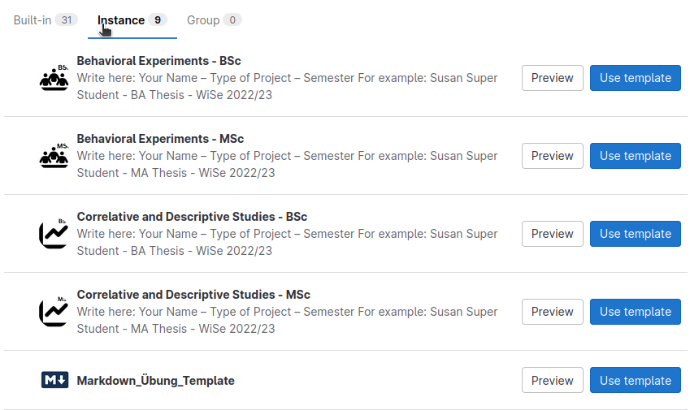 

#### Das Projekt eurer Gruppe zuordnen

Jetzt müsst ihr unter dem Punkt *Project URL* bei *Pick a group or namespace* eure Gruppe suchen. 

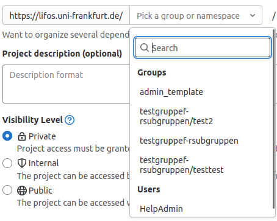 

Dieser Schritt ist sehr wichtig, da das Projekt auf jeden Fall zur richtigen Abteilung zugeordnet werden sollte! Falls ihr noch nicht der Gruppe eurer Abteilung angehört, lest nochmal im [Tutorial zur Orientierung](/lifos/grundlagen/orientierung-lifos) nach.


##### Visibility-Levels

Nachdem ihr das Template ausgewählt habt, das auf euer Vorhaben am besten zutrifft, müsst ihr diesem einen Namen geben. Dieser Projekttitel sollte ausschlaggebend und von inhaltlicher Natur sein. Ein passender Projekttitel wäre zum Beispiel die Überschrift eurer Thesis. Ihr müsst bedenken, dass andere Personen aufgrund des Projekttitels eventuell auf euer Projekt aufmerksam werden und sich dieses anschauen. Deswegen ist ein passender Titel sehr wichtig. Außerdem hättet ihr theoretisch die Möglichkeit das *Visibility-Level* anzupassen. Durch Letzteres wird festgelegt, wer das Projekt und alle zugehörigen Dateien sehen kann. Hier gibt es drei Optionen, von denen wir auch eine deaktiviert haben. Trotzdem wollen wir es kurz erklären. Aber ihr wählt als Standard-Option grundsätzlich immer *internal*. Nur so kann ein Austausch innerhalb des Instituts gewährleistet werden, ohne den Schutzraum der Lernplattform nach außen zu öffnen. Wenn eure Daten der Instanz nicht zur Verfügung stehen sollen, muss der Datenordner leer bleiben, genaueres könnt ihr [hier](/lifos/grundlagen/datenschutz/)<!-- WIP --> nachlesen. 



Wenn ihr diese Option auswählt, können nur die Mitglieder der Gruppe, der das Projekt zugeordnet ist, auf dieses zugreifen. Diese Version wählt ihr höchstens für ein Test-Projekt zum Üben, sonst immer *internal*  



 

Diese Option solltet ihr immer wählen. 

Wählt ihr diese Option, so kann jeder, der Zugangsdaten zu **LIFOS** hat, euer Projekt sehen. So könnte euer Projekt zum Beispiel unter *Explore Projects* für andere zu sehen sein. Wenn eure Datenlage diese Einstellung erlaubt, ist es auf jeden Fall die präferierte Vorgehensweise, denn im Sinne von Open Science soll möglichst viel zugänglich sein. In der Instanz können wir unsere Ideen am besten teilen und ihr könnt zukünftige Studierende mit eurer Arbeit inspirieren.

Falls ihr sehr vertrauliche Daten habt, muss der Ordner für die Daten leer bleiben, da sie sonst von der ganzen Instanz einsehbar sind.





Diese Option könnt ihr bei eurer Projekterstellung gar nicht auswählen, der Vollständigkeit halber haben steht sie hier trotzdem: 

Hier könnte wirklich die ganze Welt euer Projekt sehen, da man auch von außerhalb der **LIFOS**-Seite darauf zugreifen kann. Der geschützte Raum der Übungsplattform wird damit verlassen. Wählt diese Option also nicht oder nur mit Bedacht. Beispielsweise ist das Projekt mit den Nutzungsbedingungen und der Datenschutzerklärung auf **Public** geschaltet, damit man diese Informationen auch vor der Anmeldung einsehen kann. 



Außerdem könnt ihr noch eine Projektbeschreibung hinzufügen. Diese könnt ihr als Studierende bei einem Projekt, das einer Gruppe angehörig ist, nicht mehr selbst bearbeiten. Achtet hier also darauf, dass ihr eine aussagekräftige Beschreibung direkt wählt. Eine nachträgliche Änderung ist nur durch die betreuende Person möglich. 

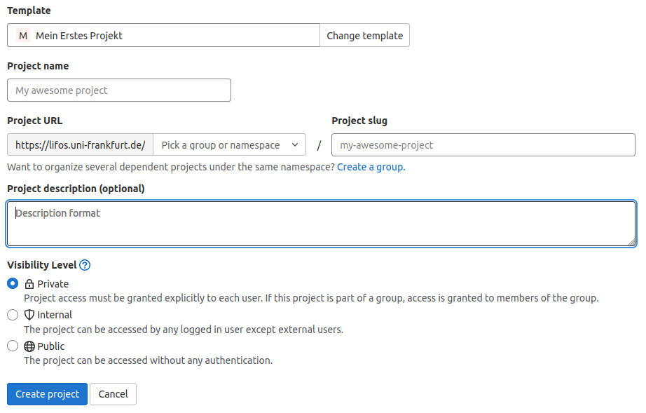

Die Projektbeschreibung soll zur Vereinheitlichung folgendem Muster folgen: Name - Art der Arbeit - Semester oder Jahr. In folgenden Bild seht ihr ein Beispiel: 

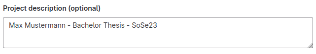

Zum Abschluss müsst ihr nur noch auf *Create Project* klicken und ihr habt euer erstes Projekt erstellt. 

Das ganze sieht dann so aus: 

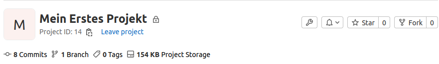 

#### Projekt - Orientierung

Zu allererst ist das README für euch am wichtigsten. Hier sind alle wichtigen Informationen zu dem Template aufgeführt. Ihr findet es, wenn ihr auf eurer Projektseite einfach nur nach unten scrollt. 
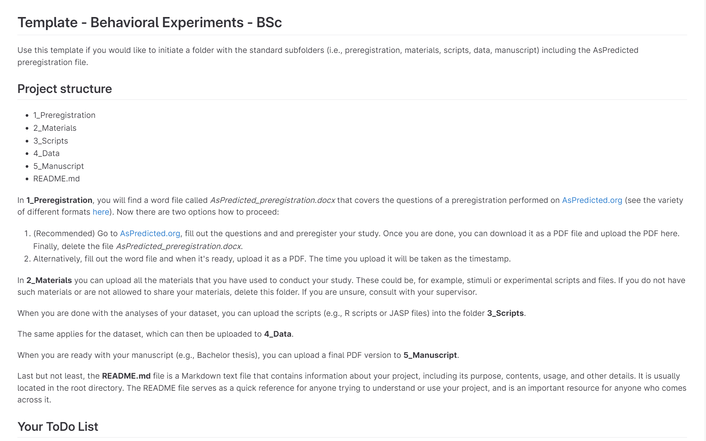

Außerdem findet ihr verschiedene Ordner, die euch eine Orientierung geben sollen, was ihr alles benötigen werdet z.B. Präregistrierung, Skripte etc. Diese sind natürlich noch im Standardformat und nicht gefüllt. Ihr müsst sie dann mit Dateien füllen und ggf. auch modifzieren. 

##### Dateien hochladen

<span style="color:red">**Hinweis**</span>: Wenn ihr eure Daten hochladen wollt, lest euch zuerst unseren [Abschnitt zu Datenschutz](/lifos/grundlagen/datenschutz) durch, um sicherzustellen, dass eure Daten der nötigen Anonymität entsprechen! 

Starten wir zunächst einmal mit der Erklärung, wie man Dateien in das Repository hochlädt. Wir gehen also davon aus, dass ihr auf eurem Rechner eine Datei erstellt oder verändert habt, die nun eurem Projekt hinzugefügt werden soll. Zum Hochladen müsst ihr auf **LIFOS** die Startseite eures Projektes aufrufen und dann auf den Plus-Button klicken. 

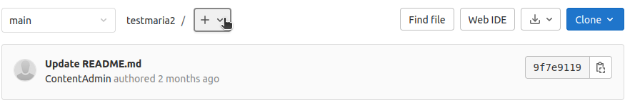 

Es öffnet sich eine Liste mit Optionen. Stellen wir uns nun vor, dass wir die Datei namens "Datenauswertung.R" hochladen wollen. Wir klicken nun einfach auf *Upload File*. Dann könnt ihr die Datei ganz einfach mit Drag-and-Drop Prinzip einfügen. Außerdem werdet ihr aufgefordert eine Commit-Message zu schreiben, damit ihr später wisst, was ihr da überhaupt gemacht habt oder eure Gruppenmitglieder sehen können, was das für eine neue Datei ist. Diese sollte kurz und aussagekräftig sein und den Dateinamen der Datei beeinhalten an der ihr etwas geändert habt, z.B. "Add Datenauswertung.R to 2_Scripts". 



Wie wir bereits beschrieben haben,  ist der LIFOS eine <span style="color: darkred;">**GitLab**</span> Instanz. Hochladen und modifizieren von Dateien wird im <span style="color: darkred;">**Git**</span>-"Universum" in einem `Commit` verarbeitet. <span style="color: darkred;">**GitLab**</span> und <span style="color: darkred;">**Git**</span> verwalten Versionen von Dateien, jede dieser Versionen wird innerhalb eines `Commit` in einem Repository abgelegt - `Commits` beinhalten also quasi eine Kopie der Version der einzelnen Datei. 




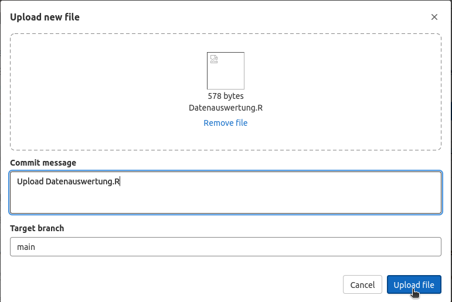 
Zum Abschluss klickt ihr auf *Upload File*. Ihr findet euere Datei jetzt bei der Übersicht eures Projekts wieder: 

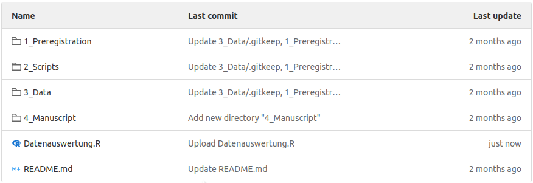 
Ihr könnt aber auch direkt auf <span style="color: darkred;">**GitLab**</span> eine neue Datei erstellen mit *New File*. Hier werdet ihr auch aufgefordert eine Commit-Message zu schreiben aus denselben Gründen, wie oben.

Falls ihr eine Datei direkt in einem Ordner erstellen wollt, müsst ihr den gewünschten Ordner öffnen und dann diesselbe Prozedur, wie oben wiederholen, durchführen. 

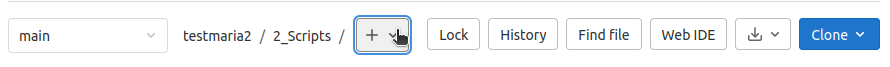 

Wir haben unsere Datei in keinen Ordner hochgeladen, sondern direkt auf die "Startseite" unseres Projektes. Uns fällt im Nachhinein auf, dass die Datei aber eigentlich doch besser in dem Ordner "Scripts" untergebracht hätte werden müssen. Normalerweise würde man die Datei jetzt verschieben, allerdings funktioniert das auf der Browser-Version von <span style="color: darkred;">**GitLab**</span> nicht. Der einzige Weg, die Datei in den Ordner zu bekommen, ist sie zuerst zu löschen und dann wieder hochzuladen. Eine angenehmere Möglichkeit bietet <span style="color: darkred;">**SmartGit**</span>. Mit <span style="color: darkred;">**SmartGit**</span> erleichtert ihr euch die Arbeit mit <span style="color: darkred;">**GitLab**</span> enorm. Nachdem ihr dieses Tutorial zuende gelesen habt (empfohlen!), könnt ihr euch [hier](/lifos/extras/connect-lifos-smartgit) über <span style="color: darkred;">**SmartGit**</span> informieren. 

Falls ihr aus Versehen diesselbe Datei zweimal hochladet, wird euch eine Warnmeldung ausgegeben: 

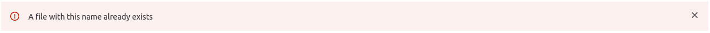

##### Dateien bearbeiten

Wie ihr evtl. schon gemerkt habt, ist nach der Projekt Initiierung neben den ganzen Ordnern auch schon eine Datei eurem Projekt hinzugefügt - das "README.md". Das ist das, was ihr seht, wenn ihr bei eurem Projekt runterscrollt. 

Erstmal steht hier eine Übersicht über die Projektstruktur des jeweiligen Templates und auch eine ToDo-Liste mit den nächsten Schritten für euch. 
In das "README.md" könnt ihr aber auch schon etwas über euer Projekt schreiben, z.B. eine Zusammenfassung oder die Ziele eueres Projekts. 

Um das "README.md" zu bearbeiten klickt ihr auf die Datei. Anschließend öffnet sich ein neues Fenster, hier klickt ihr auf *Open in WebIDE*. 

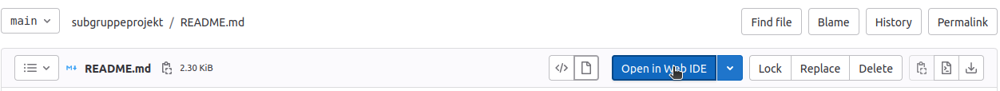

Jetzt öffnet sich die Web IDE und ihr habt die Möglichkeit das "README.md" zu bearbeiten. Aber wie ihr sehen könnt, ist es nicht einfach nur eine Textdatei. Das "README.md" ist in der Sprache Markdown geschrieben - deswegen auch ".md". Lasst euch davon nicht verunsichern! Eine Anleitung zu Markdown findet ihr in diesem Tutorial etwas weiter [unten](#basic-markdown-tutorial) und ihr könnt eure Markdown Fähigkeiten auch in einer [Übung](/lifos/extras/basic-markdown-uebung/) unter Beweis stellen.

Die Web IDE kann allerdings nicht alle Dateiformate anzeigen. Sie funktioniert für .txt, .rmd, .R oder .md, aber versucht man eine Word-Datei oder OpenOffice Datei zu öffnen, klappt das nicht. 

Die alte Version eurer Datei könnt ihr euch unter "History" anzeigen lassen. 

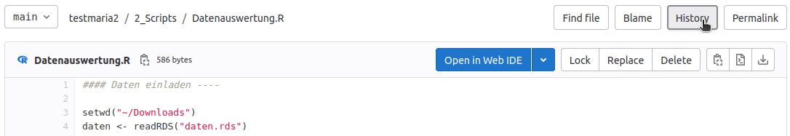

Hier findet ihr alle alten Versionen eurer Datei. 

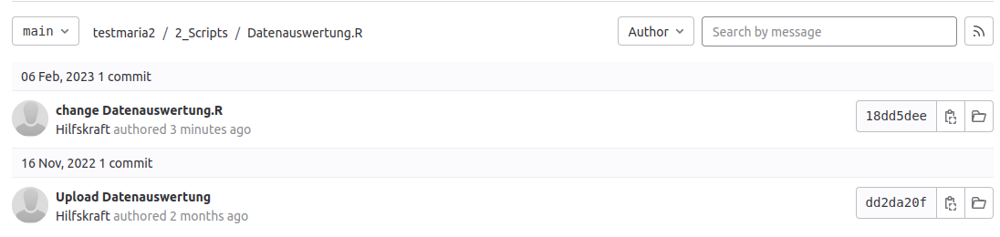

##### Dateien löschen

Um eine Datei zu löschen, klickt ihr auf diese und seht anschließend auch direkt den *Delete*-Button. 

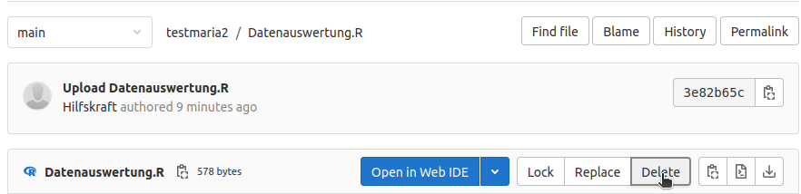
<span style="color: darkred;">**GitLab**</span> fragt euch dann noch nach einer *Commit*-Message für diese Aktion, da es wichtig ist alles zu kommentieren, um es nachvollziehbar zu machen. 

Jetzt können wir die Datei im richtigen Ordner nochmal hochladen: 

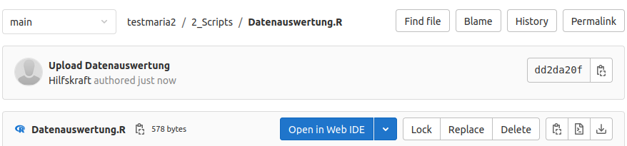

Wie ihr seht befindet sich "Datenauswertung.R" jetzt im richtigen Ordner. 


### Ordnerstruktur ändern

Bei der Erstellung der Templates ist viel Mühe und Feedback eingeflossen, damit ihr beim Auswählen eines Templates direkt alle nötigen Ordner im Projekt finden könnt. Gleichzeitig können wir natürlich nicht garantieren, dass es in jedem Fall hundertprozentig passt. Daher folgt nun noch eine kleine Beschreibung, wie ihr Ordner hinzufügen oder auch löschen könnt.

##### Ordner erstellen

Zur Demonstration erstellen wir nun einen Test-Ordner. Dafür gehen wir auf die Startseite unseres Projektes und auf das "+": 

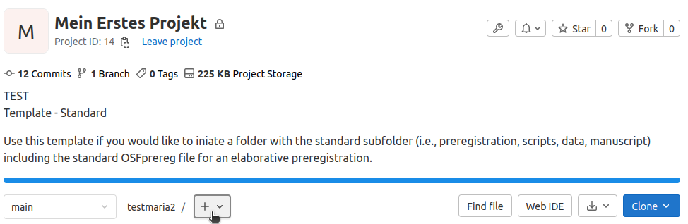

Anschließend öffnet sich eine Toggle-Down Liste bei der wir auf *New Directory* klicken müssen. Directory ist also die Übersetzung von dem uns bekannten Begriff Ordner.

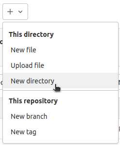

Diesem Ordner gebt ihr nun einen Namen (z.B. "Test-Ordner") und eine passende `Commit`-Message. 

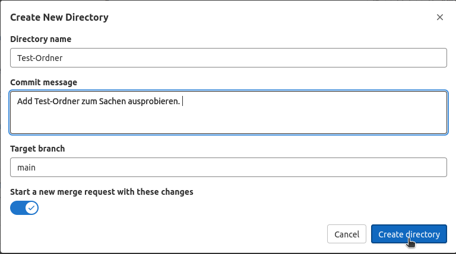

Anschließend müsst ihr auf *Create Directory* gehen und ihr habt einen neuen Ordner erstellt!
Diesen findet ihr auf der Startseite eures Projekts. 

##### Ordner löschen 

Manchmal ist ein Ordner aber auch von Beginn an überflüssig oder es wird mit der Zeit klar, dass dort keine Informationen hinterlegt werden. Für ein aufgeräumtes Projekt wäre es sinnvoll, unnötige Ordner aus der Struktur zu entfernen. Wir zeigen das Vorgehen nun an unserem Test-Ordner. Löschen funktioniert in <span style="color: darkred;">**GitLab**</span> nur, wenn alle Dateien aus dem Ordner gelöscht werden. In unserem Ordner befindet sich gerade nur die ".gitkeep"-Datei. Die ".gitkeep"-Datei ist eine ansonsten leere Datei, die einfach nur da ist, um sonst leere Ordner oder Repositorys weiter existieren zu lassen. Nach der <span style="color: darkred;">**GitLab**</span>-Logik würden leere Ordner sonst direkt gelöscht werden und man müsste schon bei der Initiierung den Ordner mit mindestens einer Datei füllen.

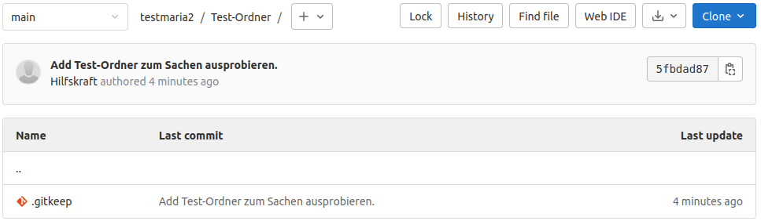

Ihr öffnet den Ordner (falls ihr dies nicht schon getan habt) und klickt auf diese Datei. Anschließend müsst ihr nur noch auf den *Delete*-Button gehen. 

 

Nachdem ihr die letzte Datei in eurem Ordner gelöscht habt (in diesem Fall ".gitkeep"), verschwindet der Ordner automatisch aus eurem Projekt. 
<!-- Muss man gar nichts mehr drücken danach? Heißt die gitkeep Datei ist verantwortlich für den Erhalt des Ordners? Oder geht es auch bei jeder anderen Datei? Ja, genau. Das ist der ganze Zweck der .gitkeep Datei. Wenn man diese natürlich vor einer anderen Datei löscht, .gitkeep somit nicht die letzte Datei ist,  dann verschwindet der Ordner beim Löschen der letzten Datei, die in diesem Ordner existiert. Das habe ich aber nicht ausprobiert, aber nach GitLab-Logik funktioniert das so. -->

### Projekt löschen

Wie wir bereits im Intro zu LIFOS beschrieben haben, ist es für Studierende generell nicht möglich, ein Projekt, das einer Gruppe zugehörig ist, zu löschen. So soll Fehlern vorgebeugt werden. Ist das Löschen dennoch nötig, wendet euch bitte an eure betreuende Person oder auch an den [zentralen Support von LIFOS](mailto:lifos@uni-frankurt.de).

Wie ihr eigene Projekte (also ohne Gruppenzugehörigkeit) löschen könnt ist in dem Tutorial zur vertiefenden Markdown-Übung beschrieben, diese findet ihr [hier](/lifos/extras/basic-markdown-uebung#löschen-eures-projektes). Eine kleine Einleitung in Markdown mit den Beschreibungen der wichtigsten Funktionalitäten folgt aber auch hier schon.

## Basic Markdown Funktionalitäten {#Markdown .anchorheader}


Im Rahmen von **LIFOS** ist Markdown wichtig, da das READme in eurem Projekt damit geschrieben ist/wird. Da das READme euer Projekt vorstellt, ist es wichtig, dass ihr es so ansprechend wie möglich gestalten könnt. Markdown ist eine Auszeichungssprache, die aufgrund ihrer einfachen Syntax recht einfach zu handhaben ist. Ein großer Vorteil dabei ist, dass man eine einfache Textdatei schreibt, die man dann in ganz verschiedene Dokumententypen (bspw. HTML, PDF oder auch MS Word) konvertieren kann. An Markdown Dateien können also Personen auf verschiedenen Betriebssystemen sehr einfach zusammenarbeiten.  Wir zeigen euch zunächst die wichtigsten Schreibweisen, die für euer ReadME relevant sein könnten. Einige der hier geannten Befehle kann man sich auch auf dem [Markdown Cheat Sheet](https://www.markdownguide.org/cheat-sheet/) anschauen.


##### Kursiv- und Fettgedrucktes 

Falls ihr besondere Wörter **hervorheben** wollt, ist es wichtig Kursiv- und Fettgedrucktes zu beherrschen. Das Tutorial wird so aufgebaut sein, dass zuerst immer dasteht, wie das ganze in Markdown aussieht und darunter direkt der Code dafür kommt.

_kursiv_: 
```{r eval = F}
*kursiv*    
```

**fett**: 
```{r eval = F}
**fett**    
```

_Beides geht natürlich auch_ **über mehrere Wörter**: 
```{r eval = F}
*Beides geht natürlich auch* **über mehrere Wörter**      
```

**_und sogar gleichzeitig!_**: 
```{r eval = F}
#Man kann * mit _ bei beiden substituieren! _ verhält sich anders in einem Wort (a_b_c bleibt a_b_c, aber a*b*c macht b kursiv!)
**_und sogar gleichzeitig!_**     
```

##### HEADER

Header sind ganz wichtig für die Formatierung eurer Dokumente, da man durch sie verschiedene Abstufungen in der Datei festlegen kann und Aufmerksamkeit auf einen Abschnitt lenken kann. Es gibt sechs verschiedene Header, die sich in ihrer Größe unterscheiden. 

# Das ist ein Typ 1 Header
```{r eval = F}
# Das ist ein Typ 1 Header     
```

## Typ 2
### Typ 3
#### Typ 4
##### Typ 5
###### Typ 6

```{r eval = F}
## Typ 2
### Typ 3
#### Typ 4
##### Typ 5
###### Typ 6   
```

Wie ihr sehen könnt, unterscheiden sich die Header nur an ihrer Anzahl von #-Tags. Hier ist es wichtig auf das Leerzeichen zwischen #-Tags und eurer Überschrift zu achten, da diese sonst nicht richtig formatiert wird. 

#### Links {.anchorheader}

In diesem Abschnitt werdet ihr lernen, wie man Links zu einer anderen Website erstellt oder
eigene Anker setzt (also zu Text in eurem Dokument verlinkt). 

[Besucht den LIFOS-Server!](https://lifos.uni-frankfurt.de/users/sign_in)
```{r eval = F}
[Besucht den LIFOS-Server!](https://lifos.uni-frankfurt.de/users/sign_in)       
```

In den eckigen Klammern könnt ihr einen kurzen Text verfassen, worauf dieser Link überhaupt führt. Danach kommen die runden Klammern mit dem tatsächlichen Link der Website. 

Das alles kann natürlich auch eingebunden werden in den Text, wenn ihr eine Website wie [LIFOS](https://lifos.uni-frankfurt.de/users/sign_in) erwähnt.

```{r eval = F}
...eine Website wie [LIFOS](https://lifos.uni-frankfurt.de/users/sign_in) erwähnt.       
```

Außerdem interessant: Man kann auch Referenz Links zu anderen Teilen eurer Datei erstellen. 
Ihr könnt so zum Beispiel auf einen bestimmten Abschnitt verweisen, wie zum Beispiel diese [Überschrift](#links). 


```{r eval = F}
...zum Beispiel diese [Überschrift](#links).       
```

In den eckigen Klammern steht wieder auf was genau ihr verweist und in den runden Klammern ein Tag. Überschriften generieren häufig automatisch ein Tag in Markdown, das genau wie die Überschrift heißt. Diese fangen mit einem # an. Man kann diese auch selber erstellen, indem man hinter die Überschrift in eckiger Klammer `{#NameDesTags}` schreibt.

Falls eure Überschrift mehrere Wörter besitzt wie zum Beispiel [Kursiv- und Fettgedrucktes](#kursiv--und-fettgedrucktes), dann müsst ihr sie folgendermaßen verlinken: 

```{r eval = F}
...wie zum Beispiel [Kursiv- und Fettgedrucktes](#kursiv--und-fettgedrucktes)..       
```

`r blogdown::shortcode("intext_anchor", "anchor-point")`
Die Tags sind unabhängig von Groß- und Kleinschreibung, außer ihr nutzt RMarkdown / Pandocs automatische Tags. Zwischen den Wörter steht immer ein "-" wenn das Tag automatisch generiert wird, um Leerzeichen zu ersetzen. Es empfiehlt sich sicherheitshalber Kleinschreibung zu nutzen.

Ihr könnt natürlich auch eigene [Anker](#anchor-point) innerhalb des Texts setzen, indem ihr den HTML-Tag "<a>" mit einem Namens-Attribut (z.B. "anchor-point") benutzt.

```{r eval = F}

<a name="anchor-point"></a>
Unter diesem Ausdruck steht der Text zu dem ihr verlinkt. Dieser kann irgendwo im Dokument stehen. 

Hier steht jetzt der Link-Text: 
...könnt natürlich auch eigene [Anker](#anchor-point) setzen. 

```

Wie ihr seht ist es wichtig auf das Namensattribut (hier: anchor-point) zu achten, v.a. ob es identisch ist, sowohl in eurem Link als auch dem verlinkten Anker. Sonst funktioniert der Link nämlich nicht. 

#### Bilder

Auch Bilder lassen sich mit Markdown einfügen. Das funktioniert ähnlich wie die Links. 

Hier seht ihr ein Bild von süßen Tieren . 

```{r eval = F}
       
```

Der Unterschied zum Link ist, dass hier noch ein "!" vor den ganzen Ausdruck gesetzt wird, gefolgt von einem Text, der beim drüberhovern mit der Maus angezeigt wird, danach kommt der Bildlink. Achtet hier darauf nur Copyright-freie Bilder zu nehmen und gebt die Rechte und Lizenzen an, sofern nötig.

Wenn ihr kein Bild von außerhalb, sondern ein internes Bild verlinken wollt, braucht ihr den Dateipfad zu diesem Bild in euerem Repository. 

```{r eval = F}
     
```

Dieser Bildlink sollte relativ zu dem Ort sein, in dem eure Markdown-Datei liegt (z.B. das ReadMe). 
Sagen wir mal ihr habt das Bild in dem Ordner "3_Data" hochgeladen. Dann wäre der Bildlink folgender: 

```{r eval = F}
     
```

Falls das Bild zusätzlich noch in einem Unterordner "subordner" liegen sollte, wäre der Link folgender: 

```{r eval = F}
     
```

"Image.jpg" ersetzt ihr natürlich mit eurem Dateinamen für das Bild. 

#### Listen

Hier gibt es zwei verschiedene Typen: geordnete und ungeordnete Listen. 

* Das
* hier 
* ist
* ungeordnet.

```{r eval = F}
* Das
* hier 
* ist
* ungeordnet.       
```

1. Das
2. hier 
3. ist
4. geordnet.

```{r eval = F}
1. Das
2. hier 
3. ist
4. geordnet.       
```

Falls ihr eine übersichtlichere oder komplexere Liste mit Einrückungen gestalten wollt, müsst ihr das jeweilige Listenzeichen so weit einrücken, dass es unter dem ersten Buchstaben des Wortes eine Zeile darüber steht.

* Macht
  * aber 
    * nicht zu viele Einrückungen.  

```{r eval = F}
* Macht
  * aber 
    * nicht zu viele Einrückungen.      
```

Das Ganze wird sonst schnell unübersichtlich. 


Wenn ihr eine Übung zum Erstellen eines Dokumentes mit Markdown durchführen wollt, findet ihr [hier](/lifos/extras/basic-markdown-uebung/) dazu eine Anleitung.


### Fazit   

Dieses Tutorial hat euch erklärt wie ihr ein Projekt erstellen könnt, sowie Dateien und Ordner in diesem bearbeiten könnt. Ihr habt aber bestimmt selbst gemerkt, dass es noch viele andere verschiedenen Funktionen und Möglichkeiten gibt mit <span style="color: darkred;">**GitLab**</span> und dem LIFOS-Server zu arbeiten. Außerdem habt ihr die Basics von Markdown gelernt. Um euch die Arbeit mit <span style="color: darkred;">**GitLab**</span> einfacher zu machen, könnt ihr euch das <span style="color: darkred;">**SmartGit**</span> Tutorial anschauen. Dieses findet ihr [hier](/lifos/extras/connect-lifos-smartgit). Eine vertiefende Einführung zu <span style="color: darkred;">**GitLab**</span> ist aktuell noch im Bau. 

