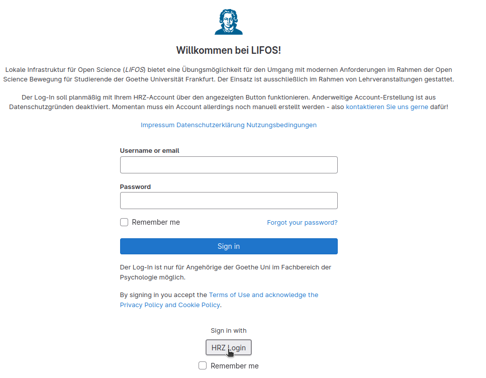
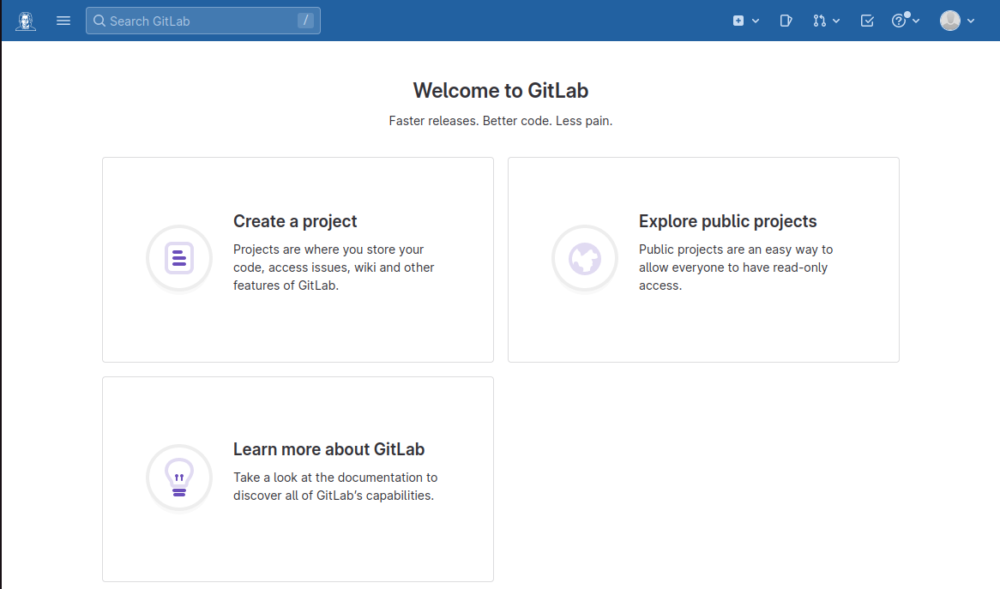
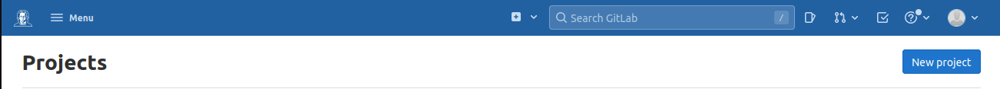
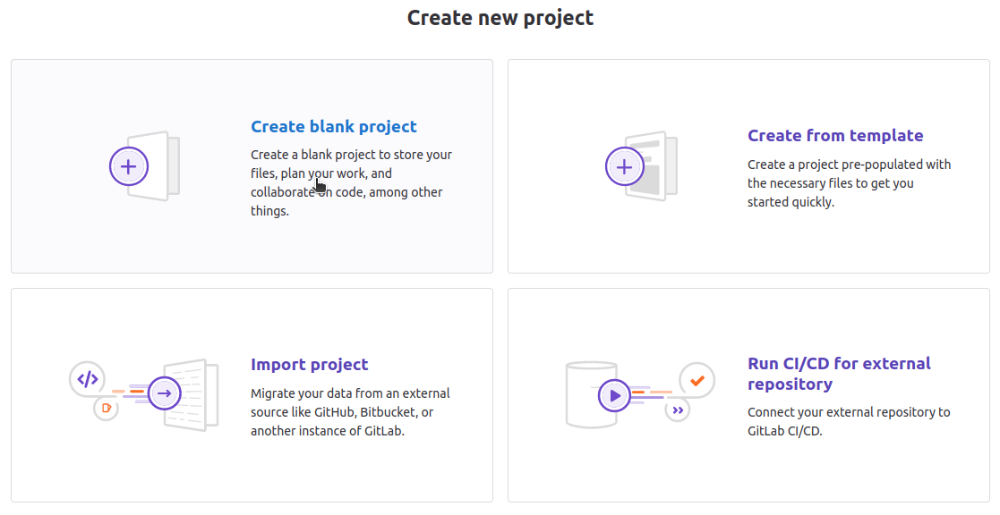
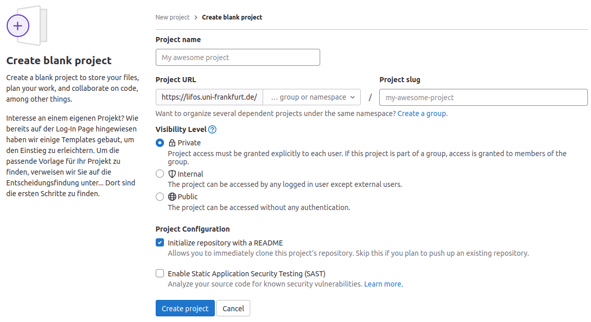
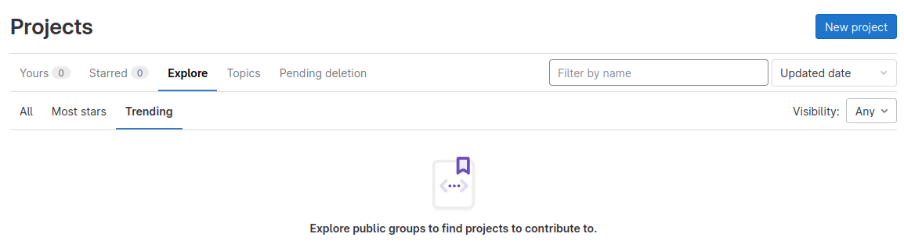
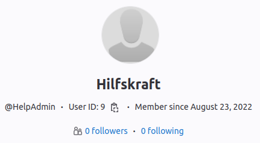
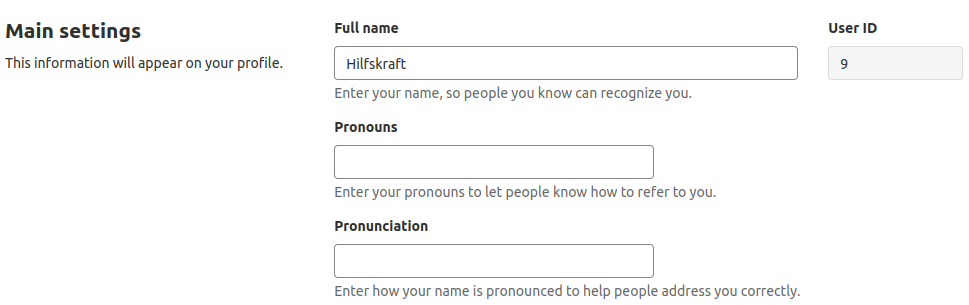
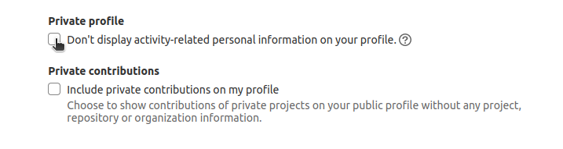
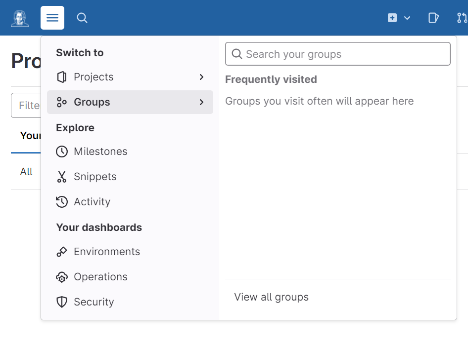

# Einführung    

LIFOS ist eine im Zusammenarbeit mit dem HRZ geschaffene Open Science Infrastruktur, basierend auf GitLab. Diese Infrastruktur enthält diverse Templates, die passend zu eurer jeweiligen Abschluss- oder Projektarbeit erstellt wurden. Templates sollen im Forschungsprozess unterstützen und euch an moderne wissenschaftliche Standards heranführen. Da es eine uni-interne Plattform ist, habt Ihr einen lokalen, geschützten Rahmen, um euch mit dem Open Science Konzept vertraut zu machen und dieses zu üben. Dies bereitet vor auf mögliche Veröffentlichung auf anderen Open Science Plattformen (wie zum Beispiel dem OSF) im späteren Verlauf der wissenschaftlichen Karriere.

### Was ist **GitLab**? 

**GitLab** ist ein Version Control System (VCS), das vollständig auf **Git** basiert und hauptsächlich zur Entwicklung von Software genutzt wird. Hauptaufgabe von VCSs ist die transparente Änderung und Dokumentation von Dateien. Man soll sie zu jeder Zeit nachvollziehen können. Das Konzept der Nachverfolung ist natürlich von einem Open Science Standpunkt aus sehr interessant, da jegliche Änderung an Dateien einsehbar und nachvollziehbar ist, was die Wahrscheinlichkeit von Täuschungsversuchen sehr minimal hält. Ein weiterer Vorteil von **GitLab** ist, dass mehrere Personen zeitgleich an einem Projekt mitwirken können und Änderungen den anderen direkt ersichtlich sind. Im Internet findet man viele verschiedene **GitLab**-Instanzen. Diese sind aber getrennt voneinander anzusehen (nur weil man bei einer Instanz einen Account hat, kann man nicht auf eine andere damit zugreifen). Innerhalb einer solchen Instanz (in unserem Fall die Plattform LIFOS) kann die Sichtbarkeit von Projekten so gesetzt werden, dass sie nur für andere User der Plattform zugreifbar sind. Damit können wir, wie bereits erwähnt, einen gesicherten Übungsraum bieten. 

Aufgrund des sehr technischen Hintergrunds von **GitLab** gibt es vielfältige Möglichkeiten für dessen Nutzung. In den vier bereitgestellten Tutorials unter "Grundlagen" erhaltet Ihr alles, was Ihr zur erfolgreichen Bedienung im Rahmen von Forschungsprojekten wissen müsst. Spezifisch in diesem Tutorial starten wir mit einer Orientierung auf der Oberfläche.

#### Einloggen

Sobald Ihr eure Zugangsdaten bekommen habt, könnt Ihr euch auf dem LIFOS-Server einloggen. Die Oberfläche sieht dann so aus.

 
Wenn Ihr euch zum ersten Mal einloggt, müsst Ihr zum einen noch die Datenschutz- und Nutzungsbedingungen akzeptieren. Diese sind auch in einem [eigenen Projekt](https://lifos.uni-frankfurt.de/root/guidelines/-/tree/main) abgelegt und dadurch stets einsehbar. Zum anderen müsst Ihr noch euren *Attribute Consent* geben. Also, ob es okay für euch ist, dass euer Name und eure studentische Mailadresse an LIFOS weitergeleitet werden. 

#### Startseite

Nachdem Ihr euch eingeloggt habt, kommt Ihr zu der Startseite: 

Wie Ihr hier seht, habt Ihr drei Sachen zur Auswahl. Zum einen **Create a project**, hier könnt Ihr (wer hätte es gedacht) ein Projekt erstellen. In dem unten anschließenden ausklappbaren Abschnitt, zeigen wir euch wie Ihr ein eigenes Projekt - ohne Gruppenzugehörgkeit und Template- erstellen könnt. Das solltet Ihr für eure Arbeit allerdings **nicht** machen, da euer Projekt der Abteilung zugehörig ist unter der Ihr das Projekt erstellt und es schon Vorlagen gibt, die Ihr benutzen sollt. Wie das funktioniert seht Ihr [hier](/lifos/grundlagen/eigenesprojekt/). 

 **Eigenes Projekt erstellen** 

Um ein eigenes Projekt zu erstellen, geht Ihr auf der LIFOS-Startseite rechts auf **New project**.

Anschließend öffnet sich eine Seite auf der Ihr 4 Möglichkeiten vorfindet: 

  

Um ein komplett eigenes Projekt zu erstellen, wählt Ihr *Create Blank Project*.
Hier gebt Ihr dem Projekt einen Namen und stellt das Visibility-Level ein (*internal*). 

Bei der Project-URL ordnet Ihr das Projekt euch selbst zu, indem Ihr einfach euren Usernamen auswählt. Dann braucht Ihr noch ein Project Slug, welches am besten eurem Projektnamen ähneln sollte, da Ihr das Projekt so am besten wiederfindet. 

 
Am Ende klickt Ihr auf *Create Project* und Ihr habt ein eigenes Projekt erstellt - ohne Gruppenzugehörigkeit oder Vorlage. 

Zum anderen befindet sich hier noch **Explore public projects**, auch wieder selbsterklärend. Wenn Ihr hierauf klickt, öffnet sich folgende Seite: 

Direkt unter der großen Überschrift findet Ihr eine Leiste, die euch einen Überblick über verschiedene Arten von Projekten gibt. Unter *Yours* findet Ihr Projekte in denen Ihr involviert seid. Wenn Ihr euch das erste Mal auf **GitLab** eingeloggt habt, wird vermutlich nichts unter "Personal" stehen und Ihr werdet einfach nur wieder auf die Startseite weitergeleitet.
An dieser Stelle wollen wir nur erwähnen, dass Gruppenzugehörigkeiten den Abteilungen zugehörig sind - Ihr gehört also der Abteilung an, der euer/eure Erstbetreuer:in zugeordnet ist.

Erwähnenswert ist auch noch der Reiter *Explore*. Hierunter könnt Ihr euch freigegebene Projekte anderer User:innen anschauen. Falls euch eines dieser Projekte gefällt und Ihr es als Insipiration für euer eigenes Projekt nehmen oder thematisch verfolgen wollt, könnt Ihr dieses liken. Dafür geht Ihr auf das entsprechende Projekt und drückt auf *Star*. 

Wenn Ihr das getan habt und wieder zur Startseite zurückkehrt, indem Ihr links oben auf den Goethe-Button klickt, findet Ihr dieses Projekt unter *Starred* wieder. So könnt Ihr alle Projekte, die euch gefallen, an einem zentralen Ort sammeln und einfach ansteuern. 

Außerdem auf der Startseite enthalten: **Learn more about GitLab**. Wenn Ihr hierauf klickt, werdet Ihr zu den **GitLab**-Docs weitergeleitet. Hier findet Ihr Dokumentationen zu allen möglichen Themen, die die Arbeit mit **GitLab** betreffen. 

#### Profil bearbeiten

Durch die Anmeldung auf LIFOS habt Ihr ein eigenes Profil erstellt. Dieses kann natürlich auch bearbeitet werden. Dafür müsst Ihr oben rechts bei eurem Avatar (das graue Manekin) auf *Edit profile* gehen.  

Hier könnt Ihr unter anderem euer Profilbild, euren Status oder sogar eure Zeitzone ändern. Was eventuell wichtiger ist, sind die Haupteinstellungen (die *Main Settings*). Hier kann man eine Vielzahl an Dingen ändern, die nicht nur eurer Profil betreffen, sondern auch eure Person. So könnt Ihr eure bevorzugten Pronomen eingeben oder auch wie man euren Namen ausspricht. 

Außerdem kann man diverse Profile verlinken (LinkedIn, Twitter, Skype etc.), sowie eine Bio verfassen. 

Anschließend könnt Ihr entscheiden, ob Ihr euer Profil privat machen wollt oder nicht. Falls Ihr euch für ein privates Profil entscheidet, wird folgendes für andere nicht mehr sichtbar: 

- Datum, wann euer Account entstanden ist
- Tabs für Aktivitäten, Gruppen, beigetragende Projekte, persönliche Projekte, favorisierte Projekte oder Snippets. 

Die Einstellung von normalen GitLab Instanzen wäre eine Sichtbarkeit im gesamten Internet. Wir haben jedoch die Privatsphäre-Einstellungen bereits so, dass nur andere Nutzende die Informationen einsehen können. Da der Austausch zwischen diesen genau der Zweck der Plattform ist, ist eine Einstellung als privat nicht nötig.

Zuletzt klickt Ihr noch auf *Update profile settings*, damit eure Änderungen auch gespeichert werden. 

#### Gruppen {.anchorheader}

Accounts auf LIFOS sollten immer mit der Zugehörigkeit zu einer Gruppe (oder auch mehreren Gruppen) versehen sein. Jede Abteilung des Instituts hat dabei eine eigene Gruppe und Ihr sollt der Gruppe angehören, bei der Ihr auch eure Studienarbeit schreibt. Durch den Abschluss mehrerer Studienarbeiten könnt Ihr natürlich mit der Zeit mehrere Gruppenzugehörigkeiten sammeln. Das Eintragen in einer Gruppe ist nicht selbständig möglich, um eine Kontrolle zu behalten. Wendet euch deshalb bitte an eure betreuende Person oder auch an der [zentralen Support von LIFOS](mailto:lifos@uni-frankurt.de) (wobei hier eine Bestätigung der betreuenden Person nötig ist).

Eure Gruppenzugehörigkeit(en) könnt Ihr betrachten, wenn Ihr oben links auf das Menü (drei Striche), dann auf *Groups* und dann auf *View all groups* klickt.

Wir haben bereits gesehen, dass innerhalb einer Gruppe alle Projekte angezeigt werden. Die Logik der Instanz geht aber noch weiter, denn Gruppen auf **GitLab** sind so aufgebaut, dass alle Mitglieder einer Gruppe Dateien in einem Projekt, dass der Gruppe zugehörig ist, ändern könnten. Der große Vorteil der Gruppenlogik ist, dass man nicht kleinlich Berechtigungen für Projekte anpassen muss. Weiterhin bleiben Projekte auch nach dem Ausscheiden von einzelnen Studierenden der Gruppe zugeordnet und können als Inspiration für zukünftige Studierende gelten. 

Solltet Ihr euch nun Sorgen machen, dass jemand an eurem Projekt Änderungen vornimmt, die Ihr nicht wollt, hat die Logik der Plattform folgende Antwort: Erstmal ist die Arbeit an einem Projekt komplett transparent. So könntet Ihr den Namen des Users, der die Änderung vollzogen hat, sehen und zurückverfolgen, was einen Missbrauch sehr unwahrscheinlich macht. Zudem kann man auf jeden Stand von seinem Projekt zurückgehen. Wenn man also mal aus Versehen eine Änderung gemacht hat, kann man diese auch im Projekt rückgängig machen. Generell erhalten Studierende in den Gruppen auch nicht das Recht, Projekte zu löschen, wodurch auch dieser Missbrauch unmöglich ist. 

### Fazit und weiteres Vorgehen   

Das Tutorial sollte einen Einblick in den Hintergrund und die Oberfläche von **LIFOS** geben. Der erste Impuls ist nun die Erstellung eines eigenen Projektes für eure Studienarbeit. Damit Ihr nicht ganz leer in die Erstellung starten müsst, haben wir bereits Templates für verschiedene Situationen erstellt. Im nächsten [Tutorial](#) findet Ihr einen Entscheidungsbaum, anhand dem Ihr das geeignete Template für euch auswählen könnt. 

