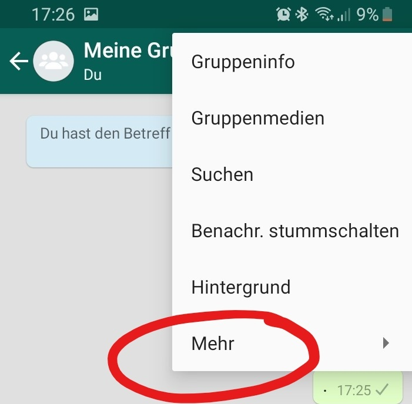

```{r setup, cache = FALSE, include = FALSE, purl = FALSE}
if (exists("figure_path")) {
  knitr::opts_chunk$set(fig.path = figure_path)
}
# Aktuell sollen die global options für die Kompilierung auf den default Einstellungen gelassen werden
```


# Übersicht
  
Als Psychologe wird man oft von anderen Menschen mit Laienpsychologie konfrontiert. Psychologische Weisheiten und angebliche psychologische Tests verbreiten sich heutzutage überall im Netz. Wir wollen uns nun anschauen, wie so ein angeblich psychologischer Test entwickelt wird. Der Test, den wir erstellen möchten, beschäftigt sich mit der Frage: „Wer sind deine wahren Freunde?“, indem er die WhatsApp-Chats mit deinen Freunden analysiert und dir zeigt, wem du am wichtigsten zu sein scheinst.

## Zielsetzung 

In dieser Aufgabe sollst du lernen, Texte zu analysieren; und zwar nicht mehr wie im Deutschunterricht auf Stilmittel, sondern z.B. auf Stimmungen. R kann dir dabei helfen, auffällige Häufigkeiten von Wörtern, Uhrzeiten und auch Stimmungen zu entdecken. Dafür wirst du weiterführende Kenntnisse zur Textanalyse mithilfe von `udpipe` lernen. Außerdem wirst du deine neu erlernten Fähigkeiten für `ggplot` aus [Projekt 2](/projekte/projekt2/google-trends/) und für Loops aus [Projekt 3](/projekte/projekt3/casino/) anwenden können.

## Vorbereitung

Für diese Aufgabe benötigst du die Handyapplikation WhatsApp und einen Gruppenchat mit Freunden oder Bekannten von dir. Diesen kannst du exportieren, indem du an deinem Handy auf deinen Gruppenchat drückst. Oben rechts siehst du drei vertikale Punkte und unter „Mehr“ findest du „Chat exportieren“. Den Chat solltest du zunächst ohne Medien exportieren.





Es sollte sich ein Fenster öffnen, in dem verschiedene Möglichkeiten zum Versenden der Datei angezeigt werden. Du kannst dir den Text beispielsweise per E-Mail schicken, um auch von deinem Computer auf die Datei zugreifen zu können. Lade die Textdatei auf deinen Computer und speichere sie im gleichen Ordner, in dem du auch deine R-Datei speichern möchtest.
Nun hast du eine Textdatei (.txt), in der jede Nachricht mit Name, Datum und Uhrzeit festgehalten ist.

Um den Chat in R einzulesen, brauchst du den folgenden Befehl:
```{r, eval = FALSE}
install.packages('rwhatsapp')
library(rwhatsapp)
raw <- rwa_read('MeineGruppe.txt')
```
Dafür wird ein zusätzliches Paket für das Einlesen von Whatsappchats verwendet. Die Textdatei wird direkt in verschiedene Spalten zerlegt, in denen Uhrzeit, Absender, Nachricht und Emojis stehen.


Zur Analyse werden wir das R-Paket `udpipe` verwenden.
Im folgenden Absatz sind ein paar Links, die du dir zu `udpipe` anschauen kannst. Dort findest du hilfreiche Befehle aus dem Paket. Vielleicht helfen sie dir auch, wenn du in der Aufgabe später nicht weiterkommst.

[Hier](https://towardsdatascience.com/easy-text-analysis-on-abc-news-headlines-b434e6e3b5b8) findest du die Aufbereitung eines Datensatzes mit `udpipe` und ein paar Visualisierungen der Daten. Eine Übersicht zu Befehlen, die du mit `udpipe` verwenden kannst, findest du direkt in der [Dokumentation des Pakets](https://cran.r-project.org/web/packages/udpipe/vignettes/udpipe-annotation.html). Auf [dieser Seite](https://datascienceplus.com/introducing-udpipe-for-easy-natural-language-processing-in-r/) findest du eine sehr umfangreiche Besprechung von Sprachverarbeitung in R - was auch andere Dinge, außer `udpipe`, betrifft.


Bevor du `udpipe` verwenden kannst, musst du es installieren und in der richtigen Sprache laden:
 
```{r, eval = FALSE}
install.packages('udpipe')
library(udpipe)
model <- udpipe_download_model(language = "german")
udpipe_german <-udpipe_load_model(file = dir(pattern = 'udpipe'))

```

Und jetzt kann es losgehen - viel Spaß beim Bearbeiten dieses Projekts.
 
 
# Aufgaben

## Aufgabe 1: Datensammlung und -aufbereitung

Als Datengrundlage musst du, wie gerade beschrieben, einen deiner WhatsApp Chats exportieren und in R einlesen.

Wenn du dir nun den Datensatz anschaust, dann wirst du sehen, dass es in manchen Zeilen keinen Absender und keine Zeitangabe gibt. Das passiert, wenn jemand einen Absatz in seiner Nachricht gemacht hat. 
Um dies zu beheben, müssen wir erst alle Zeilen identifizieren, die dieses Problem aufweisen. Dann musst du die Uhrzeit und den Absender aus der vorherigen Nachricht kopieren und in den ersten beiden Spalten der folgenden Nachricht einfügen.

Es gibt noch zwei weitere Sonderfälle in unserem Datensatz. Das sind zum einen die Fälle, in denen jemand dem Chat beigetreten ist bzw. ihn verlassen hat und zum anderen die ausgeschlossenen Medien. Um den ersten Sonderfall zu bearbeiten, musst du wieder zunächst die entsprechenden Zeilen identifizieren. Das kannst du auf ähnliche Weise wie bei den Absätzen machen (auch in diesen Zeilen gibt es keinen Absender). Dann soll hier aber nichts reinkopiert, sondern die ganze Zeile gelöscht werden. <br/>
Die ausgeschlossenen Medien entsprechen immer der gleichen Benachrichtigung, daher kannst du alle Zeilen, die dieses Muster aufweisen, auswählen und löschen. <br/>
Wenn du dir nun deinen Datensatz anschaust, sollte er keine leeren Zeilen oder Spalten mehr aufweisen. Damit hast du einen großen Schritt geschafft und wir können anfangen, mit dem Datensatz zu arbeiten. 

Falls du von alleine nicht weiterkommen solltest, kannst du dir die **Tipps** anschauen. 

Tipp 1 hilft dir dabei, bei der Datenaufbereitung die Zeilenumbrüche im Datensatz zu beheben:
<details><summary>Tipp 1</summary>

Die Nachrichten mit Zeilenumbrüchen lassen sich identifizieren, indem wir mit `which` zwei Bedingungen verknüpfen. Das geht ganz einfach mit dem '&' Zeichen. Danach kannst du in einer `for` Schleife den Absender und die Uhrzeit aus der vorherigen Nachricht in die Zeilen ohne Absender und Uhrzeit kopieren.

</details>

<br>
In Tipp 2 wird erläutert, wie du mit den ausgeschlossenen Medien umgehen kannst. 
<details><summary>Tipp 2</summary>

Die ausgeschlossenen Medien lassen sich identifizieren, indem mit `grep` die Einträge eines character-Vektors ermittelt werden, die ein bestimmtes Textstück enthalten. 

</details>

<br>
Wenn du fertig mit der Bearbeitung der Aufgabe bist, kannst du einen Blick in die Lösung werfen.
<details><summary>Lösung</summary>

Zunächst muss der Chat eingelesen werden. 
```{r, eval = F}
setwd('...')
install.packages('rwhatsapp')
```
```{r}
library(rwhatsapp)
whatsapp <- rwa_read('MeineGruppe.txt')
```

Wenn du dir nun den Datensatz anschaust (z.B. über `View`) sollten die ersten sechs Zeilen so aussehen:

```{r, echo= F}
head(whatsapp)
```

Wenn es bei dir einige Zeilen gibt, die keinen Absender und keine Uhrzeit haben, liegt das daran, dass jemand einen Absatz in seiner Nachricht hatte. 
Mit `which` werden hier zunächst alle Zeilen identifiziert, die keine Zeit und keinen Absender haben, also in den ersten beiden Spalten keine Einträge haben.
Im zweiten Schritt wird die Zeit und der Absender aus der jeweils darüber stehenden Zeile genommen und in die leeren ersten zwei Spalten eingefügt. Damit wurde eine einzige Nachricht über zwei Zeilen verteilt, was wir für später im Hinterkopf behalten müssen.
Wenn das bei dir nicht vorkommt, kannst du diesen Schritt einfach weglassen.

```{r}
linebreaks <- which(is.na(whatsapp$time) & is.na(whatsapp$author))
for (i in linebreaks) whatsapp[i, 1:2] <- whatsapp[i - 1, 1:2] 
```
 
Der erste der zwei Sonderfälle sind Nachrichten vom System (wenn jemand der Gruppe beigetreten ist oder sie verlassen hat).
Hierfür überschreiben wir unseren Datensatz mit dem gleichen Chat unter Ausschluss der autorenlosen Zeilen. 
Daher ist es wichtig, dass wir im Schritt vorher die Absätze in den Nachrichten bereinigt haben, um diese richtigen Nachrichten nicht zu löschen.
```{r}
whatsapp <- whatsapp[!is.na(whatsapp$author),]
```

Der zweite Sonderfall sind die Medien, die wir beim Exportieren aus Whatsapp ausgeschlossen haben. Mit `grep` können wir diese Nachrichten heraussuchen und durch NA ersetzen. Hier muss nicht die ganze Nachricht angegeben werden, da jede dieser Nachrichten gleich aufgebaut ist.
```{r}
whatsapp$text[grep('<Medien ausgeschlossen', whatsapp$text)] <- NA
```

</details>


## Aufgabe 2: Darstellung

Es ist immer sehr gut, wenn man vor einer Analyse erst eine Vorstellung von den Daten bekommt. Das geht am besten, indem man sie visualisiert.<br/>
Dazu gibt es verschiede Möglichkeiten: Wir können mit den `basic`-Funktionen von R oder mit `ggplot` arbeiten.
Ich habe mir ein paar Diagramme überlegt, die ich für sinnvoll halte, wenn dir aber etwas anderes einfällt, kannst du das gerne ebenfalls umsetzen.

- Wer schreibt am häufigsten?
    - als Kreisdiagramm (`basic`) <br/>
    - als Balkendiagramm (`ggplot`)
     
- Wann schreibt ihr am meisten?
    - über die gesammte Zeit verteilt <br/>
    - über die Woche verteilt (Wochentage) <br/>
    - über den Tag verteilt (Uhrzeiten) <br/>
 
 
Falls du nicht weißt, wie du ein Diagramm über die gesamte Zeit, die Woche oder den Tag erstellst, kannst du dir den folgenden **Tipp** anschauen:
<details><summary>Tipp 1</summary>

Bei dem Diagramm über die gesamte Zeit und über die Tageszeit hast du eine intervallskalierte Variable. Daher kannst du hier ein Histogramm erstellen. Bei den Wochentagen ist das anders, hierbei handelt es sich um eine diskrete nominalskalierte Variable mit sieben Kategorien. Hier musst du mit `geom_bar` ein Balkendiagramm erstellen.

</details>

<br>
Wenn du fertig mit der Bearbeitung der Aufgabenstellung sein solltest, kannst du dein Ergebnis jetzt mit der Lösung vergleichen:
<details><summary>Lösung </summary>

Falls du `ggplot2` noch nicht geladen hast, solltest du es jetzt tun. Falls du dich noch nicht damit beschäftigt hast, wie man mit diesem Paket Grafiken erzeugt, kannst du das z.B. in unserem Crashkurs zu [Grafiken mit ggplot2](/lehre/statistik-ii/grafiken-ggplot2/) nachholen.

```{r}
library('ggplot2')
```

Unser erstes Diagramm ist ein Kreisdiagramm zur Nachrichtenhäufigkeit der einzelnen Personen. Du brauchst hier den Befehl `table` damit du die Häufigkeiten der Personen bekommst. Weil der Autor von `ggplot2` sich vehement weigert, diese Art von Diagramm direkt zu implementieren, nutzen wir hier den R-eigenen Befehl `pie`. Dieser benötigt jedoch als Input eine Häufigkeitstabelle:

```{r}
tab <- table(whatsapp$author)
tab
```


```{r}
pie(tab, col = c("red", "yellow", "green", "violet", "orange", "blue", "pink", "cyan") )
```

Wenn wir ein Diagramm zur Nachrichtenhäufigkeit mit `ggplot` erstellen wollen, müssen wir ein Balkendiagramm benutzten.
```{r}
ggplot(whatsapp, aes(x = author)) +
geom_bar(width = 1 , aes(fill = author))
```

Um ein Histogramm zu erzeugen, das aufzeigt, wann ihr - über die gesamte Zeit - am meisten schreibt, kannst du entweder die Basicfunktion `hist` verwenden oder wieder `ggplot`. Setzte die Balkenbreite so, wie es für dich Sinn macht.

```{r, message = FALSE}
hist(whatsapp$time, breaks = 20, freq = TRUE)
ggplot(whatsapp, aes(x = whatsapp$time))+ geom_histogram()
```

Für die Wochentage erstellen wir erst eine neue Variable, die die Wochentage enthält. Dafür gibt es in R den gesonderten Befehl `weekdays`, der den Wochentag eines Datums ausgibt. Da es wenig Sinn macht, die Wochentage alphabetisch zu sortieren, musst du noch einen Faktor erstellen, in dem du die richtigen Levels zuweist.
Da Wochentage nicht intervallskaliert sind, nutzen wir hier ein Balkendiagramm.

```{r}
whatsapp$Wochentage <- weekdays(whatsapp$time)
whatsapp$Wochentage <- factor(whatsapp$Wochentage, levels = c('Montag','Dienstag', 'Mittwoch', 'Donnerstag', 'Freitag', 'Samstag', 'Sonntag'))
```


```{r}
ggplot(whatsapp, aes(x = Wochentage)) + geom_bar()
```

Für die Uhrzeit erstellen wir erst eine neue Zeitvariable ohne das Datum mittels der Funktion`strftime`, die uns die Stunde (Hour) und die Minute (Minute), in der die Nachricht geschickt wurde, ausgeben soll (`%H:%M`). Leider speichert R die neue Zeitvariable wieder als `Character` ab, sodass du sie nochmal in `POSIXct` umformen musst. Zur Visualisierung benutzen wir hier ein Histogramm.

```{r}
whatsapp$uhrzeit <- strftime(whatsapp$time, format = '%H:%M')
whatsapp$uhrzeit <- as.POSIXct(whatsapp$uhrzeit, format = '%H:%M')
ggplot(whatsapp, aes(x = whatsapp$uhrzeit))+ geom_histogram(bins = 10, color = 'white') +
  xlab('Zeit')+ ylab('Nachrichten') + geom_freqpoly(bins = 10) + scale_x_datetime(date_labels = '%H:%M')
```

</details>


## Aufgabe 3: Zeitanalyse
 
Im ersten Schritt unserer Analyse schauen wir, wer am schnellsten antwortet. Dafür vergleichen wir die zentrale Tendenz der Antwortzeiten aller Personen.
Für die Antwortzeiten wird von jeder Uhrzeit die Uhrzeit der darauffolgenden Nachricht abgezogen. 
Wenn du dir die Antwortzeiten anschaust, fällt dir dann etwas auf? <br/>
Wie du vielleicht von der Datenaufbereitung noch im Hinterkopf hast, werden aus Nachrichten mit einem Zeilenumbruch zwei Nachrichten in unserem Datensatz. Daher müssen wir alle Nachrichten ausschließen, bei denen Absender und Beantworter gleich sind. <br/>
Weiterhin musst du dir überlegen, welches Maß der zentralen Tendenz das sinnvollste ist.

Für unseren Freundetest erstellen wir nun eine neue Tabelle, in der wir Punkte vergeben. In dieser Tabelle müssen die Namen aller Teilnehmenden und das Ergebnis der Zeitanalyse stehen. Für die Punktevergaben gibt es einen einfachen Befehl, der deinen Freunden einen Rang zuordnet.
 
 
Falls du von alleine nicht weiterkommen solltest, kannst du dir die folgenden **Tipps** anschauen:

Bei der Zeitanalyse soll die Differenz aus zwei Uhrzeiten gebildet werden. Tipp 1 zeigt dir wie:
<details><summary>Tipp 1</summary>

Um die Uhrzeiten möglichst einfach subtrahieren zu können, bringen wir die Zeiten und beide Autoren in eine Zeile. Das bedeutet, dass wir zwei neue Spalten an unseren Datensatz hängen, in denen wir die Uhrzeit und den Absender der folgenden Nachricht speichern.

</details>

<br>
Tipp 2 zeigt dir, wie du die Nachrichten ausschließen kannst, in denen Absender und Beantworter gleich sind.
<details><summary>Tipp 2</summary>

Zunächst musst du diese Fälle identifizieren und in einer neuen Variable speichern. Anschließend kannst du mithilfe einer `for` Schleife diesen Fällen in den beiden neuen Spalten (Absender und Zeit der folgenden Nachricht; siehe Tipp 1) NA zuweisen.

</details>

<br>
Welches Maß der zentralen Tendenz du am besten für die Antwortzeit verwendest, zeigt dir Tipp 3.
<details><summary>Tipp 3</summary>

Wir haben keine Werte kleiner null, aber sehr starke Ausreißer nach oben. Daher ist es am sinnvollsten den Median zu benutzen, da dieser sehr robust gegenüber Ausreißern ist.
Mit `tapply` kannst du ihn direkt auf alle Personen gleichzeitig anwenden.

</details>

<br>
Hier gibt es einen Tipp 4, wie du am besten mit der Punktevergabe für unsere Freundschaftsanalyse umgehst.
<details><summary>Tipp 4</summary>

Für die Punktevergabe gibt es den Befehl `rank`. Beachte in welche Richtung die Punkte vergeben werden: Hier kriegt der mit dem kleinsten Median den Wert 1. 

</details>

<br>
Wenn du fertig mit der Bearbeitung der Aufgabenstellung sein solltest, kannst du dein Ergebnis jetzt mit der Lösung vergleichen. Wie auch bei den ersten Teilen (und eigentlich immer bei `R`) gilt, dass es mehrere Wege zum gleichen Ziel geben kann:
<details><summary>Lösung </summary>

Wir haben uns hier einen zweiten Datensatz erstellt, damit wir zur Not einen weiteren formatierten Datensatz zur Verfügung haben. Damit vermeiden wir, dass wir von Anfang an alles neu einlesen müssen, wenn das Verändern des Datensatzes schief läuft. Das ist generell auch für die Zukunft immer eine gute Idee, wenn du etwas an deinem Datensatz verändern willst, dir aber nicht ganz sicher bist, wie es geht.
```{r}
whatsapp_new <- whatsapp
```
Wir wollen nun schauen, wer im Chat am schnellsten antwortet. Am einfachsten ist es, etwas zu analysieren, was in der gleichen Zeile steht. Daher erstellen wir eine neue Spalte und fügen jeweils die Zeit aus der darunter stehenden Zeile ein.
```{r}
whatsapp_new$response <- NA
whatsapp_new$response <-c(whatsapp_new$time[2:nrow(whatsapp_new)], NA)
```
Im zweiten Schritt können wir dann beide Zeiten voneinander subtrahieren und haben unsere Antwortzeit.
```{r}
whatsapp_new$antwortzeit <- whatsapp_new$response - whatsapp_new$time
```


Das gleiche machen wir auch mit dem Absender der Antwortnachricht, da wir sonst nicht zuordnen können, wer hier wie schnell geantwortet hat. Wie ihr später noch feststellen werdet, ist es dabei wichtig, dass wir den Absender als Faktor vorliegen haben.
```{r}
whatsapp_new$antworter <- NA
whatsapp_new$antworter <-c(as.character(whatsapp_new$author[2:nrow(whatsapp_new)]), NA)
whatsapp_new$antworter <- as.factor(whatsapp_new$antworter)
```

Wie du dir hoffentlich gemerkt hast, gibt es mehrere Zeilen hintereinander, die eigentlich zur gleichen Nachricht gehören und es gibt auch Personen, die ihre Antwort generell in zwei Nachrichten und nicht in einer verfassen. Daher müssen wir die ausschließen, die "sich selbst antworten". Dafür identifizieren wir zunächst jene Zeilen, die den gleichen Absender und Beantworter haben. Danach können wir in diesen Zeilen die Einträge in den zwei Spalten `antwortzeit` und `antworter` durch NA ersetzen.
```{r}
gleich <- which(whatsapp_new$antworter == whatsapp_new$author)
for (i in gleich) {
  whatsapp_new[i,]$antwortzeit <- NA
  whatsapp_new[i,]$antworter <- NA
  }
```

Nun musst du dir überlegen, welches das sinnvollste Maß der zentralen Tendenz in diesem Fall ist. Bei Betrachtung des Datensatzes sieht man, dass manche Antwortzeiten extrem hoch sind. Das kann daran liegen, dass erst am nächsten Tag geantwortet wurde, oder dass das Gespräch beendet und erst nach 2 Tagen ein neues angefangen wurde. Daher ist es am sinnvollsten, den Median zu nutzen, da dieser am robustesten gegenüber Ausreißern ist.
Mit `tapply` kannst du ein bestimmtes Maß auf die ganze Tabelle anwenden.
```{r}
zeit <- tapply(whatsapp_new$antwortzeit, whatsapp_new$antworter, median)
```

Um am Ende ein Ergebnis zu bekommen, wer nun wirklich die beste Freundin/der beste Freund ist, brauchen wir ein Punkte-System. Hierfür erstellen wir eine Tabelle mit den Namen aller Chatmitglieder und fügen die Zeit ein. Im zweiten Schritt erhält jeder Punkte, je nachdem auf welchem Platz er sich befindet. Dafür gibt es den Befehl `rank`, der die Punktevergabe automatisch durchführt.
```{r}
tab <- data.frame(levels(whatsapp$author), zeit)
tab$Punkte <- rank(tab$zeit)
```

```{r, echo = F}
tab
```

</details>


## Aufgabe 4: Stimmungsanalyse

Für die Stimmungsanalyse benötigen wir zwei Pakete: `udpipe` und `ggplot2`, wie in der Vorbereitung schon beschrieben. `Udpipe` ermöglicht es, Sprache in ihre Einzelteile zerlegen und in ein einheitliches Datenformat umwandeln zu können. Im Anschluss können wir diese Einzelteile (und damit den Text, aus dem sie kommen) auf ihre Emotionalität (*Sentiment*) analysieren. In unserem Beispiel benutzen wir dafür [Sentistrength](http://sentistrength.wlv.ac.uk) (z.B. Thelwall & Buckley, 2013), ein Ansatz in dem jedes Wort in einem Wörterbuch nachgeschlagen wird, um zu sehen, wie emotional geladen es ist. Wenn du es mit einem Beispielsatz ausprobieren willst, kannst du es [hier](http://sentistrength.wlv.ac.uk/#Non-English) mit dem "Detect Sentiment in German"-Button mal ausprobieren. Dieses Vorgehen werden wir auf den gesamten WhatsApp-Chat anwenden.


Damit das möglich ist, musst du die drei passenden, im folgenden aufgelisteten Tabellen für unsere Analyse in R einlesen. <br/>
**Tipp**: Schau dir eine Datei vor dem Einlesen immer an - welche Trennzeichen sind vorhanden und gibt es eine Überschrift der Spalten?


Bei der ersten Datei [„EmotionLookupTable“ <i class="fas fa-download"></i>](../EmotionLookupTable.txt) handelt es sich um eine Liste von Wörtern, welche einen Score haben, der aussagt, wie stark positiv oder negativ die Bedeutung des Wortes ist. Zum Beispiel hat das Wort „grausam“ einen Score von -4, weil es sehr stark negativ geprägt ist. Im Gegensatz dazu hat das Wort „Niederlage“ einen Score von -1, weil es zwar negativ geprägt ist, aber nicht in dem gleichen Ausmaß wie „grausam“. 

In der zweiten Liste [„BoosterWordList“ <i class="fas fa-download"></i>](../BoosterWordList.txt) befinden sich sogenannte Verstärker. Auch hier wird jedem Wort ein Score zwischen -1 und 2 zugewiesen . Dabei bedeutet -1, dass es sich um einen Abschwächer handelt. Die positiven Zahlen 1 und 2 indizieren unterschiedlich starke Verstärker. Worte, denen eine 0 zugeordent wird, gelten als neutral.

Die dritte Datei [„NegatingWordList“ <i class="fas fa-download"></i>](../NegatingWordList.txt) ist eine Liste mit Wörtern, die die Bedeutung umkehren können. Wenn zum Beispiel später in der Chatanalyse der Satz „ich habe heute gar keine Lust!“ vorkommt, erkennt der Computer das Wort „Lust“ als ein sehr positiv geprägtes Wort. Daher benötigen wir diese Liste, um Verneinungen zu erkennen.


Um diese Dateien zu benutzten, müssen wir zunächst die "EmotionLookupTable" in einen Dataframe bringen und können sie reduzieren auf die Wörter und die Stärke ihrer Bedeutung. Die "BoosterWordList" müssen wir aufteilen in Verstärker und Abschwächer. <br/>
Die Analyse können wir sowohl nur für eine bestimmte Person machen, als auch für alle gleichzeitig. Wir werden es erst mit einer Person versuchen, um es im Anschluss auf alle zu erweitern.
Such dir einfach eine Person aus deinem Chat aus und speichere alle Nachrichten von ihr als `character` in einer neuen Variable.

Nun kommt unser `udpipe`-Paket zum Einsatz. Schau dir den Befehl `udpipe()` an. Er zerlegt den Quellcode in sogenannte Tokens. Tokens sind logische Einheiten an Wörtern. Bezogen auf unser Beispiel von eben würde der Satz „Ich habe heute überhaupt keinen Spaß!“ in: 

*Ich   |	Habe      |	Heute 	  |	überhaupt | keinen    |	Spaß*

zerlegt werden.

Die wichtigen Wörter hierbei sind:<br/>
- **überhaupt** ist ein Verstärker <br/>
- **keine** ist ein Negator<br/>
- **Spaß** ist das emotionale Wort

Diese Tokens können nun analysiert werden mit dem Befehl `txt_sentiment`. Schau dir den Befehl am besten als erstes einmal an. Du hast alles eingelesen, was du für den Befehl brauchst.
Um dir das Ergebnis anzuschauen, musst du es einer neuen Variable zuweisen und kannst, wenn du die Spalte `overall` aufrufst, dein Ergebnis in der Console sehen.

Um diese Analyse mit dem ganzen Chat zu machen, benötigst du erst einen Dataframe, in dem der Chat als `character` gespeichert ist. Im Anschluss musst du die Nachrichten wieder verketten. Dies ist mit allen Mitgliedern ein bisschen komplizierter, aber im Grundsatz das Gleiche wie bei der einzelnen Person.

Danach kannst du wie eben vorgehen. Wenn du dir am Ende dein Ergebnis anschaust, stehen dort keine Namen mehr. Du kannst der neuen Tabelle aber einfach die Namen aus der Chatdatei zuweisen.

Für unseren Test ist  wichtig, dass jede Person einen Wert bekommen hat. Je höher dieser Wert, desto mehr positive Stimmungen wurden von ihr verbreitet. Wenn du diesen Wert in unserer Punktetabelle speicherst, dann kannst du, wie bei der Zeitanalyse, Rangpunkte vergeben. 

Zum Schluss solltest du aus den Ergebnissen der Zeitanalyse und der Stimmungsanalyse einen Endscore errechnen und so ein Ergebnis haben, wer dein bester Freund/deine beste Freundin ist. Und? Überrascht?

Falls du von alleine nicht weiterkommen solltest, kannst du dir die folgenden **Tipps** anschauen:


Dieser Tipp sagt dir, mit welchen Befehlen du die Wörterlisten einlesen kannst.
<details><summary>Tipp1</summary>

Um Klartextformate wie .txt einzulesen, können die Funktionen `read.table()` und `read.csv()` verwendet werden. Die beiden Funktionenn unterscheiden sich nur in den Voreinstellungen für bestimmte Argumente. Alle drei Wörterlisten ließen sich also mit beiden Befeheln einlesen. Allerdings müssen natürlich weniger Argumente angegeben werden, wenn die Voreinstellungen schon passend sind. 

</details>

<br>
Der nächste Tipp gibt dir Hinweise, welche Angaben du beim Einlesen der Wörterlisten (unter anderem) machen musst. 
<details><summary>Tipp 2</summary>

Bei allen Dateien musst du `stringAsFactor = FALSE` angeben, weil eine `character`-Variable beim Einlesen nicht in eine `factor`-Variable konvertiert werden soll.
Wenn du dir die EmotionLookUpTable anschaust, erkennst du, dass diese tabellarisch angeordnet ist, es handelt sich also um eine tabulatorgetrennte Textdatei. Diese Information muss mit dem Argument `sep = '\t'` angegeben werden. 

</details>

<br>
Wie du Abschwächer und Verstärker voneinander trennen kannst, erfährst du hier.
<details><summary>Tipp 3</summary>

Verstärker und Abschwächer kannst du verschieden Variablen zuweisen, indem du sie über ihre Scores unterscheidest. Verstärker haben immer einen Wert über null und Abschwächer immer einen Wert unter null.

</details>

<br>
Dieser Tipp hilft dir die Nachrichten für die Stimmungsanalyse vorzubereiten:
<details><summary>Tipp 4</summary>

Bei der ersten Analyse nur mit den Nachrichten einer Person kannst du mit `grep` die Nachrichten dieser Person auswählen und sie mit `paste` verketten. 
Wenn du alle Gruppenmitglieder untersuchst, brauchst du kein `grep` mehr, sondern erstellst einen neuen Datensatz, der eine Spalte mit allen Namen enthält und eine zweite Spalte mit allen Nachrichten der jeweiligen Person. Die Nachrichten einer Person verkettest du in einer  `for` Schleife.
```{r, eval = F}
for (i in levels(whatsapp$who)) {
  chat$what[chat$who == i] <- paste(whatsapp$text[whatsapp$who == i], collapse = ' ')
}
```
Anmerkung: Sieh dir mit der Hilfefunktion an, was du mit `collaps` festlegst.
    
</details>

<br>
Der nächste Tipp hilft dir, die Stimmungsanalyse mithilfe der Wörterlisten durchzuführen.
<details><summary>Tipp 5</summary>

Um die Stimmungsanalyse durchzuführen und damit zu quantifizieren, wie sehr jemand positive Stimmungen verbreitet, benötigst du die Funktion `txt_sentiment`. Sie kann auf Datensätze angewendet werden, die mit `udpipe` in Tokens zerlegt wurde. Sieh dir die Funktion mit der Hilfefunktion an und überlege, an welche Argumente du die Wörterlisten übergeben musst.<br/>
Schau dir außerdem an, welchen Output `txt_sentiment` erstellt und überlege, wie du auf die `sentiment_polarity` zugreifen kannst. Dabei handelt es sich nämlich um die Variable, die uns interessiert, nennen wir sie den 'Positivitätswert'.

</details>

<br>
Der letzte Tipp zeigt dir die Punktevergabe bei der Stimmungsanalyse und was du hier anders machen musst im Vergleich zur Zeitanalyse:
<details><summary>Tipp 6</summary>

Bei der Stimmungsanalyse ist ein höherer Wert besser. Das steht im Gegensatz zu der Zeitanalyse, wo ein kleiner Wert besser war. Bei dem `rank` Befehl kannst du ganz einfach ein minus vor die Variable setzen, um die Punktevergabe umzudrehen.

</details>

<br>
Wenn du fertig mit der Bearbeitung der Aufgabenstellung sein solltest, kannst du dein Ergebnis jetzt mit der Lösung vergleichen.
<details><summary>Lösung </summary>

Falls du es noch nicht getan hast solltest du spätestens hier das Packet `udpipe` installiert haben und laden.
```{r}
# install.packages("udpipe")
library(udpipe)
```

Das Folgende wurde bereits erwähnt, der Vollständigkeit halber steht es hier aber nochmals. Um `udpipe` benutzen zu können, musst du das Modell in der richtigen Sprache herunterladen und in die aktuelle Sitzung laden.
```{r, eval = FALSE}
model <- udpipe_download_model(language = 'german')
```
```{r, fig = F} 
germodel <- udpipe_load_model(file = dir(pattern = 'udpipe')) 
```
    

Nun müssen die verschiedenen Listen eingelesen werden. Wir haben die Tabellen mit den richtigen Namen versehen, damit es einfacher und ordentlicher ist. Das ist zwar kein Muss, aber unbedingt zu empfehlen.
```{r}
emo <- read.csv('EmotionLookupTable.txt', sep = '\t', header = FALSE, stringsAsFactors = FALSE)
names(emo) <- c('Wort', 'Senti', 'Englisch', 'Quelle', 'Entstehung')


boost <- read.table('BoosterWordList.txt', stringsAsFactors = FALSE)
names(boost) <- c('Wort', 'Boost')


negate <- read.table('NegatingWordList.txt', stringsAsFactors = FALSE)
negate <- negate[, 1]
```

Für die Textanalyse brauchen wir eine Tabelle, in der die emotionalen Wörter und die Stärke ihrer Bedeutung enthalten sind. 
```{r}
polar <- data.frame(term = emo$Wort, polarity = emo$Senti, stringsAsFactors = FALSE)
```

Die Boostliste wird hier unterteilt in Verstärker und Abschwächer.
```{r}
ampli <- boost[boost$Boost > 0, 'Wort']
deamp <- boost[boost$Boost < 0, 'Wort']
```

Zuerst versuchen wir die Analyse mit Hans. Dafür suchen wir mit `grep` alle Nachrichten raus, die Hans geschrieben hat.
```{r}
hans <- whatsapp$text[grep('Hans', whatsapp$author)]
hans <- paste(hans, collapse = ' ')
```

Im zweiten Schritt müssen wir die Nachrichten in `Tokens` zerlegen. 
```{r}
hans <- udpipe(hans, germodel) 
```

Für die Analyse hast du nun vier Komponenten:

- `polarity_terms` sind die Wörter an sich, welche positiv oder negativ sind.
- `polarity_negators` sind die Begriffe, die die Bedeutung umkehren können.
- `polarity_amplifiers` sind die Verstärker.
- `polarity_deamplifiers`sind die Abschwächer.

```{r}
senti_hans <- txt_sentiment(hans,
  polarity_terms = polar,
  polarity_negators = negate,
  polarity_amplifiers = ampli,
  polarity_deamplifiers = deamp) 
```
In der Spalte `overall` sind alle Endergebnisse gespeichert.
```{r}
senti_hans$overall 
```


Wenn wir das Ganze nun mit allen aus dem Chat machen wollen, müssen wir ein Dataframe mit allen Personen erstellen und die Nachrichten hinzufügen.
```{r}
chat <- data.frame(author = levels(whatsapp$author), what = '', stringsAsFactors = FALSE)
for (i in levels(whatsapp$author)) {
  chat$what[chat$author == i] <- paste(whatsapp$text[whatsapp$author == i], collapse = ' ')
}
```

Auch hier zerlegen wir die Nachricht in `Tokens` und analysieren den Chat auf die gleiche Art und Weise wie oben.
```{r}
chat <- udpipe(chat$what, germodel)

senti_all <- txt_sentiment(chat,
  polarity_terms = polar,
  polarity_negators = negate,
  polarity_amplifiers = ampli,
  polarity_deamplifiers = deamp)
senti_all$overall
```
Nun kann man jedoch nicht erkennen, welche Daten zu welcher Person gehören, da der `overall` Befehl nur Nummern und keine Namen anzeigt. Das Problem können wir aber lösen, indem wir die Autorennamen in einem weiteren Schritt zuweisen.
```{r}
senti <- senti_all$overall
senti$doc_id <- levels(whatsapp$author)
```

Nun kannst du dir die Werte absteigend anschauen. Der höchste Wert ist die positivste Person in deinem Chat.
```{r}
senti[order(senti$sentiment_polarity, decreasing = TRUE), ]
``` 

Für unseren Test müssen wir nun wieder Punkte verteilen. Dafür solltest du erst den 'Positivitätswert' in der Tabelle speichern und dann wie bei der Zeitanalyse Punkte vergeben. Hier muss du aber ein Minus vorschreiben, weil die höchste Zahl hier am besten ist, und nicht die niedrigste.
```{r}
tab$senti <- senti$sentiment_polarity
tab$Punkte2 <- rank(-senti$sentiment_polarity)
```

Für das Ergebnis des Tests rechnest du einfach beide Punkte zusammen und lässt dir das Minimum ausgeben. 
```{r}
tab$final <- tab$Punkte + tab$Punkte2
tab$levels.whatsapp.author.[which.min(tab$final)]
```
Wie du siehst, scheint hier Anna deine beste Freundin zu sein. Falls du noch die Ergebnisse der anderen vergleichen möchtest, hier die Gesamtübersicht der Werte und Punkte:
```{r}
tab
```

</details>
 
***

Herzlichen Glückwunsch! Wenn du es bis hierhin geschafft hast, hast du erfolgreich das Projekt zu den WhatsApp Chats abgeschlossen (oder einfach sehr viel Text und `R`-Code gelesen). Falls dieses Projekt dir Lust nach mehr Projekten gemacht hat, kannst du dich unter dem Reiter `Projekte` auf `pandaR` weiter austoben.  
