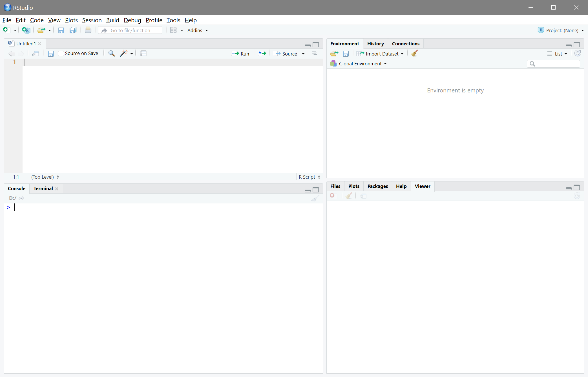

## Einordnung der Begriffe

`R` und RStudio werden meist Synonym verwendet. Dabei gibt es eigentlich einen Unterschied. Während `R` eine Sprache ist, auf der also unsere ganze Syntax basieren wird, bietet RStudio eine benutzerfreundlichere Oberfläche und auch diverse convernice features. Wir werden mit der Nutzeroberfläche von RStudio arbeiten, weil die traditionelle R Nutzeroberfläche ähnlich einer Konsole extrem spartanisch ist. 

Der Download von R selbst ist über die [R Main Page](https://www.r-project.org/) möglich - hier ist ein bisschen mehr Navigation erforderlich. Um RStudio herunterzuladen besuchen Sie am einfachsten [https://posit.co/](https://posit.co/), wo Sie oben rechts direkt von einem großen "Download RStudio"-Button begrüßt werden sollten. 

RStudio bietet in der Standardansicht ein Layout aus vier Panels. Beim ersten Öffnen sind aber nur drei davon sichtbar - durch **Strg+Shift+n** (OS X: **Cmd+Shift+n**) oder über den  Button wird eine Skriptdatei geöffnet und das vierte Panel erscheint.



Als Programmiersprache ist R syntaxbasiert. Geschrieben werden kann dabei entweder in der Konsole oder im neu geöffnetet Skript. In der Konsole wird eine Berechnung mit dem Betätigen der Eingabetaste direkt ausgeführt. Dieses Vorgehen wird für die durchgängige Anwendung nicht empfohlen, da man den Output in einer Konsole üblicherweise nicht abspeichert. Demnach wird diese Vorgehensweise nur für kleine Berechnungen verwendet.

Typischerweise wird die Syntax also im Skript notiert. Das pure Schreiben oder Betätigen der Eingabetaste führt hier zu keiner Ausführung. Damit etwas passiert, muss die Syntax mit **Strg+Return** (OS X: **cmd+Return**) oder mit dem  Button ausgeführt werden. Wenn Sie z.B. `3 + 4` als Syntax in Ihr Skript schreiben und mit einer der genannten Varianten ausführen, erscheint in der Konsole:


``` r
3 + 4
```

```
## [1] 7
```

Wir sehen hier direkt, dass auch dieser Output in der Konsole und nicht im Skript erscheint. Das Skript sollte also so geschrieben sein, dass die Syntax immer wieder ausgeführt werden kann, um den Output zu erhalten. Üblicherweise wird nämlich nur dieses Skript abgespeichert. Damit Sie sich in Zukunft also noch an das was in den einzelnen Schritten passiert erinnern und das Skritp schnell verstehen können, sollte dieses übersichtlich gestaltet und gut kommentiert sein. Die beiden verbleibenden Panels, die jeweils als Tabs verschiedene Dinge darstellen, werden wir im Laufe der Tutorials kennenlernen.

## Überschriften, Kommentare und Syntaxgestaltung

Reiner Code als Skript ist aus mehreren Gründen nicht gut. Andere Personen haben es ohne Kommentare in einem Skript viel schwerer, die dargestellten Schritte nachzuvollziehen. Darüber hinaus weiß man häufig selbst später nicht mehr genau, was man an spezifischen Stellen versucht hat zu erreichen. `R` bietet daher Möglichkeiten zur Gliederung anhand von Überschriften und Kommentaren - beide involvieren die Nutzung von `#`.

Kommentare können mit einem einfachen `#` eingeleitet werden. Sie sind nicht nur für andere, sondern auch für einen selbst hilfreich, um den Code zu verstehen. Sie können in einer eigenen Zeile stehen oder auch am Ende einer Zeile, um den Code zu erklären.


``` r
3 + 4 # Addition
```

```
## [1] 7
```

Überschriften werden durch mehrere `#` eingeleitet. Die Anzahl der `#` bestimmt dabei die Hierarchie der Überschrift. Die `-` am Ende könnten auch `#` sein und die Anzahl ist auch eine Geschmackssache.


``` r
#### R als Taschenrechner ----
```

In der Gliederung sollte in RStudio jetzt die Überschrift "R als Taschenrechner" auftauchen.

In unserem Beispiel-Code zur Addition sind zwischen den Zahlen und Operatoren immer Leerzeichen. Leerzeichen spielen für R in der Syntax keine Rolle - sie werden bei der Ausführung ignoriert. Daher können Leerzeichen und Einschübe zu Beginn von Zeilen genutzt werden um der Syntax noch mehr Struktur zu geben. Generell wird empfohlen, R Syntax wie normale Sätze zu schreiben und Leerzeichen zu nutzen, um die Lesbarkeit der Syntax zu gewährleisten. Einige weitere Empfehlungen zur Gestaltung von R Syntax finden Sie im [Online Buch von Hadley Wichkam](http://adv-r.had.co.nz/Style.html).

## Einfache Rechenoperationen und Logik

Natürlich bietet `R` erstmal ganz klassisch die Möglichkeit, Operationen eines Taschenrechners durchzuführen. Neben Addition und Subtraktion mit offensichtlicher Zeichenbelegung werden folgende Zeichen genutzt:


``` r
2 * 3 # Multiplikation
```

```
## [1] 6
```

``` r
2 / 3 # Division
```

```
## [1] 0.6666667
```

``` r
2 ^ 3 # Potenz
```

```
## [1] 8
```

Eine wichtige Grundlage ist außerdem die Nutzung von logischen Abfragen. Dabei kann `R` für uns überprüfen, ob zwei Einträge bspw. gleich sind oder sich voneinander unterscheiden. Folgende Abfragen wären bspw. möglich: 


``` r
2 == 3 # ist gleich?
```

```
## [1] FALSE
```

``` r
2 != 3 # ist ungleich?
```

```
## [1] TRUE
```

``` r
2 < 3  # ist kleiner?
```

```
## [1] TRUE
```

Die Ergebnisse dieser Abfragen sind *boolesch*. Die Ergebnisse können WAHR (`TRUE`) oder FALSCH (`FALSE`) sein. Wie wir an der Abfrage "ist ungleich" sehen, wird in `R` das `!` genutzt um eine Aussage zu negieren. Man kann auch gleichzeitig zwei Aussagen verknüpfen. Dafür gibt es die logischen Operatoren `&` (UND) und `|` (ODER). 


``` r
2 == 3 & 2 < 3 # ist gleich UND ist kleiner?
```

```
## [1] FALSE
```

``` r
2 == 3 | 2 < 3 # ist gleich ODER ist kleiner?
```

```
## [1] TRUE
```

Weitere Informationen zu einfachen Funktionalitäten finden sich [hier](/lehre/statistik-i/crash-kurs/#Taschenrechner).

## Funktionen

In `R` können wir auf Funktionen zurückgreifen, um nicht alles, was ausgeführt werden soll, selbst schreiben zu müssen. Funktionen in R haben folgende generelle Struktur: 


``` r
funktion(argument1, argument2, ...)
```

Die Funktion und auch die zugehörigen Argumente haben dabei einen Namen. Wir schauen uns zunächst ein simples Beispiel einer Funktion an - die Bestimmung eines Logarithmus. 


``` r
log(x = 2, base = 3)  # Logarithmus von 2 zur Basis 3
```

```
## [1] 0.6309298
```

In diesem Beispiel wird der Logarithmus von 2 zur Basis 3 berechnet. Die Namen der Argumente müssen aber nicht unbedingt verwendet werden, wenn die Reihenfolge der Argumente bekannt ist. 


``` r
log(2, 3)           # keine Namen in korrekter Reihenfolge
```

```
## [1] 0.6309298
```

Wenn die Reihenfolge der Argumente aber nicht bekannt ist, sind die Namen hilfreich, denn das Vertauschen der Reihenfolge ist dann in Ordnung. Ansonsten kann es sein, dass man etwas falsches berechnet. In diesem Beispiel wird der Logarithmus von 3 zur Basis 2 berechnet. 


``` r
log(base = 2, x = 3) # Reihenfolge vertauscht, aber Namen verwendet
```

```
## [1] 1.584963
```

``` r
log(3, 2)            # Reihenfolge vertauscht und keine Namen
```

```
## [1] 1.584963
```

Manche Argumente haben auch Voreinstellungen, die genutzt werden, wenn kein Wert für das Argument angegeben wird. Beispielsweise ist in der Funktion `log()` das Argument `base` auf 10 voreingestellt. Man muss es also nicht angeben, wenn man den Logarithmus zur Basis 10 berechnen möchte.


``` r
log(x = 100) # Logarithmus von 100 zur Basis 10
```

```
## [1] 4.60517
```

Weil sowohl Namen der Argumente, als auch deren Reihenfolge und Defaults bei Verwendung neuer Funktionen unbekannt sein können, kann man diese Informationen natürlich erfragen. In RStudio gibt es kleine Popups, die diese Informationen enthalten. Sollten diese Mal nicht erscheinen, kann man auch die `args()` Funktion nutzen.


``` r
args(log)   # Argumente der Funktion log
```

```
## function (x, base = exp(1)) 
## NULL
```

Allerdings ist es unter Umständen anhand der Argumentennamen nicht klar, was deren genaue Bedeutung ist. Hierbei kommt die Hilfe ins Spiel, die man mit `help()` aufrufen kann. 


``` r
help(log)   # Hilfe zur Funktion log
```

Wir sehen, dass beim Ausführen der Funktion `help()` ein neues Fenster geöffnet wird, in dem die Funktion `log()` erklärt wird. Dieses befindet sich standardmäßig im Panel unten rechts. Enthalten darin sind Beschreibungen der Argumente, der Ergebnisse, Literaturhinweise und auch Beispiele. Die Genauigkeit hängt hier stark davon ab, wer die Funktion geschrieben hat.

Um noch detaillierte Infos zur Hilfe zu erfahren, können Sie
[hier](/lehre/statistik-i/crash-kurs/#Hilfe) klicken.

## Nachrichten, Warnungen und Fehler

Im Umgang mit `R` ist es unvermeidlich: es werden Fehler passieren. Wichtig ist nur, dass man weiß, was die Rückmeldung bedeutet, die `R` produziert und wie man darauf reagieren sollte. Neben dem einfachern Output der durchgeführten Berechnungen können in `R` drei Formen von Rückmeldungen auftreten: messages, warnings und errors.

Eine `Message` liefert Informationen und dient ausschließlich der Kommunikation. Hier werden z.B. Zusatzinformationen geliefert, die die Interpretation eines Ergebnisse unterstützen sollen. Der Text, den R bei jedem Start produziert, ist ein Beispiel für eine `Message`.

Eine `Warning` deutet darauf hin, dass höchstwahrscheinlich etwas nicht so gelaufen ist, wie geplant, aber dennoch ein Ergebnis produziert wurde. Für den Logarithmus erscheint beispielsweise eine Warnung:


``` r
log(-1)
```

```
## Warning in log(-1): NaNs produced
```

```
## [1] NaN
```

Warnungen beginnen in R mit dem Wort `Warning`. In diesem Fall werden wir darauf hingewiesen, dass als Ergebnis der Funktion `NaN` (Not a Number) erzeugt wurde - also wahrscheinlich ein Ergebnis, das wir nicht haben wollten, als wir den Logarithmus aufgerufen haben.

Die letzte Art sind `Error`, die dazu führen, dass kein Ergebnis ausgegeben wird. Für den Logarithmus erhalten wir folgendermaßen einen Fehler:


``` r
log(base = 10)
```

```
## Error in eval(expr, envir, enclos): argument "x" is missing, with no default
```

Hier werden wir darauf hingewiesen, dass wir keinen Eintrag für das Argument `x` vorgenommen haben, obwohl dieses keine Voreinstellung hat. Daher kann die Funktion Ergebnis produzieren und gibt einen Fehler aus. 

## Objekte und das Environment

Nicht immer ist es notwendig, dass uns Ergebnisse direkt in der Konsole ausgedruckt werden. Mitunter wollen wir Ergebnisse eigentlich nur zwischenspeichern, um sie dann weiter zu verwenden. Dafür bietet `R` die Möglichkeit, Ergebnisse in sogenannten Objekten abzulegen. Die Zuweisung eines Ergebnisses zu einem Objekt erfolgt über den Zuweisungspfeil `<-`. Die Zuweisung ist zwar auch durch ein einfaches Gleichheitszeichen `=` möglich, aber der Zuweisungspfeil ist aus unserer Sicht übersichtlicher, da das `=` auch für andere Dinge genutzt wird (siehe bspw. die Argumente).


``` r
num <- log(x = 2, base = 3)  # Erstellung eines Objekts
```

Die Zuweisung bewirkt, dass Ergebnisse nicht in der Konsolte angezeigt, sondern im Environment abgelegt werden. Hierbei kommt jetzt also das vierte Panel zum Einsatz, welches standardmäßig oben rechts zu finden ist. Eine detaillierte Aufbereitung zu dem Environment ist an diesem [Ort](/lehre/statistik-i/crash-kurs/#Environment) zu finden.

Objekte, die im Environment liegen, können dann auch in anderen Funktionen genutzt werden. Beispielsweise können wir den Quadratwurzel `sqrt()` des eben berechneten Logarithmus bestimmen. Wollen wir uns nun das Ergebnis anzeigen lassen, können wir einfach den Namen des Objekts eingeben und ausführen.


``` r
num_sqrt <- sqrt(num)   # Weiterverwendung des Objekts
num_sqrt                # Ausgabe des Ergebnisses 
```

```
## [1] 0.7943109
```

Wollen wir mehrere Zahlen in ein Objekt ablegen, kann dies durch die Festlegung eines Vektors mittels der Funktion `c()` erfolgen. Die einzlenen Einträge werden wie üblich für Argumente durch Kommas getrennt.


``` r
vec <- c(3, 4, 1, 2)    # Erstellung eines Vektors
```

Objekte mit mehreren Dimensionen (also Zeilen und Spalten), werden im nächsten Tutorial vorgestellt, bei dem Datensätze mehr im Vordergrund stehen.

## Funktionen Schachteln

Das eben durchgeführte Ziehen der Wurzel nach der Bestimmung des Logarithmus ist ein Beispiel für das aufeinanderfolgende Anwenden zweier Funktionen. Statt zwischendurch ein Objekt zu erstellen, ist auch das direkte Schachteln natürlich möglich.


``` r
sqrt(log(x = 2, base = 3)) # Schachtelung von Funktionen
```

```
## [1] 0.7943109
```

Das Ergebnis der zweiten Funktion wird also direkt in die erste Funktion eingesetzt. Es wird wie in der Mathematik von innen nach außen gerechnet. Die Aneinanderkettung von Schachtelungen ist unbegrenzt, sodass sehr komplexe Syntax entstehen kann. Da man dabei leicht den Überblick verlieren kann, gibt es noch eine weitere Variante, Funktionen aneinander zu reihen: die *Pipe*.

Bei der Pipe `|>` wird ein links stehendes Objekt oder Ergebnis genommen und als *erstes Argument* der rechts stehenden Funktion eingesetzt. Für unser Wurzelbeispiel also:


``` r
sum(3, 4, 1, 2) |> sqrt() # Schachtelung anhand der Pipe
```

```
## [1] 3.162278
```

Dadurch kann die Syntax in der im westlichen Kulturkreis üblichen Variante wie Text von links nach rechts gelesen werden. zuerst wird also der Befehl links ausgeführt, das Ergebnis wird nach rechts weitergereicht und die nächste Funktion darauf angewendet. Auch dieses System ist theoretisch unendlich fortsetzbar.

Wenn wir unser Ergebnis an ein *spezifisches* Argument weiterreichen wollen, können wir dafür den Platzhalter `_` nutzen:


``` r
3 |> sqrt() |> log(base = _, x = 2) # Schachtelung mit Platzhalter
```

```
## [1] 1.26186
```


Zusammengefasst gibt es also drei Möglichkeiten, um Ergebnisse von Berechnungen in weiteren Schritten weiter zu nutzen:

Beschreibung | Code-Stil
 --- | ---
Objekt im Environment anlegen | `objekt <- funktion1(argument)` <br> `funktion2(objekt)`
Funktionen schachteln | `funktion1(funktion2(argument))` 
Verwendung der Pipe | `funktion1(argument) \|> funktion2()` 

Die Entscheidung für eine Variante hängt von eigenen Präferenzen und dem Kontext ab. Hinsichtlich des Kontexts lässt sich sagen, dass Ergebinsse, die im Verlauf des Skripts an mehreren Stellen gebraucht werden, als Objekte abgelegt werden sollten. Wenn mehrere Argumente der Hauptfunktion erst aus anderen Funktionen erzeugt werden müssen, bietet sich das Schachteln an. Ansonsten bietet sich die Pipe an, weil sie die Syntax lesbarer macht. 

## Daten speichern und laden

Die hauptsächlichen Bestandteile, die gespeichert (und auch geladen werden) sind das Skript, an dem wir nun einige Aspekte geschrieben haben und Grafiken, zu deren Erstellung wir später noch kommen. Diese beiden Aspekte können ganz normal über die Bedienoberfläche von RStudio gespeichert werden, wie es auch in einem Microsoft Office / Open Office (...) Dokument gemacht werden würde (unter File und Speichern Unter). Das zugehörige Dateiformat für eine normale R Skriptdatei ist `.R`. 

Objekte des Environments werden üblicherweise nicht gespeichert, da sie in der Regel immer wieder hergestellt werden können. Es gibt aber vielleicht auch Ausnahmen bei komplexen Analysen, deren Berechnungszeit man nicht immer wieder aufbringen möchte (bspw. Multiple Imputation, Bootstrapping...). Hier hat man die Möglichkeit, auch einzelne Objekte aus dem Environment für die zukünftige Nutzung zu speichern. Möglichkeiten gibt es hier bspw. auch für das Schreiben von Excel-Tabellen, aber R hat auch eigene Dateiformate. Wir nutzen hier das Format `.RData`, das aufgrund des Namens eindeutig mit R in Verbindung gebracht wird. Während es auch zum Speichern von Objekten Klickpfade gibt, können wir es auch Skriptbasiert durchführen. Das hilft uns auch schonmal die Verzeichnislogik von R zu verstehen. R sieht ein Verzeichnis des Computers als Arbeitsverzeichnis (Working Directory) an. Das ist der Ort, an dem R auch nach Dateien suchen würde, wenn wir sie einladen. Welches Verzeichnis das ist, steht überhalb der Konsole neben der Versionsnummer. Der Standard ist häufig der Home Ordner oder der Dokumente Ordner. Nun will man aber vielleicht nicht in diesem Verzeichnis alle Dateien speichern, sondern spezifischer einen Unterordner haben. Um das Verzeichnis zu wechseln gibt es die Funktion `setwd()` (set working directory). Bspw. kann ich in den Unterordner Workshop_FDZ in Dokumente auf meinem Laptop folgendermaßen wechseln:


``` r
setwd("C:/Users/nehler/Documents/Workshop_FDZ")
```

Der Code muss natürlich für Ihren Verzeichnisaufbau angepasst werden. Wichtig ist dabei, dass auch auf Windows, wo die Ordnerlogik normalerweise mit Backslashes `\` erfolgt, hier die Schrägstriche `/` genutzt werden. Beim Ausführen der Funktion ändert sich nun das Arbeitsverzeichnis, das neben der Versionsnummer angezeigt wird.

Nun können wir also Objekte speichern. Dafür gibt es die Funktion `save()`. Diese nimmt als Argumente die Objekte, die gespeichert werden sollen und den Dateinamen, unter dem sie gespeichert werden sollen. Beispielsweise können wir das eben erstellte Objekt `num` speichern:


``` r
save(num, file = "num.RData") # Speichern des Objekts
```

Die Datei wird nun im Arbeitsverzeichnis gespeichert. Zum Abschluss wollen wir die Datei nochmal einladen. Damit wir hier einen Erfolg sehen können, müssen wir zunächst unser Environment leeren. Dafür können wir in der Kachel zum Environment auf den Besen klicken. Wir werden nochmal um Bestätigung gebeten. Um jetzt das Objekt wieder zu laden, nutzen wir die Funktion `load()`:


``` r
load("num.RData") # Laden des Objekts
```

An dieser Stelle ist nochmal zu sagen, dass dieses Vorgehen für so schnell erstellte Objekte nicht empfohlen wird. Außerdem lernen wir im nächsten Skript auch noch einen sehr einfachen Weg zum setzen des Workring Directory kennen.
 
## Abschluss

Nachdem wir uns mit den Grundlagen von `R` und RStudio vertraut gemacht haben, können wir uns nun an die Arbeit mit Datensätzen machen. Im folgenden Tutorial werden wir uns mit dem Einlesen von Datensätzen, der Datenaufbereitung und der deskriptiven Datenauswertung beschäftigen.

