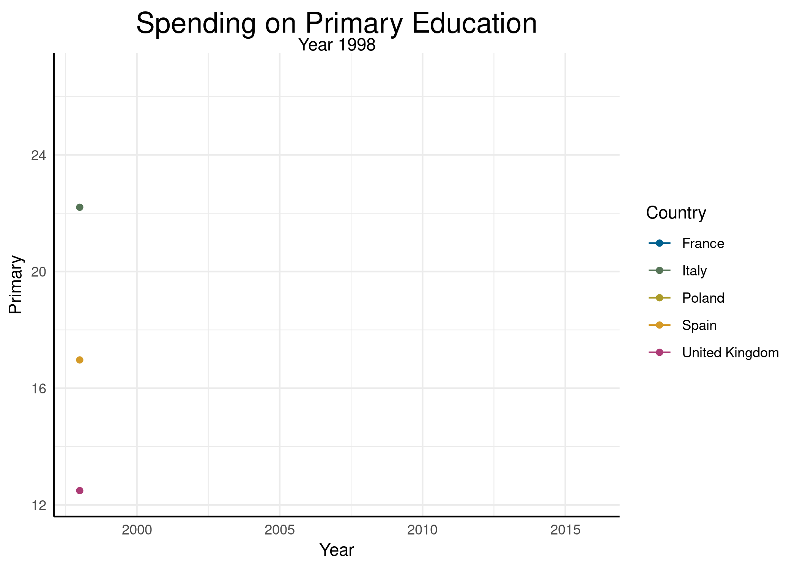
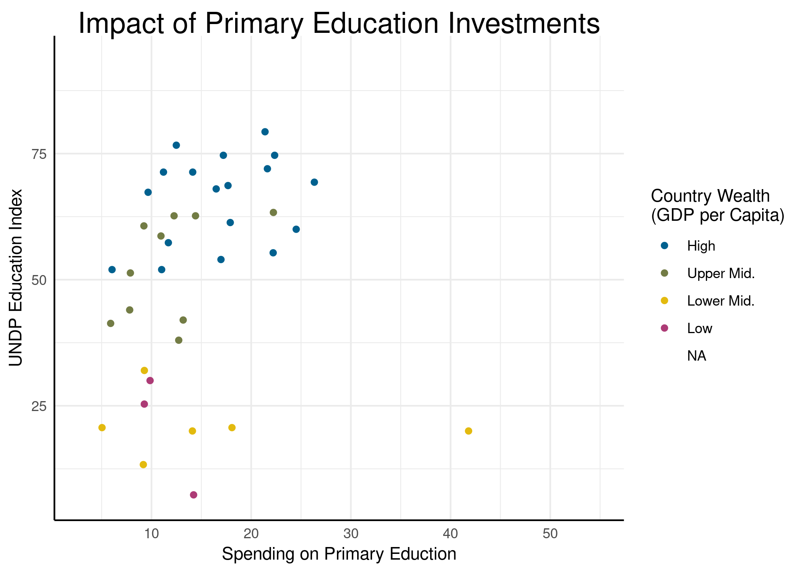
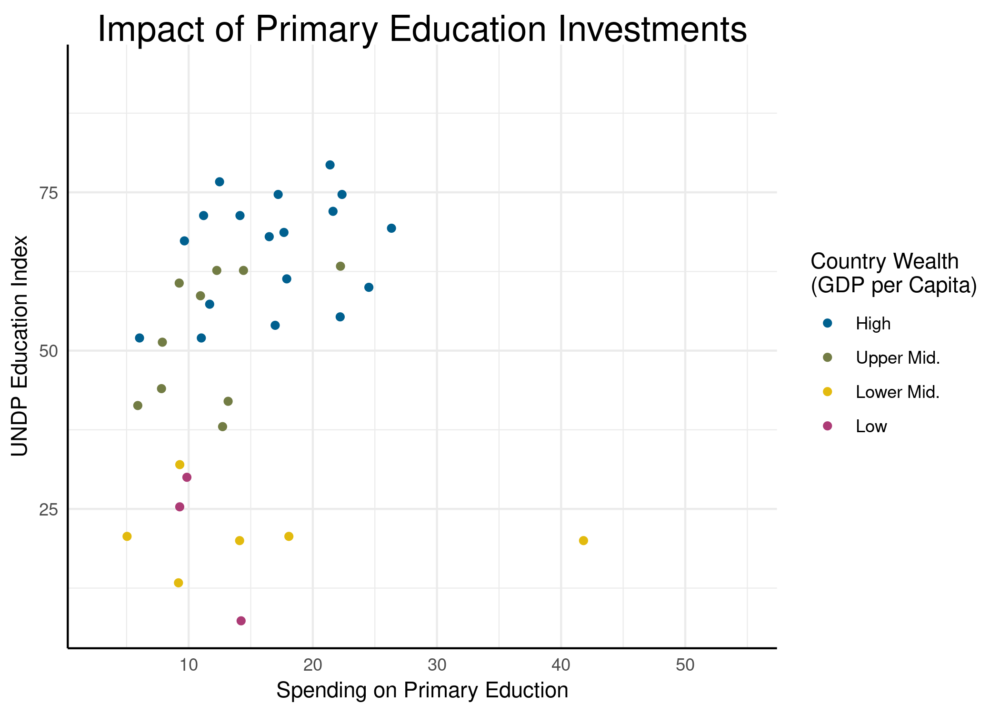
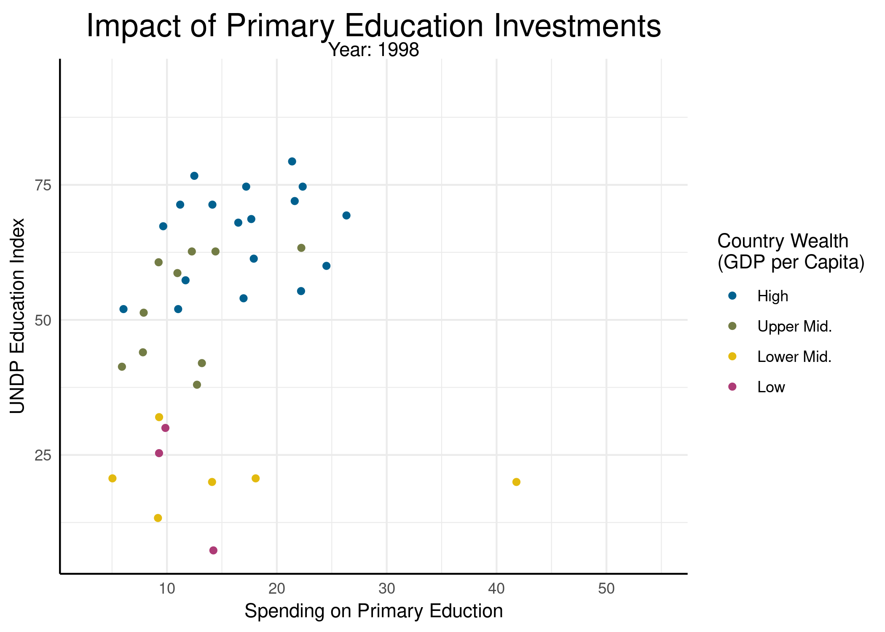

In den bisherigen Abschnitten haben wir unsere Abbildungen und Grafiken auf drei Dimensionen beschränkt: x, y und die Farbe. Der immense Vorteil am fortschreitenden Übergang dahingehend, dass wir Forschungsergebnisse nicht mehr ausschließlich in Printmedien darstellen, ist, dass wir eine vierte Dimension öffnen können (die Zeit), um mehr Informationen in einer Abbildung zu vermitteln. Dabei ist die Grundidee, dass wir eigentlich nicht *einen* Plot erstellen, sondern stattdessen sehr viele, die als einzelne Bilder zu einem Film zusammengefügt werden. Zwei zentrale Fragen, die man sich stellen sollte, bevor man anfängt Daten zu animieren, sind dabei "Gewinnt der Betrachter bzw. die Betrachterin dabei zusätzliche Information?" und "Ist es den Aufwand wert?". 

## Vorbereitende Schritte

Wie schon in den [beiden vorherigen Abschnitten](/extras#ggplotting) nutzen wir auch hier wieder [den von uns vorbereiteten Ausschnitt](/post/ggplotting-daten) aus den Gapminder Daten, der sich auf Bildungsausgaben und den UNDP Bildungsindex fokussiert. Wie auch bisher können wir dafür die Daten direkt von dieser Website laden:


```r
load(url('https://pandar.netlify.com/post/edu_exp.rda'))
```


Naheliegenderweise benötigen wir auch in diesem Beitrag wieder `ggplot2`:


```r
library(ggplot2)
```

Außerdem können wir die Theme und die Farbpalette aus [dem letzten Abschnitt](/post/ggplotting-themes) wieder benutzen. Dafür habe ich beide in einem .R-Skript festgehalten, sodass wir die Datei auf dieser Website direkt aus R ansprechen können:


```r
source('https://pandar.netlify.com/workshops/ggplotting/ggplotting-theme-source.R')
```


Nach dieser kurzen Vorbereitung können wir uns direkt in die Animationen stürzen!


## Informationsgewinn durch Animation

Nehmen wir für die Frage "Gewinnt der Betrachter bzw. die Betrachterin dabei zusätzliche Information?" mal ein Negativbeispiel:



Was wir hier sehen ist die animierte Variante dessen, was wir im [ggplot Intro](/post/ggplotting-intro) als "normalen" Plot erzeugt hatten. Hier werden die Ausgaben für das primäre Bildungssystem im Vergleich der fünf Länder (Vereinigtes Königreich, Frankreich, Italien, Spanien und Polen) über die Jahre zwischen 1998 und 2018 dargestellt. Die Abbildung hat zwar den Vorteil, die Spannung aufrecht zu erhalten, während wir uns wundern wie es wohl weitergeht, aber vergleichen wir diese Abbildung mal mit der ursprünglichen:

<!-- -->

Im direkten Vergleich hat sie sogar einen wesentlichen Nachteil: wir haben wenig Gelegenheit, die gesamte Information zu betrachten, wenn wir im Jahr 2018 angekommen sind. Wir können zwar am Ende der Animation durch das 2-sekündige Standbild einen kurzen Überblick erhaschen, aber der Fokus wird vom Ersteller (in diesem Fall mir) auf die Entwicklung gelenkt und lässt kaum eine detaillierte Inspektion der Daten durch die Betrachtenden zu. In Dingen der Aufmerksamkeitslenkung kann diese Abbildung also durchaus nützlich sein. Wenn wir aber das Ziel haben, unsere Information sachlich und transparent zu vermitteln, gewinnen wir durch die Animation in diesem Fall nichts.

Das Problem liegt hier dabei, dass die Variable, die wir für die Animation benutzen (`Year`), bereits auf der x-Achse abgetragen ist. Wir gewinnen also keine vierte Dimension in den Daten, sondern nutzen die Erste doppelt. Stattdessen sollten wir uns auf Situationen konzentrieren, in denen wir durch die Animation eine weitere Variable in unsere Abbildung aufnehmen können, die für die Information, die wir zu vermitteln versuchen, einen Mehrwert hat.

## Statische Grundlage


Nehmen wir das Beispiel aus dem [Beitrag zur Verwendung von Themes und Farben](/post/ggplotting-themes). Dort hatten wir für ein spezifisches Jahr (2013) die Ausgaben für Grundschulbildung und den Education Index gegenübergestellt:


```r
subset(edu_exp, Year == 2013) |>
  ggplot(aes(x = Primary, y = Index, color = Wealth)) +
    geom_point() +
    labs(x = 'Spending on Primary Eduction',
    y = 'UNDP Education Index',
    color = 'Country Wealth\n(GDP per Capita)') +
    ggtitle('Impact of Primary Education Investments', subtitle = 'Data for 2013') +
    theme_pandar() + scale_color_pandar()
```

```
## Warning: Removed 99 rows containing missing values (`geom_point()`).
```

<!-- -->

Zur Erinnerung: hier werden zuerst die Daten für 2013 mittels `subset()` ausgewählt und dann über die Pipe `|>` an `ggplot()` weitergereicht. Dort verwenden wir die Ausgaben (`Primary`) als x und den Bildungsindex (`Index`) als y. Zusätzlich färben wir die Punkte nach Wohlstandsgruppe des Landes (`Wealth`). Diese Daten stellen wir dann als Punkte dar (`geom_point()`). Mit `labs()` werden unsere drei Ästhetiken dann noch etwas detaillierter beschriftet und mit `ggtitle()` wird noch ein passender Titel hinzugefügt. Zu guter Letzt können wir mit `theme_pandar()` und `scale_color_pandar()` die optische Aufbereitung aufrufen, die wir im letzten Beitrag erstellt haben.

Wie sofort ersichtlich wird ist das Problem, dass die drei Dimensionen, die uns in einem statischen Plot zur Verfügung stehen (x, y und die Farbe), schon mit Informationen belegt sind. Für die Darstellung einer vierten Variable (der in `Year` festgehaltenen Zeit) können wir uns einer Animation bedienen. Wenn wir nämlich versuchen, alle Daten gleichzeitig darzustellen, wird das Ganze ein wenig unübersichtlich:


```r
static <- ggplot(edu_exp, aes(x = Primary, y = Index, color = Wealth)) +
  geom_point() +
  labs(x = 'Spending on Primary Eduction',
  y = 'UNDP Education Index',
  color = 'Country Wealth\n(GDP per Capita)') +
  ggtitle('Impact of Primary Education Investments') +
  theme_pandar() + scale_color_pandar()
static
```

```
## Warning: Removed 2789 rows containing missing values (`geom_point()`).
```

<!-- -->

Mit faceting könnten wir versuchen das Problem zu lösen, allerdings geht uns dabei die intuitive Darstellung des Zeitverlaufs verloren:


```r
static + facet_wrap(~ Year, scales = 'free')
```

```
## Warning: Removed 2789 rows containing missing values (`geom_point()`).
```

<!-- -->

Leider sehen wir schon hier, dass die Datenlage für 1997 sehr dünn ist und für das Jahr 2017 aus irgendeinem Grund vor allem die Informationen aus wohlhabenden Ländern fehlen. Daher schließen wir diese beiden Jahre für die Folgenden Animationen zunächst aus:


```r
trimmed <- subset(edu_exp, Year < 2017 & Year > 1997)
static <- ggplot(trimmed, aes(x = Primary, y = Index, color = Wealth)) +
  geom_point() +
  labs(x = 'Spending on Primary Eduction',
  y = 'UNDP Education Index',
  color = 'Country Wealth\n(GDP per Capita)') +
  ggtitle('Impact of Primary Education Investments') +
  theme_pandar() + scale_color_pandar()
```


## Grundidee von `gganimate`

Um uns Animationen in der *relativ* intuitiven Schreibweise von `ggplot2` zu ermöglichen, hat Thomas Lin Pedersen das Paket [gganimate](https://gganimate.com/articles/gganimate.html) erstellt. Dabei besteht die Grundidee des Pakets darin, aus einem ggplot anhand einer differenzierenden Variable mehrere ggplots zu machen. Letztendlich ist das Vorgehen also das Gleiche wie beim Faceting, nur dass wir hier die entstandenen Grafiken nicht in einem Raster anordnen, sondern einfach nacheinander anzeigen (und so die Illusion einer Animation erwecken). Dabei ist das Vorgehen recht einfach: wir erstellen mit `ggplot()` eine statische Abbildung und fügen dieser mit `+` einfach Befehle zur Erstellung von Animationen hinzu. Dabei werden in `gganimate` im Wesentlichen drei große Animationen unterschieden:

  * `enter_`-Befehle steuern das Verhalten, wenn Daten *auftauchen*. `enter_fade` z.B. bewirkt, dass eine Geometrie anhand des Übergangs von komplett durchsichtig zu komplett undurchsichtig im klassischen "fade-in" erscheint.
  * `exit_`-Befehle verhalten sich genauso, steuern aber das Verhalten, wenn Daten *verschwinden*.
  * `transition_`-Befehle steuern die *Übergänge* zwischen Datenzuständen. In unserem Fall z.B. sind die Daten von Spanien im Jahr 2008 und 2009 unterschiedlich:
  

```r
subset(trimmed, Year %in% c(2008, 2009) & geo == 'esp')
```

```
##      geo Country Wealth Region Year Population Expectancy   Income  Primary Secondary Tertiary Index
## 1178 esp   Spain   High europe 2008   45966538       81.1 27025.29 20.00129  25.37782 26.80364  0.75
## 1179 esp   Spain   High europe 2009   46367772       81.4 25778.96 21.27594  27.61234 28.60976  0.75
```

`transition_`-Befehle steuern, wie zwischen diesen Daten der Pfad interpoliert werden soll. `enter_` und `exit_` funktionieren im Grunde identisch zueinander, weswegen sie auch in einer gemeinsamen Hilfe dokumentiert sind, die mit `?enter_exit` angesprochen werden kann. Das hat den Vorteil, dass wir dort alle Möglichkeiten auf einen Blick sehen. In den allermeisten Fällen werden mit diesen beiden Animationsarten aber Feinheiten geregelt, während der Kern der Animation über die Darstellung von Übergängen passiert.

Wenn wir uns für eine Animation des Übergangs zwischen Datenzuständen (in unserem Fall die Jahre) ausgesucht haben, muss das in mehrere Plots übersetzt und diese Plots am Ende zu einer Animation zusammengefügt werden. Dabei ist eins der gängigsten Formate, um animierte Bilder zu präsentieren, das gif (Graphics Interchange Format, gesprochen *gif*). Dieses Format ist nichts weiter als eine Aneinanderreihung von Bildern, die dann (meistens in Schleife) abgespielt werden. `gganimate` bietet aber eine Reihe verschiedener Renderer, mit denen unterschiedliche Datenformate erzeugt werden können (siehe `?renderers` für eine Übersicht). Diese beiden Schritte übernimmt in `gganimate` die `animate()`-Funktion. Diese kann entweder direkt angewandt werden, um eine animierte Grafik in RStudio anzuzeigen oder - besser - um die Animation in einem Objekt abzulegen, die man dann mit `anim_save()` abspeichern kann. Hierbei macht besonders das Speichern Sinn, weil das Animieren von Grafiken mitunter mehrere Minuten in Anspruch nehmen kann. So aufwändig erstellte Plots durch einen Misclick zu verwerfen kann durchaus einiges an Frustrationen erzeugen (besonders wenn man einen Text wie diesen verfasst).

Zusammengefasst ist das Vorgehen also: 

  1. statische Grafik mit `ggplot()` erstellen,
  2. mit `transition_`, `enter_` und/oder `exit_` die gewünschten Animationen hinzufügen,
  3. mit `animate()` die Animation vornehmen und 
  4. zu guter Letzt mit `anim_save()` die Animation speichern.
  
## Animierter Scatterplot: Erster Versuch

Um mit `gganimate` arbeiten zu können, muss das Paket natürlich installiert sein. Wenn wir unsere Animationen als gifs speichern wollen, kann es außerdem notwendig sein, `gifski` zu installieren, das den enstprechenden Renderer liefert:


```r
install.packages('gganimate')
install.packages('gifski')
```

Für das Laden reicht es aber dann aus, nur `gganimate` aufzurufen, weil der Renderer nur intern angesprochen wird:


```r
library('gganimate')
```

```
## Warning: Paket 'gganimate' wurde unter R Version 4.3.2 erstellt
```

Weil die Darstellung von Zeitverläufen der häufigste Anwendungsfall für die Animation ist, hat sie in `gganimate` sogar eine eigene Übergangsfunktion: `transistion_time()`. Diese können wir benutzen, um die Übergänge zwischen verschiedenen Zeitpunkten in unseren Daten zu animieren. Den statischen Plot hatten wir oben bereits als `static` abglegt. Die Funktion nimmt natürlich die Zeitvariable als Argument entgegen, anhand derer die Animation betrieben wird:


```r
fluid <- static + transition_time(Year)
```

Diese Animation können wir dann an `animate()` weitergeben, bevor wir schlussendlich mit `anim_save()` die Abbildung abspeichern:


```r
animated <- animate(fluid)
anim_save('step1.gif', animated)
```

Das Ergebnis dieses Versuchs sollte jetzt so aussehen:



## Animierter Scatterplot: Mehr Versuche

Noch ist das Ergebnis nicht wirklich zufriedenstellend. Der leichte Stroboskop-Effekt ist nicht so hübsch und einige der Verbindungen zwischen Punkten stammen zumindest augenscheinlich nicht von den gleichen Ländern. Der Grund für das zweite Problem liegt darin, dass der Datensatz für einige Länder recht "löchrig" ist, also bei weitem nicht in allen Jahren die Ausgaben und/oder der UNDP Bildungsindex ermittelt wurden. Wenn wir uns z.B. die Daten aus Indien ansehen, sehen wir direkt, dass die Daten nur in ausgewählten Jahren vorliegen:


```r
subset(trimmed, geo == 'ind', select = c('Country', 'Wealth', 'Year', 'Primary', 'Index'))
```

```
##      Country     Wealth Year  Primary Index
## 1722   India Lower Mid. 1998       NA  0.35
## 1723   India Lower Mid. 1999 12.18634  0.36
## 1724   India Lower Mid. 2000 14.84075  0.37
## 1725   India Lower Mid. 2001 13.73107  0.37
## 1726   India Lower Mid. 2002       NA  0.38
## 1727   India Lower Mid. 2003 11.35044  0.40
## 1728   India Lower Mid. 2004       NA  0.41
## 1729   India Lower Mid. 2005       NA  0.41
## 1730   India Lower Mid. 2006       NA  0.43
## 1731   India Lower Mid. 2007       NA  0.44
## 1732   India Lower Mid. 2008       NA  0.45
## 1733   India Lower Mid. 2009  7.58993  0.45
## 1734   India Lower Mid. 2010  7.49038  0.46
## 1735   India Lower Mid. 2011  9.03030  0.48
## 1736   India Lower Mid. 2012  9.40785  0.49
## 1737   India Lower Mid. 2013  9.79172  0.50
## 1738   India Lower Mid. 2014       NA  0.51
## 1739   India Lower Mid. 2015       NA  0.52
## 1740   India Lower Mid. 2016       NA  0.53
```

Wie wir schon für `ggplot2` gesehen haben, ist die Grundüberzeugung auch in der Umsetzung von `gganimate`, dass es leichter ist hier direkt Daten anzupassen, statt Veränderungen an der Darstellung vorzunehmen. Für unseren Fall heißt das, dass wir die Zeilen mit fehlenden Werten entfernen müssen. Dadurch werden die Übergänge zwischen den verbleibenden Jahren animiert, statt die Daten auszublenden. So würde für Indien dann der Übergang von 2003 zu 2009 als langsamer Verlauf zwischen (11.35, 0.4) und (7.59, 0.45) angezeigt werden.


```r
nomiss <- subset(trimmed, !(is.na(Primary) | is.na(Index)))

subset(nomiss, geo == 'ind', select = c('Country', 'Wealth', 'Year', 'Primary', 'Index'))
```

```
##      Country     Wealth Year  Primary Index
## 1723   India Lower Mid. 1999 12.18634  0.36
## 1724   India Lower Mid. 2000 14.84075  0.37
## 1725   India Lower Mid. 2001 13.73107  0.37
## 1727   India Lower Mid. 2003 11.35044  0.40
## 1733   India Lower Mid. 2009  7.58993  0.45
## 1734   India Lower Mid. 2010  7.49038  0.46
## 1735   India Lower Mid. 2011  9.03030  0.48
## 1736   India Lower Mid. 2012  9.40785  0.49
## 1737   India Lower Mid. 2013  9.79172  0.50
```

Z.B. die Daten für Indien sind jetzt auf die wenigen Zeilen reduziert, in denen beide Variablen vorliegen, die wir auf x- und y-Achse abtragen. 

Das zweite Problem - dass einige Übergänge eventuell zwischen Ländern stattfinden, die nicht die selben sind - müssen wir schon in der Erstellung des statischen Plots beheben. Bisher enthält unser ggplot keinerlei Angaben dazu, wie Daten des gleichen Landes einander zugeordnet werden können. Um hier sicher zu gehen, dass immer alle Punkte zueinander gehören, zwischen denen ein Übergang animiert wird, können wir mit dem `group`-Argument eine Gruppierungsvariable hinzufügen:


```r
static <- ggplot(nomiss, aes(x = Primary, y = Index, color = Wealth, group = Country)) +
  geom_point() +
  labs(x = 'Spending on Primary Eduction',
  y = 'UNDP Education Index',
  color = 'Country Wealth\n(GDP per Capita)') +
  ggtitle('Impact of Primary Education Investments') +
  theme_pandar() + scale_color_pandar()
```

An der statischen Abbildung ändert sich dadurch nichts, es wird lediglich Information darüber hinterlegt, dass `Country` eine Gruppierung darstellt, die kennzeichnet, dass Zeilen das Datensatzes zueinander gehören. Mit diesen Anpassungen können wir einen zweiten Versuch starten:


```r
fluid <- static + transition_time(Year)
animated <- animate(fluid)
anim_save('step2.gif', animated)
```


Auch das wirkt durch das abrupte Erscheinen und Verschwinden von einzelnen Datenpunkten noch sehr unruhig. Um das ein wenig abzuschwächen, können wir die vorhin erwähnten `enter_` und `exit_`-Funktionen nutzen, um die Punkte allmälich ein- und auszublenden. Dazu nutze ich hier die `_fade` Variante der beiden:


```r
fluid <- static + transition_time(Year) +
  enter_fade(alpha = .1) + exit_fade(alpha = .1)
```

Um nicht für jede Vorschau immer die gesamte Animation zu durchlaufen, können wir mit `plot()` auch einfach spezifische Frames ansehen:


```r
plot(fluid, 2)
```

<!-- -->

Hier sehen wir uns den 2. Frame der Animation an. Per Voreinstellung werden in `gganimate` 100 Frames bei 10 FPS (frames per second) erstellt, sodass die Standard-Animation stets 10 Sekunden lang ist. Wie wir sehen können, erscheinen hier gerade einige Punkte, während manche schon wieder verschwinden. In voller Umsetzung sieht das Ganze dann so aus:


## Feinschliff-Funktionalität

Im letzten Abschnitt haben wir uns angesehen, wie Daten ein- und ausgeblendet werden und wie der Übergang zwischen verschiedenen Zuständen erzeugt werden kann. Um den Übergang zwischen den Zuständen noch zu verfeinern, können wir mit den `shadow_`-Funktionen arbeiten. Mit `shadow_trail` ergibt sich z.B. Folgendes:


```r
fluid <- static + transition_time(Year) +
  enter_fade(alpha = .1) + exit_fade(alpha = .1) +
  shadow_wake(.5)
```

Um von der Preview-Funktionaliät Gebrauch zu machen:


```r
plot(fluid, 44)
```

<!-- -->

Wie man sieht, ist es sehr leicht möglich mit solchen Anpassungen die Abbildung "ein wenig" chaotisch werden zu lassen. Aber natürlich variiert das von Situation zu Situation - hier, wie bei allen Dingen in R, lohnt es sich einfach verschiedene Dinge auszuprobieren! Dazu bietet `gganimate` im Wesentlich drei "Schatten" `shadow_mark()`, `shadow_trail()` und das schon gesehene `shadow_wake()`. 

Über dieses explizite Hinzufügen von Übergangseffekten hinaus können wir auch bestimmen, wie zwischen zwei Situationen gewechselt wird. Im Moment gehen die Punkte linear ineinander über, aber über `ease_aes()` können wir eine vielzahl von Übergangsfunktionen definieren. Dabei geht es vor allem um die Beschleunigung, mit der Punktetransition stattfindet (`linear`, `quadratic`, `cubic` und so weiter). Jede der Funktionen kann entweder als Beschleunigung (`-in`) oder als Bremse (`-out`) oder als beides (`in-out`) benutzt werden. So können wir z.B. `elastic-in` benutzen, um diese Transition zu erzeugen:


```r
fluid <- static + transition_time(Year) +
  enter_fade(alpha = .1) + exit_fade(alpha = .1) +
  ease_aes('elastic-in')
```



Die dritte Anpassung bezieht sich auf die Achsen. Generell ist es empfehlenswert, global fixierte Achsen zu nutzen, um die Darstellung der Daten vergleichbar zu halten. Nichtsdestotrotz sind sich verändernde Achsen bei manchen Abbildungen sehr beliebt und manchmal auch außerordentlich sinnvoll. Wenn wir z.B. die Entwicklung der Einwohnerzahlen der Länder betrachten würden, wäre es nicht sonderlich hilfreich, für das Jahr 1800 die gleich Skalierung wie für 2020 zu nutzen. Für unseren Plot können wir z.B. Folgendes tun:


```r
fluid <- static + transition_time(Year) +
  enter_fade(alpha = .1) + exit_fade(alpha = .1) +
  view_follow()
```

Dadurch verändern sich während unserer Animation die Ober- und Untergrenzen der dargestellten x- und y-Skalen. Das wirkt besonders in unserem Fall etwas ungünstig, weil sehr extreme Werte nur kurz und vereinzelt auftauchen. Das liegt höchstwahrscheinlich an der Definition der `Primary` Variable, die am GDP relativiert wird und demzufolge bei Wirtschaftskrisen sehr schnell in die Höhe springt.


Eine letzte Option, mit der wir den Plot noch verfeinern können, ist mit der Kennzeichnung der aktuellen Situation. Im Verlauf unserer Animation vergehen Jahre, allerdings erfahren wir nirgendwo, welches Jahr wir aktuell sehen. Dazu hat `gganimate` eine eigene Funktionalität: die `transition_`-Funktionen geben alle spezifische Platzhalter aus, die wir in der Animation verwenden können (diese sind in der jeweiligen Hilfe immer unter "Label Variables" gelistet). Für das von uns genutzte `transition_time()` ist dieser Platzhalter `frame_time`, in dem die aktuelle Ausprägung der Variable hinterlegt wird, die wir als Zeitvariable genutzt haben. Diese können wir benutzen, um z.B. im Verlauf der Animation den Titel oder andere Beschriftungen anzupassen. In unserem Fall bietet es sich an, den Untertitel mit der Jahreszahl zu versehen. Dafür können wir wieder `ggplot`-Elemente hinzufügen. In diesem Fall überschreiben wir mit dem neuen `ggtitle()` den Titel, den wir bereits in `static` definiert hatten:


```r
fluid <- static + transition_time(Year) +
  enter_fade(alpha = .1) + exit_fade(alpha = .1) +
  ggtitle('Impact of Primary Education Investments', 'Year: {frame_time}')
```

Nach der Animation durch `animate()` sieht diese Abbildung dann so aus:




## Animations-Optionen

Alle Optionen, die wir bisher besprochen haben, beziehen sich auf neue Elemente, die dem Plot hinzugefügt werden. Über diese Dinge hinaus können wir in `gganimate` aber auch direkt an den Einstellungen der Animation als Ganzes herumbasteln. Wie schon erwähnt sind Animationen per Voreinstellung 100 Frames lang und laufen bei 10 FPS. In einigen Fällen können 10 Sekunden zu wenig sein, um die Gesamtheit der Daten angemessen darzustellen. Dafür haben wir drei Argumente, die wir in der `animate`-Funktion nutzen können, um die FPS und die Dauer der Animation nach unseren Vorlieben anzupassen:

  * `nframes`: Die Gesamtzahl der Frames.
  * `fps`: Frames pro Sekunde.
  * `duration`: Länge der Animation in Sekunden.

Wenn wir alle drei Argumente nutzen kann es zu widersprüchlichen Informationen kommen, sodass im Normalfall `nframes` und `fps` gesetzt werden. Wenn wir z.B. die Animationslänge bei gleichbeinden FPS verdoppeln möchten, können wir dies mit


```r
animated <- animate(fluid,
  nframes = 200, fps = 10)
```

erreichen. Darüber hinaus können wir über das Argument `renderer` auch bestimmen, auf welche Art die Animation erzeugt und in welchem Format sie am Ende vorliegen soll. `?renderers` gibt dabei eine Übersicht.

Eine Anpassung, über die wir bereits gesprochen haben, aber deren Umsetzung in `gganimate` bisher verheimlicht blieb, ist die Nutzung von Anfangs- und Endpausen, um einen besseren Eindruck von Ausgangslage und aktueller Situation zu vermitteln. Dafür können wir mit `start_pause` und `end_pause` die Anzahl der Frames festlegen, die wir in dieser Pause verbringen möchten:


```r
animated <- animate(fluid,
  nframes = 200, fps = 10,
  start_pause = 20,
  end_pause = 20)
```

So ermöglicht die Animation jetzt, sich erst einen Eindruck von dem zu machen, was man im Jahr 1998 vorfindet und abschließend die Lage in 2017 zu beurteilen:


## Bar Chart Races

Eine außerordentlich beliebte, sehr einfache Animation sind Bar Chart Races. Vor einiger Zeit erfreuten sich diese Animationen auch auf YouTube einer außerordentlichen Beliebtheit, weil man mit ihnen letztlich jede Konkurrenzsituation über die Zeit sehr übersichtlich darstellen kann ([dieses 5-minütige Video](https://youtu.be/BQovQUga0VE) mit einem Bar Chart Race der 15 wertvollsten Marken hat z.B. 9 Millionen Views). Wir können versuchen mit unseren neu gefundenen Kenntnissen über Plot-Animationen ein solches Rennen nachzubauen.

Zunächst benötigen wir zusätzlich zu unserer eigentlichen abhängigen Variablen (in diesem Beispiel nutzen wir den Education Index) eine Rangreihe, anhand derer wir dir Länder sortieren können. Allerdings muss diese Rangreihe innerhalb der einzelnen Jahre ermittelt werden, sodass wir etwas umständlich mit `ave()` arbeiten müssen. Eine beliebte Alternative zur Erstellung von Werten in gruppierten Daten stellt die `group_by`-Funktionalität im Datenmanagement-Paket `dplyr` dar. 


```r
edu_exp$Index_Rank <- ave(-edu_exp$Index, edu_exp$Year, FUN = function(x) rank(x, ties.method = 'first'))
```

Wir bilden hier also für den *negativen* `Index` (damit die Rangreihe den Ländern mit dem höchsten `Index` den niedrigsten Rangplatz, also die 1, zuweist) innerhalb der einzelnen Jahre (`Year`) mit der Funktion `rank()` eine Rangreihe, bei der Gleichstände alphabetisch aufgelöst werden. Für das Jahr 1997 bekommen wir also z.B. folgende Top 10:


```r
subset(edu_exp, Index_Rank < 11 & Year == 1997)
```

```
##      geo     Country Wealth   Region Year Population Expectancy   Income  Primary Secondary Tertiary
## 177  aus   Australia   High     asia 1997   18410250       78.9 41463.65       NA        NA       NA
## 265  bel     Belgium   High   europe 1997   10154872       77.3 32804.36       NA        NA       NA
## 639  can      Canada   High americas 1997   29882752       78.7 33861.15       NA        NA       NA
## 969  deu     Germany   High   europe 1997   81436087       77.3 32313.30       NA        NA       NA
## 1035 dnk     Denmark   High   europe 1997    5277382       76.2 45570.08       NA        NA       NA
## 2843 nld Netherlands   High   europe 1997   15629905       78.0 36032.04       NA        NA       NA
## 2865 nor      Norway   High   europe 1997    4405333       78.2 63882.48 37.94443  18.13375 46.01137
## 2931 nzl New Zealand   High     asia 1997    3775852       77.4 28764.40 17.44218  21.57709       NA
## 3635 swe      Sweden   High   europe 1997    8807869       79.3 36197.63       NA        NA       NA
## 4075 usa         USA   High americas 1997  272395438       76.8 44267.91       NA        NA       NA
##      Index Index_Rank
## 177   0.94          1
## 265   0.83          9
## 639   0.85          4
## 969   0.84          6
## 1035  0.83         10
## 2843  0.85          5
## 2865  0.84          7
## 2931  0.88          2
## 3635  0.84          8
## 4075  0.87          3
```

Damit wir unserer Abbildung auch die Information aus den Farben nicht ungenutzt lassen, können wir in dieser die Regionen kodieren. Dafür müssen wir diese, wie schon mit `Wealth` passiert, in einen schön gelabelten `factor` umwandeln:


```r
edu_exp$Region <- factor(edu_exp$Region,
  levels = c('europe', 'asia', 'americas', 'africa'),
  labels = c('Europe', 'Asia', 'Americas', 'Africa'))
```

Weil wir in unserem Plot nicht alle Länder der Erde gleichzeitig darstellen wollen, sondern ein "Rennen" darstellen, beschränken wir unsere Daten auf die Top 10 pro Jahr:


```r
top10 <- subset(edu_exp, Index_Rank < 11)
```

Unseren statischen Plot können wir wieder stückweise erstellen. Zunächst die Grundkomponenten:


```r
static <- ggplot(top10,
  aes(y = Index_Rank, x = Index, fill = Region, group = Country))
```

Auf der y-Achse werden also die Ränge abgetragen, auf der x-Achse der tatsächliche Wert. Die Färbung soll den vier Regionen entsprechen und damit wir die Zuweisung der Datenpunkte über die Zeit zueinander korrekt machen, nutzen wir wieder das Land als Gruppierungsvariable.


```r
static <- static + 
  geom_rect(aes(ymin = Index_Rank - .4, ymax = Index_Rank + .4,
  xmin = 0, xmax = Index))
```

Weil es sich um Bar Chart Race handelt, nutzen wir `geom_rect()` um Rechtecke zu erstellen. Dieser werden durch die in `ggplot()` schon von uns festgelegte y-Ästhetik auf der y-Achse and ihrem Rang platziert - hier wird zudem festgesetzt, dass sie +/- 0,4 Ränge um ihren Rang breit sein sollen. Darüber hinaus sollen sie auf der x-Achse von 0 bis zu ihrer `Index` Ausprägung gehen.


```r
static <- static +
  geom_text(hjust = 'right', aes(label = Country), color = 'white')
```

Damit wir in der Animation erkennen, welches Land welches ist, beschriften wir die Datenpunkte an den Stellen x (`Index`) und y (`Index_Rank`) mit einem Label, in diesem Fall der Ausprägung der Variable `Country`. Damit der Text vollständig im Balken liegt machen wir ihn mit `hjust = 'right'` rechtsbündig.


```r
static <- static +
  scale_x_continuous(expand = c(0, 0)) +
  scale_y_reverse()
```

Damit die Balken bis an die eingezeichnete x-Achse gehen, setzen wir die voreingestellte "Erweiterung" des Plots nach links und rechts außer Kraft. Außerdem invertieren wir die y-Achse, damit die Länder auf dem 1. Platz oben und die auf dem 10. Platz unten stehen.


```r
static <- static +
  ggtitle('Top Spots in the Education Race') +
  labs(y = element_blank(), x = 'UNDP Education Index') +
  theme_pandar() + scale_fill_pandar(drop = FALSE) +
  theme(axis.text.y = element_blank())
```

Dann, zu guter Letzt, unsere Beschriftungen der Achsen und Titel. Die y-Achse lassen wir unbeschriftet (wir weisen das leere Element zu). Außerdem verwenden wir noch die von uns definierte Theme und die Farbskala. Bei Letzterer stellen wir noch ein, dass wir Regionen *nicht* aus der Farbzuweisung entfernen möchten, wenn sie nicht auftauchen. Zum Abschluss unterdrücken wir die voreingestellte Kennzeichnung der Werte an der y-Achse (auch dafür überschreiben wir was auch immer passieren würde einfach mit dem leeren Element in `element_blank()`). 

Das Balkendiagramm mit sich überlagenden Daten für alle Jahre sieht vorhersehbar chaotisch aus, sodass wir besser wieder das Faceting nutzen, um uns einen kurzen Überblick zu verschaffen:


```r
static + facet_wrap(~ Year, scales = 'free')
```

<!-- -->

Anders als im letzten Beispiel nutzen wir nicht `transition_time()`, um unsere Animation zu betreiben, sondern stattdessen `transition_states()`. Das liegt daran, dass unsere Abbildung nicht Verläufe von Datenpunkten abbildet, sondern zwischen distinkten Zuständen wechselt. Diese Funktion erlaubt uns außerdem festzulegen, wie lange in einem Zustand (bei uns das Jahr) verweilt werden soll (`state_length`), im Verhältnis zu der Animation der Übergänge (`transition_length`). Damit die Übergänge flüssig aussehen, verwende ich hier ein Verhältnis von 1 zu 30. Außerdem können wir über `wrap = FALSE` festlegen, dass die Animation nicht am Ende versuchen soll in den Ausgangszustand zurückzukehren.


```r
fluid <- static + 
  transition_states(Year, transition_length = 30, state_length = 1,
    wrap = FALSE)
```

Wie schon beim letzten Beispiel bietet es sich an, die aktuelle Jahreszahl im Verlauf der Animation einzublenden. Bei `transition_states()` wird der dafür benötigte Platzhalter `closest_state` genannt:


```r
fluid <- fluid + 
  ggtitle('Top Spots in the Education Race', subtitle = 'Year: {closest_state}')
```

Abschließend müssen wir noch entscheiden, was mit Balken von Ländern passieren soll, die entweder neu in die Top 10 einsteigen oder aus dieser herausfallen. In beiden Fällen macht es Sinn, dass die Balken von unten kommen, bzw. nach unten verschwinden:


```r
fluid <- fluid + 
  enter_drift(y_mod = -1) + exit_drift(y_mod = -1)
```

Wir können auch gleichzeitig mehrere `enter_` und `exit_` Animationen miteinander verbinden. Z.B. können die nach unten verschwindenden Balken auch verblassen und die neu entstehenden langsam an Farbe gewinnen:


```r
fluid <- fluid + 
  enter_fade(alpha = .1) + exit_fade(alpha = .1)
```

Wenn wir uns jetzt z.B. den 12. Frame der Animation ansehen, ergibt sich folgendes Bild:


```r
plot(fluid, 12)
```

<!-- -->

Soweit, so gut. Diese Grafik können wir wieder an `animate()` übergeben. Weil die Animation der ein- und austretenden Balken und der Positionswechsel möglichst flüssig aussehen sollen, erhöhe in diesem Fall die FPS auf 20. Außerdem füge ich am Ende 1 Sekunde Pause ein und verlängere die Gesamtanimationsdauer auf 15 Sekunden, damit die Animation nicht zu hektisch wird:


```r
animated <- animate(fluid,
  fps = 20, duration = 15,
  end_pause = 20)
```

Abschließend sieht die Animation so aus:


***

Die hier entstandenen Grafiken sind zwar animiert, aber erlauben dennoch keine Datenexploration, die unabhängig von der lenkenden Hand des Erstellers oder der Erstellerin ist. Wie solche Grafiken erstellt werden können sehen wir im kommenden Abschnitt zu [plotly](/post/ggplotting_plotly).
