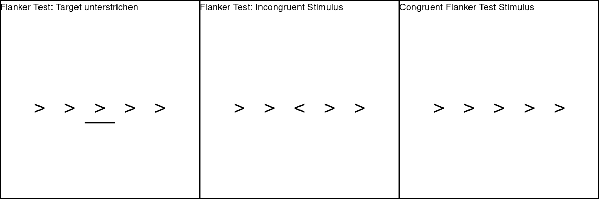

  

<details><summary><b>Themen (CLICK ME)</b></summary>

* [Warum R?](#WarumR) Und nicht SPSS, Excel und co. - Vor- und Nachteile
* [R-(Studio)](#installieren) installieren und kennenlernen
* [Datenhandling](#Datenhandling) - Wie gehe ich mit erhobenen Daten um?
* [Einfache Deskriptivstatistik](#Deskriptivstatistik) - Mittelwert, Standardabweichung und co.

</details>

***

## Einleitende Worte

Dieser Beitrag ist im Rahmen des R Workshops für angehende KliPPs Masterstudierende entstanden. Die hier aufgeführten Inhalte sind alles andere als originell und sollten als Zusammenfassung der [Statistik I](/lehre/main/#statistik-i) und [Statistik II](/lehre/main/#statistik-ii) Beiträge verstanden werden. Der Verdienst gehört den Autoren der Beiträge. Wir empfehlen für eine auführlichere Behandlung der Themen in den entsprechenden Beiträgen nachzulesen.

***

## Warum R? {#WarumR}


***

## R(-Studio) installieren und kennenlernen {#installieren}

### Installation

Obwohl die "Basis" R-Software schon zur Nutzung der gleichnamigen Programmiersprache befähigt, verwenden wir aufgrund der höheren Nutzerfreundlichkeit die integrierte Entwicklungsumgebung RStudio. Beide sind kostenlos erhältlich, beispielsweise bei [Posit](https://posit.co/download/rstudio-desktop/) wo Sie eine übersichtliche Anleitung sowie die Downloadlinks erwarten.

**[Hier klicken, um zu Posit zu gelangen](https://posit.co/download/rstudio-desktop/)**

### Aufbau von RStudio

RStudio besteht aus vier Panels. Oben links befindet sich nach Öffnen einer neuen Skriptdatei (Strg+Shift+n (Mac OS: Cmd+Shift+n) oder über den **New File** Button) das Skript. In R dient dieses nur zur Strukturierung der Syntax, in RStudio kann man diese dort mit Strg+Return (Mac OS: cmd+Return) oder dem **Run** Button ausführen.
Das Resultat erscheint dann in der Konsole unten links.
Oben Rechts finden Sie das Environment. Dies sollte zu Beginn dieses Workshops noch leer sein und sich im Laufe des Tages mit Datensätzen und Objekten füllen. Es kann sein, dass bei einigen von Ihnen die Konsole und das Environment von den Positionen her getauscht sind. Das ist grundsätzlich kein Problem. Wenn Sie die Anordnung so haben wollen wie hier beschrieben können Sie das erreichen, in dem Sie im oberen Teil auf das ,,Fenster''-Symbol links neben ,,Addins'' gehen und ,,Console on Left'' auswählen. 
Zuguterletzt befindet sich unten rechts ein Panel mit mehreren Tabs. Unter Files können Sie durch Ordner Dateien aufindig machen. Grafische Darstellungen erfolgen im Plots Tab. Unter Packages erhalten Sie eine Übersicht der installierten Erweiterungen für R. Der wohl wichtigste Tab ist der Help Tab. In diesem erhalten Sie Hilfe zu R-Funktionen und Packages. 


### R-Studio Settings und Vorteile gegenüber R

#### Settings

Auch wenn man nun schon sofort mit den eigenen Projekten anfangen könnte, kann es hilfreich sein, die Personalisierungsoptionen, die R bietet, auch zu nutzen.
Hier ein kurzer Überblick nützlicher Einstellungen und wo man diese ändert:


|Einstellung            |Änderung                                                         |Beschreibung                                                                                                                                     |
|:----------------------|:----------------------------------------------------------------|:------------------------------------------------------------------------------------------------------------------------------------------------|
|Font Size              |Tools>Global Options>Appearance>Font Size                        |Anpassen der Schriftgröße                                                                                                                        |
|Theme                  |Tools>Global Options>Appearance>Theme                            |Themes beeinflussen Hintergrund- und Schriftfarbe.Idealerweise sollte ein Theme gewählt werden, welches hilft, den Syntax besser zu überblicken. |
|Rainbow Parentheses    |Tools>Global Options>Code>Display>Syntax>Use Rainbow Parentheses |Zusammengehörige Klammern erhalten dieselbe Farbe. Hilft bei der Übersichtlichkeit.                                                              |
|Indentation Guidelines |Tools>Global Options>Code>Display>General>Indentation Guidelines |Die eingerückte Fläche wird farbig markiert. Hilft beim Überblick.                                                                               |

Selbstverständlich gibt es noch etliche weitere Personalisierungsoptionen. Diese sind jedoch zu diesem Zeitpunkt  nicht relevant.

### Arithmetische und logische Operatoren, Objekte und Funktionen

#### Arithmetische und Logische Operatoren

Die Operatoren, die Sie bereits aus der Mathematik kennen, funktionieren so auch in RStudio als Arithmetische Operatoren:


``` r
# Addition
1 + 2
```

```
## [1] 3
```

``` r
# Subtraktion
1 - 2
```

```
## [1] -1
```

``` r
# Multiplikation
1 * 2
```

```
## [1] 2
```

``` r
# Division
(1 + 4) / (2 + 8)
```

```
## [1] 0.5
```

``` r
# Potenz
2 ^ 3
```

```
## [1] 8
```

Bis hierhin waren das alles Beispiele die auch jeder gewöhliche Taschenrechner ausführen könnte. RStudio beherrscht jedoch auch logische Abfragen, deren Ergebnisse **boolesch** - also entweder wahr(TRUE) oder falsch(FALSE)- sind. Wie in vielen anderen Programmiersprachen nutzt man das ! zum negieren.


``` r
# Logische Abfragen
1 == 2 # Ist gleich
```

```
## [1] FALSE
```

``` r
1 != 2 # Ist ungleich
```

```
## [1] TRUE
```

``` r
1 < 2 # Ist kleiner als
```

```
## [1] TRUE
```

``` r
1 > 2 # Ist größer als
```

```
## [1] FALSE
```

``` r
1 <= 2 # Ist kleiner/gleich
```

```
## [1] TRUE
```

``` r
1 >= 2 # Ist größer/gleich
```

```
## [1] FALSE
```

``` r
!(1 == 2) # Ist Klammerinhalt NICHT gleich?
```

```
## [1] TRUE
```

Das ist jetzt zugegebenermaßen noch nicht sonderlich beeindruckend. Etwas später werden wir jedoch lernen, das dies auch auf Daten und nicht nur einzelne Elemente angewendet werden kann.


#### Vektoren

Vektoren sind eindimensionale Datenstrukturen, in denen Elemente des gleichen Typs zusammengeführt werden. Unterschieden wird zwischen folgenden vier Typen:


|Typ       |Kurzform |Inhalt                                  |Beispiel             |
|:---------|:--------|:---------------------------------------|:--------------------|
|logical   |logi     |wahr (TRUE) oder falsch (FALSE)         |TRUE, FALSE          |
|numeric   |num      |Beliebige Zahlen                        |10.5, -5, 0          |
|character |char     |Kombinationen aus Zahlen und Buchstaben |"Hallo Welt", "A1B2" |
|integer   |int      |ganze Zahlen                            |1L, -5L, 0L          |

#### Funktionen

In R gibt man einer Funktion einen Input und erhält einen bestimmten Output zurück. Jede Funktion erledigt hierbei eine bestimmte Aufgabe. Dies hat die Vorteile der Wiederverwendbarkeit, Organisation und Effizienz. Natürlich könnte man den Mittelwert einer Datenmenge manuell berechnen, mit der darauf ausgerichteten Funktion geht es jedoch schneller.


``` r
(34+47+23+90+23+45+89+98)/8
```

```
## [1] 56.125
```

``` r
mean(c(34,47,23,90,23,45,89,98))
```

```
## [1] 56.125
```

In R wird zunächst die Funktion genannt und darauffolgend die Argumente. An diesem Beispiel lässt sich bereits die generelle Struktur von Funktionen in R erkennen:


``` r
# funktion(argument1, argument2, argument3, ...)
# Beispiele:
# mean(x = c(10, 20, 30), trim = 0.1)
# data.frame(spalte1, spalte2, spalte3, ...)
```

#### Zusammenfassung Umgang mit Funktionen


|Beschreibung                  |Code.Stil                               |Beispiel                          |
|:-----------------------------|:---------------------------------------|:---------------------------------|
|Funktionen schachteln         |funktion1(funktion2(argument))          |round(mean(c(1.1, 1.9, 2.5)))     |
|Objekt im Environment anlegen |objekt <- funktion1(argument)           |mittelwert <- mean(c(1, 2, 3, 4)) |
|Ergebnis-Pipe                 |funktion1(argument) &#124;> funktion2() |c(1, 2, 3, 4) &#124;> mean()      |

#### Objekte

In R können Ergebnisse in Objekte angelegt werden und diese wiederum in Funktionen als Argument eingesetzt werden.
Der Zuweisungspfeil (Windows: Alt + -) (Mac OS: Option + -) weist dem Objekt ein Ergebnis zu.


``` r
Mittelwert <- mean(c(34,47,23,90,23,45,89,98))
Mittelwert # oder auch: print(Mittelwert)
```

```
## [1] 56.125
```

Hierbei gibt die Konsole das Objekt erst aus, wenn ich dieses noch einmal benenne oder es als Argument in die `print()`-Funktion einsetze. Bei der Bennenung des Objektes gilt es zu beachten, dass das erste Zeichen keine Zahl sein darf und gleichnamige Objekte überschrieben werden.


Objekte glänzen erst wirklich sobald sie in anderen Funktionen eingesetzt werden:


``` r
x <- c(100, 20, 24, 89, 40)
mean(x) == Mittelwert  # prüft, ob der Mittelwert von x gleich dem Objekte "Mittelwert" ist
```

Eine Alternative ist die **Pipe**. Hierbei wird das Ergebnis nicht als Objekt abgelegt, sondern direkt an eine Funktion weitergegeben.:


``` r
# Beispiel mit Verschachtelung
var(c(89,48,38,29,39,49,54))

# Beispiel Pipe
c(89,48,38,29,39,49,54) |> var()
```

Der Vorteil hiebei ist, dass wir das ganze wieder von links nach rechts lesen können. Auch hier gibt es Möglichkeiten zur Verschachtelung:


``` r
# Berechnung der Standardabweichung aus Varianz heraus
c(89, 48, 38, 29, 39, 49, 54) |> var() |> sqrt()
```


#### Environment

Im Environment finden sich Objekte wieder. Diese lassen sich jedoch auch mit ls() ausgeben:


``` r
ls()
```

```
## [1] "data"        "data3"       "data4"       "figure_path" "Mittelwert"  "pandarize"  
## [7] "x"
```

Entfernen können wir Objekte mit rm(). Dies geschieht jedoch ohne Warnung und ist final.


``` r
rm(Mittelwert)
ls()             # Environment ohne Mittelwert erscheint.
```

```
## [1] "data"        "data3"       "data4"       "figure_path" "pandarize"   "x"
```

``` r
rm(list = ls())  # Enviroment vollständig leeren
ls()
```

```
## character(0)
```


Vor dem Schließen der Software fragt R-Studio häufig, ob man das Environment speichern will.


Dagegen spricht:

1. Übersichtlichkeit: es ist angenehmer mit einer leeren Umgebung zu beginnen.

2. Man prüft direkt ob die Ergebnisse auch für andere reproduzierbar sind. Alles Nötige sollte im Skript passieren.


#### Warnings- vs. Error-Messages 

Okay aber was ist nun, wenn etwas nicht so läuft wie gewollt? Also wenn ein Befehl möglicherweise nicht wie intendiert funktioniert (möglicherweise weil wir ihm falsche Daten gegeben haben) oder etwas die Ausführung/Berechnung eines Wertes nicht ermöglicht? 
Dafür gibt es in RStudio drei Arten von Rückmeldungen: Messages, Warnings und Errors


1.**Messages**: Messages dienen grundsätzlich zur Kommunikation und liefern bspw. Informationen bezüglich des Zustandes einer Funktion.

Beispiel:

``` r
install.packages('psych')
```

```
## Installiere Paket nach ‘C:/Users/Acer/AppData/Local/R/win-library/4.5’
## (da ‘lib’ nicht spezifiziert)
```

``` r
message('Hallo ich bin eine Nachricht. Ich benachrichtige dich über irgendwas, was grad abgeht.')
```

```
## Hallo ich bin eine Nachricht. Ich benachrichtige dich über irgendwas, was grad abgeht.
```


2.**Warning**:Sie erhalten zwar ein Ergebnis, es könnte jedoch etwas schiefgelaufen sein.

Beispiel:

``` r
log(-2)
```

```
## Warning in log(-2): NaNs produced
```

```
## [1] NaN
```

``` r
mean(c("a","b","x","y"))
```

```
## Warning in mean.default(c("a", "b", "x", "y")): argument is not numeric or logical: returning
## NA
```

```
## [1] NA
```

``` r
warning('Ich bin eine Warnmeldung. Über mir steht Warnmeldung und ich weise dich auf etwas hin, was ich mache, was aber vielleicht nicht so von dir gewollt ist.')
```

```
## Warning: Ich bin eine Warnmeldung. Über mir steht Warnmeldung und ich weise dich auf etwas
## hin, was ich mache, was aber vielleicht nicht so von dir gewollt ist.
```
Hier erhalten wir die Warnung, dass NaN (Not a Number) als Ergebnis produziert, da der Logarithmus von -1 nicht im Bereich der reellen Zahlen liegt. Im zweiten Beispiel erhalten wir eine Warnmeldung, weil sich der Mittelwert aus einer Charaktervariable nicht berechnen lässt. Hier kommt auch gleich ein Hinweis darauf, was für einen Input R erwartet: Nämlich entweder numerisch (1,2,40...) oder boolesch (TRUE/FALSE). 

3.**Errors**: Errors entstehen, wenn kein Ergebnis produziert wird. Dies geschieht meist wenn wir der Funktion nicht die richtigen Argumente geben.

Beispiel:

``` r
2+'a'
```

```
## Error in 2 + "a": non-numeric argument to binary operator
```

``` r
lm(NA~NA)
```

```
## Error in terms.formula(formula, data = data): invalid term in model formula
```

``` r
stop('Ich bin ein Fehler. Vor mir steht Fehler und irgendwas ist so falsch, dass ich den Code nicht sinnvoll ausführen kann oder das was du von mir verlangst ist unmöglich. Mich solltest du definitiv beachten und dich um mich kümmern! (Bitte 🥺)')
```

```
## Error: Ich bin ein Fehler. Vor mir steht Fehler und irgendwas ist so falsch, dass ich den Code nicht sinnvoll ausführen kann oder das was du von mir verlangst ist unmöglich. Mich solltest du definitiv beachten und dich um mich kümmern! (Bitte 🥺)
```

Im ersten Fall kommt ein Fehler zustande, da wir versuchen, eine Zahl mit einem Charakter zu addieren, was R nicht sinnvoll umsetzen kann. Der zweite Fehler "ungültiger Term in Modellformel" bedeutet, dass R keine gültigen Daten hat – unsere Vektoren sind leer/es sind keine verwertbaren Daten vorhanden, also kann keine Regression durchgeführt werden.

### Die Help Page und Umgang mit Fehlermeldungen
Der größte Vorteil gegenüber dem Basis R hat Rstudio wahrscheinlich mit der schon angepriesenen Help-Funktion. Sie gibt einem einige grundlegende Informationen zum Input und den Berechnungen einer Funktione und hilft insgesamt, ein Verständnis für eine Funktion zu erhalten. 

Sie ist zu erreichen durch:

1. `?`funktionsname()

2. `help`(Funktionsname)

3. über die Suchfunktion des Help-Tabs

4. F1 Drücken während der Cursor sich über der Funktion befindet


<button type="button" class="btn btn-info" data-toggle="collapse" data-target="#tabelle">Bestandteile der Help Funktion</button>
<div id="tabelle" class="collapse">

|Abschnitt   |Inhalt                                                                                                                                                                                                  |
|:-----------|:-------------------------------------------------------------------------------------------------------------------------------------------------------------------------------------------------------|
|Description |Beschreibung der Funktion                                                                                                                                                                               |
|Usage       |Zeigt die Argumente an, die die Funktion entgegennimmt. Argumente auf die ein = folgt haben Standardeinstellungen und müssen nicht jedes mal aufs Neue definiert werden, Argumente ohne = jedoch schon. |
|Arguments   |Liste der Argumente mit Beschreibung                                                                                                                                                                    |
|Details     |Zusatzinformationen zur Funktion                                                                                                                                                                        |
|Values      |Übersicht über die möglichen Ergebnisinhalte der Funktion                                                                                                                                               |
|See also    |Ähnliche Funktionen                                                                                                                                                                                     |
|Examples    |Praxisbeispiel, Funktion wird angewendet                                                                                                                                                                |
</div>


Generell empfiehlt es sich, die Hinweise zur Benutzung bei einer neuen Funktion sich anzuschauen. Auch bei Fehler- oder Warnmeldungen ist ein Blick in die zusätzlichen Informationen der Hilfe-Funktion sinnvoll, um den Grund für diese Meldungen herauszufinden. Besonders die ,,Arguments'', ,,Details'' und ,,Examples'' Sektionen können hierbei sehr hilfreich sein. 

Alternative Umgangsweisen mit Fehlermeldungen sind zum einen, diese in Google einzugeben. Mit etwas Übung findet man hier erstaunlich oft eine Lösung der entsprechenden Probleme. Mittlerweile stehen auch Large Language Models/KI-Anwendungen zur möglichen Fehlerbehebung zur Verfügung, in welchen man sich mögliche Lösungsvorschläge herausgeben lassen kann. Allerdings ist bei diesen beiden Lösungsstrategien zu beachten, dass diese tendenziell weniger gut funktionieren, je spezifischer ein Thema wird und dass gerade bei KI-generiertem Input sowohl die Korrektheit des Codes als auch Hinweise zum Zitiere geprüft werden müssen. Sie müssen am Ende des Tages den Code verstehen können und sollten entsprechend nicht Blind Code, den Sie nicht verstehen, übernehmen, da hier das hohe Risiko von fehlerhaften Anwendungen resultiert.  


### Beispiel: Flanker Test (Eriksen & Eriksen, 1974) 

Die Nutzung von Vektoren wird im Folgenden am Flanker Test verdeutlicht. Dieser Test prüft die selektive Aufmerksamkeit indem Probanden auf einen Zielreiz in der Mitte einer Reizreihe reagieren, während sie irrelevante, ablenkende Reize (die sogenannten "Flanker") ignorieren.


<!-- -->


#### Ablauf des Flanker Tests:

1. In der Mitte erscheint ein Pfeil (oder Buchstabe) als Zielreiz.

2. Links und rechts davon stehen ablenkende Pfeile, die entweder in dieselbe Richtung (kompatibel) oder in die entgegengesetzte Richtung (inkompatibel) zeigen.

3. Die Aufgabe ist, so schnell wie möglich die Richtung des Zielpfeils anzugeben, ohne sich von den Flanker-Reizen ablenken zu lassen.

4. Ziel: Messung der Reaktionszeit und Genauigkeit

5. Frage: unterscheidet sich die Reaktionsgeschwindigkeit zwischen den Versuchsbedingungen signifikant?


Wir nehmen nun im Folgenden an,
eine Datenreihe gemessen zu haben und diese interpretieren zu wollen.

Zunächst legen wir die Reaktionszeit als numerischen Vektor ab. Hierfür nehmen wir die c()-Funktion:


``` r
# Reaktionszeiten als numerischen Vektor
reaction <- c(600, 520, 540, 680, 560, 590, 620, 630) 
```

Wenn wir nun überprüfen wollen, ob der reaction Vektor auch wirklich als numerical Vektor vorliegt, nutzen wir die class() Funktion:

``` r
# Vektor Klasse anzeigen
class(reaction) 
```

```
## [1] "numeric"
```

Mit der str()-Funktion können wir uns die Elemente des Vektors ausgeben lassen.


``` r
str(reaction) 
```

```
##  num [1:8] 600 520 540 680 560 590 620 630
```

Nun legen wir die Richtung der flankierenden Zeichen fest.


``` r
flankers <- c("<","<",">","<",">",">",">","<")
```

Nun testen wir, ob es sich um einen character Vektor handelt:

``` r
is.character(flankers) 
```

```
## [1] TRUE
```

Vektoren lassen sich in manchen Fällen auch in andere Arten umwandeln:

``` r
reaction_as_char <- as.character(reaction)
reaction_as_char
```

```
## [1] "600" "520" "540" "680" "560" "590" "620" "630"
```


Diese Umwandlung funktioniert. Wir hätten die Reaktionszeiten auch direkt als character Vektor hinterlegen können, indem wir die Werte in Anführungsreichen setzen ("200").

Die Umwandlung vom Character Vektor zu einem Numerical Vektor funktioniert jedoch nicht:

``` r
flankers_as_numeric <- as.numeric(flankers) 
```

```
## Warning: NAs introduced by coercion
```


Da der Flanker Test untersucht ob die Aufmerksamkeit beeinflusst wird wenn die zielzeichen von inkongruenten Zeichen umgeben werden, müssen wir nun überprüfen in welcher Bedingung Kongruentz und in welcher Inkongruenz vorherrscht:


``` r
#  Zielzeichen erstellen
target <- c(">", ">", ">", "<", "<", "<", ">", ">")
# Vergleich von Vektoren (Kongruenz)

cong <- flankers == target 

cong #logischer Vektor
```

```
## [1] FALSE FALSE  TRUE  TRUE FALSE FALSE  TRUE FALSE
```

Dieser logische Vektor zeigt uns, dass es sich nur in Bedingungen 3,4 und 7 um Kongruente Reize handelt. Auch logical Vektoren lassen sich überprüfen:

``` r
is.logical(cong) 
```

```
## [1] TRUE
```

Nun erstellen wir aus dem Flanker Vektor einen Faktor:

``` r
flankers_factorial <- as.factor(flankers) 
#  Ausgabe des Factors
str(flankers_factorial) 
```

```
##  Factor w/ 2 levels "<",">": 1 1 2 1 2 2 2 1
```

Nun lassen wir uns noch die Levels ausgeben:

``` r
levels(flankers_factorial) 
```

```
## [1] "<" ">"
```

Wenn wir nun möchten, dass ">" den Wert 1 erhält, nutzen wir relevel():

``` r
releveled_flankers_factorial <- relevel(flankers_factorial, '>') 
releveled_flankers_factorial 
```

```
## [1] < < > < > > > <
## Levels: > <
```

Im folgenden machen wir aus unserem Faktor einen numerical Vektor. Dies war zuvor mit dem Flankers-Vektor im Character Format nicht mögöich.


``` r
numeric_from_flankers <- as.numeric(flankers_factorial) 
numeric_from_flankers 
```

```
## [1] 1 1 2 1 2 2 2 1
```

Nun steht 1 für "<" und 2 für ">".


``` r
char_from_flankers <- as.character(flankers_factorial) 
char_from_flankers 
```

```
## [1] "<" "<" ">" "<" ">" ">" ">" "<"
```


Wir können den Faktor jedoch auch wieder in einen Character-Vektor umwandeln.

Zu beachten ist, dass beide Umwandlungen Konsequenzen für weiterführende Operatoren haben.


### Datentypen  

Nun haben wir bereits einen Datentypen, den Vektor, kennengelernt. Diese lassen sich auch zusammenführen, je nach Relation zueinander.


|Typ        |Dimensionen |Zusammensetzung             |Anmerkungen                                                                 |
|:----------|:-----------|:---------------------------|:---------------------------------------------------------------------------|
|Matrix     |2           |Vektoren des gleichen Typs  |Bietet sich v.a. für große Datensätze an. Ist eine Sonderform des Arrays.   |
|Array      |n           |Vektoren des gleichen Typs  |-                                                                           |
|Data.Frame |2           |Vektoren der gleichen Länge |Häufigst genutzte Variante in der Psychologie. Ist eine Sonderform der List |
|List       |1           |Beliebige Objekte           |-                                                                           |

##### Erstellen einer Matrix


``` r
# Erstellen von 2 Vektoren des gleichen Typs
age1 <- c(30,71,33,28,19)
age2 <- c(98,4,67,43,21)
matrix1 <- cbind(age1, age2)
matrix2 <- rbind(age1, age2)
matrix3 <- matrix(data= c(age1, age2), ncol=2, byrow=TRUE)

matrix1 # die Vektoren werden als columns angeordnet
```

```
##      age1 age2
## [1,]   30   98
## [2,]   71    4
## [3,]   33   67
## [4,]   28   43
## [5,]   19   21
```

``` r
matrix2 # die Vektoren werden als rows angeordnet
```

```
##      [,1] [,2] [,3] [,4] [,5]
## age1   30   71   33   28   19
## age2   98    4   67   43   21
```

``` r
matrix3 # design wird durch Argumente ncol, nrow und byrow im Matrix-Befehl bestimmt
```

```
##      [,1] [,2]
## [1,]   30   71
## [2,]   33   28
## [3,]   19   98
## [4,]    4   67
## [5,]   43   21
```
Da für eine Matrix alle Vektoren den gleichen Typ haben müssen, gleicht cbind sie in den allgemeinsten Fall an.


``` r
job <- c("Pfegefachkraft", "Elektroniker","Grundschullehrer","Rettungssanitäter","Redakteur")
burnout <- c(TRUE,FALSE,FALSE,FALSE,TRUE)

matrix4 <- cbind(age1,job,burnout)

# Alle 3 Vektoren nun char, also keine mathematischen Berechnungen nun mehr möglich
matrix4
```

```
##      age1 job                 burnout
## [1,] "30" "Pfegefachkraft"    "TRUE" 
## [2,] "71" "Elektroniker"      "FALSE"
## [3,] "33" "Grundschullehrer"  "FALSE"
## [4,] "28" "Rettungssanitäter" "FALSE"
## [5,] "19" "Redakteur"         "TRUE"
```


Da wir nun die Möglichkeit verloren haben num1 als numerischen Vektor zu nutzen, erstellen wir nun aus den selben Vektoren einen `data.frame`. In diesen bleiben die Vektoren Typen erhalten.

``` r
df1 <- data.frame(age1,job,burnout)
df1
```

```
##   age1               job burnout
## 1   30    Pfegefachkraft    TRUE
## 2   71      Elektroniker   FALSE
## 3   33  Grundschullehrer   FALSE
## 4   28 Rettungssanitäter   FALSE
## 5   19         Redakteur    TRUE
```

``` r
##Listet Variablen und Typ auf
str(df1)
```

```
## 'data.frame':	5 obs. of  3 variables:
##  $ age1   : num  30 71 33 28 19
##  $ job    : chr  "Pfegefachkraft" "Elektroniker" "Grundschullehrer" "Rettungssanitäter" ...
##  $ burnout: logi  TRUE FALSE FALSE FALSE TRUE
```


#### Indizieren

Indizieren bedeutet, dass wir zwar auf bestimmte Elemente eines Objekts zugreifen, ohne diese aus dem Objekt zu entfernen. Das Objekt bleibt weiterhin so bestehen, jedoch kann es manipuliert werden z.B. indem wir Werte ersetzen, Zeilen/Spalten ansprechen oder nach Bedingungen filtern.
Hierfür nutzen wir eckige Klammern (Windows: Str+Alt+8) (Mac OS: Option+5). Dies geschieht nach dem Muster: daten[rows,columns]


``` r
# Zugriff auf den 4. Eintrag der Spalte age1
df1[4, 'age1'] 
```

```
## [1] 28
```

``` r
# Der vierte Eintrag der Spalte 'age1' auf 20 setzen (verändert Ursprungsdateb)
df1[4, 'age1'] <- 20 

# Ganze Spalte 'age1' anzeigen, um die Änderung zu sehen
df1[,'age1'] 
```

```
## [1] 30 71 33 20 19
```

``` r
# Erstellen einer neuen Spalte 'no_burnout', die das Gegenteil der Spalte 'burnout' darstellt - über die Sinnhaftigkeit machen wir uns hier mal lieber keine Gedanken
df1$no_burnout <- !df1$burnout


# Hinzufügen einer sechsten Zeile (Änderung am Datensatz)
df1[6,] <- data.frame(
  age1 = 42, 
  job = "Friseur", 
  burnout = TRUE, 
  no_burnout = TRUE)

# Entfernen dieser eben geschaffenen sechsten Zeile
df1 <- df1[-6,]
# Zugriff auf die 5. Zeile und die 4. Spalte (ohne Extraktion)
df1[5, 4]
```

```
## [1] FALSE
```

``` r
# Zugriff auf die gesamte 1. Zeile
df1[1, ]
```

```
##   age1            job burnout no_burnout
## 1   30 Pfegefachkraft    TRUE      FALSE
```

``` r
# Zugriff auf die 1. Spalte
df1[, 1]
```

```
## [1] 30 71 33 20 19
```

``` r
# Zugriff auf die 2. und 3. Zeile, 3. Spalte
df1[c(2, 3), 3]
```

```
## [1] FALSE FALSE
```

``` r
# Zugriff auf alle Zeilen, in denen 'burnout' TRUE ist
df1[df1$burnout, ]
```

```
##   age1            job burnout no_burnout
## 1   30 Pfegefachkraft    TRUE      FALSE
## 5   19      Redakteur    TRUE      FALSE
```

#### Datenextraktion 

In Anderen Fällen extrahiert (entnimmt) man die Daten aus dem Objekt, um sie in einem seperaten Objekt zu speichern. Dies ist hilfreich, wenn wir die entnommenen Daten analysieren wollen, ohne das Ursprungsobjekt zu verändern.

Dies exerzieren wir nun erstmal an der zuvor erstellten Variable age1 durch.


``` r
# age1 ausgeben lassen
str(age1)
```

```
##  num [1:5] 30 71 33 28 19
```

Wir wissen nun, dass age1 ein numerischer Vektor mit 5 Elementen ist. Wir lassen uns nun das 5. Element ausgeben.

``` r
# das 5.Element von age1 ausgeben lassen- jedoch nicht verändern
age1[5]
```

```
## [1] 19
```

Wir können uns die Variable jedoch auch ohne das 5. Element ausgeben lassen:

``` r
# age1 ohne Element 5 ausgeben lassen
age1[-5]
```

```
## [1] 30 71 33 28
```


Wir können uns auch eine Auswahl an Elementen ausgeben lassen. Dies gelingt indem wir einem Objekt einen numerischen Vektor zuweisen und dieses Objekt dann in den eckigen Klammern nutzen.


``` r
# sich eine Auswahl ausgeben lassen
auswahl <- c(1, 3, 5)
age1[auswahl]
```

```
## [1] 30 33 19
```

``` r
# Auswahl in neuem Objekt abspeichern
age_select<-age1[auswahl]
```


Das funktioniert natürlich auch geschachtelt.


``` r
# verschachtelt eine Auswahl ausgeben lassen
age1[c(1, 3, 5)]
```

```
## [1] 30 33 19
```


Wir können auch abrufen, welche Elemente eines character vektors TRUE oder FALSE sind.


``` r
!(df1$burnout)
```

```
## [1] FALSE  TRUE  TRUE  TRUE FALSE
```

``` r
# Abrufen der Job-Bezeichnungen für die Personen, die einen Burnout haben (TRUE)
df1$job[df1$burnout]
```

```
## [1] "Pfegefachkraft" "Redakteur"
```

``` r
# Abrufen der Job-Bezeichnungen für Personen ohne Burnout (FALSE)
df1$job[!df1$burnout]
```

```
## [1] "Elektroniker"      "Grundschullehrer"  "Rettungssanitäter"
```

``` r
# Auch dies kann wieder in Objekte abgelegt werden
job_nburn <- df1$job[!df1$burnout]
```


``` r
# 5. Zeile, 4. Spalte ausgeben lassen
df1[5, 4]
```

```
## [1] FALSE
```


``` r
df1[1, ]          # 1. Zeile, alle Spalten
```

```
##   age1            job burnout no_burnout
## 1   30 Pfegefachkraft    TRUE      FALSE
```

``` r
df1[, 1]          # Alle Zeilen, 1. Spalte
```

```
## [1] 30 71 33 20 19
```

``` r
df1[c(2, 3), 3]   # 2. und 3. Zeile, 3. Spalte
```

```
## [1] FALSE FALSE
```

``` r
df1[burnout, ]    # Alle kongruenten Zeilen, alle Spalten
```

```
##   age1            job burnout no_burnout
## 1   30 Pfegefachkraft    TRUE      FALSE
## 5   19      Redakteur    TRUE      FALSE
```


``` r
nrow(df1)    # Anzahl der Zeilen
```

```
## [1] 5
```

``` r
ncol(df1)    # Anzahl der Spalten
```

```
## [1] 4
```

``` r
dim(df1)     # Alle Dimensionen
```

```
## [1] 5 4
```


``` r
names(df1)   # Namen der Variablen
```

```
## [1] "age1"       "job"        "burnout"    "no_burnout"
```


``` r
df1[, 'age1']                # Einzelne Variable auswählen
```

```
## [1] 30 71 33 20 19
```

``` r
df1[, c('age1', 'burnout')]  # Mehrere Variable auswählen
```

```
##   age1 burnout
## 1   30    TRUE
## 2   71   FALSE
## 3   33   FALSE
## 4   20   FALSE
## 5   19    TRUE
```

``` r
df1$age1                     # eine Variable indizieren
```

```
## [1] 30 71 33 20 19
```


#### Daten Import und Export 

Ähnlich wie wenn man ein word Dokument speichert und in seinem eigenen Dateispeicher einen geeigneten Ort zum speichern suchen muss, benötigt auch R eine Angabe dazu, wo Daten und Syntax hinterlegt werden soll. Dieser Ort kann R als working Directory mitgeteilt werden. Um das aktuelle Working Directory zu erhalten, kann man die Funktion `getwd()` nutzen.


``` r
getwd()
```

```
## [1] "/home/martin/pandar/content/workshops/refresher"
```

Der hat wahrscheinlich das Format C:/Users/Name/Documents. Um manuell einen anderen Ordner zu nutzen, kann dieser mit `setwd()` festgelegt werden:


``` r
# setwd('Pfad/Zum/Ordner')
```

Der Inhalt eines Ordners lässt sich mit `dir()` ausgeben.


``` r
dir()
```

R hat zwei eigene Datenformate mit denen Dateien abgespeichert werden können: RDA und RDS.


|Dateiformat     |Dateiendung    |Speichern     |Laden        |Einsatzort                                    |
|:---------------|:--------------|:-------------|:------------|:---------------------------------------------|
|RDA             |.rda           |save()        |load()       |gemeinsames Speichern mehrerer Objekte        |
|RDS             |.rds           |saveRDS()     |readRDS()    |Speichern einzelner Objekte (z.B. Datensätze) |
|Klartextformate |.txt oder .dat |write.table() |read.table() |Textbasierte Speicherung und Laden            |
|CSV             |.csv           |write.csv()   |read.csv()   |Tabellendaten im CSV-Format                   |


Dies probieren wir nun mit unserem df1 Datensatz:


``` r
save(df1, file = 'df1.rda')
```

Um zu testen, ob wir ihn auch wieder abrufen können, leeren wir nun erstmal das Environment:


``` r
rm(list = ls())
ls()
```

```
## character(0)
```

Wenn wir jetzt den Datensatz laden, wird er mit seiner Originalbenennung (df1) wiederhergestellt:


``` r
load('df1.rda')
ls()
```

```
## [1] "df1"
```

Jetzt durchlaufen wir die gleichen Schritte noch einmal mit dem RDS Format:


``` r
saveRDS(df1, 'df1.rds')
rm(list = ls())
ls()
```

```
## character(0)
```

Beim Laden des Datensatzes können wir diesen jetzt einem beliebigen Objekt zuweisen:


``` r
work <- readRDS('df1.rds')
work
```

```
##   age1               job burnout no_burnout
## 1   30    Pfegefachkraft    TRUE      FALSE
## 2   71      Elektroniker   FALSE       TRUE
## 3   33  Grundschullehrer   FALSE       TRUE
## 4   20 Rettungssanitäter   FALSE       TRUE
## 5   19         Redakteur    TRUE      FALSE
```

Für eine erste Dateninspektion eignen sich die folgenden Funktionen:


``` r
nrow(work)    # Anzahl der Zeilen
```

```
## [1] 5
```

``` r
ncol(work)    # Anzahl der Spalten
```

```
## [1] 4
```

``` r
dim(work)     # Alle Dimensionen
```

```
## [1] 5 4
```

``` r
names(work)   # Namen der Variablen
```

```
## [1] "age1"       "job"        "burnout"    "no_burnout"
```


***

## Datenhandling {#Datenhandling}

### Pakete

Packages sind Sammlungen von Funktionen, Datensätzen und Dokumentationen, die man zusätzlich zu denen in der System Library herunterladen kann. Jedes Paket wurde hierbei für bestimmte Aufgaben entwickelt. Das hat zum Einen den Vorteil, dass man nur die packages herunterladen muss, die man auch wirklich benötigt, und zum Anderen, muss nicht immer das gesamte R geändert werden sobald sich ein package aktualisiert.

Der tab mit den packages befindet sich in dem Panel unten rechts zwischen "plots" und "help". Hier wird ersichtlich, dass es neben der System Library mit den vorinstallierten Paketen noch die User Library mit den manuell hinzugefügten packages gibt.

Zwar finden wir im Tab oben links den "Install"-Button, der ein weiteres Fenster zum Installieren der packages öffnet, jedoch ist es ratsam, die Installation der packages im Skript durchzuführen. Somit bleibt das Skript für jeden der es erhält ausführbar, unabhängig von der eigenen User Library.

Für das Herunterladen und Abrufen der Packages nutzen wir install.packages() und library().


``` r
install.packages("psych")
library(psych)
```
Das hier zu demonstrationszwecken verwendete psych-package wurde speziell für psychologische Analysen entwickelt. Im Verlaufe des Seminars werden Sie jedoch noch weitere packages kennenlernen.


### Faktoren erstellen 

In einem früheren Abschnitt erstellten wir aus einem Vektor einen Factor. Dies funktioniert auch mit Variablen aus Datensätzen.

Für unser Beispiel laden wir den Datensatz zu dem Fragebogen, den wir soeben für diesen Zweck ausgefüllt wird.

Beim Befehl `install.packages` ist der Zusatz `repos = "https://cloud.r-project.org"` nur manchmal bei der Nuzung von Markdown nötig, ansonsten kann dieser ausgelassen werden.


``` r
library(readxl)
workshopfb<-read_excel( 
  path = "../../daten/pretest.xlsx",
  sheet = 1, # Läd das erste Arbeitsblatt. Ändere dies, falls nötig.
  col_names = TRUE # Geht davon aus, dass die erste Zeile die Variablennamen enthält
)
```
Nun erscheint unser Datensatz unter dem Namen, den wir ihm zugewiesen haben. Zunächst entfernen wir die Variablen nicht benötigen:


``` r
library(dplyr) 
workshopfb <- workshopfb %>% select(-REF,
                          -MODE,
                          -SERIAL,
                          -QUESTNNR,
                          -TIME_RSI,
                          -STARTED,
                          -MAILSENT,
                          -LASTDATA,
                          -STATUS,
                          -FINISHED,
                          -Q_VIEWER,
                          -LASTPAGE,
                          -MAXPAGE,
                          -TIME001,
                          -TIME002,
                          -TIME003,
                          -TIME004,
                          -TIME005,
                          -TIME006,
                          -MISSING,
                          -MISSREL,
                          -TIME_SUM,
                          -T002,##Alter: kann nur ja sein
                          -T003)##Einverständnis: kann nur ja sein
```

Im folgenden werden wir diese Variablen erstmal umbenennen, da F001-F014 als Namen nicht sonderlich aussagekräftig und nur schlecht merkbar sind. Hierfür nutzen wir das dplyr-Paket.


``` r
# Stellen Sie sicher, dass das dplyr-Paket geladen ist
library(dplyr) 

workshopfb <- workshopfb%>%
  rename(
    auge = F001,
    rumination = F011_01,
    worry = F011_02,
    belastungt1 = F011_03,
    belastungt2 = F011_04,
    kompetenz = F011_05,
    hartnäckigkeit = F011_06,
    nerd = F004_01,
    intelligenz = F004_02,
    extraversion = F004_03,
    narz = F004_04,
    mach = F004_05,
    psycho = F004_06,
    ffm = F002_01,         
    spick = F002_02,       
    intoleranz = F002_03,  
    allergie = F002_04,    
    heimat = F003_01,      
    akku = F013_01,
    highscore = F014_01,
    entscheidung = F012,     
    dioptrien_links = F006_01,
    dioptrien_rechts = F006_02
  )

# Ausgabe der neuen Spaltennamen zur Überprüfung:
names(workshopfb)
```

```
##  [1] "CASE"             "auge"             "ffm"              "spick"           
##  [5] "intoleranz"       "allergie"         "heimat"           "nerd"            
##  [9] "intelligenz"      "extraversion"     "narz"             "mach"            
## [13] "psycho"           "dioptrien_links"  "dioptrien_rechts" "rumination"      
## [17] "worry"            "belastungt1"      "belastungt2"      "kompetenz"       
## [21] "hartnäckigkeit"   "entscheidung"     "akku"             "highscore"
```

Eine kurze Erläuterung der Variablenbedeutungen:
  
  - `rumination`:Neigung, Gedanken und Ereignisse in meinem Kopf immer wieder durchzugehen
  - `worry`: Neigung sich über in der Zukunft liegenden Ereignisse Sorgen zu machen
  - `belastungt1`: Belastung durch Studium/Arbeit vor einem Jahr
  - `belastungt2`: Belastung durch Studium/Arbeit jetzt
  - `kompetenz`: Überzeugung schwierige Probleme mit adäquater ANstrengung bewältigen zu können
  - `hartnäckigkeit`: Fähigkeit, auch bei der Konfrontation mit Widerstand, Wege zu finden, um Probleme zu lösen
  - `entscheidung`: Modus in dem wichtige Entscheidungen getroffen werden (privat/beruflich)
  - `intelligenz`: eingeschätze Intelligenz im Vergleich zu anderen Teilnehmern
  - `extraversion`: selbsteingeschätze Extraversion
  - `nerd`: selbsteingeschätze nerdiness
  - `mach`: selbsteingeschätzer Machiavellismus
  - `narz`: selbsteingeschätzer Narzissmus
  - `psycho`:selbsteingeschätzer Psychotizismus
  - `ffm`: Wohnen in oder außerhalb Frankfurts
  - `heimat`:Entfernung zur Heimat in km
  - `spick`: schon mal in der Uni gespickt
  - `ìntoleranz`: Lebensmittelintoleranz
  - `allergie`: Lebensmittelintoleranz
  - `akku`: derzeitiger Handyakkustand
  - `promille`: eigene Rekordpromille
  - `dioptrien`: Dioptrien (gesondert für linkes Auge und rechtes Auge)
  - `auge`: Augenfarbe


Eine Ausprägung von 100 auf der Variable `extraversion`  hieße also zum Beispiel, dass die Person sich sehr stark extravertierter einschätzt als die anderen Fragebogenteilnehmer. 50 hieße dementsprechend, dass sich die Person in etwa genauso extravertiert einschätzt wie die anderen Teilnehmenden.


Betrachten wir nun einfach mal die Variable `heimat`.


``` r
str(workshopfb$heimat)
```

```
##  chr [1:7] "Heimat: [01]" "13" "9273" "1" "06069" "1699" NA
```

Wir sehen, dass die Variable noch als character (also als Begriff nicht als Zahl ("12" statt 12) hinterlegt ist) hinterlegt ist. Das ist nicht sonderlich sinnig. Da unser Fragebogen komplett aus numerisch oder faktoriell angedachten Variablen und nicht Freitextfeldern besteht, wandeln wir nun mithilfe vom `dplyr`package alle Variabeln in numeric Variabeln um. Dies überprüfen wir dann mit dem Befehl `str`.


``` r
workshopfb <- workshopfb %>%
  mutate(across(everything(), ~as.numeric(trimws(.))))
str(workshopfb)
```

```
## tibble [7 × 24] (S3: tbl_df/tbl/data.frame)
##  $ CASE            : num [1:7] NA 5 6 7 8 11 12
##  $ auge            : num [1:7] NA 3 1 4 2 3 -9
##  $ ffm             : num [1:7] NA 1 2 -9 1 2 -9
##  $ spick           : num [1:7] NA 2 1 2 2 2 -9
##  $ intoleranz      : num [1:7] NA 1 2 1 2 2 -9
##  $ allergie        : num [1:7] NA 2 2 1 2 2 -9
##  $ heimat          : num [1:7] NA 13 9273 1 6069 ...
##  $ nerd            : num [1:7] NA 71 63 56 101 74 -9
##  $ intelligenz     : num [1:7] NA 85 101 75 1 60 -9
##  $ extraversion    : num [1:7] NA 5 58 76 2 12 -9
##  $ narz            : num [1:7] NA 101 45 24 101 11 -9
##  $ mach            : num [1:7] NA 101 101 11 101 11 -9
##  $ psycho          : num [1:7] NA 101 101 101 101 27 -9
##  $ dioptrien_links : num [1:7] NA NA 0 NA NA 0 NA
##  $ dioptrien_rechts: num [1:7] NA NA 0 NA NA 0 NA
##  $ rumination      : num [1:7] NA 47 51 96 101 101 1
##  $ worry           : num [1:7] NA 29 84 33 101 101 -9
##  $ belastungt1     : num [1:7] NA 64 48 101 101 51 -9
##  $ belastungt2     : num [1:7] NA 25 63 93 101 29 -9
##  $ kompetenz       : num [1:7] NA 82 75 8 101 101 -9
##  $ hartnäckigkeit  : num [1:7] NA 20 80 11 101 43 -9
##  $ entscheidung    : num [1:7] NA 2 -1 -1 -1 1 -9
##  $ akku            : num [1:7] NA 36 101 56 61 54 -9
##  $ highscore       : num [1:7] NA 3 3.4 2 4.9 0.5 NA
```

``` r
#Faktoren und numerical erstellen aus den dichotomen Variablen
workshopfb <- workshopfb %>%
  mutate(
    ffm_num = ifelse(ffm == 1, 1, ifelse(ffm == 2, 0, NA)),
    ffm_fac = factor(ffm_num, levels = c(0, 1), labels = c("Nein", "Ja")),
    
    spick_num = ifelse(spick == 1, 1, ifelse(spick == 2, 0, NA)),
    spick_fac = factor(spick_num, levels = c(0, 1), labels = c("Nein", "Ja")),
    
    intoleranz_num = ifelse(intoleranz == 1, 1, ifelse(intoleranz == 2, 0, NA)),
    intoleranz_fac = factor(intoleranz_num, levels = c(0, 1), labels = c("Nein", "Ja")),
    
    allergie_num = ifelse(allergie == 1, 1, ifelse(allergie == 2, 0, NA)),
    allergie_fac = factor(allergie_num, levels = c(0, 1), labels = c("Nein", "Ja"))
  )

# Die Variable 'entscheidung' in einen Faktor umwandeln
workshopfb$entscheidung <- factor(
  case_when(
    workshopfb$entscheidung == 1 ~ "Intuition und Bauchgefühl",
    workshopfb$entscheidung == 2 ~ "Logik, Analyse und Abwägen von Fakten",
    workshopfb$entscheidung == -1 ~ "ChatGPT",
    workshopfb$entscheidung == -9 ~ NA_character_
  ),
  levels = c(
    "Intuition und Bauchgefühl",
    "Logik, Analyse und Abwägen von Fakten",
    "ChatGPT"
  )
)
str(workshopfb$entscheidung)
```

```
##  Factor w/ 3 levels "Intuition und Bauchgefühl",..: NA 2 3 3 3 1 NA
```

``` r
table(workshopfb$entscheidung, useNA = "ifany") 
```

```
## 
##             Intuition und Bauchgefühl Logik, Analyse und Abwägen von Fakten 
##                                     1                                     1 
##                               ChatGPT                                  <NA> 
##                                     3                                     2
```

Betrachten wir einfach mal die Variable `akku`.

Da Sosci uns beim Download die VAS skalierten Daten mit einer Spanne von 1-101 statt wie gewollt 0-100. Das lässt sich aber einfach ändern.


``` r
range(workshopfb$akku, na.rm=T)
```

```
## [1]  -9 101
```
Da Sosci uns beim Download die VAS skalierten Daten mit einer Spanne von 1-101 statt wie gewollt 0-100. Das lässt sich aber einfach ändern.


``` r
workshopfb$nerd <- workshopfb$nerd - 1
workshopfb$intelligenz <- workshopfb$intelligenz - 1
workshopfb$worry <- workshopfb$worry - 1
workshopfb$rumination <- workshopfb$rumination - 1
workshopfb$mach <- workshopfb$mach - 1
workshopfb$narz <- workshopfb$narz - 1
workshopfb$psycho<- workshopfb$psycho - 1
workshopfb$extraversion<- workshopfb$extraversion - 1
workshopfb$belastungt1<- workshopfb$belastungt1 - 1
workshopfb$belastungt2<- workshopfb$belastungt2 - 1
workshopfb$hartnäckigkeit<- workshopfb$hartnäckigkeit - 1
workshopfb$kompetenz<- workshopfb$kompetenz - 1
```

Allerdings kommt es eher selten vor, dass kontinuierliche Variablen willkürlich in Kategorien unterteilt werden müssen. Deswegen folgt nun ein Beispiel, in dem schon Kategorien vorliegen.


``` r
workshopfb$auge <- factor(workshopfb$auge, 
                        levels = c("braun", "blau", "grün", "andere"), 
                        labels = c("braun", "blau", "grün", "andere")
```

### NAs rausschmeißen 

#### Weswegen treten NA'S auf?
- Fragen überlesen / nicht gesehen
- Antwort verweigert
- Unzulässige Angaben gemacht (im Papierformat)
- Unleserliche Schrift (im Papierformat)

#### Weshalb sind sie problematisch?

Für statistische Analysen sind fehlende Werte ein Problem, weil sie außerhalb der zulässigen Antworten liegen.

``` r
##allen sagen, dass sie bei Legalisierung gar nicht antworten sollen wenn es 0 gramm sind
# gibt NA zurück
mean(workshopfb$dioptrien_rechts)
```

```
## [1] NA
```

Dies ist verständlicherweise nicht zielführend für unsere Analysen. In R kann man NA's auf zwei Ebenen angehen:


|Ebene             |Funktion     |Beschreibung                                                                                                                                                                                                                                                                                                                      |Beispiel                                                                                                                                                |
|:-----------------|:------------|:---------------------------------------------------------------------------------------------------------------------------------------------------------------------------------------------------------------------------------------------------------------------------------------------------------------------------------|:-------------------------------------------------------------------------------------------------------------------------------------------------------|
|global(Datensatz) |na.omit      |Entfernt jede Beobachtung, die mind. ein NA enthält.                                                                                                                                                                                                                                                                              |Jeder Proband, der mind. eine Frage nicht beantwortet, wird ausgeschlossen.                                                                             |
|lokal(Variable)   |na.rm = TRUE |Das Argument na.rm ist in vielen Funktionen für univariate Statistiken enthalten. Per Voreinstellung wird NA als Ergebnis produziert, wenn fehlende Werte vorliegen. Fehlende Werte werden nur für diese eine Analyse ausgeschlossen, wenn sie auf der darin untersuchten Variable keinen Wert haben - Datensatz bleibt erhalten. |Beispiel: Ein Proband hat zwar seine Dioptrien nicht angegeben, wird aber dennoch bei der Korrelation zwischen Nerdiness und Intoleranz mit einbezogen. |

Bevor wir uns für eine Methode entscheiden, müssen wir aber erstmal versuchen, ob unser Datensatz NA's hat und wenn ja, auf welchen Variablen:


``` r
# Unterschiedliche Möglichkeiten NA's abzufragen
is.na(workshopfb)          # gibt TRUE/FALSE für jede einzelne Zelle aus
anyNA(workshopfb)          # gibt es mindestens ein NA?
sum(is.na(workshopfb))     # wieviele NA's gibt es insgesamt im Datensatz?
complete.cases(workshopfb) # Welche Zeilen sind vollständig?
```


``` r
# Zeigt die Anzahl fehlender Werte pro Spalte an
colSums(is.na(workshopfb))
```

```
##             CASE             auge              ffm            spick       intoleranz 
##                1                1                1                1                1 
##         allergie           heimat             nerd      intelligenz     extraversion 
##                1                2                1                1                1 
##             narz             mach           psycho  dioptrien_links dioptrien_rechts 
##                1                1                1                5                5 
##       rumination            worry      belastungt1      belastungt2        kompetenz 
##                1                1                1                1                1 
##   hartnäckigkeit     entscheidung             akku        highscore          ffm_num 
##                1                2                1                2                3 
##          ffm_fac        spick_num        spick_fac   intoleranz_num   intoleranz_fac 
##                3                2                2                2                2 
##     allergie_num     allergie_fac 
##                2                2
```

Wir erfahren, dass die Variablen `XX`und `Dioptrien_links` NA's enthalten. Wenn wir dem Global Approach folgen wollen, dann können wir mit `na.omit()` ein neues Objekt mit dem bereinigten Datensatz erschaffen.


``` r
# Entfernt alle Zeilen, die NAs enthalten
workshopfb_clean1 <- na.omit(workshopfb)
dim(workshopfb_clean1)
```

```
## [1]  2 32
```

Wir können aber auch nur die Einträge löschen, die auf einer bestimmten Variable (nämlich die, die wir untersuchen wollen) löscht.


``` r
# Nur Zeilen mit fehlenden Werten in einer bestimmten Spalte entfernen:
workshopfb_clean2 <- workshopfb[!is.na(workshopfb$dioptrien_links), ]
dim(workshopfb_clean2) # behält mehr observations bei
```

```
## [1]  2 32
```


### Subsets erstellen

Anstatt den ganzen Datensatz zu betrachten, ist es oft sinnig Subsets zu erstellen, die mit logischen oder artithmetischen Operatoren eine Teilstichprobe abspalten.


``` r
# Subset von XX
workshopfb_subset <- workshopfb[workshopfb$ffm == 1, ]

# Ergebnis anzeigen
workshopfb_subset

# mehr als 50 narz mio UND FFM
workshopfb_subset2 <- workshopfb[workshopfb$narz> 49 & workshopfb$ffm == 1, ]
workshopfb_subset2
```


***

## Einfache Deskriptivstatistik {#Deskriptivstatistik}

### Übersicht

Skala | Aussage | Transformation | Zentrale Lage | Dispersion |
--- | ------------ | -------- | ---------- | ----------------- |
Nominal | Äquivalenz | eineindeutig | [Modus](#Modus) | Relativer Informationsgehalt |
Ordinal | Ordnung | monoton | [Median](#Median) | [Interquartilsbereich](#IQB) |
Intervall | Verhältnis von Differenzen | positiv linear | [Mittelwert](#Mean) | [Varianz](#Var), Standardabweichung |
Verhältnis | Verhältnisse | Ähnlichkeit | ... | ... |
Absolut | absoluter Wert | Identität | ... | ... |


### Nominal- und Ordinalskalierte Daten

#### Häufigkeitstabellen

Eine deskriptivstatistische Möglichkeit zur Darstellung diskreter (zählbarer) nominalskalierter Variablen sind Häufigkeitstabellen. Diese können in `R` mit der Funktion `table()` angefordert werden.

**Absolute Häufigkeiten**

``` r
table(workshopfb$auge)
```

```
## 
## -9  1  2  3  4 
##  1  1  1  2  1
```

**Relative Häufigkeiten**

Relative Häufigkeiten können aus absoluten Häufigkeiten abgeleitet werden:

$h_j = \frac{n_j}{n}$

In R können wir das mit Hilfe der `prop.table()`-Funktion bewerkstelligen:


``` r
table(workshopfb$auge) |> prop.table()
```

```
## 
##        -9         1         2         3         4 
## 0.1666667 0.1666667 0.1666667 0.3333333 0.1666667
```

#### Modus {#Modus}

Den Modus, also die Ausprägung einer Variable die am häufigsten vorkommt können wir dann direkt aus einer solchen Häufigkeitstabelle ablesen


``` r
table(workshopfb$auge)
```

```
## 
## -9  1  2  3  4 
##  1  1  1  2  1
```

oder mit Hilfe einer weiteren Funktion direkt ausgeben lassen


``` r
table(workshopfb$auge) |> which.max()
```

```
## 3 
## 4
```

Der Modus der Variable `auge` lautet braun, die Ausprägung trat 2-mal auf. ##aktualisieren

#### Relativer Informationsgehalt

Da es keine einfache Funktion in R für die Berechnung des relativen Informationsgehalts gibt verweisen wir sie auf das [entsprechende Kapitel](/lehre/statistik-i/deskriptiv-nominal-ordinal/) auf pandaR. Dort wird die manuelle Berechnung anhand der Formel mit `R` als Taschenrechner gezeigt.

#### Median {#Median}

Der Median lässt sich mit Hilfe der gleichnamigen Funktion (`median()`) in R ganz einfach berechnen. Zunächst reduzieren wir unseren Datensatz auf Personen ohne Lebensmittelintoleranz.


``` r
workshopfb_no_into <- subset(workshopfb, subset = intoleranz == 1)

median(workshopfb_no_into$akku)
```

```
## [1] 46
```

Die median Akkustand aller befragten Personen ohne Lebensmittelintoleranz.

#### Interquartilsbereich {#IQB}

Bei ordinalskalierten Daten wird häufig der Interquartilsbereich (IQB) als Dispersionsmaß gewählt. IQB ist der Bereich zwischen dem 1. und 3. Quartil.

Um die Quartile oder jedes beliebige andere Quantil einer Verteilung zu erhalten, kann die Funktion `quantile()` verwendet werden. Beispielsweise können wir die Grenzen des IQB und den Median mit folgender Eingabe gleichzeitig abfragen.


``` r
workshopfb_no_into$akku <- as.numeric(workshopfb_no_into$akku)
quantile((workshopfb_no_into$akku),
         c(0.25, 0.5, 0.75),
         na.rm = TRUE)
```

```
## 25% 50% 75% 
##  41  46  51
```

Der IQB liegt also zwischen xx und xx.

Aufmerksamen Lesern könnte schon aufgefallen sein das es sich bei der Variable `akku` nicht um eine ordinalskalierte Variable handelt sondern um eine mindestens intervallskalierte, ja gar absolutskaliert Variable. Für die Berechnung des Medians und IQBs stellt dies jedoch kein Problem dar, da Maße der zentralen Tendenz und Dispersionsmaße von niedrigeren Skalenniveaus auch bei höheren angwendet werden können. Es werden dann halt nicht alle Informationen vollends genutzt.


### Intervallskalierte Daten

#### Mittelwert {#Mean}

Auch die Berechnung des Mittelwerts ist in R mit Hilfe einer Funktion möglich. Diese heißt wie man vielleicht erwarten könnte `mean()`.


``` r
mean(workshopfb_no_into$akku)
```

```
## [1] 46
```

#### Varianz {#Var}

Auch für die Varianz und Standardabweichung haben wir zwei intuitive Funktionen, `var()`und `sd()`.


``` r
var(workshopfb_no_into$akku)
```

```
## [1] 200
```

``` r
sd(workshopfb_no_into$akku)
```

```
## [1] 14.14214
```

An dieser Stelle sollte erwähnt werden R berechnet die geschätzte Varianz/Standardabweichung, mehr dazu können sie im entsprechenden Statistik I [Beitrag](/lehre/statistik-i/deskriptiv-intervall/) nachlesen.


## Bereinigten Datensatz für den folgenden Tag speichern


``` r
# Speichert das Data Frame "workshopfb" in einer Datei
# Der Dateiname sollte den Stand und das Datum widerspiegeln.
saveRDS(workshopfb, file = "workshopfb_bereinigt_2025-10-07.rds")

# Optional: Kurzer Check, ob die Datei existiert
list.files(pattern = ".rds")
```

```
## [1] "df1.rds"                             "workshopfb_bereinigt_2025-10-07.rds"
```
***
