  

<details><summary><b>Themen (CLICK ME)</b></summary>

* [ggplot2](#ggplot) - Eine Einführung in das Erstellen von Grafiken in R
* [t-Test](#tTest) - Einstichproben, Unabhängige und Abhängige 
* [Regression](#reg) - Einfache und multiple lineare Regression

</details>

***

## Einleitende Worte

Dieser Beitrag ist im Rahmen des R Workshops für angehende KliPPs Masterstudierende entstanden. Die hier aufgeführten Inhalte sind alles andere als originell und sollten als Zusammenfassung der [Statistik I](/lehre/main/#statistik-i) und [Statistik II](/lehre/main/#statistik-ii) Beiträge verstanden werden. Der Verdienst gehört den Autoren der Beiträge. Wir empfehlen für eine auführlichere Behandlung der Themen in den entsprechenden Beiträgen nachzulesen.

***

## Regression {#reg}

### Vorbereitende Schritte {#prep}

Den Datensatz `fb23` haben wir bereits über diesen [DOWNLOAD](https://pandar.netlify.app/daten/fb23.rda) und können ihn über den lokalen Speicherort einladen oder Sie können Ihn direkt mittels des folgenden Befehls aus dem Internet in das Environment bekommen. Im letzten Tutorial und den dazugehörigen Aufgaben haben wir bereits Änderungen am Datensatz durchgeführt, die hier nochmal aufgeführt sind, um den Datensatz auf dem aktuellen Stand zu haben: 


``` r
#### Was bisher geschah: ----

# Daten laden
load(url('https://pandar.netlify.app/daten/fb23.rda'))  

# Nominalskalierte Variablen in Faktoren verwandeln
fb23$hand_factor <- factor(fb23$hand,
                             levels = 1:2,
                             labels = c("links", "rechts"))
fb23$fach <- factor(fb23$fach,
                    levels = 1:5,
                    labels = c('Allgemeine', 'Biologische', 'Entwicklung', 'Klinische', 'Diag./Meth.'))
fb23$ziel <- factor(fb23$ziel,
                        levels = 1:4,
                        labels = c("Wirtschaft", "Therapie", "Forschung", "Andere"))

fb23$wohnen <- factor(fb23$wohnen, 
                      levels = 1:4, 
                      labels = c("WG", "bei Eltern", "alleine", "sonstiges"))

fb23$fach_klin <- factor(as.numeric(fb23$fach == "Klinische"),
                         levels = 0:1,
                         labels = c("nicht klinisch", "klinisch"))

fb23$ort <- factor(fb23$ort, levels=c(1,2), labels=c("FFM", "anderer"))

fb23$job <- factor(fb23$job, levels=c(1,2), labels=c("nein", "ja"))


# Rekodierung invertierter Items
fb23$mdbf4_pre_r <- -1 * (fb23$mdbf4_pre - 4 - 1)
fb23$mdbf11_pre_r <- -1 * (fb23$mdbf11_pre - 4 - 1)
fb23$mdbf3_pre_r <-  -1 * (fb23$mdbf3_pre - 4 - 1)
fb23$mdbf9_pre_r <-  -1 * (fb23$mdbf9_pre - 4 - 1)
fb23$mdbf5_pre_r <- -1 * (fb23$mdbf5_pre - 4 - 1)
fb23$mdbf7_pre_r <- -1 * (fb23$mdbf7_pre - 4 - 1)


# Berechnung von Skalenwerten
fb23$wm_pre  <- fb23[, c('mdbf1_pre', 'mdbf5_pre_r', 
                        'mdbf7_pre_r', 'mdbf10_pre')] |> rowMeans()
fb23$gs_pre  <- fb23[, c('mdbf1_pre', 'mdbf4_pre_r', 
                        'mdbf8_pre', 'mdbf11_pre_r')] |> rowMeans()
fb23$ru_pre <-  fb23[, c("mdbf3_pre_r", "mdbf6_pre", 
                         "mdbf9_pre_r", "mdbf12_pre")] |> rowMeans()

# z-Standardisierung
fb23$ru_pre_zstd <- scale(fb23$ru_pre, center = TRUE, scale = TRUE)
```


***

### Einfache lineare Regression

#### Modellschätzung {#Modell}

Die Modellgleichung für die lineare Regression lautet: $y_m = b_0 + b_1 x_m + e_m$

In R gibt es eine interne Schreibweise, die sehr eng an diese Form der Notation angelehnt ist. Mit `?formula` können Sie sich detailliert ansehen, welche Modelle in welcher Weise mit dieser Notation dargestellt werden können. R verwendet diese Notation für (beinahe) alle Modelle, sodass es sich lohnt, sich mit dieser Schreibweise vertraut zu machen. Die Kernelemente sind im Fall der linearen einfachen Regression:


``` r
y ~ 1 + x
```

Diese Notation enthält fünf Elemente:

*  `y`: die abhängige Variable
*  `~`: die Notation für "regrediert auf" oder "vorhergesagt durch"
*  `1`: die Konstante 1
*  `+`: eine additive Verknüpfung der Elemente auf der rechten Seite der Gleichung
*  `x`: eine unabhängige Variable

Die Notation beschreibt also die Aussage "$y$ wird regrediert auf die Konstante $1$ und die Variable $x$". Die zu schätzenden Parameter $b_0$ und $b_1$ werden in dieser Notation nicht erwähnt, weil sie uns unbekannt sind.

R geht generell davon aus, dass immer auch der Achsenabschnitt $b_0$ geschätzt werden soll, sodass `y ~ x` ausreichend ist, um eine Regression mit einem Achsenabschnitt zu beschreiben. Wenn das Intercept unterdrückt werden soll, muss das mit `y ~ 0 + x` explizit gemacht werden.


Um nun eine einfache Regression an unserem Datensatz durchführen zu können, betrachten wir folgende Fragestellung:

* Zeigt die Extraversion (*extra*) aus dem Selbstbericht einen linearen Zusammenhang mit der selbst eingeschätzten "Nerdiness" (*nerd*)?

Für gewöhnlich würden Sie nun zuerst einmal die Voraussetzungen überprüfen. Diese werden wir in der kommenden [Sitzung](/lehre/statistik-i/multiple-reg/) ausführlich besprechen. Jetzt schauen wir uns die Daten erst einmal nur an. Dies tun wir mithilfe eines Scatterplots. Wenn wir darin den beobachteten lokalen Zusammenhang abbilden, können wir auch schon visuell beurteilen, ob der Zusammenhang denn auch linear ist.


``` r
plot(fb23$extra, fb23$nerd, xlab = "Extraversion", ylab = "Nerdiness", 
     main = "Zusammenhang zwischen Extraversion und Nerdiness", xlim = c(0, 6), ylim = c(1, 5), pch = 19)
lines(loess.smooth(fb23$extra, fb23$nerd), col = 'blue')    #beobachteter, lokaler Zusammenhang
```

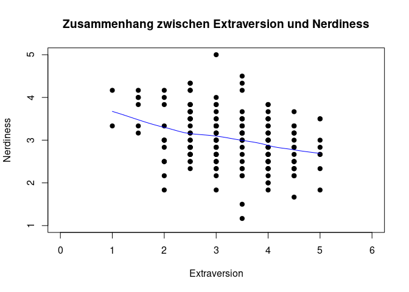<!-- -->
 
 * `pch` verändert die Darstellung der Datenpunkte
 * `xlim` und `ylim` veränderen die X- bzw. Y-Achse 
 * mit `cex` könnte man noch die Größe der Datenpunkte anpassen

<b>Interpretation</b>: Eine lineare Beziehung scheint den Zusammenhang aus `extra` und `nerd` akkurat zu beschreiben. Ein bspw. u-förmiger Zusammenhang ist nicht zu erkennen.


In unserem Beispiel ist $x$ die Extraversion (`extra`) und $y$ die Nerdiness (`nerd`). Um das Modell zu schätzen, wird dann der `lm()` (für *linear model*) Befehl genutzt:


``` r
lm(formula = nerd ~ 1 + extra, data = fb23)
```

```
## 
## Call:
## lm(formula = nerd ~ 1 + extra, data = fb23)
## 
## Coefficients:
## (Intercept)        extra  
##      3.7199      -0.2103
```

So werden die Koeffizienten direkt ausgegeben. Wenn wir mit dem Modell jedoch weitere Analysen durchführen möchten, müssen wir es einem Objekt im Environment zuweisen. Dafür legen wir es im Objekt `lin_mod` (steht für *lineares Modell*) ab. Hier in verkürzter Schreibweise (wir lassen die 1 als Repräsentant für den Achsenabschnitt weg):


``` r
lin_mod <- lm(nerd ~ extra, fb23)                  #Modell erstellen und Ergebnisse im Objekt lin_mod ablegen
```

Aus diesem Objekt können mit `coef()` oder auch `lin_mod$coefficients` die geschätzten Koeffizienten extrahiert werden:


``` r
coef(lin_mod) 
```

```
## (Intercept)       extra 
##   3.7198838  -0.2103006
```

``` r
lin_mod$coefficients
```

```
## (Intercept)       extra 
##   3.7198838  -0.2103006
```

Falls man sich unsicher ist, wie dieses Modell zustande gekommen ist, kann man dies ausdrücklich erfragen:


``` r
formula(lin_mod)
```

```
## nerd ~ extra
```

#### Streu-Punktdiagramm mit Regressionsgerade {#Streudiagramm}

Das Streudiagramm haben wir zu Beginn schon abbilden lassen. Hier kann nun zusätzlich noch der geschätzte Zusammenhang zwischen den beiden Variablen als Regressiongerade eingefügt werden. Hierzu wird der Befehl `plot()` durch `abline()` ergänzt:


``` r
# Scatterplot zuvor im Skript beschrieben
plot(fb23$extra, fb23$nerd, 
  xlim = c(0, 6), ylim = c(1, 5), pch = 19)
lines(loess.smooth(fb23$extra, fb23$nerd), col = 'blue')    #beobachteter, lokaler Zusammenhang
# Ergebnisse der Regression als Gerade aufnehmen
abline(lin_mod, col = 'red')
```

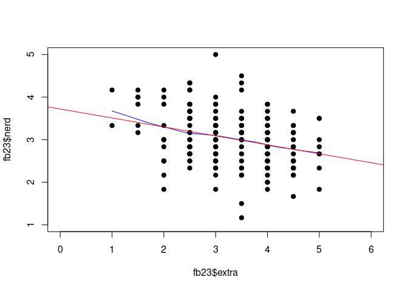<!-- -->


In `lin_mod$coefficients` stehen die Regressionskoeffizienten $b_0$ unter `(Intercept)` zur Konstanten gehörend und $b_1$ unter dem Namen der Variable, die wir als Prädiktor nutzen. In diesem Fall also `extra`. Die Regressionsgleichung hat daher die folgende Gestalt: $y_i = 3.72 + -0.21 \cdot x + e_i$. 

Regressionsgleichung (unstandardisiert): 

$$\hat{y} = b_0 + b_1*x_m$$
$$\hat{y} = 3.72 + (-0.21)*x_m$$

**Interpretation der Regressionskoeffizienten:**  

* *$b_0$ (Achsenabschnitt)*: beträgt die Extraversion 0, wird eine Nerdiness von 3.72 vorhergesagt  
* *$b_1$ (Regressionsgewicht)*: mit jeder Steigerung der Extraversion um 1 Einheit wird eine um 0.21 Einheiten niedrigere (!) Nerdiness vorhergesagt


#### Residuen Werte

Mit dem Befehl `lm()` werden auch automatisch immer die Residuen ($e_m$) geschätzt, die mit `residuals()` (oder alternativ: `resid()`) abgefragt werden können. Die Residuen betragen die Differenzen zu den vorhergesagten Werten bzw. zur Regressionsgeraden (Werte sind zur Übersichtlichkeit auf 2 Nachkommastellen gerundet).


``` r
residuals(lin_mod) |> round(2)
```

```
##     1     2     3     4     5     7     8     9    10    11    12    13    14    15    16 
##  1.18 -0.09 -0.55 -0.26  0.95  0.56  0.18  0.35  0.47 -0.09  0.89 -0.61  0.24 -0.18  0.47 
##    17    18    19    20    21    22    23    24    25    26    27    28    29    30    31 
## -0.69  0.74  0.68  0.76  0.35 -0.36  0.14 -0.55  0.02  1.91 -0.09  0.12  0.41  0.12 -0.09 
##    32    33    34    35    36    37    38    39    40    41    42    43    44    45    46 
##  0.24 -0.27 -0.19  0.16  0.47 -0.47 -0.30 -0.88  0.00  0.39  0.64 -0.05  0.58  0.41  0.33 
##    47    48    49    50    51    52    53    54    55    56    57    58    59    60    61 
## -0.71 -0.80  1.14 -0.05  0.06  0.31 -0.36  0.52  0.23 -0.27  1.35 -1.11  0.52 -0.92 -0.42 
##    62    63    64    65    66    67    68    69    70    71    72    73    74    75    76 
##  0.39  0.56 -0.61  0.60  0.45  0.62  0.97  0.62  0.43 -0.80 -0.55 -0.59  0.24 -1.82 -0.34 
##    77    78    79    80    81    82    83    84    85    86    87    88    89    90    91 
## -0.82 -0.36 -0.26  0.08 -0.65 -1.48 -0.32 -0.38 -0.36  0.12  0.24 -0.03  0.52  0.18  0.91 
##    92    93    94    95    96    97    98    99   101   102   103   104   105   106   107 
##  0.53 -0.30  0.87  0.60 -0.38 -0.44  0.64  0.31  0.18 -0.65 -0.26 -0.59 -0.44 -0.53 -0.76 
##   108   109   110   111   112   113   114   115   116   117   118   119   120   121   122 
## -0.21  0.29 -0.15  0.74 -0.53  0.52  0.18 -0.69  0.31 -0.21  0.62 -0.42  0.39 -0.24 -0.11 
##   123   124   126   127   128   129   130   131   132   133   134   135   136   137   138 
## -1.47 -0.48 -0.30  0.35  0.70  0.64  0.45 -0.80 -0.36  0.79  0.08  0.08  0.31 -0.53 -0.19 
##   139   140   141   142   143   144   145   146   147   148   149   150   151   152   153 
## -0.07 -0.03 -1.26 -0.27  0.03  0.83 -1.05  0.02  0.18  0.02  0.24 -0.42 -0.30  0.97 -0.21 
##   154   155   156   157   158   159   160   161   162   163   164   165   166   167   168 
## -0.38  1.14  0.29 -0.86  0.00 -0.53 -0.05  0.29 -0.84  1.52  0.06  0.12 -0.44  0.18 -0.88 
##   169   170   171   172   173   174   175   176   177   178   179   180   181   182 
## -0.76 -0.59  0.24 -0.42 -0.36  0.83  0.66  0.95 -0.53 -0.38 -0.82 -0.21  0.47 -1.13
```

Die Residuen haben die Bedeutung des "Ausmaßes an Nerdiness, das nicht durch Extraversion vorhergesagt werden kann" - also die Differenz aus vorhergesagtem und tatsächlich beobachtetem Wert der y-Variable (Nerdiness).

#### Vorhergesagte Werte

Die vorhergesagten Werte $\hat{y}$ können mit `predict()` ermittelt werden (Werte sind zur Übersichtlichkeit auf 2 Nachkommastellen gerundet):


``` r
predict(lin_mod) |> round(2)
```

```
##    1    2    3    4    5    7    8    9   10   11   12   13   14   15   16   17   18   19   20 
## 2.98 3.09 2.88 3.09 2.88 2.77 2.98 2.98 3.19 3.09 2.77 2.77 3.09 3.51 3.19 3.19 3.09 2.98 3.40 
##   21   22   23   24   25   26   27   28   29   30   31   32   33   34   35   36   37   38   39 
## 2.98 3.19 3.19 2.88 2.98 3.09 3.09 2.88 3.09 2.88 3.09 3.09 2.77 3.19 2.67 3.19 3.30 3.30 2.88 
##   40   41   42   43   44   45   46   47   48   49   50   51   52   53   54   55   56   57   58 
## 2.67 2.77 3.19 2.88 3.09 3.09 2.67 2.88 3.30 3.19 2.88 2.77 3.19 3.19 2.98 2.77 2.77 2.98 2.77 
##   59   60   61   62   63   64   65   66   67   68   69   70   71   72   73   74   75   76   77 
## 2.98 3.09 3.09 2.77 2.77 2.77 3.40 2.88 2.88 3.19 2.88 3.40 3.30 2.88 3.09 3.09 2.98 2.67 2.98 
##   78   79   80   81   82   83   84   85   86   87   88   89   90   91   92   93   94   95   96 
## 3.19 3.09 3.09 2.98 2.98 2.98 2.88 3.19 2.88 3.09 3.19 2.98 2.98 3.09 3.30 3.30 3.30 3.40 2.88 
##   97   98   99  101  102  103  104  105  106  107  108  109  110  111  112  113  114  115  116 
## 2.77 3.19 3.19 2.98 2.98 3.09 3.09 2.77 3.19 3.09 2.88 2.88 2.98 3.09 3.19 2.98 2.98 3.19 3.19 
##  117  118  119  120  121  122  123  124  126  127  128  129  130  131  132  133  134  135  136 
## 2.88 2.88 3.09 2.77 3.40 2.77 3.30 2.98 3.30 2.98 3.30 3.19 2.88 3.30 3.19 2.88 3.09 3.09 3.19 
##  137  138  139  140  141  142  143  144  145  146  147  148  149  150  151  152  153  154  155 
## 3.19 3.19 3.40 3.19 3.09 2.77 3.30 2.67 2.88 2.98 2.98 2.98 3.09 3.09 3.30 3.19 2.88 2.88 3.19 
##  156  157  158  159  160  161  162  163  164  165  166  167  168  169  170  171  172  173  174 
## 2.88 3.19 2.67 3.19 2.88 2.88 2.67 2.98 2.77 2.88 2.77 2.98 2.88 3.09 3.09 3.09 3.09 3.19 2.67 
##  175  176  177  178  179  180  181  182 
## 3.51 2.88 3.19 2.88 2.98 2.88 3.19 3.30
```

Per Voreinstellung werden hier die vorhergesagten Werte aus unserem ursprünglichen Datensatz dargestellt. `predict()` erlaubt uns aber auch Werte von "neuen" Beobachtungen vorherzusagen. Nehmen wir an, wir würden die Extraversion von 5 neuen Personen beobachten (sie haben - vollkommen zufällig - die Werte 1, 2, 3, 4 und 5) und diese Beobachtungen in einem neuem Datensatz `extra_neu` festhalten:


``` r
extra_neu <- data.frame(extra = c(1, 2, 3, 4, 5))
```

Anhand unseres Modells können wir für diese Personen auch ihre Nerdiness vorhersagen, obwohl wir diese nicht beobachtet haben:


``` r
predict(lin_mod, newdata = extra_neu) 
```

```
##        1        2        3        4        5 
## 3.509583 3.299283 3.088982 2.878681 2.668381
```

Damit diese Vorhersage funktioniert, muss im neuen Datensatz eine Variable mit dem Namen `extra` vorliegen. Vorhergesagte Werte liegen immer auf der Regressionsgeraden.

***

### Inferenzstatistische Überprüfung der Regressionsparameter _b_ {#Inferenz}

#### Signifikanztestung der Regressionskoeffizienten

Nun möchten wir aber vielleicht wissen, ob der beobachtete Zusammenhang auch statistisch bedeutsam ist oder vielleicht nur durch Zufallen zustande gekommen ist. Zuerst kann die Betrachtung der Konfidenzintervalle helfen. Der Befehl `confint()` berechnet die Konfidenzintervalle der Regressionsgewichte.


``` r
#Konfidenzintervalle der Regressionskoeffizienten
confint(lin_mod)
```

```
##                  2.5 %     97.5 %
## (Intercept)  3.3859075  4.0538600
## extra       -0.3087968 -0.1118044
```


Das Konfidenzintervall von -0.309 und -0.112 ist der Bereich, in dem wir den wahren Wert vermuten können. Da die 0 nicht in diesem Intervall enthalten ist, ist 0 ein eher unwahrscheinlicher wahrer Wert für $b_1$.

* $b_1$  
    + H0: $b_1 = 0$, das Regressionsgewicht ist nicht von 0 verschieden.  
    + H1: $b_1 \neq 0$, das Regressionsgewicht ist von 0 verschieden. 
    
* $b_0$ (häufig nicht von Interesse)  
    + H0: $b_0 = 0$, der y-Achsenabschnitt ist nicht von 0 verschieden.  
    + H1: $b_0 \neq 0$, der y-Achsenabschnitt ist von 0 verschieden.  

Für beide Parameter ($b_1$ uns $b_0$) wird die H0 auf einem alpha-Fehler-Niveau von 5% verworfen, da die 0 nicht im jeweiligen 95% Konfidenzintervall enthalten ist.

Eine andere Möglichkeit zur interferenzstatistischen Überprüfung ergibt sich über die p-Werte der Regressionskoeffizienten. Diese werden über die `summary()`-Funktion ausgegeben. `summary()` fasst verschiedene Ergebnisse eines Modells zusammen und berichtet unter anderem auch Signifikanzwerte.


``` r
#Detaillierte Modellergebnisse
summary(lin_mod)
```

```
## 
## Call:
## lm(formula = nerd ~ extra, data = fb23)
## 
## Residuals:
##      Min       1Q   Median       3Q      Max 
## -1.81716 -0.42232 -0.00171  0.41996  1.91102 
## 
## Coefficients:
##             Estimate Std. Error t value Pr(>|t|)    
## (Intercept)  3.71988    0.16923  21.981   <2e-16 ***
## extra       -0.21030    0.04991  -4.214    4e-05 ***
## ---
## Signif. codes:  0 '***' 0.001 '**' 0.01 '*' 0.05 '.' 0.1 ' ' 1
## 
## Residual standard error: 0.6033 on 177 degrees of freedom
## Multiple R-squared:  0.09116,	Adjusted R-squared:  0.08603 
## F-statistic: 17.75 on 1 and 177 DF,  p-value: 3.999e-05
```

Aus `summary()`: $p < \alpha$ $\rightarrow$ H1: Das Regressionsgewicht für den Prädiktor Extraversion ist signifikant von 0 verschieden. Der Zusammenhang von Extraversion und Nerdiness ist statistisch bedeutsam. 

Aus `summary()`: $p < \alpha$ $\rightarrow$ H1: der Achsenabschnitt ist signifikant von 0 verschieden. Beträgt die Extraversion 0 wird eine von 0 verschiedene Nerdiness vorhergesagt. 

Konfidenzinteralle und p-Werte für Regressionskoeffizienten kommen immer zu denselben Schlussfolgerungen in Bezug darauf, ob die H0 beibehalten oder verworfen wird!

***

#### Determinationskoeffizient $R^2$ {#DetKoef}

Darüber hinaus können wir uns auch anschauen, wie gut unser aufgestelltes Modell generell zu den Daten passt und Varianz erklärt. $R^2$ gibt an, wie viel Streuung in den Daten durch das vorliegende lineare Regressionsmodell „erklärt“ werden kann. Bei einer einfachen Regression entspricht $R^2$ dem Quadrat des Korrelationskoeffizienten, wie wir später noch sehen werden.

Auch dies lässt sich mit der Funktion `summary()` betrachten. Anhand des p-Werts kann hier auch die Signifikanz des $R^2$ überprüft werden.


``` r
#Detaillierte Modellergebnisse
summary(lin_mod)
```

```
## 
## Call:
## lm(formula = nerd ~ extra, data = fb23)
## 
## Residuals:
##      Min       1Q   Median       3Q      Max 
## -1.81716 -0.42232 -0.00171  0.41996  1.91102 
## 
## Coefficients:
##             Estimate Std. Error t value Pr(>|t|)    
## (Intercept)  3.71988    0.16923  21.981   <2e-16 ***
## extra       -0.21030    0.04991  -4.214    4e-05 ***
## ---
## Signif. codes:  0 '***' 0.001 '**' 0.01 '*' 0.05 '.' 0.1 ' ' 1
## 
## Residual standard error: 0.6033 on 177 degrees of freedom
## Multiple R-squared:  0.09116,	Adjusted R-squared:  0.08603 
## F-statistic: 17.75 on 1 and 177 DF,  p-value: 3.999e-05
```

Determinationskoeffizient $R^2$ ist signifikant, da $p < \alpha$.

Der Determinationskoeffizient $R^2$ kann auch direkt über den Befehl `summary(lin_mod)$r.squared` ausgegeben werden:


``` r
summary(lin_mod)$r.squared
```

```
## [1] 0.09116145
```


9.12% der Varianz von `nerd` können durch `extra` erklärt werden. Dieser Effekt ist nach Cohens (1988) Konvention als mittelstark zu bewerten, wenn keine Erkenntnisse in dem spezifischen Bereich vorliegen.



**Cohens (1988) Konvention zur Interpretation von $R^2$:**  

Konventionen sind, wie bereits besprochen, heranzuziehen, wenn keine vorherigen Untersuchungen der Fragestellung oder zumindest in dem Forschungsbereich vorliegen. Die vorgeschlagenen Werte von $R^2$ entsprechen dabei dem Quadrat der in der [letzten Sitzung](/lehre/statistik-i/korrelation) genannten Konventionen für $r$.

* ~ .01: schwacher Effekt  
* ~ .09: mittlerer Effekt  
* ~ .25: starker Effekt  

***

#### Standardisierte Regressionsgewichte {#Standardgewichte}

Bei einer Regression kann es sinnvoll sein, die standardisierten Regressionskoeffizienten zu betrachten, um die Erklärungs- oder Prognosebeiträge der einzelnen unabhängigen Variablen (unabhängig von den bei der Messung der Variablen gewählten Einheiten) miteinander vergleichen zu können, z. B. um zu sehen, welche Variable den größten Beitrag zur Prognose der abhängigen Variable leistet. Außerdem ist es hierdurch möglich, die Ergebnisse zwischen verschiedenen Studien zu vergleichen, die `nerd` und `extra` gemessen haben, jedoch in unterschiedlichen Einheiten. Durch die Standardisierung werden die Regressionskoeffizienten vergleichbar.


``` r
# Paket erst installieren (wenn nötig): install.packages("lm.beta")
library(lm.beta)
```

Die Funktion `lm.beta()` muss auf ein Ergebnis der normalen `lm()`-Funktion angewendet werden. Wir haben dieses Ergebnis im Objekt `lin_mod` hinterlegt. Anschließend wollen wir uns für die Interpretation wieder das `summary()` ausgeben lassen. Natürlich kann man diese Schritte auch mit der Pipe lösen, was als Kommentar noch aufgeführt ist.


``` r
lin_model_beta <- lm.beta(lin_mod)
summary(lin_model_beta) # lin_mod |> lm.beta() |> summary()
```

```
## 
## Call:
## lm(formula = nerd ~ extra, data = fb23)
## 
## Residuals:
##      Min       1Q   Median       3Q      Max 
## -1.81716 -0.42232 -0.00171  0.41996  1.91102 
## 
## Coefficients:
##             Estimate Standardized Std. Error t value Pr(>|t|)    
## (Intercept)  3.71988           NA    0.16923  21.981   <2e-16 ***
## extra       -0.21030     -0.30193    0.04991  -4.214    4e-05 ***
## ---
## Signif. codes:  0 '***' 0.001 '**' 0.01 '*' 0.05 '.' 0.1 ' ' 1
## 
## Residual standard error: 0.6033 on 177 degrees of freedom
## Multiple R-squared:  0.09116,	Adjusted R-squared:  0.08603 
## F-statistic: 17.75 on 1 and 177 DF,  p-value: 3.999e-05
```

Wir sehen, dass die ursprüngliche Ausgabe um die Spalte `standardized` erweitert wurde. An der standardisierten Lösung fällt auf, dass das Intercept als `NA` angezeigt wird. Dies liegt wie bereits besprochen daran, dass beim Standardisieren die Mittelwerte aller Variablen (Prädiktoren und Kriterium, bzw. unabhängige und abhängige Variable) auf 0 und die Standardabweichungen auf 1 gesetzt werden. Somit muss das Intercept hier genau 0 betragen, weshalb auf eine Schätzung verzichtet werden kann. 

Die Interpretation standardisierter Regressionsgewichte weicht leicht von der Interpration unstandardisierter Regressionsgewichte ab. Der Achsenabschnitt ist 0, da die Regressionsgerade durch den Mittelwert beider Variablen geht, die beide auch 0 sind. Das Regressionsgewicht hingegen beinhaltet die erwartete Veränderung von -0.21 Standardabweichungen in Nerdiness bei einer Standardabweichung mehr in Extraversion.

#### Grafische Darstellung:
Unser Ziel ist es natürlich auch das Regressionsmodell, also den Zusammenhang der Variablen, grafisch darzustellen. Dies gelingt einfach mit der bereits bekannten GGPlot-Syntax:

``` r
library(ggplot2)
# Möglichkeit A:
ggplot(data = fb23, aes(x = extra, y = nerd))+ #Grund-Ästhetik auswählen
     geom_point() + # Darstellung der Testwerte als Punkte
  geom_abline(intercept = coef(lin_mod)[1], slope = coef(lin_mod)[2], color = 'red') # Hinzufügen der Regressionsgerade
```

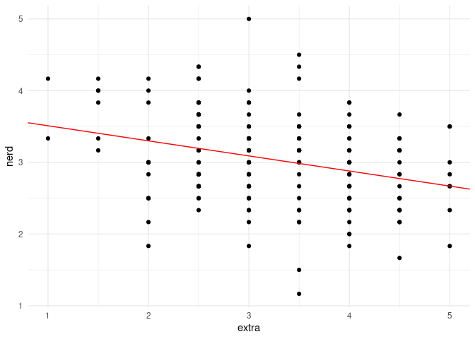<!-- -->

``` r
# Möglichkeit B: Vorteil = Anzeige des Konfidenzintervalls
ggplot(data = fb23, aes(x = extra, y = nerd))+
     geom_point() +
  geom_smooth(method="lm", formula = "y~x", color = 'red')
```

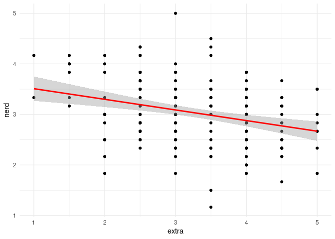<!-- -->

***

### Multiple Regression
#### Einleitung

Bisher haben wir uns bereits mit der Analyse von Zusammenhängen anhand von einfachen linearen Regressionen beschäftigt. Nun wollen wir uns mit der multiplen Regression beschäftigen. Wir überspringen den Einleitungsteil (kann in Statistik 1 nachgelesen werden) und starten gleich mit der Verteifung, indem wir Interaktionen aufnehmen und die Linearitätsannahme aufweichen.

#### Einladen des Datensatzes

Für das vorliegende Tutorial laden wir einen Datensatz aus dem [Open Scniece Framework (OSF)](https://osf.io/) ein, der aus einer [Studie](https://doi.org/10.1016/j.chiabu.2020.104826) stammt, die sich mit Parental Burnout (Elterlichem Burnout) befasst. Die Studie können wir mit folgendem Befehl direkt einladen. Die erste Spalte benötigen wir nicht, da diese sich mit der Zeilennummer doppelt.


``` r
burnout <- read.csv(file = url("https://osf.io/qev5n/download"))
burnout <- burnout[,2:8]
dim(burnout)
```

```
## [1] 1551    7
```

Insgesamt besteht der restliche Datensatz also aus 1551 Zeilen und 7 Spalten. Betrachten wir nun die Variablen noch genauer. 


``` r
str(burnout)
```

```
## 'data.frame':	1551 obs. of  7 variables:
##  $ Exhaust    : int  44 23 0 13 21 40 0 8 34 15 ...
##  $ Distan     : int  31 10 1 18 11 37 2 1 26 6 ...
##  $ Ineffic    : int  29 7 1 19 9 31 1 0 11 9 ...
##  $ Neglect    : int  38 27 18 28 25 29 19 39 31 25 ...
##  $ Violence   : int  76 26 15 20 22 34 16 19 28 24 ...
##  $ PartEstrang: int  17 8 5 5 8 6 5 5 5 7 ...
##  $ PartConfl  : int  12 4 4 4 4 3 2 3 5 7 ...
```

Zu diesen Variablen hier zunächst noch eine inhaltliche Zuordnung: 

| Variable | Bedeutung | Kodierung | Beispielitem |
| --- | ---- | --- | ----- |
| `Exhaust` | *Emotional exhaustion* | 0 - 48 | "I feel emotionally drained by my parental role" |
| `Distan` | *Emotional distancing* | 0 - 48 | "I sometimes feel as though I am taking care of my children on autopilot" | 
| `Ineffic` | *Parental accomplishment and efficacy* | 0 - 36 | "I accomplish many worthwhile things as a parent" (invertiert) |
| `Neglect` | *Neglectful behaviors toward children* | 17 - 136 | "I sometimes don’t take my child to the doctor when I think it would be a good idea." |
| `Violence` | *Violent behaviors toward children* | 15 - 120 | "I sometimes tell my child that I will abandon him/her if s/he is not good." |
| `PartEstrang` | *Partner Estrangement* | 5 - 40 | "I sometimes think of leaving my partner" |
| `PartConfl` | *Conflicts with partner* | 2 - 14 | "How often do you quarrel with your partner?" |

Wie dem, zu den Daten gehörenden Artikel zu entnehmen ist, sind die Variablen alle Summenwerte von mehreren Items aus entsprechenden Fragebögen, weswegen sie sehr unterschiedliche Werte annehmen können. Im weiteren Verlauf werden wir (wie auch im ursprünglichen Artikel) annehmen, dass diese Skalenwerte intervallskaliert sind.


### Multiple Regression - Betrachtung eines spezifischen Modells.

Das Ziel einer Regression besteht darin, eine Variable durch eine oder mehrere andere Variablen vorherzusagen (Prognose). Die vorhergesagte Variable wird als Kriterium, Regressand oder auch abhängige Variable (AV) bezeichnet. Die Variablen zur Vorhersage der abhängigen Variablen werden als Prädiktoren, Regressoren oder unabhängige Variablen (UV) bezeichnet. Als Anwendungsbeispiel wollen wir die Gewalttätigkeit gegenüber Kindern (`Violent`) durch die Emotionale Erschöpfung (`Exhaust`), die Emotionale Distanz (`Distan`) und die Konflikte mit dem Partner / der Partnerin (`PartConfl`) vorhersagen.

#### Exkurs: Voraussetzungen:
Die Voraussetzungen einer multiplen Regression können ebenfalls mit R überprüft werden. Diese lauten: 
- Korrekte Spezifikation des Modells
- Messfehlerfreiheit der unabhängigen Variablen
- Unabhängigkeit der Residuen
- Homoskedastizität der Residuen
- Normalverteilung der Residuen
Die Umsetzung in R findet ihr in [Statistik I](https://pandar.netlify.app/lehre/statistik-i/multiple-reg/)

#### Bestimmung der Koeffizienten der Multiplen Regression
Zuerst definieren wir unser Regressionsmodell für die multiple Regression.

``` r
mod <- lm(Violence ~ Exhaust + Distan + PartConfl, data = burnout)
```
    
Um die berechneten Parameter des Modells anzuzeigen, nutzen wir die Funktion `summary`. 


``` r
summary(mod)
```

```
## 
## Call:
## lm(formula = Violence ~ Exhaust + Distan + PartConfl, data = burnout)
## 
## Residuals:
##     Min      1Q  Median      3Q     Max 
## -14.252  -3.688  -1.057   2.454  50.151 
## 
## Coefficients:
##             Estimate Std. Error t value Pr(>|t|)    
## (Intercept) 15.24726    0.40437  37.706  < 2e-16 ***
## Exhaust      0.10683    0.01851   5.770 9.56e-09 ***
## Distan       0.30161    0.02421  12.460  < 2e-16 ***
## PartConfl    0.57351    0.06821   8.408  < 2e-16 ***
## ---
## Signif. codes:  0 '***' 0.001 '**' 0.01 '*' 0.05 '.' 0.1 ' ' 1
## 
## Residual standard error: 6.402 on 1547 degrees of freedom
## Multiple R-squared:  0.2889,	Adjusted R-squared:  0.2875 
## F-statistic: 209.5 on 3 and 1547 DF,  p-value: < 2.2e-16
```
Wir haben bereits gelernt, dass die Punktschätzer für die Regressionsgewichte in der Spalte `Estimate` im Abschnitt `Coefficients` zu finden sind. Der Achsenabschnitt unseres Modells beträgt also $b_0$ = 15.25. Dies bedeutet, dass wir einer Person mit einem Wert von 0 in allen Prädiktoren eine Gewalttätigkeit von 15.25 vorhersagen. Die Regressionsgewichte für die Prädiktoren sind $b_{1}$ = 0.107 für Emotionale Erschöpfung, $b_{2}$ = 0.302 für Emotionale Distanz und $b_{3}$ = 0.574 für Konflikte mit dem Partner. Die Interpretaion nochmal am Beispiel der Emotionalen Erschöpfung: Wenn sich die Emotionale Erschöpfung um eine Einheit erhöht und alle anderen Prädiktoren konstant gehalten werden, so erhöht sich die Gewalttätigkeit um 0.107 Einheiten. 

Der letzte Teil des Regressionsmodells beinhaltet die Fehler $e_i$, die (wie durch den Index $i$ gekennzeichnet) für jede Person individuell sind. Die Fehler können wir beispielsweise anzeigen, indem wir die Funktion `resid()` auf unser Objekt anwenden. Wir zeigen hier nur die ersten zehn Fehlerwerte, da der Output sonst sehr lange wäre.


``` r
resid(mod)[1:10]
```

```
##          1          2          3          4          5          6          7          8 
## 39.8203389  2.9855780 -2.8429139 -4.3589986 -1.1023730  1.5996231 -0.9974955  0.8759748 
##          9         10 
## -1.5887563  1.3260923
```

#### Omnibustest der Multiplen Regression

Einschätzungen zur Güte unseres Modells finden wir wie in [Statistik 1 besprochen](/lehre/statistik-i/multiple-reg/#determinationskoeffizient) im letzten Teil des Outputs der `summary()` Funktion. Wir blenden die spezifischen Ergebnisse an dieser Stelle nochmal ein:


```
## Residual standard error: 6.402 on 1547 degrees of freedom
## Multiple R-squared:  0.2889,	Adjusted R-squared:  0.2875 
## F-statistic: 209.5 on 3 and 1547 DF,  p-value: < 2.2e-16
```

In unserem Fall hat der Omnibustest einen empirischen Wert von 209.524 bei Freiheitsgraden von 3 und 1547. Der Test prüft, ob die Prädiktoren in der Modellgleichung gemeinsam signifikant zur Vorhersage der abhängigen Variable beitragen, was in diesem Fall gegeben ist, da der p-Wert kleiner als 0.05 ist, was üblicherweise als $\alpha$-Niveau verwendet wird.

#### Testung einzelner Prädiktoren

Neben der gemeinsamen Testung aller Prädiktoren ist es bei der multiplen Regression auch möglich, die einzelnen Prädiktoren auf ihre Signifikanz zu testen. Dies geschieht durch die Anwendung des t-Tests auf die einzelnen Regressionsgewichte. Führen wir eine solche Testung anhand des Prädiktors Emotionale Erschöpfung durch Die Nullhypothese des t-Tests lautet, dass das Regressionsgewicht des Prädiktors Emotionale Erschöpfung 0 ist. Die Alternativhypothese ist, dass das Regressionsgewicht ungleich 0 ist.

$H_0$: $b_1 = 0$ und $H_1$: $b_1 \neq 0$

Auch für die Testung der einzelnen Prädiktoren liefert uns die `summary()` Funktion die nötigen Informationen. Wir blenden den spezifischen Teil des Outputs an dieser Stelle nochmal ein.


```
##             Estimate Std. Error t value Pr(>|t|)    
## (Intercept) 15.24726    0.40437  37.706  < 2e-16 ***
## Exhaust      0.10683    0.01851   5.770 9.56e-09 ***
## Distan       0.30161    0.02421  12.460  < 2e-16 ***
## PartConfl    0.57351    0.06821   8.408  < 2e-16 ***
## ---
## Signif. codes:  0 '***' 0.001 '**' 0.01 '*' 0.05 '.' 0.1 ' ' 1
```

Für Emotionale Erschöpfung ergibt sich ein empirischer Wert von 5.77 und ein p-Wert von kleiner 0.001. Dieser ist kleiner als das übliche $\alpha$-Niveau von 0.05, was ein signifikantes Ergebnis anzeigt. Was bedeutet dies jetzt? Wie in den Hypothesen festgehalten wird damit angezeigt, dass das Regressionsgewicht der Emotionalen Erschöpfung verschieden von 0 ist. Nun könnte man argumentieren, dass man dies ja bereits an dem Wert für den Regressionsparameter sehen konnte, da dieser eindeutig verschieden von 0 ist, jedoch handelt es sich auch hier nur um einen deskriptivstatistischen Wert. Der t-Test zeigt uns, dass dieser in der Population von 0 verschieden. Wenn wir nun in unserem Ergebnisbericht nicht nur die Punktschätzung für den Regressionsparameter angeben wollen, können wir ein Konfidenzintervall um den Wert legen (Konfidenzintervalle haben wir [hier](/lehre/statistik-i/tests-konfidenzintervalle/#KonfInt) beim Testen eines Mittelwerts sehr detailliert besprochen). Die Formel nutzt dabei den Standardfehler des Regressionsgewichts, der in der Übersicht enthalten ist. Zusätzlich wird der kritische Wert aus der t-Verteilung benötigt (wobei mit $\alpha$ das Fehlerniveau festgelegt wird und $k$ hier für die Anzahl an Prädiktoren - also 3 - steht).

$$CI = b_m \pm t_{(1-\alpha/2, n-k-1)} \cdot \hat{\sigma}_{b_m}$$

Wir könnten also per Hand das Intervall bestimmen. Jedoch ist in `R` die Erstellung des Konfidenzintervalls sehr simpel mit der Funktion `confint()` möglich. Diese muss nur auf das Objekt angwendet werden, das unser Regressionsmodell enthält. Mit dem Argument `level` kann das Konfidenzniveau festgelegt werden, das sich aus $1 - \alpha$ bestimmt. In unserem Fall wäre dieses also 0.95.


``` r
confint(mod, level = 0.95)
```

```
##                   2.5 %     97.5 %
## (Intercept) 14.45408609 16.0404255
## Exhaust      0.07051175  0.1431443
## Distan       0.25412861  0.3490856
## PartConfl    0.43971116  0.7073143
```

Betrachten wir erneut den Prädiktore Emotionale Erschöpfung. Als Konfidenzintervall erhalten wir die untere Grenze von 0.071 und die obere Grenze von 0.143. Dies bedeutet, dass wir zu 95% sicher sind, dass dieses Intervall den wahren Wert für das Gewicht $b_1$ enthält. Es wird auch nochmal deutlich, dass die 0 nicht in diesem Intervall enthalten ist. Wenn wir dies in Bezug zu den formulierten Hypothesen für die inferenzstatistische Testung eines einzelnen Prädiktors betrachtet, widerspricht dies also der $H_0$. Wir würden uns also mit einem $\alpha$ von 0.05 auch bei Betrachtung des Konfidenzintervalls gegen die Beibehaltung der $H_0$ entscheiden. Die beiden Wege (Durchführung des t-Tests und Betrachtung des Konfidenzintervalls) müssen immer zum selben Ergebnis führen.

Abschließend noch ein essentieller Punkt zur Testung einzelner Prädiktoren: Von enormer Wichtigkeit ist sich dabei bewusst zu machen, dass die eben besprochenen Ergebnisse für den Prädiktor Emotionale Erschöpfung nur für dieses Set an Prädiktoren gelten. Sobald wir weitere Prädiktoren hinzufügen, Prädiktoren entfernen oder diese auswechseln, können sich die Ergebnisse ändern.

#### Vorhersage der abhängigen Variable

Wie auch in der einfachen Regression haben wir nun die Möglichkeit, einer Person einen Wert für die abhängige Variable vorherzusagen. Dies geschieht durch die Anwendung der Regressionsgewichte auf die Werte der Prädiktoren. In unserem Fall wollen wir die Gewalttätigkeit gegenüber Kindern vorhersagen. Stellen wir uns vor, dass die neue Person einen Wert von 3 für Emotionale Erschöpfung, 4 für Emotionale Distanz und 2 für Konflikte mit dem Partner hat. Hier gibt es wieder viele Wege zum Ziel. Wir legen zuerst einen neuen Datensatz an, der die Werte der Prädiktoren enthält. 


``` r
predict_data <- data.frame(Exhaust = 3, Distan = 4, PartConfl = 2)
```

Anschließend können wir die Funktion `predict()` auf unser Modell anwenden. 


``` r
predict(mod, newdata = predict_data)
```

```
##        1 
## 17.92119
```

Wir haben für die Person nun eine Punktschätzung von 17.921 für die Gewalttätigkeit. Gleichzeitig wissen wir aber auch, dass dies keine perfekte Vorhersage ist. Schließlich sagen die Prädiktoren nicht 100% der Varianz der abhängigen Variable vorher. Wir sollten also ein Intervall um unsere Punktschätzung legen. Dieses wird in der Regression als Prognoseintervall bezeichnet.

Für die Bestimmung müssen wir nur optionale Argumente in der Funktion `predict()` nutzen. Diese umfassen erstmal die Art des Intervalls, das wir bestimmen wollen `interval = "prediction"` und das Konfidenzniveau `level = 0.95`.


``` r
predict(mod, newdata = predict_data, interval = "prediction", level = 0.95)
```

```
##        fit      lwr      upr
## 1 17.92119 5.349854 30.49253
```

Das berechnete Intervall enthält nun zu 95\% den wahren Wert der Person. Die breite des Intervalls hängt in erster Linie von der Varianz der Fehler ab, da diese die Sicherheit unserer Regression repräsentiert.

### Möglichkeiten in der Arbeit mit Regressionsmodellen in R
Hier soll noch ein kleiner Ausblick gegeben werden über Themen, die im Bezug auf Regression relevant werden könnten, aber aufgrund der Zeit nicht mehr in unseren R-Vorkurs gepasst haben. Jedes dieser Themen ist allerdings optimal auf Pandar aufgearbeitet und kann von euch nachgelesen werden.

#### Modellvergleiche bzw. Modelloptimierung

Bei der Regressionsanalyse hat die Modelloptimierung zum Ziel, ein Regresionsmodell zu verbessern - das heißt, möglichst viel Varianz der abhängigen Variable zu erklären. Dadurch wird die "Vorhersage" der abhängigen Variable genauer (die Streuung der Werte um die Regressionsgerade/-hyperebene ist kleiner).

**Modelloptimierung** bedeutet, ein Modell zu verbessern, durch: 

* Aufnehmen zusätzlicher, bedeutsamer Prädiktoren
* Ausschließen von Prädiktoren, die nicht zur Varianzaufklärung beitragen

**Ziel** ist ein *sparsames Modell*, in dem 

* jeder enthaltene Prädiktor einen Beitrag zur Varianzaufklärung des Kriteriums leistet und
* kein wichtiger (= vorhersagestarker) Prädiktor vergessen wurde.

Dies kann entweder in Form eines hypothesengeleiteten Modellvergleichs oder in Form einer automatisierten Modellsuche geschehen. Das Vorgehen wird in [Statistik II](/lehre/statistik-ii/multreg-inf-mod/) detailliert beschrieben. Was hier nur erwähnt werden soll: Achtet darauf, dass Modellvergleiche nur dann möglich sind, wenn beide Modelle auf den gleichen Daten beruhen.

#### Aufnahme nichtlinearer Effekte:
Die Regressionssyntax, die wir nun kennengelernt haben, macht es uns einfach nichtlineare Effekten in das Regressionsmodel aufzunehmen, bspw. sind das (1) quadratischen Verläufen, (2) Interaktionseffekten und (3) exponentiellen Verläufen. Genauer werden diese Inhalte in [Statistik II](/lehre/statistik-ii/nichtlineare-reg/) erklärt. 

Beispielsweise könnten wir im Scatterplot einen quadratischen Zusammenhang zwischen den Variablen aufgedeckt haben. Dies kann ganz leicht mit der `poly`Funktion gemacht werden, was bewirkt, dass der lineare und der quadratische Anteil des Prädiktors unkorreliert sind. (Partnerkonflikte sind hier zufällig ausgewählt, es gibt keine Anhaltspunkte für einen quadratischen Effekt).

``` r
mod_quad <- lm(Violence ~ Exhaust + Distan + poly(PartConfl, 2), data = burnout)
summary(mod_quad)
```

```
## 
## Call:
## lm(formula = Violence ~ Exhaust + Distan + poly(PartConfl, 2), 
##     data = burnout)
## 
## Residuals:
##     Min      1Q  Median      3Q     Max 
## -14.094  -3.690  -1.061   2.464  50.105 
## 
## Coefficients:
##                     Estimate Std. Error t value Pr(>|t|)    
## (Intercept)         18.33085    0.28425  64.489  < 2e-16 ***
## Exhaust              0.10630    0.01853   5.738 1.15e-08 ***
## Distan               0.30264    0.02424  12.487  < 2e-16 ***
## poly(PartConfl, 2)1 56.53636    6.72550   8.406  < 2e-16 ***
## poly(PartConfl, 2)2 -5.59433    6.41044  -0.873    0.383    
## ---
## Signif. codes:  0 '***' 0.001 '**' 0.01 '*' 0.05 '.' 0.1 ' ' 1
## 
## Residual standard error: 6.403 on 1546 degrees of freedom
## Multiple R-squared:  0.2893,	Adjusted R-squared:  0.2874 
## F-statistic: 157.3 on 4 and 1546 DF,  p-value: < 2.2e-16
```
Diese beiden Modelle können wir nun auch gegeneinander testen, um zu gucken, ob es zu einem Varianzinkrement durch die Zunahme des quadratischen Effekts von Partnerkonflikten, gekommen ist:


``` r
# Vergleich mit Modell ohne quadratischen Trend
summary(mod_quad)$r.squared - summary(mod)$r.squared  # Inkrement
```

```
## [1] 0.0003501168
```

``` r
anova(mod, mod_quad) # Signifikanztestung des Inkrements
```

```
## Analysis of Variance Table
## 
## Model 1: Violence ~ Exhaust + Distan + PartConfl
## Model 2: Violence ~ Exhaust + Distan + poly(PartConfl, 2)
##   Res.Df   RSS Df Sum of Sq      F Pr(>F)
## 1   1547 63410                           
## 2   1546 63379  1    31.222 0.7616  0.383
```
Das Inkrement ist somit nicht statistisch signifikant.

#### Grafische Darstellung der multiplen Regression:
Nun wollen wir uns die multiple Regression mal grafisch anschauen. Den Scatter-Plot und die lineare Trendlinie haben wir bereits bei der einfachen Regression kennengelernt. Nun erweiteren wir dies durch ein multiples Regressionsmodell, welches den Effekt eines kontinuerlichen (Neurotizismus) und eines kategorialen (Fachausrichtung: klinisch oder nicht) auf die Lebenszufriedenheit überprüfen will.

``` r
# Regressionsmodell erstellen:
mod_g <- lm(lz ~ neuro + fach_klin, data = fb23)
summary(mod_g)
```

```
## 
## Call:
## lm(formula = lz ~ neuro + fach_klin, data = fb23)
## 
## Residuals:
##     Min      1Q  Median      3Q     Max 
## -3.2678 -0.6238  0.1169  0.7541  1.9059 
## 
## Coefficients:
##                   Estimate Std. Error t value Pr(>|t|)    
## (Intercept)        5.96464    0.29117  20.485  < 2e-16 ***
## neuro             -0.25936    0.08136  -3.188  0.00172 ** 
## fach_klinklinisch  0.02626    0.15960   0.165  0.86949    
## ---
## Signif. codes:  0 '***' 0.001 '**' 0.01 '*' 0.05 '.' 0.1 ' ' 1
## 
## Residual standard error: 1.025 on 162 degrees of freedom
##   (14 observations deleted due to missingness)
## Multiple R-squared:  0.05906,	Adjusted R-squared:  0.04744 
## F-statistic: 5.084 on 2 and 162 DF,  p-value: 0.00722
```

``` r
# Scatterplot erstellen
scatter <- ggplot(fb23, aes(x = neuro, y = lz, color = fach_klin)) + 
  geom_point()
scatter
```

```
## Warning: Removed 2 rows containing missing values or values outside the scale range
## (`geom_point()`).
```

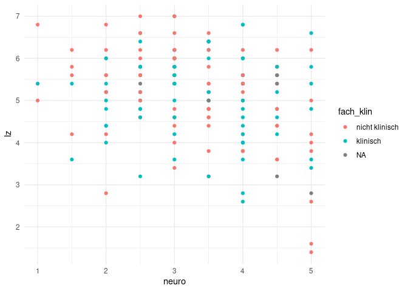<!-- -->

``` r
# Regressionsgerade aus mod_g hinzufügen
scatter + 
  geom_abline(intercept = coef(mod_g)[1], slope = coef(mod_g)[2], 
    color = '#00618F') # Regressionsgerade für klinische Fachrichtung
```

```
## Warning: Removed 2 rows containing missing values or values outside the scale range
## (`geom_point()`).
```

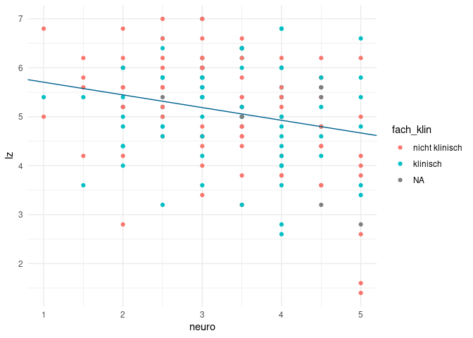<!-- -->

``` r
scatter + 
  geom_abline(intercept = coef(mod_g)[1], slope = coef(mod_g)[2], 
    color = '#00618F') + # Regressionsgerade für klinische Fachrichtung
  geom_abline(intercept = coef(mod_g)[1] + coef(mod_g)[3], slope = coef(mod_g)[2], 
    color = '#ad3b76') # Regressionsgerade für nicht klinische Fachrichtung
```

```
## Warning: Removed 2 rows containing missing values or values outside the scale range
## (`geom_point()`).
```

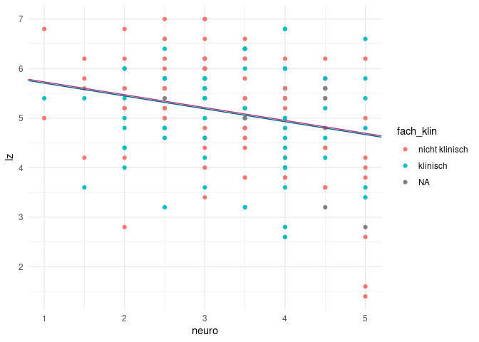<!-- -->
Wie man hier sowohl in der Summary des Regressionsmodell sowie im Plot erkennt, findet sich kein signifikanter Einfluss der Fachausrichtung auf die Lebenszufriedenheit. Allerdings haben wir mögliche Interaktionen zwischen den beiden Prädiktoren noch nicht aufgenommen. Damit startet ihr dann im Master...

*** 

## ggplot2 {#ggplot}

### Einleitung

Das Paket `ggplot2` ist das umfangreichste und am weitesten verbreitete Paket zur Grafikerstellung in `R`.  Seine Beliebtheit liegt vor allem an zwei Dingen: Es ist sehr eng mit der kommerziellen Seite von `RStudio` verwoben (Autor ist auch hier Hadley Wickham) und es folgt stringent einer "Grammatik der Grafikerstellung". Aus dem zweiten Punkt leitet sich auch sein Name ab: das "gg" steht für "Grammar of Graphics" und geht auf das gleichnamige Buch von Leland Wilkinson zurück, in dem auf 700 kurzen Seiten eine grammatikalische Grundstruktur für das Erstellen von Grafiken zur Datendarstellung hergeleitet und detailliert erklärt wird.

Weil `ggplot2` so beliebt ist, gibt es online tausende von Quellen mit Tutorials, Beispielen und innovativen Ansätzen zur Datenvisualisierung. Vom Autor des Pakets selbst gibt es ein [Überblickswerk über Data-Science als e-Book](https://r4ds.hadley.nz/), in dem sich auch [ein Kapitel](https://r4ds.hadley.nz/data-visualize.html) mit `ggplot2` befasst.

Für jede Seminar- und Abschlussarbeit sind Abbildungen unersetzbar und `ggolot2` bietet euch im Unterschied zu Base-R Plots viele einfache Anpassungsmöglichkeiten. 

<details><summary>Abschnitte in diesem Thema</summary>

- Eine kurze Beschreibung der [Beispieldaten](#beispieldaten)
- Die [Grundprinzipien](#grundprinzipien) von `ggplot2` - [Schichten](#schichten), [Plots als Objekte](#plots-als-objekte) und [Gruppierung von Daten](#gruppierte-abbildungen)
- Wie Abbildungen [angepasst werden](#abbildungen-anpassen) können: mit [Themes](#themes), [Beschriftungen](#beschriftung) und [Farbpaletten](#farbpaletten)

</details>

### Beispieldaten

Wir benutzen für unsere Interaktion mit `ggplot2` die Daten, die wir aus dem Fragebogen des ersten Tages gezogen haben. Hierfür nutzen wir die bereits bereinigte Version, die wir gestern am Ende der Session herunterladen haben.


``` r
# Lädt das Objekt aus der .rds-Datei und weist es der Variable workshopfb zu
workshopfb <- readRDS("workshopfb_bereinigt_2025-10-07.rds")

# Überprüfen, ob das Laden erfolgreich war
str(workshopfb)
```

```
## tibble [7 × 32] (S3: tbl_df/tbl/data.frame)
##  $ CASE            : num [1:7] NA 5 6 7 8 11 12
##  $ auge            : num [1:7] NA 3 1 4 2 3 -9
##  $ ffm             : num [1:7] NA 1 2 -9 1 2 -9
##  $ spick           : num [1:7] NA 2 1 2 2 2 -9
##  $ intoleranz      : num [1:7] NA 1 2 1 2 2 -9
##  $ allergie        : num [1:7] NA 2 2 1 2 2 -9
##  $ heimat          : num [1:7] NA 13 9273 1 6069 ...
##  $ nerd            : num [1:7] NA 70 62 55 100 73 -10
##  $ intelligenz     : num [1:7] NA 84 100 74 0 59 -10
##  $ extraversion    : num [1:7] NA 4 57 75 1 11 -10
##  $ narz            : num [1:7] NA 100 44 23 100 10 -10
##  $ mach            : num [1:7] NA 100 100 10 100 10 -10
##  $ psycho          : num [1:7] NA 100 100 100 100 26 -10
##  $ dioptrien_links : num [1:7] NA NA 0 NA NA 0 NA
##  $ dioptrien_rechts: num [1:7] NA NA 0 NA NA 0 NA
##  $ rumination      : num [1:7] NA 46 50 95 100 100 0
##  $ worry           : num [1:7] NA 28 83 32 100 100 -10
##  $ belastungt1     : num [1:7] NA 63 47 100 100 50 -10
##  $ belastungt2     : num [1:7] NA 24 62 92 100 28 -10
##  $ kompetenz       : num [1:7] NA 81 74 7 100 100 -10
##  $ hartnäckigkeit  : num [1:7] NA 19 79 10 100 42 -10
##  $ entscheidung    : Factor w/ 3 levels "Intuition und Bauchgefühl",..: NA 2 3 3 3 1 NA
##  $ akku            : num [1:7] NA 36 101 56 61 54 -9
##  $ highscore       : num [1:7] NA 3 3.4 2 4.9 0.5 NA
##  $ ffm_num         : num [1:7] NA 1 0 NA 1 0 NA
##  $ ffm_fac         : Factor w/ 2 levels "Nein","Ja": NA 2 1 NA 2 1 NA
##  $ spick_num       : num [1:7] NA 0 1 0 0 0 NA
##  $ spick_fac       : Factor w/ 2 levels "Nein","Ja": NA 1 2 1 1 1 NA
##  $ intoleranz_num  : num [1:7] NA 1 0 1 0 0 NA
##  $ intoleranz_fac  : Factor w/ 2 levels "Nein","Ja": NA 2 1 2 1 1 NA
##  $ allergie_num    : num [1:7] NA 0 0 1 0 0 NA
##  $ allergie_fac    : Factor w/ 2 levels "Nein","Ja": NA 1 1 2 1 1 NA
```

Eine kurze Erläuterung der Variablenbedeutungen:
  
  - `rumination`:Neigung, Gedanken und Ereignisse in meinem Kopf immer wieder durchzugehen
  - `worry`: Neigung sich über in der Zukunft liegenden Ereignisse Sorgen zu machen
  - `belastungt1`: Belastung durch Studium/Arbeit vor einem Jahr
  - `belastungt2`: Belastung durch Studium/Arbeit jetzt
  - `kompetenz`: Überzeugung schwierige Probleme mit adäquater ANstrengung bewältigen zu können
  - `hartnäckigkeit`: Fähigkeit, auch bei der Konfrontation mit Widerstand, Wege zu finden, um Probleme zu lösen
  - `entscheidung`: Modus in dem wichtige Entscheidungen getroffen werden (privat/beruflich)
  - `intelligenz`: eingeschätze Intelligenz im Vergleich zu anderen Teilnehmern
  - `extraversion`: selbsteingeschätze Extraversion
  - `nerd`: selbsteingeschätze nerdiness
  - `mach`: selbsteingeschätzer Machiavellismus
  - `narz`: selbsteingeschätzer Narzissmus
  - `psycho`:selbsteingeschätzer Psychotizismus
  - `ffm`: Wohnen in oder außerhalb Frankfurts
  - `heimat`:Entfernung zur Heimat in km
  - `spick`: schon mal in der Uni gespickt
  - `ìntoleranz`: Lebensmittelintoleranz
  - `allergie`: Lebensmittelintoleranz
  - `akku`: derzeitiger Handyakkustand
  - `promille`: eigene Rekordpromille
  - `dioptrien`: Dioptrien (gesondert für linkes Auge und rechtes Auge)
  - `auge`: Augenfarbe


Der Datensatz, mit dem wir arbeiten, sieht also so aus:


``` r
head(workshopfb)
```

```
## # A tibble: 6 × 32
##    CASE  auge   ffm spick intoleranz allergie heimat  nerd intelligenz extraversion  narz  mach
##   <dbl> <dbl> <dbl> <dbl>      <dbl>    <dbl>  <dbl> <dbl>       <dbl>        <dbl> <dbl> <dbl>
## 1    NA    NA    NA    NA         NA       NA     NA    NA          NA           NA    NA    NA
## 2     5     3     1     2          1        2     13    70          84            4   100   100
## 3     6     1     2     1          2        2   9273    62         100           57    44   100
## 4     7     4    -9     2          1        1      1    55          74           75    23    10
## 5     8     2     1     2          2        2   6069   100           0            1   100   100
## 6    11     3     2     2          2        2   1699    73          59           11    10    10
## # ℹ 20 more variables: psycho <dbl>, dioptrien_links <dbl>, dioptrien_rechts <dbl>,
## #   rumination <dbl>, worry <dbl>, belastungt1 <dbl>, belastungt2 <dbl>, kompetenz <dbl>,
## #   hartnäckigkeit <dbl>, entscheidung <fct>, akku <dbl>, highscore <dbl>, ffm_num <dbl>,
## #   ffm_fac <fct>, spick_num <dbl>, spick_fac <fct>, intoleranz_num <dbl>,
## #   intoleranz_fac <fct>, allergie_num <dbl>, allergie_fac <fct>
```


### `ggplot2` Grundprinzipien {#grundprinzipien}

In `ggplot2` werden immer Daten aus **einem** `data.frame` dargestellt. Das heißt, dass wir nicht, wie bei `plot` oder `hist` aus `R` selbst Vektoren oder Matrizen nutzen können. Daten müssen immer so aufbereitet sein, dass der grundlegende Datensatz sinnvoll benannte Variablen enthält und in dem Format vorliegt, in welchem wir die Daten visualisieren wollen. Das hat zwar den Nachteil, dass wir Datensätze umbauen müssen, wenn wir Dinge anders darstellen wollen, aber hat auch den Vorteil, dass wir alle Kenntnisse über Datenmanagement im Allgemeinen auf den Umgang mit `ggplot2` übertragen können. 

Bevor wir loslegen können, muss natürlich `ggplot2` installiert sein und geladen werden:


``` r
library(ggplot2)
```

Im Kern bestehen Abbildungen in der Grammatik von `ggplot2` immer aus drei Komponenten:

  - Daten, die angezeigt werden sollen
  - Geometrie, die vorgibt welche Arten von Grafiken (Säulendiagramme, Punktediagramme, usw.) genutzt werden
  - Ästhetik, die vorgibt, wie die Geometrie und Daten aufbereitet werden (z.B. Farben)

In den folgenden Abschnitten werden wir versuchen, diese drei Komponenten so zu nutzen, dass wir informative und eventuell auch ansehnliche Abbildungen generieren.

#### Schichten

In `ggplot2` werden Grafiken nicht auf einmal mit einem Befehl erstellt, sondern bestehen aus verschiedenen Schichten. Diese Schichten werden meistens mit unterschiedlichen Befehlen erzeugt und dann so übereinandergelegt, dass sich am Ende eine Abbildung ergibt.

Die Grundschicht sind die Daten. Dafür haben wir im vorherigen Abschnitt `workshopfb als Datensatz geladen. Zum Anfang sollten wir erst einmal einen Teildatensatz benutzen, um nicht direkt tausende von Datenpunkten auf einmal zu sehen. Gucken wir also einfach zehn Jahre in die Vergangenheit und nutzen das Jahr 2014: 

Bei größeren Datensätzen sollte zunächst ein subset der relevanten Variablen erstellt werden.

Um diese Daten in eine Schicht der Grafik zu überführen, können wir sie einfach direkt als einziges Argument an den `ggplot`-Befehl übergeben:


``` r
ggplot(workshopfb)
```

<!-- -->

Was entsteht ist eine leere Fläche. Wie bereits beschrieben, besteht eine Abbildung in `ggplot2` immer aus den drei Komponenten Daten, Geometrie und Ästhetik. Bisher haben wir nur eine festgelegt. Als erste Ästhetik sollten wir festlegen, welche Variablen auf den Achsen dargestellt werden sollen. Im letzten Semester war der erste Plot, den wir uns angeguckt hatten ein Balkendiagramm (über Tortendiagramme werden wie nie wieder reden). Bei diesen waren auf der x-Achse immer die Kategorien einer nominalskalierte Variable und auf der y-Achse die Häufigkeit dieser Kategorien dargestellt.  


``` r
ggplot(workshopfb, aes(x = auge))
```

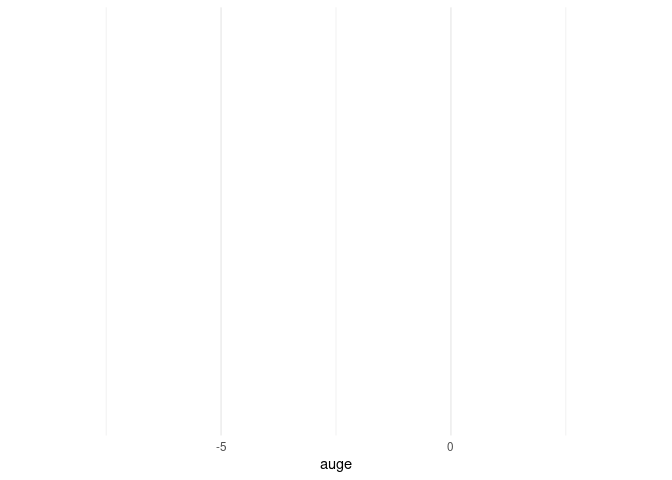<!-- -->

Ästhetik wird in `ggplot2` über den `aes`-Befehl erzeugt. Auf der x-Achse tauchen direkt die Ausprägungen der Variable auf, die wir dieser "Ästhetik" zugewiesen haben. Man sieht, dass hier einfach die Inhalte der Variable übernommen werden:


``` r
unique(workshopfb$auge)
```

```
## [1] NA  3  1  4  2 -9
```
Die sind zum einen etwas unübersichtlich und zum anderen (besonders wichtig) nicht sonderlich schön. Deswegen sollten wir die Variable in einen Faktor umwandeln und etwas leserlichere Labels vergeben:


``` r
library(dplyr)
workshopfb <- workshopfb %>%
  mutate(
    auge = na_if(auge, -9) # Ersetzt alle -9 durch NA in der Spalte 'auge'
  )
workshopfb$augefac<- factor(workshopfb$auge, 
                                    levels = c(1, 2, 3, 4),
                                    labels = c('Braun', 'Blau', 'Grün', 'Sonstige'))

# Labels ausgeben lassen
levels(workshopfb$augefac)
```

```
## [1] "Braun"    "Blau"     "Grün"     "Sonstige"
```
Ich habe in diesem Fall nur vier der möglichen Ausprägungen als `levels` deklariert - das führt dazu, dass die ausgelassenen Ausprägungen im gerade entstandenen Faktor als fehlende Werte (`NA`) kategorisiert werden. 

Wenn wir jetzt noch einmal die Fläche aufspannen, sehen wir direkt eine etwas schönere Benennung:


``` r
ggplot(workshopfb, aes(x = augefac))
```

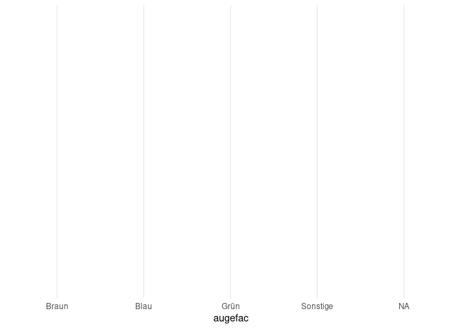<!-- -->


In diesem Schritt wird noch einmal deutlich, was ich gerade bereits angesprochen hatte:

> Daten müssen immer so aufbereitet sein, dass der grundlegende Datensatz sinnvoll benannte Variablen enthält und in dem Format vorliegt, in welchem wir die Daten visualisieren wollen.
>
> -- ich, vor wenigen Minuten

So. Nun ergibt sich das Problem, dass die NAs noch als eigener Balken angegeben werden. Das war so nicht gewollt. Mithilfe von `dlpyr`entfernen wir diesen Balken nun mit der `filter()`Funktion.

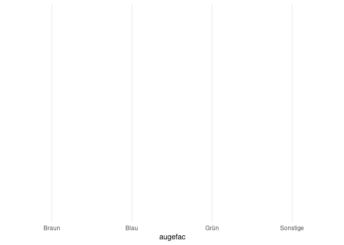<!-- -->

Wenn uns also etwas in unserer Abbildung nicht gefällt, ist der Ansatz in `ggplot` immer, die Daten anzupassen, weil Plots lediglich eine Darstellung dieser Daten sind. 

Jetzt fehlt uns noch die geometrische Form, mit der die Daten abgebildet werden sollen. Für die Geometrie-Komponente stehen in `ggplot2` sehr viele Funktionen zur Verfügung, die allesamt mit `geom_` beginnen. Eine Übersicht über die Möglichkeiten findet sich z.B. [hier](https://ggplot2.tidyverse.org/reference/#section-layer-geoms). Naheliegenderweise nehmen wir für ein Balkendiagramm _bar_ als die geometrische Form (`geom_bar`), die wir darstellen wollen. Neue Schichten werden in ihrer eigenen Funktion erzeugt und mit dem einfachen `+` zu einem bestehenden Plot hinzugefügt. Für ein Balkendiagramm sieht das Ganze also einfach so aus:

<!-- -->


Der immense Vorteil des Schichtens besteht darin, dass wir gleichzeitig mehrere Visualisierungsformen nutzen können. Das Prinzip bleibt das gleiche wie vorher: wir fügen Schichten mit dem `+` hinzu. Wir können also z.B. für Zeitverläufe einfach Punkte und Linien direkt miteinander kombinieren, oder für Abbildungen die Fehlerbalken direkt hinzufügen.


#### Plots als Objekte

Einer der Vorteile, die sich durch das Schichten der Abbildungen ergibt ist, dass wir Teile der Abbildung als Objekte definieren können und sie in verschiedenen Varianten wieder benutzen können. Das hilft besonders dann, wenn wir unterschiedliche Geometrie in einer gemeinsamen Abbildung darstellen wollen oder z.B. erst einmal eine Abbildung definieren wollen, bevor wir Feinheiten adjustieren.


``` r
basic <- ggplot(data = workshopfb %>% filter(!is.na(augefac)), aes(x = augefac))
```


In `basic` wird jetzt die *Anleitung* für die Erstellung der Grafik gespeichert. Erstellt wird die Grafik aber erst, wenn wir das Objekt aufrufen. Dabei können wir das Objekt auch mit beliebigen anderen Komponenten über `+` kombinieren:


``` r
basic + geom_bar()
```

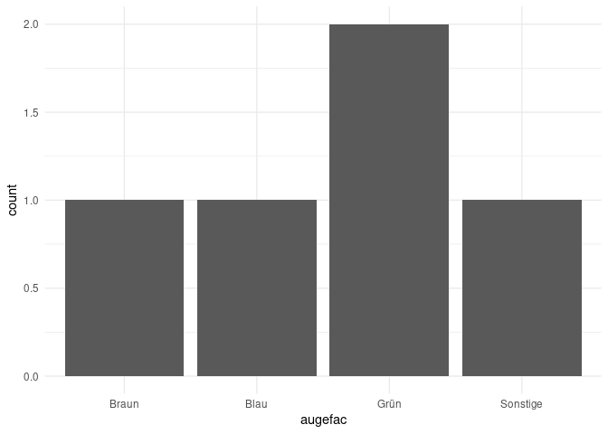<!-- -->

Damit die Beispiele im weiteren Verlauf auch selbstständig funktionieren, wird unten immer der gesamte Plot aufgeschrieben. Aber für Ihre eigenen Übungen oder Notizen ist es durchaus praktischer mit dieser Objekt Funktionalität zu arbeiten, um so zu umgehen, dass man immer wieder die gleichen Abschnitte aufschreiben muss.

#### Farben und Ästhetik {#Farben}

Oben wurde erwähnt, dass Ästhetik die dritte Komponente ist und als Beispiel wird die Farbe genannt. Das stimmt nicht immer: die Farbe der Darstellung muss nicht zwingend eine Ästhetik sein. Gucken wir uns zunächst an, wie es aussieht, wenn wir die Farbe der Darstellung ändern wollen:


``` r
ggplot(data = workshopfb %>% filter(!is.na(augefac)), aes(x = augefac)) +
  geom_bar(fill = 'blue', color = 'grey40')
```

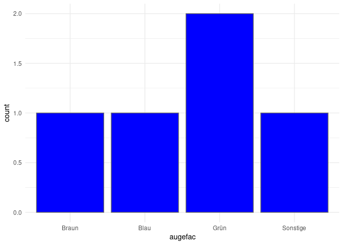<!-- -->


Bei Balken wird die Farbe des Balkens durch das Argument `fill` bestimmt - das Argument `color` bestimmt hingegen nur die Farbe des Rands. In diesem Fall haben alle Balken die Farbe geändert. Eine _Ästhetik_ im Sinne der `ggplot`-Grammatik ist immer abhängig von den Daten. Die globale Vergabe von Farbe ist also keine Ästhetik. Sie ist es nur, wenn wir sie von Ausprägungen der Daten abhängig machen. Das funktioniert z.B. so:


``` r
ggplot(data = workshopfb %>% filter(!is.na(augefac)), aes(x = augefac)) +
  geom_bar(aes(fill = augefac), color = 'grey40')
```

<!-- -->

Über den Befehl `aes` definieren wir eine Ästhetik und sagen `ggplot`, dass die Farbe der Balken von der Ausprägung auf der Variable `augefac` abhängen soll. Die Farbe kann aber natürlich auch von jeder anderen Variable im Datensatz abhängen - dadurch können wir die Farbe als dritte Dimension in der Darstellung unserer Daten nutzen.

#### Gruppierte Abbildungen

Die Balken der Abbildung zeigen uns jetzt erst einmal an, .... Interessant wird es aber vor allem dann, wenn wir verschiedene Variablen zueinander in Beziehung setzen - z.B. könnten wir  .... Diese ist sehr grob in der Variable ... abgebildet: 


``` r
table(workshopfb$spick)
```

```
## 
## -9  1  2 
##  1  1  4
```
Da wir gestern bereits `spick_fac`als Faktorversion von `spick`angelegt haben, können wir diesen direkt nutzen.


Jetzt können wir die Balken nach Ehrlichkeit gruppieren:


``` r
ggplot(data = workshopfb %>% filter(!is.na(augefac) & !is.na(spick_fac)), aes(x = augefac, group = spick_fac)) +
  geom_bar(aes(fill = spick_fac), color = 'grey40')
```

<!-- -->


Per Voreinstellung wird in `ggplot` ein sogenannter "stacked" Barplot erstellt, bei dem die Balken übereinander gestapelt werden. Dies ist jetzt hier tatsächlich praktischerweise nicht passiert (Vorführeffekt). Falls dies mal passieren sollte, kann man das ändern, indem man das `position`argument ändert: 

``` r
ggplot(data = workshopfb %>% filter(!is.na(augefac) & !is.na(spick_fac)), aes(x = augefac, group = spick_fac)) +
  geom_bar(aes(fill = spick_fac), color = 'grey40', position = 'dodge')
```

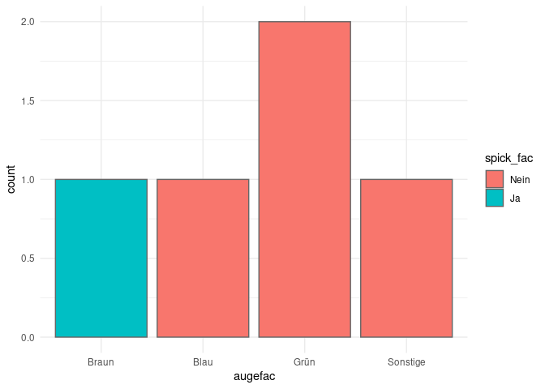<!-- -->


### Abbildungen anpassen

Die Abbildungen, die wir bisher erstellt haben, nutzen alle das in `ggplot2` voreingestellte Design. Auch wenn es sicherlich einen theoretisch sehr gut fundierten Grund gibt, dass der Hintergrund der Abbildung in einem demotivierenden Grauton gehalten sein sollte, gibt es Designs, die man schöner finden kann. Im folgenden gucken wir uns an, wie man seine Abbildungen nach seinen eigenen Vorlieben anpassen kann.

#### Themes

In `ggplot2` werden die Grundeigenschaften von Abbildungen in "Themes" zusammengefasst. Mit `?theme_test` erhält man eine Auflistung aller Themes, die von `ggplot2` direkt zur Verfügung gestellt werden. Diese 10 Themes sind erst einmal sehr konservative Einstellungen für die Eigenschaften von Grafiken. Sehen wir uns meinen persönlichen Favoriten, das sehr dezente `theme_minimal()` an. Dazu legen wir die Grundanleitung der Abbildung für die Workshop-Fragebogen-Daten zunächst in einem Objekt ab (das ist nicht notwendig, soll nur im Folgenden den Fokus auf die Themes legen):


``` r
bars <- ggplot(data = workshopfb %>% filter(!is.na(augefac) & !is.na(spick_fac)), aes(x = augefac, group = spick_fac)) +
  geom_bar(aes(fill = spick_fac), color = 'grey40', position = 'dodge')
```

Um das Theme einer Abbildung zu verändern, können Sie es - wie Geometrie - mit dem `+` hinzufügen.


``` r
bars + theme_minimal()
```

<!-- -->

Gegenüber der Voreinstellung (`theme_grey`) verändert sich hier, dass der Hintergrund jetzt nicht mehr grau ist und das Raster stattdessen in Hellgrau gehalten ist.Die Eigenschaften der Abbildung hinsichtlich des Aussehens von Hintergrund usw. bleiben davon aber unberührt.

Über die von `ggplot2` direkt mitgelieferten Themes hinaus gibt es beinahe unzählige weitere Pakete, in denen vordefinierte Themes enthalten sind. Eine der beliebtesten Sammlungen findet sich im Paket `ggthemes`.


``` r
install.packages('ggthemes')
library(ggthemes)
```


Dieses Paket liefert (neben anderen optischen Erweiterungen) über 20 neue Themes, die häufig den Visualisierungen in kommerzieller Software oder in bestimmten Publikationen nachempfunden sind. In Anlehnung an weit verbreitete Grundprinzipien zur Grafikgestaltung nutzen wir als allererstes natürlich das nach Tuftes "maximal Data, minimal Ink"-Prinzip erstellte Theme:


``` r
bars + theme_tufte()
```

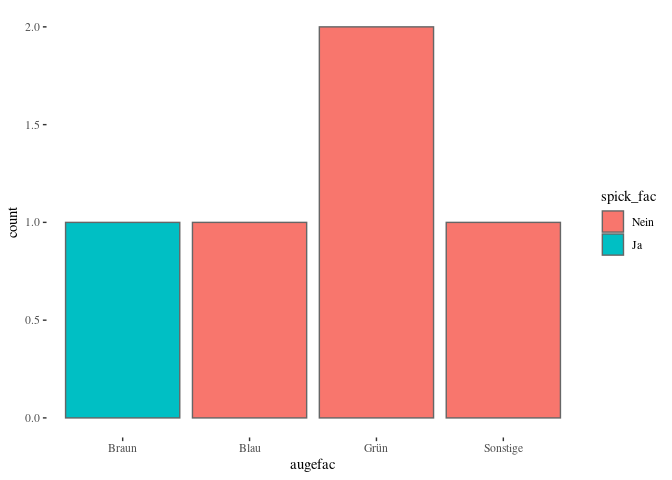<!-- -->

Wenn uns ein Theme so gefällt, dass wir dieses für alle Plots benutzen wollen, können wir es mit `theme_set()` als neue Voreinstellung definieren. Wie gesagt, mag ich den minimalistischen Stil von `theme_minimal()`, weil er wenig von den Daten ablenkt:


``` r
theme_set(theme_minimal())
```

Dieser Befehl sollte allerdings mit Vorsicht genossen werden, weil er globale Einstellungen in `R` verändert, ohne davor zu warnen, dass eventuell vorherige Einstellungen verloren gehen. Zur Sicherheit können wir mit 


``` r
theme_set(theme_grey())
```

jederzeit zurück in die ursprünglichen Voreinstellungen.

#### Beschriftung

Eine der wichtigsten Komponenten jeder Abbildung ist die Beschriftung. Nur wenn ausreichend gut gekennzeichnet ist, was wir darstellen, können wir darauf hoffen, dass die Information vermittelt wird, die wir vermitteln wollen. Zunächst ist es sinnvoll, die Achsen ordentlich zu beschriften. Per Voreinstellung werden hierzu die Namen der Variablen genutzt. Wir können also eine nützliche Beschriftung auch dadurch erzwingen, dass wir die Variablen im Datensatz ordentlich benennen. Besonders wenn die Achsen aber Zusatzinformationen (wie z.B. "(in %)") enthalten sollen, ist es aber unumgänglich die Benennung hinterher zu ergänzen. Darüber hinaus kann es sinnvoll sein, einer Grafik Titel und Untertitel zu geben.

Für unsere Abbildung wäre es sinnvoll, neben einem Titel auch eine aussagekräftigere Beschriftung der Achsen und der Legende vorzunehmen. 


``` r
ggplot(data = workshopfb %>% filter(!is.na(augefac) & !is.na(spick_fac)), aes(x = augefac, group = spick_fac)) +
  geom_bar(aes(fill = spick_fac), color = 'grey40', position = 'dodge') +
  labs(x = 'Augenfarbe',
    y = 'Anzahl',
    fill = 'Ehrlichkeit') +
  ggtitle('Ehrlichkeit nach Augenfarbe', 'in absoluten Zahlen')
```

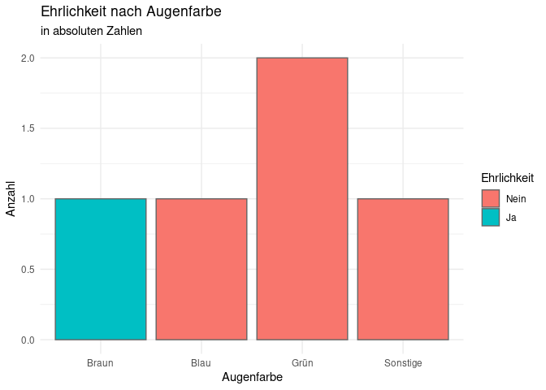<!-- -->

Die `labs`-Funktion ermöglicht uns das Vergeben von *Labels* für die Variablen, die wir als Ästhetiken in `aes()` festgehalten haben. `x` ersetzt also den Variablennamen von `auge`, der per Voreinstellung zur Beschriftung herangezogen wird. Das Gleiche gilt dann auch für `y` und `color` ersetzt den Titel der Legende. Die `ggtitle`-Funktion nimmt zwei Argumente entgegen: den Titel und einen Untertitel.

Damit wir unsere Grafik in späteren Abschnitten wiederverwenden können, legen wir sie hier wieder in einem Objekt ab:


``` r
bars <- ggplot(
  data = workshopfb %>% filter(!is.na(augefac) & !is.na(spick_fac)), 
  aes(x = augefac, fill = spick_fac),
  geom_bar(position = 'dodge', color = 'grey40') +
  labs(x = 'Augenfarbe',
     y = 'Anzahl',
     fill = 'Ehrlichkeit')) +
  ggtitle('Ehrlichkeit nach Augenfarbe', 'in absoluten Zahlen')
```

Eine weitere Möglichkeit um Achsenbeschriftungen hinzuzufügen und darüberhinaus auch weitere Charakteristika der Achsen zu verändern ist über die Funktionen der Familie `scale_*aesthetic*_*specification*`. Anpassbar ist z.B.:
- Achsentitel
- Achsenbreaks
- Achsenlimits
- Achsenbeschriftung
- Achsenpadding
- (und noch vieles mehr: alpha, color, fill, shape, linesize, size, etc.


``` r
ggplot(data = workshopfb %>% filter(!is.na(augefac) & !is.na(spick_fac)), aes(x = augefac, group = spick_fac)) +
  geom_bar(aes(fill = spick), color = 'grey40', position = 'dodge') +
  # Anpassung der Y-Achse (Count/Anzahl)
  scale_y_continuous(name = 'Anzahl der Teilnehmenden', # Neuer Achsentitel
                     limits = c(0, 30),                 # Beispiel-Limit festlegen
                     breaks = seq(0, 30, 5)            # Breaks in 10er-Schritten
                     ) + 
  # Anpassung der X-Achse (Augenfarbe)
  scale_x_discrete(name = 'Selbstberichtete Augenfarbe', # Neuer Achsentitel
                   # Hier könnten Sie z.B. die Labels der Kategorien überschreiben
                   # oder die Reihenfolge mit 'limits' festlegen.
                   # Wir lassen es hier einfach, da die Labels bereits gut sind.
                   ) + 
  ggtitle('Ehrlichkeit beim Spicken', 'verteilt nach Augenfarbe')
```

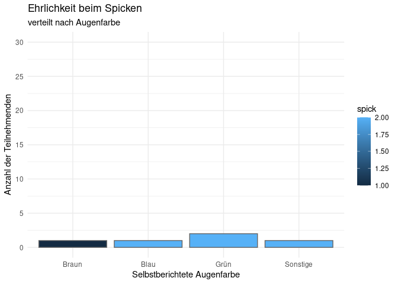<!-- -->


Die Auswahl einer Bearbeitungsmöglichkeit bleibt einem selbst überlassen. Tipp: Wenn nur wenig bearbeitet werden soll (z.B. Beschriftung und Achsengrenzen) ist die Lösung mit `labs`und `lim` einfacher.

#### Farbpaletten

Bisher haben wir gesehen, wie die "Rahmenbedingungen" der Grafik mit unserem Theme angepasst werden können - also wie Titel und Hintergrund geändert werden oder wir festlegen, welche Achsen wie beschriftet werden. Was dabei bisher konstant war, war die Farbgebung, die aufgrund der Gruppierungsvariable `spick` zustande kommt. Damit ist jetzt Schluss.

In `ggplot2` wird die Vergabe von Farben in der Ästhetik anhand von zwei Dingen unterschieden: der Geometrie und dem Skalenniveau der Variable, die die Färbung vorgibt. Kontinuierliche Variablen (Variablen, die in `R` als `numeric` definiert sind) werden anhand eines Blau-Farbverlaufs dargestellt, diskrete Variablen (Variablen, die in `R` als `factor` definiert sind) anhand eines vordefinierten Schemas unterschiedlicher Farben. Dieses Schema ist das [Brewer Farbschema](http://colorbrewer2.org/), welches ursprünglich für Kartendarstellungen entwickelt wurde. 

Nehmen wir an, dass wir unsere Abbildung irgendwo drucken möchten - Farbdruck ist wahnsinnig teuer. Um mit Grautönen zu arbeiten, können wir z.B. `scale_fill_grey` benutzen:


``` r
ggplot(data = workshopfb %>% filter(!is.na(augefac) & !is.na(spick_fac)), aes(x = augefac, group = spick_fac)) +
  # Wichtig: fill = MUSS den Factor (spick_fac) verwenden
  geom_bar(aes(fill = spick_fac), color = 'grey40', position = 'dodge') +
  
  # Anpassung der Y-Achse (Count/Anzahl)
  scale_y_continuous(name = 'Anzahl der Teilnehmenden', # Neuer Achsentitel
                     limits = c(0, 30),                 # Beispiel-Limit festlegen
                     breaks = seq(0, 30, 5)             # Breaks in 5er-Schritten
                     ) + 
  
  # Anpassung der X-Achse (Augenfarbe)
  scale_x_discrete(name = 'Selbstberichtete Augenfarbe'
                     ) + 
  
  # GRAU-STUFEN HINZUFÜGEN
  scale_fill_grey() + 
  
  ggtitle('Ehrlichkeit beim Spicken', 'verteilt nach Augenfarbe')
```

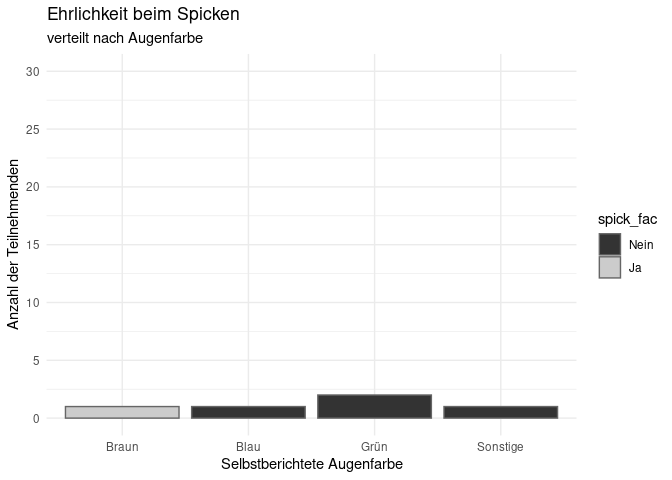<!-- -->

Das bei den [Themes](#Themes) erwähnte Paket `ggthemes` enthält auch weitere Farbpaletten, die Sie nutzen können, um Ihren Plot nach Ihren Vorlieben zu gestalten. Wichtig ist beispielsweise, dass es eine Palette namens `colorblind` hat, die Farben so auswählt, dass sie auch von Personen mit Farbblindheit differenziert werden können. Wir können aber natürlich auch unsere ganz eigene Farbpalette definieren - z.B. die offizielle Farbpalette des Corporate Designs der Goethe Universität, wie sie auch in den Lehrveranstaltungen des Bachelors und Masters benutzt wird.

Für diese Palette können wir zunächst in einem Objekt die Farben festhalten, die wir benötigen. In `ggplot2` ist es dabei am gängigsten, Farben entweder [über Worte auszuwählen](http://www.stat.columbia.edu/~tzheng/files/Rcolor.pdf) oder via [hexadezimaler Farbdefinition](https://www.color-hex.com/) zu bestimmen. Für die fünf Farben, die von der Corporate Design Abteilung der Goethe Uni definiert werden ergibt sich folgendes Objekt:


``` r
gu_colors <- c('#00618f', '#e3ba0f', '#ad3b76', '#737c45', '#c96215')
```

Dieses Objekt können wir dann nutzen, um mit `scale_fill_manual` selbstständig Farben zuzuweisen:


``` r
ggplot(
  data = workshopfb %>% filter(!is.na(augefac) & !is.na(entscheidung)), # <-- Fehler 1 behoben: Klammer für filter() geschlossen
  aes(x = augefac, group = entscheidung) # <-- Fehler 1 behoben: aes() ist jetzt ein separates Argument
) +
  # color und position stehen außerhalb von aes()
  geom_bar(aes(fill = entscheidung), color = 'grey40', position = 'dodge') + # <-- Fehler 2 behoben: Klammer für geom_bar() erst hier geschlossen
  
  # Anpassung der Y-Achse (Count/Anzahl)
  scale_y_continuous(name = 'Anzahl der Teilnehmenden', # Neuer Achsentitel
                     limits = c(0, 15),                 # Beispiel-Limit festlegen
                     breaks = seq(0, 15, 3)             # Breaks in 3er-Schritten
                     ) + 
  
  # Anpassung der X-Achse (Augenfarbe)
  scale_x_discrete(name = 'Selbstberichtete Augenfarbe'
                     ) + 
  
  # Goethe Farben HINZUFÜGEN
  scale_fill_manual(values = gu_colors) + # <-- Fehlendes '+' am Ende der Skala hinzugefügt
  
  ggtitle('Entscheidungsmodus', 'verteilt nach Augenfarbe')
```

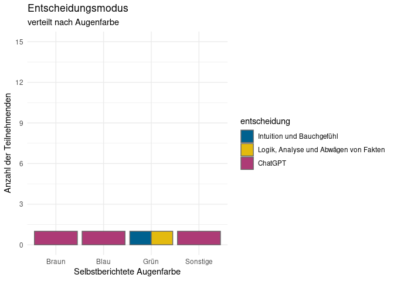<!-- -->

Die Zuordnung der Farben erfolgt anhand der Reihenfolge in `gu_colors` und der Reihenfolge der Ausprägungen von `entscheidung`. Letztere ist - wie sie bestimmt festgestellt haben - alphabetisch. Wie häufig in `ggplot2` können Sie die Daten ändern (also mit `relevel` die Reihenfolge der Ausprägungen ändern) um Veränderungen in der Darstellung zu bewirken.

### Verschiedene Plots
Im Folgenden werden noch ein paar Beispiele für den Einsatz von `ggplots`dargestellt, um euch zu zeigen, welche Möglichkeiten sich so bieten. Wie bereits zum Anfang erwähnt, gibt es unzählige Quellen mit Tipps und Infos zu den Möglichkeiten. Eine hilfreiche Übersicht möglicher Darstellungsformen in Abhängigkeit eurer Daten findet ihr bei [Data to Viz] (https://www.data-to-viz.com/). 

***

### Deskriptivstatistik

Die Verteilung eine numerischen Variable könnt ihr per Boxplot darstellen...


``` r
ggplot(
  data = workshopfb %>% filter(!is.na(intoleranz_fac) & !is.na(mach)),
  aes(x = intoleranz_fac, y = mach)
) +
  geom_boxplot() +
  theme_minimal() +
  labs(
    x = 'Lebensmittelintoleranz',
    y = 'Machiavellismus' 
  )
```

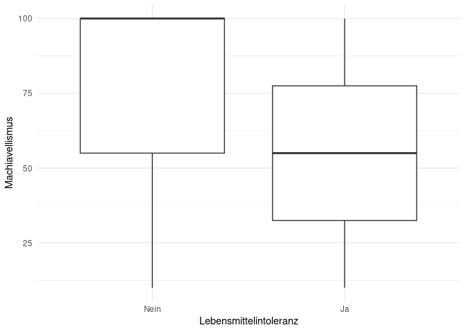<!-- -->


oder Histogramm...


``` r
ggplot(
  # Filtern Sie nur NA-Werte im Mach-Score selbst
  data = workshopfb %>% filter(!is.na(mach)),
  
  # x = Kontinuierliche Variable (Mach-Score)
  aes(x = mach)
) +
  geom_histogram(fill = "darkblue", color = "white", binwidth = 1) + 
  theme_minimal() +
  
  # Anpassung der Achsenbeschriftungen und Skalen
  scale_x_continuous(name = 'Machiavellismus-Score (Kontinuierlich)',
                     limits = c(0,100),
                     breaks = seq(0,100,10)
                    
                     ) + 
  scale_y_continuous(name = 'Anzahl der Teilnehmenden') + 
  
  labs(title = 'Verteilung des Machiavellismus-Scores')
```

```
## Warning: Removed 1 row containing non-finite outside the scale range (`stat_bin()`).
```

```
## Warning: Removed 2 rows containing missing values or values outside the scale range
## (`geom_bar()`).
```

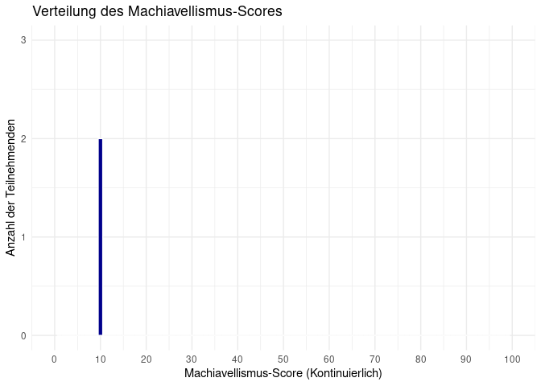<!-- -->
... oder beispielsweise als Density-Plot (gut um die Verteilung, Schiefe und Kurtosis zu betrachten) dargestellt werden:

``` r
ggplot(
  data = workshopfb %>% filter(!is.na(mach)),
  aes(x = mach)
  ) +
  geom_density() +
  theme_minimal() +
  labs(x = 'Selbsteingeschätzter Machiavellismus (0-100)')
```

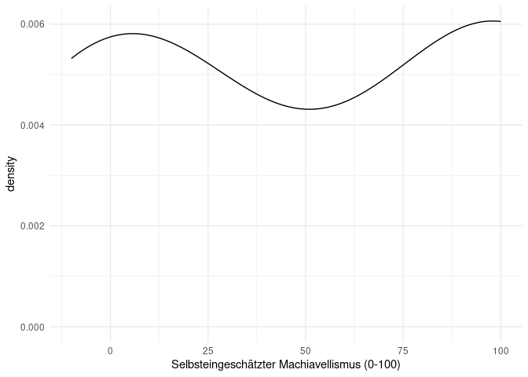<!-- -->


***

## t-Test {#tTest}

### Was erwartet uns?
Nun wollen wir uns unserem ersten inferenzstatistischen Test in R widmen. Um eine Aussage darüber zu treffen ob ein statistisch signifikanter Unterschied in dem Mittelwert unserer Stichprobe und der Population besteht haben Sie im Bachelor wohl den t-Test kennengelernt. Genauer den Einstichproben t-Test. Neben diesem behandeln wir später noch die t-Tests für den Mittelwertsvergleich von unabhängigen und abhängigen Stichproben.

### Daten einlesen

Der Datensatz den wir für die Analyse benutzen stammt aus der 3. Teilstudie von Firschlich et al. (2021). Hier wurde in einem experimentellen Design untersucht, welche Auswirkungen neutrale vs. ideologische geladene Berichterstattung auf Wahrnehmung und Glaubhaftigkeitseinschätzung eines Nachrichtenbeitrags über einen deutschen Politiker hat. Es wurde außerdem noch die Verschwörungsmentalität und das Gefühl der Marginalisierung erhoben.


``` r
source("https://pandar.netlify.app/daten/Data_Processing_distort.R")

# Kategoriale Variablen in Faktoren umwandeln
distort$east <- factor(distort$east,
                       levels = c(0, 1),
                       labels = c("westdeutsch", "ostdeutsch"))

distort$stud <- factor(distort$stud,
                       levels = c(0, 1),
                       labels = c("Nicht Studi", "Studi"))
```

Weitere Informationen zu den Variablen finden Sie [hier](/daten/datensaetze/#distorted-news).

### Einstichproben t-Test

#### Formeln {#Formeln}

Der t-Test basiert auf folgender Formel:
  
$$t_{emp} = \frac{\bar{x} - {\mu}}{\hat\sigma_{\bar{x}}}$$
wobei sich der Standardfehler (*SE*)  des Mittelwerts wie folgt zusammensetzt:
  
$$\hat\sigma_{\bar{x}} = {\frac{{\hat\sigma}}{\sqrt{n}}}$$

Da die Standardabweichung in der Population nicht bekannt ist, muss diese mittels Nutzung der Standardabweichung der Stichprobe geschätzt werden. Dies funktioniert über die Funktion `sd()`.

#### Hypothese


Als Sie die demographischen Daten ihrer Stichprobe betrachten fällt ihnen auf das die Gruppe der Studierenden mit einem Anteil von 29.54% überrepräsentiert ist. Außerdem haben Sie erst letztens in einer Studie gelesen das Studierende eine unterdurchschnittlich geringen Verschwörungsglauben aufweisen.
Daher haben Sie die Vermutung dass die Stichprobe die sie erhoben haben eine signifikant niedrigere Verschwörungsmentalität (`cm`) aufweist als die Population ($\mu = 5.4$)
Unsere Forschungshypothese lautet nun wie folgt:

$H_0$: Die mittlere Verschwörungsmentalität unserer Stichprobe ist gleich oder höher als die Verschöwrungsmentailität der Population.

$H_1$: Die mittlere Verschwörungsmentalität unserer Stichprobe ist kleiner als die Verschöwrungsmentailität der Population.

In der mathematischen Hypothesennotation:

$$H_0: \mu_0 \leq \mu_1$$
  
$$H_1: \mu_0 > \mu_1$$

#### Deskriptiv {#desk}

Bevor wir in die inferenzstatistische Analyse einsteigen, ist es immer gut, sich einen Überblick über die deskriptiven Werte zu verschaffen. Wir können uns nun unser zuvor erworbenes Wissen über Pakete zu nutze machen um einen effizienten deskriptivstatistischen Überblick zu erhalten. Hier am Beispiel von `psych` und `skimr`.


``` r
# Pakete einlesen
library(psych)
library(skimr)

# Deskriptivstatistik
psych::describe(distort$cm)
```

```
##    vars   n mean   sd median trimmed  mad min max range  skew kurtosis   se
## X1    1 474  4.8 1.58      5     4.9 1.48   1   7     6 -0.46    -0.58 0.07
```

``` r
skimr::skim(distort$cm)
```


Table: Data summary

|                         |           |
|:------------------------|:----------|
|Name                     |distort$cm |
|Number of rows           |474        |
|Number of columns        |1          |
|_______________________  |           |
|Column type frequency:   |           |
|numeric                  |1          |
|________________________ |           |
|Group variables          |None       |


**Variable type: numeric**

|skim_variable | n_missing| complete_rate| mean|   sd| p0| p25| p50| p75| p100|hist  |
|:-------------|---------:|-------------:|----:|----:|--:|---:|---:|---:|----:|:-----|
|data          |         0|             1|  4.8| 1.58|  1|   4|   5|   6|    7|▂▂▆▆▇ |
#### Voraussetzungen

Inferenzstatistische Tests haben für ihre Durchführung immer Voraussetzungen. Diese können in Anzahl und Art variieren. Verletzungen von Voraussetzungen verzerren verschiedene Aspekte der Testung. Für manche Verletzungen gibt es Korrekturen, andere führen dazu, dass man ein anderes Verfahren wählen muss. Wir werden uns im Laufe des Semesters mit vielen Voraussetzungen beschäftigen. Für den Einstichproben-t-Test ist die Liste der Voraussetzungen nicht sehr lange:

  
1. mindestens intervallskalierte abhängige Variable
2. Bei *n* < 30 : Normalverteilung der abhängigen Variable in der Population.
  
Die erste Voraussetzung lässt sich nicht mathematisch sondern theoretisch prüfen. Sie ist natürlich essentiell, da wir hier mit Mittelwerten und Varianzen rechnen und wir bereits gelernt haben, dass diese erst ab dem Intervallskalenniveau genutzt werden sollten. Wir haben außerdem gelernt, dass Skalenwerte häufig als intervallskaliert angenommen werden. Da Verschöwrungsmentalität (`cm`) ein solcher Skalenwert ist, können wir die Voraussetzung als gegeben annehmen,

Kommen wir zu der zweiten Voraussetzung. Für die inferenzstatistische Testung bestimmen wir die Position unseres empirischen Mittelwerts in der Stichprobenkennwerteverteilung der Mittelwerte. Für diese nehmen wir eine spezifische Form an - sie soll der $t$-Verteilung (übergehend bei $n \rightarrow \infty$ in eine $z$-Verteilung) folgen. Für diese Annahme ist die Normalverteilung der Variablen in unserer Stichprobe eine hinreichende Voraussetzung. Das heißt, wenn diese gegeben ist, folgt die Stichprobenkennwerteverteilung der von uns angenommenen Form. Wie wir später besprechen werden, ist die Normalverteilung aber keine notwendige Voraussetzung. Zunächst wollen wir uns die optische Prüfung der Normalverteilung vornehmen später wird auch noch die inferenzstatistische Testungen folgen. Die einfachste optische Prüfung ist das Zeichnen eines QQ-Plots.

Dabei hilft uns das zuvor installierte `car` Paket.


``` r
# Paket einlesen
library(car)

# QQ-Plot zeichnen
car::qqPlot(distort$cm)
```

<!-- -->

```
## [1] 63 80
```

Auf der x-Achse sind diejenige Positionen notiert, die unter Gültigkeit der theoretischen Form der Normalverteilung zu erwarten wären. Auf der y-Achse wird die beobachtete Position eines Messwerts abgetragen.

Entspricht nun unsere empirische Datenmenge der angenommenen Normalverteilung perfekt, würden alle Punkte auf der Geraden in der Mitte liegen. Auch hier gilt natürlich, dass die Bewertung letztlich eine gewisse Subjektivität hat. Die Punkte sollten nicht zu weit von der Geraden entfernt liegen.

Nach dem Plot zu urteilen könnte eine Verletzung der Normalverteilungsannahme hier vorliegen. Allerdings können wir uns behelfen und den Test trotzdem durchführen. Die Normalverteilungsannahme darf nämlich verletzt sein, wenn die Stichprobe mindestens 30 Personen umfasst. In diesen Fällen wird das inferenzstatistische Ergebnis nicht verzerrt. Dann gilt der *zentrale Grenzwertsatz*: Die Stichprobenkennwertverteilung der Mittelwerte nähert sich einer Normalverteilung an, unabhängig davon wie das Merkmal selbst in der Population verteilt ist. Die Stichprobengröße von 30 ist allerdings nur eine Daumenregel - bei starken Verletzungen sollte man sich auch überlegen, ob der Mittelwert der beste Repräsentant für die mittlere Ausprägung der Variable darstellt.

#### `t.test`-Funktion

Wir könnten nun die zuvor berechneten [deskriptivstatistischen Werte](#desk) in die weiter oben gezeigte [Formel](#Formeln) einsetzen und so den Einstichproben t-Test berechnen. Zum Glück schafft R hier jedoch mit der `t.test()`-Funktion abhilfe.


``` r
t.test(distort$cm,
       mu = 5.4,
       alternative = "less",
       conf.level = 0.95)
```

```
## 
## 	One Sample t-test
## 
## data:  distort$cm
## t = -8.2677, df = 473, p-value = 6.962e-16
## alternative hypothesis: true mean is less than 5.4
## 95 percent confidence interval:
##      -Inf 4.919266
## sample estimates:
## mean of x 
##  4.799578
```


Die Funktion braucht im Einstichprobenfall neben den Werten der Stichprobe noch das Argument `mu`, in dem der Populationsmittelwert festgehalten wird. `alternative` gibt an, ob wir in unseren Hypothesen eine Richtung haben (`two.sided` für ungerichtete Hypothesen, `less` oder `greater` für gerichtete Hypothesen). Da unsere Hypothese $H_1$ den Stichprobenmittelwert als kleiner als den Populationsmittelwert annimmt, wählen wir in diesem Fall `less`. In `conf.level` geben wir $1 - \alpha$ mit Hilfe dieses Arguments bestimmt R das Konfidenzintervall.

Im Output sind bereits die wichtigsten Informationen enthalten. Wir erhalten den empirischen t-Wert $t_{emp}$ = -8.27. Außerdem können wir auf Grund des ausgegebenen p-Werts erkennen das unser Ergebnis signifikant ist. Die Freiheitsgrade (`df`) werden auch berichtet.

#### Effektstärke

Letztlich wollen wir uns nur kurz dem Effektstärkemaß des t-Tests widmen, Cohen's d. Auch hier können wir uns dank eine R Funktion (`cohen.d()`) aus dem `effsize` Paket die Formel sparen.


``` r
library(effsize)

effsize::cohen.d(distort$cm,
                 f = NA,
                 mu = 5.4,
                 conf.level = 0.95)
```

```
## 
## Cohen's d (single sample)
## 
## d estimate: -0.3797466 (small)
## Reference mu: 5.4
## 95 percent confidence interval:
##      lower      upper 
## -0.5618764 -0.1976168
```


Die Funktion nimmt ähnliche Argumente entgegen wie die `t.test()`-Funktion. Neu ist die Besonderheit das wir `f` = `NA` setzen. Aus der Argument Beschreibung der Funktion entnehmen wir für f "if NA a single sample effect size is computed" und da das Argument per default nicht auf `NA` steht müssen wir dies selbst noch angeben.

Die Effektstärke bei unserer Hypothese beträgt $d$ = -0.38.


### t-Test für Unabhängige Stichproben

Wir fokussieren uns nun auf Unterschiede zwischen zwei Gruppen. Hierbei muss zwischen unabhängigen und abhängigen Stichproben unterschieden werden - um den ersten Fall geht es uns hier, den Zweiten gucken wir uns später an.

Den Einstichproben t-Test haben wir noch etwas ausführlicher behandelt, da wir aber nun die `t.test()`-Funktion kennen und lieben gelernt haben reduzieren wir die Inhalte für den (un-)abhängigen t-Test auf das Nötigste.

#### Hypothese

Die beim Schreiben dieses Artikels erst kürzlich stattgefundenen Landtagswahlen in drei ostdeutschen Bundesländern haben in den Medien erneut Fragen über Rechtspopulismus und den Graben zwischen Ost- und Westdeutschen aufgeworfen.

Als Autoren wollen wir zu diesen Themen keine politische Meinung darstellen, die folgende Hypothese ist mit einem Funken Blauäugigkeit zu sehen.

Nach einem Marathon an Spiegel Dokumentationen zu dem Themenkomplex "neue Rechte" haben Sie gelernt das Rechtspopulisten schnell Hand in Hand mit sogenannten Verschwörungstheoretikern gehen. Da sich eine bestimmte teils gesichert rechtsextreme Partei großer Beliebtheit in den östlichen Landtagswahlen erfreute wollen Sie ihre Hypothese nun testen.

$H_0$: Ostdeutsche weisen im Mittel eine gleiche oder geringere Verschwörungsmentalität auf als Westdeutsche.

$H_1$: Ostdeutsche weisen im Mittel eine höhere Verschwörungsmentalität auf als Westdeutsche.

#### Voraussetzungen

Die Voraussetzungen des t-Tests für unabhängige Stichproben lauten:

1. Beide Stichproben sind unabhängig voneinander.
2. Die einzelnen Messwerte innerhalb der zwei Gruppen sind unabhängig voneinander.
3. Die abhängige Variable ist in der Population der beiden Gruppen normalverteilt.
4. Die Varianz der abhängigen Variable ist innerhalb der Gruppen gleich (Homoskedastizität).

Die ersten beiden Voraussetzungen lassen sich nicht rechnerisch überprüfen. Unser Experimentaldesign gibt vor ob diese erfüllt sind. In unserem Fall sind sie das.

Die letzten beiden Voraussetzungen können wir rechnerisch überprüfen. Bei dem Einstichproben t-Test hatten wir erwähnt das die Normalverteilungsannahme auf mit inferenzstatistischen Tests überprüft werden kann. Einer dieser Test ist der Shapiro-Wilk-Test den wir in R mit der fast gleichnamigen Funktion (`shapiro.test()`) ausführen können.


``` r
# AV Spalte für die beiden Gruppen auftrennen
west_data <- subset(distort, subset = east == "westdeutsch")
ost_data <- subset(distort, subset = east == "ostdeutsch")

shapiro.test(west_data$cm)
```

```
## 
## 	Shapiro-Wilk normality test
## 
## data:  west_data$cm
## W = 0.95215, p-value = 3.157e-10
```

``` r
shapiro.test(ost_data$cm)
```

```
## 
## 	Shapiro-Wilk normality test
## 
## data:  ost_data$cm
## W = 0.90941, p-value = 0.0001466
```

Der Test fällt in beiden Gruppen signifikant aus. Demnach müssten wir die Normalverteilungsannahme verwerfen. Da wir uns aber an den *zentralen Grenzwertsatz* erinnern und in beiden Gruppen $n > 30$ können wir auch hier die Annahme als gegeben ansehen.

Übrig bleibt die Homoskedastizitätsannahme die wir mit Hilfe des levene-Tests überprüfen können. Dafür findet sich im `car` Paket die Funktion `leveneTest()`.


``` r
# Paket einlesen
library(car)     #wenn nicht schon geschehen

# Levene Test
car::leveneTest(distort$cm ~ distort$east)
```

```
## Levene's Test for Homogeneity of Variance (center = median)
##        Df F value Pr(>F)
## group   1  0.0186 0.8916
##       472
```

Zunächst müssen wir feststellen, der Test ist nicht signifikant und die Varianz der abhängigen Variable in den beiden Gruppen somit gleich. Die Annahme wird als gegeben angesehen.

In der Funktion haben wir eine besondere Formulierung der Argumente vorgenommen. Vereinfacht könnte man sagen: $AV \sim UV$
Diese Art der Formulierung können wir immer dann nutzen wenn wir einen Datensatz (`distort`) haben bei dem in einer Spalte alle Werte unserer abhängigen Variable (`cm`) stehen und eine weitere Spalte unsere Stichprobe in Gruppen einteilt (`east`).

#### `t.test`

Da wir die Voraussetzungen überprüft haben können wir nun mit dem Test fortfahren.


``` r
t.test(distort$cm ~ distort$east, # abhängige Variable ~ unabhängige Variable
       alternative = "less",      # die erste Ausprägung "westdeutsch" soll "less" Verschwörungsmentalität aufweisen
       var.equal = TRUE,          # Homoskedastizität liegt vor
       conf.level = 0.95)         # alpha = 5%
```

```
## 
## 	Two Sample t-test
## 
## data:  distort$cm by distort$east
## t = -1.9973, df = 472, p-value = 0.02318
## alternative hypothesis: true difference in means between group westdeutsch and group ostdeutsch is less than 0
## 95 percent confidence interval:
##        -Inf -0.0730321
## sample estimates:
## mean in group westdeutsch  mean in group ostdeutsch 
##                  4.741422                  5.159091
```


Anhand der Ergebnisse können wir folgende Aussage treffen: Ostdeutsche weisen eine signifkiant niedrigere Verschwörungsmentalität als Westdeutsche auf ($t$(472) = -1.997, $p$ = 0.023).

#### Effektstärke


``` r
effsize::cohen.d(distort$cm ~ distort$east,
                 conf.level = 0.95)
```

```
## 
## Cohen's d
## 
## d estimate: -0.2649952 (small)
## 95 percent confidence interval:
##        lower        upper 
## -0.526248710 -0.003741679
```


### t-Test für abhängige Stichproben

Nachdem wir uns mit unabhängige Stichproben beschäftigt haben wollen wir uns diesmal mit abhängigen Stichproben beschäftigen. Anwendungen dafür in der Praxis sind beispielsweise Zwillinge, Paare oder auch Messwiederholungen. Im Folgenden betrachten wir Messwiederholungen, aber die gezeigten Methoden sind auf andere Arten abhängiger Stichproben übertragbar.

#### Daten einlesen

Zunächst laden wir einen neuen Datensatz ein. Die Daten stammen von Psychologiestudierenden der Kohorte WiSe 23/24. Der Fragebogen erfasste Daten zur aktuellen Stimmung, Persönlichkeit (Big5), dem Studium sowie demografische Daten. Außerdem wurde für manche Skalen ein zweiter Messzeitpunkt erhoben.


``` r
load(url('https://pandar.netlify.app/daten/fb23.rda'))

# Rekodierung invertierter Items
fb23$mdbf4_pre_r <- -1 * (fb23$mdbf4_pre - 4 - 1)
fb23$mdbf11_pre_r <- -1 * (fb23$mdbf11_pre - 4 - 1)
fb23$mdbf3_pre_r <-  -1 * (fb23$mdbf3_pre - 4 - 1)
fb23$mdbf9_pre_r <-  -1 * (fb23$mdbf9_pre - 4 - 1)
fb23$mdbf5_pre_r <- -1 * (fb23$mdbf5_pre - 4 - 1)
fb23$mdbf7_pre_r <- -1 * (fb23$mdbf7_pre - 4 - 1)

# Berechnung von Skalenwerten
fb23$wm_pre  <- fb23[, c('mdbf1_pre', 'mdbf5_pre_r', 
                        'mdbf7_pre_r', 'mdbf10_pre')] |> rowMeans()
fb23$gs_pre  <- fb23[, c('mdbf1_pre', 'mdbf4_pre_r', 
                        'mdbf8_pre', 'mdbf11_pre_r')] |> rowMeans()
fb23$ru_pre <-  fb23[, c("mdbf3_pre_r", "mdbf6_pre", 
                         "mdbf9_pre_r", "mdbf12_pre")] |> rowMeans()
```

Wie Sie sehen haben wir noch ein paar Items rekodiert um dann entsprechende Skalenwerte zu bilden.

#### Hypothese

Zwischen den beiden Messzeitpunkten liegt der Besuch des ersten Statistik Praktikums der Befragten. Ohne jeglichen Hintergedanken stellen Sie sich die Frage ob sich die Stimmung der Studierenden (`gs`) zwischen den zwei Messzeitpunkten verändert hat.

$H_0$: Die Stimmung der Psychologiestudierenden ist gleich über die beiden Messzeitpunkte hinweg.

$H_1$: Die Stimmung der Psychologiestudierenden hat sich über die beiden Messzeitpunkte verändert.

#### Voraussetzungen

Die Voraussetzungen des t-Tests für abhängige Stichproben lauten:

1. Die abhängige Variable ist intervallskaliert.
2. Die Messwertpaare sind unabhängig voneinander.
3. Die Differenzvariable d ist in der Population normalverteilt.

Auch hier lassen sich die ersten beiden Voraussetzungen nicht rechnerisch überprüfen. Unser Experimentaldesign gibt vor ob diese erfüllt sind. In unserem Fall sind sie das.

Die dritte Voraussetzung können wir rechnerisch überprüfen. Die Differenzvariable d wird berechnet in dem wir die Werte aller Personen auf `gs_pre` jeweils von ihren `gs_post` Werten abziehen. Anschließende wenden wir erneut den Shapiro-Wilk-Test an.


``` r
fb23$gs_diff <- fb23$gs_post - fb23$gs_pre

shapiro.test(fb23$gs_diff)
```

```
## 
## 	Shapiro-Wilk normality test
## 
## data:  fb23$gs_diff
## W = 0.9608, p-value = 0.0003585
```

Der Test fällt signifikant aus. Auch hier können wir jedoch auf Basis des *zentralen Grenzwertsatzes* mit dem Test fortfahren. Zunächst schauen wir uns die Normalverteilung noch einmal optisch an.


``` r
car::qqPlot(fb23$gs_diff)
```

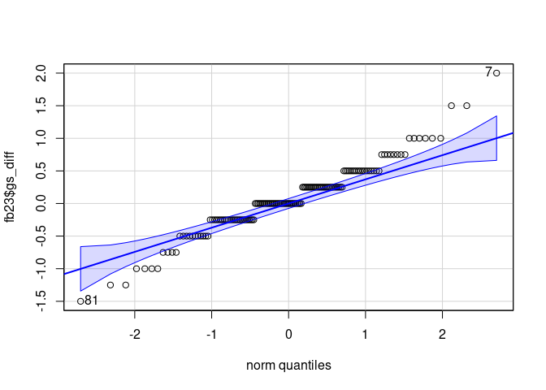<!-- -->

```
## [1]  7 81
```

Der QQ-Plot lässt erkennen das es Ausreißer an beiden Extremen gibt die wahrscheinlich dazu geführt haben das der Shpiro-Wilk-Test signifikant ausfiehl. Wir fahren dennoch wie zuvor über den *zentralen Grenzwertsatz* begründet mit dem Test fort.

#### `t.test`


``` r
t.test(fb23$gs_post, fb23$gs_pre,
       paired = TRUE,
       alternative = "two.sided",
       conf.level = 0.95)
```

```
## 
## 	Paired t-test
## 
## data:  fb23$gs_post and fb23$gs_pre
## t = 1.5647, df = 145, p-value = 0.1198
## alternative hypothesis: true mean difference is not equal to 0
## 95 percent confidence interval:
##  -0.01802428  0.15501058
## sample estimates:
## mean difference 
##      0.06849315
```


Im Vergleich mit dem t-Test für unabhängige Stichproben haben wir das Argument `paired` auf `TRUE` gesetzt, per default ist es auf `FALSE`. Damit sagen wir der Funktion das es sich um abhängige Messungen handelt, den Rest erledigt R.

Anhand der Ergebnisse können wir nun folgende Aussage treffen: Die Stimmung der Psychologiestudierenden vor und nach dem Besuch des ersten Statistik Praktika unterscheidet sich nicht signifikant. ($t$(145) = 1.56, $p$ = 0.12).

#### Effektstärke


``` r
effsize::cohen.d(fb23$gs_post, fb23$gs_pre, # Messzeitpunkte
                 paired = TRUE,             # abhängige Stichproben
                 conf.level = 0.95,         # alpha = 5%
                 within = FALSE,            # Korrektur die wir nicht brauchen         
                 na.rm = TRUE)              # da NAs in den Daten vorkommen
```

```
## 
## Cohen's d
## 
## d estimate: 0.1294956 (negligible)
## 95 percent confidence interval:
##      lower      upper 
## -0.0340734  0.2930646
```

***

